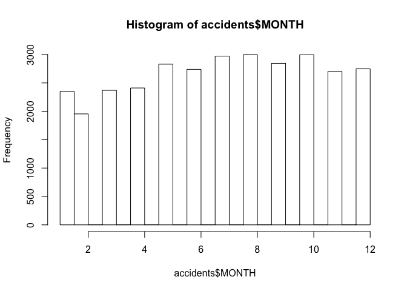
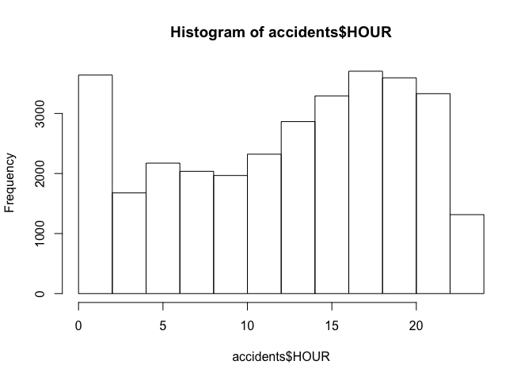
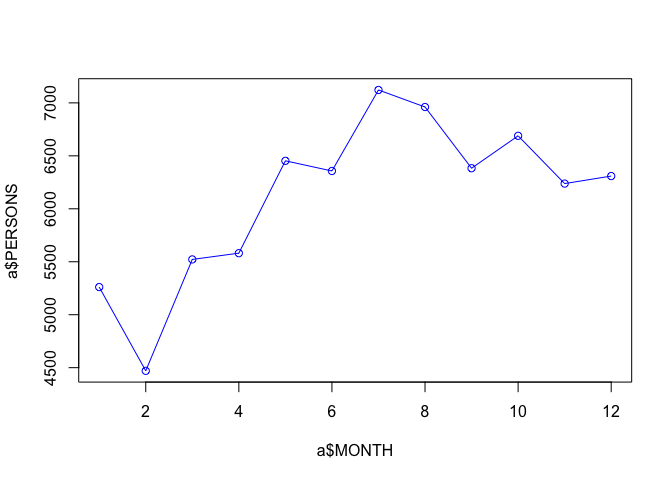
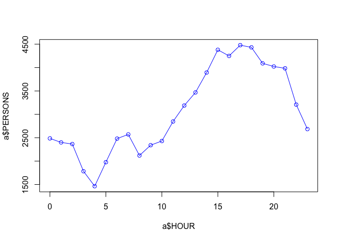

Week 2: R Exercise and Homework
================

Analysis Routine
================

On August 29, DJ Patil, the Chief Data Scientist in the White House Office of Science and Technology Policy, and Mark Rosekind, the Administrator of the National Highway Traffic Safety Administration (NHTSA) announced the release of a data set documenting all traffic fatalities occurring in the United States in 2015. In this excise, we tried to use the command we have learned to analyze this dataset.

Analysis Routine: Data Import
-----------------------------

-   To get started with this exercise, direct your R session to a dedicated workshop directory and download into this directory the following sample tables. Then import the files into Excel and save them as tab delimited text files.

    -   [accident](./accident.csv)
    -   [Description of the fields in the dataset](ftp://ftp.nhtsa.dot.gov/FARS/FARS-DOC/Analytical%20User%20Guide/USERGUIDE-2015.pdf)
-   Import the tables into R

``` r
accidents <- read.delim(file="accident.csv", header=T, sep=",") 
head(accidents)
```

    ##   STATE ST_CASE VE_TOTAL VE_FORMS PVH_INVL PEDS PERNOTMVIT PERMVIT PERSONS
    ## 1     1   10001        1        1        0    0          0       1       1
    ## 2     1   10002        1        1        0    0          0       1       1
    ## 3     1   10003        1        1        0    0          0       2       2
    ## 4     1   10004        1        1        0    0          0       1       1
    ## 5     1   10005        2        2        0    0          0       2       2
    ## 6     1   10006        1        1        0    0          0       2       2
    ##   COUNTY CITY DAY MONTH YEAR DAY_WEEK HOUR MINUTE NHS RUR_URB FUNC_SYS
    ## 1    127    0   1     1 2015        5    2     40   0       1        3
    ## 2     83    0   1     1 2015        5   22     13   1       1        1
    ## 3     11    0   1     1 2015        5    1     25   0       1        3
    ## 4     45    0   4     1 2015        1    0     57   0       1        4
    ## 5     45 2050   7     1 2015        4    7      9   0       2        3
    ## 6    111    0   8     1 2015        5    9     59   0       1        5
    ##   RD_OWNER ROUTE  TWAY_ID          TWAY_ID2 MILEPT LATITUDE LONGITUD
    ## 1        1     3     SR-5                     1754       34      -87
    ## 2        1     1     I-65                     3604       35      -87
    ## 3        1     2  US-SR 6                     1958       32      -86
    ## 4        1     3    SR-27                      566       31      -86
    ## 5        1     2 US-SR 53 HINTON WATERS AVE    308       31      -86
    ## 6        2     4    CR-82                        0       33      -85
    ##   SP_JUR HARM_EV MAN_COLL RELJCT1 RELJCT2 TYP_INT WRK_ZONE REL_ROAD
    ## 1      0      35        0       0       1       1        0        4
    ## 2      0      34        0       0       1       1        0        3
    ## 3      0      42        0       0       1       1        0        4
    ## 4      0      53        0       0       1       1        0        4
    ## 5      0      12        6       0       2       3        0        1
    ## 6      0       1        0       0       1       1        0        4
    ##   LGT_COND WEATHER1 WEATHER2 WEATHER SCH_BUS    RAIL NOT_HOUR NOT_MIN
    ## 1        2        1        0       1       0 0000000       99      99
    ## 2        2       10        0      10       0 0000000       99      99
    ## 3        2        1        0       1       0 0000000       99      99
    ## 4        2       10        0      10       0 0000000       99      99
    ## 5        1        1        0       1       0 0000000       99      99
    ## 6        1        1        0       1       0 0000000       99      99
    ##   ARR_HOUR ARR_MIN HOSP_HR HOSP_MN CF1 CF2 CF3 FATALS DRUNK_DR
    ## 1        2      58      88      88   0   0   0      1        1
    ## 2       22      20      88      88   0   0   0      1        0
    ## 3        1      45      99      99   0   0   0      1        1
    ## 4        1      15      88      88   0   0   0      1        1
    ## 5        7      16      88      88   0   0   0      1        0
    ## 6       10      17      99      99   0   0   0      1        0

``` r
names(accidents)
```

    ##  [1] "STATE"      "ST_CASE"    "VE_TOTAL"   "VE_FORMS"   "PVH_INVL"  
    ##  [6] "PEDS"       "PERNOTMVIT" "PERMVIT"    "PERSONS"    "COUNTY"    
    ## [11] "CITY"       "DAY"        "MONTH"      "YEAR"       "DAY_WEEK"  
    ## [16] "HOUR"       "MINUTE"     "NHS"        "RUR_URB"    "FUNC_SYS"  
    ## [21] "RD_OWNER"   "ROUTE"      "TWAY_ID"    "TWAY_ID2"   "MILEPT"    
    ## [26] "LATITUDE"   "LONGITUD"   "SP_JUR"     "HARM_EV"    "MAN_COLL"  
    ## [31] "RELJCT1"    "RELJCT2"    "TYP_INT"    "WRK_ZONE"   "REL_ROAD"  
    ## [36] "LGT_COND"   "WEATHER1"   "WEATHER2"   "WEATHER"    "SCH_BUS"   
    ## [41] "RAIL"       "NOT_HOUR"   "NOT_MIN"    "ARR_HOUR"   "ARR_MIN"   
    ## [46] "HOSP_HR"    "HOSP_MN"    "CF1"        "CF2"        "CF3"       
    ## [51] "FATALS"     "DRUNK_DR"

-   Preprocess the data

``` r
#Only include data with correct long/lat coordinates and valid hours
accidents <- subset(accidents, LONGITUD!=999.99990 &  LONGITUD!=888.88880 & LONGITUD!=777.77770 & HOUR<30)
```

-   Aggregate the number of accidents by month

``` r
hist(accidents$MONTH)
```



-   Aggregate the number of accidents by hour

``` r
hist(accidents$HOUR)
```



-   Aggregate the number of persons by month

``` r
a<-aggregate(PERSONS~MONTH, accidents,sum)
plot(a$MONTH, a$PERSONS, type='o', col='blue')
```



-   Aggregate the number of persons by hour

``` r
a<-aggregate(PERSONS~HOUR, accidents,sum)
plot(a$HOUR,a$PERSONS, type='o', col='blue' )
```



Homework
========

Based on the `accident` dataset, please write a function (see the [Rbascis.md](./Rbasics.md)), say named `GetStateFatality(stateName, display)`, to return the monthly fatalites of at state `stateName` and if `display=TRUE` also to plot the fatalities by months. The following is the code for each U.S. states and Puerto Rico:

01 Alabama 31 Nebraska 02 Alaska 32 Nevada 04 Arizona 33 New Hampshire 05 Arkansas 34 New Jersey 06 California 35 New Mexico 08 Colorado 36 New York 09 Connecticut 37 North Carolina 10 Delaware 38 North Dakota 11 District of Columbia 39 Ohio 12 Florida 40 Oklahoma 13 Georgia 41 Oregon 15 Hawaii 42 Pennsylvania 16 Idaho 43 Puerto Rico 17 Illinois 44 Rhode Island 18 Indiana 45 South Carolina 19 Iowa 46 South Dakota 20 Kansas 47 Tennessee 21 Kentucky 48 Texas 22 Louisiana 49 Utah 23 Maine 50 Vermont 24 Maryland 52 Virgin Islands (since 2004) 25 Massachusetts 51 Virginia 26 Michigan 53 Washington 27 Minnesota 54 West Virginia 28 Mississippi 55 Wisconsin 29 Missouri 56 Wyoming 30 Montana
