Week 2: Getting started with R
================

Overview
========

What is R?
----------

-   R is a programming environment
    -   uses a well-developed but simple programming language
    -   allows for rapid development of new tools according to user demand
    -   these tools are distributed as packages, which any user can download to customize the R environment

Why using R?
------------

-   Complete statistical environment and programming language
-   Efficient functions and data structures for data analysis
-   Powerful graphics
-   Access to fast growing number of analysis packages
-   Most widely used language in applied statistics
-   Is standard for data mining and statistical analysis
-   Technical advantages: free, open-source, available for all OSs

R Working Environments
----------------------

Some R working environments with support for syntax highlighting and utilities to send code to the R console:

-   [RStudio](https://www.rstudio.com/products/rstudio/features): excellent choice for beginners ([Cheat Sheet](http://www.rstudio.com/wp-content/uploads/2016/01/rstudio-IDE-cheatsheet.pdf))
-   Basic R code editors provided by Rguis
-   [gedit](https://wiki.gnome.org/Apps/Gedit), [Rgedit](http://rgedit.sourceforge.net/), [RKWard](https://rkward.kde.org/), [Eclipse](http://www.walware.de/goto/statet), [Tinn-R](http://www.sciviews.org/Tinn-R/), [Notepad++](https://notepad-plus-plus.org/), [NppToR](http://sourceforge.net/projects/npptor/)
-   [Vim-R-Tmux](http://manuals.bioinformatics.ucr.edu/home/programming-in-r/vim-r): R working environment based on vim and tmux
-   [Emacs](http://www.xemacs.org/Download/index.html) ([ESS add-on package](http://ess.r-project.org/))

### Example: RStudio

New integrated development environment (IDE) for [R](http://www.rstudio.com/ide/download/). Highly functional for both beginners and advanced.

<center>

</center>
<center>
RStudio IDE
</center>
Some userful shortcuts: `Ctrl+Enter` (send code), `Ctrl+Shift+C` (comment/uncomment), `Ctrl+1/2` (switch window focus)

Getting Started
===============

Installation of R and packages
------------------------------

1.  Base R and most R packages are available for download from the Comprehensive R Archive Network (CRAN)
    -   [http://www.r-project.org/](http://www.r-project.org/J)
    -   base R comes with a number of basic data management, analysis, and graphical tools
    -   R's power and flexibility, however, lie in its array of packages (currently more 8,000!)

2.  Install RStudio from [RStudio](http://www.rstudio.com/ide/download).

3.  Install CRAN Packages from R console like this:

    ``` r
    install.packages(c("pkg1", "pkg2")) 
    install.packages("pkg.zip", repos=NULL)
    ```

    Startup and Closing R
    ---------------------

-   *Starting R*: The R GUI versions, including RStudio, under Windows and Mac OS X can be opened by double-clicking their icons. Alternatively, one can start it by typing `R` in a terminal (default under Linux).

-   *Startup/Closing Behavior*: The R environment is controlled by hidden files in the startup directory: `.RData`, `.Rhistory` and `.Rprofile` (optional).

-   *Closing R*:

    ``` r
    q()  
    ```

        Save workspace image? [y/n/c]:

-   *Note*: When responding with `y`, then the entire R workspace will be written to the `.RData` file which can become very large. Often it is sufficient to just save an analysis protocol in an R source file. This way one can quickly regenerate all data sets and objects.

Navigating directories
----------------------

-   Create an object with the assignment operator `<-` or `=`

    ``` r
    object <- ...
    ```

-   List objects in current R session

    ``` r
    ls()
    ```

-   Return content of current working directory

    ``` r
    dir()
    ```

-   Return path of current working directory

    ``` r
    getwd()
    ```

-   Change current working directory

    ``` r
    setwd("/home/user")
    ```

    Basic Syntax
    ------------

-   General R command syntax

    ``` r
    object <- function_name(arguments) 
    object <- object[arguments] 
    ```

-   Finding help

    ``` r
    ?function_name
    ```

-   Load a library/package

    ``` r
    library("my_library") 
    ```

-   List functions defined by a library

    ``` r
    library(help="my_library")
    ```

-   Load library manual (PDF or HTML file)

    ``` r
    vignette("my_library") 
    ```

-   Execute an R script from within R

    ``` r
    source("my_script.R")
    ```

-   Execute an R script from command-line (the first of the three options is preferred)

    ``` sh
    $ Rscript my_script.R
    $ R CMD BATCH my_script.R 
    $ R --slave < my_script.R 
    ```

Data Types
----------

-   Numeric data

    Example: `1, 2, 3, ...`

    ``` r
    x <- c(1, 2, 3)
    x
    ```

        ## [1] 1 2 3

    ``` r
    is.numeric(x)
    ```

        ## [1] TRUE

    ``` r
    as.character(x)
    ```

        ## [1] "1" "2" "3"

-   Character data

    Example: `"a", "b", "c", ...`

    ``` r
    x <- c("1", "2", "3")
    x
    ```

        ## [1] "1" "2" "3"

    ``` r
    is.character(x)
    ```

        ## [1] TRUE

    ``` r
    as.numeric(x)
    ```

        ## [1] 1 2 3

-   Complex data

    Example: mix of both

    ``` r
    c(1, "b", 3)
    ```

        ## [1] "1" "b" "3"

-   Logical data

    Example: `TRUE` of `FALSE`

    ``` r
    x <- 1:10 < 5
    x  
    ```

        ##  [1]  TRUE  TRUE  TRUE  TRUE FALSE FALSE FALSE FALSE FALSE FALSE

    ``` r
    !x
    ```

        ##  [1] FALSE FALSE FALSE FALSE  TRUE  TRUE  TRUE  TRUE  TRUE  TRUE

    ``` r
    which(x) # Returns index for the 'TRUE' values in logical vector
    ```

        ## [1] 1 2 3 4

Data objects
------------

### Object types

-   Vectors (1D)

    Definition: `numeric` or `character`

    ``` r
    myVec <- 1:10; names(myVec) <- letters[1:10]  
    myVec[1:5]
    ```

        ## a b c d e 
        ## 1 2 3 4 5

    ``` r
    myVec[c(2,4,6,8)]
    ```

        ## b d f h 
        ## 2 4 6 8

    ``` r
    myVec[c("b", "d", "f")]
    ```

        ## b d f 
        ## 2 4 6

-   Factors (1D)

    Definition: vectors with grouping information

    ``` r
    factor(c("dog", "cat", "mouse", "dog", "dog", "cat"))
    ```

        ## [1] dog   cat   mouse dog   dog   cat  
        ## Levels: cat dog mouse

-   Matrices (2D)

    Definition: two dimensional structures with data of same type

    ``` r
    myMA <- matrix(1:30, 3, 10, byrow = TRUE) 
    class(myMA)
    ```

        ## [1] "matrix"

    ``` r
    myMA[1:2,]
    ```

        ##      [,1] [,2] [,3] [,4] [,5] [,6] [,7] [,8] [,9] [,10]
        ## [1,]    1    2    3    4    5    6    7    8    9    10
        ## [2,]   11   12   13   14   15   16   17   18   19    20

    ``` r
    myMA[1, , drop=FALSE]
    ```

        ##      [,1] [,2] [,3] [,4] [,5] [,6] [,7] [,8] [,9] [,10]
        ## [1,]    1    2    3    4    5    6    7    8    9    10

-   Data Frames (2D)

    Definition: two dimensional objects with data of variable types

    ``` r
    myDF <- data.frame(Col1=1:10, Col2=10:1) 
    myDF[1:2, ]
    ```

        ##   Col1 Col2
        ## 1    1   10
        ## 2    2    9

-   Arrays

    Definition: data structure with one, two or more dimensions

-   Lists

    Definition: containers for any object type

    ``` r
    myL <- list(name="Fred", wife="Mary", no.children=3, child.ages=c(4,7,9)) 
    myL
    ```

        ## $name
        ## [1] "Fred"
        ## 
        ## $wife
        ## [1] "Mary"
        ## 
        ## $no.children
        ## [1] 3
        ## 
        ## $child.ages
        ## [1] 4 7 9

    ``` r
    myL[[4]][1:2] 
    ```

        ## [1] 4 7

-   Functions

    Definition: piece of code

    ``` r
    myfct <- function(arg1, arg2, ...) { 
        function_body 
    }
    ```

### Subsetting of data objects

-   Subsetting by positive or negative index/position numbers

    ``` r
    myVec <- 1:26; names(myVec) <- LETTERS 
    myVec[1:4]
    ```

        ## A B C D 
        ## 1 2 3 4

-   Subsetting by same length logical vectors

    ``` r
    myLog <- myVec > 10
    myVec[myLog] 
    ```

        ##  K  L  M  N  O  P  Q  R  S  T  U  V  W  X  Y  Z 
        ## 11 12 13 14 15 16 17 18 19 20 21 22 23 24 25 26

-   Subsetting by field names

    ``` r
    myVec[c("B", "K", "M")]
    ```

        ##  B  K  M 
        ##  2 11 13

-   Subset with `$` sign: references a single column or list component by its name

    ``` r
    iris$Species[1:8]
    ```

        ## [1] setosa setosa setosa setosa setosa setosa setosa setosa
        ## Levels: setosa versicolor virginica

Important Utilities
-------------------

-   Combining Objects

    The `c` function combines vectors and lists

    ``` r
    c(1, 2, 3)
    ```

        ## [1] 1 2 3

    ``` r
    x <- 1:3; y <- 101:103
    c(x, y)
    ```

        ## [1]   1   2   3 101 102 103

    ``` r
    iris$Species[1:8]
    ```

        ## [1] setosa setosa setosa setosa setosa setosa setosa setosa
        ## Levels: setosa versicolor virginica

    The `cbind` and `rbind` functions can be used to append columns and rows, respecively.

    ``` r
    ma <- cbind(x, y)
    ma
    ```

        ##      x   y
        ## [1,] 1 101
        ## [2,] 2 102
        ## [3,] 3 103

    ``` r
    rbind(ma, ma)
    ```

        ##      x   y
        ## [1,] 1 101
        ## [2,] 2 102
        ## [3,] 3 103
        ## [4,] 1 101
        ## [5,] 2 102
        ## [6,] 3 103

-   Accessing Dimensions of Objects

    Length and dimension information of objects

    ``` r
    length(iris$Species)
    ```

        ## [1] 150

    ``` r
    dim(iris)
    ```

        ## [1] 150   5

-   Accessing Name Slots of Objects

    Accessing row and column names of 2D objects

    ``` r
    rownames(iris)[1:8]
    ```

        ## [1] "1" "2" "3" "4" "5" "6" "7" "8"

    ``` r
    colnames(iris)
    ```

        ## [1] "Sepal.Length" "Sepal.Width"  "Petal.Length" "Petal.Width" 
        ## [5] "Species"

-   Return name field of vectors and lists

    ``` r
    names(myVec)
    ```

        ##  [1] "A" "B" "C" "D" "E" "F" "G" "H" "I" "J" "K" "L" "M" "N" "O" "P" "Q"
        ## [18] "R" "S" "T" "U" "V" "W" "X" "Y" "Z"

    ``` r
    names(myL)
    ```

        ## [1] "name"        "wife"        "no.children" "child.ages"

-   Sorting Objects

    The function `sort` returns a vector in ascending or descending order

    ``` r
    sort(10:1)
    ```

        ##  [1]  1  2  3  4  5  6  7  8  9 10

    The function `order` returns a sorting index for sorting an object

    ``` r
    sortindex <- order(iris[,1], decreasing = FALSE)
    sortindex[1:12]
    ```

        ##  [1] 14  9 39 43 42  4  7 23 48  3 30 12

    ``` r
    iris[sortindex,][1:2,]
    ```

        ##    Sepal.Length Sepal.Width Petal.Length Petal.Width Species
        ## 14          4.3         3.0          1.1         0.1  setosa
        ## 9           4.4         2.9          1.4         0.2  setosa

    ``` r
    sortindex <- order(-iris[,1]) # Same as decreasing=TRUE
    ```

    Sorting multiple columns

    ``` r
    iris[order(iris$Sepal.Length, iris$Sepal.Width),][1:2,]
    ```

        ##    Sepal.Length Sepal.Width Petal.Length Petal.Width Species
        ## 14          4.3         3.0          1.1         0.1  setosa
        ## 9           4.4         2.9          1.4         0.2  setosa

Operators and Calculations
--------------------------

-   Comparison Operators

    Comparison operators: `==`, `!=`, `<`, `>`, `<=`, `>=`

    ``` r
    1==1
    ```

        ## [1] TRUE

    Logical operators: AND: `&`, OR: `|`, NOT: `!`

    ``` r
    x <- 1:10; y <- 10:1
    x > y & x > 5
    ```

        ##  [1] FALSE FALSE FALSE FALSE FALSE  TRUE  TRUE  TRUE  TRUE  TRUE

-   Basic Calculations

    To look up math functions, see Function Index [here](http://cran.at.r-project.org/doc/manuals/R-intro.html#Function-and-variable-index)

    ``` r
    x + y
    ```

        ##  [1] 11 11 11 11 11 11 11 11 11 11

    ``` r
    sum(x)
    ```

        ## [1] 55

    ``` r
    mean(x)
    ```

        ## [1] 5.5

    ``` r
    apply(iris[1:6,1:3], 1, mean) 
    ```

        ##        1        2        3        4        5        6 
        ## 3.333333 3.100000 3.066667 3.066667 3.333333 3.666667

Reading and Writing External Data
---------------------------------

-   Import of tabular data

    Import of a tab-delimited tabular file

    ``` r
    myDF <- read.delim("myData.xls", sep="\t")
    ```

    Import of Excel file. Note: working with tab- or comma-delimited files is more flexible and preferred.

    ``` r
    library(gdata)
    myDF <- read.xls"myData.xls")
    ```

    <!--
    Import of Google Sheets. The following example imports a sample Google Sheet from [here](https://docs.google.com/spreadsheets/d/1U-32UcwZP1k3saKeaH1mbvEAOfZRdNHNkWK2GI1rpPM/edit#gid=472150521).
    Detailed instructions for interacting from R with Google Sheets with the required `googlesheets` package are [here](https://github.com/jennybc/googlesheets).


    ```r
    library("googlesheets"); library("dplyr"); library(knitr)
    gs_auth() # Creates authorizaton token (.httr-oauth) in current directory if not present
    sheetid <-"1U-32UcwZP1k3saKeaH1mbvEAOfZRdNHNkWK2GI1rpPM"
    gap <- gs_key(sheetid)
    mysheet <- gs_read(gap, skip=4)
    myDF <- as.data.frame(mysheet)
    myDF
    ```
    -->
-   Export of tabular data

    ``` r
    write.table(myDF, file="myfile.xls", sep="\t", quote=FALSE, col.names=NA)
    ```

-   Line-wise import

    ``` r
    myDF <- readLines("myData.txt")
    ```

-   Line-wise export

    ``` r
    writeLines(month.name, "myData.txt")
    ```

-   Copy and paste into R

    On Windows/Linux systems

    ``` r
    read.delim("clipboard") 
    ```

    On Mac OS X systems

    ``` r
    read.delim(pipe("pbpaste")) 
    ```

-   Copy and paste from R

    On Windows/Linux systems

    ``` r
    write.table(iris, "clipboard", sep="\t", col.names=NA, quote=F) 
    ```

    On Mac OS X systems

    ``` r
    zz <- pipe('pbcopy', 'w')
    write.table(iris, zz, sep="\t", col.names=NA, quote=F)
    close(zz) 
    ```

Useful R Functions
------------------

-   Unique entries

    Make vector entries unique with `unique`

    ``` r
    length(iris$Sepal.Length)
    ```

        ## [1] 150

    ``` r
    length(unique(iris$Sepal.Length))
    ```

        ## [1] 35

-   Count occurrences

    Count occurrences of entries with `table`

    ``` r
    table(iris$Species)
    ```

        ## 
        ##     setosa versicolor  virginica 
        ##         50         50         50

-   Aggregate data

    Compute aggregate statistics with `aggregate`

    ``` r
    aggregate(iris[,1:4], by=list(iris$Species), FUN=mean, na.rm=TRUE)
    ```

        ##      Group.1 Sepal.Length Sepal.Width Petal.Length Petal.Width
        ## 1     setosa        5.006       3.428        1.462       0.246
        ## 2 versicolor        5.936       2.770        4.260       1.326
        ## 3  virginica        6.588       2.974        5.552       2.026

-   Intersect data

    Compute intersect between two vectors with `%in%`

    ``` r
    month.name %in% c("May", "July")
    ```

        ##  [1] FALSE FALSE FALSE FALSE  TRUE FALSE  TRUE FALSE FALSE FALSE FALSE
        ## [12] FALSE

-   Merge data frames

    Join two data frames by common field entries with `merge` (here row names `by.x=0`). To obtain only the common rows, change `all=TRUE` to `all=FALSE`. To merge on specific columns, refer to them by their position numbers or their column names.

    ``` r
    frame1 <- iris[sample(1:length(iris[,1]), 30), ]
    frame1[1:2,]
    ```

        ##     Sepal.Length Sepal.Width Petal.Length Petal.Width   Species
        ## 42           4.5         2.3          1.3         0.3    setosa
        ## 108          7.3         2.9          6.3         1.8 virginica

    ``` r
    dim(frame1)
    ```

        ## [1] 30  5

    ``` r
    my_result <- merge(frame1, iris, by.x = 0, by.y = 0, all = TRUE)
    dim(my_result)
    ```

        ## [1] 150  11

    Graphics in R
    =============

Advantages
----------

-   Powerful environment for visualizing scientific data
-   Integrated graphics and statistics infrastructure
-   Publication quality graphics
-   Fully programmable
-   Highly reproducible
-   Full [LaTeX](http://www.latex-project.org/) and Markdown support via `knitr` and `R markdown`
-   Vast number of R packages with graphics utilities

Documentation for R Graphics
----------------------------

\*\* General \*\*

-   Graphics Task Page - [URL](http://cran.r-project.org/web/views/Graphics.html)
-   R Graph Gallery - [URL](http://addictedtor.free.fr/graphiques/allgraph.php)
-   R Graphical Manual - [URL](http://cged.genes.nig.ac.jp/RGM2/index.php)
-   Paul Murrell's book R (Grid) Graphics - [URL](http://www.stat.auckland.ac.nz/~paul/RGraphics/rgraphics.html)

**Interactive graphics **

-   rggobi\` (GGobi) - [URL](http://www.ggobi.org/)
-   `iplots` - [URL](http://www.rosuda.org/iplots/)
-   Open GL (`rgl`) - [URL](http://rgl.neoscientists.org/gallery.shtml)

Graphics Environments
---------------------

**Viewing and saving graphics in R**

-   On-screen graphics
-   postscript, pdf, svg
-   jpeg, png, wmf, tiff, ...

**Four major graphic environments**

1.  Low-level infrastructure

-   R Base Graphics (low- and high-level)
-   `grid`: [Manual](http://www.stat.auckland.ac.nz/~paul/grid/grid.html)

1.  High-level infrastructure \\begin{itemize}

-   `lattice`: [Manual](http://lmdvr.r-forge.r-project.org), [Intro](http://www.his.sunderland.ac.uk/~cs0her/Statistics/UsingLatticeGraphicsInR.htm), [Book](http://www.amazon.com/Lattice-Multivariate-Data-Visualization-Use/dp/0387759689)
-   `ggplot2`: [Manual](http://had.co.nz/ggplot2/), [Intro](http://www.ling.upenn.edu/~joseff/rstudy/summer2010_ggplot2_intro.html), [Book](http://had.co.nz/ggplot2/book/)

Base Graphics: Overview
-----------------------

**Important high-level plotting functions**

-   `plot`: generic x-y plotting
-   `barplot`: bar plots
-   `boxplot`: box-and-whisker plot
-   `hist`: histograms
-   `pie`: pie charts
-   `dotchart`: cleveland dot plots
-   `image, heatmap, contour, persp`: functions to generate image-like plots
-   `qqnorm, qqline, qqplot`: distribution comparison plots
-   `pairs, coplot`: display of multivariant data

**Help on graphics functions**

-   `?myfct`
-   `?plot`
-   `?par`

### Preferred Object Types

-   Matrices and data frames
-   Vectors
-   Named vectors

Scatter Plots
-------------

### Basic Scatter Plot

-   Sample data set for subsequent plots

    ``` r
    set.seed(1410)
    y <- matrix(runif(30), ncol=3, dimnames=list(letters[1:10], LETTERS[1:3]))
    ```

-   Plot data

    ``` r
    plot(y[,1], y[,2]) 
    ```

    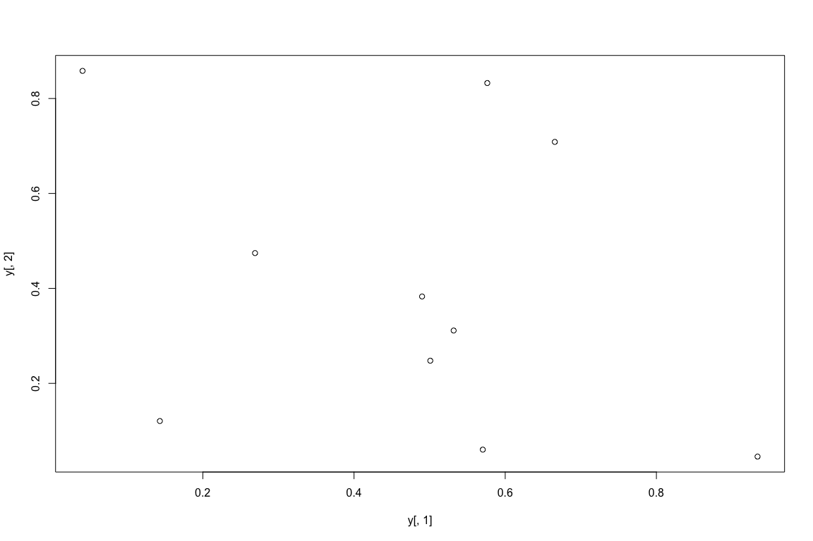

### All pairs

    ```r
    pairs(y) 
    ```

    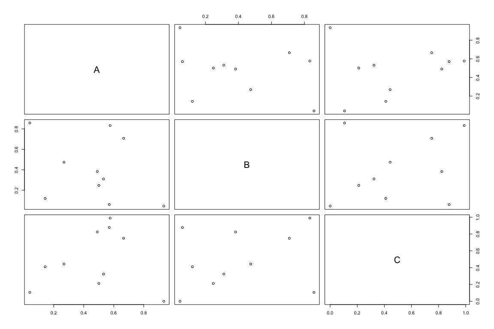

### With labels

    ```r
    plot(y[,1], y[,2], pch=20, col="red", main="Symbols and Labels")
    text(y[,1]+0.03, y[,2], rownames(y))
    ```

    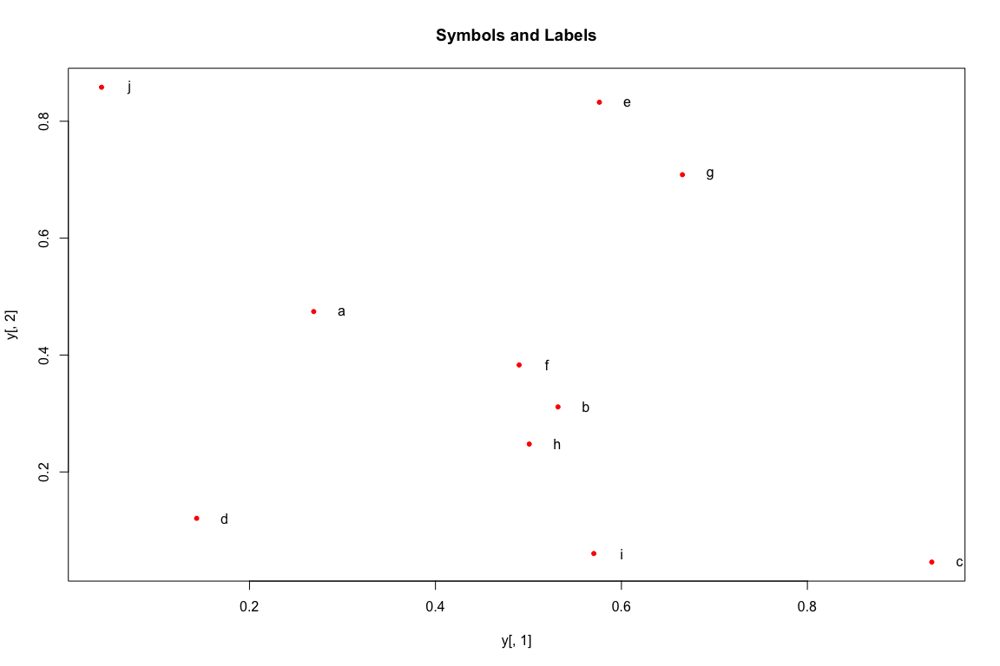

More examples
-------------

-   Print instead of symbols the row names

    ``` r
    plot(y[,1], y[,2], type="n", main="Plot of Labels")
    text(y[,1], y[,2], rownames(y)) 
    ```

    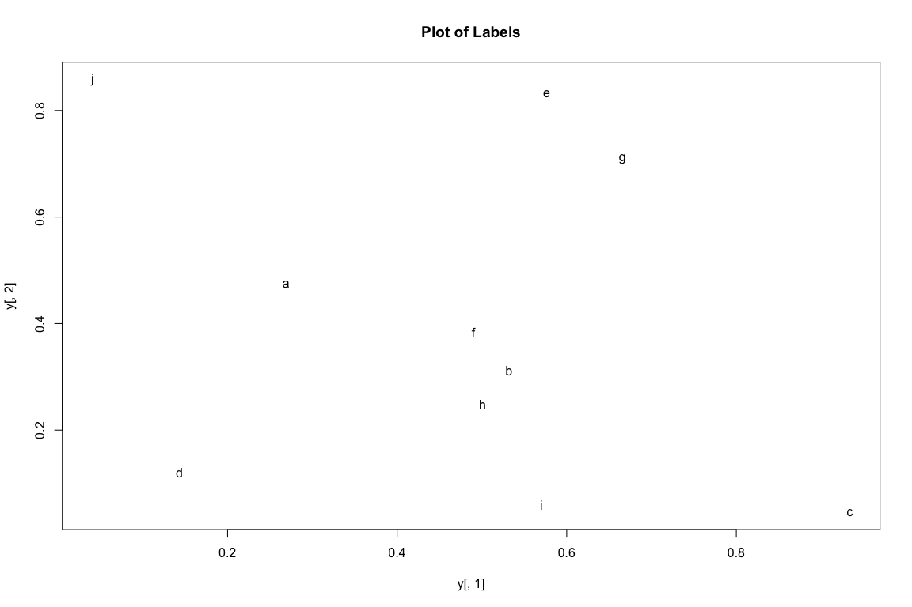

-   Usage of important plotting parameters

    ``` r
    grid(5, 5, lwd = 2) 
    op <- par(mar=c(8,8,8,8), bg="lightblue")
    plot(y[,1], y[,2], type="p", col="red", cex.lab=1.2, cex.axis=1.2, 
         cex.main=1.2, cex.sub=1, lwd=4, pch=20, xlab="x label", 
         ylab="y label", main="My Main", sub="My Sub")
    par(op)
    ```

-   Important arguments

    -   `mar`: specifies the margin sizes around the plotting area in order: `c(bottom, left, top, right)`
    -   `col`: color of symbols
    -   `pch`: type of symbols, samples: `example(points)`
    -   `lwd`: size of symbols
    -   `cex`: control font sizes
    -   For details see `?par`

### Add regression line

    ```r
    plot(y[,1], y[,2])
    myline <- lm(y[,2]~y[,1]); abline(myline, lwd=2) 
    ```

    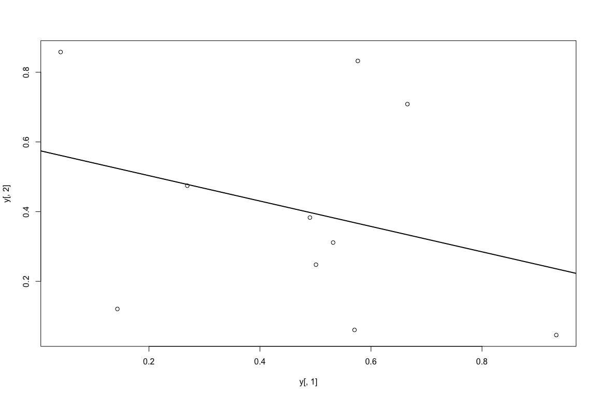

    ```r
    summary(myline) 
    ```

    ```
    ## 
    ## Call:
    ## lm(formula = y[, 2] ~ y[, 1])
    ## 
    ## Residuals:
    ##      Min       1Q   Median       3Q      Max 
    ## -0.40357 -0.17912 -0.04299  0.22147  0.46623 
    ## 
    ## Coefficients:
    ##             Estimate Std. Error t value Pr(>|t|)  
    ## (Intercept)   0.5764     0.2110   2.732   0.0258 *
    ## y[, 1]       -0.3647     0.3959  -0.921   0.3839  
    ## ---
    ## Signif. codes:  0 '***' 0.001 '**' 0.01 '*' 0.05 '.' 0.1 ' ' 1
    ## 
    ## Residual standard error: 0.3095 on 8 degrees of freedom
    ## Multiple R-squared:  0.09589,    Adjusted R-squared:  -0.01712 
    ## F-statistic: 0.8485 on 1 and 8 DF,  p-value: 0.3839
    ```

### Log scale

    - Same plot as above, but on log scale


    ```r
    plot(y[,1], y[,2], log="xy") 
    ```

    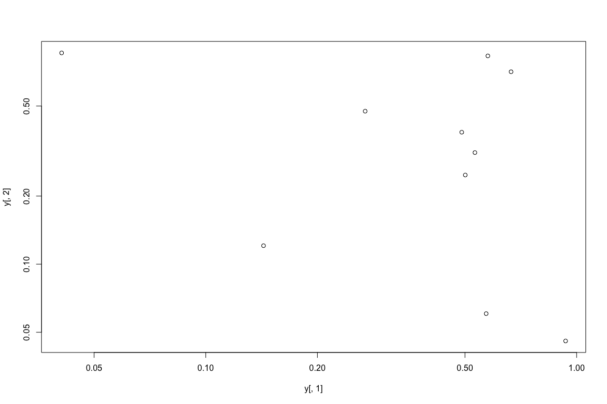

### Add a mathematical expression

``` r
plot(y[,1], y[,2]); text(y[1,1], y[1,2], expression(sum(frac(1,sqrt(x^2*pi)))), cex=1.3) 
```

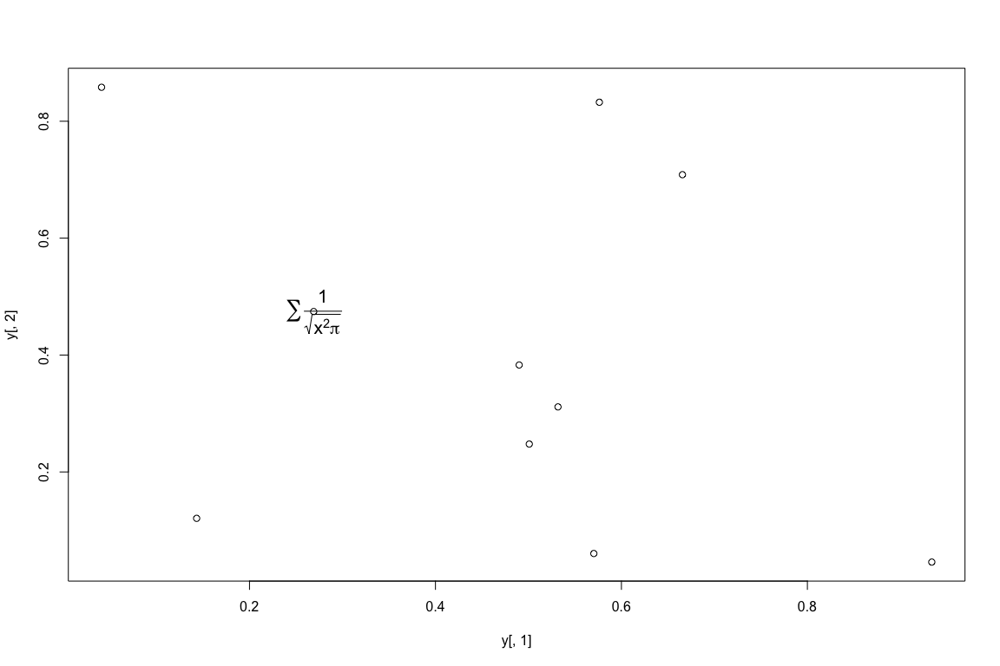

Line Plots
----------

### Single data set

``` r
plot(y[,1], type="l", lwd=2, col="blue") 
```

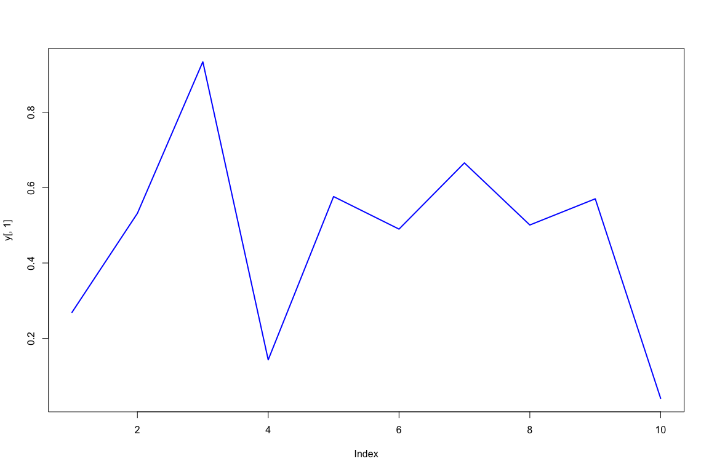

### Many Data Sets

Plots line graph for all columns in data frame `y`. The `split.screen` function is used in this example in a for loop to overlay several line graphs in the same plot.

``` r
split.screen(c(1,1)) 
```

    ## [1] 1

``` r
plot(y[,1], ylim=c(0,1), xlab="Measurement", ylab="Intensity", type="l", lwd=2, col=1)
for(i in 2:length(y[1,])) { 
    screen(1, new=FALSE)
    plot(y[,i], ylim=c(0,1), type="l", lwd=2, col=i, xaxt="n", yaxt="n", ylab="", xlab="", main="", bty="n") 
}
```

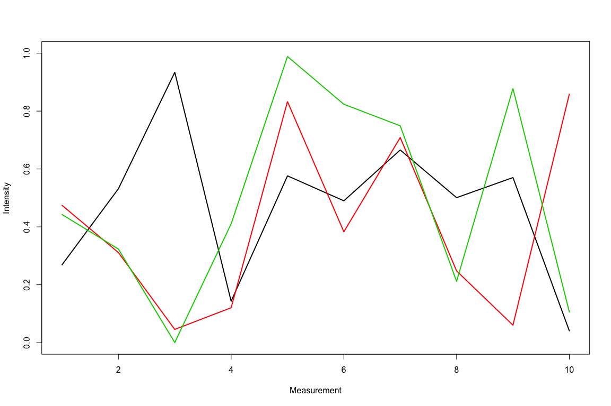

``` r
close.screen(all=TRUE) 
```

Bar Plots
---------

### Basics

``` r
barplot(y[1:4,], ylim=c(0, max(y[1:4,])+0.3), beside=TRUE, legend=letters[1:4]) 
text(labels=round(as.vector(as.matrix(y[1:4,])),2), x=seq(1.5, 13, by=1) + sort(rep(c(0,1,2), 4)), y=as.vector(as.matrix(y[1:4,]))+0.04) 
```

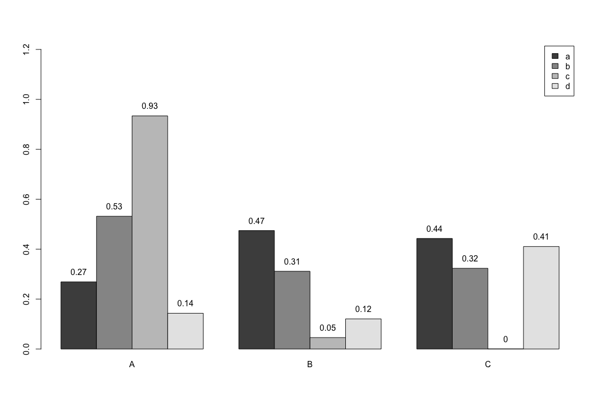

### Error Bars

``` r
bar <- barplot(m <- rowMeans(y) * 10, ylim=c(0, 10))
stdev <- sd(t(y))
arrows(bar, m, bar, m + stdev, length=0.15, angle = 90)
```

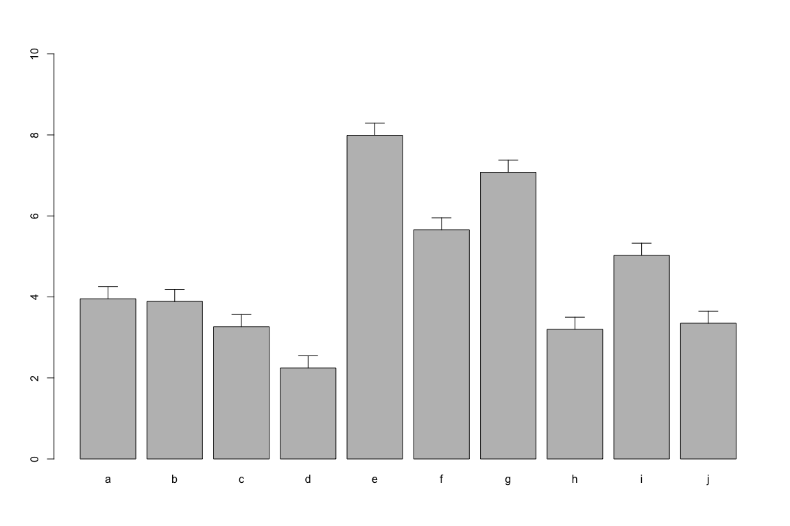

Histograms
----------

``` r
hist(y, freq=TRUE, breaks=10)
```

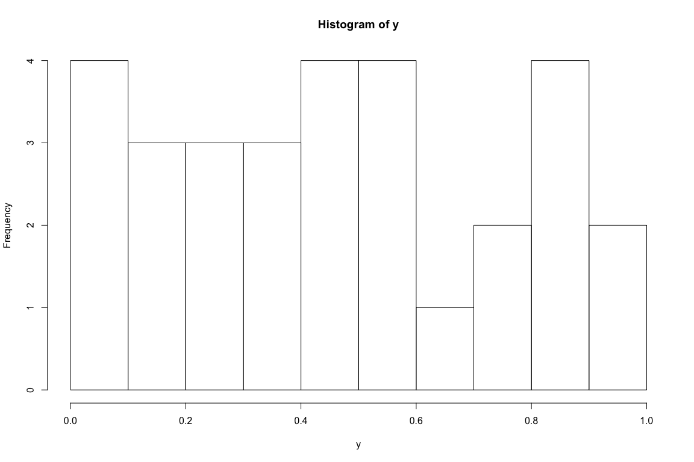

Density Plots
-------------

``` r
plot(density(y), col="red")
```

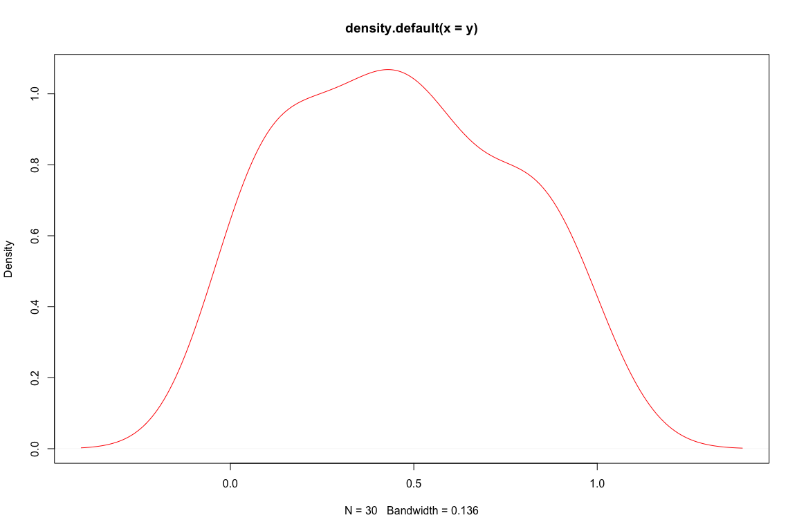

Pie Charts
----------

``` r
pie(y[,1], col=rainbow(length(y[,1]), start=0.1, end=0.8), clockwise=TRUE)
legend("topright", legend=row.names(y), cex=1.3, bty="n", pch=15, pt.cex=1.8, 
col=rainbow(length(y[,1]), start=0.1, end=0.8), ncol=1) 
```

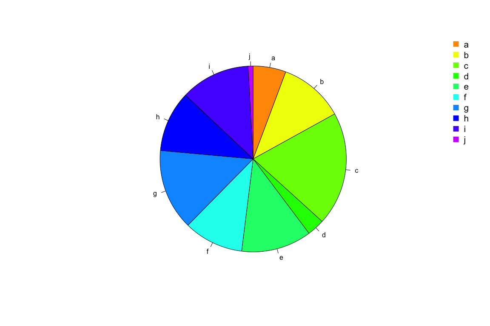

Color Selection Utilities
-------------------------

-   Default color palette and how to change it

``` r
palette()
```

    ## [1] "black"   "red"     "green3"  "blue"    "cyan"    "magenta" "yellow" 
    ## [8] "gray"

``` r
palette(rainbow(5, start=0.1, end=0.2))
palette()
```

    ## [1] "#FF9900" "#FFBF00" "#FFE600" "#F2FF00" "#CCFF00"

``` r
palette("default")
```

-   The `gray` function allows to select any type of gray shades by providing values from 0 to 1

``` r
gray(seq(0.1, 1, by= 0.2))
```

    ## [1] "#1A1A1A" "#4D4D4D" "#808080" "#B3B3B3" "#E6E6E6"

-   Color gradients with `colorpanel` function from `gplots` library\`

``` r
library(gplots)
colorpanel(5, "darkblue", "yellow", "white")
```

    ## [1] "#00008B" "#808046" "#FFFF00" "#FFFF80" "#FFFFFF"

Much more on colors in R see Earl Glynn's color chart [here](http://research.stowers-institute.org/efg/R/Color/Chart/)

Saving Graphics to File
-----------------------

-   After the `pdf()` command all graphs are redirected to file `test.pdf`. Works for all common formats similarly: jpeg, png, ps, tiff, ...

``` r
pdf("test.pdf")
plot(1:10, 1:10)
dev.off() 
```

-   Generates Scalable Vector Graphics (SVG) files that can be edited in vector graphics programs, such as InkScape.

``` r
library("RSvgDevice")
devSVG("test.svg")
plot(1:10, 1:10)
dev.off() 
```

Basic Statistics
================

-   `summary` is a generic function to summarize many types of R objects, including datasets.

``` r
  summary(iris)
```

    ##   Sepal.Length    Sepal.Width     Petal.Length    Petal.Width   
    ##  Min.   :4.300   Min.   :2.000   Min.   :1.000   Min.   :0.100  
    ##  1st Qu.:5.100   1st Qu.:2.800   1st Qu.:1.600   1st Qu.:0.300  
    ##  Median :5.800   Median :3.000   Median :4.350   Median :1.300  
    ##  Mean   :5.843   Mean   :3.057   Mean   :3.758   Mean   :1.199  
    ##  3rd Qu.:6.400   3rd Qu.:3.300   3rd Qu.:5.100   3rd Qu.:1.800  
    ##  Max.   :7.900   Max.   :4.400   Max.   :6.900   Max.   :2.500  
    ##        Species  
    ##  setosa    :50  
    ##  versicolor:50  
    ##  virginica :50  
    ##                 
    ##                 
    ## 

-   Compare the mean of two groups

``` r
s=iris[which(iris$Species=='setosa'), 1]; 
v=iris[which(iris$Species=='virginica'), 1];
t.test(s,v, paired=T)
```

    ## 
    ##  Paired t-test
    ## 
    ## data:  s and v
    ## t = -16.3441, df = 49, p-value < 2.2e-16
    ## alternative hypothesis: true difference in means is not equal to 0
    ## 95 percent confidence interval:
    ##  -1.776513 -1.387487
    ## sample estimates:
    ## mean of the differences 
    ##                  -1.582

-   Check the normality of my data

``` r
s=iris[which(iris$Species=='setosa'), 1]; 
shapiro.test(s);
```

    ## 
    ##  Shapiro-Wilk normality test
    ## 
    ## data:  s
    ## W = 0.9777, p-value = 0.4595

``` r
hist(s, breaks=10);
```

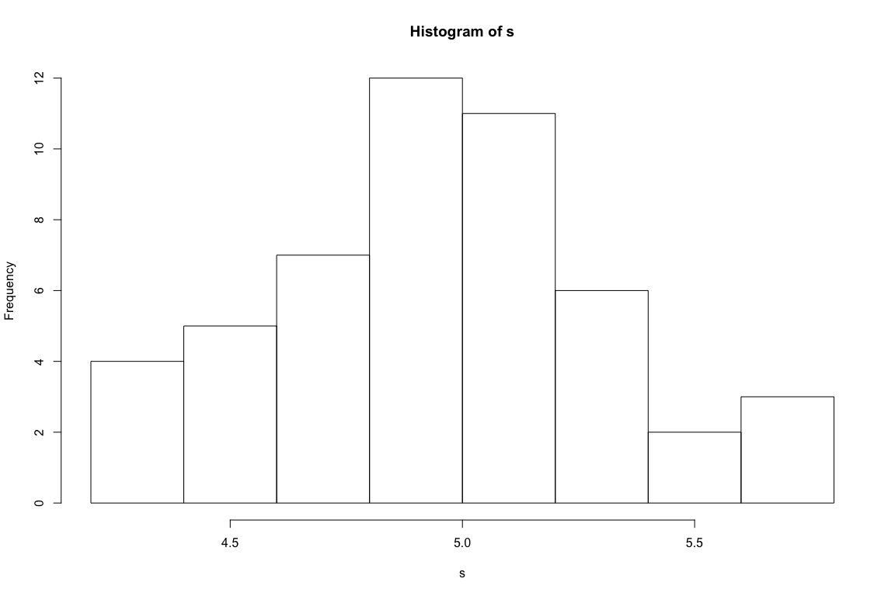

-   Test correlation between two data sets

``` r
s=iris[which(iris$Species=='setosa'), 1]; 
v=iris[which(iris$Species=='setosa'), 2];
cor.test(s,v)
```

    ## 
    ##  Pearson's product-moment correlation
    ## 
    ## data:  s and v
    ## t = 7.6807, df = 48, p-value = 6.71e-10
    ## alternative hypothesis: true correlation is not equal to 0
    ## 95 percent confidence interval:
    ##  0.5851391 0.8460314
    ## sample estimates:
    ##       cor 
    ## 0.7425467

-   Build a linear model

``` r
myModel = lm(iris[,1] ~ iris[, 2] + iris[, 3] + iris[, 4])
summary(myModel)
```

    ## 
    ## Call:
    ## lm(formula = iris[, 1] ~ iris[, 2] + iris[, 3] + iris[, 4])
    ## 
    ## Residuals:
    ##      Min       1Q   Median       3Q      Max 
    ## -0.82816 -0.21989  0.01875  0.19709  0.84570 
    ## 
    ## Coefficients:
    ##             Estimate Std. Error t value Pr(>|t|)    
    ## (Intercept)  1.85600    0.25078   7.401 9.85e-12 ***
    ## iris[, 2]    0.65084    0.06665   9.765  < 2e-16 ***
    ## iris[, 3]    0.70913    0.05672  12.502  < 2e-16 ***
    ## iris[, 4]   -0.55648    0.12755  -4.363 2.41e-05 ***
    ## ---
    ## Signif. codes:  0 '***' 0.001 '**' 0.01 '*' 0.05 '.' 0.1 ' ' 1
    ## 
    ## Residual standard error: 0.3145 on 146 degrees of freedom
    ## Multiple R-squared:  0.8586, Adjusted R-squared:  0.8557 
    ## F-statistic: 295.5 on 3 and 146 DF,  p-value: < 2.2e-16

``` r
step(myModel, direction="backward")
```

    ## Start:  AIC=-343.04
    ## iris[, 1] ~ iris[, 2] + iris[, 3] + iris[, 4]
    ## 
    ##             Df Sum of Sq    RSS     AIC
    ## <none>                   14.445 -343.04
    ## - iris[, 4]  1    1.8834 16.329 -326.66
    ## - iris[, 2]  1    9.4353 23.881 -269.63
    ## - iris[, 3]  1   15.4657 29.911 -235.86

    ## 
    ## Call:
    ## lm(formula = iris[, 1] ~ iris[, 2] + iris[, 3] + iris[, 4])
    ## 
    ## Coefficients:
    ## (Intercept)    iris[, 2]    iris[, 3]    iris[, 4]  
    ##      1.8560       0.6508       0.7091      -0.5565

-   ANOVA

``` r
myAnova<-aov(iris[,1] ~ iris[, 5]) 
summary(myAnova)
```

    ##              Df Sum Sq Mean Sq F value Pr(>F)    
    ## iris[, 5]     2  63.21  31.606   119.3 <2e-16 ***
    ## Residuals   147  38.96   0.265                   
    ## ---
    ## Signif. codes:  0 '***' 0.001 '**' 0.01 '*' 0.05 '.' 0.1 ' ' 1
