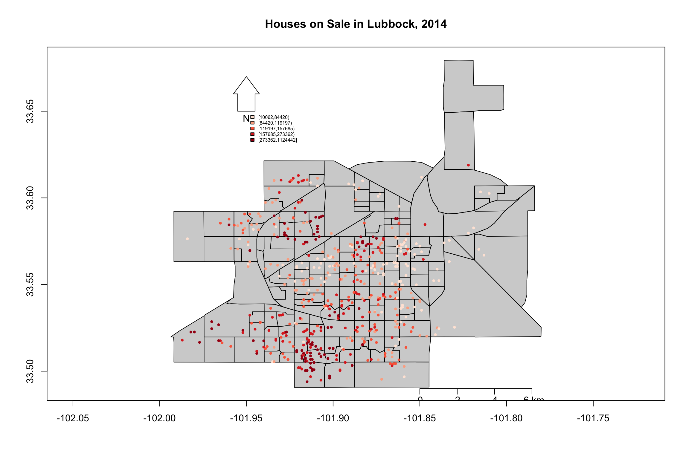
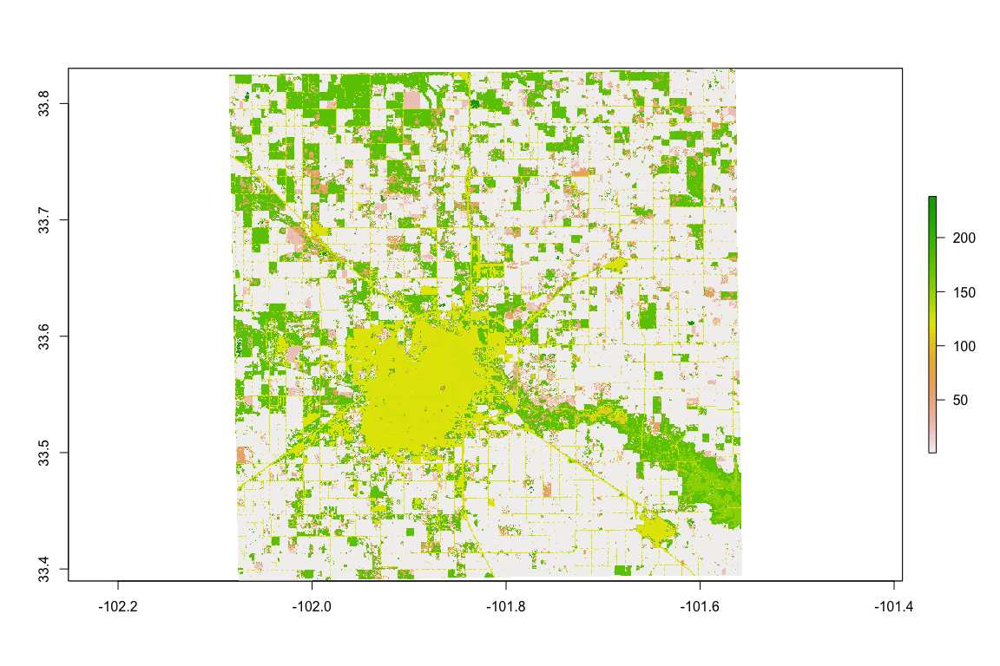
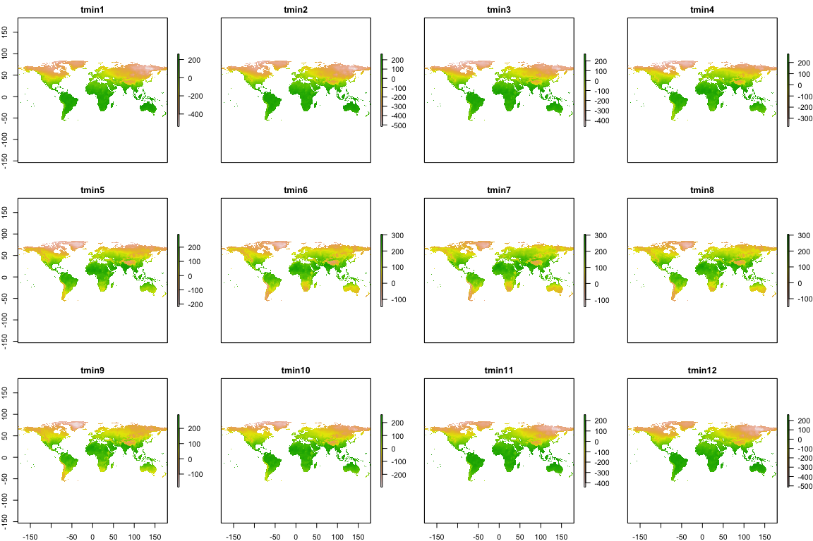
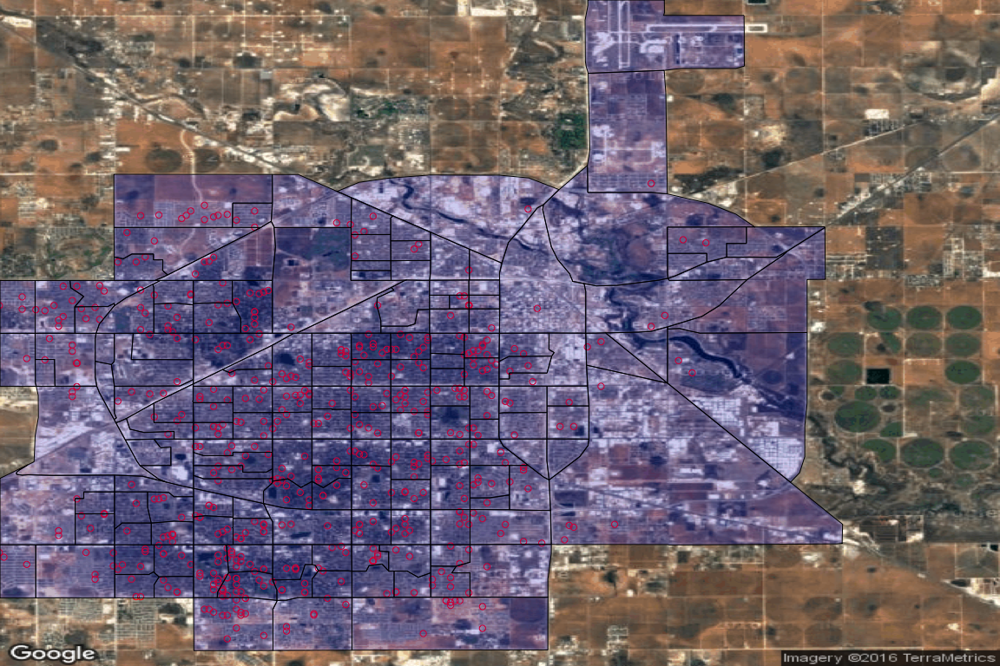
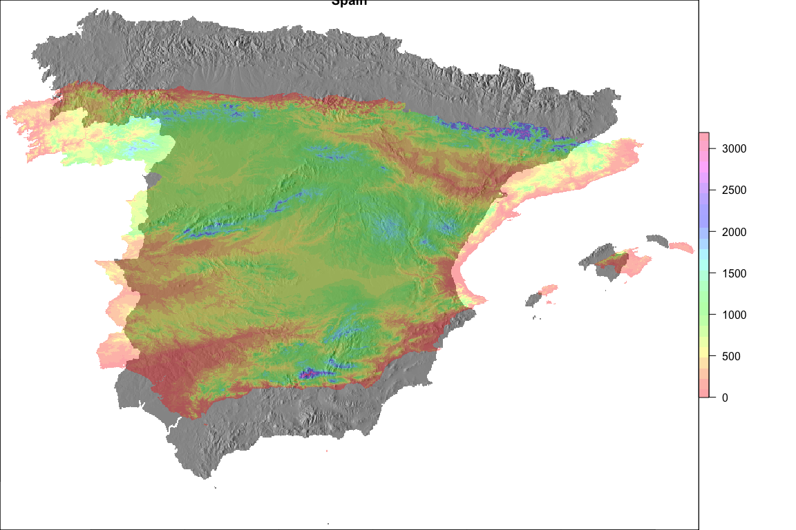

Week 3: Use R as GIS
================

``` r
knitr::opts_chunk$set(fig.width=12, fig.height=8, fig.path='Figs/',  warning=FALSE, message=FALSE)
```

``` r
x <- c("sp", "rgdal", "rgeos", "maptools", "classInt", "RColorBrewer", "GISTools", "maps", "raster", 'ggmap')
install.packages(x) # warning: this may take a number of minutes
```

    ## 
    ## The downloaded binary packages are in
    ##  /var/folders/l8/x07bbb7d7rd34vqdh886k91m0000gn/T//RtmpBqpHeH/downloaded_packages

``` r
lapply(x, library, character.only = TRUE) #load the required packages
```

    ## [[1]]
    ##  [1] "rmarkdown"      "plotGoogleMaps" "spacetime"      "RgoogleMaps"   
    ##  [5] "googleVis"      "ggmap"          "ggplot2"        "rgdal"         
    ##  [9] "raster"         "maps"           "GISTools"       "rgeos"         
    ## [13] "MASS"           "RColorBrewer"   "classInt"       "scales"        
    ## [17] "maptools"       "sp"             "nvimcom"        "stats"         
    ## [21] "graphics"       "grDevices"      "utils"          "datasets"      
    ## [25] "methods"        "base"          
    ## 
    ## [[2]]
    ##  [1] "rmarkdown"      "plotGoogleMaps" "spacetime"      "RgoogleMaps"   
    ##  [5] "googleVis"      "ggmap"          "ggplot2"        "rgdal"         
    ##  [9] "raster"         "maps"           "GISTools"       "rgeos"         
    ## [13] "MASS"           "RColorBrewer"   "classInt"       "scales"        
    ## [17] "maptools"       "sp"             "nvimcom"        "stats"         
    ## [21] "graphics"       "grDevices"      "utils"          "datasets"      
    ## [25] "methods"        "base"          
    ## 
    ## [[3]]
    ##  [1] "rmarkdown"      "plotGoogleMaps" "spacetime"      "RgoogleMaps"   
    ##  [5] "googleVis"      "ggmap"          "ggplot2"        "rgdal"         
    ##  [9] "raster"         "maps"           "GISTools"       "rgeos"         
    ## [13] "MASS"           "RColorBrewer"   "classInt"       "scales"        
    ## [17] "maptools"       "sp"             "nvimcom"        "stats"         
    ## [21] "graphics"       "grDevices"      "utils"          "datasets"      
    ## [25] "methods"        "base"          
    ## 
    ## [[4]]
    ##  [1] "rmarkdown"      "plotGoogleMaps" "spacetime"      "RgoogleMaps"   
    ##  [5] "googleVis"      "ggmap"          "ggplot2"        "rgdal"         
    ##  [9] "raster"         "maps"           "GISTools"       "rgeos"         
    ## [13] "MASS"           "RColorBrewer"   "classInt"       "scales"        
    ## [17] "maptools"       "sp"             "nvimcom"        "stats"         
    ## [21] "graphics"       "grDevices"      "utils"          "datasets"      
    ## [25] "methods"        "base"          
    ## 
    ## [[5]]
    ##  [1] "rmarkdown"      "plotGoogleMaps" "spacetime"      "RgoogleMaps"   
    ##  [5] "googleVis"      "ggmap"          "ggplot2"        "rgdal"         
    ##  [9] "raster"         "maps"           "GISTools"       "rgeos"         
    ## [13] "MASS"           "RColorBrewer"   "classInt"       "scales"        
    ## [17] "maptools"       "sp"             "nvimcom"        "stats"         
    ## [21] "graphics"       "grDevices"      "utils"          "datasets"      
    ## [25] "methods"        "base"          
    ## 
    ## [[6]]
    ##  [1] "rmarkdown"      "plotGoogleMaps" "spacetime"      "RgoogleMaps"   
    ##  [5] "googleVis"      "ggmap"          "ggplot2"        "rgdal"         
    ##  [9] "raster"         "maps"           "GISTools"       "rgeos"         
    ## [13] "MASS"           "RColorBrewer"   "classInt"       "scales"        
    ## [17] "maptools"       "sp"             "nvimcom"        "stats"         
    ## [21] "graphics"       "grDevices"      "utils"          "datasets"      
    ## [25] "methods"        "base"          
    ## 
    ## [[7]]
    ##  [1] "rmarkdown"      "plotGoogleMaps" "spacetime"      "RgoogleMaps"   
    ##  [5] "googleVis"      "ggmap"          "ggplot2"        "rgdal"         
    ##  [9] "raster"         "maps"           "GISTools"       "rgeos"         
    ## [13] "MASS"           "RColorBrewer"   "classInt"       "scales"        
    ## [17] "maptools"       "sp"             "nvimcom"        "stats"         
    ## [21] "graphics"       "grDevices"      "utils"          "datasets"      
    ## [25] "methods"        "base"          
    ## 
    ## [[8]]
    ##  [1] "rmarkdown"      "plotGoogleMaps" "spacetime"      "RgoogleMaps"   
    ##  [5] "googleVis"      "ggmap"          "ggplot2"        "rgdal"         
    ##  [9] "raster"         "maps"           "GISTools"       "rgeos"         
    ## [13] "MASS"           "RColorBrewer"   "classInt"       "scales"        
    ## [17] "maptools"       "sp"             "nvimcom"        "stats"         
    ## [21] "graphics"       "grDevices"      "utils"          "datasets"      
    ## [25] "methods"        "base"          
    ## 
    ## [[9]]
    ##  [1] "rmarkdown"      "plotGoogleMaps" "spacetime"      "RgoogleMaps"   
    ##  [5] "googleVis"      "ggmap"          "ggplot2"        "rgdal"         
    ##  [9] "raster"         "maps"           "GISTools"       "rgeos"         
    ## [13] "MASS"           "RColorBrewer"   "classInt"       "scales"        
    ## [17] "maptools"       "sp"             "nvimcom"        "stats"         
    ## [21] "graphics"       "grDevices"      "utils"          "datasets"      
    ## [25] "methods"        "base"          
    ## 
    ## [[10]]
    ##  [1] "rmarkdown"      "plotGoogleMaps" "spacetime"      "RgoogleMaps"   
    ##  [5] "googleVis"      "ggmap"          "ggplot2"        "rgdal"         
    ##  [9] "raster"         "maps"           "GISTools"       "rgeos"         
    ## [13] "MASS"           "RColorBrewer"   "classInt"       "scales"        
    ## [17] "maptools"       "sp"             "nvimcom"        "stats"         
    ## [21] "graphics"       "grDevices"      "utils"          "datasets"      
    ## [25] "methods"        "base"

Spatial Objects
===============

|          | Without attributes | With attributes          |
|----------|--------------------|--------------------------|
| Points   | SpatialPoints      | SpatialPointsDataFrame   |
| Lines    | SpatialLines       | SpatialLinesDataFrame    |
| Polygons | SpatialPolygons    | SpatialPolygonsDataFrame |
| Raster   | SpatialGrid        | SpatialGridDataFrame     |
| Raster   | SpatialPixels      | SpatialPixelsDataFrame   |

``` r
LubbockBlock<-readShapePoly("Data/LubbockBlockNew.shp") #read polygon shapefile
class(LubbockBlock)
```

    ## [1] "SpatialPolygonsDataFrame"
    ## attr(,"package")
    ## [1] "sp"

``` r
HouseLocation<-read.csv("Data/HouseLatLon.csv") #read GPS data
class(HouseLocation)
```

    ## [1] "data.frame"

``` r
coordinates(HouseLocation)<-c('Lon', 'Lat')
class(HouseLocation)
```

    ## [1] "SpatialPointsDataFrame"
    ## attr(,"package")
    ## [1] "sp"

``` r
cropland<-raster("Data/Lubbock_CDL_2013_USDA.tif")
class(cropland)
```

    ## [1] "RasterLayer"
    ## attr(,"package")
    ## [1] "raster"

``` r
tmin <- getData("worldclim", var = "tmin", res = 10)  # this will download 
class(tmin)
```

    ## [1] "RasterStack"
    ## attr(,"package")
    ## [1] "raster"

``` r
LubbockBlock<-readOGR("./Data", "LubbockBlockNew") #read polygon shapefile
```

    ## OGR data source with driver: ESRI Shapefile 
    ## Source: "./Data", layer: "LubbockBlockNew"
    ## with 167 features
    ## It has 69 fields

``` r
class(LubbockBlock)
```

    ## [1] "SpatialPolygonsDataFrame"
    ## attr(,"package")
    ## [1] "sp"

Mapping with R
==============

Basic Mapping
-------------

``` r
LubbockBlock<-readShapePoly("Data/LubbockBlockNew.shp") #read polygon shapefile
plot(LubbockBlock,axes=TRUE, col=alpha("gray70", 0.6)) #plot Lubbock block shapefile
#add title, scalebar, north arrow, and legend
HouseLocation<-read.csv("Data/HouseLatLon.csv") #read GPS data
price<-HouseLocation$TotalPrice
nclr<-5
priceclr<-brewer.pal(nclr, "Reds")
class<-classIntervals(price, nclr, style="quantile")
clocode<-findColours(class, priceclr)

points(HouseLocation$Lon, HouseLocation$Lat, pch=19, col=clocode, cex=0.5) #add houses on top of Lubbock block shapefile
title(main="Houses on Sale in Lubbock, 2014") 

legend(-101.95, 33.65, legend=names(attr(clocode, "table")), fill =attr(clocode, "palette"), cex=0.5, bty="n")
map.scale(x=-101.85, y=33.49, ratio=F)
north.arrow(xb=-101.95, yb=33.65, len=0.005, lab="N")
```



``` r
#plot raster
plot(cropland)
```



``` r
#plot raster stack
tmin <- getData("worldclim", var = "tmin", res = 10)  # this will download 
plot(tmin)
```



Mapping with static Google Maps
-------------------------------

``` r
library(RgoogleMaps)
lubbock=geocode('lubbock')

newmap <- GetMap(center = c(lubbock$lat, lubbock$lon), zoom = 12, destfile = "newmap.png", maptype = "satellite") 

PlotOnStaticMap(newmap, lat=HouseLocation$Lat, lon=HouseLocation$Lon, col='red')
PlotPolysOnStaticMap(newmap, lubbocktest, col=alpha('blue', 0.2))
```



Mapping with dynamic Google Maps
--------------------------------

``` r
library(plotGoogleMaps)

data(meuse)
coordinates(meuse)=~x+y
proj4string(meuse) = CRS('+init=epsg:28992')
plotGoogleMaps(meuse, filename='meuse')
```

    ## [1] "using original PolyCol"
    ## [1] "using original PolyCol"

    ## $starthtm
    ## [1] "<!DOCTYPE html> \n <html> \n <head> \n <meta name=\"viewport\" content=\"initial-scale=1.0, user-scalable=no\" />\n <meta charset=\"utf-8\"> \n <style type=\"text/css\">  \n html { height: 100% ; font-size: small} \n body { height: 100%; margin: 0px; padding: 0px }\n #map_canvas {min-height: 100%;height:auto; } \n #cBoxes {position:absolute;right:5px; top:50px; background:white}\n</style> \n\n <script type=\"text/javascript\" src=\"https://maps.google.com/maps/api/js?sensor=false&v=3.18\"> </script>  \n\n <script language=\"javascript\"> \n  \n USGSOverlay.prototype = new google.maps.OverlayView(); \nfunction USGSOverlay(bounds, image, map) {\n      this.bounds_ = bounds;\n      this.image_ = image;\n      this.map_ = map;\n      this.div_ = null;\n      this.setMap(map); }\nUSGSOverlay.prototype.onAdd = function() {\n      var div = document.createElement(\"DIV\");\n      div.style.border = \"none\";\n      div.style.borderWidth = \"0px\";\n      div.style.position = \"absolute\";\n      var img = document.createElement(\"img\");\n      img.src = this.image_;\n      img.style.width = \"100%\";\n      img.style.height = \"100%\";\n      div.appendChild(img);\n      this.div_ = div;\n      this.div_.style.opacity = 0.7;\n      var panes = this.getPanes();\n      panes.overlayImage.appendChild(this.div_);}\nUSGSOverlay.prototype.draw = function() {\n        var overlayProjection = this.getProjection();\n        var sw = overlayProjection.fromLatLngToDivPixel(this.bounds_.getSouthWest());\n        var ne = overlayProjection.fromLatLngToDivPixel(this.bounds_.getNorthEast());\n        var div = this.div_;\n        div.style.left = sw.x + \"px\";\n        div.style.top = ne.y + \"px\";\n        div.style.width = (ne.x - sw.x) + \"px\";\n        div.style.height = (sw.y - ne.y) + \"px\";} \nUSGSOverlay.prototype.onRemove = function() { \n this.div_.parentNode.removeChild(this.div_);} \nUSGSOverlay.prototype.hide = function() { if (this.div_) { this.div_.style.visibility = \"hidden\";} } \nUSGSOverlay.prototype.show = function() {if (this.div_) {  this.div_.style.visibility = \"visible\";}} \n       USGSOverlay.prototype.toggle = function() { \n if (this.div_) { \n  if (this.div_.style.visibility == \"hidden\") {  \n   this.show(); \n  } else { \n  this.hide(); } } } \n USGSOverlay.prototype.toggleDOM = function() {\n          if (this.getMap()) {\n            this.setMap(null);\n          } else {\n            this.setMap(this.map_);}}\n function setOpacR(Raster,textname) { \n  opac=0.01*parseInt(document.getElementById(textname).value) \n    Raster.div_.style.opacity= opac } \n"
    ## 
    ## $var
    ## [1] " var marker \n var  map  \n var  markersmeuse6481 =[] ; var  marker = new google.maps.Marker({ \n position: new google.maps.LatLng(50.9915621567178,5.75853624135808),\n map:map,\n title:\"cadmium : 11.7 \\rcopper : 85 \\rlead : 299 \\rzinc : 1022 \\relev : 7.909 \\rdist : 0.00135803 \\rom : 13.6 \\rffreq : 1 \\rsoil : 1 \\rlime : 1 \\rlanduse : Ah \\rdist.m : 50 \\r\",\n clickable: true,\n draggable: false,\n flat: true,\n visible: true,\n icon: new google.maps.MarkerImage(\"http://chart.apis.google.com/chart?chst=d_map_spin&chld=0.6|0|B94828|10|b|11.7\"), \n  zIndex: null }); \nmarkersmeuse6481.push(marker); \n\nvar  marker = new google.maps.Marker({ \n position: new google.maps.LatLng(50.9910879029232,5.75786301788305),\n map:map,\n title:\"cadmium : 8.6 \\rcopper : 81 \\rlead : 277 \\rzinc : 1141 \\relev : 6.983 \\rdist : 0.0122243 \\rom : 14 \\rffreq : 1 \\rsoil : 1 \\rlime : 1 \\rlanduse : Ah \\rdist.m : 30 \\r\",\n clickable: true,\n draggable: false,\n flat: true,\n visible: true,\n icon: new google.maps.MarkerImage(\"http://chart.apis.google.com/chart?chst=d_map_spin&chld=0.6|0|B94828|10|b|8.6\"), \n  zIndex: null }); \nmarkersmeuse6481.push(marker); \n\nvar  marker = new google.maps.Marker({ \n position: new google.maps.LatLng(50.9908927433765,5.75985541751295),\n map:map,\n title:\"cadmium : 6.5 \\rcopper : 68 \\rlead : 199 \\rzinc : 640 \\relev : 7.8 \\rdist : 0.103029 \\rom : 13 \\rffreq : 1 \\rsoil : 1 \\rlime : 1 \\rlanduse : Ah \\rdist.m : 150 \\r\",\n clickable: true,\n draggable: false,\n flat: true,\n visible: true,\n icon: new google.maps.MarkerImage(\"http://chart.apis.google.com/chart?chst=d_map_spin&chld=0.6|0|CD6325|10|b|6.5\"), \n  zIndex: null }); \nmarkersmeuse6481.push(marker); \n\nvar  marker = new google.maps.Marker({ \n position: new google.maps.LatLng(50.9904102356328,5.76174576970541),\n map:map,\n title:\"cadmium : 2.6 \\rcopper : 81 \\rlead : 116 \\rzinc : 257 \\relev : 7.655 \\rdist : 0.190094 \\rom : 8 \\rffreq : 1 \\rsoil : 2 \\rlime : 0 \\rlanduse : Ga \\rdist.m : 270 \\r\",\n clickable: true,\n draggable: false,\n flat: true,\n visible: true,\n icon: new google.maps.MarkerImage(\"http://chart.apis.google.com/chart?chst=d_map_spin&chld=0.6|0|F1B100|10|b|2.6\"), \n  zIndex: null }); \nmarkersmeuse6481.push(marker); \n\nvar  marker = new google.maps.Marker({ \n position: new google.maps.LatLng(50.9890255709571,5.76186270738117),\n map:map,\n title:\"cadmium : 2.8 \\rcopper : 48 \\rlead : 117 \\rzinc : 269 \\relev : 7.48 \\rdist : 0.27709 \\rom : 8.7 \\rffreq : 1 \\rsoil : 2 \\rlime : 0 \\rlanduse : Ah \\rdist.m : 380 \\r\",\n clickable: true,\n draggable: false,\n flat: true,\n visible: true,\n icon: new google.maps.MarkerImage(\"http://chart.apis.google.com/chart?chst=d_map_spin&chld=0.6|0|F5970F|10|b|2.8\"), \n  zIndex: null }); \nmarkersmeuse6481.push(marker); \n\nvar  marker = new google.maps.Marker({ \n position: new google.maps.LatLng(50.9883925366489,5.76303964098292),\n map:map,\n title:\"cadmium : 3 \\rcopper : 61 \\rlead : 137 \\rzinc : 281 \\relev : 7.791 \\rdist : 0.364067 \\rom : 7.8 \\rffreq : 1 \\rsoil : 2 \\rlime : 0 \\rlanduse : Ga \\rdist.m : 470 \\r\",\n clickable: true,\n draggable: false,\n flat: true,\n visible: true,\n icon: new google.maps.MarkerImage(\"http://chart.apis.google.com/chart?chst=d_map_spin&chld=0.6|0|F5970F|10|b|3\"), \n  zIndex: null }); \nmarkersmeuse6481.push(marker); \n\nvar  marker = new google.maps.Marker({ \n position: new google.maps.LatLng(50.9893916407069,5.75984329282049),\n map:map,\n title:\"cadmium : 3.2 \\rcopper : 31 \\rlead : 132 \\rzinc : 346 \\relev : 8.217 \\rdist : 0.190094 \\rom : 9.2 \\rffreq : 1 \\rsoil : 2 \\rlime : 0 \\rlanduse : Ah \\rdist.m : 240 \\r\",\n clickable: true,\n draggable: false,\n flat: true,\n visible: true,\n icon: new google.maps.MarkerImage(\"http://chart.apis.google.com/chart?chst=d_map_spin&chld=0.6|0|E17D1E|10|b|3.2\"), \n  zIndex: null }); \nmarkersmeuse6481.push(marker); \n\nvar  marker = new google.maps.Marker({ \n position: new google.maps.LatLng(50.9893350268931,5.75787741953428),\n map:map,\n title:\"cadmium : 2.8 \\rcopper : 29 \\rlead : 150 \\rzinc : 406 \\relev : 8.49 \\rdist : 0.0921516 \\rom : 9.5 \\rffreq : 1 \\rsoil : 1 \\rlime : 0 \\rlanduse : Ab \\rdist.m : 120 \\r\",\n clickable: true,\n draggable: false,\n flat: true,\n visible: true,\n icon: new google.maps.MarkerImage(\"http://chart.apis.google.com/chart?chst=d_map_spin&chld=0.6|0|F5970F|10|b|2.8\"), \n  zIndex: null }); \nmarkersmeuse6481.push(marker); \n\nvar  marker = new google.maps.Marker({ \n position: new google.maps.LatLng(50.9881470213434,5.75833785372193),\n map:map,\n title:\"cadmium : 2.4 \\rcopper : 37 \\rlead : 133 \\rzinc : 347 \\relev : 8.668 \\rdist : 0.184614 \\rom : 10.6 \\rffreq : 1 \\rsoil : 1 \\rlime : 0 \\rlanduse : Ab \\rdist.m : 240 \\r\",\n clickable: true,\n draggable: false,\n flat: true,\n visible: true,\n icon: new google.maps.MarkerImage(\"http://chart.apis.google.com/chart?chst=d_map_spin&chld=0.6|0|F1B100|10|b|2.4\"), \n  zIndex: null }); \nmarkersmeuse6481.push(marker); \n\nvar  marker = new google.maps.Marker({ \n position: new google.maps.LatLng(50.9875728618997,5.76078279077936),\n map:map,\n title:\"cadmium : 1.6 \\rcopper : 24 \\rlead : 80 \\rzinc : 183 \\relev : 9.049 \\rdist : 0.309702 \\rom : 6.3 \\rffreq : 1 \\rsoil : 2 \\rlime : 0 \\rlanduse : W \\rdist.m : 420 \\r\",\n clickable: true,\n draggable: false,\n flat: true,\n visible: true,\n icon: new google.maps.MarkerImage(\"http://chart.apis.google.com/chart?chst=d_map_spin&chld=0.6|0|D3C800|10|b|1.6\"), \n  zIndex: null }); \nmarkersmeuse6481.push(marker); \n\nvar  marker = new google.maps.Marker({ \n position: new google.maps.LatLng(50.9870983459807,5.76019504905426),\n map:map,\n title:\"cadmium : 1.4 \\rcopper : 25 \\rlead : 86 \\rzinc : 189 \\relev : 9.015 \\rdist : 0.315116 \\rom : 6.4 \\rffreq : 1 \\rsoil : 2 \\rlime : 0 \\rlanduse : Fh \\rdist.m : 400 \\r\",\n clickable: true,\n draggable: false,\n flat: true,\n visible: true,\n icon: new google.maps.MarkerImage(\"http://chart.apis.google.com/chart?chst=d_map_spin&chld=0.6|0|B0DB00|10|b|1.4\"), \n  zIndex: null }); \nmarkersmeuse6481.push(marker); \n\nvar  marker = new google.maps.Marker({ \n position: new google.maps.LatLng(50.9863505704254,5.75792464948194),\n map:map,\n title:\"cadmium : 1.8 \\rcopper : 25 \\rlead : 97 \\rzinc : 251 \\relev : 9.073 \\rdist : 0.228123 \\rom : 9 \\rffreq : 1 \\rsoil : 1 \\rlime : 0 \\rlanduse : Ag \\rdist.m : 300 \\r\",\n clickable: true,\n draggable: false,\n flat: true,\n visible: true,\n icon: new google.maps.MarkerImage(\"http://chart.apis.google.com/chart?chst=d_map_spin&chld=0.6|0|D3C800|10|b|1.8\"), \n  zIndex: null }); \nmarkersmeuse6481.push(marker); \n\nvar  marker = new google.maps.Marker({ \n position: new google.maps.LatLng(50.9891262526795,5.75569670406275),\n map:map,\n title:\"cadmium : 11.2 \\rcopper : 93 \\rlead : 285 \\rzinc : 1096 \\relev : 7.32 \\rdist : 0 \\rom : 15.4 \\rffreq : 1 \\rsoil : 1 \\rlime : 1 \\rlanduse : W \\rdist.m : 20 \\r\",\n clickable: true,\n draggable: false,\n flat: true,\n visible: true,\n icon: new google.maps.MarkerImage(\"http://chart.apis.google.com/chart?chst=d_map_spin&chld=0.6|0|B94828|10|b|11.2\"), \n  zIndex: null }); \nmarkersmeuse6481.push(marker); \n\nvar  marker = new google.maps.Marker({ \n position: new google.maps.LatLng(50.9883399284191,5.75704339827961),\n map:map,\n title:\"cadmium : 2.5 \\rcopper : 31 \\rlead : 183 \\rzinc : 504 \\relev : 8.815 \\rdist : 0.113932 \\rom : 8.4 \\rffreq : 1 \\rsoil : 1 \\rlime : 0 \\rlanduse : Ah \\rdist.m : 130 \\r\",\n clickable: true,\n draggable: false,\n flat: true,\n visible: true,\n icon: new google.maps.MarkerImage(\"http://chart.apis.google.com/chart?chst=d_map_spin&chld=0.6|0|F1B100|10|b|2.5\"), \n  zIndex: null }); \nmarkersmeuse6481.push(marker); \n\nvar  marker = new google.maps.Marker({ \n position: new google.maps.LatLng(50.9875200505676,5.75763497281676),\n map:map,\n title:\"cadmium : 2 \\rcopper : 27 \\rlead : 130 \\rzinc : 326 \\relev : 8.937 \\rdist : 0.168336 \\rom : 9.1 \\rffreq : 1 \\rsoil : 1 \\rlime : 0 \\rlanduse : Ah \\rdist.m : 220 \\r\",\n clickable: true,\n draggable: false,\n flat: true,\n visible: true,\n icon: new google.maps.MarkerImage(\"http://chart.apis.google.com/chart?chst=d_map_spin&chld=0.6|0|D3C800|10|b|2\"), \n  zIndex: null }); \nmarkersmeuse6481.push(marker); \n\nvar  marker = new google.maps.Marker({ \n position: new google.maps.LatLng(50.9882923009323,5.75506340331458),\n map:map,\n title:\"cadmium : 9.5 \\rcopper : 86 \\rlead : 240 \\rzinc : 1032 \\relev : 7.702 \\rdist : 0 \\rom : 16.2 \\rffreq : 1 \\rsoil : 1 \\rlime : 1 \\rlanduse : W \\rdist.m : 10 \\r\",\n clickable: true,\n draggable: false,\n flat: true,\n visible: true,\n icon: new google.maps.MarkerImage(\"http://chart.apis.google.com/chart?chst=d_map_spin&chld=0.6|0|B94828|10|b|9.5\"), \n  zIndex: null }); \nmarkersmeuse6481.push(marker); \n\nvar  marker = new google.maps.Marker({ \n position: new google.maps.LatLng(50.9870189402934,5.75409907538524),\n map:map,\n title:\"cadmium : 7 \\rcopper : 74 \\rlead : 133 \\rzinc : 606 \\relev : 7.16 \\rdist : 0.0122243 \\rom : 16 \\rffreq : 1 \\rsoil : 1 \\rlime : 1 \\rlanduse : W \\rdist.m : 10 \\r\",\n clickable: true,\n draggable: false,\n flat: true,\n visible: true,\n icon: new google.maps.MarkerImage(\"http://chart.apis.google.com/chart?chst=d_map_spin&chld=0.6|0|CD6325|10|b|7\"), \n  zIndex: null }); \nmarkersmeuse6481.push(marker); \n\nvar  marker = new google.maps.Marker({ \n position: new google.maps.LatLng(50.9858355480134,5.7531070321817),\n map:map,\n title:\"cadmium : 7.1 \\rcopper : 69 \\rlead : 148 \\rzinc : 711 \\relev : 7.1 \\rdist : 0.0122243 \\rom : 16 \\rffreq : 1 \\rsoil : 1 \\rlime : 1 \\rlanduse : W \\rdist.m : 10 \\r\",\n clickable: true,\n draggable: false,\n flat: true,\n visible: true,\n icon: new google.maps.MarkerImage(\"http://chart.apis.google.com/chart?chst=d_map_spin&chld=0.6|0|CD6325|10|b|7.1\"), \n  zIndex: null }); \nmarkersmeuse6481.push(marker); \n\nvar  marker = new google.maps.Marker({ \n position: new google.maps.LatLng(50.9847150677111,5.75211553749502),\n map:map,\n title:\"cadmium : 8.7 \\rcopper : 69 \\rlead : 207 \\rzinc : 735 \\relev : 7.02 \\rdist : 0 \\rom : 13.7 \\rffreq : 1 \\rsoil : 1 \\rlime : 1 \\rlanduse : W \\rdist.m : 10 \\r\",\n clickable: true,\n draggable: false,\n flat: true,\n visible: true,\n icon: new google.maps.MarkerImage(\"http://chart.apis.google.com/chart?chst=d_map_spin&chld=0.6|0|B94828|10|b|8.7\"), \n  zIndex: null }); \nmarkersmeuse6481.push(marker); \n\nvar  marker = new google.maps.Marker({ \n position: new google.maps.LatLng(50.9834597939485,5.7511087876558),\n map:map,\n title:\"cadmium : 12.9 \\rcopper : 95 \\rlead : 284 \\rzinc : 1052 \\relev : 6.86 \\rdist : 0 \\rom : 14.8 \\rffreq : 1 \\rsoil : 1 \\rlime : 1 \\rlanduse : NA \\rdist.m : 10 \\r\",\n clickable: true,\n draggable: false,\n flat: true,\n visible: true,\n icon: new google.maps.MarkerImage(\"http://chart.apis.google.com/chart?chst=d_map_spin&chld=0.6|0|B94828|10|b|12.9\"), \n  zIndex: null }); \nmarkersmeuse6481.push(marker); \n\nvar  marker = new google.maps.Marker({ \n position: new google.maps.LatLng(50.9834648830742,5.75234773643936),\n map:map,\n title:\"cadmium : 5.5 \\rcopper : 53 \\rlead : 194 \\rzinc : 673 \\relev : 8.908 \\rdist : 0.0703468 \\rom : 10.2 \\rffreq : 1 \\rsoil : 1 \\rlime : 1 \\rlanduse : Am \\rdist.m : 80 \\r\",\n clickable: true,\n draggable: false,\n flat: true,\n visible: true,\n icon: new google.maps.MarkerImage(\"http://chart.apis.google.com/chart?chst=d_map_spin&chld=0.6|0|E17D1E|10|b|5.5\"), \n  zIndex: null }); \nmarkersmeuse6481.push(marker); \n\nvar  marker = new google.maps.Marker({ \n position: new google.maps.LatLng(50.9835429938165,5.7532312564973),\n map:map,\n title:\"cadmium : 2.8 \\rcopper : 35 \\rlead : 123 \\rzinc : 402 \\relev : 8.99 \\rdist : 0.0975136 \\rom : 7.2 \\rffreq : 1 \\rsoil : 1 \\rlime : 1 \\rlanduse : Am \\rdist.m : 140 \\r\",\n clickable: true,\n draggable: false,\n flat: true,\n visible: true,\n icon: new google.maps.MarkerImage(\"http://chart.apis.google.com/chart?chst=d_map_spin&chld=0.6|0|F5970F|10|b|2.8\"), \n  zIndex: null }); \nmarkersmeuse6481.push(marker); \n\nvar  marker = new google.maps.Marker({ \n position: new google.maps.LatLng(50.9830665956949,5.75322747760397),\n map:map,\n title:\"cadmium : 2.9 \\rcopper : 35 \\rlead : 110 \\rzinc : 343 \\relev : 8.83 \\rdist : 0.113932 \\rom : 7.2 \\rffreq : 1 \\rsoil : 1 \\rlime : 1 \\rlanduse : Ag \\rdist.m : 160 \\r\",\n clickable: true,\n draggable: false,\n flat: true,\n visible: true,\n icon: new google.maps.MarkerImage(\"http://chart.apis.google.com/chart?chst=d_map_spin&chld=0.6|0|F5970F|10|b|2.9\"), \n  zIndex: null }); \nmarkersmeuse6481.push(marker); \n\nvar  marker = new google.maps.Marker({ \n position: new google.maps.LatLng(50.9853922461842,5.75964010225301),\n map:map,\n title:\"cadmium : 1.7 \\rcopper : 24 \\rlead : 85 \\rzinc : 218 \\relev : 9.02 \\rdist : 0.342321 \\rom : 7 \\rffreq : 1 \\rsoil : 2 \\rlime : 0 \\rlanduse : Ah \\rdist.m : 440 \\r\",\n clickable: true,\n draggable: false,\n flat: true,\n visible: true,\n icon: new google.maps.MarkerImage(\"http://chart.apis.google.com/chart?chst=d_map_spin&chld=0.6|0|D3C800|10|b|1.7\"), \n  zIndex: null }); \nmarkersmeuse6481.push(marker); \n\nvar  marker = new google.maps.Marker({ \n position: new google.maps.LatLng(50.9844756797724,5.75954726041956),\n map:map,\n title:\"cadmium : 1.4 \\rcopper : 26 \\rlead : 75 \\rzinc : 200 \\relev : 8.976 \\rdist : 0.385804 \\rom : 6.9 \\rffreq : 1 \\rsoil : 2 \\rlime : 0 \\rlanduse : W \\rdist.m : 490 \\r\",\n clickable: true,\n draggable: false,\n flat: true,\n visible: true,\n icon: new google.maps.MarkerImage(\"http://chart.apis.google.com/chart?chst=d_map_spin&chld=0.6|0|B0DB00|10|b|1.4\"), \n  zIndex: null }); \nmarkersmeuse6481.push(marker); \n\nvar  marker = new google.maps.Marker({ \n position: new google.maps.LatLng(50.9840702750243,5.75982879953081),\n map:map,\n title:\"cadmium : 1.5 \\rcopper : 22 \\rlead : 76 \\rzinc : 194 \\relev : 8.973 \\rdist : 0.429289 \\rom : 6.3 \\rffreq : 1 \\rsoil : 2 \\rlime : 0 \\rlanduse : W \\rdist.m : 530 \\r\",\n clickable: true,\n draggable: false,\n flat: true,\n visible: true,\n icon: new google.maps.MarkerImage(\"http://chart.apis.google.com/chart?chst=d_map_spin&chld=0.6|0|B0DB00|10|b|1.5\"), \n  zIndex: null }); \nmarkersmeuse6481.push(marker); \n\nvar  marker = new google.maps.Marker({ \n position: new google.maps.LatLng(50.9840685492958,5.75756454288456),\n map:map,\n title:\"cadmium : 1.3 \\rcopper : 27 \\rlead : 73 \\rzinc : 207 \\relev : 8.507 \\rdist : 0.315116 \\rom : 5.6 \\rffreq : 1 \\rsoil : 2 \\rlime : 0 \\rlanduse : Ab \\rdist.m : 400 \\r\",\n clickable: true,\n draggable: false,\n flat: true,\n visible: true,\n icon: new google.maps.MarkerImage(\"http://chart.apis.google.com/chart?chst=d_map_spin&chld=0.6|0|B0DB00|10|b|1.3\"), \n  zIndex: null }); \nmarkersmeuse6481.push(marker); \n\nvar  marker = new google.maps.Marker({ \n position: new google.maps.LatLng(50.9832611644443,5.75705965324643),\n map:map,\n title:\"cadmium : 1.3 \\rcopper : 24 \\rlead : 67 \\rzinc : 180 \\relev : 8.743 \\rdist : 0.320574 \\rom : 4.4 \\rffreq : 1 \\rsoil : 2 \\rlime : 0 \\rlanduse : Ag \\rdist.m : 400 \\r\",\n clickable: true,\n draggable: false,\n flat: true,\n visible: true,\n icon: new google.maps.MarkerImage(\"http://chart.apis.google.com/chart?chst=d_map_spin&chld=0.6|0|B0DB00|10|b|1.3\"), \n  zIndex: null }); \nmarkersmeuse6481.push(marker); \n\nvar  marker = new google.maps.Marker({ \n position: new google.maps.LatLng(50.9838570041339,5.75625272322607),\n map:map,\n title:\"cadmium : 1.8 \\rcopper : 22 \\rlead : 87 \\rzinc : 240 \\relev : 8.973 \\rdist : 0.249863 \\rom : 5.3 \\rffreq : 1 \\rsoil : 2 \\rlime : 0 \\rlanduse : Ah \\rdist.m : 330 \\r\",\n clickable: true,\n draggable: false,\n flat: true,\n visible: true,\n icon: new google.maps.MarkerImage(\"http://chart.apis.google.com/chart?chst=d_map_spin&chld=0.6|0|D3C800|10|b|1.8\"), \n  zIndex: null }); \nmarkersmeuse6481.push(marker); \n\nvar  marker = new google.maps.Marker({ \n position: new google.maps.LatLng(50.9855718596777,5.76247550814582),\n map:map,\n title:\"cadmium : 1.5 \\rcopper : 21 \\rlead : 65 \\rzinc : 180 \\relev : 9.043 \\rdist : 0.489064 \\rom : 4.8 \\rffreq : 1 \\rsoil : 2 \\rlime : 0 \\rlanduse : Ag \\rdist.m : 630 \\r\",\n clickable: true,\n draggable: false,\n flat: true,\n visible: true,\n icon: new google.maps.MarkerImage(\"http://chart.apis.google.com/chart?chst=d_map_spin&chld=0.6|0|B0DB00|10|b|1.5\"), \n  zIndex: null }); \nmarkersmeuse6481.push(marker); \n\nvar  marker = new google.maps.Marker({ \n position: new google.maps.LatLng(50.9822021949462,5.75932955670694),\n map:map,\n title:\"cadmium : 1.3 \\rcopper : 29 \\rlead : 78 \\rzinc : 208 \\relev : 8.688 \\rdist : 0.472778 \\rom : 2.6 \\rffreq : 1 \\rsoil : 2 \\rlime : 0 \\rlanduse : B \\rdist.m : 570 \\r\",\n clickable: true,\n draggable: false,\n flat: true,\n visible: true,\n icon: new google.maps.MarkerImage(\"http://chart.apis.google.com/chart?chst=d_map_spin&chld=0.6|0|B0DB00|10|b|1.3\"), \n  zIndex: null }); \nmarkersmeuse6481.push(marker); \n\nvar  marker = new google.maps.Marker({ \n position: new google.maps.LatLng(50.9814857258188,5.75569264984007),\n map:map,\n title:\"cadmium : 1.3 \\rcopper : 21 \\rlead : 64 \\rzinc : 198 \\relev : 8.727 \\rdist : 0.287957 \\rom : 1 \\rffreq : 1 \\rsoil : 2 \\rlime : 0 \\rlanduse : Ag \\rdist.m : 390 \\r\",\n clickable: true,\n draggable: false,\n flat: true,\n visible: true,\n icon: new google.maps.MarkerImage(\"http://chart.apis.google.com/chart?chst=d_map_spin&chld=0.6|0|B0DB00|10|b|1.3\"), \n  zIndex: null }); \nmarkersmeuse6481.push(marker); \n\nvar  marker = new google.maps.Marker({ \n position: new google.maps.LatLng(50.9811373867951,5.75499212724445),\n map:map,\n title:\"cadmium : 2.1 \\rcopper : 27 \\rlead : 77 \\rzinc : 250 \\relev : 8.328 \\rdist : 0.271622 \\rom : 2.4 \\rffreq : 1 \\rsoil : 2 \\rlime : 0 \\rlanduse : Ah \\rdist.m : 360 \\r\",\n clickable: true,\n draggable: false,\n flat: true,\n visible: true,\n icon: new google.maps.MarkerImage(\"http://chart.apis.google.com/chart?chst=d_map_spin&chld=0.6|0|D3C800|10|b|2.1\"), \n  zIndex: null }); \nmarkersmeuse6481.push(marker); \n\nvar  marker = new google.maps.Marker({ \n position: new google.maps.LatLng(50.980673299633,5.75676836243297),\n map:map,\n title:\"cadmium : 1.2 \\rcopper : 26 \\rlead : 80 \\rzinc : 192 \\relev : 7.971 \\rdist : 0.385807 \\rom : 1.9 \\rffreq : 1 \\rsoil : 2 \\rlime : 0 \\rlanduse : B \\rdist.m : 500 \\r\",\n clickable: true,\n draggable: false,\n flat: true,\n visible: true,\n icon: new google.maps.MarkerImage(\"http://chart.apis.google.com/chart?chst=d_map_spin&chld=0.6|0|7FEE00|10|b|1.2\"), \n  zIndex: null }); \nmarkersmeuse6481.push(marker); \n\nvar  marker = new google.maps.Marker({ \n position: new google.maps.LatLng(50.9799451288486,5.7567910096397),\n map:map,\n title:\"cadmium : 1.6 \\rcopper : 27 \\rlead : 82 \\rzinc : 213 \\relev : 7.809 \\rdist : 0.418417 \\rom : 3.1 \\rffreq : 1 \\rsoil : 2 \\rlime : 0 \\rlanduse : B \\rdist.m : 550 \\r\",\n clickable: true,\n draggable: false,\n flat: true,\n visible: true,\n icon: new google.maps.MarkerImage(\"http://chart.apis.google.com/chart?chst=d_map_spin&chld=0.6|0|D3C800|10|b|1.6\"), \n  zIndex: null }); \nmarkersmeuse6481.push(marker); \n\nvar  marker = new google.maps.Marker({ \n position: new google.maps.LatLng(50.9800641186472,5.75328909906964),\n map:map,\n title:\"cadmium : 3 \\rcopper : 32 \\rlead : 97 \\rzinc : 321 \\relev : 6.986 \\rdist : 0.244474 \\rom : 1.6 \\rffreq : 1 \\rsoil : 2 \\rlime : 0 \\rlanduse : Ab \\rdist.m : 340 \\r\",\n clickable: true,\n draggable: false,\n flat: true,\n visible: true,\n icon: new google.maps.MarkerImage(\"http://chart.apis.google.com/chart?chst=d_map_spin&chld=0.6|0|F5970F|10|b|3\"), \n  zIndex: null }); \nmarkersmeuse6481.push(marker); \n\nvar  marker = new google.maps.Marker({ \n position: new google.maps.LatLng(50.9811013184432,5.75218663828695),\n map:map,\n title:\"cadmium : 5.8 \\rcopper : 50 \\rlead : 166 \\rzinc : 569 \\relev : 7.756 \\rdist : 0.135709 \\rom : 3.5 \\rffreq : 1 \\rsoil : 2 \\rlime : 0 \\rlanduse : Ab \\rdist.m : 210 \\r\",\n clickable: true,\n draggable: false,\n flat: true,\n visible: true,\n icon: new google.maps.MarkerImage(\"http://chart.apis.google.com/chart?chst=d_map_spin&chld=0.6|0|CD6325|10|b|5.8\"), \n  zIndex: null }); \nmarkersmeuse6481.push(marker); \n\nvar  marker = new google.maps.Marker({ \n position: new google.maps.LatLng(50.9819418309139,5.75074082050022),\n map:map,\n title:\"cadmium : 7.9 \\rcopper : 67 \\rlead : 217 \\rzinc : 833 \\relev : 7.784 \\rdist : 0.0484965 \\rom : 8.1 \\rffreq : 1 \\rsoil : 1 \\rlime : 1 \\rlanduse : Am \\rdist.m : 60 \\r\",\n clickable: true,\n draggable: false,\n flat: true,\n visible: true,\n icon: new google.maps.MarkerImage(\"http://chart.apis.google.com/chart?chst=d_map_spin&chld=0.6|0|CD6325|10|b|7.9\"), \n  zIndex: null }); \nmarkersmeuse6481.push(marker); \n\nvar  marker = new google.maps.Marker({ \n position: new google.maps.LatLng(50.9823036988139,5.75000319287152),\n map:map,\n title:\"cadmium : 8.1 \\rcopper : 77 \\rlead : 219 \\rzinc : 906 \\relev : 7 \\rdist : 0 \\rom : 7.9 \\rffreq : 1 \\rsoil : 1 \\rlime : 1 \\rlanduse : W \\rdist.m : 10 \\r\",\n clickable: true,\n draggable: false,\n flat: true,\n visible: true,\n icon: new google.maps.MarkerImage(\"http://chart.apis.google.com/chart?chst=d_map_spin&chld=0.6|0|CD6325|10|b|8.1\"), \n  zIndex: null }); \nmarkersmeuse6481.push(marker); \n\nvar  marker = new google.maps.Marker({ \n position: new google.maps.LatLng(50.9813910868018,5.74864324761722),\n map:map,\n title:\"cadmium : 14.1 \\rcopper : 108 \\rlead : 405 \\rzinc : 1454 \\relev : 6.92 \\rdist : 0.00135803 \\rom : 9.5 \\rffreq : 1 \\rsoil : 1 \\rlime : 1 \\rlanduse : W \\rdist.m : 20 \\r\",\n clickable: true,\n draggable: false,\n flat: true,\n visible: true,\n icon: new google.maps.MarkerImage(\"http://chart.apis.google.com/chart?chst=d_map_spin&chld=0.6|0|B94828|10|b|14.1\"), \n  zIndex: null }); \nmarkersmeuse6481.push(marker); \n\nvar  marker = new google.maps.Marker({ \n position: new google.maps.LatLng(50.9800738005995,5.75021349066651),\n map:map,\n title:\"cadmium : 2.4 \\rcopper : 32 \\rlead : 102 \\rzinc : 298 \\relev : 7.516 \\rdist : 0.135709 \\rom : 1.4 \\rffreq : 1 \\rsoil : 2 \\rlime : 0 \\rlanduse : Am \\rdist.m : 170 \\r\",\n clickable: true,\n draggable: false,\n flat: true,\n visible: true,\n icon: new google.maps.MarkerImage(\"http://chart.apis.google.com/chart?chst=d_map_spin&chld=0.6|0|F1B100|10|b|2.4\"), \n  zIndex: null }); \nmarkersmeuse6481.push(marker); \n\nvar  marker = new google.maps.Marker({ \n position: new google.maps.LatLng(50.9788393617366,5.75115778709919),\n map:map,\n title:\"cadmium : 1.2 \\rcopper : 21 \\rlead : 48 \\rzinc : 167 \\relev : 8.18 \\rdist : 0.26622 \\rom : NA \\rffreq : 1 \\rsoil : 2 \\rlime : 0 \\rlanduse : Ga \\rdist.m : 320 \\r\",\n clickable: true,\n draggable: false,\n flat: true,\n visible: true,\n icon: new google.maps.MarkerImage(\"http://chart.apis.google.com/chart?chst=d_map_spin&chld=0.6|0|7FEE00|10|b|1.2\"), \n  zIndex: null }); \nmarkersmeuse6481.push(marker); \n\nvar  marker = new google.maps.Marker({ \n position: new google.maps.LatLng(50.9786824780721,5.74959027599575),\n map:map,\n title:\"cadmium : 1.7 \\rcopper : 22 \\rlead : 65 \\rzinc : 176 \\relev : 8.694 \\rdist : 0.211843 \\rom : NA \\rffreq : 1 \\rsoil : 2 \\rlime : 0 \\rlanduse : W \\rdist.m : 260 \\r\",\n clickable: true,\n draggable: false,\n flat: true,\n visible: true,\n icon: new google.maps.MarkerImage(\"http://chart.apis.google.com/chart?chst=d_map_spin&chld=0.6|0|D3C800|10|b|1.7\"), \n  zIndex: null }); \nmarkersmeuse6481.push(marker); \n\nvar  marker = new google.maps.Marker({ \n position: new google.maps.LatLng(50.9773899383192,5.74899635022841),\n map:map,\n title:\"cadmium : 1.3 \\rcopper : 21 \\rlead : 62 \\rzinc : 258 \\relev : 9.28 \\rdist : 0.320572 \\rom : 2 \\rffreq : 1 \\rsoil : 2 \\rlime : 0 \\rlanduse : Ah \\rdist.m : 360 \\r\",\n clickable: true,\n draggable: false,\n flat: true,\n visible: true,\n icon: new google.maps.MarkerImage(\"http://chart.apis.google.com/chart?chst=d_map_spin&chld=0.6|0|B0DB00|10|b|1.3\"), \n  zIndex: null }); \nmarkersmeuse6481.push(marker); \n\nvar  marker = new google.maps.Marker({ \n position: new google.maps.LatLng(50.979801339863,5.74823209898502),\n map:map,\n title:\"cadmium : 4.2 \\rcopper : 51 \\rlead : 281 \\rzinc : 746 \\relev : 7.94 \\rdist : 0.081222 \\rom : 5.1 \\rffreq : 1 \\rsoil : 2 \\rlime : 0 \\rlanduse : Ah \\rdist.m : 100 \\r\",\n clickable: true,\n draggable: false,\n flat: true,\n visible: true,\n icon: new google.maps.MarkerImage(\"http://chart.apis.google.com/chart?chst=d_map_spin&chld=0.6|0|E17D1E|10|b|4.2\"), \n  zIndex: null }); \nmarkersmeuse6481.push(marker); \n\nvar  marker = new google.maps.Marker({ \n position: new google.maps.LatLng(50.9785277449808,5.74732509108447),\n map:map,\n title:\"cadmium : 4.3 \\rcopper : 50 \\rlead : 294 \\rzinc : 746 \\relev : 6.36 \\rdist : 0.190086 \\rom : 5.3 \\rffreq : 1 \\rsoil : 2 \\rlime : 0 \\rlanduse : Am \\rdist.m : 200 \\r\",\n clickable: true,\n draggable: false,\n flat: true,\n visible: true,\n icon: new google.maps.MarkerImage(\"http://chart.apis.google.com/chart?chst=d_map_spin&chld=0.6|0|E17D1E|10|b|4.3\"), \n  zIndex: null }); \nmarkersmeuse6481.push(marker); \n\nvar  marker = new google.maps.Marker({ \n position: new google.maps.LatLng(50.9772427667127,5.74718691872388),\n map:map,\n title:\"cadmium : 3.1 \\rcopper : 38 \\rlead : 211 \\rzinc : 464 \\relev : 7.78 \\rdist : 0.287941 \\rom : 4.5 \\rffreq : 1 \\rsoil : 2 \\rlime : 0 \\rlanduse : Ah \\rdist.m : 320 \\r\",\n clickable: true,\n draggable: false,\n flat: true,\n visible: true,\n icon: new google.maps.MarkerImage(\"http://chart.apis.google.com/chart?chst=d_map_spin&chld=0.6|0|F5970F|10|b|3.1\"), \n  zIndex: null }); \nmarkersmeuse6481.push(marker); \n\nvar  marker = new google.maps.Marker({ \n position: new google.maps.LatLng(50.9758675477884,5.74716195442974),\n map:map,\n title:\"cadmium : 1.7 \\rcopper : 26 \\rlead : 135 \\rzinc : 365 \\relev : 8.18 \\rdist : 0.423826 \\rom : 4.9 \\rffreq : 1 \\rsoil : 2 \\rlime : 0 \\rlanduse : Ah \\rdist.m : 480 \\r\",\n clickable: true,\n draggable: false,\n flat: true,\n visible: true,\n icon: new google.maps.MarkerImage(\"http://chart.apis.google.com/chart?chst=d_map_spin&chld=0.6|0|D3C800|10|b|1.7\"), \n  zIndex: null }); \nmarkersmeuse6481.push(marker); \n\nvar  marker = new google.maps.Marker({ \n position: new google.maps.LatLng(50.9744838269228,5.74698031230129),\n map:map,\n title:\"cadmium : 1.7 \\rcopper : 24 \\rlead : 112 \\rzinc : 282 \\relev : 9.42 \\rdist : 0.554289 \\rom : 4.5 \\rffreq : 1 \\rsoil : 2 \\rlime : 0 \\rlanduse : Bw \\rdist.m : 660 \\r\",\n clickable: true,\n draggable: false,\n flat: true,\n visible: true,\n icon: new google.maps.MarkerImage(\"http://chart.apis.google.com/chart?chst=d_map_spin&chld=0.6|0|D3C800|10|b|1.7\"), \n  zIndex: null }); \nmarkersmeuse6481.push(marker); \n\nvar  marker = new google.maps.Marker({ \n position: new google.maps.LatLng(50.9734442799648,5.74596136562816),\n map:map,\n title:\"cadmium : 2.1 \\rcopper : 32 \\rlead : 162 \\rzinc : 375 \\relev : 8.867 \\rdist : 0.603225 \\rom : 5.5 \\rffreq : 1 \\rsoil : 2 \\rlime : 0 \\rlanduse : Bw \\rdist.m : 690 \\r\",\n clickable: true,\n draggable: false,\n flat: true,\n visible: true,\n icon: new google.maps.MarkerImage(\"http://chart.apis.google.com/chart?chst=d_map_spin&chld=0.6|0|D3C800|10|b|2.1\"), \n  zIndex: null }); \nmarkersmeuse6481.push(marker); \n\nvar  marker = new google.maps.Marker({ \n position: new google.maps.LatLng(50.9730965420996,5.74504748664984),\n map:map,\n title:\"cadmium : 1.7 \\rcopper : 24 \\rlead : 94 \\rzinc : 222 \\relev : 8.292 \\rdist : 0.614071 \\rom : 3.4 \\rffreq : 1 \\rsoil : 2 \\rlime : 0 \\rlanduse : Ab \\rdist.m : 710 \\r\",\n clickable: true,\n draggable: false,\n flat: true,\n visible: true,\n icon: new google.maps.MarkerImage(\"http://chart.apis.google.com/chart?chst=d_map_spin&chld=0.6|0|D3C800|10|b|1.7\"), \n  zIndex: null }); \nmarkersmeuse6481.push(marker); \n\nvar  marker = new google.maps.Marker({ \n position: new google.maps.LatLng(50.9802739755958,5.7465555541636),\n map:map,\n title:\"cadmium : 8.2 \\rcopper : 47 \\rlead : 191 \\rzinc : 812 \\relev : 8.06 \\rdist : 0.00135803 \\rom : 11.1 \\rffreq : 1 \\rsoil : 1 \\rlime : 1 \\rlanduse : Ah \\rdist.m : 10 \\r\",\n clickable: true,\n draggable: false,\n flat: true,\n visible: true,\n icon: new google.maps.MarkerImage(\"http://chart.apis.google.com/chart?chst=d_map_spin&chld=0.6|0|CD6325|10|b|8.2\"), \n  zIndex: null }); \nmarkersmeuse6481.push(marker); \n\nvar  marker = new google.maps.Marker({ \n position: new google.maps.LatLng(50.9797944935968,5.7446437686074),\n map:map,\n title:\"cadmium : 17 \\rcopper : 128 \\rlead : 405 \\rzinc : 1548 \\relev : 7.98 \\rdist : 0 \\rom : 12.3 \\rffreq : 1 \\rsoil : 1 \\rlime : 1 \\rlanduse : W \\rdist.m : 10 \\r\",\n clickable: true,\n draggable: false,\n flat: true,\n visible: true,\n icon: new google.maps.MarkerImage(\"http://chart.apis.google.com/chart?chst=d_map_spin&chld=0.6|0|B94828|10|b|17\"), \n  zIndex: null }); \nmarkersmeuse6481.push(marker); \n\nvar  marker = new google.maps.Marker({ \n position: new google.maps.LatLng(50.9794226689628,5.74278980863467),\n map:map,\n title:\"cadmium : 12 \\rcopper : 117 \\rlead : 654 \\rzinc : 1839 \\relev : 7.9 \\rdist : 0.0054321 \\rom : 16.5 \\rffreq : 1 \\rsoil : 1 \\rlime : 1 \\rlanduse : W \\rdist.m : 10 \\r\",\n clickable: true,\n draggable: false,\n flat: true,\n visible: true,\n icon: new google.maps.MarkerImage(\"http://chart.apis.google.com/chart?chst=d_map_spin&chld=0.6|0|B94828|10|b|12\"), \n  zIndex: null }); \nmarkersmeuse6481.push(marker); \n\nvar  marker = new google.maps.Marker({ \n position: new google.maps.LatLng(50.9790875083989,5.74069409719209),\n map:map,\n title:\"cadmium : 9.4 \\rcopper : 104 \\rlead : 482 \\rzinc : 1528 \\relev : 7.74 \\rdist : 0.0054321 \\rom : 13.9 \\rffreq : 1 \\rsoil : 1 \\rlime : 1 \\rlanduse : W \\rdist.m : 10 \\r\",\n clickable: true,\n draggable: false,\n flat: true,\n visible: true,\n icon: new google.maps.MarkerImage(\"http://chart.apis.google.com/chart?chst=d_map_spin&chld=0.6|0|B94828|10|b|9.4\"), \n  zIndex: null }); \nmarkersmeuse6481.push(marker); \n\nvar  marker = new google.maps.Marker({ \n position: new google.maps.LatLng(50.9785901683949,5.73871109204067),\n map:map,\n title:\"cadmium : 8.2 \\rcopper : 76 \\rlead : 276 \\rzinc : 933 \\relev : 7.552 \\rdist : 0.0054321 \\rom : 8.1 \\rffreq : 1 \\rsoil : 1 \\rlime : 1 \\rlanduse : W \\rdist.m : 20 \\r\",\n clickable: true,\n draggable: false,\n flat: true,\n visible: true,\n icon: new google.maps.MarkerImage(\"http://chart.apis.google.com/chart?chst=d_map_spin&chld=0.6|0|CD6325|10|b|8.2\"), \n  zIndex: null }); \nmarkersmeuse6481.push(marker); \n\nvar  marker = new google.maps.Marker({ \n position: new google.maps.LatLng(50.9774530501812,5.74019747024153),\n map:map,\n title:\"cadmium : 2.6 \\rcopper : 36 \\rlead : 180 \\rzinc : 432 \\relev : 7.76 \\rdist : 0.146578 \\rom : 3.1 \\rffreq : 1 \\rsoil : 1 \\rlime : 0 \\rlanduse : Fw \\rdist.m : 200 \\r\",\n clickable: true,\n draggable: false,\n flat: true,\n visible: true,\n icon: new google.maps.MarkerImage(\"http://chart.apis.google.com/chart?chst=d_map_spin&chld=0.6|0|F1B100|10|b|2.6\"), \n  zIndex: null }); \nmarkersmeuse6481.push(marker); \n\nvar  marker = new google.maps.Marker({ \n position: new google.maps.LatLng(50.978149380156,5.74176905142937),\n map:map,\n title:\"cadmium : 3.5 \\rcopper : 34 \\rlead : 207 \\rzinc : 550 \\relev : 6.74 \\rdist : 0.135684 \\rom : 5.8 \\rffreq : 1 \\rsoil : 1 \\rlime : 0 \\rlanduse : Fw \\rdist.m : 140 \\r\",\n clickable: true,\n draggable: false,\n flat: true,\n visible: true,\n icon: new google.maps.MarkerImage(\"http://chart.apis.google.com/chart?chst=d_map_spin&chld=0.6|0|E17D1E|10|b|3.5\"), \n  zIndex: null }); \nmarkersmeuse6481.push(marker); \n\nvar  marker = new google.maps.Marker({ \n position: new google.maps.LatLng(50.9790395787989,5.74459520467365),\n map:map,\n title:\"cadmium : 10.9 \\rcopper : 90 \\rlead : 541 \\rzinc : 1571 \\relev : 6.68 \\rdist : 0.0703333 \\rom : 10.2 \\rffreq : 1 \\rsoil : 1 \\rlime : 1 \\rlanduse : Fw \\rdist.m : 70 \\r\",\n clickable: true,\n draggable: false,\n flat: true,\n visible: true,\n icon: new google.maps.MarkerImage(\"http://chart.apis.google.com/chart?chst=d_map_spin&chld=0.6|0|B94828|10|b|10.9\"), \n  zIndex: null }); \nmarkersmeuse6481.push(marker); \n\nvar  marker = new google.maps.Marker({ \n position: new google.maps.LatLng(50.9776769067862,5.73752233772848),\n map:map,\n title:\"cadmium : 7.3 \\rcopper : 80 \\rlead : 310 \\rzinc : 1190 \\relev : 7.4 \\rdist : 0.0484831 \\rom : 12 \\rffreq : 1 \\rsoil : 1 \\rlime : 1 \\rlanduse : W \\rdist.m : 20 \\r\",\n clickable: true,\n draggable: false,\n flat: true,\n visible: true,\n icon: new google.maps.MarkerImage(\"http://chart.apis.google.com/chart?chst=d_map_spin&chld=0.6|0|CD6325|10|b|7.3\"), \n  zIndex: null }); \nmarkersmeuse6481.push(marker); \n\nvar  marker = new google.maps.Marker({ \n position: new google.maps.LatLng(50.9765746564882,5.73640339186063),\n map:map,\n title:\"cadmium : 9.4 \\rcopper : 78 \\rlead : 210 \\rzinc : 907 \\relev : 7.44 \\rdist : 0.0054321 \\rom : 14.1 \\rffreq : 1 \\rsoil : 1 \\rlime : 1 \\rlanduse : W \\rdist.m : 10 \\r\",\n clickable: true,\n draggable: false,\n flat: true,\n visible: true,\n icon: new google.maps.MarkerImage(\"http://chart.apis.google.com/chart?chst=d_map_spin&chld=0.6|0|B94828|10|b|9.4\"), \n  zIndex: null }); \nmarkersmeuse6481.push(marker); \n\nvar  marker = new google.maps.Marker({ \n position: new google.maps.LatLng(50.9750838696178,5.73595074279196),\n map:map,\n title:\"cadmium : 8.3 \\rcopper : 77 \\rlead : 158 \\rzinc : 761 \\relev : 7.36 \\rdist : 0.0054321 \\rom : 14.5 \\rffreq : 1 \\rsoil : 1 \\rlime : 1 \\rlanduse : Fw \\rdist.m : 10 \\r\",\n clickable: true,\n draggable: false,\n flat: true,\n visible: true,\n icon: new google.maps.MarkerImage(\"http://chart.apis.google.com/chart?chst=d_map_spin&chld=0.6|0|B94828|10|b|8.3\"), \n  zIndex: null }); \nmarkersmeuse6481.push(marker); \n\nvar  marker = new google.maps.Marker({ \n position: new google.maps.LatLng(50.9738526808613,5.73585601588772),\n map:map,\n title:\"cadmium : 7 \\rcopper : 65 \\rlead : 141 \\rzinc : 659 \\relev : 7.2 \\rdist : 0.0316663 \\rom : 14.8 \\rffreq : 1 \\rsoil : 1 \\rlime : 1 \\rlanduse : W \\rdist.m : 20 \\r\",\n clickable: true,\n draggable: false,\n flat: true,\n visible: true,\n icon: new google.maps.MarkerImage(\"http://chart.apis.google.com/chart?chst=d_map_spin&chld=0.6|0|CD6325|10|b|7\"), \n  zIndex: null }); \nmarkersmeuse6481.push(marker); \n\nvar  marker = new google.maps.Marker({ \n position: new google.maps.LatLng(50.9726064676528,5.7347788297209),\n map:map,\n title:\"cadmium : 6.8 \\rcopper : 66 \\rlead : 144 \\rzinc : 643 \\relev : 7.22 \\rdist : 0.0122243 \\rom : 13.3 \\rffreq : 1 \\rsoil : 1 \\rlime : 1 \\rlanduse : Ah \\rdist.m : 10 \\r\",\n clickable: true,\n draggable: false,\n flat: true,\n visible: true,\n icon: new google.maps.MarkerImage(\"http://chart.apis.google.com/chart?chst=d_map_spin&chld=0.6|0|CD6325|10|b|6.8\"), \n  zIndex: null }); \nmarkersmeuse6481.push(marker); \n\nvar  marker = new google.maps.Marker({ \n position: new google.maps.LatLng(50.9714593326225,5.73363126249382),\n map:map,\n title:\"cadmium : 7.4 \\rcopper : 72 \\rlead : 181 \\rzinc : 801 \\relev : 7.36 \\rdist : 0.0122243 \\rom : 15.2 \\rffreq : 1 \\rsoil : 1 \\rlime : 1 \\rlanduse : W \\rdist.m : 20 \\r\",\n clickable: true,\n draggable: false,\n flat: true,\n visible: true,\n icon: new google.maps.MarkerImage(\"http://chart.apis.google.com/chart?chst=d_map_spin&chld=0.6|0|CD6325|10|b|7.4\"), \n  zIndex: null }); \nmarkersmeuse6481.push(marker); \n\nvar  marker = new google.maps.Marker({ \n position: new google.maps.LatLng(50.9705458488692,5.73249973647215),\n map:map,\n title:\"cadmium : 6.6 \\rcopper : 75 \\rlead : 173 \\rzinc : 784 \\relev : 5.18 \\rdist : 0.0373395 \\rom : 11.4 \\rffreq : 1 \\rsoil : 1 \\rlime : 1 \\rlanduse : W \\rdist.m : 20 \\r\",\n clickable: true,\n draggable: false,\n flat: true,\n visible: true,\n icon: new google.maps.MarkerImage(\"http://chart.apis.google.com/chart?chst=d_map_spin&chld=0.6|0|CD6325|10|b|6.6\"), \n  zIndex: null }); \nmarkersmeuse6481.push(marker); \n\nvar  marker = new google.maps.Marker({ \n position: new google.maps.LatLng(50.9692872572816,5.73555105032773),\n map:map,\n title:\"cadmium : 7.8 \\rcopper : 75 \\rlead : 399 \\rzinc : 1060 \\relev : 5.8 \\rdist : 0.211846 \\rom : 9 \\rffreq : 1 \\rsoil : 1 \\rlime : 0 \\rlanduse : Ah \\rdist.m : 270 \\r\",\n clickable: true,\n draggable: false,\n flat: true,\n visible: true,\n icon: new google.maps.MarkerImage(\"http://chart.apis.google.com/chart?chst=d_map_spin&chld=0.6|0|CD6325|10|b|7.8\"), \n  zIndex: null }); \nmarkersmeuse6481.push(marker); \n\nvar  marker = new google.maps.Marker({ \n position: new google.maps.LatLng(50.9675518843431,5.73869821703239),\n map:map,\n title:\"cadmium : 0.7 \\rcopper : 22 \\rlead : 45 \\rzinc : 119 \\relev : 7.64 \\rdist : 0.451037 \\rom : 3.6 \\rffreq : 1 \\rsoil : 1 \\rlime : 1 \\rlanduse : Fw \\rdist.m : 560 \\r\",\n clickable: true,\n draggable: false,\n flat: true,\n visible: true,\n icon: new google.maps.MarkerImage(\"http://chart.apis.google.com/chart?chst=d_map_spin&chld=0.6|0|7FEE00|10|b|0.7\"), \n  zIndex: null }); \nmarkersmeuse6481.push(marker); \n\nvar  marker = new google.maps.Marker({ \n position: new google.maps.LatLng(50.9663584452737,5.74096673794625),\n map:map,\n title:\"cadmium : 3.4 \\rcopper : 55 \\rlead : 325 \\rzinc : 778 \\relev : 6.32 \\rdist : 0.575877 \\rom : 6.9 \\rffreq : 1 \\rsoil : 1 \\rlime : 0 \\rlanduse : Bw \\rdist.m : 750 \\r\",\n clickable: true,\n draggable: false,\n flat: true,\n visible: true,\n icon: new google.maps.MarkerImage(\"http://chart.apis.google.com/chart?chst=d_map_spin&chld=0.6|0|E17D1E|10|b|3.4\"), \n  zIndex: null }); \nmarkersmeuse6481.push(marker); \n\nvar  marker = new google.maps.Marker({ \n position: new google.maps.LatLng(50.9677732235548,5.73084191744462),\n map:map,\n title:\"cadmium : 3.9 \\rcopper : 47 \\rlead : 268 \\rzinc : 703 \\relev : 5.76 \\rdist : 0.0756869 \\rom : 7 \\rffreq : 1 \\rsoil : 1 \\rlime : 1 \\rlanduse : Ab \\rdist.m : 80 \\r\",\n clickable: true,\n draggable: false,\n flat: true,\n visible: true,\n icon: new google.maps.MarkerImage(\"http://chart.apis.google.com/chart?chst=d_map_spin&chld=0.6|0|E17D1E|10|b|3.9\"), \n  zIndex: null }); \nmarkersmeuse6481.push(marker); \n\nvar  marker = new google.maps.Marker({ \n position: new google.maps.LatLng(50.9669827283149,5.73066521033129),\n map:map,\n title:\"cadmium : 3.5 \\rcopper : 46 \\rlead : 252 \\rzinc : 676 \\relev : 6.48 \\rdist : 0.12481 \\rom : 6.2 \\rffreq : 1 \\rsoil : 1 \\rlime : 1 \\rlanduse : Ab \\rdist.m : 130 \\r\",\n clickable: true,\n draggable: false,\n flat: true,\n visible: true,\n icon: new google.maps.MarkerImage(\"http://chart.apis.google.com/chart?chst=d_map_spin&chld=0.6|0|E17D1E|10|b|3.5\"), \n  zIndex: null }); \nmarkersmeuse6481.push(marker); \n\nvar  marker = new google.maps.Marker({ \n position: new google.maps.LatLng(50.966958419262,5.729768210244),\n map:map,\n title:\"cadmium : 4.7 \\rcopper : 55 \\rlead : 315 \\rzinc : 793 \\relev : 6.48 \\rdist : 0.103024 \\rom : 6.5 \\rffreq : 1 \\rsoil : 1 \\rlime : 0 \\rlanduse : W \\rdist.m : 110 \\r\",\n clickable: true,\n draggable: false,\n flat: true,\n visible: true,\n icon: new google.maps.MarkerImage(\"http://chart.apis.google.com/chart?chst=d_map_spin&chld=0.6|0|E17D1E|10|b|4.7\"), \n  zIndex: null }); \nmarkersmeuse6481.push(marker); \n\nvar  marker = new google.maps.Marker({ \n position: new google.maps.LatLng(50.9657294125332,5.72893346951614),\n map:map,\n title:\"cadmium : 3.9 \\rcopper : 49 \\rlead : 260 \\rzinc : 685 \\relev : 6.32 \\rdist : 0.157469 \\rom : 5.7 \\rffreq : 1 \\rsoil : 1 \\rlime : 0 \\rlanduse : W \\rdist.m : 200 \\r\",\n clickable: true,\n draggable: false,\n flat: true,\n visible: true,\n icon: new google.maps.MarkerImage(\"http://chart.apis.google.com/chart?chst=d_map_spin&chld=0.6|0|E17D1E|10|b|3.9\"), \n  zIndex: null }); \nmarkersmeuse6481.push(marker); \n\nvar  marker = new google.maps.Marker({ \n position: new google.maps.LatLng(50.9660037241418,5.73040169796583),\n map:map,\n title:\"cadmium : 3.1 \\rcopper : 39 \\rlead : 237 \\rzinc : 593 \\relev : 6.32 \\rdist : 0.200976 \\rom : 7 \\rffreq : 1 \\rsoil : 1 \\rlime : 1 \\rlanduse : Ah \\rdist.m : 260 \\r\",\n clickable: true,\n draggable: false,\n flat: true,\n visible: true,\n icon: new google.maps.MarkerImage(\"http://chart.apis.google.com/chart?chst=d_map_spin&chld=0.6|0|F5970F|10|b|3.1\"), \n  zIndex: null }); \nmarkersmeuse6481.push(marker); \n\nvar  marker = new google.maps.Marker({ \n position: new google.maps.LatLng(50.9649912913701,5.72928387135357),\n map:map,\n title:\"cadmium : 2.9 \\rcopper : 45 \\rlead : 228 \\rzinc : 549 \\relev : 6.16 \\rdist : 0.200976 \\rom : 7.3 \\rffreq : 1 \\rsoil : 1 \\rlime : 0 \\rlanduse : W \\rdist.m : 270 \\r\",\n clickable: true,\n draggable: false,\n flat: true,\n visible: true,\n icon: new google.maps.MarkerImage(\"http://chart.apis.google.com/chart?chst=d_map_spin&chld=0.6|0|F5970F|10|b|2.9\"), \n  zIndex: null }); \nmarkersmeuse6481.push(marker); \n\nvar  marker = new google.maps.Marker({ \n position: new google.maps.LatLng(50.9649077402814,5.7301800316633),\n map:map,\n title:\"cadmium : 3.9 \\rcopper : 48 \\rlead : 241 \\rzinc : 680 \\relev : 6.56 \\rdist : 0.26622 \\rom : 8.2 \\rffreq : 1 \\rsoil : 1 \\rlime : 0 \\rlanduse : W \\rdist.m : 320 \\r\",\n clickable: true,\n draggable: false,\n flat: true,\n visible: true,\n icon: new google.maps.MarkerImage(\"http://chart.apis.google.com/chart?chst=d_map_spin&chld=0.6|0|E17D1E|10|b|3.9\"), \n  zIndex: null }); \nmarkersmeuse6481.push(marker); \n\nvar  marker = new google.maps.Marker({ \n position: new google.maps.LatLng(50.9637767280288,5.72964496250136),\n map:map,\n title:\"cadmium : 2.7 \\rcopper : 36 \\rlead : 201 \\rzinc : 539 \\relev : 6.9 \\rdist : 0.298835 \\rom : 4.3 \\rffreq : 1 \\rsoil : 1 \\rlime : 0 \\rlanduse : Ah \\rdist.m : 360 \\r\",\n clickable: true,\n draggable: false,\n flat: true,\n visible: true,\n icon: new google.maps.MarkerImage(\"http://chart.apis.google.com/chart?chst=d_map_spin&chld=0.6|0|F5970F|10|b|2.7\"), \n  zIndex: null }); \nmarkersmeuse6481.push(marker); \n\nvar  marker = new google.maps.Marker({ \n position: new google.maps.LatLng(50.9651893471422,5.72612524013299),\n map:map,\n title:\"cadmium : 2.5 \\rcopper : 36 \\rlead : 204 \\rzinc : 560 \\relev : 7.54 \\rdist : 0.0812247 \\rom : 4.4 \\rffreq : 1 \\rsoil : 1 \\rlime : 1 \\rlanduse : Am \\rdist.m : 80 \\r\",\n clickable: true,\n draggable: false,\n flat: true,\n visible: true,\n icon: new google.maps.MarkerImage(\"http://chart.apis.google.com/chart?chst=d_map_spin&chld=0.6|0|F1B100|10|b|2.5\"), \n  zIndex: null }); \nmarkersmeuse6481.push(marker); \n\nvar  marker = new google.maps.Marker({ \n position: new google.maps.LatLng(50.9662008065653,5.7275846347628),\n map:map,\n title:\"cadmium : 5.6 \\rcopper : 68 \\rlead : 429 \\rzinc : 1136 \\relev : 6.42 \\rdist : 0.070355 \\rom : 8.2 \\rffreq : 1 \\rsoil : 1 \\rlime : 1 \\rlanduse : W \\rdist.m : 100 \\r\",\n clickable: true,\n draggable: false,\n flat: true,\n visible: true,\n icon: new google.maps.MarkerImage(\"http://chart.apis.google.com/chart?chst=d_map_spin&chld=0.6|0|E17D1E|10|b|5.6\"), \n  zIndex: null }); \nmarkersmeuse6481.push(marker); \n\nvar  marker = new google.maps.Marker({ \n position: new google.maps.LatLng(50.9675012707552,5.72857646558625),\n map:map,\n title:\"cadmium : 9.4 \\rcopper : 88 \\rlead : 462 \\rzinc : 1383 \\relev : 6.28 \\rdist : 0.0122243 \\rom : 8.5 \\rffreq : 1 \\rsoil : 1 \\rlime : 1 \\rlanduse : W \\rdist.m : 70 \\r\",\n clickable: true,\n draggable: false,\n flat: true,\n visible: true,\n icon: new google.maps.MarkerImage(\"http://chart.apis.google.com/chart?chst=d_map_spin&chld=0.6|0|B94828|10|b|9.4\"), \n  zIndex: null }); \nmarkersmeuse6481.push(marker); \n\nvar  marker = new google.maps.Marker({ \n position: new google.maps.LatLng(50.9682253570603,5.72993420369967),\n map:map,\n title:\"cadmium : 10.8 \\rcopper : 85 \\rlead : 333 \\rzinc : 1161 \\relev : 6.34 \\rdist : 0 \\rom : 9.6 \\rffreq : 1 \\rsoil : 1 \\rlime : 1 \\rlanduse : W \\rdist.m : 20 \\r\",\n clickable: true,\n draggable: false,\n flat: true,\n visible: true,\n icon: new google.maps.MarkerImage(\"http://chart.apis.google.com/chart?chst=d_map_spin&chld=0.6|0|B94828|10|b|10.8\"), \n  zIndex: null }); \nmarkersmeuse6481.push(marker); \n\nvar  marker = new google.maps.Marker({ \n position: new google.maps.LatLng(50.9623184475399,5.7451916904561),\n map:map,\n title:\"cadmium : 18.1 \\rcopper : 76 \\rlead : 464 \\rzinc : 1672 \\relev : 7.307 \\rdist : 0.0537723 \\rom : 17 \\rffreq : 1 \\rsoil : 1 \\rlime : 1 \\rlanduse : W \\rdist.m : 50 \\r\",\n clickable: true,\n draggable: false,\n flat: true,\n visible: true,\n icon: new google.maps.MarkerImage(\"http://chart.apis.google.com/chart?chst=d_map_spin&chld=0.6|0|B94828|10|b|18.1\"), \n  zIndex: null }); \nmarkersmeuse6481.push(marker); \n\nvar  marker = new google.maps.Marker({ \n position: new google.maps.LatLng(50.9697477244813,5.73186737843374),\n map:map,\n title:\"cadmium : 6.3 \\rcopper : 63 \\rlead : 159 \\rzinc : 765 \\relev : 5.7 \\rdist : 0.0593662 \\rom : 12.8 \\rffreq : 1 \\rsoil : 1 \\rlime : 1 \\rlanduse : W \\rdist.m : 80 \\r\",\n clickable: true,\n draggable: false,\n flat: true,\n visible: true,\n icon: new google.maps.MarkerImage(\"http://chart.apis.google.com/chart?chst=d_map_spin&chld=0.6|0|CD6325|10|b|6.3\"), \n  zIndex: null }); \nmarkersmeuse6481.push(marker); \n\nvar  marker = new google.maps.Marker({ \n position: new google.maps.LatLng(50.987991564653,5.75916262360456),\n map:map,\n title:\"cadmium : 2.1 \\rcopper : 32 \\rlead : 116 \\rzinc : 279 \\relev : 7.72 \\rdist : 0.211843 \\rom : 5.9 \\rffreq : 1 \\rsoil : 2 \\rlime : 0 \\rlanduse : W \\rdist.m : 290 \\r\",\n clickable: true,\n draggable: false,\n flat: true,\n visible: true,\n icon: new google.maps.MarkerImage(\"http://chart.apis.google.com/chart?chst=d_map_spin&chld=0.6|0|D3C800|10|b|2.1\"), \n  zIndex: null }); \nmarkersmeuse6481.push(marker); \n\nvar  marker = new google.maps.Marker({ \n position: new google.maps.LatLng(50.9708960555301,5.7356201370016),\n map:map,\n title:\"cadmium : 1.8 \\rcopper : 25 \\rlead : 81 \\rzinc : 241 \\relev : 7.932 \\rdist : 0.12481 \\rom : 2.9 \\rffreq : 2 \\rsoil : 2 \\rlime : 1 \\rlanduse : Ah \\rdist.m : 160 \\r\",\n clickable: true,\n draggable: false,\n flat: true,\n visible: true,\n icon: new google.maps.MarkerImage(\"http://chart.apis.google.com/chart?chst=d_map_spin&chld=0.6|0|D3C800|10|b|1.8\"), \n  zIndex: null }); \nmarkersmeuse6481.push(marker); \n\nvar  marker = new google.maps.Marker({ \n position: new google.maps.LatLng(50.9719620579924,5.73683830913427),\n map:map,\n title:\"cadmium : 2.2 \\rcopper : 27 \\rlead : 131 \\rzinc : 317 \\relev : 7.82 \\rdist : 0.12481 \\rom : 4.5 \\rffreq : 2 \\rsoil : 1 \\rlime : 0 \\rlanduse : W \\rdist.m : 160 \\r\",\n clickable: true,\n draggable: false,\n flat: true,\n visible: true,\n icon: new google.maps.MarkerImage(\"http://chart.apis.google.com/chart?chst=d_map_spin&chld=0.6|0|F1B100|10|b|2.2\"), \n  zIndex: null }); \nmarkersmeuse6481.push(marker); \n\nvar  marker = new google.maps.Marker({ \n position: new google.maps.LatLng(50.9670411266887,5.72915670819275),\n map:map,\n title:\"cadmium : 2.8 \\rcopper : 36 \\rlead : 216 \\rzinc : 545 \\relev : 8.575 \\rdist : 0.0921516 \\rom : 10.7 \\rffreq : 2 \\rsoil : 1 \\rlime : 0 \\rlanduse : W \\rdist.m : 140 \\r\",\n clickable: true,\n draggable: false,\n flat: true,\n visible: true,\n icon: new google.maps.MarkerImage(\"http://chart.apis.google.com/chart?chst=d_map_spin&chld=0.6|0|F5970F|10|b|2.8\"), \n  zIndex: null }); \nmarkersmeuse6481.push(marker); \n\nvar  marker = new google.maps.Marker({ \n position: new google.maps.LatLng(50.9658665087496,5.72816580036895),\n map:map,\n title:\"cadmium : 2.4 \\rcopper : 41 \\rlead : 145 \\rzinc : 505 \\relev : 8.536 \\rdist : 0.113941 \\rom : 9.4 \\rffreq : 2 \\rsoil : 1 \\rlime : 0 \\rlanduse : W \\rdist.m : 150 \\r\",\n clickable: true,\n draggable: false,\n flat: true,\n visible: true,\n icon: new google.maps.MarkerImage(\"http://chart.apis.google.com/chart?chst=d_map_spin&chld=0.6|0|F1B100|10|b|2.4\"), \n  zIndex: null }); \nmarkersmeuse6481.push(marker); \n\nvar  marker = new google.maps.Marker({ \n position: new google.maps.LatLng(50.9638383354393,5.72704054930733),\n map:map,\n title:\"cadmium : 2.6 \\rcopper : 33 \\rlead : 163 \\rzinc : 420 \\relev : 8.504 \\rdist : 0.179216 \\rom : 9 \\rffreq : 2 \\rsoil : 1 \\rlime : 0 \\rlanduse : Ah \\rdist.m : 220 \\r\",\n clickable: true,\n draggable: false,\n flat: true,\n visible: true,\n icon: new google.maps.MarkerImage(\"http://chart.apis.google.com/chart?chst=d_map_spin&chld=0.6|0|F1B100|10|b|2.6\"), \n  zIndex: null }); \nmarkersmeuse6481.push(marker); \n\nvar  marker = new google.maps.Marker({ \n position: new google.maps.LatLng(50.9623402324024,5.72600468879762),\n map:map,\n title:\"cadmium : 1.8 \\rcopper : 27 \\rlead : 129 \\rzinc : 332 \\relev : 8.659 \\rdist : 0.233596 \\rom : 7 \\rffreq : 2 \\rsoil : 1 \\rlime : 0 \\rlanduse : Am \\rdist.m : 280 \\r\",\n clickable: true,\n draggable: false,\n flat: true,\n visible: true,\n icon: new google.maps.MarkerImage(\"http://chart.apis.google.com/chart?chst=d_map_spin&chld=0.6|0|D3C800|10|b|1.8\"), \n  zIndex: null }); \nmarkersmeuse6481.push(marker); \n\nvar  marker = new google.maps.Marker({ \n position: new google.maps.LatLng(50.962735263558,5.72922445414656),\n map:map,\n title:\"cadmium : 2 \\rcopper : 38 \\rlead : 148 \\rzinc : 400 \\relev : 7.633 \\rdist : 0.336861 \\rom : 6.5 \\rffreq : 2 \\rsoil : 1 \\rlime : 1 \\rlanduse : Am \\rdist.m : 450 \\r\",\n clickable: true,\n draggable: false,\n flat: true,\n visible: true,\n icon: new google.maps.MarkerImage(\"http://chart.apis.google.com/chart?chst=d_map_spin&chld=0.6|0|D3C800|10|b|2\"), \n  zIndex: null }); \nmarkersmeuse6481.push(marker); \n\nvar  marker = new google.maps.Marker({ \n position: new google.maps.LatLng(50.9628607996639,5.72319018482882),\n map:map,\n title:\"cadmium : 2.7 \\rcopper : 37 \\rlead : 214 \\rzinc : 553 \\relev : 8.538 \\rdist : 0.070355 \\rom : 9.4 \\rffreq : 2 \\rsoil : 1 \\rlime : 1 \\rlanduse : Am \\rdist.m : 70 \\r\",\n clickable: true,\n draggable: false,\n flat: true,\n visible: true,\n icon: new google.maps.MarkerImage(\"http://chart.apis.google.com/chart?chst=d_map_spin&chld=0.6|0|F5970F|10|b|2.7\"), \n  zIndex: null }); \nmarkersmeuse6481.push(marker); \n\nvar  marker = new google.maps.Marker({ \n position: new google.maps.LatLng(50.9642141143329,5.72456653372424),\n map:map,\n title:\"cadmium : 2.7 \\rcopper : 34 \\rlead : 226 \\rzinc : 577 \\relev : 7.68 \\rdist : 0.0593662 \\rom : 10.2 \\rffreq : 2 \\rsoil : 1 \\rlime : 0 \\rlanduse : Am \\rdist.m : 70 \\r\",\n clickable: true,\n draggable: false,\n flat: true,\n visible: true,\n icon: new google.maps.MarkerImage(\"http://chart.apis.google.com/chart?chst=d_map_spin&chld=0.6|0|F5970F|10|b|2.7\"), \n  zIndex: null }); \nmarkersmeuse6481.push(marker); \n\nvar  marker = new google.maps.Marker({ \n position: new google.maps.LatLng(50.9613739371576,5.7365873263447),\n map:map,\n title:\"cadmium : 0.9 \\rcopper : 19 \\rlead : 54 \\rzinc : 155 \\relev : 7.564 \\rdist : 0.255341 \\rom : 6.4 \\rffreq : 2 \\rsoil : 1 \\rlime : 0 \\rlanduse : W \\rdist.m : 340 \\r\",\n clickable: true,\n draggable: false,\n flat: true,\n visible: true,\n icon: new google.maps.MarkerImage(\"http://chart.apis.google.com/chart?chst=d_map_spin&chld=0.6|0|7FEE00|10|b|0.9\"), \n  zIndex: null }); \nmarkersmeuse6481.push(marker); \n\nvar  marker = new google.maps.Marker({ \n position: new google.maps.LatLng(50.9607911996607,5.73308151808865),\n map:map,\n title:\"cadmium : 0.9 \\rcopper : 22 \\rlead : 70 \\rzinc : 224 \\relev : 7.76 \\rdist : 0.364067 \\rom : 7.6 \\rffreq : 2 \\rsoil : 1 \\rlime : 0 \\rlanduse : W \\rdist.m : 470 \\r\",\n clickable: true,\n draggable: false,\n flat: true,\n visible: true,\n icon: new google.maps.MarkerImage(\"http://chart.apis.google.com/chart?chst=d_map_spin&chld=0.6|0|7FEE00|10|b|0.9\"), \n  zIndex: null }); \nmarkersmeuse6481.push(marker); \n\nvar  marker = new google.maps.Marker({ \n position: new google.maps.LatLng(50.9642743666842,5.73458799038591),\n map:map,\n title:\"cadmium : 0.4 \\rcopper : 26 \\rlead : 73 \\rzinc : 180 \\relev : 7.653 \\rdist : 0.429295 \\rom : 7 \\rffreq : 2 \\rsoil : 1 \\rlime : 0 \\rlanduse : Am \\rdist.m : 630 \\r\",\n clickable: true,\n draggable: false,\n flat: true,\n visible: true,\n icon: new google.maps.MarkerImage(\"http://chart.apis.google.com/chart?chst=d_map_spin&chld=0.6|0|00FF00|10|b|0.4\"), \n  zIndex: null }); \nmarkersmeuse6481.push(marker); \n\nvar  marker = new google.maps.Marker({ \n position: new google.maps.LatLng(50.966060672056,5.73541282402068),\n map:map,\n title:\"cadmium : 0.8 \\rcopper : 25 \\rlead : 87 \\rzinc : 226 \\relev : 7.951 \\rdist : 0.380328 \\rom : 5.6 \\rffreq : 2 \\rsoil : 1 \\rlime : 0 \\rlanduse : Am \\rdist.m : 460 \\r\",\n clickable: true,\n draggable: false,\n flat: true,\n visible: true,\n icon: new google.maps.MarkerImage(\"http://chart.apis.google.com/chart?chst=d_map_spin&chld=0.6|0|7FEE00|10|b|0.8\"), \n  zIndex: null }); \nmarkersmeuse6481.push(marker); \n\nvar  marker = new google.maps.Marker({ \n position: new google.maps.LatLng(50.9663465306797,5.73300925842453),\n map:map,\n title:\"cadmium : 0.4 \\rcopper : 22 \\rlead : 76 \\rzinc : 186 \\relev : 8.176 \\rdist : 0.249874 \\rom : 6.5 \\rffreq : 2 \\rsoil : 1 \\rlime : 0 \\rlanduse : Am \\rdist.m : 320 \\r\",\n clickable: true,\n draggable: false,\n flat: true,\n visible: true,\n icon: new google.maps.MarkerImage(\"http://chart.apis.google.com/chart?chst=d_map_spin&chld=0.6|0|00FF00|10|b|0.4\"), \n  zIndex: null }); \nmarkersmeuse6481.push(marker); \n\nvar  marker = new google.maps.Marker({ \n position: new google.maps.LatLng(50.9655693104709,5.73139490441107),\n map:map,\n title:\"cadmium : 0.4 \\rcopper : 24 \\rlead : 81 \\rzinc : 198 \\relev : 8.468 \\rdist : 0.266212 \\rom : 6.6 \\rffreq : 2 \\rsoil : 1 \\rlime : 0 \\rlanduse : Ah \\rdist.m : 320 \\r\",\n clickable: true,\n draggable: false,\n flat: true,\n visible: true,\n icon: new google.maps.MarkerImage(\"http://chart.apis.google.com/chart?chst=d_map_spin&chld=0.6|0|00FF00|10|b|0.4\"), \n  zIndex: null }); \nmarkersmeuse6481.push(marker); \n\nvar  marker = new google.maps.Marker({ \n position: new google.maps.LatLng(50.9627637478882,5.73174407135168),\n map:map,\n title:\"cadmium : 0.4 \\rcopper : 18 \\rlead : 68 \\rzinc : 187 \\relev : 8.41 \\rdist : 0.451037 \\rom : 5.9 \\rffreq : 2 \\rsoil : 1 \\rlime : 0 \\rlanduse : W \\rdist.m : 540 \\r\",\n clickable: true,\n draggable: false,\n flat: true,\n visible: true,\n icon: new google.maps.MarkerImage(\"http://chart.apis.google.com/chart?chst=d_map_spin&chld=0.6|0|00FF00|10|b|0.4\"), \n  zIndex: null }); \nmarkersmeuse6481.push(marker); \n\nvar  marker = new google.maps.Marker({ \n position: new google.maps.LatLng(50.9632854664232,5.73761241254672),\n map:map,\n title:\"cadmium : 0.8 \\rcopper : 23 \\rlead : 66 \\rzinc : 199 \\relev : 7.61 \\rdist : 0.30971 \\rom : 6.5 \\rffreq : 2 \\rsoil : 1 \\rlime : 0 \\rlanduse : W \\rdist.m : 420 \\r\",\n clickable: true,\n draggable: false,\n flat: true,\n visible: true,\n icon: new google.maps.MarkerImage(\"http://chart.apis.google.com/chart?chst=d_map_spin&chld=0.6|0|7FEE00|10|b|0.8\"), \n  zIndex: null }); \nmarkersmeuse6481.push(marker); \n\nvar  marker = new google.maps.Marker({ \n position: new google.maps.LatLng(50.9640154471245,5.73995238209176),\n map:map,\n title:\"cadmium : 0.4 \\rcopper : 22 \\rlead : 49 \\rzinc : 157 \\relev : 7.792 \\rdist : 0.293359 \\rom : 6.4 \\rffreq : 2 \\rsoil : 1 \\rlime : 0 \\rlanduse : SPO \\rdist.m : 380 \\r\",\n clickable: true,\n draggable: false,\n flat: true,\n visible: true,\n icon: new google.maps.MarkerImage(\"http://chart.apis.google.com/chart?chst=d_map_spin&chld=0.6|0|00FF00|10|b|0.4\"), \n  zIndex: null }); \nmarkersmeuse6481.push(marker); \n\nvar  marker = new google.maps.Marker({ \n position: new google.maps.LatLng(50.9661011814377,5.74278684261421),\n map:map,\n title:\"cadmium : 0.4 \\rcopper : 23 \\rlead : 63 \\rzinc : 203 \\relev : 8.76 \\rdist : 0.532351 \\rom : 7.2 \\rffreq : 2 \\rsoil : 2 \\rlime : 0 \\rlanduse : W \\rdist.m : 500 \\r\",\n clickable: true,\n draggable: false,\n flat: true,\n visible: true,\n icon: new google.maps.MarkerImage(\"http://chart.apis.google.com/chart?chst=d_map_spin&chld=0.6|0|00FF00|10|b|0.4\"), \n  zIndex: null }); \nmarkersmeuse6481.push(marker); \n\nvar  marker = new google.maps.Marker({ \n position: new google.maps.LatLng(50.9698006952178,5.74405388139924),\n map:map,\n title:\"cadmium : 0.4 \\rcopper : 23 \\rlead : 48 \\rzinc : 143 \\relev : 9.879 \\rdist : 0.619513 \\rom : 6.6 \\rffreq : 2 \\rsoil : 3 \\rlime : 0 \\rlanduse : Am \\rdist.m : 760 \\r\",\n clickable: true,\n draggable: false,\n flat: true,\n visible: true,\n icon: new google.maps.MarkerImage(\"http://chart.apis.google.com/chart?chst=d_map_spin&chld=0.6|0|00FF00|10|b|0.4\"), \n  zIndex: null }); \nmarkersmeuse6481.push(marker); \n\nvar  marker = new google.maps.Marker({ \n position: new google.maps.LatLng(50.9716122263729,5.74542036966897),\n map:map,\n title:\"cadmium : 0.2 \\rcopper : 23 \\rlead : 51 \\rzinc : 136 \\relev : 9.097 \\rdist : 0.684725 \\rom : 4.3 \\rffreq : 2 \\rsoil : 2 \\rlime : 0 \\rlanduse : Ah \\rdist.m : 750 \\r\",\n clickable: true,\n draggable: false,\n flat: true,\n visible: true,\n icon: new google.maps.MarkerImage(\"http://chart.apis.google.com/chart?chst=d_map_spin&chld=0.6|0|00FF00|10|b|0.2\"), \n  zIndex: null }); \nmarkersmeuse6481.push(marker); \n\nvar  marker = new google.maps.Marker({ \n position: new google.maps.LatLng(50.9723724483782,5.74954073524401),\n map:map,\n title:\"cadmium : 0.2 \\rcopper : 18 \\rlead : 50 \\rzinc : 117 \\relev : 9.095 \\rdist : 0.809742 \\rom : 5.3 \\rffreq : 2 \\rsoil : 3 \\rlime : 0 \\rlanduse : Fw \\rdist.m : 1000 \\r\",\n clickable: true,\n draggable: false,\n flat: true,\n visible: true,\n icon: new google.maps.MarkerImage(\"http://chart.apis.google.com/chart?chst=d_map_spin&chld=0.6|0|00FF00|10|b|0.2\"), \n  zIndex: null }); \nmarkersmeuse6481.push(marker); \n\nvar  marker = new google.maps.Marker({ \n position: new google.maps.LatLng(50.96954649084,5.74776752106001),\n map:map,\n title:\"cadmium : 0.4 \\rcopper : 20 \\rlead : 39 \\rzinc : 113 \\relev : 9.717 \\rdist : 0.880389 \\rom : 4.1 \\rffreq : 2 \\rsoil : 3 \\rlime : 0 \\rlanduse : Ah \\rdist.m : 860 \\r\",\n clickable: true,\n draggable: false,\n flat: true,\n visible: true,\n icon: new google.maps.MarkerImage(\"http://chart.apis.google.com/chart?chst=d_map_spin&chld=0.6|0|00FF00|10|b|0.4\"), \n  zIndex: null }); \nmarkersmeuse6481.push(marker); \n\nvar  marker = new google.maps.Marker({ \n position: new google.maps.LatLng(50.9677960073605,5.74701360316762),\n map:map,\n title:\"cadmium : 0.2 \\rcopper : 22 \\rlead : 48 \\rzinc : 130 \\relev : 9.924 \\rdist : 0.749591 \\rom : 6.1 \\rffreq : 2 \\rsoil : 3 \\rlime : 0 \\rlanduse : Ah \\rdist.m : 680 \\r\",\n clickable: true,\n draggable: false,\n flat: true,\n visible: true,\n icon: new google.maps.MarkerImage(\"http://chart.apis.google.com/chart?chst=d_map_spin&chld=0.6|0|00FF00|10|b|0.2\"), \n  zIndex: null }); \nmarkersmeuse6481.push(marker); \n\nvar  marker = new google.maps.Marker({ \n position: new google.maps.LatLng(50.9663649670125,5.74469637127722),\n map:map,\n title:\"cadmium : 0.2 \\rcopper : 27 \\rlead : 64 \\rzinc : 192 \\relev : 9.404 \\rdist : 0.575752 \\rom : 7.5 \\rffreq : 2 \\rsoil : 3 \\rlime : 0 \\rlanduse : Fw \\rdist.m : 500 \\r\",\n clickable: true,\n draggable: false,\n flat: true,\n visible: true,\n icon: new google.maps.MarkerImage(\"http://chart.apis.google.com/chart?chst=d_map_spin&chld=0.6|0|00FF00|10|b|0.2\"), \n  zIndex: null }); \nmarkersmeuse6481.push(marker); \n\nvar  marker = new google.maps.Marker({ \n position: new google.maps.LatLng(50.967354923591,5.74138719933494),\n map:map,\n title:\"cadmium : 0.4 \\rcopper : 25 \\rlead : 84 \\rzinc : 240 \\relev : 10.52 \\rdist : 0.581484 \\rom : 8.8 \\rffreq : 2 \\rsoil : 3 \\rlime : 0 \\rlanduse : STA \\rdist.m : 650 \\r\",\n clickable: true,\n draggable: false,\n flat: true,\n visible: true,\n icon: new google.maps.MarkerImage(\"http://chart.apis.google.com/chart?chst=d_map_spin&chld=0.6|0|00FF00|10|b|0.4\"), \n  zIndex: null }); \nmarkersmeuse6481.push(marker); \n\nvar  marker = new google.maps.Marker({ \n position: new google.maps.LatLng(50.9674404709143,5.73986466990306),\n map:map,\n title:\"cadmium : 0.2 \\rcopper : 30 \\rlead : 67 \\rzinc : 221 \\relev : 8.84 \\rdist : 0.49452 \\rom : 5.7 \\rffreq : 2 \\rsoil : 3 \\rlime : 0 \\rlanduse : DEN \\rdist.m : 630 \\r\",\n clickable: true,\n draggable: false,\n flat: true,\n visible: true,\n icon: new google.maps.MarkerImage(\"http://chart.apis.google.com/chart?chst=d_map_spin&chld=0.6|0|00FF00|10|b|0.2\"), \n  zIndex: null }); \nmarkersmeuse6481.push(marker); \n\nvar  marker = new google.maps.Marker({ \n position: new google.maps.LatLng(50.969503933912,5.73821482017712),\n map:map,\n title:\"cadmium : 0.2 \\rcopper : 23 \\rlead : 49 \\rzinc : 140 \\relev : 8.472 \\rdist : 0.32058 \\rom : 6.1 \\rffreq : 2 \\rsoil : 3 \\rlime : 0 \\rlanduse : Fw \\rdist.m : 410 \\r\",\n clickable: true,\n draggable: false,\n flat: true,\n visible: true,\n icon: new google.maps.MarkerImage(\"http://chart.apis.google.com/chart?chst=d_map_spin&chld=0.6|0|00FF00|10|b|0.2\"), \n  zIndex: null }); \nmarkersmeuse6481.push(marker); \n\nvar  marker = new google.maps.Marker({ \n position: new google.maps.LatLng(50.9703546576292,5.73927477378635),\n map:map,\n title:\"cadmium : 0.2 \\rcopper : 24 \\rlead : 48 \\rzinc : 128 \\relev : 9.634 \\rdist : 0.336851 \\rom : 7.1 \\rffreq : 2 \\rsoil : 3 \\rlime : 0 \\rlanduse : Ah \\rdist.m : 390 \\r\",\n clickable: true,\n draggable: false,\n flat: true,\n visible: true,\n icon: new google.maps.MarkerImage(\"http://chart.apis.google.com/chart?chst=d_map_spin&chld=0.6|0|00FF00|10|b|0.2\"), \n  zIndex: null }); \nmarkersmeuse6481.push(marker); \n\nvar  marker = new google.maps.Marker({ \n position: new google.maps.LatLng(50.9721170397225,5.73908890078217),\n map:map,\n title:\"cadmium : 0.2 \\rcopper : 21 \\rlead : 56 \\rzinc : 166 \\relev : 9.206 \\rdist : 0.249852 \\rom : 4.1 \\rffreq : 2 \\rsoil : 2 \\rlime : 0 \\rlanduse : Ah \\rdist.m : 310 \\r\",\n clickable: true,\n draggable: false,\n flat: true,\n visible: true,\n icon: new google.maps.MarkerImage(\"http://chart.apis.google.com/chart?chst=d_map_spin&chld=0.6|0|00FF00|10|b|0.2\"), \n  zIndex: null }); \nmarkersmeuse6481.push(marker); \n\nvar  marker = new google.maps.Marker({ \n position: new google.maps.LatLng(50.9719579158849,5.7352295226803),\n map:map,\n title:\"cadmium : 0.2 \\rcopper : 24 \\rlead : 65 \\rzinc : 191 \\relev : 8.47 \\rdist : 0.0756869 \\rom : 6 \\rffreq : 2 \\rsoil : 1 \\rlime : 0 \\rlanduse : Ah \\rdist.m : 70 \\r\",\n clickable: true,\n draggable: false,\n flat: true,\n visible: true,\n icon: new google.maps.MarkerImage(\"http://chart.apis.google.com/chart?chst=d_map_spin&chld=0.6|0|00FF00|10|b|0.2\"), \n  zIndex: null }); \nmarkersmeuse6481.push(marker); \n\nvar  marker = new google.maps.Marker({ \n position: new google.maps.LatLng(50.9732399507463,5.73634968829575),\n map:map,\n title:\"cadmium : 0.2 \\rcopper : 21 \\rlead : 84 \\rzinc : 232 \\relev : 8.463 \\rdist : 0.0756869 \\rom : 6.6 \\rffreq : 2 \\rsoil : 1 \\rlime : 0 \\rlanduse : W \\rdist.m : 70 \\r\",\n clickable: true,\n draggable: false,\n flat: true,\n visible: true,\n icon: new google.maps.MarkerImage(\"http://chart.apis.google.com/chart?chst=d_map_spin&chld=0.6|0|00FF00|10|b|0.2\"), \n  zIndex: null }); \nmarkersmeuse6481.push(marker); \n\nvar  marker = new google.maps.Marker({ \n position: new google.maps.LatLng(50.9747179147867,5.73806938330502),\n map:map,\n title:\"cadmium : 0.2 \\rcopper : 23 \\rlead : 75 \\rzinc : 203 \\relev : 9.691 \\rdist : 0.162853 \\rom : 6.8 \\rffreq : 2 \\rsoil : 1 \\rlime : 1 \\rlanduse : STA \\rdist.m : 150 \\r\",\n clickable: true,\n draggable: false,\n flat: true,\n visible: true,\n icon: new google.maps.MarkerImage(\"http://chart.apis.google.com/chart?chst=d_map_spin&chld=0.6|0|00FF00|10|b|0.2\"), \n  zIndex: null }); \nmarkersmeuse6481.push(marker); \n\nvar  marker = new google.maps.Marker({ \n position: new google.maps.LatLng(50.9624277925777,5.74761229105811),\n map:map,\n title:\"cadmium : 3.7 \\rcopper : 53 \\rlead : 250 \\rzinc : 722 \\relev : 8.704 \\rdist : 0.0974916 \\rom : 9.1 \\rffreq : 2 \\rsoil : 2 \\rlime : 0 \\rlanduse : Bw \\rdist.m : 80 \\r\",\n clickable: true,\n draggable: false,\n flat: true,\n visible: true,\n icon: new google.maps.MarkerImage(\"http://chart.apis.google.com/chart?chst=d_map_spin&chld=0.6|0|E17D1E|10|b|3.7\"), \n  zIndex: null }); \nmarkersmeuse6481.push(marker); \n\nvar  marker = new google.maps.Marker({ \n position: new google.maps.LatLng(50.9756571186268,5.74545176314163),\n map:map,\n title:\"cadmium : 0.2 \\rcopper : 33 \\rlead : 81 \\rzinc : 210 \\relev : 9.42 \\rdist : 0.440142 \\rom : 5.9 \\rffreq : 2 \\rsoil : 2 \\rlime : 0 \\rlanduse : Ah \\rdist.m : 450 \\r\",\n clickable: true,\n draggable: false,\n flat: true,\n visible: true,\n icon: new google.maps.MarkerImage(\"http://chart.apis.google.com/chart?chst=d_map_spin&chld=0.6|0|00FF00|10|b|0.2\"), \n  zIndex: null }); \nmarkersmeuse6481.push(marker); \n\nvar  marker = new google.maps.Marker({ \n position: new google.maps.LatLng(50.9746112894054,5.74355004555877),\n map:map,\n title:\"cadmium : 0.2 \\rcopper : 22 \\rlead : 72 \\rzinc : 198 \\relev : 9.573 \\rdist : 0.4619 \\rom : 4.9 \\rffreq : 2 \\rsoil : 2 \\rlime : 0 \\rlanduse : Aa \\rdist.m : 530 \\r\",\n clickable: true,\n draggable: false,\n flat: true,\n visible: true,\n icon: new google.maps.MarkerImage(\"http://chart.apis.google.com/chart?chst=d_map_spin&chld=0.6|0|00FF00|10|b|0.2\"), \n  zIndex: null }); \nmarkersmeuse6481.push(marker); \n\nvar  marker = new google.maps.Marker({ \n position: new google.maps.LatLng(50.9764101493103,5.74026068439739),\n map:map,\n title:\"cadmium : 0.2 \\rcopper : 23 \\rlead : 86 \\rzinc : 139 \\relev : 9.555 \\rdist : 0.222701 \\rom : 7.1 \\rffreq : 2 \\rsoil : 1 \\rlime : 0 \\rlanduse : W \\rdist.m : 240 \\r\",\n clickable: true,\n draggable: false,\n flat: true,\n visible: true,\n icon: new google.maps.MarkerImage(\"http://chart.apis.google.com/chart?chst=d_map_spin&chld=0.6|0|00FF00|10|b|0.2\"), \n  zIndex: null }); \nmarkersmeuse6481.push(marker); \n\nvar  marker = new google.maps.Marker({ \n position: new google.maps.LatLng(50.9767404485262,5.73805628282554),\n map:map,\n title:\"cadmium : 0.2 \\rcopper : 25 \\rlead : 94 \\rzinc : 253 \\relev : 8.779 \\rdist : 0.103024 \\rom : 8.1 \\rffreq : 2 \\rsoil : 1 \\rlime : 1 \\rlanduse : Tv \\rdist.m : 70 \\r\",\n clickable: true,\n draggable: false,\n flat: true,\n visible: true,\n icon: new google.maps.MarkerImage(\"http://chart.apis.google.com/chart?chst=d_map_spin&chld=0.6|0|00FF00|10|b|0.2\"), \n  zIndex: null }); \nmarkersmeuse6481.push(marker); \n\nvar  marker = new google.maps.Marker({ \n position: new google.maps.LatLng(50.9784123592549,5.74101641736654),\n map:map,\n title:\"cadmium : 1.2 \\rcopper : 30 \\rlead : 244 \\rzinc : 703 \\relev : 8.54 \\rdist : 0.0921353 \\rom : 8.3 \\rffreq : 2 \\rsoil : 1 \\rlime : 0 \\rlanduse : Fw \\rdist.m : 70 \\r\",\n clickable: true,\n draggable: false,\n flat: true,\n visible: true,\n icon: new google.maps.MarkerImage(\"http://chart.apis.google.com/chart?chst=d_map_spin&chld=0.6|0|7FEE00|10|b|1.2\"), \n  zIndex: null }); \nmarkersmeuse6481.push(marker); \n\nvar  marker = new google.maps.Marker({ \n position: new google.maps.LatLng(50.9797873506923,5.74695046224039),\n map:map,\n title:\"cadmium : 2.4 \\rcopper : 47 \\rlead : 297 \\rzinc : 832 \\relev : 8.809 \\rdist : 0.0484884 \\rom : 10 \\rffreq : 2 \\rsoil : 1 \\rlime : 0 \\rlanduse : Ah \\rdist.m : 60 \\r\",\n clickable: true,\n draggable: false,\n flat: true,\n visible: true,\n icon: new google.maps.MarkerImage(\"http://chart.apis.google.com/chart?chst=d_map_spin&chld=0.6|0|F1B100|10|b|2.4\"), \n  zIndex: null }); \nmarkersmeuse6481.push(marker); \n\nvar  marker = new google.maps.Marker({ \n position: new google.maps.LatLng(50.9780325423074,5.74468707667693),\n map:map,\n title:\"cadmium : 0.2 \\rcopper : 31 \\rlead : 96 \\rzinc : 262 \\relev : 9.523 \\rdist : 0.168331 \\rom : 5.9 \\rffreq : 2 \\rsoil : 1 \\rlime : 0 \\rlanduse : Ah \\rdist.m : 190 \\r\",\n clickable: true,\n draggable: false,\n flat: true,\n visible: true,\n icon: new google.maps.MarkerImage(\"http://chart.apis.google.com/chart?chst=d_map_spin&chld=0.6|0|00FF00|10|b|0.2\"), \n  zIndex: null }); \nmarkersmeuse6481.push(marker); \n\nvar  marker = new google.maps.Marker({ \n position: new google.maps.LatLng(50.9766325764767,5.74973080069763),\n map:map,\n title:\"cadmium : 0.2 \\rcopper : 20 \\rlead : 56 \\rzinc : 142 \\relev : 9.811 \\rdist : 0.38581 \\rom : 5 \\rffreq : 2 \\rsoil : 2 \\rlime : 0 \\rlanduse : Ah \\rdist.m : 450 \\r\",\n clickable: true,\n draggable: false,\n flat: true,\n visible: true,\n icon: new google.maps.MarkerImage(\"http://chart.apis.google.com/chart?chst=d_map_spin&chld=0.6|0|00FF00|10|b|0.2\"), \n  zIndex: null }); \nmarkersmeuse6481.push(marker); \n\nvar  marker = new google.maps.Marker({ \n position: new google.maps.LatLng(50.9755082823092,5.74994977567117),\n map:map,\n title:\"cadmium : 0.2 \\rcopper : 16 \\rlead : 49 \\rzinc : 119 \\relev : 9.604 \\rdist : 0.489064 \\rom : 4.5 \\rffreq : 2 \\rsoil : 2 \\rlime : 0 \\rlanduse : Am \\rdist.m : 550 \\r\",\n clickable: true,\n draggable: false,\n flat: true,\n visible: true,\n icon: new google.maps.MarkerImage(\"http://chart.apis.google.com/chart?chst=d_map_spin&chld=0.6|0|00FF00|10|b|0.2\"), \n  zIndex: null }); \nmarkersmeuse6481.push(marker); \n\nvar  marker = new google.maps.Marker({ \n position: new google.maps.LatLng(50.9744174950464,5.74807608555067),\n map:map,\n title:\"cadmium : 0.2 \\rcopper : 17 \\rlead : 50 \\rzinc : 152 \\relev : 9.732 \\rdist : 0.57602 \\rom : 5.4 \\rffreq : 2 \\rsoil : 2 \\rlime : 0 \\rlanduse : Am \\rdist.m : 650 \\r\",\n clickable: true,\n draggable: false,\n flat: true,\n visible: true,\n icon: new google.maps.MarkerImage(\"http://chart.apis.google.com/chart?chst=d_map_spin&chld=0.6|0|00FF00|10|b|0.2\"), \n  zIndex: null }); \nmarkersmeuse6481.push(marker); \n\nvar  marker = new google.maps.Marker({ \n position: new google.maps.LatLng(50.9871223290827,5.75550980203048),\n map:map,\n title:\"cadmium : 0.4 \\rcopper : 26 \\rlead : 148 \\rzinc : 415 \\relev : 9.518 \\rdist : 0.0812194 \\rom : 2.3 \\rffreq : 2 \\rsoil : 1 \\rlime : 0 \\rlanduse : Am \\rdist.m : 100 \\r\",\n clickable: true,\n draggable: false,\n flat: true,\n visible: true,\n icon: new google.maps.MarkerImage(\"http://chart.apis.google.com/chart?chst=d_map_spin&chld=0.6|0|00FF00|10|b|0.4\"), \n  zIndex: null }); \nmarkersmeuse6481.push(marker); \n\nvar  marker = new google.maps.Marker({ \n position: new google.maps.LatLng(50.9850263000728,5.75318605973489),\n map:map,\n title:\"cadmium : 1.6 \\rcopper : 34 \\rlead : 162 \\rzinc : 474 \\relev : 9.72 \\rdist : 0.0373369 \\rom : 7.5 \\rffreq : 2 \\rsoil : 1 \\rlime : 0 \\rlanduse : W \\rdist.m : 170 \\r\",\n clickable: true,\n draggable: false,\n flat: true,\n visible: true,\n icon: new google.maps.MarkerImage(\"http://chart.apis.google.com/chart?chst=d_map_spin&chld=0.6|0|D3C800|10|b|1.6\"), \n  zIndex: null }); \nmarkersmeuse6481.push(marker); \n\nvar  marker = new google.maps.Marker({ \n position: new google.maps.LatLng(50.969570084074,5.74595972807204),\n map:map,\n title:\"cadmium : 0.8 \\rcopper : 18 \\rlead : 37 \\rzinc : 126 \\relev : 9.036 \\rdist : 0.771698 \\rom : 4.6 \\rffreq : 2 \\rsoil : 3 \\rlime : 1 \\rlanduse : Ah \\rdist.m : 860 \\r\",\n clickable: true,\n draggable: false,\n flat: true,\n visible: true,\n icon: new google.maps.MarkerImage(\"http://chart.apis.google.com/chart?chst=d_map_spin&chld=0.6|0|7FEE00|10|b|0.8\"), \n  zIndex: null }); \nmarkersmeuse6481.push(marker); \n\nvar  marker = new google.maps.Marker({ \n position: new google.maps.LatLng(50.9764296578443,5.74561437945596),\n map:map,\n title:\"cadmium : 1.2 \\rcopper : 23 \\rlead : 80 \\rzinc : 210 \\relev : 9.528 \\rdist : 0.336829 \\rom : 5.8 \\rffreq : 2 \\rsoil : 2 \\rlime : 0 \\rlanduse : W \\rdist.m : 410 \\r\",\n clickable: true,\n draggable: false,\n flat: true,\n visible: true,\n icon: new google.maps.MarkerImage(\"http://chart.apis.google.com/chart?chst=d_map_spin&chld=0.6|0|7FEE00|10|b|1.2\"), \n  zIndex: null }); \nmarkersmeuse6481.push(marker); \n\nvar  marker = new google.maps.Marker({ \n position: new google.maps.LatLng(50.9849443120433,5.75636110509254),\n map:map,\n title:\"cadmium : 0.2 \\rcopper : 20 \\rlead : 80 \\rzinc : 220 \\relev : 9.155 \\rdist : 0.228123 \\rom : 4.4 \\rffreq : 3 \\rsoil : 1 \\rlime : 0 \\rlanduse : Aa \\rdist.m : 290 \\r\",\n clickable: true,\n draggable: false,\n flat: true,\n visible: true,\n icon: new google.maps.MarkerImage(\"http://chart.apis.google.com/chart?chst=d_map_spin&chld=0.6|0|00FF00|10|b|0.2\"), \n  zIndex: null }); \nmarkersmeuse6481.push(marker); \n\nvar  marker = new google.maps.Marker({ \n position: new google.maps.LatLng(50.9743582261177,5.7497841244298),\n map:map,\n title:\"cadmium : 0.2 \\rcopper : 14 \\rlead : 49 \\rzinc : 133 \\relev : 10.08 \\rdist : 0.597761 \\rom : 4.4 \\rffreq : 3 \\rsoil : 2 \\rlime : 0 \\rlanduse : Am \\rdist.m : 680 \\r\",\n clickable: true,\n draggable: false,\n flat: true,\n visible: true,\n icon: new google.maps.MarkerImage(\"http://chart.apis.google.com/chart?chst=d_map_spin&chld=0.6|0|00FF00|10|b|0.2\"), \n  zIndex: null }); \nmarkersmeuse6481.push(marker); \n\nvar  marker = new google.maps.Marker({ \n position: new google.maps.LatLng(50.9710656680312,5.74192818556248),\n map:map,\n title:\"cadmium : 0.8 \\rcopper : 46 \\rlead : 42 \\rzinc : 141 \\relev : 9.97 \\rdist : 0.44558 \\rom : 4.5 \\rffreq : 3 \\rsoil : 2 \\rlime : 0 \\rlanduse : Am \\rdist.m : 540 \\r\",\n clickable: true,\n draggable: false,\n flat: true,\n visible: true,\n icon: new google.maps.MarkerImage(\"http://chart.apis.google.com/chart?chst=d_map_spin&chld=0.6|0|7FEE00|10|b|0.8\"), \n  zIndex: null }); \nmarkersmeuse6481.push(marker); \n\nvar  marker = new google.maps.Marker({ \n position: new google.maps.LatLng(50.9703237452531,5.74057003852211),\n map:map,\n title:\"cadmium : 1 \\rcopper : 29 \\rlead : 48 \\rzinc : 158 \\relev : 10.136 \\rdist : 0.396675 \\rom : 5.2 \\rffreq : 3 \\rsoil : 2 \\rlime : 0 \\rlanduse : Am \\rdist.m : 480 \\r\",\n clickable: true,\n draggable: false,\n flat: true,\n visible: true,\n icon: new google.maps.MarkerImage(\"http://chart.apis.google.com/chart?chst=d_map_spin&chld=0.6|0|7FEE00|10|b|1\"), \n  zIndex: null }); \nmarkersmeuse6481.push(marker); \n\nvar  marker = new google.maps.Marker({ \n position: new google.maps.LatLng(50.9687613411206,5.74296392685375),\n map:map,\n title:\"cadmium : 0.8 \\rcopper : 19 \\rlead : 41 \\rzinc : 129 \\relev : 10.32 \\rdist : 0.581478 \\rom : 4.6 \\rffreq : 3 \\rsoil : 3 \\rlime : 0 \\rlanduse : W \\rdist.m : 720 \\r\",\n clickable: true,\n draggable: false,\n flat: true,\n visible: true,\n icon: new google.maps.MarkerImage(\"http://chart.apis.google.com/chart?chst=d_map_spin&chld=0.6|0|7FEE00|10|b|0.8\"), \n  zIndex: null }); \nmarkersmeuse6481.push(marker); \n\nvar  marker = new google.maps.Marker({ \n position: new google.maps.LatLng(50.964385343225,5.7305320116308),\n map:map,\n title:\"cadmium : 1.2 \\rcopper : 31 \\rlead : 73 \\rzinc : 206 \\relev : 9.041 \\rdist : 0.287966 \\rom : 6.9 \\rffreq : 3 \\rsoil : 1 \\rlime : 0 \\rlanduse : W \\rdist.m : 380 \\r\",\n clickable: true,\n draggable: false,\n flat: true,\n visible: true,\n icon: new google.maps.MarkerImage(\"http://chart.apis.google.com/chart?chst=d_map_spin&chld=0.6|0|7FEE00|10|b|1.2\"), \n  zIndex: null }); \nmarkersmeuse6481.push(marker); \n\nvar  marker = new google.maps.Marker({ \n position: new google.maps.LatLng(50.964236159703,5.72930674496926),\n map:map,\n title:\"cadmium : 2 \\rcopper : 27 \\rlead : 146 \\rzinc : 451 \\relev : 7.86 \\rdist : 0.233596 \\rom : 7 \\rffreq : 3 \\rsoil : 1 \\rlime : 0 \\rlanduse : W \\rdist.m : 310 \\r\",\n clickable: true,\n draggable: false,\n flat: true,\n visible: true,\n icon: new google.maps.MarkerImage(\"http://chart.apis.google.com/chart?chst=d_map_spin&chld=0.6|0|D3C800|10|b|2\"), \n  zIndex: null }); \nmarkersmeuse6481.push(marker); \n\nvar  marker = new google.maps.Marker({ \n position: new google.maps.LatLng(50.9630834637602,5.73002413935026),\n map:map,\n title:\"cadmium : 1.5 \\rcopper : 29 \\rlead : 95 \\rzinc : 296 \\relev : 8.741 \\rdist : 0.364067 \\rom : 5.4 \\rffreq : 3 \\rsoil : 1 \\rlime : 0 \\rlanduse : Ah \\rdist.m : 430 \\r\",\n clickable: true,\n draggable: false,\n flat: true,\n visible: true,\n icon: new google.maps.MarkerImage(\"http://chart.apis.google.com/chart?chst=d_map_spin&chld=0.6|0|B0DB00|10|b|1.5\"), \n  zIndex: null }); \nmarkersmeuse6481.push(marker); \n\nvar  marker = new google.maps.Marker({ \n position: new google.maps.LatLng(50.9595984683956,5.7321474412756),\n map:map,\n title:\"cadmium : 1.1 \\rcopper : 22 \\rlead : 72 \\rzinc : 189 \\relev : 7.822 \\rdist : 0.331454 \\rom : 6.2 \\rffreq : 3 \\rsoil : 1 \\rlime : 0 \\rlanduse : Ah \\rdist.m : 370 \\r\",\n clickable: true,\n draggable: false,\n flat: true,\n visible: true,\n icon: new google.maps.MarkerImage(\"http://chart.apis.google.com/chart?chst=d_map_spin&chld=0.6|0|7FEE00|10|b|1.1\"), \n  zIndex: null }); \nmarkersmeuse6481.push(marker); \n\nvar  marker = new google.maps.Marker({ \n position: new google.maps.LatLng(50.9598228012411,5.73528038358116),\n map:map,\n title:\"cadmium : 0.8 \\rcopper : 20 \\rlead : 51 \\rzinc : 154 \\relev : 7.78 \\rdist : 0.211846 \\rom : 5 \\rffreq : 3 \\rsoil : 1 \\rlime : 0 \\rlanduse : Fw \\rdist.m : 290 \\r\",\n clickable: true,\n draggable: false,\n flat: true,\n visible: true,\n icon: new google.maps.MarkerImage(\"http://chart.apis.google.com/chart?chst=d_map_spin&chld=0.6|0|7FEE00|10|b|0.8\"), \n  zIndex: null }); \nmarkersmeuse6481.push(marker); \n\nvar  marker = new google.maps.Marker({ \n position: new google.maps.LatLng(50.9586322684186,5.73660927956852),\n map:map,\n title:\"cadmium : 0.8 \\rcopper : 20 \\rlead : 54 \\rzinc : 169 \\relev : 8.121 \\rdist : 0.103029 \\rom : 5.1 \\rffreq : 3 \\rsoil : 1 \\rlime : 0 \\rlanduse : W \\rdist.m : 150 \\r\",\n clickable: true,\n draggable: false,\n flat: true,\n visible: true,\n icon: new google.maps.MarkerImage(\"http://chart.apis.google.com/chart?chst=d_map_spin&chld=0.6|0|7FEE00|10|b|0.8\"), \n  zIndex: null }); \nmarkersmeuse6481.push(marker); \n\nvar  marker = new google.maps.Marker({ \n position: new google.maps.LatLng(50.9574412779348,5.73510587658979),\n map:map,\n title:\"cadmium : 2.1 \\rcopper : 29 \\rlead : 136 \\rzinc : 403 \\relev : 8.231 \\rdist : 0.070355 \\rom : 8.1 \\rffreq : 3 \\rsoil : 1 \\rlime : 0 \\rlanduse : Bw \\rdist.m : 70 \\r\",\n clickable: true,\n draggable: false,\n flat: true,\n visible: true,\n icon: new google.maps.MarkerImage(\"http://chart.apis.google.com/chart?chst=d_map_spin&chld=0.6|0|D3C800|10|b|2.1\"), \n  zIndex: null }); \nmarkersmeuse6481.push(marker); \n\nvar  marker = new google.maps.Marker({ \n position: new google.maps.LatLng(50.958012172479,5.73357307086976),\n map:map,\n title:\"cadmium : 2.5 \\rcopper : 38 \\rlead : 170 \\rzinc : 471 \\relev : 8.351 \\rdist : 0.146576 \\rom : 8 \\rffreq : 3 \\rsoil : 1 \\rlime : 0 \\rlanduse : Bw \\rdist.m : 220 \\r\",\n clickable: true,\n draggable: false,\n flat: true,\n visible: true,\n icon: new google.maps.MarkerImage(\"http://chart.apis.google.com/chart?chst=d_map_spin&chld=0.6|0|F1B100|10|b|2.5\"), \n  zIndex: null }); \nmarkersmeuse6481.push(marker); \n\nvar  marker = new google.maps.Marker({ \n position: new google.maps.LatLng(50.9566138520321,5.73225323471614),\n map:map,\n title:\"cadmium : 3.8 \\rcopper : 39 \\rlead : 179 \\rzinc : 612 \\relev : 7.3 \\rdist : 0.0537723 \\rom : 8.8 \\rffreq : 3 \\rsoil : 1 \\rlime : 0 \\rlanduse : W \\rdist.m : 80 \\r\",\n clickable: true,\n draggable: false,\n flat: true,\n visible: true,\n icon: new google.maps.MarkerImage(\"http://chart.apis.google.com/chart?chst=d_map_spin&chld=0.6|0|E17D1E|10|b|3.8\"), \n  zIndex: null }); \nmarkersmeuse6481.push(marker); \n\nvar  marker = new google.maps.Marker({ \n position: new google.maps.LatLng(50.9567939688649,5.72910928777653),\n map:map,\n title:\"cadmium : 3.2 \\rcopper : 35 \\rlead : 200 \\rzinc : 601 \\relev : 7.536 \\rdist : 0.119286 \\rom : 9.3 \\rffreq : 3 \\rsoil : 1 \\rlime : 0 \\rlanduse : W \\rdist.m : 120 \\r\",\n clickable: true,\n draggable: false,\n flat: true,\n visible: true,\n icon: new google.maps.MarkerImage(\"http://chart.apis.google.com/chart?chst=d_map_spin&chld=0.6|0|E17D1E|10|b|3.2\"), \n  zIndex: null }); \nmarkersmeuse6481.push(marker); \n\nvar  marker = new google.maps.Marker({ \n position: new google.maps.LatLng(50.9576039145765,5.72572798754482),\n map:map,\n title:\"cadmium : 3.1 \\rcopper : 42 \\rlead : 258 \\rzinc : 783 \\relev : 7.706 \\rdist : 0.0921435 \\rom : 8.4 \\rffreq : 3 \\rsoil : 1 \\rlime : 0 \\rlanduse : Ah \\rdist.m : 120 \\r\",\n clickable: true,\n draggable: false,\n flat: true,\n visible: true,\n icon: new google.maps.MarkerImage(\"http://chart.apis.google.com/chart?chst=d_map_spin&chld=0.6|0|F5970F|10|b|3.1\"), \n  zIndex: null }); \nmarkersmeuse6481.push(marker); \n\nvar  marker = new google.maps.Marker({ \n position: new google.maps.LatLng(50.9582005118259,5.73069951288422),\n map:map,\n title:\"cadmium : 1.5 \\rcopper : 24 \\rlead : 93 \\rzinc : 258 \\relev : 8.07 \\rdist : 0.249863 \\rom : 7.7 \\rffreq : 3 \\rsoil : 1 \\rlime : 0 \\rlanduse : Am \\rdist.m : 260 \\r\",\n clickable: true,\n draggable: false,\n flat: true,\n visible: true,\n icon: new google.maps.MarkerImage(\"http://chart.apis.google.com/chart?chst=d_map_spin&chld=0.6|0|B0DB00|10|b|1.5\"), \n  zIndex: null }); \nmarkersmeuse6481.push(marker); \n\nvar  marker = new google.maps.Marker({ \n position: new google.maps.LatLng(50.9599307592545,5.72921791320759),\n map:map,\n title:\"cadmium : 1.2 \\rcopper : 20 \\rlead : 68 \\rzinc : 214 \\relev : 8.226 \\rdist : 0.37494 \\rom : 5.7 \\rffreq : 3 \\rsoil : 1 \\rlime : 0 \\rlanduse : Ah \\rdist.m : 440 \\r\",\n clickable: true,\n draggable: false,\n flat: true,\n visible: true,\n icon: new google.maps.MarkerImage(\"http://chart.apis.google.com/chart?chst=d_map_spin&chld=0.6|0|7FEE00|10|b|1.2\"), \n  zIndex: null }); \nmarkersmeuse6481.push(marker); \n\nvar  marker = new google.maps.Marker({ \n position: new google.maps.LatLng(50.9608231289454,5.73141645690526),\n map:map,\n title:\"cadmium : 0.8 \\rcopper : 20 \\rlead : 49 \\rzinc : 166 \\relev : 8.128 \\rdist : 0.423837 \\rom : 4.7 \\rffreq : 3 \\rsoil : 1 \\rlime : 0 \\rlanduse : Am \\rdist.m : 540 \\r\",\n clickable: true,\n draggable: false,\n flat: true,\n visible: true,\n icon: new google.maps.MarkerImage(\"http://chart.apis.google.com/chart?chst=d_map_spin&chld=0.6|0|7FEE00|10|b|0.8\"), \n  zIndex: null }); \nmarkersmeuse6481.push(marker); \n\nvar  marker = new google.maps.Marker({ \n position: new google.maps.LatLng(50.9618160626213,5.73001472884631),\n map:map,\n title:\"cadmium : 3.1 \\rcopper : 39 \\rlead : 173 \\rzinc : 496 \\relev : 8.577 \\rdist : 0.423837 \\rom : 9.1 \\rffreq : 3 \\rsoil : 1 \\rlime : 0 \\rlanduse : Ah \\rdist.m : 520 \\r\",\n clickable: true,\n draggable: false,\n flat: true,\n visible: true,\n icon: new google.maps.MarkerImage(\"http://chart.apis.google.com/chart?chst=d_map_spin&chld=0.6|0|F5970F|10|b|3.1\"), \n  zIndex: null }); \nmarkersmeuse6481.push(marker); \n\nvar  marker = new google.maps.Marker({ \n position: new google.maps.LatLng(50.9619956595548,5.72702698628839),\n map:map,\n title:\"cadmium : 2.1 \\rcopper : 31 \\rlead : 119 \\rzinc : 342 \\relev : 8.429 \\rdist : 0.27709 \\rom : 6.5 \\rffreq : 3 \\rsoil : 1 \\rlime : 0 \\rlanduse : Ah \\rdist.m : 350 \\r\",\n clickable: true,\n draggable: false,\n flat: true,\n visible: true,\n icon: new google.maps.MarkerImage(\"http://chart.apis.google.com/chart?chst=d_map_spin&chld=0.6|0|D3C800|10|b|2.1\"), \n  zIndex: null }); \nmarkersmeuse6481.push(marker); \n\nvar  marker = new google.maps.Marker({ \n position: new google.maps.LatLng(50.9625998680199,5.73544365845197),\n map:map,\n title:\"cadmium : 0.8 \\rcopper : 21 \\rlead : 51 \\rzinc : 162 \\relev : 9.406 \\rdist : 0.358606 \\rom : 5.7 \\rffreq : 3 \\rsoil : 1 \\rlime : 0 \\rlanduse : W \\rdist.m : 460 \\r\",\n clickable: true,\n draggable: false,\n flat: true,\n visible: true,\n icon: new google.maps.MarkerImage(\"http://chart.apis.google.com/chart?chst=d_map_spin&chld=0.6|0|7FEE00|10|b|0.8\"), \n  zIndex: null }); \nmarkersmeuse6481.push(marker); \n\nvar  marker = new google.maps.Marker({ \n position: new google.maps.LatLng(50.9608321506575,5.75195524139862),\n map:map,\n title:\"cadmium : 2.7 \\rcopper : 27 \\rlead : 124 \\rzinc : 375 \\relev : 8.261 \\rdist : 0.0122243 \\rom : 5.5 \\rffreq : 3 \\rsoil : 3 \\rlime : 0 \\rlanduse : W \\rdist.m : 40 \\r\",\n clickable: true,\n draggable: false,\n flat: true,\n visible: true,\n icon: new google.maps.MarkerImage(\"http://chart.apis.google.com/chart?chst=d_map_spin&chld=0.6|0|F5970F|10|b|2.7\"), \n  zIndex: null }); \nmarkersmeuse6481.push(marker); \n"
    ## 
    ## $functions
    ## [1] "function showR(R,boxname, map) {\n  R.setMap(map);\n  document.getElementById(boxname).checked = true; }\n\nfunction hideR(R,boxname) {\nR.setMap(null);\ndocument.getElementById(boxname).checked = false; }\n\nfunction showO(MLPArray,boxname, map ) { \nfor (var i = 0; i < MLPArray.length; i++) { \nMLPArray[i].setMap(map); } \ndocument.getElementById(boxname).checked = true; }\n\nfunction hideO(MLPArray,boxname) { \nfor (var i = 0; i < MLPArray.length; i++) { \nMLPArray[i].setMap(null);} \ndocument.getElementById(boxname).checked = false; } \n\nfunction boxclick(box,MLPArray,boxname, map) { \nif (box.checked) { showO(MLPArray,boxname, map); \n}else {  hideO(MLPArray,boxname);} }\n\nfunction setOpac(MLPArray,textname){\nopacity=0.01*parseInt(document.getElementById(textname).value) \nfor(var i = 0; i < MLPArray.length; i++) {\nMLPArray[i].setOptions({strokeOpacity: opacity, fillOpacity: opacity}); }}\n\nfunction setOpacL(MLPArray,textname) {\nopacity=0.01*parseInt(document.getElementById(textname).value) \nfor (var i = 0; i < MLPArray.length; i++) {\nMLPArray[i].setOptions({strokeOpacity: opacity});}}\n\nfunction setLineWeight(MLPArray,textnameW){\nweight=parseInt(document.getElementById(textnameW).value)\nfor (var i = 0; i < MLPArray.length; i++){\nMLPArray[i].setOptions({strokeWeight: weight}); } }\n\nfunction legendDisplay(box,divLegendImage){\nelement = document.getElementById(divLegendImage).style;\nif (box.checked){ element.display=\"block\";} else {  element.display=\"none\";}}\n\nfunction boxclickR(box,R,boxname, map) {\nif (box.checked){\nshowR(R,boxname,map); } else { hideR(R,boxname);} }\n\nfunction legendDisplay(box,divLegendImage){\nelement = document.getElementById(divLegendImage).style; \nif (box.checked){ element.display=\"block\";} else {  element.display=\"none\";}}  \n function initialize() { \n var latlng = new google.maps.LatLng( 50.9740880043749 , 5.74311491290587 ) ; \n \n var myOptions = { zoom: 15 , \n center: latlng , \n mapTypeId: google.maps.MapTypeId.HYBRID  ,\n disableDefaultUI: false  ,\n disableDoubleClickZoom: false  ,\n  draggable: true  ,\n  keyboardShortcuts:  true  ,\n mapTypeControlOptions: {style: google.maps.MapTypeControlStyle.DEFAULT}  ,\n  navigationControl: true  ,\n navigationControlOptions: {style: google.maps.NavigationControlStyle.DEFAULT}  ,\n noClear: false  ,\n scaleControl: true  ,\n scaleControlOptions: {style: google.maps.ScaleControlStyle.STANDARD}  ,\n  scrollwheel: true  ,\n streetViewControl: false } ; \n \n map= new google.maps.Map(document.getElementById(\"map_canvas\"),myOptions); \n map.fitBounds(new google.maps.LatLngBounds(\n new google.maps.LatLng(50.9566138520321,5.72319018482882),\n new google.maps.LatLng( 50.9915621567178,5.76303964098292)));   var infowindow = new google.maps.InfoWindow({ content: \"\", disableAutoPan:false, maxWidth :330, pixelOffset :null  }); \n google.maps.event.addListener(markersmeuse6481[0] ,\"click\",function(event){ \n\n infowindow.setContent(\"cadmium : 11.7 <br>copper : 85 <br>lead : 299 <br>zinc : 1022 <br>elev : 7.909 <br>dist : 0.00135803 <br>om : 13.6 <br>ffreq : 1 <br>soil : 1 <br>lime : 1 <br>landuse : Ah <br>dist.m : 50 <br>\"); \n\n infowindow.setPosition(event.latLng);\ninfowindow.open(map,markersmeuse6481[0] )});   \n\n  var infowindow = new google.maps.InfoWindow({ content: \"\", disableAutoPan:false, maxWidth :330, pixelOffset :null  }); \n google.maps.event.addListener(markersmeuse6481[1] ,\"click\",function(event){ \n\n infowindow.setContent(\"cadmium : 8.6 <br>copper : 81 <br>lead : 277 <br>zinc : 1141 <br>elev : 6.983 <br>dist : 0.0122243 <br>om : 14 <br>ffreq : 1 <br>soil : 1 <br>lime : 1 <br>landuse : Ah <br>dist.m : 30 <br>\"); \n\n infowindow.setPosition(event.latLng);\ninfowindow.open(map,markersmeuse6481[1] )});   \n\n  var infowindow = new google.maps.InfoWindow({ content: \"\", disableAutoPan:false, maxWidth :330, pixelOffset :null  }); \n google.maps.event.addListener(markersmeuse6481[2] ,\"click\",function(event){ \n\n infowindow.setContent(\"cadmium : 6.5 <br>copper : 68 <br>lead : 199 <br>zinc : 640 <br>elev : 7.8 <br>dist : 0.103029 <br>om : 13 <br>ffreq : 1 <br>soil : 1 <br>lime : 1 <br>landuse : Ah <br>dist.m : 150 <br>\"); \n\n infowindow.setPosition(event.latLng);\ninfowindow.open(map,markersmeuse6481[2] )});   \n\n  var infowindow = new google.maps.InfoWindow({ content: \"\", disableAutoPan:false, maxWidth :330, pixelOffset :null  }); \n google.maps.event.addListener(markersmeuse6481[3] ,\"click\",function(event){ \n\n infowindow.setContent(\"cadmium : 2.6 <br>copper : 81 <br>lead : 116 <br>zinc : 257 <br>elev : 7.655 <br>dist : 0.190094 <br>om : 8 <br>ffreq : 1 <br>soil : 2 <br>lime : 0 <br>landuse : Ga <br>dist.m : 270 <br>\"); \n\n infowindow.setPosition(event.latLng);\ninfowindow.open(map,markersmeuse6481[3] )});   \n\n  var infowindow = new google.maps.InfoWindow({ content: \"\", disableAutoPan:false, maxWidth :330, pixelOffset :null  }); \n google.maps.event.addListener(markersmeuse6481[4] ,\"click\",function(event){ \n\n infowindow.setContent(\"cadmium : 2.8 <br>copper : 48 <br>lead : 117 <br>zinc : 269 <br>elev : 7.48 <br>dist : 0.27709 <br>om : 8.7 <br>ffreq : 1 <br>soil : 2 <br>lime : 0 <br>landuse : Ah <br>dist.m : 380 <br>\"); \n\n infowindow.setPosition(event.latLng);\ninfowindow.open(map,markersmeuse6481[4] )});   \n\n  var infowindow = new google.maps.InfoWindow({ content: \"\", disableAutoPan:false, maxWidth :330, pixelOffset :null  }); \n google.maps.event.addListener(markersmeuse6481[5] ,\"click\",function(event){ \n\n infowindow.setContent(\"cadmium : 3 <br>copper : 61 <br>lead : 137 <br>zinc : 281 <br>elev : 7.791 <br>dist : 0.364067 <br>om : 7.8 <br>ffreq : 1 <br>soil : 2 <br>lime : 0 <br>landuse : Ga <br>dist.m : 470 <br>\"); \n\n infowindow.setPosition(event.latLng);\ninfowindow.open(map,markersmeuse6481[5] )});   \n\n  var infowindow = new google.maps.InfoWindow({ content: \"\", disableAutoPan:false, maxWidth :330, pixelOffset :null  }); \n google.maps.event.addListener(markersmeuse6481[6] ,\"click\",function(event){ \n\n infowindow.setContent(\"cadmium : 3.2 <br>copper : 31 <br>lead : 132 <br>zinc : 346 <br>elev : 8.217 <br>dist : 0.190094 <br>om : 9.2 <br>ffreq : 1 <br>soil : 2 <br>lime : 0 <br>landuse : Ah <br>dist.m : 240 <br>\"); \n\n infowindow.setPosition(event.latLng);\ninfowindow.open(map,markersmeuse6481[6] )});   \n\n  var infowindow = new google.maps.InfoWindow({ content: \"\", disableAutoPan:false, maxWidth :330, pixelOffset :null  }); \n google.maps.event.addListener(markersmeuse6481[7] ,\"click\",function(event){ \n\n infowindow.setContent(\"cadmium : 2.8 <br>copper : 29 <br>lead : 150 <br>zinc : 406 <br>elev : 8.49 <br>dist : 0.0921516 <br>om : 9.5 <br>ffreq : 1 <br>soil : 1 <br>lime : 0 <br>landuse : Ab <br>dist.m : 120 <br>\"); \n\n infowindow.setPosition(event.latLng);\ninfowindow.open(map,markersmeuse6481[7] )});   \n\n  var infowindow = new google.maps.InfoWindow({ content: \"\", disableAutoPan:false, maxWidth :330, pixelOffset :null  }); \n google.maps.event.addListener(markersmeuse6481[8] ,\"click\",function(event){ \n\n infowindow.setContent(\"cadmium : 2.4 <br>copper : 37 <br>lead : 133 <br>zinc : 347 <br>elev : 8.668 <br>dist : 0.184614 <br>om : 10.6 <br>ffreq : 1 <br>soil : 1 <br>lime : 0 <br>landuse : Ab <br>dist.m : 240 <br>\"); \n\n infowindow.setPosition(event.latLng);\ninfowindow.open(map,markersmeuse6481[8] )});   \n\n  var infowindow = new google.maps.InfoWindow({ content: \"\", disableAutoPan:false, maxWidth :330, pixelOffset :null  }); \n google.maps.event.addListener(markersmeuse6481[9] ,\"click\",function(event){ \n\n infowindow.setContent(\"cadmium : 1.6 <br>copper : 24 <br>lead : 80 <br>zinc : 183 <br>elev : 9.049 <br>dist : 0.309702 <br>om : 6.3 <br>ffreq : 1 <br>soil : 2 <br>lime : 0 <br>landuse : W <br>dist.m : 420 <br>\"); \n\n infowindow.setPosition(event.latLng);\ninfowindow.open(map,markersmeuse6481[9] )});   \n\n  var infowindow = new google.maps.InfoWindow({ content: \"\", disableAutoPan:false, maxWidth :330, pixelOffset :null  }); \n google.maps.event.addListener(markersmeuse6481[10] ,\"click\",function(event){ \n\n infowindow.setContent(\"cadmium : 1.4 <br>copper : 25 <br>lead : 86 <br>zinc : 189 <br>elev : 9.015 <br>dist : 0.315116 <br>om : 6.4 <br>ffreq : 1 <br>soil : 2 <br>lime : 0 <br>landuse : Fh <br>dist.m : 400 <br>\"); \n\n infowindow.setPosition(event.latLng);\ninfowindow.open(map,markersmeuse6481[10] )});   \n\n  var infowindow = new google.maps.InfoWindow({ content: \"\", disableAutoPan:false, maxWidth :330, pixelOffset :null  }); \n google.maps.event.addListener(markersmeuse6481[11] ,\"click\",function(event){ \n\n infowindow.setContent(\"cadmium : 1.8 <br>copper : 25 <br>lead : 97 <br>zinc : 251 <br>elev : 9.073 <br>dist : 0.228123 <br>om : 9 <br>ffreq : 1 <br>soil : 1 <br>lime : 0 <br>landuse : Ag <br>dist.m : 300 <br>\"); \n\n infowindow.setPosition(event.latLng);\ninfowindow.open(map,markersmeuse6481[11] )});   \n\n  var infowindow = new google.maps.InfoWindow({ content: \"\", disableAutoPan:false, maxWidth :330, pixelOffset :null  }); \n google.maps.event.addListener(markersmeuse6481[12] ,\"click\",function(event){ \n\n infowindow.setContent(\"cadmium : 11.2 <br>copper : 93 <br>lead : 285 <br>zinc : 1096 <br>elev : 7.32 <br>dist : 0 <br>om : 15.4 <br>ffreq : 1 <br>soil : 1 <br>lime : 1 <br>landuse : W <br>dist.m : 20 <br>\"); \n\n infowindow.setPosition(event.latLng);\ninfowindow.open(map,markersmeuse6481[12] )});   \n\n  var infowindow = new google.maps.InfoWindow({ content: \"\", disableAutoPan:false, maxWidth :330, pixelOffset :null  }); \n google.maps.event.addListener(markersmeuse6481[13] ,\"click\",function(event){ \n\n infowindow.setContent(\"cadmium : 2.5 <br>copper : 31 <br>lead : 183 <br>zinc : 504 <br>elev : 8.815 <br>dist : 0.113932 <br>om : 8.4 <br>ffreq : 1 <br>soil : 1 <br>lime : 0 <br>landuse : Ah <br>dist.m : 130 <br>\"); \n\n infowindow.setPosition(event.latLng);\ninfowindow.open(map,markersmeuse6481[13] )});   \n\n  var infowindow = new google.maps.InfoWindow({ content: \"\", disableAutoPan:false, maxWidth :330, pixelOffset :null  }); \n google.maps.event.addListener(markersmeuse6481[14] ,\"click\",function(event){ \n\n infowindow.setContent(\"cadmium : 2 <br>copper : 27 <br>lead : 130 <br>zinc : 326 <br>elev : 8.937 <br>dist : 0.168336 <br>om : 9.1 <br>ffreq : 1 <br>soil : 1 <br>lime : 0 <br>landuse : Ah <br>dist.m : 220 <br>\"); \n\n infowindow.setPosition(event.latLng);\ninfowindow.open(map,markersmeuse6481[14] )});   \n\n  var infowindow = new google.maps.InfoWindow({ content: \"\", disableAutoPan:false, maxWidth :330, pixelOffset :null  }); \n google.maps.event.addListener(markersmeuse6481[15] ,\"click\",function(event){ \n\n infowindow.setContent(\"cadmium : 9.5 <br>copper : 86 <br>lead : 240 <br>zinc : 1032 <br>elev : 7.702 <br>dist : 0 <br>om : 16.2 <br>ffreq : 1 <br>soil : 1 <br>lime : 1 <br>landuse : W <br>dist.m : 10 <br>\"); \n\n infowindow.setPosition(event.latLng);\ninfowindow.open(map,markersmeuse6481[15] )});   \n\n  var infowindow = new google.maps.InfoWindow({ content: \"\", disableAutoPan:false, maxWidth :330, pixelOffset :null  }); \n google.maps.event.addListener(markersmeuse6481[16] ,\"click\",function(event){ \n\n infowindow.setContent(\"cadmium : 7 <br>copper : 74 <br>lead : 133 <br>zinc : 606 <br>elev : 7.16 <br>dist : 0.0122243 <br>om : 16 <br>ffreq : 1 <br>soil : 1 <br>lime : 1 <br>landuse : W <br>dist.m : 10 <br>\"); \n\n infowindow.setPosition(event.latLng);\ninfowindow.open(map,markersmeuse6481[16] )});   \n\n  var infowindow = new google.maps.InfoWindow({ content: \"\", disableAutoPan:false, maxWidth :330, pixelOffset :null  }); \n google.maps.event.addListener(markersmeuse6481[17] ,\"click\",function(event){ \n\n infowindow.setContent(\"cadmium : 7.1 <br>copper : 69 <br>lead : 148 <br>zinc : 711 <br>elev : 7.1 <br>dist : 0.0122243 <br>om : 16 <br>ffreq : 1 <br>soil : 1 <br>lime : 1 <br>landuse : W <br>dist.m : 10 <br>\"); \n\n infowindow.setPosition(event.latLng);\ninfowindow.open(map,markersmeuse6481[17] )});   \n\n  var infowindow = new google.maps.InfoWindow({ content: \"\", disableAutoPan:false, maxWidth :330, pixelOffset :null  }); \n google.maps.event.addListener(markersmeuse6481[18] ,\"click\",function(event){ \n\n infowindow.setContent(\"cadmium : 8.7 <br>copper : 69 <br>lead : 207 <br>zinc : 735 <br>elev : 7.02 <br>dist : 0 <br>om : 13.7 <br>ffreq : 1 <br>soil : 1 <br>lime : 1 <br>landuse : W <br>dist.m : 10 <br>\"); \n\n infowindow.setPosition(event.latLng);\ninfowindow.open(map,markersmeuse6481[18] )});   \n\n  var infowindow = new google.maps.InfoWindow({ content: \"\", disableAutoPan:false, maxWidth :330, pixelOffset :null  }); \n google.maps.event.addListener(markersmeuse6481[19] ,\"click\",function(event){ \n\n infowindow.setContent(\"cadmium : 12.9 <br>copper : 95 <br>lead : 284 <br>zinc : 1052 <br>elev : 6.86 <br>dist : 0 <br>om : 14.8 <br>ffreq : 1 <br>soil : 1 <br>lime : 1 <br>landuse : NA <br>dist.m : 10 <br>\"); \n\n infowindow.setPosition(event.latLng);\ninfowindow.open(map,markersmeuse6481[19] )});   \n\n  var infowindow = new google.maps.InfoWindow({ content: \"\", disableAutoPan:false, maxWidth :330, pixelOffset :null  }); \n google.maps.event.addListener(markersmeuse6481[20] ,\"click\",function(event){ \n\n infowindow.setContent(\"cadmium : 5.5 <br>copper : 53 <br>lead : 194 <br>zinc : 673 <br>elev : 8.908 <br>dist : 0.0703468 <br>om : 10.2 <br>ffreq : 1 <br>soil : 1 <br>lime : 1 <br>landuse : Am <br>dist.m : 80 <br>\"); \n\n infowindow.setPosition(event.latLng);\ninfowindow.open(map,markersmeuse6481[20] )});   \n\n  var infowindow = new google.maps.InfoWindow({ content: \"\", disableAutoPan:false, maxWidth :330, pixelOffset :null  }); \n google.maps.event.addListener(markersmeuse6481[21] ,\"click\",function(event){ \n\n infowindow.setContent(\"cadmium : 2.8 <br>copper : 35 <br>lead : 123 <br>zinc : 402 <br>elev : 8.99 <br>dist : 0.0975136 <br>om : 7.2 <br>ffreq : 1 <br>soil : 1 <br>lime : 1 <br>landuse : Am <br>dist.m : 140 <br>\"); \n\n infowindow.setPosition(event.latLng);\ninfowindow.open(map,markersmeuse6481[21] )});   \n\n  var infowindow = new google.maps.InfoWindow({ content: \"\", disableAutoPan:false, maxWidth :330, pixelOffset :null  }); \n google.maps.event.addListener(markersmeuse6481[22] ,\"click\",function(event){ \n\n infowindow.setContent(\"cadmium : 2.9 <br>copper : 35 <br>lead : 110 <br>zinc : 343 <br>elev : 8.83 <br>dist : 0.113932 <br>om : 7.2 <br>ffreq : 1 <br>soil : 1 <br>lime : 1 <br>landuse : Ag <br>dist.m : 160 <br>\"); \n\n infowindow.setPosition(event.latLng);\ninfowindow.open(map,markersmeuse6481[22] )});   \n\n  var infowindow = new google.maps.InfoWindow({ content: \"\", disableAutoPan:false, maxWidth :330, pixelOffset :null  }); \n google.maps.event.addListener(markersmeuse6481[23] ,\"click\",function(event){ \n\n infowindow.setContent(\"cadmium : 1.7 <br>copper : 24 <br>lead : 85 <br>zinc : 218 <br>elev : 9.02 <br>dist : 0.342321 <br>om : 7 <br>ffreq : 1 <br>soil : 2 <br>lime : 0 <br>landuse : Ah <br>dist.m : 440 <br>\"); \n\n infowindow.setPosition(event.latLng);\ninfowindow.open(map,markersmeuse6481[23] )});   \n\n  var infowindow = new google.maps.InfoWindow({ content: \"\", disableAutoPan:false, maxWidth :330, pixelOffset :null  }); \n google.maps.event.addListener(markersmeuse6481[24] ,\"click\",function(event){ \n\n infowindow.setContent(\"cadmium : 1.4 <br>copper : 26 <br>lead : 75 <br>zinc : 200 <br>elev : 8.976 <br>dist : 0.385804 <br>om : 6.9 <br>ffreq : 1 <br>soil : 2 <br>lime : 0 <br>landuse : W <br>dist.m : 490 <br>\"); \n\n infowindow.setPosition(event.latLng);\ninfowindow.open(map,markersmeuse6481[24] )});   \n\n  var infowindow = new google.maps.InfoWindow({ content: \"\", disableAutoPan:false, maxWidth :330, pixelOffset :null  }); \n google.maps.event.addListener(markersmeuse6481[25] ,\"click\",function(event){ \n\n infowindow.setContent(\"cadmium : 1.5 <br>copper : 22 <br>lead : 76 <br>zinc : 194 <br>elev : 8.973 <br>dist : 0.429289 <br>om : 6.3 <br>ffreq : 1 <br>soil : 2 <br>lime : 0 <br>landuse : W <br>dist.m : 530 <br>\"); \n\n infowindow.setPosition(event.latLng);\ninfowindow.open(map,markersmeuse6481[25] )});   \n\n  var infowindow = new google.maps.InfoWindow({ content: \"\", disableAutoPan:false, maxWidth :330, pixelOffset :null  }); \n google.maps.event.addListener(markersmeuse6481[26] ,\"click\",function(event){ \n\n infowindow.setContent(\"cadmium : 1.3 <br>copper : 27 <br>lead : 73 <br>zinc : 207 <br>elev : 8.507 <br>dist : 0.315116 <br>om : 5.6 <br>ffreq : 1 <br>soil : 2 <br>lime : 0 <br>landuse : Ab <br>dist.m : 400 <br>\"); \n\n infowindow.setPosition(event.latLng);\ninfowindow.open(map,markersmeuse6481[26] )});   \n\n  var infowindow = new google.maps.InfoWindow({ content: \"\", disableAutoPan:false, maxWidth :330, pixelOffset :null  }); \n google.maps.event.addListener(markersmeuse6481[27] ,\"click\",function(event){ \n\n infowindow.setContent(\"cadmium : 1.3 <br>copper : 24 <br>lead : 67 <br>zinc : 180 <br>elev : 8.743 <br>dist : 0.320574 <br>om : 4.4 <br>ffreq : 1 <br>soil : 2 <br>lime : 0 <br>landuse : Ag <br>dist.m : 400 <br>\"); \n\n infowindow.setPosition(event.latLng);\ninfowindow.open(map,markersmeuse6481[27] )});   \n\n  var infowindow = new google.maps.InfoWindow({ content: \"\", disableAutoPan:false, maxWidth :330, pixelOffset :null  }); \n google.maps.event.addListener(markersmeuse6481[28] ,\"click\",function(event){ \n\n infowindow.setContent(\"cadmium : 1.8 <br>copper : 22 <br>lead : 87 <br>zinc : 240 <br>elev : 8.973 <br>dist : 0.249863 <br>om : 5.3 <br>ffreq : 1 <br>soil : 2 <br>lime : 0 <br>landuse : Ah <br>dist.m : 330 <br>\"); \n\n infowindow.setPosition(event.latLng);\ninfowindow.open(map,markersmeuse6481[28] )});   \n\n  var infowindow = new google.maps.InfoWindow({ content: \"\", disableAutoPan:false, maxWidth :330, pixelOffset :null  }); \n google.maps.event.addListener(markersmeuse6481[29] ,\"click\",function(event){ \n\n infowindow.setContent(\"cadmium : 1.5 <br>copper : 21 <br>lead : 65 <br>zinc : 180 <br>elev : 9.043 <br>dist : 0.489064 <br>om : 4.8 <br>ffreq : 1 <br>soil : 2 <br>lime : 0 <br>landuse : Ag <br>dist.m : 630 <br>\"); \n\n infowindow.setPosition(event.latLng);\ninfowindow.open(map,markersmeuse6481[29] )});   \n\n  var infowindow = new google.maps.InfoWindow({ content: \"\", disableAutoPan:false, maxWidth :330, pixelOffset :null  }); \n google.maps.event.addListener(markersmeuse6481[30] ,\"click\",function(event){ \n\n infowindow.setContent(\"cadmium : 1.3 <br>copper : 29 <br>lead : 78 <br>zinc : 208 <br>elev : 8.688 <br>dist : 0.472778 <br>om : 2.6 <br>ffreq : 1 <br>soil : 2 <br>lime : 0 <br>landuse : B <br>dist.m : 570 <br>\"); \n\n infowindow.setPosition(event.latLng);\ninfowindow.open(map,markersmeuse6481[30] )});   \n\n  var infowindow = new google.maps.InfoWindow({ content: \"\", disableAutoPan:false, maxWidth :330, pixelOffset :null  }); \n google.maps.event.addListener(markersmeuse6481[31] ,\"click\",function(event){ \n\n infowindow.setContent(\"cadmium : 1.3 <br>copper : 21 <br>lead : 64 <br>zinc : 198 <br>elev : 8.727 <br>dist : 0.287957 <br>om : 1 <br>ffreq : 1 <br>soil : 2 <br>lime : 0 <br>landuse : Ag <br>dist.m : 390 <br>\"); \n\n infowindow.setPosition(event.latLng);\ninfowindow.open(map,markersmeuse6481[31] )});   \n\n  var infowindow = new google.maps.InfoWindow({ content: \"\", disableAutoPan:false, maxWidth :330, pixelOffset :null  }); \n google.maps.event.addListener(markersmeuse6481[32] ,\"click\",function(event){ \n\n infowindow.setContent(\"cadmium : 2.1 <br>copper : 27 <br>lead : 77 <br>zinc : 250 <br>elev : 8.328 <br>dist : 0.271622 <br>om : 2.4 <br>ffreq : 1 <br>soil : 2 <br>lime : 0 <br>landuse : Ah <br>dist.m : 360 <br>\"); \n\n infowindow.setPosition(event.latLng);\ninfowindow.open(map,markersmeuse6481[32] )});   \n\n  var infowindow = new google.maps.InfoWindow({ content: \"\", disableAutoPan:false, maxWidth :330, pixelOffset :null  }); \n google.maps.event.addListener(markersmeuse6481[33] ,\"click\",function(event){ \n\n infowindow.setContent(\"cadmium : 1.2 <br>copper : 26 <br>lead : 80 <br>zinc : 192 <br>elev : 7.971 <br>dist : 0.385807 <br>om : 1.9 <br>ffreq : 1 <br>soil : 2 <br>lime : 0 <br>landuse : B <br>dist.m : 500 <br>\"); \n\n infowindow.setPosition(event.latLng);\ninfowindow.open(map,markersmeuse6481[33] )});   \n\n  var infowindow = new google.maps.InfoWindow({ content: \"\", disableAutoPan:false, maxWidth :330, pixelOffset :null  }); \n google.maps.event.addListener(markersmeuse6481[34] ,\"click\",function(event){ \n\n infowindow.setContent(\"cadmium : 1.6 <br>copper : 27 <br>lead : 82 <br>zinc : 213 <br>elev : 7.809 <br>dist : 0.418417 <br>om : 3.1 <br>ffreq : 1 <br>soil : 2 <br>lime : 0 <br>landuse : B <br>dist.m : 550 <br>\"); \n\n infowindow.setPosition(event.latLng);\ninfowindow.open(map,markersmeuse6481[34] )});   \n\n  var infowindow = new google.maps.InfoWindow({ content: \"\", disableAutoPan:false, maxWidth :330, pixelOffset :null  }); \n google.maps.event.addListener(markersmeuse6481[35] ,\"click\",function(event){ \n\n infowindow.setContent(\"cadmium : 3 <br>copper : 32 <br>lead : 97 <br>zinc : 321 <br>elev : 6.986 <br>dist : 0.244474 <br>om : 1.6 <br>ffreq : 1 <br>soil : 2 <br>lime : 0 <br>landuse : Ab <br>dist.m : 340 <br>\"); \n\n infowindow.setPosition(event.latLng);\ninfowindow.open(map,markersmeuse6481[35] )});   \n\n  var infowindow = new google.maps.InfoWindow({ content: \"\", disableAutoPan:false, maxWidth :330, pixelOffset :null  }); \n google.maps.event.addListener(markersmeuse6481[36] ,\"click\",function(event){ \n\n infowindow.setContent(\"cadmium : 5.8 <br>copper : 50 <br>lead : 166 <br>zinc : 569 <br>elev : 7.756 <br>dist : 0.135709 <br>om : 3.5 <br>ffreq : 1 <br>soil : 2 <br>lime : 0 <br>landuse : Ab <br>dist.m : 210 <br>\"); \n\n infowindow.setPosition(event.latLng);\ninfowindow.open(map,markersmeuse6481[36] )});   \n\n  var infowindow = new google.maps.InfoWindow({ content: \"\", disableAutoPan:false, maxWidth :330, pixelOffset :null  }); \n google.maps.event.addListener(markersmeuse6481[37] ,\"click\",function(event){ \n\n infowindow.setContent(\"cadmium : 7.9 <br>copper : 67 <br>lead : 217 <br>zinc : 833 <br>elev : 7.784 <br>dist : 0.0484965 <br>om : 8.1 <br>ffreq : 1 <br>soil : 1 <br>lime : 1 <br>landuse : Am <br>dist.m : 60 <br>\"); \n\n infowindow.setPosition(event.latLng);\ninfowindow.open(map,markersmeuse6481[37] )});   \n\n  var infowindow = new google.maps.InfoWindow({ content: \"\", disableAutoPan:false, maxWidth :330, pixelOffset :null  }); \n google.maps.event.addListener(markersmeuse6481[38] ,\"click\",function(event){ \n\n infowindow.setContent(\"cadmium : 8.1 <br>copper : 77 <br>lead : 219 <br>zinc : 906 <br>elev : 7 <br>dist : 0 <br>om : 7.9 <br>ffreq : 1 <br>soil : 1 <br>lime : 1 <br>landuse : W <br>dist.m : 10 <br>\"); \n\n infowindow.setPosition(event.latLng);\ninfowindow.open(map,markersmeuse6481[38] )});   \n\n  var infowindow = new google.maps.InfoWindow({ content: \"\", disableAutoPan:false, maxWidth :330, pixelOffset :null  }); \n google.maps.event.addListener(markersmeuse6481[39] ,\"click\",function(event){ \n\n infowindow.setContent(\"cadmium : 14.1 <br>copper : 108 <br>lead : 405 <br>zinc : 1454 <br>elev : 6.92 <br>dist : 0.00135803 <br>om : 9.5 <br>ffreq : 1 <br>soil : 1 <br>lime : 1 <br>landuse : W <br>dist.m : 20 <br>\"); \n\n infowindow.setPosition(event.latLng);\ninfowindow.open(map,markersmeuse6481[39] )});   \n\n  var infowindow = new google.maps.InfoWindow({ content: \"\", disableAutoPan:false, maxWidth :330, pixelOffset :null  }); \n google.maps.event.addListener(markersmeuse6481[40] ,\"click\",function(event){ \n\n infowindow.setContent(\"cadmium : 2.4 <br>copper : 32 <br>lead : 102 <br>zinc : 298 <br>elev : 7.516 <br>dist : 0.135709 <br>om : 1.4 <br>ffreq : 1 <br>soil : 2 <br>lime : 0 <br>landuse : Am <br>dist.m : 170 <br>\"); \n\n infowindow.setPosition(event.latLng);\ninfowindow.open(map,markersmeuse6481[40] )});   \n\n  var infowindow = new google.maps.InfoWindow({ content: \"\", disableAutoPan:false, maxWidth :330, pixelOffset :null  }); \n google.maps.event.addListener(markersmeuse6481[41] ,\"click\",function(event){ \n\n infowindow.setContent(\"cadmium : 1.2 <br>copper : 21 <br>lead : 48 <br>zinc : 167 <br>elev : 8.18 <br>dist : 0.26622 <br>om : NA <br>ffreq : 1 <br>soil : 2 <br>lime : 0 <br>landuse : Ga <br>dist.m : 320 <br>\"); \n\n infowindow.setPosition(event.latLng);\ninfowindow.open(map,markersmeuse6481[41] )});   \n\n  var infowindow = new google.maps.InfoWindow({ content: \"\", disableAutoPan:false, maxWidth :330, pixelOffset :null  }); \n google.maps.event.addListener(markersmeuse6481[42] ,\"click\",function(event){ \n\n infowindow.setContent(\"cadmium : 1.7 <br>copper : 22 <br>lead : 65 <br>zinc : 176 <br>elev : 8.694 <br>dist : 0.211843 <br>om : NA <br>ffreq : 1 <br>soil : 2 <br>lime : 0 <br>landuse : W <br>dist.m : 260 <br>\"); \n\n infowindow.setPosition(event.latLng);\ninfowindow.open(map,markersmeuse6481[42] )});   \n\n  var infowindow = new google.maps.InfoWindow({ content: \"\", disableAutoPan:false, maxWidth :330, pixelOffset :null  }); \n google.maps.event.addListener(markersmeuse6481[43] ,\"click\",function(event){ \n\n infowindow.setContent(\"cadmium : 1.3 <br>copper : 21 <br>lead : 62 <br>zinc : 258 <br>elev : 9.28 <br>dist : 0.320572 <br>om : 2 <br>ffreq : 1 <br>soil : 2 <br>lime : 0 <br>landuse : Ah <br>dist.m : 360 <br>\"); \n\n infowindow.setPosition(event.latLng);\ninfowindow.open(map,markersmeuse6481[43] )});   \n\n  var infowindow = new google.maps.InfoWindow({ content: \"\", disableAutoPan:false, maxWidth :330, pixelOffset :null  }); \n google.maps.event.addListener(markersmeuse6481[44] ,\"click\",function(event){ \n\n infowindow.setContent(\"cadmium : 4.2 <br>copper : 51 <br>lead : 281 <br>zinc : 746 <br>elev : 7.94 <br>dist : 0.081222 <br>om : 5.1 <br>ffreq : 1 <br>soil : 2 <br>lime : 0 <br>landuse : Ah <br>dist.m : 100 <br>\"); \n\n infowindow.setPosition(event.latLng);\ninfowindow.open(map,markersmeuse6481[44] )});   \n\n  var infowindow = new google.maps.InfoWindow({ content: \"\", disableAutoPan:false, maxWidth :330, pixelOffset :null  }); \n google.maps.event.addListener(markersmeuse6481[45] ,\"click\",function(event){ \n\n infowindow.setContent(\"cadmium : 4.3 <br>copper : 50 <br>lead : 294 <br>zinc : 746 <br>elev : 6.36 <br>dist : 0.190086 <br>om : 5.3 <br>ffreq : 1 <br>soil : 2 <br>lime : 0 <br>landuse : Am <br>dist.m : 200 <br>\"); \n\n infowindow.setPosition(event.latLng);\ninfowindow.open(map,markersmeuse6481[45] )});   \n\n  var infowindow = new google.maps.InfoWindow({ content: \"\", disableAutoPan:false, maxWidth :330, pixelOffset :null  }); \n google.maps.event.addListener(markersmeuse6481[46] ,\"click\",function(event){ \n\n infowindow.setContent(\"cadmium : 3.1 <br>copper : 38 <br>lead : 211 <br>zinc : 464 <br>elev : 7.78 <br>dist : 0.287941 <br>om : 4.5 <br>ffreq : 1 <br>soil : 2 <br>lime : 0 <br>landuse : Ah <br>dist.m : 320 <br>\"); \n\n infowindow.setPosition(event.latLng);\ninfowindow.open(map,markersmeuse6481[46] )});   \n\n  var infowindow = new google.maps.InfoWindow({ content: \"\", disableAutoPan:false, maxWidth :330, pixelOffset :null  }); \n google.maps.event.addListener(markersmeuse6481[47] ,\"click\",function(event){ \n\n infowindow.setContent(\"cadmium : 1.7 <br>copper : 26 <br>lead : 135 <br>zinc : 365 <br>elev : 8.18 <br>dist : 0.423826 <br>om : 4.9 <br>ffreq : 1 <br>soil : 2 <br>lime : 0 <br>landuse : Ah <br>dist.m : 480 <br>\"); \n\n infowindow.setPosition(event.latLng);\ninfowindow.open(map,markersmeuse6481[47] )});   \n\n  var infowindow = new google.maps.InfoWindow({ content: \"\", disableAutoPan:false, maxWidth :330, pixelOffset :null  }); \n google.maps.event.addListener(markersmeuse6481[48] ,\"click\",function(event){ \n\n infowindow.setContent(\"cadmium : 1.7 <br>copper : 24 <br>lead : 112 <br>zinc : 282 <br>elev : 9.42 <br>dist : 0.554289 <br>om : 4.5 <br>ffreq : 1 <br>soil : 2 <br>lime : 0 <br>landuse : Bw <br>dist.m : 660 <br>\"); \n\n infowindow.setPosition(event.latLng);\ninfowindow.open(map,markersmeuse6481[48] )});   \n\n  var infowindow = new google.maps.InfoWindow({ content: \"\", disableAutoPan:false, maxWidth :330, pixelOffset :null  }); \n google.maps.event.addListener(markersmeuse6481[49] ,\"click\",function(event){ \n\n infowindow.setContent(\"cadmium : 2.1 <br>copper : 32 <br>lead : 162 <br>zinc : 375 <br>elev : 8.867 <br>dist : 0.603225 <br>om : 5.5 <br>ffreq : 1 <br>soil : 2 <br>lime : 0 <br>landuse : Bw <br>dist.m : 690 <br>\"); \n\n infowindow.setPosition(event.latLng);\ninfowindow.open(map,markersmeuse6481[49] )});   \n\n  var infowindow = new google.maps.InfoWindow({ content: \"\", disableAutoPan:false, maxWidth :330, pixelOffset :null  }); \n google.maps.event.addListener(markersmeuse6481[50] ,\"click\",function(event){ \n\n infowindow.setContent(\"cadmium : 1.7 <br>copper : 24 <br>lead : 94 <br>zinc : 222 <br>elev : 8.292 <br>dist : 0.614071 <br>om : 3.4 <br>ffreq : 1 <br>soil : 2 <br>lime : 0 <br>landuse : Ab <br>dist.m : 710 <br>\"); \n\n infowindow.setPosition(event.latLng);\ninfowindow.open(map,markersmeuse6481[50] )});   \n\n  var infowindow = new google.maps.InfoWindow({ content: \"\", disableAutoPan:false, maxWidth :330, pixelOffset :null  }); \n google.maps.event.addListener(markersmeuse6481[51] ,\"click\",function(event){ \n\n infowindow.setContent(\"cadmium : 8.2 <br>copper : 47 <br>lead : 191 <br>zinc : 812 <br>elev : 8.06 <br>dist : 0.00135803 <br>om : 11.1 <br>ffreq : 1 <br>soil : 1 <br>lime : 1 <br>landuse : Ah <br>dist.m : 10 <br>\"); \n\n infowindow.setPosition(event.latLng);\ninfowindow.open(map,markersmeuse6481[51] )});   \n\n  var infowindow = new google.maps.InfoWindow({ content: \"\", disableAutoPan:false, maxWidth :330, pixelOffset :null  }); \n google.maps.event.addListener(markersmeuse6481[52] ,\"click\",function(event){ \n\n infowindow.setContent(\"cadmium : 17 <br>copper : 128 <br>lead : 405 <br>zinc : 1548 <br>elev : 7.98 <br>dist : 0 <br>om : 12.3 <br>ffreq : 1 <br>soil : 1 <br>lime : 1 <br>landuse : W <br>dist.m : 10 <br>\"); \n\n infowindow.setPosition(event.latLng);\ninfowindow.open(map,markersmeuse6481[52] )});   \n\n  var infowindow = new google.maps.InfoWindow({ content: \"\", disableAutoPan:false, maxWidth :330, pixelOffset :null  }); \n google.maps.event.addListener(markersmeuse6481[53] ,\"click\",function(event){ \n\n infowindow.setContent(\"cadmium : 12 <br>copper : 117 <br>lead : 654 <br>zinc : 1839 <br>elev : 7.9 <br>dist : 0.0054321 <br>om : 16.5 <br>ffreq : 1 <br>soil : 1 <br>lime : 1 <br>landuse : W <br>dist.m : 10 <br>\"); \n\n infowindow.setPosition(event.latLng);\ninfowindow.open(map,markersmeuse6481[53] )});   \n\n  var infowindow = new google.maps.InfoWindow({ content: \"\", disableAutoPan:false, maxWidth :330, pixelOffset :null  }); \n google.maps.event.addListener(markersmeuse6481[54] ,\"click\",function(event){ \n\n infowindow.setContent(\"cadmium : 9.4 <br>copper : 104 <br>lead : 482 <br>zinc : 1528 <br>elev : 7.74 <br>dist : 0.0054321 <br>om : 13.9 <br>ffreq : 1 <br>soil : 1 <br>lime : 1 <br>landuse : W <br>dist.m : 10 <br>\"); \n\n infowindow.setPosition(event.latLng);\ninfowindow.open(map,markersmeuse6481[54] )});   \n\n  var infowindow = new google.maps.InfoWindow({ content: \"\", disableAutoPan:false, maxWidth :330, pixelOffset :null  }); \n google.maps.event.addListener(markersmeuse6481[55] ,\"click\",function(event){ \n\n infowindow.setContent(\"cadmium : 8.2 <br>copper : 76 <br>lead : 276 <br>zinc : 933 <br>elev : 7.552 <br>dist : 0.0054321 <br>om : 8.1 <br>ffreq : 1 <br>soil : 1 <br>lime : 1 <br>landuse : W <br>dist.m : 20 <br>\"); \n\n infowindow.setPosition(event.latLng);\ninfowindow.open(map,markersmeuse6481[55] )});   \n\n  var infowindow = new google.maps.InfoWindow({ content: \"\", disableAutoPan:false, maxWidth :330, pixelOffset :null  }); \n google.maps.event.addListener(markersmeuse6481[56] ,\"click\",function(event){ \n\n infowindow.setContent(\"cadmium : 2.6 <br>copper : 36 <br>lead : 180 <br>zinc : 432 <br>elev : 7.76 <br>dist : 0.146578 <br>om : 3.1 <br>ffreq : 1 <br>soil : 1 <br>lime : 0 <br>landuse : Fw <br>dist.m : 200 <br>\"); \n\n infowindow.setPosition(event.latLng);\ninfowindow.open(map,markersmeuse6481[56] )});   \n\n  var infowindow = new google.maps.InfoWindow({ content: \"\", disableAutoPan:false, maxWidth :330, pixelOffset :null  }); \n google.maps.event.addListener(markersmeuse6481[57] ,\"click\",function(event){ \n\n infowindow.setContent(\"cadmium : 3.5 <br>copper : 34 <br>lead : 207 <br>zinc : 550 <br>elev : 6.74 <br>dist : 0.135684 <br>om : 5.8 <br>ffreq : 1 <br>soil : 1 <br>lime : 0 <br>landuse : Fw <br>dist.m : 140 <br>\"); \n\n infowindow.setPosition(event.latLng);\ninfowindow.open(map,markersmeuse6481[57] )});   \n\n  var infowindow = new google.maps.InfoWindow({ content: \"\", disableAutoPan:false, maxWidth :330, pixelOffset :null  }); \n google.maps.event.addListener(markersmeuse6481[58] ,\"click\",function(event){ \n\n infowindow.setContent(\"cadmium : 10.9 <br>copper : 90 <br>lead : 541 <br>zinc : 1571 <br>elev : 6.68 <br>dist : 0.0703333 <br>om : 10.2 <br>ffreq : 1 <br>soil : 1 <br>lime : 1 <br>landuse : Fw <br>dist.m : 70 <br>\"); \n\n infowindow.setPosition(event.latLng);\ninfowindow.open(map,markersmeuse6481[58] )});   \n\n  var infowindow = new google.maps.InfoWindow({ content: \"\", disableAutoPan:false, maxWidth :330, pixelOffset :null  }); \n google.maps.event.addListener(markersmeuse6481[59] ,\"click\",function(event){ \n\n infowindow.setContent(\"cadmium : 7.3 <br>copper : 80 <br>lead : 310 <br>zinc : 1190 <br>elev : 7.4 <br>dist : 0.0484831 <br>om : 12 <br>ffreq : 1 <br>soil : 1 <br>lime : 1 <br>landuse : W <br>dist.m : 20 <br>\"); \n\n infowindow.setPosition(event.latLng);\ninfowindow.open(map,markersmeuse6481[59] )});   \n\n  var infowindow = new google.maps.InfoWindow({ content: \"\", disableAutoPan:false, maxWidth :330, pixelOffset :null  }); \n google.maps.event.addListener(markersmeuse6481[60] ,\"click\",function(event){ \n\n infowindow.setContent(\"cadmium : 9.4 <br>copper : 78 <br>lead : 210 <br>zinc : 907 <br>elev : 7.44 <br>dist : 0.0054321 <br>om : 14.1 <br>ffreq : 1 <br>soil : 1 <br>lime : 1 <br>landuse : W <br>dist.m : 10 <br>\"); \n\n infowindow.setPosition(event.latLng);\ninfowindow.open(map,markersmeuse6481[60] )});   \n\n  var infowindow = new google.maps.InfoWindow({ content: \"\", disableAutoPan:false, maxWidth :330, pixelOffset :null  }); \n google.maps.event.addListener(markersmeuse6481[61] ,\"click\",function(event){ \n\n infowindow.setContent(\"cadmium : 8.3 <br>copper : 77 <br>lead : 158 <br>zinc : 761 <br>elev : 7.36 <br>dist : 0.0054321 <br>om : 14.5 <br>ffreq : 1 <br>soil : 1 <br>lime : 1 <br>landuse : Fw <br>dist.m : 10 <br>\"); \n\n infowindow.setPosition(event.latLng);\ninfowindow.open(map,markersmeuse6481[61] )});   \n\n  var infowindow = new google.maps.InfoWindow({ content: \"\", disableAutoPan:false, maxWidth :330, pixelOffset :null  }); \n google.maps.event.addListener(markersmeuse6481[62] ,\"click\",function(event){ \n\n infowindow.setContent(\"cadmium : 7 <br>copper : 65 <br>lead : 141 <br>zinc : 659 <br>elev : 7.2 <br>dist : 0.0316663 <br>om : 14.8 <br>ffreq : 1 <br>soil : 1 <br>lime : 1 <br>landuse : W <br>dist.m : 20 <br>\"); \n\n infowindow.setPosition(event.latLng);\ninfowindow.open(map,markersmeuse6481[62] )});   \n\n  var infowindow = new google.maps.InfoWindow({ content: \"\", disableAutoPan:false, maxWidth :330, pixelOffset :null  }); \n google.maps.event.addListener(markersmeuse6481[63] ,\"click\",function(event){ \n\n infowindow.setContent(\"cadmium : 6.8 <br>copper : 66 <br>lead : 144 <br>zinc : 643 <br>elev : 7.22 <br>dist : 0.0122243 <br>om : 13.3 <br>ffreq : 1 <br>soil : 1 <br>lime : 1 <br>landuse : Ah <br>dist.m : 10 <br>\"); \n\n infowindow.setPosition(event.latLng);\ninfowindow.open(map,markersmeuse6481[63] )});   \n\n  var infowindow = new google.maps.InfoWindow({ content: \"\", disableAutoPan:false, maxWidth :330, pixelOffset :null  }); \n google.maps.event.addListener(markersmeuse6481[64] ,\"click\",function(event){ \n\n infowindow.setContent(\"cadmium : 7.4 <br>copper : 72 <br>lead : 181 <br>zinc : 801 <br>elev : 7.36 <br>dist : 0.0122243 <br>om : 15.2 <br>ffreq : 1 <br>soil : 1 <br>lime : 1 <br>landuse : W <br>dist.m : 20 <br>\"); \n\n infowindow.setPosition(event.latLng);\ninfowindow.open(map,markersmeuse6481[64] )});   \n\n  var infowindow = new google.maps.InfoWindow({ content: \"\", disableAutoPan:false, maxWidth :330, pixelOffset :null  }); \n google.maps.event.addListener(markersmeuse6481[65] ,\"click\",function(event){ \n\n infowindow.setContent(\"cadmium : 6.6 <br>copper : 75 <br>lead : 173 <br>zinc : 784 <br>elev : 5.18 <br>dist : 0.0373395 <br>om : 11.4 <br>ffreq : 1 <br>soil : 1 <br>lime : 1 <br>landuse : W <br>dist.m : 20 <br>\"); \n\n infowindow.setPosition(event.latLng);\ninfowindow.open(map,markersmeuse6481[65] )});   \n\n  var infowindow = new google.maps.InfoWindow({ content: \"\", disableAutoPan:false, maxWidth :330, pixelOffset :null  }); \n google.maps.event.addListener(markersmeuse6481[66] ,\"click\",function(event){ \n\n infowindow.setContent(\"cadmium : 7.8 <br>copper : 75 <br>lead : 399 <br>zinc : 1060 <br>elev : 5.8 <br>dist : 0.211846 <br>om : 9 <br>ffreq : 1 <br>soil : 1 <br>lime : 0 <br>landuse : Ah <br>dist.m : 270 <br>\"); \n\n infowindow.setPosition(event.latLng);\ninfowindow.open(map,markersmeuse6481[66] )});   \n\n  var infowindow = new google.maps.InfoWindow({ content: \"\", disableAutoPan:false, maxWidth :330, pixelOffset :null  }); \n google.maps.event.addListener(markersmeuse6481[67] ,\"click\",function(event){ \n\n infowindow.setContent(\"cadmium : 0.7 <br>copper : 22 <br>lead : 45 <br>zinc : 119 <br>elev : 7.64 <br>dist : 0.451037 <br>om : 3.6 <br>ffreq : 1 <br>soil : 1 <br>lime : 1 <br>landuse : Fw <br>dist.m : 560 <br>\"); \n\n infowindow.setPosition(event.latLng);\ninfowindow.open(map,markersmeuse6481[67] )});   \n\n  var infowindow = new google.maps.InfoWindow({ content: \"\", disableAutoPan:false, maxWidth :330, pixelOffset :null  }); \n google.maps.event.addListener(markersmeuse6481[68] ,\"click\",function(event){ \n\n infowindow.setContent(\"cadmium : 3.4 <br>copper : 55 <br>lead : 325 <br>zinc : 778 <br>elev : 6.32 <br>dist : 0.575877 <br>om : 6.9 <br>ffreq : 1 <br>soil : 1 <br>lime : 0 <br>landuse : Bw <br>dist.m : 750 <br>\"); \n\n infowindow.setPosition(event.latLng);\ninfowindow.open(map,markersmeuse6481[68] )});   \n\n  var infowindow = new google.maps.InfoWindow({ content: \"\", disableAutoPan:false, maxWidth :330, pixelOffset :null  }); \n google.maps.event.addListener(markersmeuse6481[69] ,\"click\",function(event){ \n\n infowindow.setContent(\"cadmium : 3.9 <br>copper : 47 <br>lead : 268 <br>zinc : 703 <br>elev : 5.76 <br>dist : 0.0756869 <br>om : 7 <br>ffreq : 1 <br>soil : 1 <br>lime : 1 <br>landuse : Ab <br>dist.m : 80 <br>\"); \n\n infowindow.setPosition(event.latLng);\ninfowindow.open(map,markersmeuse6481[69] )});   \n\n  var infowindow = new google.maps.InfoWindow({ content: \"\", disableAutoPan:false, maxWidth :330, pixelOffset :null  }); \n google.maps.event.addListener(markersmeuse6481[70] ,\"click\",function(event){ \n\n infowindow.setContent(\"cadmium : 3.5 <br>copper : 46 <br>lead : 252 <br>zinc : 676 <br>elev : 6.48 <br>dist : 0.12481 <br>om : 6.2 <br>ffreq : 1 <br>soil : 1 <br>lime : 1 <br>landuse : Ab <br>dist.m : 130 <br>\"); \n\n infowindow.setPosition(event.latLng);\ninfowindow.open(map,markersmeuse6481[70] )});   \n\n  var infowindow = new google.maps.InfoWindow({ content: \"\", disableAutoPan:false, maxWidth :330, pixelOffset :null  }); \n google.maps.event.addListener(markersmeuse6481[71] ,\"click\",function(event){ \n\n infowindow.setContent(\"cadmium : 4.7 <br>copper : 55 <br>lead : 315 <br>zinc : 793 <br>elev : 6.48 <br>dist : 0.103024 <br>om : 6.5 <br>ffreq : 1 <br>soil : 1 <br>lime : 0 <br>landuse : W <br>dist.m : 110 <br>\"); \n\n infowindow.setPosition(event.latLng);\ninfowindow.open(map,markersmeuse6481[71] )});   \n\n  var infowindow = new google.maps.InfoWindow({ content: \"\", disableAutoPan:false, maxWidth :330, pixelOffset :null  }); \n google.maps.event.addListener(markersmeuse6481[72] ,\"click\",function(event){ \n\n infowindow.setContent(\"cadmium : 3.9 <br>copper : 49 <br>lead : 260 <br>zinc : 685 <br>elev : 6.32 <br>dist : 0.157469 <br>om : 5.7 <br>ffreq : 1 <br>soil : 1 <br>lime : 0 <br>landuse : W <br>dist.m : 200 <br>\"); \n\n infowindow.setPosition(event.latLng);\ninfowindow.open(map,markersmeuse6481[72] )});   \n\n  var infowindow = new google.maps.InfoWindow({ content: \"\", disableAutoPan:false, maxWidth :330, pixelOffset :null  }); \n google.maps.event.addListener(markersmeuse6481[73] ,\"click\",function(event){ \n\n infowindow.setContent(\"cadmium : 3.1 <br>copper : 39 <br>lead : 237 <br>zinc : 593 <br>elev : 6.32 <br>dist : 0.200976 <br>om : 7 <br>ffreq : 1 <br>soil : 1 <br>lime : 1 <br>landuse : Ah <br>dist.m : 260 <br>\"); \n\n infowindow.setPosition(event.latLng);\ninfowindow.open(map,markersmeuse6481[73] )});   \n\n  var infowindow = new google.maps.InfoWindow({ content: \"\", disableAutoPan:false, maxWidth :330, pixelOffset :null  }); \n google.maps.event.addListener(markersmeuse6481[74] ,\"click\",function(event){ \n\n infowindow.setContent(\"cadmium : 2.9 <br>copper : 45 <br>lead : 228 <br>zinc : 549 <br>elev : 6.16 <br>dist : 0.200976 <br>om : 7.3 <br>ffreq : 1 <br>soil : 1 <br>lime : 0 <br>landuse : W <br>dist.m : 270 <br>\"); \n\n infowindow.setPosition(event.latLng);\ninfowindow.open(map,markersmeuse6481[74] )});   \n\n  var infowindow = new google.maps.InfoWindow({ content: \"\", disableAutoPan:false, maxWidth :330, pixelOffset :null  }); \n google.maps.event.addListener(markersmeuse6481[75] ,\"click\",function(event){ \n\n infowindow.setContent(\"cadmium : 3.9 <br>copper : 48 <br>lead : 241 <br>zinc : 680 <br>elev : 6.56 <br>dist : 0.26622 <br>om : 8.2 <br>ffreq : 1 <br>soil : 1 <br>lime : 0 <br>landuse : W <br>dist.m : 320 <br>\"); \n\n infowindow.setPosition(event.latLng);\ninfowindow.open(map,markersmeuse6481[75] )});   \n\n  var infowindow = new google.maps.InfoWindow({ content: \"\", disableAutoPan:false, maxWidth :330, pixelOffset :null  }); \n google.maps.event.addListener(markersmeuse6481[76] ,\"click\",function(event){ \n\n infowindow.setContent(\"cadmium : 2.7 <br>copper : 36 <br>lead : 201 <br>zinc : 539 <br>elev : 6.9 <br>dist : 0.298835 <br>om : 4.3 <br>ffreq : 1 <br>soil : 1 <br>lime : 0 <br>landuse : Ah <br>dist.m : 360 <br>\"); \n\n infowindow.setPosition(event.latLng);\ninfowindow.open(map,markersmeuse6481[76] )});   \n\n  var infowindow = new google.maps.InfoWindow({ content: \"\", disableAutoPan:false, maxWidth :330, pixelOffset :null  }); \n google.maps.event.addListener(markersmeuse6481[77] ,\"click\",function(event){ \n\n infowindow.setContent(\"cadmium : 2.5 <br>copper : 36 <br>lead : 204 <br>zinc : 560 <br>elev : 7.54 <br>dist : 0.0812247 <br>om : 4.4 <br>ffreq : 1 <br>soil : 1 <br>lime : 1 <br>landuse : Am <br>dist.m : 80 <br>\"); \n\n infowindow.setPosition(event.latLng);\ninfowindow.open(map,markersmeuse6481[77] )});   \n\n  var infowindow = new google.maps.InfoWindow({ content: \"\", disableAutoPan:false, maxWidth :330, pixelOffset :null  }); \n google.maps.event.addListener(markersmeuse6481[78] ,\"click\",function(event){ \n\n infowindow.setContent(\"cadmium : 5.6 <br>copper : 68 <br>lead : 429 <br>zinc : 1136 <br>elev : 6.42 <br>dist : 0.070355 <br>om : 8.2 <br>ffreq : 1 <br>soil : 1 <br>lime : 1 <br>landuse : W <br>dist.m : 100 <br>\"); \n\n infowindow.setPosition(event.latLng);\ninfowindow.open(map,markersmeuse6481[78] )});   \n\n  var infowindow = new google.maps.InfoWindow({ content: \"\", disableAutoPan:false, maxWidth :330, pixelOffset :null  }); \n google.maps.event.addListener(markersmeuse6481[79] ,\"click\",function(event){ \n\n infowindow.setContent(\"cadmium : 9.4 <br>copper : 88 <br>lead : 462 <br>zinc : 1383 <br>elev : 6.28 <br>dist : 0.0122243 <br>om : 8.5 <br>ffreq : 1 <br>soil : 1 <br>lime : 1 <br>landuse : W <br>dist.m : 70 <br>\"); \n\n infowindow.setPosition(event.latLng);\ninfowindow.open(map,markersmeuse6481[79] )});   \n\n  var infowindow = new google.maps.InfoWindow({ content: \"\", disableAutoPan:false, maxWidth :330, pixelOffset :null  }); \n google.maps.event.addListener(markersmeuse6481[80] ,\"click\",function(event){ \n\n infowindow.setContent(\"cadmium : 10.8 <br>copper : 85 <br>lead : 333 <br>zinc : 1161 <br>elev : 6.34 <br>dist : 0 <br>om : 9.6 <br>ffreq : 1 <br>soil : 1 <br>lime : 1 <br>landuse : W <br>dist.m : 20 <br>\"); \n\n infowindow.setPosition(event.latLng);\ninfowindow.open(map,markersmeuse6481[80] )});   \n\n  var infowindow = new google.maps.InfoWindow({ content: \"\", disableAutoPan:false, maxWidth :330, pixelOffset :null  }); \n google.maps.event.addListener(markersmeuse6481[81] ,\"click\",function(event){ \n\n infowindow.setContent(\"cadmium : 18.1 <br>copper : 76 <br>lead : 464 <br>zinc : 1672 <br>elev : 7.307 <br>dist : 0.0537723 <br>om : 17 <br>ffreq : 1 <br>soil : 1 <br>lime : 1 <br>landuse : W <br>dist.m : 50 <br>\"); \n\n infowindow.setPosition(event.latLng);\ninfowindow.open(map,markersmeuse6481[81] )});   \n\n  var infowindow = new google.maps.InfoWindow({ content: \"\", disableAutoPan:false, maxWidth :330, pixelOffset :null  }); \n google.maps.event.addListener(markersmeuse6481[82] ,\"click\",function(event){ \n\n infowindow.setContent(\"cadmium : 6.3 <br>copper : 63 <br>lead : 159 <br>zinc : 765 <br>elev : 5.7 <br>dist : 0.0593662 <br>om : 12.8 <br>ffreq : 1 <br>soil : 1 <br>lime : 1 <br>landuse : W <br>dist.m : 80 <br>\"); \n\n infowindow.setPosition(event.latLng);\ninfowindow.open(map,markersmeuse6481[82] )});   \n\n  var infowindow = new google.maps.InfoWindow({ content: \"\", disableAutoPan:false, maxWidth :330, pixelOffset :null  }); \n google.maps.event.addListener(markersmeuse6481[83] ,\"click\",function(event){ \n\n infowindow.setContent(\"cadmium : 2.1 <br>copper : 32 <br>lead : 116 <br>zinc : 279 <br>elev : 7.72 <br>dist : 0.211843 <br>om : 5.9 <br>ffreq : 1 <br>soil : 2 <br>lime : 0 <br>landuse : W <br>dist.m : 290 <br>\"); \n\n infowindow.setPosition(event.latLng);\ninfowindow.open(map,markersmeuse6481[83] )});   \n\n  var infowindow = new google.maps.InfoWindow({ content: \"\", disableAutoPan:false, maxWidth :330, pixelOffset :null  }); \n google.maps.event.addListener(markersmeuse6481[84] ,\"click\",function(event){ \n\n infowindow.setContent(\"cadmium : 1.8 <br>copper : 25 <br>lead : 81 <br>zinc : 241 <br>elev : 7.932 <br>dist : 0.12481 <br>om : 2.9 <br>ffreq : 2 <br>soil : 2 <br>lime : 1 <br>landuse : Ah <br>dist.m : 160 <br>\"); \n\n infowindow.setPosition(event.latLng);\ninfowindow.open(map,markersmeuse6481[84] )});   \n\n  var infowindow = new google.maps.InfoWindow({ content: \"\", disableAutoPan:false, maxWidth :330, pixelOffset :null  }); \n google.maps.event.addListener(markersmeuse6481[85] ,\"click\",function(event){ \n\n infowindow.setContent(\"cadmium : 2.2 <br>copper : 27 <br>lead : 131 <br>zinc : 317 <br>elev : 7.82 <br>dist : 0.12481 <br>om : 4.5 <br>ffreq : 2 <br>soil : 1 <br>lime : 0 <br>landuse : W <br>dist.m : 160 <br>\"); \n\n infowindow.setPosition(event.latLng);\ninfowindow.open(map,markersmeuse6481[85] )});   \n\n  var infowindow = new google.maps.InfoWindow({ content: \"\", disableAutoPan:false, maxWidth :330, pixelOffset :null  }); \n google.maps.event.addListener(markersmeuse6481[86] ,\"click\",function(event){ \n\n infowindow.setContent(\"cadmium : 2.8 <br>copper : 36 <br>lead : 216 <br>zinc : 545 <br>elev : 8.575 <br>dist : 0.0921516 <br>om : 10.7 <br>ffreq : 2 <br>soil : 1 <br>lime : 0 <br>landuse : W <br>dist.m : 140 <br>\"); \n\n infowindow.setPosition(event.latLng);\ninfowindow.open(map,markersmeuse6481[86] )});   \n\n  var infowindow = new google.maps.InfoWindow({ content: \"\", disableAutoPan:false, maxWidth :330, pixelOffset :null  }); \n google.maps.event.addListener(markersmeuse6481[87] ,\"click\",function(event){ \n\n infowindow.setContent(\"cadmium : 2.4 <br>copper : 41 <br>lead : 145 <br>zinc : 505 <br>elev : 8.536 <br>dist : 0.113941 <br>om : 9.4 <br>ffreq : 2 <br>soil : 1 <br>lime : 0 <br>landuse : W <br>dist.m : 150 <br>\"); \n\n infowindow.setPosition(event.latLng);\ninfowindow.open(map,markersmeuse6481[87] )});   \n\n  var infowindow = new google.maps.InfoWindow({ content: \"\", disableAutoPan:false, maxWidth :330, pixelOffset :null  }); \n google.maps.event.addListener(markersmeuse6481[88] ,\"click\",function(event){ \n\n infowindow.setContent(\"cadmium : 2.6 <br>copper : 33 <br>lead : 163 <br>zinc : 420 <br>elev : 8.504 <br>dist : 0.179216 <br>om : 9 <br>ffreq : 2 <br>soil : 1 <br>lime : 0 <br>landuse : Ah <br>dist.m : 220 <br>\"); \n\n infowindow.setPosition(event.latLng);\ninfowindow.open(map,markersmeuse6481[88] )});   \n\n  var infowindow = new google.maps.InfoWindow({ content: \"\", disableAutoPan:false, maxWidth :330, pixelOffset :null  }); \n google.maps.event.addListener(markersmeuse6481[89] ,\"click\",function(event){ \n\n infowindow.setContent(\"cadmium : 1.8 <br>copper : 27 <br>lead : 129 <br>zinc : 332 <br>elev : 8.659 <br>dist : 0.233596 <br>om : 7 <br>ffreq : 2 <br>soil : 1 <br>lime : 0 <br>landuse : Am <br>dist.m : 280 <br>\"); \n\n infowindow.setPosition(event.latLng);\ninfowindow.open(map,markersmeuse6481[89] )});   \n\n  var infowindow = new google.maps.InfoWindow({ content: \"\", disableAutoPan:false, maxWidth :330, pixelOffset :null  }); \n google.maps.event.addListener(markersmeuse6481[90] ,\"click\",function(event){ \n\n infowindow.setContent(\"cadmium : 2 <br>copper : 38 <br>lead : 148 <br>zinc : 400 <br>elev : 7.633 <br>dist : 0.336861 <br>om : 6.5 <br>ffreq : 2 <br>soil : 1 <br>lime : 1 <br>landuse : Am <br>dist.m : 450 <br>\"); \n\n infowindow.setPosition(event.latLng);\ninfowindow.open(map,markersmeuse6481[90] )});   \n\n  var infowindow = new google.maps.InfoWindow({ content: \"\", disableAutoPan:false, maxWidth :330, pixelOffset :null  }); \n google.maps.event.addListener(markersmeuse6481[91] ,\"click\",function(event){ \n\n infowindow.setContent(\"cadmium : 2.7 <br>copper : 37 <br>lead : 214 <br>zinc : 553 <br>elev : 8.538 <br>dist : 0.070355 <br>om : 9.4 <br>ffreq : 2 <br>soil : 1 <br>lime : 1 <br>landuse : Am <br>dist.m : 70 <br>\"); \n\n infowindow.setPosition(event.latLng);\ninfowindow.open(map,markersmeuse6481[91] )});   \n\n  var infowindow = new google.maps.InfoWindow({ content: \"\", disableAutoPan:false, maxWidth :330, pixelOffset :null  }); \n google.maps.event.addListener(markersmeuse6481[92] ,\"click\",function(event){ \n\n infowindow.setContent(\"cadmium : 2.7 <br>copper : 34 <br>lead : 226 <br>zinc : 577 <br>elev : 7.68 <br>dist : 0.0593662 <br>om : 10.2 <br>ffreq : 2 <br>soil : 1 <br>lime : 0 <br>landuse : Am <br>dist.m : 70 <br>\"); \n\n infowindow.setPosition(event.latLng);\ninfowindow.open(map,markersmeuse6481[92] )});   \n\n  var infowindow = new google.maps.InfoWindow({ content: \"\", disableAutoPan:false, maxWidth :330, pixelOffset :null  }); \n google.maps.event.addListener(markersmeuse6481[93] ,\"click\",function(event){ \n\n infowindow.setContent(\"cadmium : 0.9 <br>copper : 19 <br>lead : 54 <br>zinc : 155 <br>elev : 7.564 <br>dist : 0.255341 <br>om : 6.4 <br>ffreq : 2 <br>soil : 1 <br>lime : 0 <br>landuse : W <br>dist.m : 340 <br>\"); \n\n infowindow.setPosition(event.latLng);\ninfowindow.open(map,markersmeuse6481[93] )});   \n\n  var infowindow = new google.maps.InfoWindow({ content: \"\", disableAutoPan:false, maxWidth :330, pixelOffset :null  }); \n google.maps.event.addListener(markersmeuse6481[94] ,\"click\",function(event){ \n\n infowindow.setContent(\"cadmium : 0.9 <br>copper : 22 <br>lead : 70 <br>zinc : 224 <br>elev : 7.76 <br>dist : 0.364067 <br>om : 7.6 <br>ffreq : 2 <br>soil : 1 <br>lime : 0 <br>landuse : W <br>dist.m : 470 <br>\"); \n\n infowindow.setPosition(event.latLng);\ninfowindow.open(map,markersmeuse6481[94] )});   \n\n  var infowindow = new google.maps.InfoWindow({ content: \"\", disableAutoPan:false, maxWidth :330, pixelOffset :null  }); \n google.maps.event.addListener(markersmeuse6481[95] ,\"click\",function(event){ \n\n infowindow.setContent(\"cadmium : 0.4 <br>copper : 26 <br>lead : 73 <br>zinc : 180 <br>elev : 7.653 <br>dist : 0.429295 <br>om : 7 <br>ffreq : 2 <br>soil : 1 <br>lime : 0 <br>landuse : Am <br>dist.m : 630 <br>\"); \n\n infowindow.setPosition(event.latLng);\ninfowindow.open(map,markersmeuse6481[95] )});   \n\n  var infowindow = new google.maps.InfoWindow({ content: \"\", disableAutoPan:false, maxWidth :330, pixelOffset :null  }); \n google.maps.event.addListener(markersmeuse6481[96] ,\"click\",function(event){ \n\n infowindow.setContent(\"cadmium : 0.8 <br>copper : 25 <br>lead : 87 <br>zinc : 226 <br>elev : 7.951 <br>dist : 0.380328 <br>om : 5.6 <br>ffreq : 2 <br>soil : 1 <br>lime : 0 <br>landuse : Am <br>dist.m : 460 <br>\"); \n\n infowindow.setPosition(event.latLng);\ninfowindow.open(map,markersmeuse6481[96] )});   \n\n  var infowindow = new google.maps.InfoWindow({ content: \"\", disableAutoPan:false, maxWidth :330, pixelOffset :null  }); \n google.maps.event.addListener(markersmeuse6481[97] ,\"click\",function(event){ \n\n infowindow.setContent(\"cadmium : 0.4 <br>copper : 22 <br>lead : 76 <br>zinc : 186 <br>elev : 8.176 <br>dist : 0.249874 <br>om : 6.5 <br>ffreq : 2 <br>soil : 1 <br>lime : 0 <br>landuse : Am <br>dist.m : 320 <br>\"); \n\n infowindow.setPosition(event.latLng);\ninfowindow.open(map,markersmeuse6481[97] )});   \n\n  var infowindow = new google.maps.InfoWindow({ content: \"\", disableAutoPan:false, maxWidth :330, pixelOffset :null  }); \n google.maps.event.addListener(markersmeuse6481[98] ,\"click\",function(event){ \n\n infowindow.setContent(\"cadmium : 0.4 <br>copper : 24 <br>lead : 81 <br>zinc : 198 <br>elev : 8.468 <br>dist : 0.266212 <br>om : 6.6 <br>ffreq : 2 <br>soil : 1 <br>lime : 0 <br>landuse : Ah <br>dist.m : 320 <br>\"); \n\n infowindow.setPosition(event.latLng);\ninfowindow.open(map,markersmeuse6481[98] )});   \n\n  var infowindow = new google.maps.InfoWindow({ content: \"\", disableAutoPan:false, maxWidth :330, pixelOffset :null  }); \n google.maps.event.addListener(markersmeuse6481[99] ,\"click\",function(event){ \n\n infowindow.setContent(\"cadmium : 0.4 <br>copper : 18 <br>lead : 68 <br>zinc : 187 <br>elev : 8.41 <br>dist : 0.451037 <br>om : 5.9 <br>ffreq : 2 <br>soil : 1 <br>lime : 0 <br>landuse : W <br>dist.m : 540 <br>\"); \n\n infowindow.setPosition(event.latLng);\ninfowindow.open(map,markersmeuse6481[99] )});   \n\n  var infowindow = new google.maps.InfoWindow({ content: \"\", disableAutoPan:false, maxWidth :330, pixelOffset :null  }); \n google.maps.event.addListener(markersmeuse6481[100] ,\"click\",function(event){ \n\n infowindow.setContent(\"cadmium : 0.8 <br>copper : 23 <br>lead : 66 <br>zinc : 199 <br>elev : 7.61 <br>dist : 0.30971 <br>om : 6.5 <br>ffreq : 2 <br>soil : 1 <br>lime : 0 <br>landuse : W <br>dist.m : 420 <br>\"); \n\n infowindow.setPosition(event.latLng);\ninfowindow.open(map,markersmeuse6481[100] )});   \n\n  var infowindow = new google.maps.InfoWindow({ content: \"\", disableAutoPan:false, maxWidth :330, pixelOffset :null  }); \n google.maps.event.addListener(markersmeuse6481[101] ,\"click\",function(event){ \n\n infowindow.setContent(\"cadmium : 0.4 <br>copper : 22 <br>lead : 49 <br>zinc : 157 <br>elev : 7.792 <br>dist : 0.293359 <br>om : 6.4 <br>ffreq : 2 <br>soil : 1 <br>lime : 0 <br>landuse : SPO <br>dist.m : 380 <br>\"); \n\n infowindow.setPosition(event.latLng);\ninfowindow.open(map,markersmeuse6481[101] )});   \n\n  var infowindow = new google.maps.InfoWindow({ content: \"\", disableAutoPan:false, maxWidth :330, pixelOffset :null  }); \n google.maps.event.addListener(markersmeuse6481[102] ,\"click\",function(event){ \n\n infowindow.setContent(\"cadmium : 0.4 <br>copper : 23 <br>lead : 63 <br>zinc : 203 <br>elev : 8.76 <br>dist : 0.532351 <br>om : 7.2 <br>ffreq : 2 <br>soil : 2 <br>lime : 0 <br>landuse : W <br>dist.m : 500 <br>\"); \n\n infowindow.setPosition(event.latLng);\ninfowindow.open(map,markersmeuse6481[102] )});   \n\n  var infowindow = new google.maps.InfoWindow({ content: \"\", disableAutoPan:false, maxWidth :330, pixelOffset :null  }); \n google.maps.event.addListener(markersmeuse6481[103] ,\"click\",function(event){ \n\n infowindow.setContent(\"cadmium : 0.4 <br>copper : 23 <br>lead : 48 <br>zinc : 143 <br>elev : 9.879 <br>dist : 0.619513 <br>om : 6.6 <br>ffreq : 2 <br>soil : 3 <br>lime : 0 <br>landuse : Am <br>dist.m : 760 <br>\"); \n\n infowindow.setPosition(event.latLng);\ninfowindow.open(map,markersmeuse6481[103] )});   \n\n  var infowindow = new google.maps.InfoWindow({ content: \"\", disableAutoPan:false, maxWidth :330, pixelOffset :null  }); \n google.maps.event.addListener(markersmeuse6481[104] ,\"click\",function(event){ \n\n infowindow.setContent(\"cadmium : 0.2 <br>copper : 23 <br>lead : 51 <br>zinc : 136 <br>elev : 9.097 <br>dist : 0.684725 <br>om : 4.3 <br>ffreq : 2 <br>soil : 2 <br>lime : 0 <br>landuse : Ah <br>dist.m : 750 <br>\"); \n\n infowindow.setPosition(event.latLng);\ninfowindow.open(map,markersmeuse6481[104] )});   \n\n  var infowindow = new google.maps.InfoWindow({ content: \"\", disableAutoPan:false, maxWidth :330, pixelOffset :null  }); \n google.maps.event.addListener(markersmeuse6481[105] ,\"click\",function(event){ \n\n infowindow.setContent(\"cadmium : 0.2 <br>copper : 18 <br>lead : 50 <br>zinc : 117 <br>elev : 9.095 <br>dist : 0.809742 <br>om : 5.3 <br>ffreq : 2 <br>soil : 3 <br>lime : 0 <br>landuse : Fw <br>dist.m : 1000 <br>\"); \n\n infowindow.setPosition(event.latLng);\ninfowindow.open(map,markersmeuse6481[105] )});   \n\n  var infowindow = new google.maps.InfoWindow({ content: \"\", disableAutoPan:false, maxWidth :330, pixelOffset :null  }); \n google.maps.event.addListener(markersmeuse6481[106] ,\"click\",function(event){ \n\n infowindow.setContent(\"cadmium : 0.4 <br>copper : 20 <br>lead : 39 <br>zinc : 113 <br>elev : 9.717 <br>dist : 0.880389 <br>om : 4.1 <br>ffreq : 2 <br>soil : 3 <br>lime : 0 <br>landuse : Ah <br>dist.m : 860 <br>\"); \n\n infowindow.setPosition(event.latLng);\ninfowindow.open(map,markersmeuse6481[106] )});   \n\n  var infowindow = new google.maps.InfoWindow({ content: \"\", disableAutoPan:false, maxWidth :330, pixelOffset :null  }); \n google.maps.event.addListener(markersmeuse6481[107] ,\"click\",function(event){ \n\n infowindow.setContent(\"cadmium : 0.2 <br>copper : 22 <br>lead : 48 <br>zinc : 130 <br>elev : 9.924 <br>dist : 0.749591 <br>om : 6.1 <br>ffreq : 2 <br>soil : 3 <br>lime : 0 <br>landuse : Ah <br>dist.m : 680 <br>\"); \n\n infowindow.setPosition(event.latLng);\ninfowindow.open(map,markersmeuse6481[107] )});   \n\n  var infowindow = new google.maps.InfoWindow({ content: \"\", disableAutoPan:false, maxWidth :330, pixelOffset :null  }); \n google.maps.event.addListener(markersmeuse6481[108] ,\"click\",function(event){ \n\n infowindow.setContent(\"cadmium : 0.2 <br>copper : 27 <br>lead : 64 <br>zinc : 192 <br>elev : 9.404 <br>dist : 0.575752 <br>om : 7.5 <br>ffreq : 2 <br>soil : 3 <br>lime : 0 <br>landuse : Fw <br>dist.m : 500 <br>\"); \n\n infowindow.setPosition(event.latLng);\ninfowindow.open(map,markersmeuse6481[108] )});   \n\n  var infowindow = new google.maps.InfoWindow({ content: \"\", disableAutoPan:false, maxWidth :330, pixelOffset :null  }); \n google.maps.event.addListener(markersmeuse6481[109] ,\"click\",function(event){ \n\n infowindow.setContent(\"cadmium : 0.4 <br>copper : 25 <br>lead : 84 <br>zinc : 240 <br>elev : 10.52 <br>dist : 0.581484 <br>om : 8.8 <br>ffreq : 2 <br>soil : 3 <br>lime : 0 <br>landuse : STA <br>dist.m : 650 <br>\"); \n\n infowindow.setPosition(event.latLng);\ninfowindow.open(map,markersmeuse6481[109] )});   \n\n  var infowindow = new google.maps.InfoWindow({ content: \"\", disableAutoPan:false, maxWidth :330, pixelOffset :null  }); \n google.maps.event.addListener(markersmeuse6481[110] ,\"click\",function(event){ \n\n infowindow.setContent(\"cadmium : 0.2 <br>copper : 30 <br>lead : 67 <br>zinc : 221 <br>elev : 8.84 <br>dist : 0.49452 <br>om : 5.7 <br>ffreq : 2 <br>soil : 3 <br>lime : 0 <br>landuse : DEN <br>dist.m : 630 <br>\"); \n\n infowindow.setPosition(event.latLng);\ninfowindow.open(map,markersmeuse6481[110] )});   \n\n  var infowindow = new google.maps.InfoWindow({ content: \"\", disableAutoPan:false, maxWidth :330, pixelOffset :null  }); \n google.maps.event.addListener(markersmeuse6481[111] ,\"click\",function(event){ \n\n infowindow.setContent(\"cadmium : 0.2 <br>copper : 23 <br>lead : 49 <br>zinc : 140 <br>elev : 8.472 <br>dist : 0.32058 <br>om : 6.1 <br>ffreq : 2 <br>soil : 3 <br>lime : 0 <br>landuse : Fw <br>dist.m : 410 <br>\"); \n\n infowindow.setPosition(event.latLng);\ninfowindow.open(map,markersmeuse6481[111] )});   \n\n  var infowindow = new google.maps.InfoWindow({ content: \"\", disableAutoPan:false, maxWidth :330, pixelOffset :null  }); \n google.maps.event.addListener(markersmeuse6481[112] ,\"click\",function(event){ \n\n infowindow.setContent(\"cadmium : 0.2 <br>copper : 24 <br>lead : 48 <br>zinc : 128 <br>elev : 9.634 <br>dist : 0.336851 <br>om : 7.1 <br>ffreq : 2 <br>soil : 3 <br>lime : 0 <br>landuse : Ah <br>dist.m : 390 <br>\"); \n\n infowindow.setPosition(event.latLng);\ninfowindow.open(map,markersmeuse6481[112] )});   \n\n  var infowindow = new google.maps.InfoWindow({ content: \"\", disableAutoPan:false, maxWidth :330, pixelOffset :null  }); \n google.maps.event.addListener(markersmeuse6481[113] ,\"click\",function(event){ \n\n infowindow.setContent(\"cadmium : 0.2 <br>copper : 21 <br>lead : 56 <br>zinc : 166 <br>elev : 9.206 <br>dist : 0.249852 <br>om : 4.1 <br>ffreq : 2 <br>soil : 2 <br>lime : 0 <br>landuse : Ah <br>dist.m : 310 <br>\"); \n\n infowindow.setPosition(event.latLng);\ninfowindow.open(map,markersmeuse6481[113] )});   \n\n  var infowindow = new google.maps.InfoWindow({ content: \"\", disableAutoPan:false, maxWidth :330, pixelOffset :null  }); \n google.maps.event.addListener(markersmeuse6481[114] ,\"click\",function(event){ \n\n infowindow.setContent(\"cadmium : 0.2 <br>copper : 24 <br>lead : 65 <br>zinc : 191 <br>elev : 8.47 <br>dist : 0.0756869 <br>om : 6 <br>ffreq : 2 <br>soil : 1 <br>lime : 0 <br>landuse : Ah <br>dist.m : 70 <br>\"); \n\n infowindow.setPosition(event.latLng);\ninfowindow.open(map,markersmeuse6481[114] )});   \n\n  var infowindow = new google.maps.InfoWindow({ content: \"\", disableAutoPan:false, maxWidth :330, pixelOffset :null  }); \n google.maps.event.addListener(markersmeuse6481[115] ,\"click\",function(event){ \n\n infowindow.setContent(\"cadmium : 0.2 <br>copper : 21 <br>lead : 84 <br>zinc : 232 <br>elev : 8.463 <br>dist : 0.0756869 <br>om : 6.6 <br>ffreq : 2 <br>soil : 1 <br>lime : 0 <br>landuse : W <br>dist.m : 70 <br>\"); \n\n infowindow.setPosition(event.latLng);\ninfowindow.open(map,markersmeuse6481[115] )});   \n\n  var infowindow = new google.maps.InfoWindow({ content: \"\", disableAutoPan:false, maxWidth :330, pixelOffset :null  }); \n google.maps.event.addListener(markersmeuse6481[116] ,\"click\",function(event){ \n\n infowindow.setContent(\"cadmium : 0.2 <br>copper : 23 <br>lead : 75 <br>zinc : 203 <br>elev : 9.691 <br>dist : 0.162853 <br>om : 6.8 <br>ffreq : 2 <br>soil : 1 <br>lime : 1 <br>landuse : STA <br>dist.m : 150 <br>\"); \n\n infowindow.setPosition(event.latLng);\ninfowindow.open(map,markersmeuse6481[116] )});   \n\n  var infowindow = new google.maps.InfoWindow({ content: \"\", disableAutoPan:false, maxWidth :330, pixelOffset :null  }); \n google.maps.event.addListener(markersmeuse6481[117] ,\"click\",function(event){ \n\n infowindow.setContent(\"cadmium : 3.7 <br>copper : 53 <br>lead : 250 <br>zinc : 722 <br>elev : 8.704 <br>dist : 0.0974916 <br>om : 9.1 <br>ffreq : 2 <br>soil : 2 <br>lime : 0 <br>landuse : Bw <br>dist.m : 80 <br>\"); \n\n infowindow.setPosition(event.latLng);\ninfowindow.open(map,markersmeuse6481[117] )});   \n\n  var infowindow = new google.maps.InfoWindow({ content: \"\", disableAutoPan:false, maxWidth :330, pixelOffset :null  }); \n google.maps.event.addListener(markersmeuse6481[118] ,\"click\",function(event){ \n\n infowindow.setContent(\"cadmium : 0.2 <br>copper : 33 <br>lead : 81 <br>zinc : 210 <br>elev : 9.42 <br>dist : 0.440142 <br>om : 5.9 <br>ffreq : 2 <br>soil : 2 <br>lime : 0 <br>landuse : Ah <br>dist.m : 450 <br>\"); \n\n infowindow.setPosition(event.latLng);\ninfowindow.open(map,markersmeuse6481[118] )});   \n\n  var infowindow = new google.maps.InfoWindow({ content: \"\", disableAutoPan:false, maxWidth :330, pixelOffset :null  }); \n google.maps.event.addListener(markersmeuse6481[119] ,\"click\",function(event){ \n\n infowindow.setContent(\"cadmium : 0.2 <br>copper : 22 <br>lead : 72 <br>zinc : 198 <br>elev : 9.573 <br>dist : 0.4619 <br>om : 4.9 <br>ffreq : 2 <br>soil : 2 <br>lime : 0 <br>landuse : Aa <br>dist.m : 530 <br>\"); \n\n infowindow.setPosition(event.latLng);\ninfowindow.open(map,markersmeuse6481[119] )});   \n\n  var infowindow = new google.maps.InfoWindow({ content: \"\", disableAutoPan:false, maxWidth :330, pixelOffset :null  }); \n google.maps.event.addListener(markersmeuse6481[120] ,\"click\",function(event){ \n\n infowindow.setContent(\"cadmium : 0.2 <br>copper : 23 <br>lead : 86 <br>zinc : 139 <br>elev : 9.555 <br>dist : 0.222701 <br>om : 7.1 <br>ffreq : 2 <br>soil : 1 <br>lime : 0 <br>landuse : W <br>dist.m : 240 <br>\"); \n\n infowindow.setPosition(event.latLng);\ninfowindow.open(map,markersmeuse6481[120] )});   \n\n  var infowindow = new google.maps.InfoWindow({ content: \"\", disableAutoPan:false, maxWidth :330, pixelOffset :null  }); \n google.maps.event.addListener(markersmeuse6481[121] ,\"click\",function(event){ \n\n infowindow.setContent(\"cadmium : 0.2 <br>copper : 25 <br>lead : 94 <br>zinc : 253 <br>elev : 8.779 <br>dist : 0.103024 <br>om : 8.1 <br>ffreq : 2 <br>soil : 1 <br>lime : 1 <br>landuse : Tv <br>dist.m : 70 <br>\"); \n\n infowindow.setPosition(event.latLng);\ninfowindow.open(map,markersmeuse6481[121] )});   \n\n  var infowindow = new google.maps.InfoWindow({ content: \"\", disableAutoPan:false, maxWidth :330, pixelOffset :null  }); \n google.maps.event.addListener(markersmeuse6481[122] ,\"click\",function(event){ \n\n infowindow.setContent(\"cadmium : 1.2 <br>copper : 30 <br>lead : 244 <br>zinc : 703 <br>elev : 8.54 <br>dist : 0.0921353 <br>om : 8.3 <br>ffreq : 2 <br>soil : 1 <br>lime : 0 <br>landuse : Fw <br>dist.m : 70 <br>\"); \n\n infowindow.setPosition(event.latLng);\ninfowindow.open(map,markersmeuse6481[122] )});   \n\n  var infowindow = new google.maps.InfoWindow({ content: \"\", disableAutoPan:false, maxWidth :330, pixelOffset :null  }); \n google.maps.event.addListener(markersmeuse6481[123] ,\"click\",function(event){ \n\n infowindow.setContent(\"cadmium : 2.4 <br>copper : 47 <br>lead : 297 <br>zinc : 832 <br>elev : 8.809 <br>dist : 0.0484884 <br>om : 10 <br>ffreq : 2 <br>soil : 1 <br>lime : 0 <br>landuse : Ah <br>dist.m : 60 <br>\"); \n\n infowindow.setPosition(event.latLng);\ninfowindow.open(map,markersmeuse6481[123] )});   \n\n  var infowindow = new google.maps.InfoWindow({ content: \"\", disableAutoPan:false, maxWidth :330, pixelOffset :null  }); \n google.maps.event.addListener(markersmeuse6481[124] ,\"click\",function(event){ \n\n infowindow.setContent(\"cadmium : 0.2 <br>copper : 31 <br>lead : 96 <br>zinc : 262 <br>elev : 9.523 <br>dist : 0.168331 <br>om : 5.9 <br>ffreq : 2 <br>soil : 1 <br>lime : 0 <br>landuse : Ah <br>dist.m : 190 <br>\"); \n\n infowindow.setPosition(event.latLng);\ninfowindow.open(map,markersmeuse6481[124] )});   \n\n  var infowindow = new google.maps.InfoWindow({ content: \"\", disableAutoPan:false, maxWidth :330, pixelOffset :null  }); \n google.maps.event.addListener(markersmeuse6481[125] ,\"click\",function(event){ \n\n infowindow.setContent(\"cadmium : 0.2 <br>copper : 20 <br>lead : 56 <br>zinc : 142 <br>elev : 9.811 <br>dist : 0.38581 <br>om : 5 <br>ffreq : 2 <br>soil : 2 <br>lime : 0 <br>landuse : Ah <br>dist.m : 450 <br>\"); \n\n infowindow.setPosition(event.latLng);\ninfowindow.open(map,markersmeuse6481[125] )});   \n\n  var infowindow = new google.maps.InfoWindow({ content: \"\", disableAutoPan:false, maxWidth :330, pixelOffset :null  }); \n google.maps.event.addListener(markersmeuse6481[126] ,\"click\",function(event){ \n\n infowindow.setContent(\"cadmium : 0.2 <br>copper : 16 <br>lead : 49 <br>zinc : 119 <br>elev : 9.604 <br>dist : 0.489064 <br>om : 4.5 <br>ffreq : 2 <br>soil : 2 <br>lime : 0 <br>landuse : Am <br>dist.m : 550 <br>\"); \n\n infowindow.setPosition(event.latLng);\ninfowindow.open(map,markersmeuse6481[126] )});   \n\n  var infowindow = new google.maps.InfoWindow({ content: \"\", disableAutoPan:false, maxWidth :330, pixelOffset :null  }); \n google.maps.event.addListener(markersmeuse6481[127] ,\"click\",function(event){ \n\n infowindow.setContent(\"cadmium : 0.2 <br>copper : 17 <br>lead : 50 <br>zinc : 152 <br>elev : 9.732 <br>dist : 0.57602 <br>om : 5.4 <br>ffreq : 2 <br>soil : 2 <br>lime : 0 <br>landuse : Am <br>dist.m : 650 <br>\"); \n\n infowindow.setPosition(event.latLng);\ninfowindow.open(map,markersmeuse6481[127] )});   \n\n  var infowindow = new google.maps.InfoWindow({ content: \"\", disableAutoPan:false, maxWidth :330, pixelOffset :null  }); \n google.maps.event.addListener(markersmeuse6481[128] ,\"click\",function(event){ \n\n infowindow.setContent(\"cadmium : 0.4 <br>copper : 26 <br>lead : 148 <br>zinc : 415 <br>elev : 9.518 <br>dist : 0.0812194 <br>om : 2.3 <br>ffreq : 2 <br>soil : 1 <br>lime : 0 <br>landuse : Am <br>dist.m : 100 <br>\"); \n\n infowindow.setPosition(event.latLng);\ninfowindow.open(map,markersmeuse6481[128] )});   \n\n  var infowindow = new google.maps.InfoWindow({ content: \"\", disableAutoPan:false, maxWidth :330, pixelOffset :null  }); \n google.maps.event.addListener(markersmeuse6481[129] ,\"click\",function(event){ \n\n infowindow.setContent(\"cadmium : 1.6 <br>copper : 34 <br>lead : 162 <br>zinc : 474 <br>elev : 9.72 <br>dist : 0.0373369 <br>om : 7.5 <br>ffreq : 2 <br>soil : 1 <br>lime : 0 <br>landuse : W <br>dist.m : 170 <br>\"); \n\n infowindow.setPosition(event.latLng);\ninfowindow.open(map,markersmeuse6481[129] )});   \n\n  var infowindow = new google.maps.InfoWindow({ content: \"\", disableAutoPan:false, maxWidth :330, pixelOffset :null  }); \n google.maps.event.addListener(markersmeuse6481[130] ,\"click\",function(event){ \n\n infowindow.setContent(\"cadmium : 0.8 <br>copper : 18 <br>lead : 37 <br>zinc : 126 <br>elev : 9.036 <br>dist : 0.771698 <br>om : 4.6 <br>ffreq : 2 <br>soil : 3 <br>lime : 1 <br>landuse : Ah <br>dist.m : 860 <br>\"); \n\n infowindow.setPosition(event.latLng);\ninfowindow.open(map,markersmeuse6481[130] )});   \n\n  var infowindow = new google.maps.InfoWindow({ content: \"\", disableAutoPan:false, maxWidth :330, pixelOffset :null  }); \n google.maps.event.addListener(markersmeuse6481[131] ,\"click\",function(event){ \n\n infowindow.setContent(\"cadmium : 1.2 <br>copper : 23 <br>lead : 80 <br>zinc : 210 <br>elev : 9.528 <br>dist : 0.336829 <br>om : 5.8 <br>ffreq : 2 <br>soil : 2 <br>lime : 0 <br>landuse : W <br>dist.m : 410 <br>\"); \n\n infowindow.setPosition(event.latLng);\ninfowindow.open(map,markersmeuse6481[131] )});   \n\n  var infowindow = new google.maps.InfoWindow({ content: \"\", disableAutoPan:false, maxWidth :330, pixelOffset :null  }); \n google.maps.event.addListener(markersmeuse6481[132] ,\"click\",function(event){ \n\n infowindow.setContent(\"cadmium : 0.2 <br>copper : 20 <br>lead : 80 <br>zinc : 220 <br>elev : 9.155 <br>dist : 0.228123 <br>om : 4.4 <br>ffreq : 3 <br>soil : 1 <br>lime : 0 <br>landuse : Aa <br>dist.m : 290 <br>\"); \n\n infowindow.setPosition(event.latLng);\ninfowindow.open(map,markersmeuse6481[132] )});   \n\n  var infowindow = new google.maps.InfoWindow({ content: \"\", disableAutoPan:false, maxWidth :330, pixelOffset :null  }); \n google.maps.event.addListener(markersmeuse6481[133] ,\"click\",function(event){ \n\n infowindow.setContent(\"cadmium : 0.2 <br>copper : 14 <br>lead : 49 <br>zinc : 133 <br>elev : 10.08 <br>dist : 0.597761 <br>om : 4.4 <br>ffreq : 3 <br>soil : 2 <br>lime : 0 <br>landuse : Am <br>dist.m : 680 <br>\"); \n\n infowindow.setPosition(event.latLng);\ninfowindow.open(map,markersmeuse6481[133] )});   \n\n  var infowindow = new google.maps.InfoWindow({ content: \"\", disableAutoPan:false, maxWidth :330, pixelOffset :null  }); \n google.maps.event.addListener(markersmeuse6481[134] ,\"click\",function(event){ \n\n infowindow.setContent(\"cadmium : 0.8 <br>copper : 46 <br>lead : 42 <br>zinc : 141 <br>elev : 9.97 <br>dist : 0.44558 <br>om : 4.5 <br>ffreq : 3 <br>soil : 2 <br>lime : 0 <br>landuse : Am <br>dist.m : 540 <br>\"); \n\n infowindow.setPosition(event.latLng);\ninfowindow.open(map,markersmeuse6481[134] )});   \n\n  var infowindow = new google.maps.InfoWindow({ content: \"\", disableAutoPan:false, maxWidth :330, pixelOffset :null  }); \n google.maps.event.addListener(markersmeuse6481[135] ,\"click\",function(event){ \n\n infowindow.setContent(\"cadmium : 1 <br>copper : 29 <br>lead : 48 <br>zinc : 158 <br>elev : 10.136 <br>dist : 0.396675 <br>om : 5.2 <br>ffreq : 3 <br>soil : 2 <br>lime : 0 <br>landuse : Am <br>dist.m : 480 <br>\"); \n\n infowindow.setPosition(event.latLng);\ninfowindow.open(map,markersmeuse6481[135] )});   \n\n  var infowindow = new google.maps.InfoWindow({ content: \"\", disableAutoPan:false, maxWidth :330, pixelOffset :null  }); \n google.maps.event.addListener(markersmeuse6481[136] ,\"click\",function(event){ \n\n infowindow.setContent(\"cadmium : 0.8 <br>copper : 19 <br>lead : 41 <br>zinc : 129 <br>elev : 10.32 <br>dist : 0.581478 <br>om : 4.6 <br>ffreq : 3 <br>soil : 3 <br>lime : 0 <br>landuse : W <br>dist.m : 720 <br>\"); \n\n infowindow.setPosition(event.latLng);\ninfowindow.open(map,markersmeuse6481[136] )});   \n\n  var infowindow = new google.maps.InfoWindow({ content: \"\", disableAutoPan:false, maxWidth :330, pixelOffset :null  }); \n google.maps.event.addListener(markersmeuse6481[137] ,\"click\",function(event){ \n\n infowindow.setContent(\"cadmium : 1.2 <br>copper : 31 <br>lead : 73 <br>zinc : 206 <br>elev : 9.041 <br>dist : 0.287966 <br>om : 6.9 <br>ffreq : 3 <br>soil : 1 <br>lime : 0 <br>landuse : W <br>dist.m : 380 <br>\"); \n\n infowindow.setPosition(event.latLng);\ninfowindow.open(map,markersmeuse6481[137] )});   \n\n  var infowindow = new google.maps.InfoWindow({ content: \"\", disableAutoPan:false, maxWidth :330, pixelOffset :null  }); \n google.maps.event.addListener(markersmeuse6481[138] ,\"click\",function(event){ \n\n infowindow.setContent(\"cadmium : 2 <br>copper : 27 <br>lead : 146 <br>zinc : 451 <br>elev : 7.86 <br>dist : 0.233596 <br>om : 7 <br>ffreq : 3 <br>soil : 1 <br>lime : 0 <br>landuse : W <br>dist.m : 310 <br>\"); \n\n infowindow.setPosition(event.latLng);\ninfowindow.open(map,markersmeuse6481[138] )});   \n\n  var infowindow = new google.maps.InfoWindow({ content: \"\", disableAutoPan:false, maxWidth :330, pixelOffset :null  }); \n google.maps.event.addListener(markersmeuse6481[139] ,\"click\",function(event){ \n\n infowindow.setContent(\"cadmium : 1.5 <br>copper : 29 <br>lead : 95 <br>zinc : 296 <br>elev : 8.741 <br>dist : 0.364067 <br>om : 5.4 <br>ffreq : 3 <br>soil : 1 <br>lime : 0 <br>landuse : Ah <br>dist.m : 430 <br>\"); \n\n infowindow.setPosition(event.latLng);\ninfowindow.open(map,markersmeuse6481[139] )});   \n\n  var infowindow = new google.maps.InfoWindow({ content: \"\", disableAutoPan:false, maxWidth :330, pixelOffset :null  }); \n google.maps.event.addListener(markersmeuse6481[140] ,\"click\",function(event){ \n\n infowindow.setContent(\"cadmium : 1.1 <br>copper : 22 <br>lead : 72 <br>zinc : 189 <br>elev : 7.822 <br>dist : 0.331454 <br>om : 6.2 <br>ffreq : 3 <br>soil : 1 <br>lime : 0 <br>landuse : Ah <br>dist.m : 370 <br>\"); \n\n infowindow.setPosition(event.latLng);\ninfowindow.open(map,markersmeuse6481[140] )});   \n\n  var infowindow = new google.maps.InfoWindow({ content: \"\", disableAutoPan:false, maxWidth :330, pixelOffset :null  }); \n google.maps.event.addListener(markersmeuse6481[141] ,\"click\",function(event){ \n\n infowindow.setContent(\"cadmium : 0.8 <br>copper : 20 <br>lead : 51 <br>zinc : 154 <br>elev : 7.78 <br>dist : 0.211846 <br>om : 5 <br>ffreq : 3 <br>soil : 1 <br>lime : 0 <br>landuse : Fw <br>dist.m : 290 <br>\"); \n\n infowindow.setPosition(event.latLng);\ninfowindow.open(map,markersmeuse6481[141] )});   \n\n  var infowindow = new google.maps.InfoWindow({ content: \"\", disableAutoPan:false, maxWidth :330, pixelOffset :null  }); \n google.maps.event.addListener(markersmeuse6481[142] ,\"click\",function(event){ \n\n infowindow.setContent(\"cadmium : 0.8 <br>copper : 20 <br>lead : 54 <br>zinc : 169 <br>elev : 8.121 <br>dist : 0.103029 <br>om : 5.1 <br>ffreq : 3 <br>soil : 1 <br>lime : 0 <br>landuse : W <br>dist.m : 150 <br>\"); \n\n infowindow.setPosition(event.latLng);\ninfowindow.open(map,markersmeuse6481[142] )});   \n\n  var infowindow = new google.maps.InfoWindow({ content: \"\", disableAutoPan:false, maxWidth :330, pixelOffset :null  }); \n google.maps.event.addListener(markersmeuse6481[143] ,\"click\",function(event){ \n\n infowindow.setContent(\"cadmium : 2.1 <br>copper : 29 <br>lead : 136 <br>zinc : 403 <br>elev : 8.231 <br>dist : 0.070355 <br>om : 8.1 <br>ffreq : 3 <br>soil : 1 <br>lime : 0 <br>landuse : Bw <br>dist.m : 70 <br>\"); \n\n infowindow.setPosition(event.latLng);\ninfowindow.open(map,markersmeuse6481[143] )});   \n\n  var infowindow = new google.maps.InfoWindow({ content: \"\", disableAutoPan:false, maxWidth :330, pixelOffset :null  }); \n google.maps.event.addListener(markersmeuse6481[144] ,\"click\",function(event){ \n\n infowindow.setContent(\"cadmium : 2.5 <br>copper : 38 <br>lead : 170 <br>zinc : 471 <br>elev : 8.351 <br>dist : 0.146576 <br>om : 8 <br>ffreq : 3 <br>soil : 1 <br>lime : 0 <br>landuse : Bw <br>dist.m : 220 <br>\"); \n\n infowindow.setPosition(event.latLng);\ninfowindow.open(map,markersmeuse6481[144] )});   \n\n  var infowindow = new google.maps.InfoWindow({ content: \"\", disableAutoPan:false, maxWidth :330, pixelOffset :null  }); \n google.maps.event.addListener(markersmeuse6481[145] ,\"click\",function(event){ \n\n infowindow.setContent(\"cadmium : 3.8 <br>copper : 39 <br>lead : 179 <br>zinc : 612 <br>elev : 7.3 <br>dist : 0.0537723 <br>om : 8.8 <br>ffreq : 3 <br>soil : 1 <br>lime : 0 <br>landuse : W <br>dist.m : 80 <br>\"); \n\n infowindow.setPosition(event.latLng);\ninfowindow.open(map,markersmeuse6481[145] )});   \n\n  var infowindow = new google.maps.InfoWindow({ content: \"\", disableAutoPan:false, maxWidth :330, pixelOffset :null  }); \n google.maps.event.addListener(markersmeuse6481[146] ,\"click\",function(event){ \n\n infowindow.setContent(\"cadmium : 3.2 <br>copper : 35 <br>lead : 200 <br>zinc : 601 <br>elev : 7.536 <br>dist : 0.119286 <br>om : 9.3 <br>ffreq : 3 <br>soil : 1 <br>lime : 0 <br>landuse : W <br>dist.m : 120 <br>\"); \n\n infowindow.setPosition(event.latLng);\ninfowindow.open(map,markersmeuse6481[146] )});   \n\n  var infowindow = new google.maps.InfoWindow({ content: \"\", disableAutoPan:false, maxWidth :330, pixelOffset :null  }); \n google.maps.event.addListener(markersmeuse6481[147] ,\"click\",function(event){ \n\n infowindow.setContent(\"cadmium : 3.1 <br>copper : 42 <br>lead : 258 <br>zinc : 783 <br>elev : 7.706 <br>dist : 0.0921435 <br>om : 8.4 <br>ffreq : 3 <br>soil : 1 <br>lime : 0 <br>landuse : Ah <br>dist.m : 120 <br>\"); \n\n infowindow.setPosition(event.latLng);\ninfowindow.open(map,markersmeuse6481[147] )});   \n\n  var infowindow = new google.maps.InfoWindow({ content: \"\", disableAutoPan:false, maxWidth :330, pixelOffset :null  }); \n google.maps.event.addListener(markersmeuse6481[148] ,\"click\",function(event){ \n\n infowindow.setContent(\"cadmium : 1.5 <br>copper : 24 <br>lead : 93 <br>zinc : 258 <br>elev : 8.07 <br>dist : 0.249863 <br>om : 7.7 <br>ffreq : 3 <br>soil : 1 <br>lime : 0 <br>landuse : Am <br>dist.m : 260 <br>\"); \n\n infowindow.setPosition(event.latLng);\ninfowindow.open(map,markersmeuse6481[148] )});   \n\n  var infowindow = new google.maps.InfoWindow({ content: \"\", disableAutoPan:false, maxWidth :330, pixelOffset :null  }); \n google.maps.event.addListener(markersmeuse6481[149] ,\"click\",function(event){ \n\n infowindow.setContent(\"cadmium : 1.2 <br>copper : 20 <br>lead : 68 <br>zinc : 214 <br>elev : 8.226 <br>dist : 0.37494 <br>om : 5.7 <br>ffreq : 3 <br>soil : 1 <br>lime : 0 <br>landuse : Ah <br>dist.m : 440 <br>\"); \n\n infowindow.setPosition(event.latLng);\ninfowindow.open(map,markersmeuse6481[149] )});   \n\n  var infowindow = new google.maps.InfoWindow({ content: \"\", disableAutoPan:false, maxWidth :330, pixelOffset :null  }); \n google.maps.event.addListener(markersmeuse6481[150] ,\"click\",function(event){ \n\n infowindow.setContent(\"cadmium : 0.8 <br>copper : 20 <br>lead : 49 <br>zinc : 166 <br>elev : 8.128 <br>dist : 0.423837 <br>om : 4.7 <br>ffreq : 3 <br>soil : 1 <br>lime : 0 <br>landuse : Am <br>dist.m : 540 <br>\"); \n\n infowindow.setPosition(event.latLng);\ninfowindow.open(map,markersmeuse6481[150] )});   \n\n  var infowindow = new google.maps.InfoWindow({ content: \"\", disableAutoPan:false, maxWidth :330, pixelOffset :null  }); \n google.maps.event.addListener(markersmeuse6481[151] ,\"click\",function(event){ \n\n infowindow.setContent(\"cadmium : 3.1 <br>copper : 39 <br>lead : 173 <br>zinc : 496 <br>elev : 8.577 <br>dist : 0.423837 <br>om : 9.1 <br>ffreq : 3 <br>soil : 1 <br>lime : 0 <br>landuse : Ah <br>dist.m : 520 <br>\"); \n\n infowindow.setPosition(event.latLng);\ninfowindow.open(map,markersmeuse6481[151] )});   \n\n  var infowindow = new google.maps.InfoWindow({ content: \"\", disableAutoPan:false, maxWidth :330, pixelOffset :null  }); \n google.maps.event.addListener(markersmeuse6481[152] ,\"click\",function(event){ \n\n infowindow.setContent(\"cadmium : 2.1 <br>copper : 31 <br>lead : 119 <br>zinc : 342 <br>elev : 8.429 <br>dist : 0.27709 <br>om : 6.5 <br>ffreq : 3 <br>soil : 1 <br>lime : 0 <br>landuse : Ah <br>dist.m : 350 <br>\"); \n\n infowindow.setPosition(event.latLng);\ninfowindow.open(map,markersmeuse6481[152] )});   \n\n  var infowindow = new google.maps.InfoWindow({ content: \"\", disableAutoPan:false, maxWidth :330, pixelOffset :null  }); \n google.maps.event.addListener(markersmeuse6481[153] ,\"click\",function(event){ \n\n infowindow.setContent(\"cadmium : 0.8 <br>copper : 21 <br>lead : 51 <br>zinc : 162 <br>elev : 9.406 <br>dist : 0.358606 <br>om : 5.7 <br>ffreq : 3 <br>soil : 1 <br>lime : 0 <br>landuse : W <br>dist.m : 460 <br>\"); \n\n infowindow.setPosition(event.latLng);\ninfowindow.open(map,markersmeuse6481[153] )});   \n\n  var infowindow = new google.maps.InfoWindow({ content: \"\", disableAutoPan:false, maxWidth :330, pixelOffset :null  }); \n google.maps.event.addListener(markersmeuse6481[154] ,\"click\",function(event){ \n\n infowindow.setContent(\"cadmium : 2.7 <br>copper : 27 <br>lead : 124 <br>zinc : 375 <br>elev : 8.261 <br>dist : 0.0122243 <br>om : 5.5 <br>ffreq : 3 <br>soil : 3 <br>lime : 0 <br>landuse : W <br>dist.m : 40 <br>\"); \n\n infowindow.setPosition(event.latLng);\ninfowindow.open(map,markersmeuse6481[154] )});   \nshowO(markersmeuse6481,\"markersmeuse6481box\",map);  google.maps.event.addListener(  map , 'rightclick', function(event) {\n    var lat = event.latLng.lat();\n    var lng = event.latLng.lng();\n    alert('Lat=' + lat + '; Lng=' + lng);});   \n }"
    ## 
    ## $endhtm
    ## [1] "</script> \n </head> \n <body onload=\"initialize()\"> \n  <div id=\"map_canvas\"></div>  \n\n                           \n <div id=\"cBoxes\"> \n<input type=\"checkbox\" id=\"markersmeuse6481box\" onClick='boxclick(this,markersmeuse6481,\"markersmeuse6481box\",map);' /> <b>meuse<b> <hr /> \n <table> <tr>  <td> <input type=\"checkbox\"  checked=\"checked\" id=\"boxLegend602e615e4469\" onClick='legendDisplay(this,\"Legend602e615e4469\");' /> LEGEND </td> </tr>  <tr> <td>cadmium</td> </tr>\n                                    <tr> <td> <div style=\"display:block;\" id=\"Legend602e615e4469\">  </div>\n                           </td> </tr> \n </table> \n  <hr> \n </div> \n </body>  \n  </html>"

``` r
HouseLocation<-read.csv("Data/HouseLatLon.csv") #read GPS data
```



``` r
coordinates(HouseLocation)<-c('Lon', 'Lat')
proj4string(HouseLocation)=CRS('+init=EPSG:4326')
plotGoogleMaps(HouseLocation, filename='house.html')
```

    ## $starthtm
    ## [1] "<!DOCTYPE html> \n <html> \n <head> \n <meta name=\"viewport\" content=\"initial-scale=1.0, user-scalable=no\" />\n <meta charset=\"utf-8\"> \n <style type=\"text/css\">  \n html { height: 100% ; font-size: small} \n body { height: 100%; margin: 0px; padding: 0px }\n #map_canvas {min-height: 100%;height:auto; } \n #cBoxes {position:absolute;right:5px; top:50px; background:white}\n</style> \n\n <script type=\"text/javascript\" src=\"https://maps.google.com/maps/api/js?sensor=false&v=3.18\"> </script>  \n\n <script language=\"javascript\"> \n  \n USGSOverlay.prototype = new google.maps.OverlayView(); \nfunction USGSOverlay(bounds, image, map) {\n      this.bounds_ = bounds;\n      this.image_ = image;\n      this.map_ = map;\n      this.div_ = null;\n      this.setMap(map); }\nUSGSOverlay.prototype.onAdd = function() {\n      var div = document.createElement(\"DIV\");\n      div.style.border = \"none\";\n      div.style.borderWidth = \"0px\";\n      div.style.position = \"absolute\";\n      var img = document.createElement(\"img\");\n      img.src = this.image_;\n      img.style.width = \"100%\";\n      img.style.height = \"100%\";\n      div.appendChild(img);\n      this.div_ = div;\n      this.div_.style.opacity = 0.7;\n      var panes = this.getPanes();\n      panes.overlayImage.appendChild(this.div_);}\nUSGSOverlay.prototype.draw = function() {\n        var overlayProjection = this.getProjection();\n        var sw = overlayProjection.fromLatLngToDivPixel(this.bounds_.getSouthWest());\n        var ne = overlayProjection.fromLatLngToDivPixel(this.bounds_.getNorthEast());\n        var div = this.div_;\n        div.style.left = sw.x + \"px\";\n        div.style.top = ne.y + \"px\";\n        div.style.width = (ne.x - sw.x) + \"px\";\n        div.style.height = (sw.y - ne.y) + \"px\";} \nUSGSOverlay.prototype.onRemove = function() { \n this.div_.parentNode.removeChild(this.div_);} \nUSGSOverlay.prototype.hide = function() { if (this.div_) { this.div_.style.visibility = \"hidden\";} } \nUSGSOverlay.prototype.show = function() {if (this.div_) {  this.div_.style.visibility = \"visible\";}} \n       USGSOverlay.prototype.toggle = function() { \n if (this.div_) { \n  if (this.div_.style.visibility == \"hidden\") {  \n   this.show(); \n  } else { \n  this.hide(); } } } \n USGSOverlay.prototype.toggleDOM = function() {\n          if (this.getMap()) {\n            this.setMap(null);\n          } else {\n            this.setMap(this.map_);}}\n function setOpacR(Raster,textname) { \n  opac=0.01*parseInt(document.getElementById(textname).value) \n    Raster.div_.style.opacity= opac } \n"
    ## 
    ## $var
    ## [1] " var marker \n var  map  \n var  markersHouseLocation1930 =[] ; var  marker = new google.maps.Marker({ \n position: new google.maps.LatLng(33.557728,-101.9179993),\n map:map,\n title:\"HouseID : 1 \\rStreet : 5011 40th street \\rCity : Lubbock \\rState : Texas \\rZip : 79414 \\rTotalPrice : 10062 \\r\",\n clickable: true,\n draggable: false,\n flat: true,\n visible: true,\n icon: new google.maps.MarkerImage(\"http://chart.apis.google.com/chart?chst=d_map_spin&chld=0.6|0|00FF00|10|b|1\"), \n  zIndex: null }); \nmarkersHouseLocation1930.push(marker); \n\nvar  marker = new google.maps.Marker({ \n position: new google.maps.LatLng(33.527736,-101.9219971),\n map:map,\n title:\"HouseID : 2 \\rStreet : 5106 73rd street \\rCity : Lubbock \\rState : Texas \\rZip : 79424 \\rTotalPrice : 21385 \\r\",\n clickable: true,\n draggable: false,\n flat: true,\n visible: true,\n icon: new google.maps.MarkerImage(\"http://chart.apis.google.com/chart?chst=d_map_spin&chld=0.6|0|00FF00|10|b|2\"), \n  zIndex: null }); \nmarkersHouseLocation1930.push(marker); \n\nvar  marker = new google.maps.Marker({ \n position: new google.maps.LatLng(33.550097,-101.9280014),\n map:map,\n title:\"HouseID : 3 \\rStreet : 5428 49th Street \\rCity : Lubbock \\rState : Texas \\rZip : 79414 \\rTotalPrice : 94668 \\r\",\n clickable: true,\n draggable: false,\n flat: true,\n visible: true,\n icon: new google.maps.MarkerImage(\"http://chart.apis.google.com/chart?chst=d_map_spin&chld=0.6|0|00FF00|10|b|3\"), \n  zIndex: null }); \nmarkersHouseLocation1930.push(marker); \n\nvar  marker = new google.maps.Marker({ \n position: new google.maps.LatLng(33.576406,-101.9840012),\n map:map,\n title:\"HouseID : 4 \\rStreet : 110 N Uvalde Ave \\rCity : Lubbock \\rState : Texas \\rZip : 79415 \\rTotalPrice : 40320 \\r\",\n clickable: true,\n draggable: false,\n flat: true,\n visible: true,\n icon: new google.maps.MarkerImage(\"http://chart.apis.google.com/chart?chst=d_map_spin&chld=0.6|0|00FF00|10|b|4\"), \n  zIndex: null }); \nmarkersHouseLocation1930.push(marker); \n\nvar  marker = new google.maps.Marker({ \n position: new google.maps.LatLng(33.573573,-101.8519974),\n map:map,\n title:\"HouseID : 5 \\rStreet : 1514 24th Street \\rCity : Lubbock \\rState : Texas \\rZip : 79411 \\rTotalPrice : 45968 \\r\",\n clickable: true,\n draggable: false,\n flat: true,\n visible: true,\n icon: new google.maps.MarkerImage(\"http://chart.apis.google.com/chart?chst=d_map_spin&chld=0.6|0|00FF00|10|b|5\"), \n  zIndex: null }); \nmarkersHouseLocation1930.push(marker); \n\nvar  marker = new google.maps.Marker({ \n position: new google.maps.LatLng(33.570291,-101.8160019),\n map:map,\n title:\"HouseID : 6 \\rStreet : 2129 E 30th street \\rCity : Lubbock \\rState : Texas \\rZip : 79404 \\rTotalPrice : 25920 \\r\",\n clickable: true,\n draggable: false,\n flat: true,\n visible: true,\n icon: new google.maps.MarkerImage(\"http://chart.apis.google.com/chart?chst=d_map_spin&chld=0.6|0|00FF00|10|b|6\"), \n  zIndex: null }); \nmarkersHouseLocation1930.push(marker); \n\nvar  marker = new google.maps.Marker({ \n position: new google.maps.LatLng(33.573027,-101.8600006),\n map:map,\n title:\"HouseID : 7 \\rStreet : 2008 24th Street \\rCity : Lubbock \\rState : Texas \\rZip : 79411 \\rTotalPrice : 37576 \\r\",\n clickable: true,\n draggable: false,\n flat: true,\n visible: true,\n icon: new google.maps.MarkerImage(\"http://chart.apis.google.com/chart?chst=d_map_spin&chld=0.6|0|00FF00|10|b|7\"), \n  zIndex: null }); \nmarkersHouseLocation1930.push(marker); \n\nvar  marker = new google.maps.Marker({ \n position: new google.maps.LatLng(33.602593,-101.8099976),\n map:map,\n title:\"HouseID : 8 \\rStreet : 1933 E Colgate street \\rCity : Lubbock \\rState : Texas \\rZip : 79403 \\rTotalPrice : 37990 \\r\",\n clickable: true,\n draggable: false,\n flat: true,\n visible: true,\n icon: new google.maps.MarkerImage(\"http://chart.apis.google.com/chart?chst=d_map_spin&chld=0.6|0|00FF00|10|b|8\"), \n  zIndex: null }); \nmarkersHouseLocation1930.push(marker); \n\nvar  marker = new google.maps.Marker({ \n position: new google.maps.LatLng(33.611882,-101.848999),\n map:map,\n title:\"HouseID : 9 \\rStreet : 1313 Kemper Street \\rCity : Lubbock \\rState : Texas \\rZip : 79403 \\rTotalPrice : 56490 \\r\",\n clickable: true,\n draggable: false,\n flat: true,\n visible: true,\n icon: new google.maps.MarkerImage(\"http://chart.apis.google.com/chart?chst=d_map_spin&chld=0.6|0|00FF00|10|b|9\"), \n  zIndex: null }); \nmarkersHouseLocation1930.push(marker); \n\nvar  marker = new google.maps.Marker({ \n position: new google.maps.LatLng(33.563235,-101.8330002),\n map:map,\n title:\"HouseID : 10 \\rStreet : 312 E 34th Street \\rCity : Lubbock \\rState : Texas \\rZip : 79404 \\rTotalPrice : 31080 \\r\",\n clickable: true,\n draggable: false,\n flat: true,\n visible: true,\n icon: new google.maps.MarkerImage(\"http://chart.apis.google.com/chart?chst=d_map_spin&chld=0.6|0|00FF00|10|b|10\"), \n  zIndex: null }); \nmarkersHouseLocation1930.push(marker); \n\nvar  marker = new google.maps.Marker({ \n position: new google.maps.LatLng(33.505469,-101.9349976),\n map:map,\n title:\"HouseID : 11 \\rStreet : 9620 Durham Ave \\rCity : Lubbock \\rState : Texas \\rZip : 79424 \\rTotalPrice : 35010 \\r\",\n clickable: true,\n draggable: false,\n flat: true,\n visible: true,\n icon: new google.maps.MarkerImage(\"http://chart.apis.google.com/chart?chst=d_map_spin&chld=0.6|0|00FF00|10|b|11\"), \n  zIndex: null }); \nmarkersHouseLocation1930.push(marker); \n\nvar  marker = new google.maps.Marker({ \n position: new google.maps.LatLng(33.558657,-101.8529968),\n map:map,\n title:\"HouseID : 12 \\rStreet : 1605 39th Street \\rCity : Lubbock \\rState : Texas \\rZip : 79412 \\rTotalPrice : 41540 \\r\",\n clickable: true,\n draggable: false,\n flat: true,\n visible: true,\n icon: new google.maps.MarkerImage(\"http://chart.apis.google.com/chart?chst=d_map_spin&chld=0.6|0|00FF00|10|b|12\"), \n  zIndex: null }); \nmarkersHouseLocation1930.push(marker); \n\nvar  marker = new google.maps.Marker({ \n position: new google.maps.LatLng(33.53663,-101.9039993),\n map:map,\n title:\"HouseID : 13 \\rStreet : 4302 E 64th Street \\rCity : Lubbock \\rState : Texas \\rZip : 79403 \\rTotalPrice : 49414 \\r\",\n clickable: true,\n draggable: false,\n flat: true,\n visible: true,\n icon: new google.maps.MarkerImage(\"http://chart.apis.google.com/chart?chst=d_map_spin&chld=0.6|0|00FF00|10|b|13\"), \n  zIndex: null }); \nmarkersHouseLocation1930.push(marker); \n\nvar  marker = new google.maps.Marker({ \n position: new google.maps.LatLng(33.574674,-101.8590012),\n map:map,\n title:\"HouseID : 14 \\rStreet : 1925 22nd Street \\rCity : Lubbock \\rState : Texas \\rZip : 79411 \\rTotalPrice : 85748 \\r\",\n clickable: true,\n draggable: false,\n flat: true,\n visible: true,\n icon: new google.maps.MarkerImage(\"http://chart.apis.google.com/chart?chst=d_map_spin&chld=0.6|0|00FF00|10|b|14\"), \n  zIndex: null }); \nmarkersHouseLocation1930.push(marker); \n\nvar  marker = new google.maps.Marker({ \n position: new google.maps.LatLng(33.534346,-101.8759995),\n map:map,\n title:\"HouseID : 15 \\rStreet : 2812 66th Street \\rCity : Lubbock \\rState : Texas \\rZip : 79413 \\rTotalPrice : 54390 \\r\",\n clickable: true,\n draggable: false,\n flat: true,\n visible: true,\n icon: new google.maps.MarkerImage(\"http://chart.apis.google.com/chart?chst=d_map_spin&chld=0.6|0|00FF00|10|b|15\"), \n  zIndex: null }); \nmarkersHouseLocation1930.push(marker); \n\nvar  marker = new google.maps.Marker({ \n position: new google.maps.LatLng(33.566913,-101.8130035),\n map:map,\n title:\"HouseID : 16 \\rStreet : 2112 E 30th Street \\rCity : Lubbock \\rState : Texas \\rZip : 79404 \\rTotalPrice : 33696 \\r\",\n clickable: true,\n draggable: false,\n flat: true,\n visible: true,\n icon: new google.maps.MarkerImage(\"http://chart.apis.google.com/chart?chst=d_map_spin&chld=0.6|0|00FF00|10|b|16\"), \n  zIndex: null }); \nmarkersHouseLocation1930.push(marker); \n\nvar  marker = new google.maps.Marker({ \n position: new google.maps.LatLng(33.558561,-101.8759995),\n map:map,\n title:\"HouseID : 17 \\rStreet : 2707 39th Street \\rCity : Lubbock \\rState : Texas \\rZip : 79413 \\rTotalPrice : 64620 \\r\",\n clickable: true,\n draggable: false,\n flat: true,\n visible: true,\n icon: new google.maps.MarkerImage(\"http://chart.apis.google.com/chart?chst=d_map_spin&chld=0.6|0|00FF00|10|b|17\"), \n  zIndex: null }); \nmarkersHouseLocation1930.push(marker); \n\nvar  marker = new google.maps.Marker({ \n position: new google.maps.LatLng(33.575475,-101.8330002),\n map:map,\n title:\"HouseID : 18 \\rStreet : 2105 Cedar Ave \\rCity : Lubbock \\rState : Texas \\rZip : 79404 \\rTotalPrice : 40508 \\r\",\n clickable: true,\n draggable: false,\n flat: true,\n visible: true,\n icon: new google.maps.MarkerImage(\"http://chart.apis.google.com/chart?chst=d_map_spin&chld=0.6|0|00FF00|10|b|18\"), \n  zIndex: null }); \nmarkersHouseLocation1930.push(marker); \n\nvar  marker = new google.maps.Marker({ \n position: new google.maps.LatLng(33.575918,-101.8580017),\n map:map,\n title:\"HouseID : 19 \\rStreet : 1910 21st Street \\rCity : Lubbock \\rState : Texas \\rZip : 79411 \\rTotalPrice : 71288 \\r\",\n clickable: true,\n draggable: false,\n flat: true,\n visible: true,\n icon: new google.maps.MarkerImage(\"http://chart.apis.google.com/chart?chst=d_map_spin&chld=0.6|0|00FF00|10|b|19\"), \n  zIndex: null }); \nmarkersHouseLocation1930.push(marker); \n\nvar  marker = new google.maps.Marker({ \n position: new google.maps.LatLng(33.57189,-101.8580017),\n map:map,\n title:\"HouseID : 20 \\rStreet : 1923 25th Street \\rCity : Lubbock \\rState : Texas \\rZip : 79411 \\rTotalPrice : 67860 \\r\",\n clickable: true,\n draggable: false,\n flat: true,\n visible: true,\n icon: new google.maps.MarkerImage(\"http://chart.apis.google.com/chart?chst=d_map_spin&chld=0.6|0|00FF00|10|b|20\"), \n  zIndex: null }); \nmarkersHouseLocation1930.push(marker); \n\nvar  marker = new google.maps.Marker({ \n position: new google.maps.LatLng(33.559089,-101.8539963),\n map:map,\n title:\"HouseID : 21 \\rStreet : 1610 39th Street \\rCity : Lubbock \\rState : Texas \\rZip : 79412 \\rTotalPrice : 65130 \\r\",\n clickable: true,\n draggable: false,\n flat: true,\n visible: true,\n icon: new google.maps.MarkerImage(\"http://chart.apis.google.com/chart?chst=d_map_spin&chld=0.6|0|00FF00|10|b|21\"), \n  zIndex: null }); \nmarkersHouseLocation1930.push(marker); \n\nvar  marker = new google.maps.Marker({ \n position: new google.maps.LatLng(33.550488,-101.8659973),\n map:map,\n title:\"HouseID : 22 \\rStreet : 2319 48th Street \\rCity : Lubbock \\rState : Texas \\rZip : 79412 \\rTotalPrice : 58266 \\r\",\n clickable: true,\n draggable: false,\n flat: true,\n visible: true,\n icon: new google.maps.MarkerImage(\"http://chart.apis.google.com/chart?chst=d_map_spin&chld=0.6|0|00FF00|10|b|22\"), \n  zIndex: null }); \nmarkersHouseLocation1930.push(marker); \n\nvar  marker = new google.maps.Marker({ \n position: new google.maps.LatLng(33.534047,-101.8720016),\n map:map,\n title:\"HouseID : 23 \\rStreet : 2703 66th Street \\rCity : Lubbock \\rState : Texas \\rZip : 79413 \\rTotalPrice : 57915 \\r\",\n clickable: true,\n draggable: false,\n flat: true,\n visible: true,\n icon: new google.maps.MarkerImage(\"http://chart.apis.google.com/chart?chst=d_map_spin&chld=0.6|0|00FF00|10|b|23\"), \n  zIndex: null }); \nmarkersHouseLocation1930.push(marker); \n\nvar  marker = new google.maps.Marker({ \n position: new google.maps.LatLng(33.536938,-101.8600006),\n map:map,\n title:\"HouseID : 24 \\rStreet : 2011 64th Street \\rCity : Lubbock \\rState : Texas \\rZip : 79412 \\rTotalPrice : 75426 \\r\",\n clickable: true,\n draggable: false,\n flat: true,\n visible: true,\n icon: new google.maps.MarkerImage(\"http://chart.apis.google.com/chart?chst=d_map_spin&chld=0.6|0|00FF00|10|b|24\"), \n  zIndex: null }); \nmarkersHouseLocation1930.push(marker); \n\nvar  marker = new google.maps.Marker({ \n position: new google.maps.LatLng(33.557603,-101.8830032),\n map:map,\n title:\"HouseID : 25 \\rStreet : 3111 40th Street \\rCity : Lubbock \\rState : Texas \\rZip : 79413 \\rTotalPrice : 176826 \\r\",\n clickable: true,\n draggable: false,\n flat: true,\n visible: true,\n icon: new google.maps.MarkerImage(\"http://chart.apis.google.com/chart?chst=d_map_spin&chld=0.6|0|00FF00|10|b|25\"), \n  zIndex: null }); \nmarkersHouseLocation1930.push(marker); \n\nvar  marker = new google.maps.Marker({ \n position: new google.maps.LatLng(33.579661,-101.8219986),\n map:map,\n title:\"HouseID : 26 \\rStreet : 1316 E 17th Street \\rCity : Lubbock \\rState : Texas \\rZip : 79403 \\rTotalPrice : 32640 \\r\",\n clickable: true,\n draggable: false,\n flat: true,\n visible: true,\n icon: new google.maps.MarkerImage(\"http://chart.apis.google.com/chart?chst=d_map_spin&chld=0.6|0|00FF00|10|b|26\"), \n  zIndex: null }); \nmarkersHouseLocation1930.push(marker); \n\nvar  marker = new google.maps.Marker({ \n position: new google.maps.LatLng(33.558831,-101.8399963),\n map:map,\n title:\"HouseID : 27 \\rStreet : 408 39th Street \\rCity : Lubbock \\rState : Texas \\rZip : 79404 \\rTotalPrice : 29120 \\r\",\n clickable: true,\n draggable: false,\n flat: true,\n visible: true,\n icon: new google.maps.MarkerImage(\"http://chart.apis.google.com/chart?chst=d_map_spin&chld=0.6|0|00FF00|10|b|27\"), \n  zIndex: null }); \nmarkersHouseLocation1930.push(marker); \n\nvar  marker = new google.maps.Marker({ \n position: new google.maps.LatLng(33.56076,-101.9000015),\n map:map,\n title:\"HouseID : 28 \\rStreet : 4014 37th Street \\rCity : Lubbock \\rState : Texas \\rZip : 79413 \\rTotalPrice : 57720 \\r\",\n clickable: true,\n draggable: false,\n flat: true,\n visible: true,\n icon: new google.maps.MarkerImage(\"http://chart.apis.google.com/chart?chst=d_map_spin&chld=0.6|0|00FF00|10|b|28\"), \n  zIndex: null }); \nmarkersHouseLocation1930.push(marker); \n\nvar  marker = new google.maps.Marker({ \n position: new google.maps.LatLng(33.572151,-101.8499985),\n map:map,\n title:\"HouseID : 29 \\rStreet : 1401 24th Place \\rCity : Lubbock \\rState : Texas \\rZip : 79411 \\rTotalPrice : 52029 \\r\",\n clickable: true,\n draggable: false,\n flat: true,\n visible: true,\n icon: new google.maps.MarkerImage(\"http://chart.apis.google.com/chart?chst=d_map_spin&chld=0.6|0|00FF00|10|b|29\"), \n  zIndex: null }); \nmarkersHouseLocation1930.push(marker); \n\nvar  marker = new google.maps.Marker({ \n position: new google.maps.LatLng(33.562181,-101.862999),\n map:map,\n title:\"HouseID : 30 \\rStreet : 2109 35th Street \\rCity : Lubbock \\rState : Texas \\rZip : 79412 \\rTotalPrice : 84050 \\r\",\n clickable: true,\n draggable: false,\n flat: true,\n visible: true,\n icon: new google.maps.MarkerImage(\"http://chart.apis.google.com/chart?chst=d_map_spin&chld=0.6|0|00FF00|10|b|30\"), \n  zIndex: null }); \nmarkersHouseLocation1930.push(marker); \n\nvar  marker = new google.maps.Marker({ \n position: new google.maps.LatLng(33.573028,-101.8610001),\n map:map,\n title:\"HouseID : 31 \\rStreet : 2118 24th Street \\rCity : Lubbock \\rState : Texas \\rZip : 79411 \\rTotalPrice : 65520 \\r\",\n clickable: true,\n draggable: false,\n flat: true,\n visible: true,\n icon: new google.maps.MarkerImage(\"http://chart.apis.google.com/chart?chst=d_map_spin&chld=0.6|0|00FF00|10|b|31\"), \n  zIndex: null }); \nmarkersHouseLocation1930.push(marker); \n\nvar  marker = new google.maps.Marker({ \n position: new google.maps.LatLng(33.57038,-101.8570023),\n map:map,\n title:\"HouseID : 32 \\rStreet : 1716 27th Street \\rCity : Lubbock \\rState : Texas \\rZip : 79411 \\rTotalPrice : 138852 \\r\",\n clickable: true,\n draggable: false,\n flat: true,\n visible: true,\n icon: new google.maps.MarkerImage(\"http://chart.apis.google.com/chart?chst=d_map_spin&chld=0.6|0|00FF00|10|b|32\"), \n  zIndex: null }); \nmarkersHouseLocation1930.push(marker); \n\nvar  marker = new google.maps.Marker({ \n position: new google.maps.LatLng(33.540981,-101.8499985),\n map:map,\n title:\"HouseID : 33 \\rStreet : 1308 58th Place \\rCity : Lubbock \\rState : Texas \\rZip : 79412 \\rTotalPrice : 90300 \\r\",\n clickable: true,\n draggable: false,\n flat: true,\n visible: true,\n icon: new google.maps.MarkerImage(\"http://chart.apis.google.com/chart?chst=d_map_spin&chld=0.6|0|00FF00|10|b|33\"), \n  zIndex: null }); \nmarkersHouseLocation1930.push(marker); \n\nvar  marker = new google.maps.Marker({ \n position: new google.maps.LatLng(33.559724,-101.9209976),\n map:map,\n title:\"HouseID : 34 \\rStreet : 5122 38th Street \\rCity : Lubbock \\rState : Texas \\rZip : 79414 \\rTotalPrice : 63640 \\r\",\n clickable: true,\n draggable: false,\n flat: true,\n visible: true,\n icon: new google.maps.MarkerImage(\"http://chart.apis.google.com/chart?chst=d_map_spin&chld=0.6|0|00FF00|10|b|34\"), \n  zIndex: null }); \nmarkersHouseLocation1930.push(marker); \n\nvar  marker = new google.maps.Marker({ \n position: new google.maps.LatLng(33.560372,-101.862999),\n map:map,\n title:\"HouseID : 35 \\rStreet : 2107 37th Street \\rCity : Lubbock \\rState : Texas \\rZip : 79412 \\rTotalPrice : 47608 \\r\",\n clickable: true,\n draggable: false,\n flat: true,\n visible: true,\n icon: new google.maps.MarkerImage(\"http://chart.apis.google.com/chart?chst=d_map_spin&chld=0.6|0|00FF00|10|b|35\"), \n  zIndex: null }); \nmarkersHouseLocation1930.push(marker); \n\nvar  marker = new google.maps.Marker({ \n position: new google.maps.LatLng(33.570852,-101.9589996),\n map:map,\n title:\"HouseID : 36 \\rStreet : 6602 26th Street \\rCity : Lubbock \\rState : Texas \\rZip : 79407 \\rTotalPrice : 93280 \\r\",\n clickable: true,\n draggable: false,\n flat: true,\n visible: true,\n icon: new google.maps.MarkerImage(\"http://chart.apis.google.com/chart?chst=d_map_spin&chld=0.6|0|00FF00|10|b|36\"), \n  zIndex: null }); \nmarkersHouseLocation1930.push(marker); \n\nvar  marker = new google.maps.Marker({ \n position: new google.maps.LatLng(33.608091,-101.8909988),\n map:map,\n title:\"HouseID : 37 \\rStreet : 3430 Fordham Street \\rCity : Lubbock \\rState : Texas \\rZip : 79415 \\rTotalPrice : 75690 \\r\",\n clickable: true,\n draggable: false,\n flat: true,\n visible: true,\n icon: new google.maps.MarkerImage(\"http://chart.apis.google.com/chart?chst=d_map_spin&chld=0.6|0|00FF00|10|b|37\"), \n  zIndex: null }); \nmarkersHouseLocation1930.push(marker); \n\nvar  marker = new google.maps.Marker({ \n position: new google.maps.LatLng(33.600889,-101.8740005),\n map:map,\n title:\"HouseID : 38 \\rStreet : 218 N Boston Ave \\rCity : Lubbock \\rState : Texas \\rZip : 79415 \\rTotalPrice : 52920 \\r\",\n clickable: true,\n draggable: false,\n flat: true,\n visible: true,\n icon: new google.maps.MarkerImage(\"http://chart.apis.google.com/chart?chst=d_map_spin&chld=0.6|0|00FF00|10|b|38\"), \n  zIndex: null }); \nmarkersHouseLocation1930.push(marker); \n\nvar  marker = new google.maps.Marker({ \n position: new google.maps.LatLng(33.582668,-101.8190002),\n map:map,\n title:\"HouseID : 39 \\rStreet : 1512 E 14th Street \\rCity : Lubbock \\rState : Texas \\rZip : 79403 \\rTotalPrice : 60390 \\r\",\n clickable: true,\n draggable: false,\n flat: true,\n visible: true,\n icon: new google.maps.MarkerImage(\"http://chart.apis.google.com/chart?chst=d_map_spin&chld=0.6|0|00FF00|10|b|39\"), \n  zIndex: null }); \nmarkersHouseLocation1930.push(marker); \n\nvar  marker = new google.maps.Marker({ \n position: new google.maps.LatLng(33.576693,-101.862999),\n map:map,\n title:\"HouseID : 40 \\rStreet : 2221 20th Street \\rCity : Lubbock \\rState : Texas \\rZip : 79411 \\rTotalPrice : 71910 \\r\",\n clickable: true,\n draggable: false,\n flat: true,\n visible: true,\n icon: new google.maps.MarkerImage(\"http://chart.apis.google.com/chart?chst=d_map_spin&chld=0.6|0|00FF00|10|b|40\"), \n  zIndex: null }); \nmarkersHouseLocation1930.push(marker); \n\nvar  marker = new google.maps.Marker({ \n position: new google.maps.LatLng(33.562673,-101.8639984),\n map:map,\n title:\"HouseID : 41 \\rStreet : 2204 35th Street \\rCity : Lubbock \\rState : Texas \\rZip : 79412 \\rTotalPrice : 69030 \\r\",\n clickable: true,\n draggable: false,\n flat: true,\n visible: true,\n icon: new google.maps.MarkerImage(\"http://chart.apis.google.com/chart?chst=d_map_spin&chld=0.6|0|00FF00|10|b|41\"), \n  zIndex: null }); \nmarkersHouseLocation1930.push(marker); \n\nvar  marker = new google.maps.Marker({ \n position: new google.maps.LatLng(33.562672,-101.8639984),\n map:map,\n title:\"HouseID : 42 \\rStreet : 2206 35th Street \\rCity : Lubbock \\rState : Texas \\rZip : 79412 \\rTotalPrice : 69030 \\r\",\n clickable: true,\n draggable: false,\n flat: true,\n visible: true,\n icon: new google.maps.MarkerImage(\"http://chart.apis.google.com/chart?chst=d_map_spin&chld=0.6|0|00FF00|10|b|42\"), \n  zIndex: null }); \nmarkersHouseLocation1930.push(marker); \n\nvar  marker = new google.maps.Marker({ \n position: new google.maps.LatLng(33.566078,-101.901001),\n map:map,\n title:\"HouseID : 43 \\rStreet : 4104 31st Street \\rCity : Lubbock \\rState : Texas \\rZip : 79410 \\rTotalPrice : 69660 \\r\",\n clickable: true,\n draggable: false,\n flat: true,\n visible: true,\n icon: new google.maps.MarkerImage(\"http://chart.apis.google.com/chart?chst=d_map_spin&chld=0.6|0|00FF00|10|b|43\"), \n  zIndex: null }); \nmarkersHouseLocation1930.push(marker); \n\nvar  marker = new google.maps.Marker({ \n position: new google.maps.LatLng(33.5153,-101.8830032),\n map:map,\n title:\"HouseID : 44 \\rStreet : 3608 Knoxville Dr \\rCity : Lubbock \\rState : Texas \\rZip : 79423 \\rTotalPrice : 124200 \\r\",\n clickable: true,\n draggable: false,\n flat: true,\n visible: true,\n icon: new google.maps.MarkerImage(\"http://chart.apis.google.com/chart?chst=d_map_spin&chld=0.6|0|00FF00|10|b|44\"), \n  zIndex: null }); \nmarkersHouseLocation1930.push(marker); \n\nvar  marker = new google.maps.Marker({ \n position: new google.maps.LatLng(33.603447,-101.8150024),\n map:map,\n title:\"HouseID : 45 \\rStreet : 0 N Ash \\rCity : Lubbock \\rState : Texas \\rZip : 79403 \\rTotalPrice : 79856 \\r\",\n clickable: true,\n draggable: false,\n flat: true,\n visible: true,\n icon: new google.maps.MarkerImage(\"http://chart.apis.google.com/chart?chst=d_map_spin&chld=0.6|0|00FF00|10|b|45\"), \n  zIndex: null }); \nmarkersHouseLocation1930.push(marker); \n\nvar  marker = new google.maps.Marker({ \n position: new google.maps.LatLng(33.535936,-101.8639984),\n map:map,\n title:\"HouseID : 46 \\rStreet : 2122 65th Street \\rCity : Lubbock \\rState : Texas \\rZip : 79412 \\rTotalPrice : 104190 \\r\",\n clickable: true,\n draggable: false,\n flat: true,\n visible: true,\n icon: new google.maps.MarkerImage(\"http://chart.apis.google.com/chart?chst=d_map_spin&chld=0.6|0|00FF00|10|b|46\"), \n  zIndex: null }); \nmarkersHouseLocation1930.push(marker); \n\nvar  marker = new google.maps.Marker({ \n position: new google.maps.LatLng(33.537027,-101.8529968),\n map:map,\n title:\"HouseID : 47 \\rStreet : 6116 Avenue P \\rCity : Lubbock \\rState : Texas \\rZip : 79412 \\rTotalPrice : 45540 \\r\",\n clickable: true,\n draggable: false,\n flat: true,\n visible: true,\n icon: new google.maps.MarkerImage(\"http://chart.apis.google.com/chart?chst=d_map_spin&chld=0.6|0|00FF00|10|b|47\"), \n  zIndex: null }); \nmarkersHouseLocation1930.push(marker); \n\nvar  marker = new google.maps.Marker({ \n position: new google.maps.LatLng(33.569828,-101.8970032),\n map:map,\n title:\"HouseID : 48 \\rStreet : 3808 27th Street \\rCity : Lubbock \\rState : Texas \\rZip : 79410 \\rTotalPrice : 148856 \\r\",\n clickable: true,\n draggable: false,\n flat: true,\n visible: true,\n icon: new google.maps.MarkerImage(\"http://chart.apis.google.com/chart?chst=d_map_spin&chld=0.6|0|00FF00|10|b|48\"), \n  zIndex: null }); \nmarkersHouseLocation1930.push(marker); \n\nvar  marker = new google.maps.Marker({ \n position: new google.maps.LatLng(33.550429,-101.8730011),\n map:map,\n title:\"HouseID : 49 \\rStreet : 2607 48th Street \\rCity : Lubbock \\rState : Texas \\rZip : 79413 \\rTotalPrice : 98072 \\r\",\n clickable: true,\n draggable: false,\n flat: true,\n visible: true,\n icon: new google.maps.MarkerImage(\"http://chart.apis.google.com/chart?chst=d_map_spin&chld=0.6|0|00FF00|10|b|49\"), \n  zIndex: null }); \nmarkersHouseLocation1930.push(marker); \n\nvar  marker = new google.maps.Marker({ \n position: new google.maps.LatLng(33.562673,-101.8649979),\n map:map,\n title:\"HouseID : 50 \\rStreet : 2210 35th Street \\rCity : Lubbock \\rState : Texas \\rZip : 79412 \\rTotalPrice : 69654 \\r\",\n clickable: true,\n draggable: false,\n flat: true,\n visible: true,\n icon: new google.maps.MarkerImage(\"http://chart.apis.google.com/chart?chst=d_map_spin&chld=0.6|0|00FF00|10|b|50\"), \n  zIndex: null }); \nmarkersHouseLocation1930.push(marker); \n\nvar  marker = new google.maps.Marker({ \n position: new google.maps.LatLng(33.560373,-101.8639984),\n map:map,\n title:\"HouseID : 51 \\rStreet : 2203 37th Street \\rCity : Lubbock \\rState : Texas \\rZip : 79412 \\rTotalPrice : 56212 \\r\",\n clickable: true,\n draggable: false,\n flat: true,\n visible: true,\n icon: new google.maps.MarkerImage(\"http://chart.apis.google.com/chart?chst=d_map_spin&chld=0.6|0|00FF00|10|b|51\"), \n  zIndex: null }); \nmarkersHouseLocation1930.push(marker); \n\nvar  marker = new google.maps.Marker({ \n position: new google.maps.LatLng(33.538093,-101.8600006),\n map:map,\n title:\"HouseID : 52 \\rStreet : 2033 63rd Street \\rCity : Lubbock \\rState : Texas \\rZip : 79412 \\rTotalPrice : 56071 \\r\",\n clickable: true,\n draggable: false,\n flat: true,\n visible: true,\n icon: new google.maps.MarkerImage(\"http://chart.apis.google.com/chart?chst=d_map_spin&chld=0.6|0|00FF00|10|b|52\"), \n  zIndex: null }); \nmarkersHouseLocation1930.push(marker); \n\nvar  marker = new google.maps.Marker({ \n position: new google.maps.LatLng(33.540162,-101.8499985),\n map:map,\n title:\"HouseID : 53 \\rStreet : 1306 59th Street \\rCity : Lubbock \\rState : Texas \\rZip : 79412 \\rTotalPrice : 89817 \\r\",\n clickable: true,\n draggable: false,\n flat: true,\n visible: true,\n icon: new google.maps.MarkerImage(\"http://chart.apis.google.com/chart?chst=d_map_spin&chld=0.6|0|00FF00|10|b|53\"), \n  zIndex: null }); \nmarkersHouseLocation1930.push(marker); \n\nvar  marker = new google.maps.Marker({ \n position: new google.maps.LatLng(33.559927,-101.9110031),\n map:map,\n title:\"HouseID : 54 \\rStreet : 4612 38th Street \\rCity : Lubbock \\rState : Texas \\rZip : 79414 \\rTotalPrice : 71816 \\r\",\n clickable: true,\n draggable: false,\n flat: true,\n visible: true,\n icon: new google.maps.MarkerImage(\"http://chart.apis.google.com/chart?chst=d_map_spin&chld=0.6|0|00FF00|10|b|54\"), \n  zIndex: null }); \nmarkersHouseLocation1930.push(marker); \n\nvar  marker = new google.maps.Marker({ \n position: new google.maps.LatLng(33.578776,-101.9339981),\n map:map,\n title:\"HouseID : 55 \\rStreet : 5531 18th Street \\rCity : Lubbock \\rState : Texas \\rZip : 79416 \\rTotalPrice : 84694 \\r\",\n clickable: true,\n draggable: false,\n flat: true,\n visible: true,\n icon: new google.maps.MarkerImage(\"http://chart.apis.google.com/chart?chst=d_map_spin&chld=0.6|0|00FF00|10|b|55\"), \n  zIndex: null }); \nmarkersHouseLocation1930.push(marker); \n\nvar  marker = new google.maps.Marker({ \n position: new google.maps.LatLng(33.574232,-101.8590012),\n map:map,\n title:\"HouseID : 56 \\rStreet : 1918 23rd Street \\rCity : Lubbock \\rState : Texas \\rZip : 79411 \\rTotalPrice : 78048 \\r\",\n clickable: true,\n draggable: false,\n flat: true,\n visible: true,\n icon: new google.maps.MarkerImage(\"http://chart.apis.google.com/chart?chst=d_map_spin&chld=0.6|0|00FF00|10|b|56\"), \n  zIndex: null }); \nmarkersHouseLocation1930.push(marker); \n\nvar  marker = new google.maps.Marker({ \n position: new google.maps.LatLng(33.568893,-101.848999),\n map:map,\n title:\"HouseID : 57 \\rStreet : 1308 28th Street \\rCity : Lubbock \\rState : Texas \\rZip : 79411 \\rTotalPrice : 44064 \\r\",\n clickable: true,\n draggable: false,\n flat: true,\n visible: true,\n icon: new google.maps.MarkerImage(\"http://chart.apis.google.com/chart?chst=d_map_spin&chld=0.6|0|00FF00|10|b|57\"), \n  zIndex: null }); \nmarkersHouseLocation1930.push(marker); \n\nvar  marker = new google.maps.Marker({ \n position: new google.maps.LatLng(33.536155,-101.8610001),\n map:map,\n title:\"HouseID : 58 \\rStreet : 2017 65th Street \\rCity : Lubbock \\rState : Texas \\rZip : 79412 \\rTotalPrice : 39744 \\r\",\n clickable: true,\n draggable: false,\n flat: true,\n visible: true,\n icon: new google.maps.MarkerImage(\"http://chart.apis.google.com/chart?chst=d_map_spin&chld=0.6|0|00FF00|10|b|58\"), \n  zIndex: null }); \nmarkersHouseLocation1930.push(marker); \n\nvar  marker = new google.maps.Marker({ \n position: new google.maps.LatLng(33.531263,-101.8580017),\n map:map,\n title:\"HouseID : 59 \\rStreet : 1926 70th Street \\rCity : Lubbock \\rState : Texas \\rZip : 79412 \\rTotalPrice : 74880 \\r\",\n clickable: true,\n draggable: false,\n flat: true,\n visible: true,\n icon: new google.maps.MarkerImage(\"http://chart.apis.google.com/chart?chst=d_map_spin&chld=0.6|0|7FEE00|10|b|59\"), \n  zIndex: null }); \nmarkersHouseLocation1930.push(marker); \n\nvar  marker = new google.maps.Marker({ \n position: new google.maps.LatLng(33.598967,-101.887001),\n map:map,\n title:\"HouseID : 60 \\rStreet : 3310 Amherst Street \\rCity : Lubbock \\rState : Texas \\rZip : 79415 \\rTotalPrice : 89856 \\r\",\n clickable: true,\n draggable: false,\n flat: true,\n visible: true,\n icon: new google.maps.MarkerImage(\"http://chart.apis.google.com/chart?chst=d_map_spin&chld=0.6|0|7FEE00|10|b|60\"), \n  zIndex: null }); \nmarkersHouseLocation1930.push(marker); \n\nvar  marker = new google.maps.Marker({ \n position: new google.maps.LatLng(33.550429,-101.8730011),\n map:map,\n title:\"HouseID : 61 \\rStreet : 2605 48th Street \\rCity : Lubbock \\rState : Texas \\rZip : 79413 \\rTotalPrice : 94320 \\r\",\n clickable: true,\n draggable: false,\n flat: true,\n visible: true,\n icon: new google.maps.MarkerImage(\"http://chart.apis.google.com/chart?chst=d_map_spin&chld=0.6|0|7FEE00|10|b|61\"), \n  zIndex: null }); \nmarkersHouseLocation1930.push(marker); \n\nvar  marker = new google.maps.Marker({ \n position: new google.maps.LatLng(33.55362,-101.9069977),\n map:map,\n title:\"HouseID : 62 \\rStreet : 4502 45th Street \\rCity : Lubbock \\rState : Texas \\rZip : 79414 \\rTotalPrice : 51120 \\r\",\n clickable: true,\n draggable: false,\n flat: true,\n visible: true,\n icon: new google.maps.MarkerImage(\"http://chart.apis.google.com/chart?chst=d_map_spin&chld=0.6|0|7FEE00|10|b|62\"), \n  zIndex: null }); \nmarkersHouseLocation1930.push(marker); \n\nvar  marker = new google.maps.Marker({ \n position: new google.maps.LatLng(33.542738,-101.8700027),\n map:map,\n title:\"HouseID : 63 \\rStreet : 2330 57th Street \\rCity : Lubbock \\rState : Texas \\rZip : 79412 \\rTotalPrice : 135877 \\r\",\n clickable: true,\n draggable: false,\n flat: true,\n visible: true,\n icon: new google.maps.MarkerImage(\"http://chart.apis.google.com/chart?chst=d_map_spin&chld=0.6|0|7FEE00|10|b|63\"), \n  zIndex: null }); \nmarkersHouseLocation1930.push(marker); \n\nvar  marker = new google.maps.Marker({ \n position: new google.maps.LatLng(33.561307,-101.9290009),\n map:map,\n title:\"HouseID : 64 \\rStreet : 3506 Bangor Dr \\rCity : Lubbock \\rState : Texas \\rZip : 79407 \\rTotalPrice : 79380 \\r\",\n clickable: true,\n draggable: false,\n flat: true,\n visible: true,\n icon: new google.maps.MarkerImage(\"http://chart.apis.google.com/chart?chst=d_map_spin&chld=0.6|0|7FEE00|10|b|64\"), \n  zIndex: null }); \nmarkersHouseLocation1930.push(marker); \n\nvar  marker = new google.maps.Marker({ \n position: new google.maps.LatLng(33.550084,-101.9169998),\n map:map,\n title:\"HouseID : 65 \\rStreet : 4914 49th Street \\rCity : Lubbock \\rState : Texas \\rZip : 79414 \\rTotalPrice : 93296 \\r\",\n clickable: true,\n draggable: false,\n flat: true,\n visible: true,\n icon: new google.maps.MarkerImage(\"http://chart.apis.google.com/chart?chst=d_map_spin&chld=0.6|0|7FEE00|10|b|65\"), \n  zIndex: null }); \nmarkersHouseLocation1930.push(marker); \n\nvar  marker = new google.maps.Marker({ \n position: new google.maps.LatLng(33.551803,-101.8610001),\n map:map,\n title:\"HouseID : 66 \\rStreet : 2010 47th Street \\rCity : Lubbock \\rState : Texas \\rZip : 79412 \\rTotalPrice : 62450 \\r\",\n clickable: true,\n draggable: false,\n flat: true,\n visible: true,\n icon: new google.maps.MarkerImage(\"http://chart.apis.google.com/chart?chst=d_map_spin&chld=0.6|0|7FEE00|10|b|66\"), \n  zIndex: null }); \nmarkersHouseLocation1930.push(marker); \n\nvar  marker = new google.maps.Marker({ \n position: new google.maps.LatLng(33.532419,-101.862999),\n map:map,\n title:\"HouseID : 67 \\rStreet : 2111 68th Street \\rCity : Lubbock \\rState : Texas \\rZip : 79412 \\rTotalPrice : 126100 \\r\",\n clickable: true,\n draggable: false,\n flat: true,\n visible: true,\n icon: new google.maps.MarkerImage(\"http://chart.apis.google.com/chart?chst=d_map_spin&chld=0.6|0|7FEE00|10|b|67\"), \n  zIndex: null }); \nmarkersHouseLocation1930.push(marker); \n\nvar  marker = new google.maps.Marker({ \n position: new google.maps.LatLng(33.552203,-101.8420029),\n map:map,\n title:\"HouseID : 68 \\rStreet : 519 46th Street \\rCity : Lubbock \\rState : Texas \\rZip : 79404 \\rTotalPrice : 53100 \\r\",\n clickable: true,\n draggable: false,\n flat: true,\n visible: true,\n icon: new google.maps.MarkerImage(\"http://chart.apis.google.com/chart?chst=d_map_spin&chld=0.6|0|7FEE00|10|b|68\"), \n  zIndex: null }); \nmarkersHouseLocation1930.push(marker); \n\nvar  marker = new google.maps.Marker({ \n position: new google.maps.LatLng(33.54512,-101.8550034),\n map:map,\n title:\"HouseID : 69 \\rStreet : 3101 54th Street \\rCity : Lubbock \\rState : Texas \\rZip : 79412 \\rTotalPrice : 109150 \\r\",\n clickable: true,\n draggable: false,\n flat: true,\n visible: true,\n icon: new google.maps.MarkerImage(\"http://chart.apis.google.com/chart?chst=d_map_spin&chld=0.6|0|7FEE00|10|b|69\"), \n  zIndex: null }); \nmarkersHouseLocation1930.push(marker); \n\nvar  marker = new google.maps.Marker({ \n position: new google.maps.LatLng(33.561271,-101.8970032),\n map:map,\n title:\"HouseID : 70 \\rStreet : 3807 36th Street \\rCity : Lubbock \\rState : Texas \\rZip : 79413 \\rTotalPrice : 71150 \\r\",\n clickable: true,\n draggable: false,\n flat: true,\n visible: true,\n icon: new google.maps.MarkerImage(\"http://chart.apis.google.com/chart?chst=d_map_spin&chld=0.6|0|7FEE00|10|b|70\"), \n  zIndex: null }); \nmarkersHouseLocation1930.push(marker); \n\nvar  marker = new google.maps.Marker({ \n position: new google.maps.LatLng(33.555,-101.8929977),\n map:map,\n title:\"HouseID : 71 \\rStreet : 3609 43rd Street \\rCity : Lubbock \\rState : Texas \\rZip : 79413 \\rTotalPrice : 113000 \\r\",\n clickable: true,\n draggable: false,\n flat: true,\n visible: true,\n icon: new google.maps.MarkerImage(\"http://chart.apis.google.com/chart?chst=d_map_spin&chld=0.6|0|7FEE00|10|b|71\"), \n  zIndex: null }); \nmarkersHouseLocation1930.push(marker); \n\nvar  marker = new google.maps.Marker({ \n position: new google.maps.LatLng(33.567372,-101.8529968),\n map:map,\n title:\"HouseID : 72 \\rStreet : 1525 29th Street \\rCity : Lubbock \\rState : Texas \\rZip : 79411 \\rTotalPrice : 55080 \\r\",\n clickable: true,\n draggable: false,\n flat: true,\n visible: true,\n icon: new google.maps.MarkerImage(\"http://chart.apis.google.com/chart?chst=d_map_spin&chld=0.6|0|7FEE00|10|b|72\"), \n  zIndex: null }); \nmarkersHouseLocation1930.push(marker); \n\nvar  marker = new google.maps.Marker({ \n position: new google.maps.LatLng(33.528795,-101.8639984),\n map:map,\n title:\"HouseID : 73 \\rStreet : 2121 S Loop 289 \\rCity : Lubbock \\rState : Texas \\rZip : 79423 \\rTotalPrice : 95268 \\r\",\n clickable: true,\n draggable: false,\n flat: true,\n visible: true,\n icon: new google.maps.MarkerImage(\"http://chart.apis.google.com/chart?chst=d_map_spin&chld=0.6|0|7FEE00|10|b|73\"), \n  zIndex: null }); \nmarkersHouseLocation1930.push(marker); \n\nvar  marker = new google.maps.Marker({ \n position: new google.maps.LatLng(33.528795,-101.8639984),\n map:map,\n title:\"HouseID : 74 \\rStreet : 2123 S Loop 289 \\rCity : Lubbock \\rState : Texas \\rZip : 79423 \\rTotalPrice : 95268 \\r\",\n clickable: true,\n draggable: false,\n flat: true,\n visible: true,\n icon: new google.maps.MarkerImage(\"http://chart.apis.google.com/chart?chst=d_map_spin&chld=0.6|0|7FEE00|10|b|74\"), \n  zIndex: null }); \nmarkersHouseLocation1930.push(marker); \n\nvar  marker = new google.maps.Marker({ \n position: new google.maps.LatLng(33.525436,-101.8639984),\n map:map,\n title:\"HouseID : 75 \\rStreet : 7604 Avenue V \\rCity : Lubbock \\rState : Texas \\rZip : 79423 \\rTotalPrice : 87669 \\r\",\n clickable: true,\n draggable: false,\n flat: true,\n visible: true,\n icon: new google.maps.MarkerImage(\"http://chart.apis.google.com/chart?chst=d_map_spin&chld=0.6|0|7FEE00|10|b|75\"), \n  zIndex: null }); \nmarkersHouseLocation1930.push(marker); \n\nvar  marker = new google.maps.Marker({ \n position: new google.maps.LatLng(33.520179,-101.8460007),\n map:map,\n title:\"HouseID : 76 \\rStreet : 914 82nd Street \\rCity : Lubbock \\rState : Texas \\rZip : 79423 \\rTotalPrice : 95064 \\r\",\n clickable: true,\n draggable: false,\n flat: true,\n visible: true,\n icon: new google.maps.MarkerImage(\"http://chart.apis.google.com/chart?chst=d_map_spin&chld=0.6|0|7FEE00|10|b|76\"), \n  zIndex: null }); \nmarkersHouseLocation1930.push(marker); \n\nvar  marker = new google.maps.Marker({ \n position: new google.maps.LatLng(33.525051,-101.8399963),\n map:map,\n title:\"HouseID : 77 \\rStreet : 320 77th Street \\rCity : Lubbock \\rState : Texas \\rZip : 79404 \\rTotalPrice : 89964 \\r\",\n clickable: true,\n draggable: false,\n flat: true,\n visible: true,\n icon: new google.maps.MarkerImage(\"http://chart.apis.google.com/chart?chst=d_map_spin&chld=0.6|0|7FEE00|10|b|77\"), \n  zIndex: null }); \nmarkersHouseLocation1930.push(marker); \n\nvar  marker = new google.maps.Marker({ \n position: new google.maps.LatLng(33.525328,-101.8300018),\n map:map,\n title:\"HouseID : 78 \\rStreet : 7409 Fir Ave \\rCity : Lubbock \\rState : Texas \\rZip : 79404 \\rTotalPrice : 75276 \\r\",\n clickable: true,\n draggable: false,\n flat: true,\n visible: true,\n icon: new google.maps.MarkerImage(\"http://chart.apis.google.com/chart?chst=d_map_spin&chld=0.6|0|7FEE00|10|b|78\"), \n  zIndex: null }); \nmarkersHouseLocation1930.push(marker); \n\nvar  marker = new google.maps.Marker({ \n position: new google.maps.LatLng(33.565903,-101.8880005),\n map:map,\n title:\"HouseID : 79 \\rStreet : 3413 31st Street \\rCity : Lubbock \\rState : Texas \\rZip : 79410 \\rTotalPrice : 122094 \\r\",\n clickable: true,\n draggable: false,\n flat: true,\n visible: true,\n icon: new google.maps.MarkerImage(\"http://chart.apis.google.com/chart?chst=d_map_spin&chld=0.6|0|7FEE00|10|b|79\"), \n  zIndex: null }); \nmarkersHouseLocation1930.push(marker); \n\nvar  marker = new google.maps.Marker({ \n position: new google.maps.LatLng(33.586041,-101.9150009),\n map:map,\n title:\"HouseID : 80 \\rStreet : 4825 11th Street \\rCity : Lubbock \\rState : Texas \\rZip : 79416 \\rTotalPrice : 118167 \\r\",\n clickable: true,\n draggable: false,\n flat: true,\n visible: true,\n icon: new google.maps.MarkerImage(\"http://chart.apis.google.com/chart?chst=d_map_spin&chld=0.6|0|7FEE00|10|b|80\"), \n  zIndex: null }); \nmarkersHouseLocation1930.push(marker); \n\nvar  marker = new google.maps.Marker({ \n position: new google.maps.LatLng(33.560424,-101.9489975),\n map:map,\n title:\"HouseID : 81 \\rStreet : 6110 37th Street \\rCity : Lubbock \\rState : Texas \\rZip : 79407 \\rTotalPrice : 91188 \\r\",\n clickable: true,\n draggable: false,\n flat: true,\n visible: true,\n icon: new google.maps.MarkerImage(\"http://chart.apis.google.com/chart?chst=d_map_spin&chld=0.6|0|7FEE00|10|b|81\"), \n  zIndex: null }); \nmarkersHouseLocation1930.push(marker); \n\nvar  marker = new google.maps.Marker({ \n position: new google.maps.LatLng(33.595133,-101.8619995),\n map:map,\n title:\"HouseID : 82 \\rStreet : 214 Avenue U \\rCity : Lubbock \\rState : Texas \\rZip : 79415 \\rTotalPrice : 47632 \\r\",\n clickable: true,\n draggable: false,\n flat: true,\n visible: true,\n icon: new google.maps.MarkerImage(\"http://chart.apis.google.com/chart?chst=d_map_spin&chld=0.6|0|7FEE00|10|b|82\"), \n  zIndex: null }); \nmarkersHouseLocation1930.push(marker); \n\nvar  marker = new google.maps.Marker({ \n position: new google.maps.LatLng(33.561777,-101.8580017),\n map:map,\n title:\"HouseID : 83 \\rStreet : 1904 36th Street \\rCity : Lubbock \\rState : Texas \\rZip : 79412 \\rTotalPrice : 68744 \\r\",\n clickable: true,\n draggable: false,\n flat: true,\n visible: true,\n icon: new google.maps.MarkerImage(\"http://chart.apis.google.com/chart?chst=d_map_spin&chld=0.6|0|7FEE00|10|b|83\"), \n  zIndex: null }); \nmarkersHouseLocation1930.push(marker); \n\nvar  marker = new google.maps.Marker({ \n position: new google.maps.LatLng(33.560712,-101.8570023),\n map:map,\n title:\"HouseID : 84 \\rStreet : 3612 Avenue R \\rCity : Lubbock \\rState : Texas \\rZip : 79412 \\rTotalPrice : 38636 \\r\",\n clickable: true,\n draggable: false,\n flat: true,\n visible: true,\n icon: new google.maps.MarkerImage(\"http://chart.apis.google.com/chart?chst=d_map_spin&chld=0.6|0|7FEE00|10|b|84\"), \n  zIndex: null }); \nmarkersHouseLocation1930.push(marker); \n\nvar  marker = new google.maps.Marker({ \n position: new google.maps.LatLng(33.541832,-101.8639984),\n map:map,\n title:\"HouseID : 85 \\rStreet : 2202 58th Street \\rCity : Lubbock \\rState : Texas \\rZip : 79412 \\rTotalPrice : 134836 \\r\",\n clickable: true,\n draggable: false,\n flat: true,\n visible: true,\n icon: new google.maps.MarkerImage(\"http://chart.apis.google.com/chart?chst=d_map_spin&chld=0.6|0|7FEE00|10|b|85\"), \n  zIndex: null }); \nmarkersHouseLocation1930.push(marker); \n\nvar  marker = new google.maps.Marker({ \n position: new google.maps.LatLng(33.542399,-101.8740005),\n map:map,\n title:\"HouseID : 86 \\rStreet : 2704 57th Street \\rCity : Lubbock \\rState : Texas \\rZip : 79413 \\rTotalPrice : 118664 \\r\",\n clickable: true,\n draggable: false,\n flat: true,\n visible: true,\n icon: new google.maps.MarkerImage(\"http://chart.apis.google.com/chart?chst=d_map_spin&chld=0.6|0|7FEE00|10|b|86\"), \n  zIndex: null }); \nmarkersHouseLocation1930.push(marker); \n\nvar  marker = new google.maps.Marker({ \n position: new google.maps.LatLng(33.534165,-101.8759995),\n map:map,\n title:\"HouseID : 87 \\rStreet : 2829 66th Street \\rCity : Lubbock \\rState : Texas \\rZip : 79413 \\rTotalPrice : 90064 \\r\",\n clickable: true,\n draggable: false,\n flat: true,\n visible: true,\n icon: new google.maps.MarkerImage(\"http://chart.apis.google.com/chart?chst=d_map_spin&chld=0.6|0|7FEE00|10|b|87\"), \n  zIndex: null }); \nmarkersHouseLocation1930.push(marker); \n\nvar  marker = new google.maps.Marker({ \n position: new google.maps.LatLng(33.535142,-101.848999),\n map:map,\n title:\"HouseID : 88 \\rStreet : 1303 65th Street \\rCity : Lubbock \\rState : Texas \\rZip : 79412 \\rTotalPrice : 59488 \\r\",\n clickable: true,\n draggable: false,\n flat: true,\n visible: true,\n icon: new google.maps.MarkerImage(\"http://chart.apis.google.com/chart?chst=d_map_spin&chld=0.6|0|7FEE00|10|b|88\"), \n  zIndex: null }); \nmarkersHouseLocation1930.push(marker); \n\nvar  marker = new google.maps.Marker({ \n position: new google.maps.LatLng(33.524542,-101.8389969),\n map:map,\n title:\"HouseID : 89 \\rStreet : 311 77th Street \\rCity : Lubbock \\rState : Texas \\rZip : 79404 \\rTotalPrice : 75608 \\r\",\n clickable: true,\n draggable: false,\n flat: true,\n visible: true,\n icon: new google.maps.MarkerImage(\"http://chart.apis.google.com/chart?chst=d_map_spin&chld=0.6|0|7FEE00|10|b|89\"), \n  zIndex: null }); \nmarkersHouseLocation1930.push(marker); \n\nvar  marker = new google.maps.Marker({ \n position: new google.maps.LatLng(33.551843,-101.9219971),\n map:map,\n title:\"HouseID : 90 \\rStreet : 5114 47th Street \\rCity : Lubbock \\rState : Texas \\rZip : 79414 \\rTotalPrice : 80236 \\r\",\n clickable: true,\n draggable: false,\n flat: true,\n visible: true,\n icon: new google.maps.MarkerImage(\"http://chart.apis.google.com/chart?chst=d_map_spin&chld=0.6|0|7FEE00|10|b|90\"), \n  zIndex: null }); \nmarkersHouseLocation1930.push(marker); \n\nvar  marker = new google.maps.Marker({ \n position: new google.maps.LatLng(33.541323,-101.9120026),\n map:map,\n title:\"HouseID : 91 \\rStreet : 4705 58th Street \\rCity : Lubbock \\rState : Texas \\rZip : 79414 \\rTotalPrice : 155480 \\r\",\n clickable: true,\n draggable: false,\n flat: true,\n visible: true,\n icon: new google.maps.MarkerImage(\"http://chart.apis.google.com/chart?chst=d_map_spin&chld=0.6|0|7FEE00|10|b|91\"), \n  zIndex: null }); \nmarkersHouseLocation1930.push(marker); \n\nvar  marker = new google.maps.Marker({ \n position: new google.maps.LatLng(33.579242,-101.8570023),\n map:map,\n title:\"HouseID : 92 \\rStreet : 2120 17th Street \\rCity : Lubbock \\rState : Texas \\rZip : 79401 \\rTotalPrice : 86337 \\r\",\n clickable: true,\n draggable: false,\n flat: true,\n visible: true,\n icon: new google.maps.MarkerImage(\"http://chart.apis.google.com/chart?chst=d_map_spin&chld=0.6|0|7FEE00|10|b|92\"), \n  zIndex: null }); \nmarkersHouseLocation1930.push(marker); \n\nvar  marker = new google.maps.Marker({ \n position: new google.maps.LatLng(33.571883,-101.862999),\n map:map,\n title:\"HouseID : 93 \\rStreet : 2209 25th Street \\rCity : Lubbock \\rState : Texas \\rZip : 79411 \\rTotalPrice : 55756 \\r\",\n clickable: true,\n draggable: false,\n flat: true,\n visible: true,\n icon: new google.maps.MarkerImage(\"http://chart.apis.google.com/chart?chst=d_map_spin&chld=0.6|0|7FEE00|10|b|93\"), \n  zIndex: null }); \nmarkersHouseLocation1930.push(marker); \n\nvar  marker = new google.maps.Marker({ \n position: new google.maps.LatLng(33.54727,-101.8619995),\n map:map,\n title:\"HouseID : 94 \\rStreet : 2104 52nd Street \\rCity : Lubbock \\rState : Texas \\rZip : 79412 \\rTotalPrice : 119197 \\r\",\n clickable: true,\n draggable: false,\n flat: true,\n visible: true,\n icon: new google.maps.MarkerImage(\"http://chart.apis.google.com/chart?chst=d_map_spin&chld=0.6|0|7FEE00|10|b|94\"), \n  zIndex: null }); \nmarkersHouseLocation1930.push(marker); \n\nvar  marker = new google.maps.Marker({ \n position: new google.maps.LatLng(33.528449,-101.8610001),\n map:map,\n title:\"HouseID : 95 \\rStreet : 1930 73rd Street \\rCity : Lubbock \\rState : Texas \\rZip : 79423 \\rTotalPrice : 69271 \\r\",\n clickable: true,\n draggable: false,\n flat: true,\n visible: true,\n icon: new google.maps.MarkerImage(\"http://chart.apis.google.com/chart?chst=d_map_spin&chld=0.6|0|7FEE00|10|b|95\"), \n  zIndex: null }); \nmarkersHouseLocation1930.push(marker); \n\nvar  marker = new google.maps.Marker({ \n position: new google.maps.LatLng(33.552219,-101.8389969),\n map:map,\n title:\"HouseID : 96 \\rStreet : 307 46th Street \\rCity : Lubbock \\rState : Texas \\rZip : 79404 \\rTotalPrice : 70490 \\r\",\n clickable: true,\n draggable: false,\n flat: true,\n visible: true,\n icon: new google.maps.MarkerImage(\"http://chart.apis.google.com/chart?chst=d_map_spin&chld=0.6|0|7FEE00|10|b|96\"), \n  zIndex: null }); \nmarkersHouseLocation1930.push(marker); \n\nvar  marker = new google.maps.Marker({ \n position: new google.maps.LatLng(33.540425,-101.8949966),\n map:map,\n title:\"HouseID : 97 \\rStreet : 3629 59th Street \\rCity : Lubbock \\rState : Texas \\rZip : 79413 \\rTotalPrice : 129108 \\r\",\n clickable: true,\n draggable: false,\n flat: true,\n visible: true,\n icon: new google.maps.MarkerImage(\"http://chart.apis.google.com/chart?chst=d_map_spin&chld=0.6|0|7FEE00|10|b|97\"), \n  zIndex: null }); \nmarkersHouseLocation1930.push(marker); \n\nvar  marker = new google.maps.Marker({ \n position: new google.maps.LatLng(33.536526,-101.8570023),\n map:map,\n title:\"HouseID : 98 \\rStreet : 6102 Avenue S \\rCity : Lubbock \\rState : Texas \\rZip : 79412 \\rTotalPrice : 99900 \\r\",\n clickable: true,\n draggable: false,\n flat: true,\n visible: true,\n icon: new google.maps.MarkerImage(\"http://chart.apis.google.com/chart?chst=d_map_spin&chld=0.6|0|7FEE00|10|b|98\"), \n  zIndex: null }); \nmarkersHouseLocation1930.push(marker); \n\nvar  marker = new google.maps.Marker({ \n position: new google.maps.LatLng(33.583311,-101.9329987),\n map:map,\n title:\"HouseID : 99 \\rStreet : 5608 15th Street \\rCity : Lubbock \\rState : Texas \\rZip : 79416 \\rTotalPrice : 79380 \\r\",\n clickable: true,\n draggable: false,\n flat: true,\n visible: true,\n icon: new google.maps.MarkerImage(\"http://chart.apis.google.com/chart?chst=d_map_spin&chld=0.6|0|7FEE00|10|b|99\"), \n  zIndex: null }); \nmarkersHouseLocation1930.push(marker); \n\nvar  marker = new google.maps.Marker({ \n position: new google.maps.LatLng(33.565324,-101.9020004),\n map:map,\n title:\"HouseID : 100 \\rStreet : 4110 32nd Street \\rCity : Lubbock \\rState : Texas \\rZip : 79410 \\rTotalPrice : 73656 \\r\",\n clickable: true,\n draggable: false,\n flat: true,\n visible: true,\n icon: new google.maps.MarkerImage(\"http://chart.apis.google.com/chart?chst=d_map_spin&chld=0.6|0|7FEE00|10|b|100\"), \n  zIndex: null }); \nmarkersHouseLocation1930.push(marker); \n\nvar  marker = new google.maps.Marker({ \n position: new google.maps.LatLng(33.560521,-101.9020004),\n map:map,\n title:\"HouseID : 101 \\rStreet : 4232 37th Street \\rCity : Lubbock \\rState : Texas \\rZip : 79413 \\rTotalPrice : 69444 \\r\",\n clickable: true,\n draggable: false,\n flat: true,\n visible: true,\n icon: new google.maps.MarkerImage(\"http://chart.apis.google.com/chart?chst=d_map_spin&chld=0.6|0|7FEE00|10|b|101\"), \n  zIndex: null }); \nmarkersHouseLocation1930.push(marker); \n\nvar  marker = new google.maps.Marker({ \n position: new google.maps.LatLng(33.572857,-101.9489975),\n map:map,\n title:\"HouseID : 102 \\rStreet : 6108 24th Street \\rCity : Lubbock \\rState : Texas \\rZip : 79407 \\rTotalPrice : 47736 \\r\",\n clickable: true,\n draggable: false,\n flat: true,\n visible: true,\n icon: new google.maps.MarkerImage(\"http://chart.apis.google.com/chart?chst=d_map_spin&chld=0.6|0|7FEE00|10|b|102\"), \n  zIndex: null }); \nmarkersHouseLocation1930.push(marker); \n\nvar  marker = new google.maps.Marker({ \n position: new google.maps.LatLng(33.551843,-101.9169998),\n map:map,\n title:\"HouseID : 103 \\rStreet : 4914 47th Street \\rCity : Lubbock \\rState : Texas \\rZip : 79414 \\rTotalPrice : 90396 \\r\",\n clickable: true,\n draggable: false,\n flat: true,\n visible: true,\n icon: new google.maps.MarkerImage(\"http://chart.apis.google.com/chart?chst=d_map_spin&chld=0.6|0|7FEE00|10|b|103\"), \n  zIndex: null }); \nmarkersHouseLocation1930.push(marker); \n\nvar  marker = new google.maps.Marker({ \n position: new google.maps.LatLng(33.572312,-101.8619995),\n map:map,\n title:\"HouseID : 104 \\rStreet : 2118 25th St \\rCity : Lubbock \\rState : Texas \\rZip : 79411 \\rTotalPrice : 89650 \\r\",\n clickable: true,\n draggable: false,\n flat: true,\n visible: true,\n icon: new google.maps.MarkerImage(\"http://chart.apis.google.com/chart?chst=d_map_spin&chld=0.6|0|7FEE00|10|b|104\"), \n  zIndex: null }); \nmarkersHouseLocation1930.push(marker); \n\nvar  marker = new google.maps.Marker({ \n position: new google.maps.LatLng(33.545457,-101.8639984),\n map:map,\n title:\"HouseID : 105 \\rStreet : 2114 54th St \\rCity : Lubbock \\rState : Texas \\rZip : 79412 \\rTotalPrice : 138270 \\r\",\n clickable: true,\n draggable: false,\n flat: true,\n visible: true,\n icon: new google.maps.MarkerImage(\"http://chart.apis.google.com/chart?chst=d_map_spin&chld=0.6|0|7FEE00|10|b|105\"), \n  zIndex: null }); \nmarkersHouseLocation1930.push(marker); \n\nvar  marker = new google.maps.Marker({ \n position: new google.maps.LatLng(33.541916,-101.8730011),\n map:map,\n title:\"HouseID : 106 \\rStreet : 2521 53rd St \\rCity : Lubbock \\rState : Texas \\rZip : 79413 \\rTotalPrice : 157685 \\r\",\n clickable: true,\n draggable: false,\n flat: true,\n visible: true,\n icon: new google.maps.MarkerImage(\"http://chart.apis.google.com/chart?chst=d_map_spin&chld=0.6|0|7FEE00|10|b|106\"), \n  zIndex: null }); \nmarkersHouseLocation1930.push(marker); \n\nvar  marker = new google.maps.Marker({ \n position: new google.maps.LatLng(33.542241,-101.8539963),\n map:map,\n title:\"HouseID : 107 \\rStreet : 1605 57th St \\rCity : Lubbock \\rState : Texas \\rZip : 79412 \\rTotalPrice : 113080 \\r\",\n clickable: true,\n draggable: false,\n flat: true,\n visible: true,\n icon: new google.maps.MarkerImage(\"http://chart.apis.google.com/chart?chst=d_map_spin&chld=0.6|0|7FEE00|10|b|107\"), \n  zIndex: null }); \nmarkersHouseLocation1930.push(marker); \n\nvar  marker = new google.maps.Marker({ \n position: new google.maps.LatLng(33.534033,-101.8789978),\n map:map,\n title:\"HouseID : 108 \\rStreet : 3001 66th St \\rCity : Lubbock \\rState : Texas \\rZip : 79413 \\rTotalPrice : 138325 \\r\",\n clickable: true,\n draggable: false,\n flat: true,\n visible: true,\n icon: new google.maps.MarkerImage(\"http://chart.apis.google.com/chart?chst=d_map_spin&chld=0.6|0|7FEE00|10|b|108\"), \n  zIndex: null }); \nmarkersHouseLocation1930.push(marker); \n\nvar  marker = new google.maps.Marker({ \n position: new google.maps.LatLng(33.602268,-101.8730011),\n map:map,\n title:\"HouseID : 109 \\rStreet : 2617 Colgate St \\rCity : Lubbock \\rState : Texas \\rZip : 79415 \\rTotalPrice : 53312 \\r\",\n clickable: true,\n draggable: false,\n flat: true,\n visible: true,\n icon: new google.maps.MarkerImage(\"http://chart.apis.google.com/chart?chst=d_map_spin&chld=0.6|0|7FEE00|10|b|109\"), \n  zIndex: null }); \nmarkersHouseLocation1930.push(marker); \n\nvar  marker = new google.maps.Marker({ \n position: new google.maps.LatLng(33.584826,-101.9339981),\n map:map,\n title:\"HouseID : 110 \\rStreet : 5615 13th St \\rCity : Lubbock \\rState : Texas \\rZip : 79416 \\rTotalPrice : 130928 \\r\",\n clickable: true,\n draggable: false,\n flat: true,\n visible: true,\n icon: new google.maps.MarkerImage(\"http://chart.apis.google.com/chart?chst=d_map_spin&chld=0.6|0|7FEE00|10|b|110\"), \n  zIndex: null }); \nmarkersHouseLocation1930.push(marker); \n\nvar  marker = new google.maps.Marker({ \n position: new google.maps.LatLng(33.567934,-101.8580017),\n map:map,\n title:\"HouseID : 111 \\rStreet : 1909 29th St \\rCity : Lubbock \\rState : Texas \\rZip : 79411 \\rTotalPrice : 174705 \\r\",\n clickable: true,\n draggable: false,\n flat: true,\n visible: true,\n icon: new google.maps.MarkerImage(\"http://chart.apis.google.com/chart?chst=d_map_spin&chld=0.6|0|7FEE00|10|b|111\"), \n  zIndex: null }); \nmarkersHouseLocation1930.push(marker); \n\nvar  marker = new google.maps.Marker({ \n position: new google.maps.LatLng(33.569186,-101.8560028),\n map:map,\n title:\"HouseID : 112 \\rStreet : 1716 28th St \\rCity : Lubbock \\rState : Texas \\rZip : 79411 \\rTotalPrice : 59337 \\r\",\n clickable: true,\n draggable: false,\n flat: true,\n visible: true,\n icon: new google.maps.MarkerImage(\"http://chart.apis.google.com/chart?chst=d_map_spin&chld=0.6|0|7FEE00|10|b|112\"), \n  zIndex: null }); \nmarkersHouseLocation1930.push(marker); \n\nvar  marker = new google.maps.Marker({ \n position: new google.maps.LatLng(33.542523,-101.8789978),\n map:map,\n title:\"HouseID : 113 \\rStreet : 2824 57th St \\rCity : Lubbock \\rState : Texas \\rZip : 79413 \\rTotalPrice : 99636 \\r\",\n clickable: true,\n draggable: false,\n flat: true,\n visible: true,\n icon: new google.maps.MarkerImage(\"http://chart.apis.google.com/chart?chst=d_map_spin&chld=0.6|0|7FEE00|10|b|113\"), \n  zIndex: null }); \nmarkersHouseLocation1930.push(marker); \n\nvar  marker = new google.maps.Marker({ \n position: new google.maps.LatLng(33.581814,-101.9459991),\n map:map,\n title:\"HouseID : 114 \\rStreet : 5910 16th St \\rCity : Lubbock \\rState : Texas \\rZip : 79416 \\rTotalPrice : 83049 \\r\",\n clickable: true,\n draggable: false,\n flat: true,\n visible: true,\n icon: new google.maps.MarkerImage(\"http://chart.apis.google.com/chart?chst=d_map_spin&chld=0.6|0|7FEE00|10|b|114\"), \n  zIndex: null }); \nmarkersHouseLocation1930.push(marker); \n\nvar  marker = new google.maps.Marker({ \n position: new google.maps.LatLng(33.561269,-101.8799973),\n map:map,\n title:\"HouseID : 116 \\rStreet : 3005 36th St \\rCity : Lubbock \\rState : Texas \\rZip : 79413 \\rTotalPrice : 154014 \\r\",\n clickable: true,\n draggable: false,\n flat: true,\n visible: true,\n icon: new google.maps.MarkerImage(\"http://chart.apis.google.com/chart?chst=d_map_spin&chld=0.6|0|7FEE00|10|b|116\"), \n  zIndex: null }); \nmarkersHouseLocation1930.push(marker); \n\nvar  marker = new google.maps.Marker({ \n position: new google.maps.LatLng(33.559059,-101.8720016),\n map:map,\n title:\"HouseID : 117 \\rStreet : 2512 39th St \\rCity : Lubbock \\rState : Texas \\rZip : 79413 \\rTotalPrice : 98496 \\r\",\n clickable: true,\n draggable: false,\n flat: true,\n visible: true,\n icon: new google.maps.MarkerImage(\"http://chart.apis.google.com/chart?chst=d_map_spin&chld=0.6|0|B0DB00|10|b|117\"), \n  zIndex: null }); \nmarkersHouseLocation1930.push(marker); \n\nvar  marker = new google.maps.Marker({ \n position: new google.maps.LatLng(33.518974,-101.8919983),\n map:map,\n title:\"HouseID : 118 \\rStreet : 8208 Jordan Ave \\rCity : Lubbock \\rState : Texas \\rZip : 79423 \\rTotalPrice : 89490 \\r\",\n clickable: true,\n draggable: false,\n flat: true,\n visible: true,\n icon: new google.maps.MarkerImage(\"http://chart.apis.google.com/chart?chst=d_map_spin&chld=0.6|0|B0DB00|10|b|118\"), \n  zIndex: null }); \nmarkersHouseLocation1930.push(marker); \n\nvar  marker = new google.maps.Marker({ \n position: new google.maps.LatLng(33.594068,-101.9219971),\n map:map,\n title:\"HouseID : 119 \\rStreet : 5115 2nd Street UNIT 8 \\rCity : Lubbock \\rState : Texas \\rZip : 79416 \\rTotalPrice : 165186 \\r\",\n clickable: true,\n draggable: false,\n flat: true,\n visible: true,\n icon: new google.maps.MarkerImage(\"http://chart.apis.google.com/chart?chst=d_map_spin&chld=0.6|0|B0DB00|10|b|119\"), \n  zIndex: null }); \nmarkersHouseLocation1930.push(marker); \n\nvar  marker = new google.maps.Marker({ \n position: new google.maps.LatLng(33.540425,-101.8949966),\n map:map,\n title:\"HouseID : 120 \\rStreet : 3629 59th St \\rCity : Lubbock \\rState : Texas \\rZip : 79413 \\rTotalPrice : 138852 \\r\",\n clickable: true,\n draggable: false,\n flat: true,\n visible: true,\n icon: new google.maps.MarkerImage(\"http://chart.apis.google.com/chart?chst=d_map_spin&chld=0.6|0|B0DB00|10|b|120\"), \n  zIndex: null }); \nmarkersHouseLocation1930.push(marker); \n\nvar  marker = new google.maps.Marker({ \n position: new google.maps.LatLng(33.542233,-101.862999),\n map:map,\n title:\"HouseID : 122 \\rStreet : 2117 57th St \\rCity : Lubbock \\rState : Texas \\rZip : 79412 \\rTotalPrice : 83578 \\r\",\n clickable: true,\n draggable: false,\n flat: true,\n visible: true,\n icon: new google.maps.MarkerImage(\"http://chart.apis.google.com/chart?chst=d_map_spin&chld=0.6|0|B0DB00|10|b|122\"), \n  zIndex: null }); \nmarkersHouseLocation1930.push(marker); \n\nvar  marker = new google.maps.Marker({ \n position: new google.maps.LatLng(33.543141,-101.8669968),\n map:map,\n title:\"HouseID : 123 \\rStreet : 2305 56th St \\rCity : Lubbock \\rState : Texas \\rZip : 79412 \\rTotalPrice : 135952 \\r\",\n clickable: true,\n draggable: false,\n flat: true,\n visible: true,\n icon: new google.maps.MarkerImage(\"http://chart.apis.google.com/chart?chst=d_map_spin&chld=0.6|0|B0DB00|10|b|123\"), \n  zIndex: null }); \nmarkersHouseLocation1930.push(marker); \n\nvar  marker = new google.maps.Marker({ \n position: new google.maps.LatLng(33.576336,-101.9540024),\n map:map,\n title:\"HouseID : 124 \\rStreet : 2003 La Salle Ave \\rCity : Lubbock \\rState : Texas \\rZip : 79407 \\rTotalPrice : 69600 \\r\",\n clickable: true,\n draggable: false,\n flat: true,\n visible: true,\n icon: new google.maps.MarkerImage(\"http://chart.apis.google.com/chart?chst=d_map_spin&chld=0.6|0|B0DB00|10|b|124\"), \n  zIndex: null }); \nmarkersHouseLocation1930.push(marker); \n\nvar  marker = new google.maps.Marker({ \n position: new google.maps.LatLng(33.566624,-101.9029999),\n map:map,\n title:\"HouseID : 125 \\rStreet : 4119 30th St \\rCity : Lubbock \\rState : Texas \\rZip : 79410 \\rTotalPrice : 96860 \\r\",\n clickable: true,\n draggable: false,\n flat: true,\n visible: true,\n icon: new google.maps.MarkerImage(\"http://chart.apis.google.com/chart?chst=d_map_spin&chld=0.6|0|B0DB00|10|b|125\"), \n  zIndex: null }); \nmarkersHouseLocation1930.push(marker); \n\nvar  marker = new google.maps.Marker({ \n position: new google.maps.LatLng(33.560449,-101.9209976),\n map:map,\n title:\"HouseID : 126 \\rStreet : 5121 37th St \\rCity : Lubbock \\rState : Texas \\rZip : 79414 \\rTotalPrice : 59856 \\r\",\n clickable: true,\n draggable: false,\n flat: true,\n visible: true,\n icon: new google.maps.MarkerImage(\"http://chart.apis.google.com/chart?chst=d_map_spin&chld=0.6|0|B0DB00|10|b|126\"), \n  zIndex: null }); \nmarkersHouseLocation1930.push(marker); \n\nvar  marker = new google.maps.Marker({ \n position: new google.maps.LatLng(33.60761,-101.8880005),\n map:map,\n title:\"HouseID : 127 \\rStreet : 3403 Fordham St \\rCity : Lubbock \\rState : Texas \\rZip : 79415 \\rTotalPrice : 82600 \\r\",\n clickable: true,\n draggable: false,\n flat: true,\n visible: true,\n icon: new google.maps.MarkerImage(\"http://chart.apis.google.com/chart?chst=d_map_spin&chld=0.6|0|B0DB00|10|b|127\"), \n  zIndex: null }); \nmarkersHouseLocation1930.push(marker); \n\nvar  marker = new google.maps.Marker({ \n position: new google.maps.LatLng(33.60478,-101.887001),\n map:map,\n title:\"HouseID : 128 \\rStreet : 3307 Duke St \\rCity : Lubbock \\rState : Texas \\rZip : 79415 \\rTotalPrice : 60003 \\r\",\n clickable: true,\n draggable: false,\n flat: true,\n visible: true,\n icon: new google.maps.MarkerImage(\"http://chart.apis.google.com/chart?chst=d_map_spin&chld=0.6|0|B0DB00|10|b|128\"), \n  zIndex: null }); \nmarkersHouseLocation1930.push(marker); \n\nvar  marker = new google.maps.Marker({ \n position: new google.maps.LatLng(33.582688,-101.8659973),\n map:map,\n title:\"HouseID : 129 \\rStreet : 2304 14th St \\rCity : Lubbock \\rState : Texas \\rZip : 79401 \\rTotalPrice : 94400 \\r\",\n clickable: true,\n draggable: false,\n flat: true,\n visible: true,\n icon: new google.maps.MarkerImage(\"http://chart.apis.google.com/chart?chst=d_map_spin&chld=0.6|0|B0DB00|10|b|129\"), \n  zIndex: null }); \nmarkersHouseLocation1930.push(marker); \n\nvar  marker = new google.maps.Marker({ \n position: new google.maps.LatLng(33.547268,-101.8610001),\n map:map,\n title:\"HouseID : 130 \\rStreet : 2012 52nd St \\rCity : Lubbock \\rState : Texas \\rZip : 79412 \\rTotalPrice : 115581 \\r\",\n clickable: true,\n draggable: false,\n flat: true,\n visible: true,\n icon: new google.maps.MarkerImage(\"http://chart.apis.google.com/chart?chst=d_map_spin&chld=0.6|0|B0DB00|10|b|130\"), \n  zIndex: null }); \nmarkersHouseLocation1930.push(marker); \n\nvar  marker = new google.maps.Marker({ \n position: new google.maps.LatLng(33.564508,-101.9049988),\n map:map,\n title:\"HouseID : 132 \\rStreet : 4402 33rd St \\rCity : Lubbock \\rState : Texas \\rZip : 79410 \\rTotalPrice : 72098 \\r\",\n clickable: true,\n draggable: false,\n flat: true,\n visible: true,\n icon: new google.maps.MarkerImage(\"http://chart.apis.google.com/chart?chst=d_map_spin&chld=0.6|0|B0DB00|10|b|132\"), \n  zIndex: null }); \nmarkersHouseLocation1930.push(marker); \n\nvar  marker = new google.maps.Marker({ \n position: new google.maps.LatLng(33.531238,-101.8830032),\n map:map,\n title:\"HouseID : 133 \\rStreet : 6903 Gary Ave \\rCity : Lubbock \\rState : Texas \\rZip : 79413 \\rTotalPrice : 226088 \\r\",\n clickable: true,\n draggable: false,\n flat: true,\n visible: true,\n icon: new google.maps.MarkerImage(\"http://chart.apis.google.com/chart?chst=d_map_spin&chld=0.6|0|B0DB00|10|b|133\"), \n  zIndex: null }); \nmarkersHouseLocation1930.push(marker); \n\nvar  marker = new google.maps.Marker({ \n position: new google.maps.LatLng(33.582167,-101.9260025),\n map:map,\n title:\"HouseID : 134 \\rStreet : 5231 15th St \\rCity : Lubbock \\rState : Texas \\rZip : 79416 \\rTotalPrice : 126850 \\r\",\n clickable: true,\n draggable: false,\n flat: true,\n visible: true,\n icon: new google.maps.MarkerImage(\"http://chart.apis.google.com/chart?chst=d_map_spin&chld=0.6|0|B0DB00|10|b|134\"), \n  zIndex: null }); \nmarkersHouseLocation1930.push(marker); \n\nvar  marker = new google.maps.Marker({ \n position: new google.maps.LatLng(33.552224,-101.9179993),\n map:map,\n title:\"HouseID : 135 \\rStreet : 4917 46th St \\rCity : Lubbock \\rState : Texas \\rZip : 79414 \\rTotalPrice : 98707 \\r\",\n clickable: true,\n draggable: false,\n flat: true,\n visible: true,\n icon: new google.maps.MarkerImage(\"http://chart.apis.google.com/chart?chst=d_map_spin&chld=0.6|0|B0DB00|10|b|135\"), \n  zIndex: null }); \nmarkersHouseLocation1930.push(marker); \n\nvar  marker = new google.maps.Marker({ \n position: new google.maps.LatLng(33.561742,-101.9489975),\n map:map,\n title:\"HouseID : 136 \\rStreet : 6110 36th St \\rCity : Lubbock \\rState : Texas \\rZip : 79407 \\rTotalPrice : 82364 \\r\",\n clickable: true,\n draggable: false,\n flat: true,\n visible: true,\n icon: new google.maps.MarkerImage(\"http://chart.apis.google.com/chart?chst=d_map_spin&chld=0.6|0|B0DB00|10|b|136\"), \n  zIndex: null }); \nmarkersHouseLocation1930.push(marker); \n\nvar  marker = new google.maps.Marker({ \n position: new google.maps.LatLng(33.609893,-101.8830032),\n map:map,\n title:\"HouseID : 137 \\rStreet : 3104 Harvard St \\rCity : Lubbock \\rState : Texas \\rZip : 79415 \\rTotalPrice : 66540 \\r\",\n clickable: true,\n draggable: false,\n flat: true,\n visible: true,\n icon: new google.maps.MarkerImage(\"http://chart.apis.google.com/chart?chst=d_map_spin&chld=0.6|0|B0DB00|10|b|137\"), \n  zIndex: null }); \nmarkersHouseLocation1930.push(marker); \n\nvar  marker = new google.maps.Marker({ \n position: new google.maps.LatLng(33.555208,-101.8580017),\n map:map,\n title:\"HouseID : 138 \\rStreet : 1908 43rd St \\rCity : Lubbock \\rState : Texas \\rZip : 79412 \\rTotalPrice : 46800 \\r\",\n clickable: true,\n draggable: false,\n flat: true,\n visible: true,\n icon: new google.maps.MarkerImage(\"http://chart.apis.google.com/chart?chst=d_map_spin&chld=0.6|0|B0DB00|10|b|138\"), \n  zIndex: null }); \nmarkersHouseLocation1930.push(marker); \n\nvar  marker = new google.maps.Marker({ \n position: new google.maps.LatLng(33.514572,-101.8639984),\n map:map,\n title:\"HouseID : 139 \\rStreet : 8803 Vernon Ave \\rCity : Lubbock \\rState : Texas \\rZip : 79423 \\rTotalPrice : 74640 \\r\",\n clickable: true,\n draggable: false,\n flat: true,\n visible: true,\n icon: new google.maps.MarkerImage(\"http://chart.apis.google.com/chart?chst=d_map_spin&chld=0.6|0|B0DB00|10|b|139\"), \n  zIndex: null }); \nmarkersHouseLocation1930.push(marker); \n\nvar  marker = new google.maps.Marker({ \n position: new google.maps.LatLng(33.570712,-101.8990021),\n map:map,\n title:\"HouseID : 140 \\rStreet : 4004 26th St \\rCity : Lubbock \\rState : Texas \\rZip : 79410 \\rTotalPrice : 87780 \\r\",\n clickable: true,\n draggable: false,\n flat: true,\n visible: true,\n icon: new google.maps.MarkerImage(\"http://chart.apis.google.com/chart?chst=d_map_spin&chld=0.6|0|B0DB00|10|b|140\"), \n  zIndex: null }); \nmarkersHouseLocation1930.push(marker); \n\nvar  marker = new google.maps.Marker({ \n position: new google.maps.LatLng(33.559677,-101.9079971),\n map:map,\n title:\"HouseID : 141 \\rStreet : 4512 38th St \\rCity : Lubbock \\rState : Texas \\rZip : 79414 \\rTotalPrice : 73920 \\r\",\n clickable: true,\n draggable: false,\n flat: true,\n visible: true,\n icon: new google.maps.MarkerImage(\"http://chart.apis.google.com/chart?chst=d_map_spin&chld=0.6|0|B0DB00|10|b|141\"), \n  zIndex: null }); \nmarkersHouseLocation1930.push(marker); \n\nvar  marker = new google.maps.Marker({ \n position: new google.maps.LatLng(33.557923,-101.8809967),\n map:map,\n title:\"HouseID : 142 \\rStreet : 3110 40th St \\rCity : Lubbock \\rState : Texas \\rZip : 79413 \\rTotalPrice : 78420 \\r\",\n clickable: true,\n draggable: false,\n flat: true,\n visible: true,\n icon: new google.maps.MarkerImage(\"http://chart.apis.google.com/chart?chst=d_map_spin&chld=0.6|0|B0DB00|10|b|142\"), \n  zIndex: null }); \nmarkersHouseLocation1930.push(marker); \n\nvar  marker = new google.maps.Marker({ \n position: new google.maps.LatLng(33.560375,-101.8759995),\n map:map,\n title:\"HouseID : 143 \\rStreet : 2713 37th St \\rCity : Lubbock \\rState : Texas \\rZip : 79413 \\rTotalPrice : 110520 \\r\",\n clickable: true,\n draggable: false,\n flat: true,\n visible: true,\n icon: new google.maps.MarkerImage(\"http://chart.apis.google.com/chart?chst=d_map_spin&chld=0.6|0|B0DB00|10|b|143\"), \n  zIndex: null }); \nmarkersHouseLocation1930.push(marker); \n\nvar  marker = new google.maps.Marker({ \n position: new google.maps.LatLng(33.556744,-101.8769989),\n map:map,\n title:\"HouseID : 144 \\rStreet : 2721 41st St \\rCity : Lubbock \\rState : Texas \\rZip : 79413 \\rTotalPrice : 85320 \\r\",\n clickable: true,\n draggable: false,\n flat: true,\n visible: true,\n icon: new google.maps.MarkerImage(\"http://chart.apis.google.com/chart?chst=d_map_spin&chld=0.6|0|B0DB00|10|b|144\"), \n  zIndex: null }); \nmarkersHouseLocation1930.push(marker); \n\nvar  marker = new google.maps.Marker({ \n position: new google.maps.LatLng(33.556338,-101.8710022),\n map:map,\n title:\"HouseID : 145 \\rStreet : 2504 42nd St \\rCity : Lubbock \\rState : Texas \\rZip : 79413 \\rTotalPrice : 62760 \\r\",\n clickable: true,\n draggable: false,\n flat: true,\n visible: true,\n icon: new google.maps.MarkerImage(\"http://chart.apis.google.com/chart?chst=d_map_spin&chld=0.6|0|B0DB00|10|b|145\"), \n  zIndex: null }); \nmarkersHouseLocation1930.push(marker); \n\nvar  marker = new google.maps.Marker({ \n position: new google.maps.LatLng(33.554833,-101.9309998),\n map:map,\n title:\"HouseID : 146 \\rStreet : 4304 Chicago Ave \\rCity : Lubbock \\rState : Texas \\rZip : 79414 \\rTotalPrice : 59160 \\r\",\n clickable: true,\n draggable: false,\n flat: true,\n visible: true,\n icon: new google.maps.MarkerImage(\"http://chart.apis.google.com/chart?chst=d_map_spin&chld=0.6|0|B0DB00|10|b|146\"), \n  zIndex: null }); \nmarkersHouseLocation1930.push(marker); \n\nvar  marker = new google.maps.Marker({ \n position: new google.maps.LatLng(33.55362,-101.9039993),\n map:map,\n title:\"HouseID : 147 \\rStreet : 4314 45th St \\rCity : Lubbock \\rState : Texas \\rZip : 79413 \\rTotalPrice : 109080 \\r\",\n clickable: true,\n draggable: false,\n flat: true,\n visible: true,\n icon: new google.maps.MarkerImage(\"http://chart.apis.google.com/chart?chst=d_map_spin&chld=0.6|0|B0DB00|10|b|147\"), \n  zIndex: null }); \nmarkersHouseLocation1930.push(marker); \n\nvar  marker = new google.maps.Marker({ \n position: new google.maps.LatLng(33.555472,-101.9020004),\n map:map,\n title:\"HouseID : 148 \\rStreet : 4208 43rd St \\rCity : Lubbock \\rState : Texas \\rZip : 79413 \\rTotalPrice : 75360 \\r\",\n clickable: true,\n draggable: false,\n flat: true,\n visible: true,\n icon: new google.maps.MarkerImage(\"http://chart.apis.google.com/chart?chst=d_map_spin&chld=0.6|0|B0DB00|10|b|148\"), \n  zIndex: null }); \nmarkersHouseLocation1930.push(marker); \n\nvar  marker = new google.maps.Marker({ \n position: new google.maps.LatLng(33.543451,-101.8710022),\n map:map,\n title:\"HouseID : 149 \\rStreet : 2504 56th St \\rCity : Lubbock \\rState : Texas \\rZip : 79413 \\rTotalPrice : 156840 \\r\",\n clickable: true,\n draggable: false,\n flat: true,\n visible: true,\n icon: new google.maps.MarkerImage(\"http://chart.apis.google.com/chart?chst=d_map_spin&chld=0.6|0|B0DB00|10|b|149\"), \n  zIndex: null }); \nmarkersHouseLocation1930.push(marker); \n\nvar  marker = new google.maps.Marker({ \n position: new google.maps.LatLng(33.577137,-101.8639984),\n map:map,\n title:\"HouseID : 150 \\rStreet : 2212 20th St \\rCity : Lubbock \\rState : Texas \\rZip : 79411 \\rTotalPrice : 99552 \\r\",\n clickable: true,\n draggable: false,\n flat: true,\n visible: true,\n icon: new google.maps.MarkerImage(\"http://chart.apis.google.com/chart?chst=d_map_spin&chld=0.6|0|B0DB00|10|b|150\"), \n  zIndex: null }); \nmarkersHouseLocation1930.push(marker); \n\nvar  marker = new google.maps.Marker({ \n position: new google.maps.LatLng(33.571102,-101.8610001),\n map:map,\n title:\"HouseID : 151 \\rStreet : 2108 26th St \\rCity : Lubbock \\rState : Texas \\rZip : 79411 \\rTotalPrice : 60268 \\r\",\n clickable: true,\n draggable: false,\n flat: true,\n visible: true,\n icon: new google.maps.MarkerImage(\"http://chart.apis.google.com/chart?chst=d_map_spin&chld=0.6|0|B0DB00|10|b|151\"), \n  zIndex: null }); \nmarkersHouseLocation1930.push(marker); \n\nvar  marker = new google.maps.Marker({ \n position: new google.maps.LatLng(33.538382,-101.8740005),\n map:map,\n title:\"HouseID : 152 \\rStreet : 2723 61st St \\rCity : Lubbock \\rState : Texas \\rZip : 79413 \\rTotalPrice : 129320 \\r\",\n clickable: true,\n draggable: false,\n flat: true,\n visible: true,\n icon: new google.maps.MarkerImage(\"http://chart.apis.google.com/chart?chst=d_map_spin&chld=0.6|0|B0DB00|10|b|152\"), \n  zIndex: null }); \nmarkersHouseLocation1930.push(marker); \n\nvar  marker = new google.maps.Marker({ \n position: new google.maps.LatLng(33.573379,-101.8779984),\n map:map,\n title:\"HouseID : 153 \\rStreet : 2821 23rd St \\rCity : Lubbock \\rState : Texas \\rZip : 79410 \\rTotalPrice : 191296 \\r\",\n clickable: true,\n draggable: false,\n flat: true,\n visible: true,\n icon: new google.maps.MarkerImage(\"http://chart.apis.google.com/chart?chst=d_map_spin&chld=0.6|0|B0DB00|10|b|153\"), \n  zIndex: null }); \nmarkersHouseLocation1930.push(marker); \n\nvar  marker = new google.maps.Marker({ \n position: new google.maps.LatLng(33.56216,-101.8759995),\n map:map,\n title:\"HouseID : 154 \\rStreet : 2707 35th St \\rCity : Lubbock \\rState : Texas \\rZip : 79413 \\rTotalPrice : 99857 \\r\",\n clickable: true,\n draggable: false,\n flat: true,\n visible: true,\n icon: new google.maps.MarkerImage(\"http://chart.apis.google.com/chart?chst=d_map_spin&chld=0.6|0|B0DB00|10|b|154\"), \n  zIndex: null }); \nmarkersHouseLocation1930.push(marker); \n\nvar  marker = new google.maps.Marker({ \n position: new google.maps.LatLng(33.545418,-101.887001),\n map:map,\n title:\"HouseID : 155 \\rStreet : 3306 54th St \\rCity : Lubbock \\rState : Texas \\rZip : 79413 \\rTotalPrice : 188612 \\r\",\n clickable: true,\n draggable: false,\n flat: true,\n visible: true,\n icon: new google.maps.MarkerImage(\"http://chart.apis.google.com/chart?chst=d_map_spin&chld=0.6|0|B0DB00|10|b|155\"), \n  zIndex: null }); \nmarkersHouseLocation1930.push(marker); \n\nvar  marker = new google.maps.Marker({ \n position: new google.maps.LatLng(33.51688,-101.9169998),\n map:map,\n title:\"HouseID : 156 \\rStreet : 8406 Wayne Ave \\rCity : Lubbock \\rState : Texas \\rZip : 79424 \\rTotalPrice : 62830 \\r\",\n clickable: true,\n draggable: false,\n flat: true,\n visible: true,\n icon: new google.maps.MarkerImage(\"http://chart.apis.google.com/chart?chst=d_map_spin&chld=0.6|0|B0DB00|10|b|156\"), \n  zIndex: null }); \nmarkersHouseLocation1930.push(marker); \n\nvar  marker = new google.maps.Marker({ \n position: new google.maps.LatLng(33.559463,-101.9150009),\n map:map,\n title:\"HouseID : 157 \\rStreet : 4817 38th St \\rCity : Lubbock \\rState : Texas \\rZip : 79414 \\rTotalPrice : 55083 \\r\",\n clickable: true,\n draggable: false,\n flat: true,\n visible: true,\n icon: new google.maps.MarkerImage(\"http://chart.apis.google.com/chart?chst=d_map_spin&chld=0.6|0|B0DB00|10|b|157\"), \n  zIndex: null }); \nmarkersHouseLocation1930.push(marker); \n\nvar  marker = new google.maps.Marker({ \n position: new google.maps.LatLng(33.574049,-101.8359985),\n map:map,\n title:\"HouseID : 158 \\rStreet : 2319 Ash Ave \\rCity : Lubbock \\rState : Texas \\rZip : 79404 \\rTotalPrice : 51832 \\r\",\n clickable: true,\n draggable: false,\n flat: true,\n visible: true,\n icon: new google.maps.MarkerImage(\"http://chart.apis.google.com/chart?chst=d_map_spin&chld=0.6|0|B0DB00|10|b|158\"), \n  zIndex: null }); \nmarkersHouseLocation1930.push(marker); \n\nvar  marker = new google.maps.Marker({ \n position: new google.maps.LatLng(33.521093,-101.8410034),\n map:map,\n title:\"HouseID : 159 \\rStreet : 504 81st St \\rCity : Lubbock \\rState : Texas \\rZip : 79404 \\rTotalPrice : 54064 \\r\",\n clickable: true,\n draggable: false,\n flat: true,\n visible: true,\n icon: new google.maps.MarkerImage(\"http://chart.apis.google.com/chart?chst=d_map_spin&chld=0.6|0|B0DB00|10|b|159\"), \n  zIndex: null }); \nmarkersHouseLocation1930.push(marker); \n\nvar  marker = new google.maps.Marker({ \n position: new google.maps.LatLng(33.610241,-101.9300003),\n map:map,\n title:\"HouseID : 160 \\rStreet : 5408 Harvard St \\rCity : Lubbock \\rState : Texas \\rZip : 79416 \\rTotalPrice : 169384 \\r\",\n clickable: true,\n draggable: false,\n flat: true,\n visible: true,\n icon: new google.maps.MarkerImage(\"http://chart.apis.google.com/chart?chst=d_map_spin&chld=0.6|0|B0DB00|10|b|160\"), \n  zIndex: null }); \nmarkersHouseLocation1930.push(marker); \n\nvar  marker = new google.maps.Marker({ \n position: new google.maps.LatLng(33.57326,-101.8899994),\n map:map,\n title:\"HouseID : 161 \\rStreet : 3512 23rd St \\rCity : Lubbock \\rState : Texas \\rZip : 79410 \\rTotalPrice : 99820 \\r\",\n clickable: true,\n draggable: false,\n flat: true,\n visible: true,\n icon: new google.maps.MarkerImage(\"http://chart.apis.google.com/chart?chst=d_map_spin&chld=0.6|0|B0DB00|10|b|161\"), \n  zIndex: null }); \nmarkersHouseLocation1930.push(marker); \n\nvar  marker = new google.maps.Marker({ \n position: new google.maps.LatLng(33.560377,-101.887001),\n map:map,\n title:\"HouseID : 162 \\rStreet : 3315 37th St \\rCity : Lubbock \\rState : Texas \\rZip : 79413 \\rTotalPrice : 112220 \\r\",\n clickable: true,\n draggable: false,\n flat: true,\n visible: true,\n icon: new google.maps.MarkerImage(\"http://chart.apis.google.com/chart?chst=d_map_spin&chld=0.6|0|B0DB00|10|b|162\"), \n  zIndex: null }); \nmarkersHouseLocation1930.push(marker); \n\nvar  marker = new google.maps.Marker({ \n position: new google.maps.LatLng(33.556791,-101.9029999),\n map:map,\n title:\"HouseID : 163 \\rStreet : 4315 41st St \\rCity : Lubbock \\rState : Texas \\rZip : 79413 \\rTotalPrice : 96596 \\r\",\n clickable: true,\n draggable: false,\n flat: true,\n visible: true,\n icon: new google.maps.MarkerImage(\"http://chart.apis.google.com/chart?chst=d_map_spin&chld=0.6|0|B0DB00|10|b|163\"), \n  zIndex: null }); \nmarkersHouseLocation1930.push(marker); \n\nvar  marker = new google.maps.Marker({ \n position: new google.maps.LatLng(33.551731,-101.8880005),\n map:map,\n title:\"HouseID : 164 \\rStreet : 4610 Indiana Ave \\rCity : Lubbock \\rState : Texas \\rZip : 79413 \\rTotalPrice : 178560 \\r\",\n clickable: true,\n draggable: false,\n flat: true,\n visible: true,\n icon: new google.maps.MarkerImage(\"http://chart.apis.google.com/chart?chst=d_map_spin&chld=0.6|0|B0DB00|10|b|164\"), \n  zIndex: null }); \nmarkersHouseLocation1930.push(marker); \n\nvar  marker = new google.maps.Marker({ \n position: new google.maps.LatLng(33.564519,-101.9260025),\n map:map,\n title:\"HouseID : 165 \\rStreet : 5325 33rd St \\rCity : Lubbock \\rState : Texas \\rZip : 79407 \\rTotalPrice : 90210 \\r\",\n clickable: true,\n draggable: false,\n flat: true,\n visible: true,\n icon: new google.maps.MarkerImage(\"http://chart.apis.google.com/chart?chst=d_map_spin&chld=0.6|0|B0DB00|10|b|165\"), \n  zIndex: null }); \nmarkersHouseLocation1930.push(marker); \n\nvar  marker = new google.maps.Marker({ \n position: new google.maps.LatLng(33.54081,-101.8820038),\n map:map,\n title:\"HouseID : 166 \\rStreet : 3106 59th St \\rCity : Lubbock \\rState : Texas \\rZip : 79413 \\rTotalPrice : 179928 \\r\",\n clickable: true,\n draggable: false,\n flat: true,\n visible: true,\n icon: new google.maps.MarkerImage(\"http://chart.apis.google.com/chart?chst=d_map_spin&chld=0.6|0|B0DB00|10|b|166\"), \n  zIndex: null }); \nmarkersHouseLocation1930.push(marker); \n\nvar  marker = new google.maps.Marker({ \n position: new google.maps.LatLng(33.565727,-101.9000015),\n map:map,\n title:\"HouseID : 167 \\rStreet : 4013 31st St \\rCity : Lubbock \\rState : Texas \\rZip : 79410 \\rTotalPrice : 95571 \\r\",\n clickable: true,\n draggable: false,\n flat: true,\n visible: true,\n icon: new google.maps.MarkerImage(\"http://chart.apis.google.com/chart?chst=d_map_spin&chld=0.6|0|B0DB00|10|b|167\"), \n  zIndex: null }); \nmarkersHouseLocation1930.push(marker); \n\nvar  marker = new google.maps.Marker({ \n position: new google.maps.LatLng(33.558576,-101.8990021),\n map:map,\n title:\"HouseID : 168 \\rStreet : 4009 39th St \\rCity : Lubbock \\rState : Texas \\rZip : 79413 \\rTotalPrice : 92862 \\r\",\n clickable: true,\n draggable: false,\n flat: true,\n visible: true,\n icon: new google.maps.MarkerImage(\"http://chart.apis.google.com/chart?chst=d_map_spin&chld=0.6|0|B0DB00|10|b|168\"), \n  zIndex: null }); \nmarkersHouseLocation1930.push(marker); \n\nvar  marker = new google.maps.Marker({ \n position: new google.maps.LatLng(33.568842,-101.9059982),\n map:map,\n title:\"HouseID : 169 \\rStreet : 4434 28th St \\rCity : Lubbock \\rState : Texas \\rZip : 79410 \\rTotalPrice : 99288 \\r\",\n clickable: true,\n draggable: false,\n flat: true,\n visible: true,\n icon: new google.maps.MarkerImage(\"http://chart.apis.google.com/chart?chst=d_map_spin&chld=0.6|0|B0DB00|10|b|169\"), \n  zIndex: null }); \nmarkersHouseLocation1930.push(marker); \n\nvar  marker = new google.maps.Marker({ \n position: new google.maps.LatLng(33.55544,-101.887001),\n map:map,\n title:\"HouseID : 170 \\rStreet : 3314 43rd St \\rCity : Lubbock \\rState : Texas \\rZip : 79413 \\rTotalPrice : 155043 \\r\",\n clickable: true,\n draggable: false,\n flat: true,\n visible: true,\n icon: new google.maps.MarkerImage(\"http://chart.apis.google.com/chart?chst=d_map_spin&chld=0.6|0|B0DB00|10|b|170\"), \n  zIndex: null }); \nmarkersHouseLocation1930.push(marker); \n\nvar  marker = new google.maps.Marker({ \n position: new google.maps.LatLng(33.541825,-101.8830032),\n map:map,\n title:\"HouseID : 171 \\rStreet : 3120 58th St \\rCity : Lubbock \\rState : Texas \\rZip : 79413 \\rTotalPrice : 116361 \\r\",\n clickable: true,\n draggable: false,\n flat: true,\n visible: true,\n icon: new google.maps.MarkerImage(\"http://chart.apis.google.com/chart?chst=d_map_spin&chld=0.6|0|B0DB00|10|b|171\"), \n  zIndex: null }); \nmarkersHouseLocation1930.push(marker); \n\nvar  marker = new google.maps.Marker({ \n position: new google.maps.LatLng(33.523265,-101.9160004),\n map:map,\n title:\"HouseID : 172 \\rStreet : 4910 79th St \\rCity : Lubbock \\rState : Texas \\rZip : 79424 \\rTotalPrice : 196497 \\r\",\n clickable: true,\n draggable: false,\n flat: true,\n visible: true,\n icon: new google.maps.MarkerImage(\"http://chart.apis.google.com/chart?chst=d_map_spin&chld=0.6|0|B0DB00|10|b|172\"), \n  zIndex: null }); \nmarkersHouseLocation1930.push(marker); \n\nvar  marker = new google.maps.Marker({ \n position: new google.maps.LatLng(33.566782,-101.9140015),\n map:map,\n title:\"HouseID : 173 \\rStreet : 4635 30th St \\rCity : Lubbock \\rState : Texas \\rZip : 79410 \\rTotalPrice : 251811 \\r\",\n clickable: true,\n draggable: false,\n flat: true,\n visible: true,\n icon: new google.maps.MarkerImage(\"http://chart.apis.google.com/chart?chst=d_map_spin&chld=0.6|0|B0DB00|10|b|173\"), \n  zIndex: null }); \nmarkersHouseLocation1930.push(marker); \n\nvar  marker = new google.maps.Marker({ \n position: new google.maps.LatLng(33.562418,-101.9179993),\n map:map,\n title:\"HouseID : 174 \\rStreet : 5006 35th St \\rCity : Lubbock \\rState : Texas \\rZip : 79414 \\rTotalPrice : 64890 \\r\",\n clickable: true,\n draggable: false,\n flat: true,\n visible: true,\n icon: new google.maps.MarkerImage(\"http://chart.apis.google.com/chart?chst=d_map_spin&chld=0.6|0|B0DB00|10|b|174\"), \n  zIndex: null }); \nmarkersHouseLocation1930.push(marker); \n\nvar  marker = new google.maps.Marker({ \n position: new google.maps.LatLng(33.540686,-101.9029999),\n map:map,\n title:\"HouseID : 175 \\rStreet : 4304 59th St \\rCity : Lubbock \\rState : Texas \\rZip : 79413 \\rTotalPrice : 124866 \\r\",\n clickable: true,\n draggable: false,\n flat: true,\n visible: true,\n icon: new google.maps.MarkerImage(\"http://chart.apis.google.com/chart?chst=d_map_spin&chld=0.6|0|B0DB00|10|b|175\"), \n  zIndex: null }); \nmarkersHouseLocation1930.push(marker); \n\nvar  marker = new google.maps.Marker({ \n position: new google.maps.LatLng(33.549662,-101.9069977),\n map:map,\n title:\"HouseID : 176 \\rStreet : 4501 49th St \\rCity : Lubbock \\rState : Texas \\rZip : 79414 \\rTotalPrice : 114975 \\r\",\n clickable: true,\n draggable: false,\n flat: true,\n visible: true,\n icon: new google.maps.MarkerImage(\"http://chart.apis.google.com/chart?chst=d_map_spin&chld=0.6|0|D3C800|10|b|176\"), \n  zIndex: null }); \nmarkersHouseLocation1930.push(marker); \n\nvar  marker = new google.maps.Marker({ \n position: new google.maps.LatLng(33.561142,-101.9319992),\n map:map,\n title:\"HouseID : 177 \\rStreet : 5512 37th St \\rCity : Lubbock \\rState : Texas \\rZip : 79407 \\rTotalPrice : 102186 \\r\",\n clickable: true,\n draggable: false,\n flat: true,\n visible: true,\n icon: new google.maps.MarkerImage(\"http://chart.apis.google.com/chart?chst=d_map_spin&chld=0.6|0|D3C800|10|b|177\"), \n  zIndex: null }); \nmarkersHouseLocation1930.push(marker); \n\nvar  marker = new google.maps.Marker({ \n position: new google.maps.LatLng(33.525334,-101.8759995),\n map:map,\n title:\"HouseID : 178 \\rStreet : 7604 Canton Ave \\rCity : Lubbock \\rState : Texas \\rZip : 79423 \\rTotalPrice : 196992 \\r\",\n clickable: true,\n draggable: false,\n flat: true,\n visible: true,\n icon: new google.maps.MarkerImage(\"http://chart.apis.google.com/chart?chst=d_map_spin&chld=0.6|0|D3C800|10|b|178\"), \n  zIndex: null }); \nmarkersHouseLocation1930.push(marker); \n\nvar  marker = new google.maps.Marker({ \n position: new google.maps.LatLng(33.562155,-101.8980026),\n map:map,\n title:\"HouseID : 179 \\rStreet : 3811 35th St \\rCity : Lubbock \\rState : Texas \\rZip : 79413 \\rTotalPrice : 104256 \\r\",\n clickable: true,\n draggable: false,\n flat: true,\n visible: true,\n icon: new google.maps.MarkerImage(\"http://chart.apis.google.com/chart?chst=d_map_spin&chld=0.6|0|D3C800|10|b|179\"), \n  zIndex: null }); \nmarkersHouseLocation1930.push(marker); \n\nvar  marker = new google.maps.Marker({ \n position: new google.maps.LatLng(33.564912,-101.9089966),\n map:map,\n title:\"HouseID : 180 \\rStreet : 4605 32nd St \\rCity : Lubbock \\rState : Texas \\rZip : 79410 \\rTotalPrice : 75200 \\r\",\n clickable: true,\n draggable: false,\n flat: true,\n visible: true,\n icon: new google.maps.MarkerImage(\"http://chart.apis.google.com/chart?chst=d_map_spin&chld=0.6|0|D3C800|10|b|180\"), \n  zIndex: null }); \nmarkersHouseLocation1930.push(marker); \n\nvar  marker = new google.maps.Marker({ \n position: new google.maps.LatLng(33.550396,-101.8820038),\n map:map,\n title:\"HouseID : 181 \\rStreet : 3107 48th St \\rCity : Lubbock \\rState : Texas \\rZip : 79413 \\rTotalPrice : 112256 \\r\",\n clickable: true,\n draggable: false,\n flat: true,\n visible: true,\n icon: new google.maps.MarkerImage(\"http://chart.apis.google.com/chart?chst=d_map_spin&chld=0.6|0|D3C800|10|b|181\"), \n  zIndex: null }); \nmarkersHouseLocation1930.push(marker); \n\nvar  marker = new google.maps.Marker({ \n position: new google.maps.LatLng(33.524939,-101.8929977),\n map:map,\n title:\"HouseID : 182 \\rStreet : 3609 78th Dr \\rCity : Lubbock \\rState : Texas \\rZip : 79423 \\rTotalPrice : 198976 \\r\",\n clickable: true,\n draggable: false,\n flat: true,\n visible: true,\n icon: new google.maps.MarkerImage(\"http://chart.apis.google.com/chart?chst=d_map_spin&chld=0.6|0|D3C800|10|b|182\"), \n  zIndex: null }); \nmarkersHouseLocation1930.push(marker); \n\nvar  marker = new google.maps.Marker({ \n position: new google.maps.LatLng(33.553381,-101.9120026),\n map:map,\n title:\"HouseID : 183 \\rStreet : 4702 45th St \\rCity : Lubbock \\rState : Texas \\rZip : 79414 \\rTotalPrice : 94720 \\r\",\n clickable: true,\n draggable: false,\n flat: true,\n visible: true,\n icon: new google.maps.MarkerImage(\"http://chart.apis.google.com/chart?chst=d_map_spin&chld=0.6|0|D3C800|10|b|183\"), \n  zIndex: null }); \nmarkersHouseLocation1930.push(marker); \n\nvar  marker = new google.maps.Marker({ \n position: new google.maps.LatLng(33.523192,-101.8789978),\n map:map,\n title:\"HouseID : 185 \\rStreet : 2821 78th St \\rCity : Lubbock \\rState : Texas \\rZip : 79423 \\rTotalPrice : 136890 \\r\",\n clickable: true,\n draggable: false,\n flat: true,\n visible: true,\n icon: new google.maps.MarkerImage(\"http://chart.apis.google.com/chart?chst=d_map_spin&chld=0.6|0|D3C800|10|b|185\"), \n  zIndex: null }); \nmarkersHouseLocation1930.push(marker); \n\nvar  marker = new google.maps.Marker({ \n position: new google.maps.LatLng(33.568927,-101.8970032),\n map:map,\n title:\"HouseID : 186 \\rStreet : 3806 28th St \\rCity : Lubbock \\rState : Texas \\rZip : 79410 \\rTotalPrice : 85540 \\r\",\n clickable: true,\n draggable: false,\n flat: true,\n visible: true,\n icon: new google.maps.MarkerImage(\"http://chart.apis.google.com/chart?chst=d_map_spin&chld=0.6|0|D3C800|10|b|186\"), \n  zIndex: null }); \nmarkersHouseLocation1930.push(marker); \n\nvar  marker = new google.maps.Marker({ \n position: new google.maps.LatLng(33.560879,-101.8970032),\n map:map,\n title:\"HouseID : 187 \\rStreet : 3808 37th St \\rCity : Lubbock \\rState : Texas \\rZip : 79413 \\rTotalPrice : 88075 \\r\",\n clickable: true,\n draggable: false,\n flat: true,\n visible: true,\n icon: new google.maps.MarkerImage(\"http://chart.apis.google.com/chart?chst=d_map_spin&chld=0.6|0|D3C800|10|b|187\"), \n  zIndex: null }); \nmarkersHouseLocation1930.push(marker); \n\nvar  marker = new google.maps.Marker({ \n position: new google.maps.LatLng(33.562183,-101.8690033),\n map:map,\n title:\"HouseID : 188 \\rStreet : 2411 35th St \\rCity : Lubbock \\rState : Texas \\rZip : 79412 \\rTotalPrice : 72800 \\r\",\n clickable: true,\n draggable: false,\n flat: true,\n visible: true,\n icon: new google.maps.MarkerImage(\"http://chart.apis.google.com/chart?chst=d_map_spin&chld=0.6|0|D3C800|10|b|188\"), \n  zIndex: null }); \nmarkersHouseLocation1930.push(marker); \n\nvar  marker = new google.maps.Marker({ \n position: new google.maps.LatLng(33.561728,-101.935997),\n map:map,\n title:\"HouseID : 189 \\rStreet : 5712 36th St \\rCity : Lubbock \\rState : Texas \\rZip : 79407 \\rTotalPrice : 115765 \\r\",\n clickable: true,\n draggable: false,\n flat: true,\n visible: true,\n icon: new google.maps.MarkerImage(\"http://chart.apis.google.com/chart?chst=d_map_spin&chld=0.6|0|D3C800|10|b|189\"), \n  zIndex: null }); \nmarkersHouseLocation1930.push(marker); \n\nvar  marker = new google.maps.Marker({ \n position: new google.maps.LatLng(33.559162,-101.939003),\n map:map,\n title:\"HouseID : 190 \\rStreet : 5763 38th St \\rCity : Lubbock \\rState : Texas \\rZip : 79407 \\rTotalPrice : 105430 \\r\",\n clickable: true,\n draggable: false,\n flat: true,\n visible: true,\n icon: new google.maps.MarkerImage(\"http://chart.apis.google.com/chart?chst=d_map_spin&chld=0.6|0|D3C800|10|b|190\"), \n  zIndex: null }); \nmarkersHouseLocation1930.push(marker); \n\nvar  marker = new google.maps.Marker({ \n position: new google.maps.LatLng(33.546707,-101.9219971),\n map:map,\n title:\"HouseID : 191 \\rStreet : 5035 52nd St \\rCity : Lubbock \\rState : Texas \\rZip : 79414 \\rTotalPrice : 88725 \\r\",\n clickable: true,\n draggable: false,\n flat: true,\n visible: true,\n icon: new google.maps.MarkerImage(\"http://chart.apis.google.com/chart?chst=d_map_spin&chld=0.6|0|D3C800|10|b|191\"), \n  zIndex: null }); \nmarkersHouseLocation1930.push(marker); \n\nvar  marker = new google.maps.Marker({ \n position: new google.maps.LatLng(33.546864,-101.9140015),\n map:map,\n title:\"HouseID : 192 \\rStreet : 4818 52nd St \\rCity : Lubbock \\rState : Texas \\rZip : 79414 \\rTotalPrice : 82940 \\r\",\n clickable: true,\n draggable: false,\n flat: true,\n visible: true,\n icon: new google.maps.MarkerImage(\"http://chart.apis.google.com/chart?chst=d_map_spin&chld=0.6|0|D3C800|10|b|192\"), \n  zIndex: null }); \nmarkersHouseLocation1930.push(marker); \n\nvar  marker = new google.maps.Marker({ \n position: new google.maps.LatLng(33.537495,-101.9029999),\n map:map,\n title:\"HouseID : 193 \\rStreet : 4110 63rd St \\rCity : Lubbock \\rState : Texas \\rZip : 79413 \\rTotalPrice : 161005 \\r\",\n clickable: true,\n draggable: false,\n flat: true,\n visible: true,\n icon: new google.maps.MarkerImage(\"http://chart.apis.google.com/chart?chst=d_map_spin&chld=0.6|0|D3C800|10|b|193\"), \n  zIndex: null }); \nmarkersHouseLocation1930.push(marker); \n\nvar  marker = new google.maps.Marker({ \n position: new google.maps.LatLng(33.551804,-101.8619995),\n map:map,\n title:\"HouseID : 195 \\rStreet : 2020 47th St \\rCity : Lubbock \\rState : Texas \\rZip : 79412 \\rTotalPrice : 57222 \\r\",\n clickable: true,\n draggable: false,\n flat: true,\n visible: true,\n icon: new google.maps.MarkerImage(\"http://chart.apis.google.com/chart?chst=d_map_spin&chld=0.6|0|D3C800|10|b|195\"), \n  zIndex: null }); \nmarkersHouseLocation1930.push(marker); \n\nvar  marker = new google.maps.Marker({ \n position: new google.maps.LatLng(33.518364,-101.8619995),\n map:map,\n title:\"HouseID : 196 \\rStreet : 2106 84th St \\rCity : Lubbock \\rState : Texas \\rZip : 79423 \\rTotalPrice : 73260 \\r\",\n clickable: true,\n draggable: false,\n flat: true,\n visible: true,\n icon: new google.maps.MarkerImage(\"http://chart.apis.google.com/chart?chst=d_map_spin&chld=0.6|0|D3C800|10|b|196\"), \n  zIndex: null }); \nmarkersHouseLocation1930.push(marker); \n\nvar  marker = new google.maps.Marker({ \n position: new google.maps.LatLng(33.588282,-101.9309998),\n map:map,\n title:\"HouseID : 197 \\rStreet : 5511 8th Pl \\rCity : Lubbock \\rState : Texas \\rZip : 79416 \\rTotalPrice : 90486 \\r\",\n clickable: true,\n draggable: false,\n flat: true,\n visible: true,\n icon: new google.maps.MarkerImage(\"http://chart.apis.google.com/chart?chst=d_map_spin&chld=0.6|0|D3C800|10|b|197\"), \n  zIndex: null }); \nmarkersHouseLocation1930.push(marker); \n\nvar  marker = new google.maps.Marker({ \n position: new google.maps.LatLng(33.577515,-101.8840027),\n map:map,\n title:\"HouseID : 198 \\rStreet : 3207 19th St \\rCity : Lubbock \\rState : Texas \\rZip : 79410 \\rTotalPrice : 422994 \\r\",\n clickable: true,\n draggable: false,\n flat: true,\n visible: true,\n icon: new google.maps.MarkerImage(\"http://chart.apis.google.com/chart?chst=d_map_spin&chld=0.6|0|D3C800|10|b|198\"), \n  zIndex: null }); \nmarkersHouseLocation1930.push(marker); \n\nvar  marker = new google.maps.Marker({ \n position: new google.maps.LatLng(33.567126,-101.8889999),\n map:map,\n title:\"HouseID : 199 \\rStreet : 3410 30th St \\rCity : Lubbock \\rState : Texas \\rZip : 79410 \\rTotalPrice : 97350 \\r\",\n clickable: true,\n draggable: false,\n flat: true,\n visible: true,\n icon: new google.maps.MarkerImage(\"http://chart.apis.google.com/chart?chst=d_map_spin&chld=0.6|0|D3C800|10|b|199\"), \n  zIndex: null }); \nmarkersHouseLocation1930.push(marker); \n\nvar  marker = new google.maps.Marker({ \n position: new google.maps.LatLng(33.552709,-101.8860016),\n map:map,\n title:\"HouseID : 200 \\rStreet : 3304 46th St \\rCity : Lubbock \\rState : Texas \\rZip : 79413 \\rTotalPrice : 148962 \\r\",\n clickable: true,\n draggable: false,\n flat: true,\n visible: true,\n icon: new google.maps.MarkerImage(\"http://chart.apis.google.com/chart?chst=d_map_spin&chld=0.6|0|D3C800|10|b|200\"), \n  zIndex: null }); \nmarkersHouseLocation1930.push(marker); \n\nvar  marker = new google.maps.Marker({ \n position: new google.maps.LatLng(33.556345,-101.8740005),\n map:map,\n title:\"HouseID : 201 \\rStreet : 2618 42nd St \\rCity : Lubbock \\rState : Texas \\rZip : 79413 \\rTotalPrice : 70092 \\r\",\n clickable: true,\n draggable: false,\n flat: true,\n visible: true,\n icon: new google.maps.MarkerImage(\"http://chart.apis.google.com/chart?chst=d_map_spin&chld=0.6|0|D3C800|10|b|201\"), \n  zIndex: null }); \nmarkersHouseLocation1930.push(marker); \n\nvar  marker = new google.maps.Marker({ \n position: new google.maps.LatLng(33.606903,-101.9089966),\n map:map,\n title:\"HouseID : 202 \\rStreet : 4614 Erskine St \\rCity : Lubbock \\rState : Texas \\rZip : 79416 \\rTotalPrice : 64812 \\r\",\n clickable: true,\n draggable: false,\n flat: true,\n visible: true,\n icon: new google.maps.MarkerImage(\"http://chart.apis.google.com/chart?chst=d_map_spin&chld=0.6|0|D3C800|10|b|202\"), \n  zIndex: null }); \nmarkersHouseLocation1930.push(marker); \n\nvar  marker = new google.maps.Marker({ \n position: new google.maps.LatLng(33.530526,-101.9189987),\n map:map,\n title:\"HouseID : 203 \\rStreet : 5012 70th St \\rCity : Lubbock \\rState : Texas \\rZip : 79424 \\rTotalPrice : 165000 \\r\",\n clickable: true,\n draggable: false,\n flat: true,\n visible: true,\n icon: new google.maps.MarkerImage(\"http://chart.apis.google.com/chart?chst=d_map_spin&chld=0.6|0|D3C800|10|b|203\"), \n  zIndex: null }); \nmarkersHouseLocation1930.push(marker); \n\nvar  marker = new google.maps.Marker({ \n position: new google.maps.LatLng(33.549852,-101.8519974),\n map:map,\n title:\"HouseID : 204 \\rStreet : 1331 49th St \\rCity : Lubbock \\rState : Texas \\rZip : 79412 \\rTotalPrice : 78993 \\r\",\n clickable: true,\n draggable: false,\n flat: true,\n visible: true,\n icon: new google.maps.MarkerImage(\"http://chart.apis.google.com/chart?chst=d_map_spin&chld=0.6|0|D3C800|10|b|204\"), \n  zIndex: null }); \nmarkersHouseLocation1930.push(marker); \n\nvar  marker = new google.maps.Marker({ \n position: new google.maps.LatLng(33.496769,-101.8590012),\n map:map,\n title:\"HouseID : 205 \\rStreet : 1623 County Road 7245 \\rCity : Lubbock \\rState : Texas \\rZip : 79423 \\rTotalPrice : 48776 \\r\",\n clickable: true,\n draggable: false,\n flat: true,\n visible: true,\n icon: new google.maps.MarkerImage(\"http://chart.apis.google.com/chart?chst=d_map_spin&chld=0.6|0|D3C800|10|b|205\"), \n  zIndex: null }); \nmarkersHouseLocation1930.push(marker); \n\nvar  marker = new google.maps.Marker({ \n position: new google.maps.LatLng(33.610063,-101.9339981),\n map:map,\n title:\"HouseID : 206 \\rStreet : 5526 Harvard St \\rCity : Lubbock \\rState : Texas \\rZip : 79416 \\rTotalPrice : 84420 \\r\",\n clickable: true,\n draggable: false,\n flat: true,\n visible: true,\n icon: new google.maps.MarkerImage(\"http://chart.apis.google.com/chart?chst=d_map_spin&chld=0.6|0|D3C800|10|b|206\"), \n  zIndex: null }); \nmarkersHouseLocation1930.push(marker); \n\nvar  marker = new google.maps.Marker({ \n position: new google.maps.LatLng(33.605422,-101.9369965),\n map:map,\n title:\"HouseID : 207 \\rStreet : 505 N Englewood Ave \\rCity : Lubbock \\rState : Texas \\rZip : 79416 \\rTotalPrice : 107669 \\r\",\n clickable: true,\n draggable: false,\n flat: true,\n visible: true,\n icon: new google.maps.MarkerImage(\"http://chart.apis.google.com/chart?chst=d_map_spin&chld=0.6|0|D3C800|10|b|207\"), \n  zIndex: null }); \nmarkersHouseLocation1930.push(marker); \n\nvar  marker = new google.maps.Marker({ \n position: new google.maps.LatLng(33.597338,-101.939003),\n map:map,\n title:\"HouseID : 208 \\rStreet : 5738 2nd St \\rCity : Lubbock \\rState : Texas \\rZip : 79416 \\rTotalPrice : 97820 \\r\",\n clickable: true,\n draggable: false,\n flat: true,\n visible: true,\n icon: new google.maps.MarkerImage(\"http://chart.apis.google.com/chart?chst=d_map_spin&chld=0.6|0|D3C800|10|b|208\"), \n  zIndex: null }); \nmarkersHouseLocation1930.push(marker); \n\nvar  marker = new google.maps.Marker({ \n position: new google.maps.LatLng(33.545461,-101.8880005),\n map:map,\n title:\"HouseID : 209 \\rStreet : 3406 54th St \\rCity : Lubbock \\rState : Texas \\rZip : 79413 \\rTotalPrice : 134201 \\r\",\n clickable: true,\n draggable: false,\n flat: true,\n visible: true,\n icon: new google.maps.MarkerImage(\"http://chart.apis.google.com/chart?chst=d_map_spin&chld=0.6|0|D3C800|10|b|209\"), \n  zIndex: null }); \nmarkersHouseLocation1930.push(marker); \n\nvar  marker = new google.maps.Marker({ \n position: new google.maps.LatLng(33.52287,-101.8860016),\n map:map,\n title:\"HouseID : 210 \\rStreet : 3316 79th St \\rCity : Lubbock \\rState : Texas \\rZip : 79423 \\rTotalPrice : 123950 \\r\",\n clickable: true,\n draggable: false,\n flat: true,\n visible: true,\n icon: new google.maps.MarkerImage(\"http://chart.apis.google.com/chart?chst=d_map_spin&chld=0.6|0|D3C800|10|b|210\"), \n  zIndex: null }); \nmarkersHouseLocation1930.push(marker); \n\nvar  marker = new google.maps.Marker({ \n position: new google.maps.LatLng(33.588558,-101.9229965),\n map:map,\n title:\"HouseID : 211 \\rStreet : 5208 8th St \\rCity : Lubbock \\rState : Texas \\rZip : 79416 \\rTotalPrice : 130382 \\r\",\n clickable: true,\n draggable: false,\n flat: true,\n visible: true,\n icon: new google.maps.MarkerImage(\"http://chart.apis.google.com/chart?chst=d_map_spin&chld=0.6|0|D3C800|10|b|211\"), \n  zIndex: null }); \nmarkersHouseLocation1930.push(marker); \n\nvar  marker = new google.maps.Marker({ \n position: new google.maps.LatLng(33.537506,-101.9049988),\n map:map,\n title:\"HouseID : 212 \\rStreet : 4314 63rd St \\rCity : Lubbock \\rState : Texas \\rZip : 79413 \\rTotalPrice : 107468 \\r\",\n clickable: true,\n draggable: false,\n flat: true,\n visible: true,\n icon: new google.maps.MarkerImage(\"http://chart.apis.google.com/chart?chst=d_map_spin&chld=0.6|0|D3C800|10|b|212\"), \n  zIndex: null }); \nmarkersHouseLocation1930.push(marker); \n\nvar  marker = new google.maps.Marker({ \n position: new google.maps.LatLng(33.544939,-101.9150009),\n map:map,\n title:\"HouseID : 213 \\rStreet : 4817 54th St \\rCity : Lubbock \\rState : Texas \\rZip : 79414 \\rTotalPrice : 105190 \\r\",\n clickable: true,\n draggable: false,\n flat: true,\n visible: true,\n icon: new google.maps.MarkerImage(\"http://chart.apis.google.com/chart?chst=d_map_spin&chld=0.6|0|D3C800|10|b|213\"), \n  zIndex: null }); \nmarkersHouseLocation1930.push(marker); \n\nvar  marker = new google.maps.Marker({ \n position: new google.maps.LatLng(33.546707,-101.9209976),\n map:map,\n title:\"HouseID : 214 \\rStreet : 5029 52nd St \\rCity : Lubbock \\rState : Texas \\rZip : 79414 \\rTotalPrice : 91857 \\r\",\n clickable: true,\n draggable: false,\n flat: true,\n visible: true,\n icon: new google.maps.MarkerImage(\"http://chart.apis.google.com/chart?chst=d_map_spin&chld=0.6|0|D3C800|10|b|214\"), \n  zIndex: null }); \nmarkersHouseLocation1930.push(marker); \n\nvar  marker = new google.maps.Marker({ \n position: new google.maps.LatLng(33.537506,-101.9049988),\n map:map,\n title:\"HouseID : 215 \\rStreet : 4314 63rd St \\rCity : Lubbock \\rState : Texas \\rZip : 79413 \\rTotalPrice : 107468 \\r\",\n clickable: true,\n draggable: false,\n flat: true,\n visible: true,\n icon: new google.maps.MarkerImage(\"http://chart.apis.google.com/chart?chst=d_map_spin&chld=0.6|0|D3C800|10|b|215\"), \n  zIndex: null }); \nmarkersHouseLocation1930.push(marker); \n\nvar  marker = new google.maps.Marker({ \n position: new google.maps.LatLng(33.515063,-101.9169998),\n map:map,\n title:\"HouseID : 216 \\rStreet : 8425 Wayne Ave \\rCity : Lubbock \\rState : Texas \\rZip : 79424 \\rTotalPrice : 212189 \\r\",\n clickable: true,\n draggable: false,\n flat: true,\n visible: true,\n icon: new google.maps.MarkerImage(\"http://chart.apis.google.com/chart?chst=d_map_spin&chld=0.6|0|D3C800|10|b|216\"), \n  zIndex: null }); \nmarkersHouseLocation1930.push(marker); \n\nvar  marker = new google.maps.Marker({ \n position: new google.maps.LatLng(33.516315,-101.9639969),\n map:map,\n title:\"HouseID : 217 \\rStreet : 6801 85th St \\rCity : Lubbock \\rState : Texas \\rZip : 79424 \\rTotalPrice : 155507 \\r\",\n clickable: true,\n draggable: false,\n flat: true,\n visible: true,\n icon: new google.maps.MarkerImage(\"http://chart.apis.google.com/chart?chst=d_map_spin&chld=0.6|0|D3C800|10|b|217\"), \n  zIndex: null }); \nmarkersHouseLocation1930.push(marker); \n\nvar  marker = new google.maps.Marker({ \n position: new google.maps.LatLng(33.523516,-101.9369965),\n map:map,\n title:\"HouseID : 218 \\rStreet : 5712 78th St \\rCity : Lubbock \\rState : Texas \\rZip : 79424 \\rTotalPrice : 199191 \\r\",\n clickable: true,\n draggable: false,\n flat: true,\n visible: true,\n icon: new google.maps.MarkerImage(\"http://chart.apis.google.com/chart?chst=d_map_spin&chld=0.6|0|D3C800|10|b|218\"), \n  zIndex: null }); \nmarkersHouseLocation1930.push(marker); \n\nvar  marker = new google.maps.Marker({ \n position: new google.maps.LatLng(33.549793,-101.8600006),\n map:map,\n title:\"HouseID : 219 \\rStreet : 2004 49th St \\rCity : Lubbock \\rState : Texas \\rZip : 79412 \\rTotalPrice : 54196 \\r\",\n clickable: true,\n draggable: false,\n flat: true,\n visible: true,\n icon: new google.maps.MarkerImage(\"http://chart.apis.google.com/chart?chst=d_map_spin&chld=0.6|0|D3C800|10|b|219\"), \n  zIndex: null }); \nmarkersHouseLocation1930.push(marker); \n\nvar  marker = new google.maps.Marker({ \n position: new google.maps.LatLng(33.550009,-101.8639984),\n map:map,\n title:\"HouseID : 220 \\rStreet : 2206 49th St \\rCity : Lubbock \\rState : Texas \\rZip : 79412 \\rTotalPrice : 88740 \\r\",\n clickable: true,\n draggable: false,\n flat: true,\n visible: true,\n icon: new google.maps.MarkerImage(\"http://chart.apis.google.com/chart?chst=d_map_spin&chld=0.6|0|D3C800|10|b|220\"), \n  zIndex: null }); \nmarkersHouseLocation1930.push(marker); \n\nvar  marker = new google.maps.Marker({ \n position: new google.maps.LatLng(33.581596,-101.9430008),\n map:map,\n title:\"HouseID : 221 \\rStreet : 5808 15th St \\rCity : Lubbock \\rState : Texas \\rZip : 79416 \\rTotalPrice : 85544 \\r\",\n clickable: true,\n draggable: false,\n flat: true,\n visible: true,\n icon: new google.maps.MarkerImage(\"http://chart.apis.google.com/chart?chst=d_map_spin&chld=0.6|0|D3C800|10|b|221\"), \n  zIndex: null }); \nmarkersHouseLocation1930.push(marker); \n\nvar  marker = new google.maps.Marker({ \n position: new google.maps.LatLng(33.562175,-101.8880005),\n map:map,\n title:\"HouseID : 222 \\rStreet : 3405 35th St \\rCity : Lubbock \\rState : Texas \\rZip : 79413 \\rTotalPrice : 83096 \\r\",\n clickable: true,\n draggable: false,\n flat: true,\n visible: true,\n icon: new google.maps.MarkerImage(\"http://chart.apis.google.com/chart?chst=d_map_spin&chld=0.6|0|D3C800|10|b|222\"), \n  zIndex: null }); \nmarkersHouseLocation1930.push(marker); \n\nvar  marker = new google.maps.Marker({ \n position: new google.maps.LatLng(33.560822,-101.8990021),\n map:map,\n title:\"HouseID : 223 \\rStreet : 4002 37th St \\rCity : Lubbock \\rState : Texas \\rZip : 79413 \\rTotalPrice : 105400 \\r\",\n clickable: true,\n draggable: false,\n flat: true,\n visible: true,\n icon: new google.maps.MarkerImage(\"http://chart.apis.google.com/chart?chst=d_map_spin&chld=0.6|0|D3C800|10|b|223\"), \n  zIndex: null }); \nmarkersHouseLocation1930.push(marker); \n\nvar  marker = new google.maps.Marker({ \n position: new google.maps.LatLng(33.585567,-101.9169998),\n map:map,\n title:\"HouseID : 224 \\rStreet : 4822 12th St \\rCity : Lubbock \\rState : Texas \\rZip : 79416 \\rTotalPrice : 103224 \\r\",\n clickable: true,\n draggable: false,\n flat: true,\n visible: true,\n icon: new google.maps.MarkerImage(\"http://chart.apis.google.com/chart?chst=d_map_spin&chld=0.6|0|D3C800|10|b|224\"), \n  zIndex: null }); \nmarkersHouseLocation1930.push(marker); \n\nvar  marker = new google.maps.Marker({ \n position: new google.maps.LatLng(33.555476,-101.9250031),\n map:map,\n title:\"HouseID : 225 \\rStreet : 5302 43rd St \\rCity : Lubbock \\rState : Texas \\rZip : 79414 \\rTotalPrice : 125528 \\r\",\n clickable: true,\n draggable: false,\n flat: true,\n visible: true,\n icon: new google.maps.MarkerImage(\"http://chart.apis.google.com/chart?chst=d_map_spin&chld=0.6|0|D3C800|10|b|225\"), \n  zIndex: null }); \nmarkersHouseLocation1930.push(marker); \n\nvar  marker = new google.maps.Marker({ \n position: new google.maps.LatLng(33.520547,-101.927002),\n map:map,\n title:\"HouseID : 226 \\rStreet : 7916 Albany Ave \\rCity : Lubbock \\rState : Texas \\rZip : 79424 \\rTotalPrice : 188156 \\r\",\n clickable: true,\n draggable: false,\n flat: true,\n visible: true,\n icon: new google.maps.MarkerImage(\"http://chart.apis.google.com/chart?chst=d_map_spin&chld=0.6|0|D3C800|10|b|226\"), \n  zIndex: null }); \nmarkersHouseLocation1930.push(marker); \n\nvar  marker = new google.maps.Marker({ \n position: new google.maps.LatLng(33.544359,-101.8710022),\n map:map,\n title:\"HouseID : 227 \\rStreet : 2504 55th St \\rCity : Lubbock \\rState : Texas \\rZip : 79413 \\rTotalPrice : 162840 \\r\",\n clickable: true,\n draggable: false,\n flat: true,\n visible: true,\n icon: new google.maps.MarkerImage(\"http://chart.apis.google.com/chart?chst=d_map_spin&chld=0.6|0|D3C800|10|b|227\"), \n  zIndex: null }); \nmarkersHouseLocation1930.push(marker); \n\nvar  marker = new google.maps.Marker({ \n position: new google.maps.LatLng(33.603126,-101.9309998),\n map:map,\n title:\"HouseID : 228 \\rStreet : 310 N Chicago Ave \\rCity : Lubbock \\rState : Texas \\rZip : 79416 \\rTotalPrice : 178572 \\r\",\n clickable: true,\n draggable: false,\n flat: true,\n visible: true,\n icon: new google.maps.MarkerImage(\"http://chart.apis.google.com/chart?chst=d_map_spin&chld=0.6|0|D3C800|10|b|228\"), \n  zIndex: null }); \nmarkersHouseLocation1930.push(marker); \n\nvar  marker = new google.maps.Marker({ \n position: new google.maps.LatLng(33.561552,-101.8710022),\n map:map,\n title:\"HouseID : 229 \\rStreet : 2520 36th St \\rCity : Lubbock \\rState : Texas \\rZip : 79413 \\rTotalPrice : 69759 \\r\",\n clickable: true,\n draggable: false,\n flat: true,\n visible: true,\n icon: new google.maps.MarkerImage(\"http://chart.apis.google.com/chart?chst=d_map_spin&chld=0.6|0|D3C800|10|b|229\"), \n  zIndex: null }); \nmarkersHouseLocation1930.push(marker); \n\nvar  marker = new google.maps.Marker({ \n position: new google.maps.LatLng(33.544445,-101.8850021),\n map:map,\n title:\"HouseID : 230 \\rStreet : 3305 55th St \\rCity : Lubbock \\rState : Texas \\rZip : 79413 \\rTotalPrice : 184506 \\r\",\n clickable: true,\n draggable: false,\n flat: true,\n visible: true,\n icon: new google.maps.MarkerImage(\"http://chart.apis.google.com/chart?chst=d_map_spin&chld=0.6|0|D3C800|10|b|230\"), \n  zIndex: null }); \nmarkersHouseLocation1930.push(marker); \n\nvar  marker = new google.maps.Marker({ \n position: new google.maps.LatLng(33.551603,-101.9049988),\n map:map,\n title:\"HouseID : 231 \\rStreet : 4414 47th St \\rCity : Lubbock \\rState : Texas \\rZip : 79414 \\rTotalPrice : 65205 \\r\",\n clickable: true,\n draggable: false,\n flat: true,\n visible: true,\n icon: new google.maps.MarkerImage(\"http://chart.apis.google.com/chart?chst=d_map_spin&chld=0.6|0|D3C800|10|b|231\"), \n  zIndex: null }); \nmarkersHouseLocation1930.push(marker); \n\nvar  marker = new google.maps.Marker({ \n position: new google.maps.LatLng(33.5138,-101.9339981),\n map:map,\n title:\"HouseID : 232 \\rStreet : 5603 87th Pl \\rCity : Lubbock \\rState : Texas \\rZip : 79424 \\rTotalPrice : 112263 \\r\",\n clickable: true,\n draggable: false,\n flat: true,\n visible: true,\n icon: new google.maps.MarkerImage(\"http://chart.apis.google.com/chart?chst=d_map_spin&chld=0.6|0|D3C800|10|b|232\"), \n  zIndex: null }); \nmarkersHouseLocation1930.push(marker); \n\nvar  marker = new google.maps.Marker({ \n position: new google.maps.LatLng(33.514299,-101.9229965),\n map:map,\n title:\"HouseID : 233 \\rStreet : 5201 87th St \\rCity : Lubbock \\rState : Texas \\rZip : 79424 \\rTotalPrice : 149868 \\r\",\n clickable: true,\n draggable: false,\n flat: true,\n visible: true,\n icon: new google.maps.MarkerImage(\"http://chart.apis.google.com/chart?chst=d_map_spin&chld=0.6|0|D3C800|10|b|233\"), \n  zIndex: null }); \nmarkersHouseLocation1930.push(marker); \n\nvar  marker = new google.maps.Marker({ \n position: new google.maps.LatLng(33.566536,-101.862999),\n map:map,\n title:\"HouseID : 237 \\rStreet : 2122 31st St \\rCity : Lubbock \\rState : Texas \\rZip : 79411 \\rTotalPrice : 70000 \\r\",\n clickable: true,\n draggable: false,\n flat: true,\n visible: true,\n icon: new google.maps.MarkerImage(\"http://chart.apis.google.com/chart?chst=d_map_spin&chld=0.6|0|D3C800|10|b|237\"), \n  zIndex: null }); \nmarkersHouseLocation1930.push(marker); \n\nvar  marker = new google.maps.Marker({ \n position: new google.maps.LatLng(33.527244,-101.862999),\n map:map,\n title:\"HouseID : 238 \\rStreet : 2111 74th St \\rCity : Lubbock \\rState : Texas \\rZip : 79423 \\rTotalPrice : 96040 \\r\",\n clickable: true,\n draggable: false,\n flat: true,\n visible: true,\n icon: new google.maps.MarkerImage(\"http://chart.apis.google.com/chart?chst=d_map_spin&chld=0.6|0|F1B100|10|b|238\"), \n  zIndex: null }); \nmarkersHouseLocation1930.push(marker); \n\nvar  marker = new google.maps.Marker({ \n position: new google.maps.LatLng(33.532395,-101.8740005),\n map:map,\n title:\"HouseID : 239 \\rStreet : 2526 69th St \\rCity : Lubbock \\rState : Texas \\rZip : 79413 \\rTotalPrice : 135240 \\r\",\n clickable: true,\n draggable: false,\n flat: true,\n visible: true,\n icon: new google.maps.MarkerImage(\"http://chart.apis.google.com/chart?chst=d_map_spin&chld=0.6|0|F1B100|10|b|239\"), \n  zIndex: null }); \nmarkersHouseLocation1930.push(marker); \n\nvar  marker = new google.maps.Marker({ \n position: new google.maps.LatLng(33.611319,-101.9089966),\n map:map,\n title:\"HouseID : 240 \\rStreet : 4434 Jarvis Street UNIT 1 \\rCity : Lubbock \\rState : Texas \\rZip : 79416 \\rTotalPrice : 85540 \\r\",\n clickable: true,\n draggable: false,\n flat: true,\n visible: true,\n icon: new google.maps.MarkerImage(\"http://chart.apis.google.com/chart?chst=d_map_spin&chld=0.6|0|F1B100|10|b|240\"), \n  zIndex: null }); \nmarkersHouseLocation1930.push(marker); \n\nvar  marker = new google.maps.Marker({ \n position: new google.maps.LatLng(33.584264,-101.9570007),\n map:map,\n title:\"HouseID : 241 \\rStreet : 6412 13th St \\rCity : Lubbock \\rState : Texas \\rZip : 79416 \\rTotalPrice : 153510 \\r\",\n clickable: true,\n draggable: false,\n flat: true,\n visible: true,\n icon: new google.maps.MarkerImage(\"http://chart.apis.google.com/chart?chst=d_map_spin&chld=0.6|0|F1B100|10|b|241\"), \n  zIndex: null }); \nmarkersHouseLocation1930.push(marker); \n\nvar  marker = new google.maps.Marker({ \n position: new google.maps.LatLng(33.57326,-101.8899994),\n map:map,\n title:\"HouseID : 242 \\rStreet : 3506 23rd St \\rCity : Lubbock \\rState : Texas \\rZip : 79410 \\rTotalPrice : 84910 \\r\",\n clickable: true,\n draggable: false,\n flat: true,\n visible: true,\n icon: new google.maps.MarkerImage(\"http://chart.apis.google.com/chart?chst=d_map_spin&chld=0.6|0|F1B100|10|b|242\"), \n  zIndex: null }); \nmarkersHouseLocation1930.push(marker); \n\nvar  marker = new google.maps.Marker({ \n position: new google.maps.LatLng(33.518704,-101.8830032),\n map:map,\n title:\"HouseID : 243 \\rStreet : 8211 Geneva Ave \\rCity : Lubbock \\rState : Texas \\rZip : 79423 \\rTotalPrice : 103950 \\r\",\n clickable: true,\n draggable: false,\n flat: true,\n visible: true,\n icon: new google.maps.MarkerImage(\"http://chart.apis.google.com/chart?chst=d_map_spin&chld=0.6|0|F1B100|10|b|243\"), \n  zIndex: null }); \nmarkersHouseLocation1930.push(marker); \n\nvar  marker = new google.maps.Marker({ \n position: new google.maps.LatLng(33.51329,-101.8949966),\n map:map,\n title:\"HouseID : 244 \\rStreet : 8601 Memphis Dr \\rCity : Lubbock \\rState : Texas \\rZip : 79423 \\rTotalPrice : 52220 \\r\",\n clickable: true,\n draggable: false,\n flat: true,\n visible: true,\n icon: new google.maps.MarkerImage(\"http://chart.apis.google.com/chart?chst=d_map_spin&chld=0.6|0|F1B100|10|b|244\"), \n  zIndex: null }); \nmarkersHouseLocation1930.push(marker); \n\nvar  marker = new google.maps.Marker({ \n position: new google.maps.LatLng(33.553762,-101.9260025),\n map:map,\n title:\"HouseID : 245 \\rStreet : 5318 45th St \\rCity : Lubbock \\rState : Texas \\rZip : 79414 \\rTotalPrice : 84700 \\r\",\n clickable: true,\n draggable: false,\n flat: true,\n visible: true,\n icon: new google.maps.MarkerImage(\"http://chart.apis.google.com/chart?chst=d_map_spin&chld=0.6|0|F1B100|10|b|245\"), \n  zIndex: null }); \nmarkersHouseLocation1930.push(marker); \n\nvar  marker = new google.maps.Marker({ \n position: new google.maps.LatLng(33.553624,-101.913002),\n map:map,\n title:\"HouseID : 246 \\rStreet : 4714 45th St \\rCity : Lubbock \\rState : Texas \\rZip : 79414 \\rTotalPrice : 92540 \\r\",\n clickable: true,\n draggable: false,\n flat: true,\n visible: true,\n icon: new google.maps.MarkerImage(\"http://chart.apis.google.com/chart?chst=d_map_spin&chld=0.6|0|F1B100|10|b|246\"), \n  zIndex: null }); \nmarkersHouseLocation1930.push(marker); \n\nvar  marker = new google.maps.Marker({ \n position: new google.maps.LatLng(33.531079,-101.9349976),\n map:map,\n title:\"HouseID : 247 \\rStreet : 5606 70th St \\rCity : Lubbock \\rState : Texas \\rZip : 79424 \\rTotalPrice : 160510 \\r\",\n clickable: true,\n draggable: false,\n flat: true,\n visible: true,\n icon: new google.maps.MarkerImage(\"http://chart.apis.google.com/chart?chst=d_map_spin&chld=0.6|0|F1B100|10|b|247\"), \n  zIndex: null }); \nmarkersHouseLocation1930.push(marker); \n\nvar  marker = new google.maps.Marker({ \n position: new google.maps.LatLng(33.522789,-101.8759995),\n map:map,\n title:\"HouseID : 248 \\rStreet : 2714 79th St \\rCity : Lubbock \\rState : Texas \\rZip : 79423 \\rTotalPrice : 109411 \\r\",\n clickable: true,\n draggable: false,\n flat: true,\n visible: true,\n icon: new google.maps.MarkerImage(\"http://chart.apis.google.com/chart?chst=d_map_spin&chld=0.6|0|F1B100|10|b|248\"), \n  zIndex: null }); \nmarkersHouseLocation1930.push(marker); \n\nvar  marker = new google.maps.Marker({ \n position: new google.maps.LatLng(33.572198,-101.8899994),\n map:map,\n title:\"HouseID : 249 \\rStreet : 3503 24th St \\rCity : Lubbock \\rState : Texas \\rZip : 79410 \\rTotalPrice : 63900 \\r\",\n clickable: true,\n draggable: false,\n flat: true,\n visible: true,\n icon: new google.maps.MarkerImage(\"http://chart.apis.google.com/chart?chst=d_map_spin&chld=0.6|0|F1B100|10|b|249\"), \n  zIndex: null }); \nmarkersHouseLocation1930.push(marker); \n\nvar  marker = new google.maps.Marker({ \n position: new google.maps.LatLng(33.558563,-101.8919983),\n map:map,\n title:\"HouseID : 250 \\rStreet : 3517 39th St \\rCity : Lubbock \\rState : Texas \\rZip : 79413 \\rTotalPrice : 154425 \\r\",\n clickable: true,\n draggable: false,\n flat: true,\n visible: true,\n icon: new google.maps.MarkerImage(\"http://chart.apis.google.com/chart?chst=d_map_spin&chld=0.6|0|F1B100|10|b|250\"), \n  zIndex: null }); \nmarkersHouseLocation1930.push(marker); \n\nvar  marker = new google.maps.Marker({ \n position: new google.maps.LatLng(33.555431,-101.8710022),\n map:map,\n title:\"HouseID : 251 \\rStreet : 2506 43rd St \\rCity : Lubbock \\rState : Texas \\rZip : 79413 \\rTotalPrice : 64752 \\r\",\n clickable: true,\n draggable: false,\n flat: true,\n visible: true,\n icon: new google.maps.MarkerImage(\"http://chart.apis.google.com/chart?chst=d_map_spin&chld=0.6|0|F1B100|10|b|251\"), \n  zIndex: null }); \nmarkersHouseLocation1930.push(marker); \n\nvar  marker = new google.maps.Marker({ \n position: new google.maps.LatLng(33.54274,-101.8909988),\n map:map,\n title:\"HouseID : 252 \\rStreet : 3504 57th St \\rCity : Lubbock \\rState : Texas \\rZip : 79413 \\rTotalPrice : 137385 \\r\",\n clickable: true,\n draggable: false,\n flat: true,\n visible: true,\n icon: new google.maps.MarkerImage(\"http://chart.apis.google.com/chart?chst=d_map_spin&chld=0.6|0|F1B100|10|b|252\"), \n  zIndex: null }); \nmarkersHouseLocation1930.push(marker); \n\nvar  marker = new google.maps.Marker({ \n position: new google.maps.LatLng(33.526115,-101.9089966),\n map:map,\n title:\"HouseID : 253 \\rStreet : 7410 Raleigh Ave \\rCity : Lubbock \\rState : Texas \\rZip : 79424 \\rTotalPrice : 150804 \\r\",\n clickable: true,\n draggable: false,\n flat: true,\n visible: true,\n icon: new google.maps.MarkerImage(\"http://chart.apis.google.com/chart?chst=d_map_spin&chld=0.6|0|F1B100|10|b|253\"), \n  zIndex: null }); \nmarkersHouseLocation1930.push(marker); \n\nvar  marker = new google.maps.Marker({ \n position: new google.maps.LatLng(33.544196,-101.9110031),\n map:map,\n title:\"HouseID : 254 \\rStreet : 4610 55th Dr \\rCity : Lubbock \\rState : Texas \\rZip : 79414 \\rTotalPrice : 115588 \\r\",\n clickable: true,\n draggable: false,\n flat: true,\n visible: true,\n icon: new google.maps.MarkerImage(\"http://chart.apis.google.com/chart?chst=d_map_spin&chld=0.6|0|F1B100|10|b|254\"), \n  zIndex: null }); \nmarkersHouseLocation1930.push(marker); \n\nvar  marker = new google.maps.Marker({ \n position: new google.maps.LatLng(33.52331,-101.9069977),\n map:map,\n title:\"HouseID : 255 \\rStreet : 4420 78th St \\rCity : Lubbock \\rState : Texas \\rZip : 79424 \\rTotalPrice : 179559 \\r\",\n clickable: true,\n draggable: false,\n flat: true,\n visible: true,\n icon: new google.maps.MarkerImage(\"http://chart.apis.google.com/chart?chst=d_map_spin&chld=0.6|0|F1B100|10|b|255\"), \n  zIndex: null }); \nmarkersHouseLocation1930.push(marker); \n\nvar  marker = new google.maps.Marker({ \n position: new google.maps.LatLng(33.505469,-101.9339981),\n map:map,\n title:\"HouseID : 256 \\rStreet : 9619 Dover Ave \\rCity : Lubbock \\rState : Texas \\rZip : 79424 \\rTotalPrice : 103518 \\r\",\n clickable: true,\n draggable: false,\n flat: true,\n visible: true,\n icon: new google.maps.MarkerImage(\"http://chart.apis.google.com/chart?chst=d_map_spin&chld=0.6|0|F1B100|10|b|256\"), \n  zIndex: null }); \nmarkersHouseLocation1930.push(marker); \n\nvar  marker = new google.maps.Marker({ \n position: new google.maps.LatLng(33.569182,-101.8610001),\n map:map,\n title:\"HouseID : 257 \\rStreet : 2114 28th St \\rCity : Lubbock \\rState : Texas \\rZip : 79411 \\rTotalPrice : 75024 \\r\",\n clickable: true,\n draggable: false,\n flat: true,\n visible: true,\n icon: new google.maps.MarkerImage(\"http://chart.apis.google.com/chart?chst=d_map_spin&chld=0.6|0|F1B100|10|b|257\"), \n  zIndex: null }); \nmarkersHouseLocation1930.push(marker); \n\nvar  marker = new google.maps.Marker({ \n position: new google.maps.LatLng(33.538022,-101.8949966),\n map:map,\n title:\"HouseID : 258 \\rStreet : 6109 Lynnhaven Dr \\rCity : Lubbock \\rState : Texas \\rZip : 79413 \\rTotalPrice : 191664 \\r\",\n clickable: true,\n draggable: false,\n flat: true,\n visible: true,\n icon: new google.maps.MarkerImage(\"http://chart.apis.google.com/chart?chst=d_map_spin&chld=0.6|0|F1B100|10|b|258\"), \n  zIndex: null }); \nmarkersHouseLocation1930.push(marker); \n\nvar  marker = new google.maps.Marker({ \n position: new google.maps.LatLng(33.525175,-101.9069977),\n map:map,\n title:\"HouseID : 259 \\rStreet : 4420 76th St \\rCity : Lubbock \\rState : Texas \\rZip : 79424 \\rTotalPrice : 131256 \\r\",\n clickable: true,\n draggable: false,\n flat: true,\n visible: true,\n icon: new google.maps.MarkerImage(\"http://chart.apis.google.com/chart?chst=d_map_spin&chld=0.6|0|F1B100|10|b|259\"), \n  zIndex: null }); \nmarkersHouseLocation1930.push(marker); \n\nvar  marker = new google.maps.Marker({ \n position: new google.maps.LatLng(33.52331,-101.9069977),\n map:map,\n title:\"HouseID : 260 \\rStreet : 4420 78th St \\rCity : Lubbock \\rState : Texas \\rZip : 79424 \\rTotalPrice : 182088 \\r\",\n clickable: true,\n draggable: false,\n flat: true,\n visible: true,\n icon: new google.maps.MarkerImage(\"http://chart.apis.google.com/chart?chst=d_map_spin&chld=0.6|0|F1B100|10|b|260\"), \n  zIndex: null }); \nmarkersHouseLocation1930.push(marker); \n\nvar  marker = new google.maps.Marker({ \n position: new google.maps.LatLng(33.529988,-101.9179993),\n map:map,\n title:\"HouseID : 261 \\rStreet : 7003 Winston Ave \\rCity : Lubbock \\rState : Texas \\rZip : 79424 \\rTotalPrice : 109872 \\r\",\n clickable: true,\n draggable: false,\n flat: true,\n visible: true,\n icon: new google.maps.MarkerImage(\"http://chart.apis.google.com/chart?chst=d_map_spin&chld=0.6|0|F1B100|10|b|261\"), \n  zIndex: null }); \nmarkersHouseLocation1930.push(marker); \n\nvar  marker = new google.maps.Marker({ \n position: new google.maps.LatLng(33.517146,-101.9140015),\n map:map,\n title:\"HouseID : 262 \\rStreet : 8404 Utica Ave \\rCity : Lubbock \\rState : Texas \\rZip : 79424 \\rTotalPrice : 281448 \\r\",\n clickable: true,\n draggable: false,\n flat: true,\n visible: true,\n icon: new google.maps.MarkerImage(\"http://chart.apis.google.com/chart?chst=d_map_spin&chld=0.6|0|F1B100|10|b|262\"), \n  zIndex: null }); \nmarkersHouseLocation1930.push(marker); \n\nvar  marker = new google.maps.Marker({ \n position: new google.maps.LatLng(33.512504,-101.8939972),\n map:map,\n title:\"HouseID : 263 \\rStreet : 9001 Lynnhaven Ave \\rCity : Lubbock \\rState : Texas \\rZip : 79423 \\rTotalPrice : 140400 \\r\",\n clickable: true,\n draggable: false,\n flat: true,\n visible: true,\n icon: new google.maps.MarkerImage(\"http://chart.apis.google.com/chart?chst=d_map_spin&chld=0.6|0|F1B100|10|b|263\"), \n  zIndex: null }); \nmarkersHouseLocation1930.push(marker); \n\nvar  marker = new google.maps.Marker({ \n position: new google.maps.LatLng(33.58073,-101.9189987),\n map:map,\n title:\"HouseID : 264 \\rStreet : 4909 17th Pl \\rCity : Lubbock \\rState : Texas \\rZip : 79416 \\rTotalPrice : 139536 \\r\",\n clickable: true,\n draggable: false,\n flat: true,\n visible: true,\n icon: new google.maps.MarkerImage(\"http://chart.apis.google.com/chart?chst=d_map_spin&chld=0.6|0|F1B100|10|b|264\"), \n  zIndex: null }); \nmarkersHouseLocation1930.push(marker); \n\nvar  marker = new google.maps.Marker({ \n position: new google.maps.LatLng(33.538532,-101.901001),\n map:map,\n title:\"HouseID : 265 \\rStreet : 6011 Oxford Ave \\rCity : Lubbock \\rState : Texas \\rZip : 79413 \\rTotalPrice : 152208 \\r\",\n clickable: true,\n draggable: false,\n flat: true,\n visible: true,\n icon: new google.maps.MarkerImage(\"http://chart.apis.google.com/chart?chst=d_map_spin&chld=0.6|0|F1B100|10|b|265\"), \n  zIndex: null }); \nmarkersHouseLocation1930.push(marker); \n\nvar  marker = new google.maps.Marker({ \n position: new google.maps.LatLng(33.579474,-101.901001),\n map:map,\n title:\"HouseID : 266 \\rStreet : 4116 18th St \\rCity : Lubbock \\rState : Texas \\rZip : 79416 \\rTotalPrice : 98928 \\r\",\n clickable: true,\n draggable: false,\n flat: true,\n visible: true,\n icon: new google.maps.MarkerImage(\"http://chart.apis.google.com/chart?chst=d_map_spin&chld=0.6|0|F1B100|10|b|266\"), \n  zIndex: null }); \nmarkersHouseLocation1930.push(marker); \n\nvar  marker = new google.maps.Marker({ \n position: new google.maps.LatLng(33.53953,-101.8889999),\n map:map,\n title:\"HouseID : 267 \\rStreet : 3405 60th St \\rCity : Lubbock \\rState : Texas \\rZip : 79413 \\rTotalPrice : 149616 \\r\",\n clickable: true,\n draggable: false,\n flat: true,\n visible: true,\n icon: new google.maps.MarkerImage(\"http://chart.apis.google.com/chart?chst=d_map_spin&chld=0.6|0|F1B100|10|b|267\"), \n  zIndex: null }); \nmarkersHouseLocation1930.push(marker); \n\nvar  marker = new google.maps.Marker({ \n position: new google.maps.LatLng(33.523666,-101.887001),\n map:map,\n title:\"HouseID : 268 \\rStreet : 3314 78th St \\rCity : Lubbock \\rState : Texas \\rZip : 79423 \\rTotalPrice : 195336 \\r\",\n clickable: true,\n draggable: false,\n flat: true,\n visible: true,\n icon: new google.maps.MarkerImage(\"http://chart.apis.google.com/chart?chst=d_map_spin&chld=0.6|0|F1B100|10|b|268\"), \n  zIndex: null }); \nmarkersHouseLocation1930.push(marker); \n\nvar  marker = new google.maps.Marker({ \n position: new google.maps.LatLng(33.530457,-101.8970032),\n map:map,\n title:\"HouseID : 269 \\rStreet : 7006 Memphis Ave \\rCity : Lubbock \\rState : Texas \\rZip : 79413 \\rTotalPrice : 163739 \\r\",\n clickable: true,\n draggable: false,\n flat: true,\n visible: true,\n icon: new google.maps.MarkerImage(\"http://chart.apis.google.com/chart?chst=d_map_spin&chld=0.6|0|F1B100|10|b|269\"), \n  zIndex: null }); \nmarkersHouseLocation1930.push(marker); \n\nvar  marker = new google.maps.Marker({ \n position: new google.maps.LatLng(33.509653,-101.8899994),\n map:map,\n title:\"HouseID : 270 \\rStreet : 3416 94th St \\rCity : Lubbock \\rState : Texas \\rZip : 79423 \\rTotalPrice : 178485 \\r\",\n clickable: true,\n draggable: false,\n flat: true,\n visible: true,\n icon: new google.maps.MarkerImage(\"http://chart.apis.google.com/chart?chst=d_map_spin&chld=0.6|0|F1B100|10|b|270\"), \n  zIndex: null }); \nmarkersHouseLocation1930.push(marker); \n\nvar  marker = new google.maps.Marker({ \n position: new google.maps.LatLng(33.527279,-101.9209976),\n map:map,\n title:\"HouseID : 271 \\rStreet : 5109 73rd St \\rCity : Lubbock \\rState : Texas \\rZip : 79424 \\rTotalPrice : 101835 \\r\",\n clickable: true,\n draggable: false,\n flat: true,\n visible: true,\n icon: new google.maps.MarkerImage(\"http://chart.apis.google.com/chart?chst=d_map_spin&chld=0.6|0|F1B100|10|b|271\"), \n  zIndex: null }); \nmarkersHouseLocation1930.push(marker); \n\nvar  marker = new google.maps.Marker({ \n position: new google.maps.LatLng(33.530526,-101.9189987),\n map:map,\n title:\"HouseID : 272 \\rStreet : 5012 70th St \\rCity : Lubbock \\rState : Texas \\rZip : 79424 \\rTotalPrice : 182500 \\r\",\n clickable: true,\n draggable: false,\n flat: true,\n visible: true,\n icon: new google.maps.MarkerImage(\"http://chart.apis.google.com/chart?chst=d_map_spin&chld=0.6|0|F1B100|10|b|272\"), \n  zIndex: null }); \nmarkersHouseLocation1930.push(marker); \n\nvar  marker = new google.maps.Marker({ \n position: new google.maps.LatLng(33.527279,-101.9209976),\n map:map,\n title:\"HouseID : 273 \\rStreet : 5109 73rd St \\rCity : Lubbock \\rState : Texas \\rZip : 79424 \\rTotalPrice : 101835 \\r\",\n clickable: true,\n draggable: false,\n flat: true,\n visible: true,\n icon: new google.maps.MarkerImage(\"http://chart.apis.google.com/chart?chst=d_map_spin&chld=0.6|0|F1B100|10|b|273\"), \n  zIndex: null }); \nmarkersHouseLocation1930.push(marker); \n\nvar  marker = new google.maps.Marker({ \n position: new google.maps.LatLng(33.564521,-101.8479996),\n map:map,\n title:\"HouseID : 274 \\rStreet : 2511 Loyola St \\rCity : Lubbock \\rState : Texas \\rZip : 79415 \\rTotalPrice : 199726 \\r\",\n clickable: true,\n draggable: false,\n flat: true,\n visible: true,\n icon: new google.maps.MarkerImage(\"http://chart.apis.google.com/chart?chst=d_map_spin&chld=0.6|0|F1B100|10|b|274\"), \n  zIndex: null }); \nmarkersHouseLocation1930.push(marker); \n\nvar  marker = new google.maps.Marker({ \n position: new google.maps.LatLng(33.609718,-101.9179993),\n map:map,\n title:\"HouseID : 275 \\rStreet : 5017 Itasca St \\rCity : Lubbock \\rState : Texas \\rZip : 79416 \\rTotalPrice : 189810 \\r\",\n clickable: true,\n draggable: false,\n flat: true,\n visible: true,\n icon: new google.maps.MarkerImage(\"http://chart.apis.google.com/chart?chst=d_map_spin&chld=0.6|0|F1B100|10|b|275\"), \n  zIndex: null }); \nmarkersHouseLocation1930.push(marker); \n\nvar  marker = new google.maps.Marker({ \n position: new google.maps.LatLng(33.569709,-101.8730011),\n map:map,\n title:\"HouseID : 276 \\rStreet : 2610 27th St \\rCity : Lubbock \\rState : Texas \\rZip : 79410 \\rTotalPrice : 125504 \\r\",\n clickable: true,\n draggable: false,\n flat: true,\n visible: true,\n icon: new google.maps.MarkerImage(\"http://chart.apis.google.com/chart?chst=d_map_spin&chld=0.6|0|F1B100|10|b|276\"), \n  zIndex: null }); \nmarkersHouseLocation1930.push(marker); \n\nvar  marker = new google.maps.Marker({ \n position: new google.maps.LatLng(33.516552,-101.875),\n map:map,\n title:\"HouseID : 277 \\rStreet : 2718 86th St \\rCity : Lubbock \\rState : Texas \\rZip : 79423 \\rTotalPrice : 142598 \\r\",\n clickable: true,\n draggable: false,\n flat: true,\n visible: true,\n icon: new google.maps.MarkerImage(\"http://chart.apis.google.com/chart?chst=d_map_spin&chld=0.6|0|F1B100|10|b|277\"), \n  zIndex: null }); \nmarkersHouseLocation1930.push(marker); \n\nvar  marker = new google.maps.Marker({ \n position: new google.maps.LatLng(33.539505,-101.9179993),\n map:map,\n title:\"HouseID : 278 \\rStreet : 5003 60th St \\rCity : Lubbock \\rState : Texas \\rZip : 79414 \\rTotalPrice : 92944 \\r\",\n clickable: true,\n draggable: false,\n flat: true,\n visible: true,\n icon: new google.maps.MarkerImage(\"http://chart.apis.google.com/chart?chst=d_map_spin&chld=0.6|0|F1B100|10|b|278\"), \n  zIndex: null }); \nmarkersHouseLocation1930.push(marker); \n\nvar  marker = new google.maps.Marker({ \n position: new google.maps.LatLng(33.521846,-101.913002),\n map:map,\n title:\"HouseID : 279 \\rStreet : 4712 81st St \\rCity : Lubbock \\rState : Texas \\rZip : 79424 \\rTotalPrice : 170570 \\r\",\n clickable: true,\n draggable: false,\n flat: true,\n visible: true,\n icon: new google.maps.MarkerImage(\"http://chart.apis.google.com/chart?chst=d_map_spin&chld=0.6|0|F1B100|10|b|279\"), \n  zIndex: null }); \nmarkersHouseLocation1930.push(marker); \n\nvar  marker = new google.maps.Marker({ \n position: new google.maps.LatLng(33.510057,-101.9290009),\n map:map,\n title:\"HouseID : 280 \\rStreet : 5411 92nd St \\rCity : Lubbock \\rState : Texas \\rZip : 79424 \\rTotalPrice : 119880 \\r\",\n clickable: true,\n draggable: false,\n flat: true,\n visible: true,\n icon: new google.maps.MarkerImage(\"http://chart.apis.google.com/chart?chst=d_map_spin&chld=0.6|0|F1B100|10|b|280\"), \n  zIndex: null }); \nmarkersHouseLocation1930.push(marker); \n\nvar  marker = new google.maps.Marker({ \n position: new google.maps.LatLng(33.541217,-101.8740005),\n map:map,\n title:\"HouseID : 281 \\rStreet : 2720 58th St \\rCity : Lubbock \\rState : Texas \\rZip : 79413 \\rTotalPrice : 180000 \\r\",\n clickable: true,\n draggable: false,\n flat: true,\n visible: true,\n icon: new google.maps.MarkerImage(\"http://chart.apis.google.com/chart?chst=d_map_spin&chld=0.6|0|F1B100|10|b|281\"), \n  zIndex: null }); \nmarkersHouseLocation1930.push(marker); \n\nvar  marker = new google.maps.Marker({ \n position: new google.maps.LatLng(33.526898,-101.8759995),\n map:map,\n title:\"HouseID : 282 \\rStreet : 2802 74th Place \\rCity : Lubbock \\rState : Texas \\rZip : 79423 \\rTotalPrice : 126375 \\r\",\n clickable: true,\n draggable: false,\n flat: true,\n visible: true,\n icon: new google.maps.MarkerImage(\"http://chart.apis.google.com/chart?chst=d_map_spin&chld=0.6|0|F1B100|10|b|282\"), \n  zIndex: null }); \nmarkersHouseLocation1930.push(marker); \n\nvar  marker = new google.maps.Marker({ \n position: new google.maps.LatLng(33.597342,-101.9349976),\n map:map,\n title:\"HouseID : 283 \\rStreet : 5542 1st Place \\rCity : Lubbock \\rState : Texas \\rZip : 79416 \\rTotalPrice : 108750 \\r\",\n clickable: true,\n draggable: false,\n flat: true,\n visible: true,\n icon: new google.maps.MarkerImage(\"http://chart.apis.google.com/chart?chst=d_map_spin&chld=0.6|0|F1B100|10|b|283\"), \n  zIndex: null }); \nmarkersHouseLocation1930.push(marker); \n\nvar  marker = new google.maps.Marker({ \n position: new google.maps.LatLng(33.586782,-101.9489975),\n map:map,\n title:\"HouseID : 284 \\rStreet : 6116 10th St \\rCity : Lubbock \\rState : Texas \\rZip : 79416 \\rTotalPrice : 122400 \\r\",\n clickable: true,\n draggable: false,\n flat: true,\n visible: true,\n icon: new google.maps.MarkerImage(\"http://chart.apis.google.com/chart?chst=d_map_spin&chld=0.6|0|F1B100|10|b|284\"), \n  zIndex: null }); \nmarkersHouseLocation1930.push(marker); \n\nvar  marker = new google.maps.Marker({ \n position: new google.maps.LatLng(33.572886,-101.8889999),\n map:map,\n title:\"HouseID : 285 \\rStreet : 2315 Ithaca Ave \\rCity : Lubbock \\rState : Texas \\rZip : 79410 \\rTotalPrice : 90000 \\r\",\n clickable: true,\n draggable: false,\n flat: true,\n visible: true,\n icon: new google.maps.MarkerImage(\"http://chart.apis.google.com/chart?chst=d_map_spin&chld=0.6|0|F1B100|10|b|285\"), \n  zIndex: null }); \nmarkersHouseLocation1930.push(marker); \n\nvar  marker = new google.maps.Marker({ \n position: new google.maps.LatLng(33.525276,-101.8860016),\n map:map,\n title:\"HouseID : 286 \\rStreet : 3304 76th St \\rCity : Lubbock \\rState : Texas \\rZip : 79423 \\rTotalPrice : 218925 \\r\",\n clickable: true,\n draggable: false,\n flat: true,\n visible: true,\n icon: new google.maps.MarkerImage(\"http://chart.apis.google.com/chart?chst=d_map_spin&chld=0.6|0|F1B100|10|b|286\"), \n  zIndex: null }); \nmarkersHouseLocation1930.push(marker); \n\nvar  marker = new google.maps.Marker({ \n position: new google.maps.LatLng(33.510227,-101.8700027),\n map:map,\n title:\"HouseID : 287 \\rStreet : 2411 93rd St \\rCity : Lubbock \\rState : Texas \\rZip : 79423 \\rTotalPrice : 129300 \\r\",\n clickable: true,\n draggable: false,\n flat: true,\n visible: true,\n icon: new google.maps.MarkerImage(\"http://chart.apis.google.com/chart?chst=d_map_spin&chld=0.6|0|F1B100|10|b|287\"), \n  zIndex: null }); \nmarkersHouseLocation1930.push(marker); \n\nvar  marker = new google.maps.Marker({ \n position: new google.maps.LatLng(33.563139,-101.947998),\n map:map,\n title:\"HouseID : 288 \\rStreet : 2302 Slide Rd \\rCity : Lubbock \\rState : Texas \\rZip : 79407 \\rTotalPrice : 114825 \\r\",\n clickable: true,\n draggable: false,\n flat: true,\n visible: true,\n icon: new google.maps.MarkerImage(\"http://chart.apis.google.com/chart?chst=d_map_spin&chld=0.6|0|F1B100|10|b|288\"), \n  zIndex: null }); \nmarkersHouseLocation1930.push(marker); \n\nvar  marker = new google.maps.Marker({ \n position: new google.maps.LatLng(33.552719,-101.9160004),\n map:map,\n title:\"HouseID : 289 \\rStreet : 4818 46th St \\rCity : Lubbock \\rState : Texas \\rZip : 79414 \\rTotalPrice : 107775 \\r\",\n clickable: true,\n draggable: false,\n flat: true,\n visible: true,\n icon: new google.maps.MarkerImage(\"http://chart.apis.google.com/chart?chst=d_map_spin&chld=0.6|0|F1B100|10|b|289\"), \n  zIndex: null }); \nmarkersHouseLocation1930.push(marker); \n\nvar  marker = new google.maps.Marker({ \n position: new google.maps.LatLng(33.546749,-101.9089966),\n map:map,\n title:\"HouseID : 290 \\rStreet : 4513 52nd St \\rCity : Lubbock \\rState : Texas \\rZip : 79414 \\rTotalPrice : 111975 \\r\",\n clickable: true,\n draggable: false,\n flat: true,\n visible: true,\n icon: new google.maps.MarkerImage(\"http://chart.apis.google.com/chart?chst=d_map_spin&chld=0.6|0|F1B100|10|b|290\"), \n  zIndex: null }); \nmarkersHouseLocation1930.push(marker); \n\nvar  marker = new google.maps.Marker({ \n position: new google.maps.LatLng(33.525276,-101.8860016),\n map:map,\n title:\"HouseID : 291 \\rStreet : 3304 76th St \\rCity : Lubbock \\rState : Texas \\rZip : 79423 \\rTotalPrice : 218925 \\r\",\n clickable: true,\n draggable: false,\n flat: true,\n visible: true,\n icon: new google.maps.MarkerImage(\"http://chart.apis.google.com/chart?chst=d_map_spin&chld=0.6|0|F1B100|10|b|291\"), \n  zIndex: null }); \nmarkersHouseLocation1930.push(marker); \n\nvar  marker = new google.maps.Marker({ \n position: new google.maps.LatLng(33.51679,-101.9250031),\n map:map,\n title:\"HouseID : 292 \\rStreet : 5235 84th St \\rCity : Lubbock \\rState : Texas \\rZip : 79424 \\rTotalPrice : 124725 \\r\",\n clickable: true,\n draggable: false,\n flat: true,\n visible: true,\n icon: new google.maps.MarkerImage(\"http://chart.apis.google.com/chart?chst=d_map_spin&chld=0.6|0|F1B100|10|b|292\"), \n  zIndex: null }); \nmarkersHouseLocation1930.push(marker); \n\nvar  marker = new google.maps.Marker({ \n position: new google.maps.LatLng(33.525295,-101.8539963),\n map:map,\n title:\"HouseID : 293 \\rStreet : 1613 76th St \\rCity : Lubbock \\rState : Texas \\rZip : 79423 \\rTotalPrice : 123272 \\r\",\n clickable: true,\n draggable: false,\n flat: true,\n visible: true,\n icon: new google.maps.MarkerImage(\"http://chart.apis.google.com/chart?chst=d_map_spin&chld=0.6|0|F1B100|10|b|293\"), \n  zIndex: null }); \nmarkersHouseLocation1930.push(marker); \n\nvar  marker = new google.maps.Marker({ \n position: new google.maps.LatLng(33.512344,-101.8679962),\n map:map,\n title:\"HouseID : 294 \\rStreet : 2326 91st St \\rCity : Lubbock \\rState : Texas \\rZip : 79423 \\rTotalPrice : 87552 \\r\",\n clickable: true,\n draggable: false,\n flat: true,\n visible: true,\n icon: new google.maps.MarkerImage(\"http://chart.apis.google.com/chart?chst=d_map_spin&chld=0.6|0|F1B100|10|b|294\"), \n  zIndex: null }); \nmarkersHouseLocation1930.push(marker); \n\nvar  marker = new google.maps.Marker({ \n position: new google.maps.LatLng(33.553036,-101.8949966),\n map:map,\n title:\"HouseID : 295 \\rStreet : 3707 45th St \\rCity : Lubbock \\rState : Texas \\rZip : 79413 \\rTotalPrice : 102144 \\r\",\n clickable: true,\n draggable: false,\n flat: true,\n visible: true,\n icon: new google.maps.MarkerImage(\"http://chart.apis.google.com/chart?chst=d_map_spin&chld=0.6|0|F5970F|10|b|295\"), \n  zIndex: null }); \nmarkersHouseLocation1930.push(marker); \n\nvar  marker = new google.maps.Marker({ \n position: new google.maps.LatLng(33.522696,-101.9169998),\n map:map,\n title:\"HouseID : 296 \\rStreet : 7901 Wayne Ave \\rCity : Lubbock \\rState : Texas \\rZip : 79424 \\rTotalPrice : 229748 \\r\",\n clickable: true,\n draggable: false,\n flat: true,\n visible: true,\n icon: new google.maps.MarkerImage(\"http://chart.apis.google.com/chart?chst=d_map_spin&chld=0.6|0|F5970F|10|b|296\"), \n  zIndex: null }); \nmarkersHouseLocation1930.push(marker); \n\nvar  marker = new google.maps.Marker({ \n position: new google.maps.LatLng(33.506562,-101.8740005),\n map:map,\n title:\"HouseID : 297 \\rStreet : 9706 Blandon Ave \\rCity : Lubbock \\rState : Texas \\rZip : 79423 \\rTotalPrice : 95456 \\r\",\n clickable: true,\n draggable: false,\n flat: true,\n visible: true,\n icon: new google.maps.MarkerImage(\"http://chart.apis.google.com/chart?chst=d_map_spin&chld=0.6|0|F5970F|10|b|297\"), \n  zIndex: null }); \nmarkersHouseLocation1930.push(marker); \n\nvar  marker = new google.maps.Marker({ \n position: new google.maps.LatLng(33.588289,-101.9229965),\n map:map,\n title:\"HouseID : 298 \\rStreet : 5203 8th St \\rCity : Lubbock \\rState : Texas \\rZip : 79416 \\rTotalPrice : 152000 \\r\",\n clickable: true,\n draggable: false,\n flat: true,\n visible: true,\n icon: new google.maps.MarkerImage(\"http://chart.apis.google.com/chart?chst=d_map_spin&chld=0.6|0|F5970F|10|b|298\"), \n  zIndex: null }); \nmarkersHouseLocation1930.push(marker); \n\nvar  marker = new google.maps.Marker({ \n position: new google.maps.LatLng(33.536276,-101.935997),\n map:map,\n title:\"HouseID : 299 \\rStreet : 5713 63rd St \\rCity : Lubbock \\rState : Texas \\rZip : 79424 \\rTotalPrice : 154888 \\r\",\n clickable: true,\n draggable: false,\n flat: true,\n visible: true,\n icon: new google.maps.MarkerImage(\"http://chart.apis.google.com/chart?chst=d_map_spin&chld=0.6|0|F5970F|10|b|299\"), \n  zIndex: null }); \nmarkersHouseLocation1930.push(marker); \n\nvar  marker = new google.maps.Marker({ \n position: new google.maps.LatLng(33.522204,-101.9280014),\n map:map,\n title:\"HouseID : 300 \\rStreet : 5401 79th St \\rCity : Lubbock \\rState : Texas \\rZip : 79424 \\rTotalPrice : 191140 \\r\",\n clickable: true,\n draggable: false,\n flat: true,\n visible: true,\n icon: new google.maps.MarkerImage(\"http://chart.apis.google.com/chart?chst=d_map_spin&chld=0.6|0|F5970F|10|b|300\"), \n  zIndex: null }); \nmarkersHouseLocation1930.push(marker); \n\nvar  marker = new google.maps.Marker({ \n position: new google.maps.LatLng(33.502742,-101.8590012),\n map:map,\n title:\"HouseID : 301 \\rStreet : 1915 100th St \\rCity : Lubbock \\rState : Texas \\rZip : 79423 \\rTotalPrice : 100639 \\r\",\n clickable: true,\n draggable: false,\n flat: true,\n visible: true,\n icon: new google.maps.MarkerImage(\"http://chart.apis.google.com/chart?chst=d_map_spin&chld=0.6|0|F5970F|10|b|301\"), \n  zIndex: null }); \nmarkersHouseLocation1930.push(marker); \n\nvar  marker = new google.maps.Marker({ \n position: new google.maps.LatLng(33.60896,-101.9199982),\n map:map,\n title:\"HouseID : 302 \\rStreet : 5029 Hanover St \\rCity : Lubbock \\rState : Texas \\rZip : 79416 \\rTotalPrice : 164241 \\r\",\n clickable: true,\n draggable: false,\n flat: true,\n visible: true,\n icon: new google.maps.MarkerImage(\"http://chart.apis.google.com/chart?chst=d_map_spin&chld=0.6|0|F5970F|10|b|302\"), \n  zIndex: null }); \nmarkersHouseLocation1930.push(marker); \n\nvar  marker = new google.maps.Marker({ \n position: new google.maps.LatLng(33.584869,-101.9440002),\n map:map,\n title:\"HouseID : 303 \\rStreet : 1203 Grover Ave \\rCity : Lubbock \\rState : Texas \\rZip : 79416 \\rTotalPrice : 105567 \\r\",\n clickable: true,\n draggable: false,\n flat: true,\n visible: true,\n icon: new google.maps.MarkerImage(\"http://chart.apis.google.com/chart?chst=d_map_spin&chld=0.6|0|F5970F|10|b|303\"), \n  zIndex: null }); \nmarkersHouseLocation1930.push(marker); \n\nvar  marker = new google.maps.Marker({ \n position: new google.maps.LatLng(33.585429,-101.9530029),\n map:map,\n title:\"HouseID : 304 \\rStreet : 1012 Kewanee Ave \\rCity : Lubbock \\rState : Texas \\rZip : 79416 \\rTotalPrice : 148379 \\r\",\n clickable: true,\n draggable: false,\n flat: true,\n visible: true,\n icon: new google.maps.MarkerImage(\"http://chart.apis.google.com/chart?chst=d_map_spin&chld=0.6|0|F5970F|10|b|304\"), \n  zIndex: null }); \nmarkersHouseLocation1930.push(marker); \n\nvar  marker = new google.maps.Marker({ \n position: new google.maps.LatLng(33.571596,-101.8889999),\n map:map,\n title:\"HouseID : 305 \\rStreet : 3414 25th St \\rCity : Lubbock \\rState : Texas \\rZip : 79410 \\rTotalPrice : 83160 \\r\",\n clickable: true,\n draggable: false,\n flat: true,\n visible: true,\n icon: new google.maps.MarkerImage(\"http://chart.apis.google.com/chart?chst=d_map_spin&chld=0.6|0|F5970F|10|b|305\"), \n  zIndex: null }); \nmarkersHouseLocation1930.push(marker); \n\nvar  marker = new google.maps.Marker({ \n position: new google.maps.LatLng(33.551813,-101.8840027),\n map:map,\n title:\"HouseID : 306 \\rStreet : 3202 47th St \\rCity : Lubbock \\rState : Texas \\rZip : 79413 \\rTotalPrice : 149842 \\r\",\n clickable: true,\n draggable: false,\n flat: true,\n visible: true,\n icon: new google.maps.MarkerImage(\"http://chart.apis.google.com/chart?chst=d_map_spin&chld=0.6|0|F5970F|10|b|306\"), \n  zIndex: null }); \nmarkersHouseLocation1930.push(marker); \n\nvar  marker = new google.maps.Marker({ \n position: new google.maps.LatLng(33.519321,-101.8899994),\n map:map,\n title:\"HouseID : 307 \\rStreet : 8209 Joliet Ave \\rCity : Lubbock \\rState : Texas \\rZip : 79423 \\rTotalPrice : 115192 \\r\",\n clickable: true,\n draggable: false,\n flat: true,\n visible: true,\n icon: new google.maps.MarkerImage(\"http://chart.apis.google.com/chart?chst=d_map_spin&chld=0.6|0|F5970F|10|b|307\"), \n  zIndex: null }); \nmarkersHouseLocation1930.push(marker); \n\nvar  marker = new google.maps.Marker({ \n position: new google.maps.LatLng(33.532065,-101.8970032),\n map:map,\n title:\"HouseID : 308 \\rStreet : 3804 69th St \\rCity : Lubbock \\rState : Texas \\rZip : 79413 \\rTotalPrice : 301763 \\r\",\n clickable: true,\n draggable: false,\n flat: true,\n visible: true,\n icon: new google.maps.MarkerImage(\"http://chart.apis.google.com/chart?chst=d_map_spin&chld=0.6|0|F5970F|10|b|308\"), \n  zIndex: null }); \nmarkersHouseLocation1930.push(marker); \n\nvar  marker = new google.maps.Marker({ \n position: new google.maps.LatLng(33.541307,-101.9169998),\n map:map,\n title:\"HouseID : 309 \\rStreet : 4915 58th St \\rCity : Lubbock \\rState : Texas \\rZip : 79414 \\rTotalPrice : 127820 \\r\",\n clickable: true,\n draggable: false,\n flat: true,\n visible: true,\n icon: new google.maps.MarkerImage(\"http://chart.apis.google.com/chart?chst=d_map_spin&chld=0.6|0|F5970F|10|b|309\"), \n  zIndex: null }); \nmarkersHouseLocation1930.push(marker); \n\nvar  marker = new google.maps.Marker({ \n position: new google.maps.LatLng(33.544555,-101.9059982),\n map:map,\n title:\"HouseID : 310 \\rStreet : 4410 55th St \\rCity : Lubbock \\rState : Texas \\rZip : 79414 \\rTotalPrice : 132517 \\r\",\n clickable: true,\n draggable: false,\n flat: true,\n visible: true,\n icon: new google.maps.MarkerImage(\"http://chart.apis.google.com/chart?chst=d_map_spin&chld=0.6|0|F5970F|10|b|310\"), \n  zIndex: null }); \nmarkersHouseLocation1930.push(marker); \n\nvar  marker = new google.maps.Marker({ \n position: new google.maps.LatLng(33.540409,-101.9140015),\n map:map,\n title:\"HouseID : 311 \\rStreet : 4807 59th St \\rCity : Lubbock \\rState : Texas \\rZip : 79414 \\rTotalPrice : 139524 \\r\",\n clickable: true,\n draggable: false,\n flat: true,\n visible: true,\n icon: new google.maps.MarkerImage(\"http://chart.apis.google.com/chart?chst=d_map_spin&chld=0.6|0|F5970F|10|b|311\"), \n  zIndex: null }); \nmarkersHouseLocation1930.push(marker); \n\nvar  marker = new google.maps.Marker({ \n position: new google.maps.LatLng(33.618892,-101.8219986),\n map:map,\n title:\"HouseID : 312 \\rStreet : 2815 N Meadow Dr \\rCity : Lubbock \\rState : Texas \\rZip : 79403 \\rTotalPrice : 179400 \\r\",\n clickable: true,\n draggable: false,\n flat: true,\n visible: true,\n icon: new google.maps.MarkerImage(\"http://chart.apis.google.com/chart?chst=d_map_spin&chld=0.6|0|F5970F|10|b|312\"), \n  zIndex: null }); \nmarkersHouseLocation1930.push(marker); \n\nvar  marker = new google.maps.Marker({ \n position: new google.maps.LatLng(33.605709,-101.8850021),\n map:map,\n title:\"HouseID : 313 \\rStreet : 3215 Emory S \\rCity : Lubbock \\rState : Texas \\rZip : 79415 \\rTotalPrice : 109356 \\r\",\n clickable: true,\n draggable: false,\n flat: true,\n visible: true,\n icon: new google.maps.MarkerImage(\"http://chart.apis.google.com/chart?chst=d_map_spin&chld=0.6|0|F5970F|10|b|313\"), \n  zIndex: null }); \nmarkersHouseLocation1930.push(marker); \n\nvar  marker = new google.maps.Marker({ \n position: new google.maps.LatLng(33.525303,-101.8619995),\n map:map,\n title:\"HouseID : 314 \\rStreet : 1940 77th St \\rCity : Lubbock \\rState : Texas \\rZip : 79423 \\rTotalPrice : 130650 \\r\",\n clickable: true,\n draggable: false,\n flat: true,\n visible: true,\n icon: new google.maps.MarkerImage(\"http://chart.apis.google.com/chart?chst=d_map_spin&chld=0.6|0|F5970F|10|b|314\"), \n  zIndex: null }); \nmarkersHouseLocation1930.push(marker); \n\nvar  marker = new google.maps.Marker({ \n position: new google.maps.LatLng(33.611344,-101.9229965),\n map:map,\n title:\"HouseID : 315 \\rStreet : 5206 Jarvis St \\rCity : Lubbock \\rState : Texas \\rZip : 79416 \\rTotalPrice : 199446 \\r\",\n clickable: true,\n draggable: false,\n flat: true,\n visible: true,\n icon: new google.maps.MarkerImage(\"http://chart.apis.google.com/chart?chst=d_map_spin&chld=0.6|0|F5970F|10|b|315\"), \n  zIndex: null }); \nmarkersHouseLocation1930.push(marker); \n\nvar  marker = new google.maps.Marker({ \n position: new google.maps.LatLng(33.590686,-101.9509964),\n map:map,\n title:\"HouseID : 316 \\rStreet : 6107 5th St \\rCity : Lubbock \\rState : Texas \\rZip : 79416 \\rTotalPrice : 124254 \\r\",\n clickable: true,\n draggable: false,\n flat: true,\n visible: true,\n icon: new google.maps.MarkerImage(\"http://chart.apis.google.com/chart?chst=d_map_spin&chld=0.6|0|F5970F|10|b|316\"), \n  zIndex: null }); \nmarkersHouseLocation1930.push(marker); \n\nvar  marker = new google.maps.Marker({ \n position: new google.maps.LatLng(33.57972,-101.9520035),\n map:map,\n title:\"HouseID : 317 \\rStreet : 6219 18th St \\rCity : Lubbock \\rState : Texas \\rZip : 79416 \\rTotalPrice : 139776 \\r\",\n clickable: true,\n draggable: false,\n flat: true,\n visible: true,\n icon: new google.maps.MarkerImage(\"http://chart.apis.google.com/chart?chst=d_map_spin&chld=0.6|0|F5970F|10|b|317\"), \n  zIndex: null }); \nmarkersHouseLocation1930.push(marker); \n\nvar  marker = new google.maps.Marker({ \n position: new google.maps.LatLng(33.587765,-101.9599991),\n map:map,\n title:\"HouseID : 318 \\rStreet : 6524 9th St \\rCity : Lubbock \\rState : Texas \\rZip : 79416 \\rTotalPrice : 146484 \\r\",\n clickable: true,\n draggable: false,\n flat: true,\n visible: true,\n icon: new google.maps.MarkerImage(\"http://chart.apis.google.com/chart?chst=d_map_spin&chld=0.6|0|F5970F|10|b|318\"), \n  zIndex: null }); \nmarkersHouseLocation1930.push(marker); \n\nvar  marker = new google.maps.Marker({ \n position: new google.maps.LatLng(33.5194,-101.8659973),\n map:map,\n title:\"HouseID : 319 \\rStreet : 4001 87th St \\rCity : Lubbock \\rState : Texas \\rZip : 79423 \\rTotalPrice : 229866 \\r\",\n clickable: true,\n draggable: false,\n flat: true,\n visible: true,\n icon: new google.maps.MarkerImage(\"http://chart.apis.google.com/chart?chst=d_map_spin&chld=0.6|0|F5970F|10|b|319\"), \n  zIndex: null }); \nmarkersHouseLocation1930.push(marker); \n\nvar  marker = new google.maps.Marker({ \n position: new google.maps.LatLng(33.516661,-101.8820038),\n map:map,\n title:\"HouseID : 320 \\rStreet : 8405 Gary Ave \\rCity : Lubbock \\rState : Texas \\rZip : 79423 \\rTotalPrice : 125658 \\r\",\n clickable: true,\n draggable: false,\n flat: true,\n visible: true,\n icon: new google.maps.MarkerImage(\"http://chart.apis.google.com/chart?chst=d_map_spin&chld=0.6|0|F5970F|10|b|320\"), \n  zIndex: null }); \nmarkersHouseLocation1930.push(marker); \n\nvar  marker = new google.maps.Marker({ \n position: new google.maps.LatLng(33.523674,-101.875),\n map:map,\n title:\"HouseID : 321 \\rStreet : 2624 78th St \\rCity : Lubbock \\rState : Texas \\rZip : 79423 \\rTotalPrice : 122924 \\r\",\n clickable: true,\n draggable: false,\n flat: true,\n visible: true,\n icon: new google.maps.MarkerImage(\"http://chart.apis.google.com/chart?chst=d_map_spin&chld=0.6|0|F5970F|10|b|321\"), \n  zIndex: null }); \nmarkersHouseLocation1930.push(marker); \n\nvar  marker = new google.maps.Marker({ \n position: new google.maps.LatLng(33.50654,-101.8619995),\n map:map,\n title:\"HouseID : 322 \\rStreet : 2102 97th St \\rCity : Lubbock \\rState : Texas \\rZip : 79423 \\rTotalPrice : 141094 \\r\",\n clickable: true,\n draggable: false,\n flat: true,\n visible: true,\n icon: new google.maps.MarkerImage(\"http://chart.apis.google.com/chart?chst=d_map_spin&chld=0.6|0|F5970F|10|b|322\"), \n  zIndex: null }); \nmarkersHouseLocation1930.push(marker); \n\nvar  marker = new google.maps.Marker({ \n position: new google.maps.LatLng(33.610167,-101.9169998),\n map:map,\n title:\"HouseID : 323 \\rStreet : 4915 Itasca St \\rCity : Lubbock \\rState : Texas \\rZip : 79416 \\rTotalPrice : 188889 \\r\",\n clickable: true,\n draggable: false,\n flat: true,\n visible: true,\n icon: new google.maps.MarkerImage(\"http://chart.apis.google.com/chart?chst=d_map_spin&chld=0.6|0|F5970F|10|b|323\"), \n  zIndex: null }); \nmarkersHouseLocation1930.push(marker); \n\nvar  marker = new google.maps.Marker({ \n position: new google.maps.LatLng(33.562213,-101.9069977),\n map:map,\n title:\"HouseID : 324 \\rStreet : 4511 35th St \\rCity : Lubbock \\rState : Texas \\rZip : 79414 \\rTotalPrice : 70152 \\r\",\n clickable: true,\n draggable: false,\n flat: true,\n visible: true,\n icon: new google.maps.MarkerImage(\"http://chart.apis.google.com/chart?chst=d_map_spin&chld=0.6|0|F5970F|10|b|324\"), \n  zIndex: null }); \nmarkersHouseLocation1930.push(marker); \n\nvar  marker = new google.maps.Marker({ \n position: new google.maps.LatLng(33.560874,-101.8769989),\n map:map,\n title:\"HouseID : 325 \\rStreet : 2724 37th St \\rCity : Lubbock \\rState : Texas \\rZip : 79413 \\rTotalPrice : 68572 \\r\",\n clickable: true,\n draggable: false,\n flat: true,\n visible: true,\n icon: new google.maps.MarkerImage(\"http://chart.apis.google.com/chart?chst=d_map_spin&chld=0.6|0|F5970F|10|b|325\"), \n  zIndex: null }); \nmarkersHouseLocation1930.push(marker); \n\nvar  marker = new google.maps.Marker({ \n position: new google.maps.LatLng(33.544052,-101.8980026),\n map:map,\n title:\"HouseID : 326 \\rStreet : 3811 55th St \\rCity : Lubbock \\rState : Texas \\rZip : 79413 \\rTotalPrice : 159659 \\r\",\n clickable: true,\n draggable: false,\n flat: true,\n visible: true,\n icon: new google.maps.MarkerImage(\"http://chart.apis.google.com/chart?chst=d_map_spin&chld=0.6|0|F5970F|10|b|326\"), \n  zIndex: null }); \nmarkersHouseLocation1930.push(marker); \n\nvar  marker = new google.maps.Marker({ \n position: new google.maps.LatLng(33.513355,-101.9000015),\n map:map,\n title:\"HouseID : 327 \\rStreet : 4019 88th St \\rCity : Lubbock \\rState : Texas \\rZip : 79423 \\rTotalPrice : 383387 \\r\",\n clickable: true,\n draggable: false,\n flat: true,\n visible: true,\n icon: new google.maps.MarkerImage(\"http://chart.apis.google.com/chart?chst=d_map_spin&chld=0.6|0|F5970F|10|b|327\"), \n  zIndex: null }); \nmarkersHouseLocation1930.push(marker); \n\nvar  marker = new google.maps.Marker({ \n position: new google.maps.LatLng(33.537868,-101.9039993),\n map:map,\n title:\"HouseID : 328 \\rStreet : 4311 62nd St \\rCity : Lubbock \\rState : Texas \\rZip : 79413 \\rTotalPrice : 154366 \\r\",\n clickable: true,\n draggable: false,\n flat: true,\n visible: true,\n icon: new google.maps.MarkerImage(\"http://chart.apis.google.com/chart?chst=d_map_spin&chld=0.6|0|F5970F|10|b|328\"), \n  zIndex: null }); \nmarkersHouseLocation1930.push(marker); \n\nvar  marker = new google.maps.Marker({ \n position: new google.maps.LatLng(33.508005,-101.9280014),\n map:map,\n title:\"HouseID : 329 \\rStreet : 5402 95th St \\rCity : Lubbock \\rState : Texas \\rZip : 79424 \\rTotalPrice : 124741 \\r\",\n clickable: true,\n draggable: false,\n flat: true,\n visible: true,\n icon: new google.maps.MarkerImage(\"http://chart.apis.google.com/chart?chst=d_map_spin&chld=0.6|0|F5970F|10|b|329\"), \n  zIndex: null }); \nmarkersHouseLocation1930.push(marker); \n\nvar  marker = new google.maps.Marker({ \n position: new google.maps.LatLng(33.513355,-101.9000015),\n map:map,\n title:\"HouseID : 330 \\rStreet : 4019 88th St \\rCity : Lubbock \\rState : Texas \\rZip : 79423 \\rTotalPrice : 383387 \\r\",\n clickable: true,\n draggable: false,\n flat: true,\n visible: true,\n icon: new google.maps.MarkerImage(\"http://chart.apis.google.com/chart?chst=d_map_spin&chld=0.6|0|F5970F|10|b|330\"), \n  zIndex: null }); \nmarkersHouseLocation1930.push(marker); \n\nvar  marker = new google.maps.Marker({ \n position: new google.maps.LatLng(33.512998,-101.939003),\n map:map,\n title:\"HouseID : 331 \\rStreet : 5725 88th St \\rCity : Lubbock \\rState : Texas \\rZip : 79424 \\rTotalPrice : 146150 \\r\",\n clickable: true,\n draggable: false,\n flat: true,\n visible: true,\n icon: new google.maps.MarkerImage(\"http://chart.apis.google.com/chart?chst=d_map_spin&chld=0.6|0|F5970F|10|b|331\"), \n  zIndex: null }); \nmarkersHouseLocation1930.push(marker); \n\nvar  marker = new google.maps.Marker({ \n position: new google.maps.LatLng(33.524244,-101.8779984),\n map:map,\n title:\"HouseID : 332 \\rStreet : 7711 Dixon Ave \\rCity : Lubbock \\rState : Texas \\rZip : 79423 \\rTotalPrice : 178160 \\r\",\n clickable: true,\n draggable: false,\n flat: true,\n visible: true,\n icon: new google.maps.MarkerImage(\"http://chart.apis.google.com/chart?chst=d_map_spin&chld=0.6|0|F5970F|10|b|332\"), \n  zIndex: null }); \nmarkersHouseLocation1930.push(marker); \n\nvar  marker = new google.maps.Marker({ \n position: new google.maps.LatLng(33.520591,-101.8499985),\n map:map,\n title:\"HouseID : 333 \\rStreet : 1311 81st St \\rCity : Lubbock \\rState : Texas \\rZip : 79423 \\rTotalPrice : 94080 \\r\",\n clickable: true,\n draggable: false,\n flat: true,\n visible: true,\n icon: new google.maps.MarkerImage(\"http://chart.apis.google.com/chart?chst=d_map_spin&chld=0.6|0|F5970F|10|b|333\"), \n  zIndex: null }); \nmarkersHouseLocation1930.push(marker); \n\nvar  marker = new google.maps.Marker({ \n position: new google.maps.LatLng(33.522831,-101.8550034),\n map:map,\n title:\"HouseID : 334 \\rStreet : 1617 79th St \\rCity : Lubbock \\rState : Texas \\rZip : 79423 \\rTotalPrice : 133680 \\r\",\n clickable: true,\n draggable: false,\n flat: true,\n visible: true,\n icon: new google.maps.MarkerImage(\"http://chart.apis.google.com/chart?chst=d_map_spin&chld=0.6|0|F5970F|10|b|334\"), \n  zIndex: null }); \nmarkersHouseLocation1930.push(marker); \n\nvar  marker = new google.maps.Marker({ \n position: new google.maps.LatLng(33.5153,-101.8830032),\n map:map,\n title:\"HouseID : 335 \\rStreet : 2008 100th St \\rCity : Lubbock \\rState : Texas \\rZip : 79423 \\rTotalPrice : 131360 \\r\",\n clickable: true,\n draggable: false,\n flat: true,\n visible: true,\n icon: new google.maps.MarkerImage(\"http://chart.apis.google.com/chart?chst=d_map_spin&chld=0.6|0|F5970F|10|b|335\"), \n  zIndex: null }); \nmarkersHouseLocation1930.push(marker); \n\nvar  marker = new google.maps.Marker({ \n position: new google.maps.LatLng(33.569972,-101.887001),\n map:map,\n title:\"HouseID : 336 \\rStreet : 3314 27th St \\rCity : Lubbock \\rState : Texas \\rZip : 79410 \\rTotalPrice : 154000 \\r\",\n clickable: true,\n draggable: false,\n flat: true,\n visible: true,\n icon: new google.maps.MarkerImage(\"http://chart.apis.google.com/chart?chst=d_map_spin&chld=0.6|0|F5970F|10|b|336\"), \n  zIndex: null }); \nmarkersHouseLocation1930.push(marker); \n\nvar  marker = new google.maps.Marker({ \n position: new google.maps.LatLng(33.55956,-101.8779984),\n map:map,\n title:\"HouseID : 337 \\rStreet : 2805 38th St \\rCity : Lubbock \\rState : Texas \\rZip : 79413 \\rTotalPrice : 63040 \\r\",\n clickable: true,\n draggable: false,\n flat: true,\n visible: true,\n icon: new google.maps.MarkerImage(\"http://chart.apis.google.com/chart?chst=d_map_spin&chld=0.6|0|F5970F|10|b|337\"), \n  zIndex: null }); \nmarkersHouseLocation1930.push(marker); \n\nvar  marker = new google.maps.Marker({ \n position: new google.maps.LatLng(33.523046,-101.9110031),\n map:map,\n title:\"HouseID : 338 \\rStreet : 4519 79th St \\rCity : Lubbock \\rState : Texas \\rZip : 79424 \\rTotalPrice : 200320 \\r\",\n clickable: true,\n draggable: false,\n flat: true,\n visible: true,\n icon: new google.maps.MarkerImage(\"http://chart.apis.google.com/chart?chst=d_map_spin&chld=0.6|0|F5970F|10|b|338\"), \n  zIndex: null }); \nmarkersHouseLocation1930.push(marker); \n\nvar  marker = new google.maps.Marker({ \n position: new google.maps.LatLng(33.527234,-101.9250031),\n map:map,\n title:\"HouseID : 339 \\rStreet : 5217 73rd Street APT A \\rCity : Lubbock \\rState : Texas \\rZip : 79424 \\rTotalPrice : 139680 \\r\",\n clickable: true,\n draggable: false,\n flat: true,\n visible: true,\n icon: new google.maps.MarkerImage(\"http://chart.apis.google.com/chart?chst=d_map_spin&chld=0.6|0|F5970F|10|b|339\"), \n  zIndex: null }); \nmarkersHouseLocation1930.push(marker); \n\nvar  marker = new google.maps.Marker({ \n position: new google.maps.LatLng(33.519572,-101.9300003),\n map:map,\n title:\"HouseID : 340 \\rStreet : 8201 Brentwood Ave \\rCity : Lubbock \\rState : Texas \\rZip : 79424 \\rTotalPrice : 143680 \\r\",\n clickable: true,\n draggable: false,\n flat: true,\n visible: true,\n icon: new google.maps.MarkerImage(\"http://chart.apis.google.com/chart?chst=d_map_spin&chld=0.6|0|F5970F|10|b|340\"), \n  zIndex: null }); \nmarkersHouseLocation1930.push(marker); \n\nvar  marker = new google.maps.Marker({ \n position: new google.maps.LatLng(33.612912,-101.9199982),\n map:map,\n title:\"HouseID : 341 \\rStreet : 5008 Lehigh St \\rCity : Lubbock \\rState : Texas \\rZip : 79416 \\rTotalPrice : 178281 \\r\",\n clickable: true,\n draggable: false,\n flat: true,\n visible: true,\n icon: new google.maps.MarkerImage(\"http://chart.apis.google.com/chart?chst=d_map_spin&chld=0.6|0|F5970F|10|b|341\"), \n  zIndex: null }); \nmarkersHouseLocation1930.push(marker); \n\nvar  marker = new google.maps.Marker({ \n position: new google.maps.LatLng(33.581404,-101.9520035),\n map:map,\n title:\"HouseID : 342 \\rStreet : 1601 Kirby Ave \\rCity : Lubbock \\rState : Texas \\rZip : 79416 \\rTotalPrice : 144666 \\r\",\n clickable: true,\n draggable: false,\n flat: true,\n visible: true,\n icon: new google.maps.MarkerImage(\"http://chart.apis.google.com/chart?chst=d_map_spin&chld=0.6|0|F5970F|10|b|342\"), \n  zIndex: null }); \nmarkersHouseLocation1930.push(marker); \n\nvar  marker = new google.maps.Marker({ \n position: new google.maps.LatLng(33.533259,-101.8939972),\n map:map,\n title:\"HouseID : 343 \\rStreet : 3615 67th St \\rCity : Lubbock \\rState : Texas \\rZip : 79413 \\rTotalPrice : 225261 \\r\",\n clickable: true,\n draggable: false,\n flat: true,\n visible: true,\n icon: new google.maps.MarkerImage(\"http://chart.apis.google.com/chart?chst=d_map_spin&chld=0.6|0|F5970F|10|b|343\"), \n  zIndex: null }); \nmarkersHouseLocation1930.push(marker); \n\nvar  marker = new google.maps.Marker({ \n position: new google.maps.LatLng(33.517594,-101.8889999),\n map:map,\n title:\"HouseID : 344 \\rStreet : 3413 84th St \\rCity : Lubbock \\rState : Texas \\rZip : 79423 \\rTotalPrice : 140292 \\r\",\n clickable: true,\n draggable: false,\n flat: true,\n visible: true,\n icon: new google.maps.MarkerImage(\"http://chart.apis.google.com/chart?chst=d_map_spin&chld=0.6|0|F5970F|10|b|344\"), \n  zIndex: null }); \nmarkersHouseLocation1930.push(marker); \n\nvar  marker = new google.maps.Marker({ \n position: new google.maps.LatLng(33.608825,-101.913002),\n map:map,\n title:\"HouseID : 345 \\rStreet : 4646 Grinnell St \\rCity : Lubbock \\rState : Texas \\rZip : 79416 \\rTotalPrice : 81648 \\r\",\n clickable: true,\n draggable: false,\n flat: true,\n visible: true,\n icon: new google.maps.MarkerImage(\"http://chart.apis.google.com/chart?chst=d_map_spin&chld=0.6|0|F5970F|10|b|345\"), \n  zIndex: null }); \nmarkersHouseLocation1930.push(marker); \n\nvar  marker = new google.maps.Marker({ \n position: new google.maps.LatLng(33.533259,-101.8939972),\n map:map,\n title:\"HouseID : 346 \\rStreet : 3615 67th St \\rCity : Lubbock \\rState : Texas \\rZip : 79413 \\rTotalPrice : 225261 \\r\",\n clickable: true,\n draggable: false,\n flat: true,\n visible: true,\n icon: new google.maps.MarkerImage(\"http://chart.apis.google.com/chart?chst=d_map_spin&chld=0.6|0|F5970F|10|b|346\"), \n  zIndex: null }); \nmarkersHouseLocation1930.push(marker); \n\nvar  marker = new google.maps.Marker({ \n position: new google.maps.LatLng(33.514328,-101.9589996),\n map:map,\n title:\"HouseID : 347 \\rStreet : 6522 88th St \\rCity : Lubbock \\rState : Texas \\rZip : 79424 \\rTotalPrice : 135432 \\r\",\n clickable: true,\n draggable: false,\n flat: true,\n visible: true,\n icon: new google.maps.MarkerImage(\"http://chart.apis.google.com/chart?chst=d_map_spin&chld=0.6|0|F5970F|10|b|347\"), \n  zIndex: null }); \nmarkersHouseLocation1930.push(marker); \n\nvar  marker = new google.maps.Marker({ \n position: new google.maps.LatLng(33.543844,-101.8779984),\n map:map,\n title:\"HouseID : 348 \\rStreet : 2817 55th St \\rCity : Lubbock \\rState : Texas \\rZip : 79413 \\rTotalPrice : 119720 \\r\",\n clickable: true,\n draggable: false,\n flat: true,\n visible: true,\n icon: new google.maps.MarkerImage(\"http://chart.apis.google.com/chart?chst=d_map_spin&chld=0.6|0|F5970F|10|b|348\"), \n  zIndex: null }); \nmarkersHouseLocation1930.push(marker); \n\nvar  marker = new google.maps.Marker({ \n position: new google.maps.LatLng(33.508217,-101.8659973),\n map:map,\n title:\"HouseID : 349 \\rStreet : 2302 95th St \\rCity : Lubbock \\rState : Texas \\rZip : 79423 \\rTotalPrice : 117588 \\r\",\n clickable: true,\n draggable: false,\n flat: true,\n visible: true,\n icon: new google.maps.MarkerImage(\"http://chart.apis.google.com/chart?chst=d_map_spin&chld=0.6|0|F5970F|10|b|349\"), \n  zIndex: null }); \nmarkersHouseLocation1930.push(marker); \n\nvar  marker = new google.maps.Marker({ \n position: new google.maps.LatLng(33.598751,-101.9329987),\n map:map,\n title:\"HouseID : 350 \\rStreet : 5602 Amherst St \\rCity : Lubbock \\rState : Texas \\rZip : 79416 \\rTotalPrice : 110126 \\r\",\n clickable: true,\n draggable: false,\n flat: true,\n visible: true,\n icon: new google.maps.MarkerImage(\"http://chart.apis.google.com/chart?chst=d_map_spin&chld=0.6|0|F5970F|10|b|350\"), \n  zIndex: null }); \nmarkersHouseLocation1930.push(marker); \n\nvar  marker = new google.maps.Marker({ \n position: new google.maps.LatLng(33.590686,-101.947998),\n map:map,\n title:\"HouseID : 352 \\rStreet : 507 Iola Ave \\rCity : Lubbock \\rState : Texas \\rZip : 79416 \\rTotalPrice : 128248 \\r\",\n clickable: true,\n draggable: false,\n flat: true,\n visible: true,\n icon: new google.maps.MarkerImage(\"http://chart.apis.google.com/chart?chst=d_map_spin&chld=0.6|0|F5970F|10|b|352\"), \n  zIndex: null }); \nmarkersHouseLocation1930.push(marker); \n\nvar  marker = new google.maps.Marker({ \n position: new google.maps.LatLng(33.537312,-101.9169998),\n map:map,\n title:\"HouseID : 353 \\rStreet : 4910 63rd St \\rCity : Lubbock \\rState : Texas \\rZip : 79414 \\rTotalPrice : 150388 \\r\",\n clickable: true,\n draggable: false,\n flat: true,\n visible: true,\n icon: new google.maps.MarkerImage(\"http://chart.apis.google.com/chart?chst=d_map_spin&chld=0.6|0|E17D1E|10|b|353\"), \n  zIndex: null }); \nmarkersHouseLocation1930.push(marker); \n\nvar  marker = new google.maps.Marker({ \n position: new google.maps.LatLng(33.532634,-101.9290009),\n map:map,\n title:\"HouseID : 354 \\rStreet : 5323 68th St \\rCity : Lubbock \\rState : Texas \\rZip : 79424 \\rTotalPrice : 198604 \\r\",\n clickable: true,\n draggable: false,\n flat: true,\n visible: true,\n icon: new google.maps.MarkerImage(\"http://chart.apis.google.com/chart?chst=d_map_spin&chld=0.6|0|E17D1E|10|b|354\"), \n  zIndex: null }); \nmarkersHouseLocation1930.push(marker); \n\nvar  marker = new google.maps.Marker({ \n position: new google.maps.LatLng(33.521835,-101.9290009),\n map:map,\n title:\"HouseID : 355 \\rStreet : 5412 80th St \\rCity : Lubbock \\rState : Texas \\rZip : 79424 \\rTotalPrice : 223696 \\r\",\n clickable: true,\n draggable: false,\n flat: true,\n visible: true,\n icon: new google.maps.MarkerImage(\"http://chart.apis.google.com/chart?chst=d_map_spin&chld=0.6|0|E17D1E|10|b|355\"), \n  zIndex: null }); \nmarkersHouseLocation1930.push(marker); \n\nvar  marker = new google.maps.Marker({ \n position: new google.maps.LatLng(33.513932,-101.9400024),\n map:map,\n title:\"HouseID : 356 \\rStreet : 5801 88th St \\rCity : Lubbock \\rState : Texas \\rZip : 79424 \\rTotalPrice : 184336 \\r\",\n clickable: true,\n draggable: false,\n flat: true,\n visible: true,\n icon: new google.maps.MarkerImage(\"http://chart.apis.google.com/chart?chst=d_map_spin&chld=0.6|0|E17D1E|10|b|356\"), \n  zIndex: null }); \nmarkersHouseLocation1930.push(marker); \n\nvar  marker = new google.maps.Marker({ \n position: new google.maps.LatLng(33.585399,-101.9649963),\n map:map,\n title:\"HouseID : 357 \\rStreet : 1106 Primrose Ave \\rCity : Lubbock \\rState : Texas \\rZip : 79416 \\rTotalPrice : 154463 \\r\",\n clickable: true,\n draggable: false,\n flat: true,\n visible: true,\n icon: new google.maps.MarkerImage(\"http://chart.apis.google.com/chart?chst=d_map_spin&chld=0.6|0|E17D1E|10|b|357\"), \n  zIndex: null }); \nmarkersHouseLocation1930.push(marker); \n\nvar  marker = new google.maps.Marker({ \n position: new google.maps.LatLng(33.537489,-101.8949966),\n map:map,\n title:\"HouseID : 358 \\rStreet : 6110 Lynnhaven Dr \\rCity : Lubbock \\rState : Texas \\rZip : 79413 \\rTotalPrice : 162348 \\r\",\n clickable: true,\n draggable: false,\n flat: true,\n visible: true,\n icon: new google.maps.MarkerImage(\"http://chart.apis.google.com/chart?chst=d_map_spin&chld=0.6|0|E17D1E|10|b|358\"), \n  zIndex: null }); \nmarkersHouseLocation1930.push(marker); \n\nvar  marker = new google.maps.Marker({ \n position: new google.maps.LatLng(33.50581,-101.9150009),\n map:map,\n title:\"HouseID : 359 \\rStreet : 9607 Utica Dr \\rCity : Lubbock \\rState : Texas \\rZip : 79424 \\rTotalPrice : 268007 \\r\",\n clickable: true,\n draggable: false,\n flat: true,\n visible: true,\n icon: new google.maps.MarkerImage(\"http://chart.apis.google.com/chart?chst=d_map_spin&chld=0.6|0|E17D1E|10|b|359\"), \n  zIndex: null }); \nmarkersHouseLocation1930.push(marker); \n\nvar  marker = new google.maps.Marker({ \n position: new google.maps.LatLng(33.508586,-101.8700027),\n map:map,\n title:\"HouseID : 360 \\rStreet : 2413 94th St \\rCity : Lubbock \\rState : Texas \\rZip : 79423 \\rTotalPrice : 149898 \\r\",\n clickable: true,\n draggable: false,\n flat: true,\n visible: true,\n icon: new google.maps.MarkerImage(\"http://chart.apis.google.com/chart?chst=d_map_spin&chld=0.6|0|E17D1E|10|b|360\"), \n  zIndex: null }); \nmarkersHouseLocation1930.push(marker); \n\nvar  marker = new google.maps.Marker({ \n position: new google.maps.LatLng(33.528072,-101.9420013),\n map:map,\n title:\"HouseID : 361 \\rStreet : 5905 72nd St \\rCity : Lubbock \\rState : Texas \\rZip : 79424 \\rTotalPrice : 134626 \\r\",\n clickable: true,\n draggable: false,\n flat: true,\n visible: true,\n icon: new google.maps.MarkerImage(\"http://chart.apis.google.com/chart?chst=d_map_spin&chld=0.6|0|E17D1E|10|b|361\"), \n  zIndex: null }); \nmarkersHouseLocation1930.push(marker); \n\nvar  marker = new google.maps.Marker({ \n position: new google.maps.LatLng(33.523586,-101.9520035),\n map:map,\n title:\"HouseID : 363 \\rStreet : 6206 77th St \\rCity : Lubbock \\rState : Texas \\rZip : 79424 \\rTotalPrice : 278880 \\r\",\n clickable: true,\n draggable: false,\n flat: true,\n visible: true,\n icon: new google.maps.MarkerImage(\"http://chart.apis.google.com/chart?chst=d_map_spin&chld=0.6|0|E17D1E|10|b|363\"), \n  zIndex: null }); \nmarkersHouseLocation1930.push(marker); \n\nvar  marker = new google.maps.Marker({ \n position: new google.maps.LatLng(33.510303,-101.935997),\n map:map,\n title:\"HouseID : 364 \\rStreet : 5704 92nd St \\rCity : Lubbock \\rState : Texas \\rZip : 79424 \\rTotalPrice : 132717 \\r\",\n clickable: true,\n draggable: false,\n flat: true,\n visible: true,\n icon: new google.maps.MarkerImage(\"http://chart.apis.google.com/chart?chst=d_map_spin&chld=0.6|0|E17D1E|10|b|364\"), \n  zIndex: null }); \nmarkersHouseLocation1930.push(marker); \n\nvar  marker = new google.maps.Marker({ \n position: new google.maps.LatLng(33.52689,-101.8590012),\n map:map,\n title:\"HouseID : 365 \\rStreet : 1914 75th St \\rCity : Lubbock \\rState : Texas \\rZip : 79423 \\rTotalPrice : 136248 \\r\",\n clickable: true,\n draggable: false,\n flat: true,\n visible: true,\n icon: new google.maps.MarkerImage(\"http://chart.apis.google.com/chart?chst=d_map_spin&chld=0.6|0|E17D1E|10|b|365\"), \n  zIndex: null }); \nmarkersHouseLocation1930.push(marker); \n\nvar  marker = new google.maps.Marker({ \n position: new google.maps.LatLng(33.610129,-101.9240036),\n map:map,\n title:\"HouseID : 366 \\rStreet : 5201 Itasca St \\rCity : Lubbock \\rState : Texas \\rZip : 79416 \\rTotalPrice : 140280 \\r\",\n clickable: true,\n draggable: false,\n flat: true,\n visible: true,\n icon: new google.maps.MarkerImage(\"http://chart.apis.google.com/chart?chst=d_map_spin&chld=0.6|0|E17D1E|10|b|366\"), \n  zIndex: null }); \nmarkersHouseLocation1930.push(marker); \n\nvar  marker = new google.maps.Marker({ \n position: new google.maps.LatLng(33.53609,-101.8909988),\n map:map,\n title:\"HouseID : 367 \\rStreet : 6209 Louisville Dr \\rCity : Lubbock \\rState : Texas \\rZip : 79413 \\rTotalPrice : 168000 \\r\",\n clickable: true,\n draggable: false,\n flat: true,\n visible: true,\n icon: new google.maps.MarkerImage(\"http://chart.apis.google.com/chart?chst=d_map_spin&chld=0.6|0|E17D1E|10|b|367\"), \n  zIndex: null }); \nmarkersHouseLocation1930.push(marker); \n\nvar  marker = new google.maps.Marker({ \n position: new google.maps.LatLng(33.510283,-101.9440002),\n map:map,\n title:\"HouseID : 368 \\rStreet : 4611 88th St \\rCity : Lubbock \\rState : Texas \\rZip : 79424 \\rTotalPrice : 312060 \\r\",\n clickable: true,\n draggable: false,\n flat: true,\n visible: true,\n icon: new google.maps.MarkerImage(\"http://chart.apis.google.com/chart?chst=d_map_spin&chld=0.6|0|E17D1E|10|b|368\"), \n  zIndex: null }); \nmarkersHouseLocation1930.push(marker); \n\nvar  marker = new google.maps.Marker({ \n position: new google.maps.LatLng(33.506779,-101.8779984),\n map:map,\n title:\"HouseID : 369 \\rStreet : 9402 Miami Ave \\rCity : Lubbock \\rState : Texas \\rZip : 79423 \\rTotalPrice : 239064 \\r\",\n clickable: true,\n draggable: false,\n flat: true,\n visible: true,\n icon: new google.maps.MarkerImage(\"http://chart.apis.google.com/chart?chst=d_map_spin&chld=0.6|0|E17D1E|10|b|369\"), \n  zIndex: null }); \nmarkersHouseLocation1930.push(marker); \n\nvar  marker = new google.maps.Marker({ \n position: new google.maps.LatLng(33.535908,-101.9020004),\n map:map,\n title:\"HouseID : 370 \\rStreet : 6314 Nashville Dr \\rCity : Lubbock \\rState : Texas \\rZip : 79413 \\rTotalPrice : 183120 \\r\",\n clickable: true,\n draggable: false,\n flat: true,\n visible: true,\n icon: new google.maps.MarkerImage(\"http://chart.apis.google.com/chart?chst=d_map_spin&chld=0.6|0|E17D1E|10|b|370\"), \n  zIndex: null }); \nmarkersHouseLocation1930.push(marker); \n\nvar  marker = new google.maps.Marker({ \n position: new google.maps.LatLng(33.528309,-101.9420013),\n map:map,\n title:\"HouseID : 371 \\rStreet : 5814 72nd St \\rCity : Lubbock \\rState : Texas \\rZip : 79424 \\rTotalPrice : 131880 \\r\",\n clickable: true,\n draggable: false,\n flat: true,\n visible: true,\n icon: new google.maps.MarkerImage(\"http://chart.apis.google.com/chart?chst=d_map_spin&chld=0.6|0|E17D1E|10|b|371\"), \n  zIndex: null }); \nmarkersHouseLocation1930.push(marker); \n\nvar  marker = new google.maps.Marker({ \n position: new google.maps.LatLng(33.527699,-101.9469986),\n map:map,\n title:\"HouseID : 372 \\rStreet : 6034 73rd St \\rCity : Lubbock \\rState : Texas \\rZip : 79424 \\rTotalPrice : 144984 \\r\",\n clickable: true,\n draggable: false,\n flat: true,\n visible: true,\n icon: new google.maps.MarkerImage(\"http://chart.apis.google.com/chart?chst=d_map_spin&chld=0.6|0|E17D1E|10|b|372\"), \n  zIndex: null }); \nmarkersHouseLocation1930.push(marker); \n\nvar  marker = new google.maps.Marker({ \n position: new google.maps.LatLng(33.510678,-101.8659973),\n map:map,\n title:\"HouseID : 373 \\rStreet : 2308 93rd St \\rCity : Lubbock \\rState : Texas \\rZip : 79423 \\rTotalPrice : 116535 \\r\",\n clickable: true,\n draggable: false,\n flat: true,\n visible: true,\n icon: new google.maps.MarkerImage(\"http://chart.apis.google.com/chart?chst=d_map_spin&chld=0.6|0|E17D1E|10|b|373\"), \n  zIndex: null }); \nmarkersHouseLocation1930.push(marker); \n\nvar  marker = new google.maps.Marker({ \n position: new google.maps.LatLng(33.504358,-101.8669968),\n map:map,\n title:\"HouseID : 374 \\rStreet : 2314 99th St \\rCity : Lubbock \\rState : Texas \\rZip : 79423 \\rTotalPrice : 109735 \\r\",\n clickable: true,\n draggable: false,\n flat: true,\n visible: true,\n icon: new google.maps.MarkerImage(\"http://chart.apis.google.com/chart?chst=d_map_spin&chld=0.6|0|E17D1E|10|b|374\"), \n  zIndex: null }); \nmarkersHouseLocation1930.push(marker); \n\nvar  marker = new google.maps.Marker({ \n position: new google.maps.LatLng(33.584535,-101.9469986),\n map:map,\n title:\"HouseID : 375 \\rStreet : 1207 Hyden Ave \\rCity : Lubbock \\rState : Texas \\rZip : 79416 \\rTotalPrice : 118660 \\r\",\n clickable: true,\n draggable: false,\n flat: true,\n visible: true,\n icon: new google.maps.MarkerImage(\"http://chart.apis.google.com/chart?chst=d_map_spin&chld=0.6|0|E17D1E|10|b|375\"), \n  zIndex: null }); \nmarkersHouseLocation1930.push(marker); \n\nvar  marker = new google.maps.Marker({ \n position: new google.maps.LatLng(33.583981,-101.9550018),\n map:map,\n title:\"HouseID : 376 \\rStreet : 1104 Lasalle Ave \\rCity : Lubbock \\rState : Texas \\rZip : 79416 \\rTotalPrice : 98005 \\r\",\n clickable: true,\n draggable: false,\n flat: true,\n visible: true,\n icon: new google.maps.MarkerImage(\"http://chart.apis.google.com/chart?chst=d_map_spin&chld=0.6|0|E17D1E|10|b|376\"), \n  zIndex: null }); \nmarkersHouseLocation1930.push(marker); \n\nvar  marker = new google.maps.Marker({ \n position: new google.maps.LatLng(33.526119,-101.8830032),\n map:map,\n title:\"HouseID : 377 \\rStreet : 3136 75th St \\rCity : Lubbock \\rState : Texas \\rZip : 79423 \\rTotalPrice : 122740 \\r\",\n clickable: true,\n draggable: false,\n flat: true,\n visible: true,\n icon: new google.maps.MarkerImage(\"http://chart.apis.google.com/chart?chst=d_map_spin&chld=0.6|0|E17D1E|10|b|377\"), \n  zIndex: null }); \nmarkersHouseLocation1930.push(marker); \n\nvar  marker = new google.maps.Marker({ \n position: new google.maps.LatLng(33.53209,-101.9020004),\n map:map,\n title:\"HouseID : 378 \\rStreet : 6811 Peoria Ave \\rCity : Lubbock \\rState : Texas \\rZip : 79413 \\rTotalPrice : 373320 \\r\",\n clickable: true,\n draggable: false,\n flat: true,\n visible: true,\n icon: new google.maps.MarkerImage(\"http://chart.apis.google.com/chart?chst=d_map_spin&chld=0.6|0|E17D1E|10|b|378\"), \n  zIndex: null }); \nmarkersHouseLocation1930.push(marker); \n\nvar  marker = new google.maps.Marker({ \n position: new google.maps.LatLng(33.521429,-101.9120026),\n map:map,\n title:\"HouseID : 379 \\rStreet : 8101 Topeka Ave \\rCity : Lubbock \\rState : Texas \\rZip : 79424 \\rTotalPrice : 248965 \\r\",\n clickable: true,\n draggable: false,\n flat: true,\n visible: true,\n icon: new google.maps.MarkerImage(\"http://chart.apis.google.com/chart?chst=d_map_spin&chld=0.6|0|E17D1E|10|b|379\"), \n  zIndex: null }); \nmarkersHouseLocation1930.push(marker); \n\nvar  marker = new google.maps.Marker({ \n position: new google.maps.LatLng(33.506655,-101.8980026),\n map:map,\n title:\"HouseID : 380 \\rStreet : 3905 97th St \\rCity : Lubbock \\rState : Texas \\rZip : 79423 \\rTotalPrice : 173825 \\r\",\n clickable: true,\n draggable: false,\n flat: true,\n visible: true,\n icon: new google.maps.MarkerImage(\"http://chart.apis.google.com/chart?chst=d_map_spin&chld=0.6|0|E17D1E|10|b|380\"), \n  zIndex: null }); \nmarkersHouseLocation1930.push(marker); \n\nvar  marker = new google.maps.Marker({ \n position: new google.maps.LatLng(33.569595,-101.947998),\n map:map,\n title:\"HouseID : 381 \\rStreet : 6537 37th St \\rCity : Lubbock \\rState : Texas \\rZip : 79407 \\rTotalPrice : 139570 \\r\",\n clickable: true,\n draggable: false,\n flat: true,\n visible: true,\n icon: new google.maps.MarkerImage(\"http://chart.apis.google.com/chart?chst=d_map_spin&chld=0.6|0|E17D1E|10|b|381\"), \n  zIndex: null }); \nmarkersHouseLocation1930.push(marker); \n\nvar  marker = new google.maps.Marker({ \n position: new google.maps.LatLng(33.5153,-101.8830032),\n map:map,\n title:\"HouseID : 382 \\rStreet : 1924 99th Place \\rCity : Lubbock \\rState : Texas \\rZip : 79423 \\rTotalPrice : 154714 \\r\",\n clickable: true,\n draggable: false,\n flat: true,\n visible: true,\n icon: new google.maps.MarkerImage(\"http://chart.apis.google.com/chart?chst=d_map_spin&chld=0.6|0|E17D1E|10|b|382\"), \n  zIndex: null }); \nmarkersHouseLocation1930.push(marker); \n\nvar  marker = new google.maps.Marker({ \n position: new google.maps.LatLng(33.504359,-101.8639984),\n map:map,\n title:\"HouseID : 383 \\rStreet : 2204 99th St \\rCity : Lubbock \\rState : Texas \\rZip : 79423 \\rTotalPrice : 138460 \\r\",\n clickable: true,\n draggable: false,\n flat: true,\n visible: true,\n icon: new google.maps.MarkerImage(\"http://chart.apis.google.com/chart?chst=d_map_spin&chld=0.6|0|E17D1E|10|b|383\"), \n  zIndex: null }); \nmarkersHouseLocation1930.push(marker); \n\nvar  marker = new google.maps.Marker({ \n position: new google.maps.LatLng(33.553036,-101.8960037),\n map:map,\n title:\"HouseID : 384 \\rStreet : 3713 45th St \\rCity : Lubbock \\rState : Texas \\rZip : 79413 \\rTotalPrice : 137944 \\r\",\n clickable: true,\n draggable: false,\n flat: true,\n visible: true,\n icon: new google.maps.MarkerImage(\"http://chart.apis.google.com/chart?chst=d_map_spin&chld=0.6|0|E17D1E|10|b|384\"), \n  zIndex: null }); \nmarkersHouseLocation1930.push(marker); \n\nvar  marker = new google.maps.Marker({ \n position: new google.maps.LatLng(33.544615,-101.8860016),\n map:map,\n title:\"HouseID : 385 \\rStreet : 3308 55th St \\rCity : Lubbock \\rState : Texas \\rZip : 79413 \\rTotalPrice : 230824 \\r\",\n clickable: true,\n draggable: false,\n flat: true,\n visible: true,\n icon: new google.maps.MarkerImage(\"http://chart.apis.google.com/chart?chst=d_map_spin&chld=0.6|0|E17D1E|10|b|385\"), \n  zIndex: null }); \nmarkersHouseLocation1930.push(marker); \n\nvar  marker = new google.maps.Marker({ \n position: new google.maps.LatLng(33.532322,-101.9300003),\n map:map,\n title:\"HouseID : 387 \\rStreet : 5403 68th St \\rCity : Lubbock \\rState : Texas \\rZip : 79424 \\rTotalPrice : 164948 \\r\",\n clickable: true,\n draggable: false,\n flat: true,\n visible: true,\n icon: new google.maps.MarkerImage(\"http://chart.apis.google.com/chart?chst=d_map_spin&chld=0.6|0|E17D1E|10|b|387\"), \n  zIndex: null }); \nmarkersHouseLocation1930.push(marker); \n\nvar  marker = new google.maps.Marker({ \n position: new google.maps.LatLng(33.50436,-101.8649979),\n map:map,\n title:\"HouseID : 388 \\rStreet : 2210 99th St \\rCity : Lubbock \\rState : Texas \\rZip : 79423 \\rTotalPrice : 135024 \\r\",\n clickable: true,\n draggable: false,\n flat: true,\n visible: true,\n icon: new google.maps.MarkerImage(\"http://chart.apis.google.com/chart?chst=d_map_spin&chld=0.6|0|E17D1E|10|b|388\"), \n  zIndex: null }); \nmarkersHouseLocation1930.push(marker); \n\nvar  marker = new google.maps.Marker({ \n position: new google.maps.LatLng(33.574567,-101.9489975),\n map:map,\n title:\"HouseID : 390 \\rStreet : 6108 22nd St \\rCity : Lubbock \\rState : Texas \\rZip : 79407 \\rTotalPrice : 104922 \\r\",\n clickable: true,\n draggable: false,\n flat: true,\n visible: true,\n icon: new google.maps.MarkerImage(\"http://chart.apis.google.com/chart?chst=d_map_spin&chld=0.6|0|E17D1E|10|b|390\"), \n  zIndex: null }); \nmarkersHouseLocation1930.push(marker); \n\nvar  marker = new google.maps.Marker({ \n position: new google.maps.LatLng(33.565914,-101.8840027),\n map:map,\n title:\"HouseID : 392 \\rStreet : 3207 31st St \\rCity : Lubbock \\rState : Texas \\rZip : 79410 \\rTotalPrice : 188964 \\r\",\n clickable: true,\n draggable: false,\n flat: true,\n visible: true,\n icon: new google.maps.MarkerImage(\"http://chart.apis.google.com/chart?chst=d_map_spin&chld=0.6|0|E17D1E|10|b|392\"), \n  zIndex: null }); \nmarkersHouseLocation1930.push(marker); \n\nvar  marker = new google.maps.Marker({ \n position: new google.maps.LatLng(33.508871,-101.9179993),\n map:map,\n title:\"HouseID : 393 \\rStreet : 4912 94th St \\rCity : Lubbock \\rState : Texas \\rZip : 79424 \\rTotalPrice : 273615 \\r\",\n clickable: true,\n draggable: false,\n flat: true,\n visible: true,\n icon: new google.maps.MarkerImage(\"http://chart.apis.google.com/chart?chst=d_map_spin&chld=0.6|0|E17D1E|10|b|393\"), \n  zIndex: null }); \nmarkersHouseLocation1930.push(marker); \n\nvar  marker = new google.maps.Marker({ \n position: new google.maps.LatLng(33.513244,-101.9020004),\n map:map,\n title:\"HouseID : 394 \\rStreet : 4201 88th St \\rCity : Lubbock \\rState : Texas \\rZip : 79423 \\rTotalPrice : 365661 \\r\",\n clickable: true,\n draggable: false,\n flat: true,\n visible: true,\n icon: new google.maps.MarkerImage(\"http://chart.apis.google.com/chart?chst=d_map_spin&chld=0.6|0|E17D1E|10|b|394\"), \n  zIndex: null }); \nmarkersHouseLocation1930.push(marker); \n\nvar  marker = new google.maps.Marker({ \n position: new google.maps.LatLng(33.573376,-101.9169998),\n map:map,\n title:\"HouseID : 395 \\rStreet : 4717 22nd St \\rCity : Lubbock \\rState : Texas \\rZip : 79407 \\rTotalPrice : 247428 \\r\",\n clickable: true,\n draggable: false,\n flat: true,\n visible: true,\n icon: new google.maps.MarkerImage(\"http://chart.apis.google.com/chart?chst=d_map_spin&chld=0.6|0|E17D1E|10|b|395\"), \n  zIndex: null }); \nmarkersHouseLocation1930.push(marker); \n\nvar  marker = new google.maps.Marker({ \n position: new google.maps.LatLng(33.568296,-101.8720016),\n map:map,\n title:\"HouseID : 396 \\rStreet : 2516 29th St \\rCity : Lubbock \\rState : Texas \\rZip : 79410 \\rTotalPrice : 129630 \\r\",\n clickable: true,\n draggable: false,\n flat: true,\n visible: true,\n icon: new google.maps.MarkerImage(\"http://chart.apis.google.com/chart?chst=d_map_spin&chld=0.6|0|E17D1E|10|b|396\"), \n  zIndex: null }); \nmarkersHouseLocation1930.push(marker); \n\nvar  marker = new google.maps.Marker({ \n position: new google.maps.LatLng(33.610406,-101.9150009),\n map:map,\n title:\"HouseID : 397 \\rStreet : 4808 Itasca St \\rCity : Lubbock \\rState : Texas \\rZip : 79416 \\rTotalPrice : 144072 \\r\",\n clickable: true,\n draggable: false,\n flat: true,\n visible: true,\n icon: new google.maps.MarkerImage(\"http://chart.apis.google.com/chart?chst=d_map_spin&chld=0.6|0|E17D1E|10|b|397\"), \n  zIndex: null }); \nmarkersHouseLocation1930.push(marker); \n\nvar  marker = new google.maps.Marker({ \n position: new google.maps.LatLng(33.522541,-101.927002),\n map:map,\n title:\"HouseID : 400 \\rStreet : 5523 109th St \\rCity : Lubbock \\rState : Texas \\rZip : 79424 \\rTotalPrice : 142854 \\r\",\n clickable: true,\n draggable: false,\n flat: true,\n visible: true,\n icon: new google.maps.MarkerImage(\"http://chart.apis.google.com/chart?chst=d_map_spin&chld=0.6|0|E17D1E|10|b|400\"), \n  zIndex: null }); \nmarkersHouseLocation1930.push(marker); \n\nvar  marker = new google.maps.Marker({ \n position: new google.maps.LatLng(33.582411,-101.9509964),\n map:map,\n title:\"HouseID : 401 \\rStreet : 6206 15th St \\rCity : Lubbock \\rState : Texas \\rZip : 79416 \\rTotalPrice : 108680 \\r\",\n clickable: true,\n draggable: false,\n flat: true,\n visible: true,\n icon: new google.maps.MarkerImage(\"http://chart.apis.google.com/chart?chst=d_map_spin&chld=0.6|0|E17D1E|10|b|401\"), \n  zIndex: null }); \nmarkersHouseLocation1930.push(marker); \n\nvar  marker = new google.maps.Marker({ \n position: new google.maps.LatLng(33.524011,-101.9150009),\n map:map,\n title:\"HouseID : 402 \\rStreet : 4808 78th St \\rCity : Lubbock \\rState : Texas \\rZip : 79424 \\rTotalPrice : 265496 \\r\",\n clickable: true,\n draggable: false,\n flat: true,\n visible: true,\n icon: new google.maps.MarkerImage(\"http://chart.apis.google.com/chart?chst=d_map_spin&chld=0.6|0|E17D1E|10|b|402\"), \n  zIndex: null }); \nmarkersHouseLocation1930.push(marker); \n\nvar  marker = new google.maps.Marker({ \n position: new google.maps.LatLng(33.512383,-101.9089966),\n map:map,\n title:\"HouseID : 403 \\rStreet : 4501 89th St \\rCity : Lubbock \\rState : Texas \\rZip : 79424 \\rTotalPrice : 480744 \\r\",\n clickable: true,\n draggable: false,\n flat: true,\n visible: true,\n icon: new google.maps.MarkerImage(\"http://chart.apis.google.com/chart?chst=d_map_spin&chld=0.6|0|E17D1E|10|b|403\"), \n  zIndex: null }); \nmarkersHouseLocation1930.push(marker); \n\nvar  marker = new google.maps.Marker({ \n position: new google.maps.LatLng(33.518284,-101.8779984),\n map:map,\n title:\"HouseID : 404 \\rStreet : 8307 Elgin Ave \\rCity : Lubbock \\rState : Texas \\rZip : 79423 \\rTotalPrice : 133672 \\r\",\n clickable: true,\n draggable: false,\n flat: true,\n visible: true,\n icon: new google.maps.MarkerImage(\"http://chart.apis.google.com/chart?chst=d_map_spin&chld=0.6|0|E17D1E|10|b|404\"), \n  zIndex: null }); \nmarkersHouseLocation1930.push(marker); \n\nvar  marker = new google.maps.Marker({ \n position: new google.maps.LatLng(33.517253,-101.9290009),\n map:map,\n title:\"HouseID : 406 \\rStreet : 5324 84th St \\rCity : Lubbock \\rState : Texas \\rZip : 79424 \\rTotalPrice : 150216 \\r\",\n clickable: true,\n draggable: false,\n flat: true,\n visible: true,\n icon: new google.maps.MarkerImage(\"http://chart.apis.google.com/chart?chst=d_map_spin&chld=0.6|0|E17D1E|10|b|406\"), \n  zIndex: null }); \nmarkersHouseLocation1930.push(marker); \n\nvar  marker = new google.maps.Marker({ \n position: new google.maps.LatLng(33.518543,-101.9329987),\n map:map,\n title:\"HouseID : 407 \\rStreet : 8214 Colton Ave \\rCity : Lubbock \\rState : Texas \\rZip : 79424 \\rTotalPrice : 246488 \\r\",\n clickable: true,\n draggable: false,\n flat: true,\n visible: true,\n icon: new google.maps.MarkerImage(\"http://chart.apis.google.com/chart?chst=d_map_spin&chld=0.6|0|E17D1E|10|b|407\"), \n  zIndex: null }); \nmarkersHouseLocation1930.push(marker); \n\nvar  marker = new google.maps.Marker({ \n position: new google.maps.LatLng(33.517253,-101.9290009),\n map:map,\n title:\"HouseID : 408 \\rStreet : 5324 84th St \\rCity : Lubbock \\rState : Texas \\rZip : 79424 \\rTotalPrice : 238216 \\r\",\n clickable: true,\n draggable: false,\n flat: true,\n visible: true,\n icon: new google.maps.MarkerImage(\"http://chart.apis.google.com/chart?chst=d_map_spin&chld=0.6|0|E17D1E|10|b|408\"), \n  zIndex: null }); \nmarkersHouseLocation1930.push(marker); \n\nvar  marker = new google.maps.Marker({ \n position: new google.maps.LatLng(33.50436,-101.8669968),\n map:map,\n title:\"HouseID : 409 \\rStreet : 2310 99th St \\rCity : Lubbock \\rState : Texas \\rZip : 79423 \\rTotalPrice : 145515 \\r\",\n clickable: true,\n draggable: false,\n flat: true,\n visible: true,\n icon: new google.maps.MarkerImage(\"http://chart.apis.google.com/chart?chst=d_map_spin&chld=0.6|0|E17D1E|10|b|409\"), \n  zIndex: null }); \nmarkersHouseLocation1930.push(marker); \n\nvar  marker = new google.maps.Marker({ \n position: new google.maps.LatLng(33.503907,-101.8659973),\n map:map,\n title:\"HouseID : 410 \\rStreet : 2305 99th St \\rCity : Lubbock \\rState : Texas \\rZip : 79423 \\rTotalPrice : 145515 \\r\",\n clickable: true,\n draggable: false,\n flat: true,\n visible: true,\n icon: new google.maps.MarkerImage(\"http://chart.apis.google.com/chart?chst=d_map_spin&chld=0.6|0|E17D1E|10|b|410\"), \n  zIndex: null }); \nmarkersHouseLocation1930.push(marker); \n\nvar  marker = new google.maps.Marker({ \n position: new google.maps.LatLng(33.503076,-101.8659973),\n map:map,\n title:\"HouseID : 411 \\rStreet : 2307 100th St \\rCity : Lubbock \\rState : Texas \\rZip : 79423 \\rTotalPrice : 179157 \\r\",\n clickable: true,\n draggable: false,\n flat: true,\n visible: true,\n icon: new google.maps.MarkerImage(\"http://chart.apis.google.com/chart?chst=d_map_spin&chld=0.6|0|E17D1E|10|b|411\"), \n  zIndex: null }); \nmarkersHouseLocation1930.push(marker); \n\nvar  marker = new google.maps.Marker({ \n position: new google.maps.LatLng(33.572918,-101.8730011),\n map:map,\n title:\"HouseID : 413 \\rStreet : 2608 24th St \\rCity : Lubbock \\rState : Texas \\rZip : 79410 \\rTotalPrice : 91670 \\r\",\n clickable: true,\n draggable: false,\n flat: true,\n visible: true,\n icon: new google.maps.MarkerImage(\"http://chart.apis.google.com/chart?chst=d_map_spin&chld=0.6|0|E17D1E|10|b|413\"), \n  zIndex: null }); \nmarkersHouseLocation1930.push(marker); \n\nvar  marker = new google.maps.Marker({ \n position: new google.maps.LatLng(33.507317,-101.9029999),\n map:map,\n title:\"HouseID : 414 \\rStreet : 4301 96th St \\rCity : Lubbock \\rState : Texas \\rZip : 79423 \\rTotalPrice : 300108 \\r\",\n clickable: true,\n draggable: false,\n flat: true,\n visible: true,\n icon: new google.maps.MarkerImage(\"http://chart.apis.google.com/chart?chst=d_map_spin&chld=0.6|0|E17D1E|10|b|414\"), \n  zIndex: null }); \nmarkersHouseLocation1930.push(marker); \n\nvar  marker = new google.maps.Marker({ \n position: new google.maps.LatLng(33.5974,-101.9199982),\n map:map,\n title:\"HouseID : 415 \\rStreet : 106 N York Ave \\rCity : Lubbock \\rState : Texas \\rZip : 79416 \\rTotalPrice : 165184 \\r\",\n clickable: true,\n draggable: false,\n flat: true,\n visible: true,\n icon: new google.maps.MarkerImage(\"http://chart.apis.google.com/chart?chst=d_map_spin&chld=0.6|0|E17D1E|10|b|415\"), \n  zIndex: null }); \nmarkersHouseLocation1930.push(marker); \n\nvar  marker = new google.maps.Marker({ \n position: new google.maps.LatLng(33.509091,-101.8980026),\n map:map,\n title:\"HouseID : 416 \\rStreet : 9403 Miami Ave \\rCity : Lubbock \\rState : Texas \\rZip : 79423 \\rTotalPrice : 249734 \\r\",\n clickable: true,\n draggable: false,\n flat: true,\n visible: true,\n icon: new google.maps.MarkerImage(\"http://chart.apis.google.com/chart?chst=d_map_spin&chld=0.6|0|E17D1E|10|b|416\"), \n  zIndex: null }); \nmarkersHouseLocation1930.push(marker); \n\nvar  marker = new google.maps.Marker({ \n position: new google.maps.LatLng(33.507317,-101.9029999),\n map:map,\n title:\"HouseID : 417 \\rStreet : 4301 96th St \\rCity : Lubbock \\rState : Texas \\rZip : 79423 \\rTotalPrice : 300108 \\r\",\n clickable: true,\n draggable: false,\n flat: true,\n visible: true,\n icon: new google.maps.MarkerImage(\"http://chart.apis.google.com/chart?chst=d_map_spin&chld=0.6|0|E17D1E|10|b|417\"), \n  zIndex: null }); \nmarkersHouseLocation1930.push(marker); \n\nvar  marker = new google.maps.Marker({ \n position: new google.maps.LatLng(33.522541,-101.927002),\n map:map,\n title:\"HouseID : 420 \\rStreet : 5525 109th St \\rCity : Lubbock \\rState : Texas \\rZip : 79424 \\rTotalPrice : 137505 \\r\",\n clickable: true,\n draggable: false,\n flat: true,\n visible: true,\n icon: new google.maps.MarkerImage(\"http://chart.apis.google.com/chart?chst=d_map_spin&chld=0.6|0|CD6325|10|b|420\"), \n  zIndex: null }); \nmarkersHouseLocation1930.push(marker); \n\nvar  marker = new google.maps.Marker({ \n position: new google.maps.LatLng(33.525144,-101.9029999),\n map:map,\n title:\"HouseID : 421 \\rStreet : 4001 76th St \\rCity : Lubbock \\rState : Texas \\rZip : 79423 \\rTotalPrice : 398160 \\r\",\n clickable: true,\n draggable: false,\n flat: true,\n visible: true,\n icon: new google.maps.MarkerImage(\"http://chart.apis.google.com/chart?chst=d_map_spin&chld=0.6|0|CD6325|10|b|421\"), \n  zIndex: null }); \nmarkersHouseLocation1930.push(marker); \n\nvar  marker = new google.maps.Marker({ \n position: new google.maps.LatLng(33.517832,-101.9140015),\n map:map,\n title:\"HouseID : 422 \\rStreet : 4802 84th St \\rCity : Lubbock \\rState : Texas \\rZip : 79424 \\rTotalPrice : 228870 \\r\",\n clickable: true,\n draggable: false,\n flat: true,\n visible: true,\n icon: new google.maps.MarkerImage(\"http://chart.apis.google.com/chart?chst=d_map_spin&chld=0.6|0|CD6325|10|b|422\"), \n  zIndex: null }); \nmarkersHouseLocation1930.push(marker); \n\nvar  marker = new google.maps.Marker({ \n position: new google.maps.LatLng(33.506817,-101.913002),\n map:map,\n title:\"HouseID : 423 \\rStreet : 4711 96th St \\rCity : Lubbock \\rState : Texas \\rZip : 79424 \\rTotalPrice : 328860 \\r\",\n clickable: true,\n draggable: false,\n flat: true,\n visible: true,\n icon: new google.maps.MarkerImage(\"http://chart.apis.google.com/chart?chst=d_map_spin&chld=0.6|0|CD6325|10|b|423\"), \n  zIndex: null }); \nmarkersHouseLocation1930.push(marker); \n\nvar  marker = new google.maps.Marker({ \n position: new google.maps.LatLng(33.506684,-101.8980026),\n map:map,\n title:\"HouseID : 424 \\rStreet : 3903 97th St \\rCity : Lubbock \\rState : Texas \\rZip : 79423 \\rTotalPrice : 183600 \\r\",\n clickable: true,\n draggable: false,\n flat: true,\n visible: true,\n icon: new google.maps.MarkerImage(\"http://chart.apis.google.com/chart?chst=d_map_spin&chld=0.6|0|CD6325|10|b|424\"), \n  zIndex: null }); \nmarkersHouseLocation1930.push(marker); \n\nvar  marker = new google.maps.Marker({ \n position: new google.maps.LatLng(33.517176,-101.8820038),\n map:map,\n title:\"HouseID : 425 \\rStreet : 8402 Fremont Ave \\rCity : Lubbock \\rState : Texas \\rZip : 79423 \\rTotalPrice : 134280 \\r\",\n clickable: true,\n draggable: false,\n flat: true,\n visible: true,\n icon: new google.maps.MarkerImage(\"http://chart.apis.google.com/chart?chst=d_map_spin&chld=0.6|0|CD6325|10|b|425\"), \n  zIndex: null }); \nmarkersHouseLocation1930.push(marker); \n\nvar  marker = new google.maps.Marker({ \n position: new google.maps.LatLng(33.576053,-101.9100037),\n map:map,\n title:\"HouseID : 426 \\rStreet : 4515 20th St \\rCity : Lubbock \\rState : Texas \\rZip : 79407 \\rTotalPrice : 300240 \\r\",\n clickable: true,\n draggable: false,\n flat: true,\n visible: true,\n icon: new google.maps.MarkerImage(\"http://chart.apis.google.com/chart?chst=d_map_spin&chld=0.6|0|CD6325|10|b|426\"), \n  zIndex: null }); \nmarkersHouseLocation1930.push(marker); \n\nvar  marker = new google.maps.Marker({ \n position: new google.maps.LatLng(33.528578,-101.9700012),\n map:map,\n title:\"HouseID : 427 \\rStreet : 6817 Saratoga Ave \\rCity : Lubbock \\rState : Texas \\rZip : 79424 \\rTotalPrice : 691740 \\r\",\n clickable: true,\n draggable: false,\n flat: true,\n visible: true,\n icon: new google.maps.MarkerImage(\"http://chart.apis.google.com/chart?chst=d_map_spin&chld=0.6|0|CD6325|10|b|427\"), \n  zIndex: null }); \nmarkersHouseLocation1930.push(marker); \n\nvar  marker = new google.maps.Marker({ \n position: new google.maps.LatLng(33.506779,-101.8779984),\n map:map,\n title:\"HouseID : 428 \\rStreet : 9402 Miami Ave \\rCity : Lubbock \\rState : Texas \\rZip : 79423 \\rTotalPrice : 256140 \\r\",\n clickable: true,\n draggable: false,\n flat: true,\n visible: true,\n icon: new google.maps.MarkerImage(\"http://chart.apis.google.com/chart?chst=d_map_spin&chld=0.6|0|CD6325|10|b|428\"), \n  zIndex: null }); \nmarkersHouseLocation1930.push(marker); \n\nvar  marker = new google.maps.Marker({ \n position: new google.maps.LatLng(33.521429,-101.9120026),\n map:map,\n title:\"HouseID : 429 \\rStreet : 8101 Topeka Ave \\rCity : Lubbock \\rState : Texas \\rZip : 79424 \\rTotalPrice : 263610 \\r\",\n clickable: true,\n draggable: false,\n flat: true,\n visible: true,\n icon: new google.maps.MarkerImage(\"http://chart.apis.google.com/chart?chst=d_map_spin&chld=0.6|0|CD6325|10|b|429\"), \n  zIndex: null }); \nmarkersHouseLocation1930.push(marker); \n\nvar  marker = new google.maps.Marker({ \n position: new google.maps.LatLng(33.500783,-101.8960037),\n map:map,\n title:\"HouseID : 430 \\rStreet : 3717 103rd St \\rCity : Lubbock \\rState : Texas \\rZip : 79423 \\rTotalPrice : 126000 \\r\",\n clickable: true,\n draggable: false,\n flat: true,\n visible: true,\n icon: new google.maps.MarkerImage(\"http://chart.apis.google.com/chart?chst=d_map_spin&chld=0.6|0|CD6325|10|b|430\"), \n  zIndex: null }); \nmarkersHouseLocation1930.push(marker); \n\nvar  marker = new google.maps.Marker({ \n position: new google.maps.LatLng(33.495336,-101.8720016),\n map:map,\n title:\"HouseID : 431 \\rStreet : 2519 109th St \\rCity : Lubbock \\rState : Texas \\rZip : 79423 \\rTotalPrice : 92911 \\r\",\n clickable: true,\n draggable: false,\n flat: true,\n visible: true,\n icon: new google.maps.MarkerImage(\"http://chart.apis.google.com/chart?chst=d_map_spin&chld=0.6|0|CD6325|10|b|431\"), \n  zIndex: null }); \nmarkersHouseLocation1930.push(marker); \n\nvar  marker = new google.maps.Marker({ \n position: new google.maps.LatLng(33.609264,-101.9250031),\n map:map,\n title:\"HouseID : 432 \\rStreet : 5221 Harvard St \\rCity : Lubbock \\rState : Texas \\rZip : 79416 \\rTotalPrice : 173446 \\r\",\n clickable: true,\n draggable: false,\n flat: true,\n visible: true,\n icon: new google.maps.MarkerImage(\"http://chart.apis.google.com/chart?chst=d_map_spin&chld=0.6|0|CD6325|10|b|432\"), \n  zIndex: null }); \nmarkersHouseLocation1930.push(marker); \n\nvar  marker = new google.maps.Marker({ \n position: new google.maps.LatLng(33.510677,-101.9150009),\n map:map,\n title:\"HouseID : 433 \\rStreet : 9102 Vicksburg Ave \\rCity : Lubbock \\rState : Texas \\rZip : 79424 \\rTotalPrice : 278005 \\r\",\n clickable: true,\n draggable: false,\n flat: true,\n visible: true,\n icon: new google.maps.MarkerImage(\"http://chart.apis.google.com/chart?chst=d_map_spin&chld=0.6|0|CD6325|10|b|433\"), \n  zIndex: null }); \nmarkersHouseLocation1930.push(marker); \n\nvar  marker = new google.maps.Marker({ \n position: new google.maps.LatLng(33.578188,-101.927002),\n map:map,\n title:\"HouseID : 434 \\rStreet : 5235 18th Place \\rCity : Lubbock \\rState : Texas \\rZip : 79416 \\rTotalPrice : 400400 \\r\",\n clickable: true,\n draggable: false,\n flat: true,\n visible: true,\n icon: new google.maps.MarkerImage(\"http://chart.apis.google.com/chart?chst=d_map_spin&chld=0.6|0|CD6325|10|b|434\"), \n  zIndex: null }); \nmarkersHouseLocation1930.push(marker); \n\nvar  marker = new google.maps.Marker({ \n position: new google.maps.LatLng(33.514237,-101.9380035),\n map:map,\n title:\"HouseID : 435 \\rStreet : 5708 87th Place \\rCity : Lubbock \\rState : Texas \\rZip : 79424 \\rTotalPrice : 150514 \\r\",\n clickable: true,\n draggable: false,\n flat: true,\n visible: true,\n icon: new google.maps.MarkerImage(\"http://chart.apis.google.com/chart?chst=d_map_spin&chld=0.6|0|CD6325|10|b|435\"), \n  zIndex: null }); \nmarkersHouseLocation1930.push(marker); \n\nvar  marker = new google.maps.Marker({ \n position: new google.maps.LatLng(33.566755,-101.8880005),\n map:map,\n title:\"HouseID : 436 \\rStreet : 3319 30th St \\rCity : Lubbock \\rState : Texas \\rZip : 79410 \\rTotalPrice : 159528 \\r\",\n clickable: true,\n draggable: false,\n flat: true,\n visible: true,\n icon: new google.maps.MarkerImage(\"http://chart.apis.google.com/chart?chst=d_map_spin&chld=0.6|0|CD6325|10|b|436\"), \n  zIndex: null }); \nmarkersHouseLocation1930.push(marker); \n\nvar  marker = new google.maps.Marker({ \n position: new google.maps.LatLng(33.506292,-101.8799973),\n map:map,\n title:\"HouseID : 437 \\rStreet : 9701 Gary Ave \\rCity : Lubbock \\rState : Texas \\rZip : 79423 \\rTotalPrice : 139380 \\r\",\n clickable: true,\n draggable: false,\n flat: true,\n visible: true,\n icon: new google.maps.MarkerImage(\"http://chart.apis.google.com/chart?chst=d_map_spin&chld=0.6|0|CD6325|10|b|437\"), \n  zIndex: null }); \nmarkersHouseLocation1930.push(marker); \n\nvar  marker = new google.maps.Marker({ \n position: new google.maps.LatLng(33.570496,-101.9550018),\n map:map,\n title:\"HouseID : 438 \\rStreet : 6421 26th St \\rCity : Lubbock \\rState : Texas \\rZip : 79407 \\rTotalPrice : 109572 \\r\",\n clickable: true,\n draggable: false,\n flat: true,\n visible: true,\n icon: new google.maps.MarkerImage(\"http://chart.apis.google.com/chart?chst=d_map_spin&chld=0.6|0|CD6325|10|b|438\"), \n  zIndex: null }); \nmarkersHouseLocation1930.push(marker); \n\nvar  marker = new google.maps.Marker({ \n position: new google.maps.LatLng(33.506725,-101.9260025),\n map:map,\n title:\"HouseID : 439 \\rStreet : 5231 96th St \\rCity : Lubbock \\rState : Texas \\rZip : 79424 \\rTotalPrice : 129444 \\r\",\n clickable: true,\n draggable: false,\n flat: true,\n visible: true,\n icon: new google.maps.MarkerImage(\"http://chart.apis.google.com/chart?chst=d_map_spin&chld=0.6|0|CD6325|10|b|439\"), \n  zIndex: null }); \nmarkersHouseLocation1930.push(marker); \n\nvar  marker = new google.maps.Marker({ \n position: new google.maps.LatLng(33.53228,-101.9309998),\n map:map,\n title:\"HouseID : 440 \\rStreet : 5417 68th St \\rCity : Lubbock \\rState : Texas \\rZip : 79424 \\rTotalPrice : 169740 \\r\",\n clickable: true,\n draggable: false,\n flat: true,\n visible: true,\n icon: new google.maps.MarkerImage(\"http://chart.apis.google.com/chart?chst=d_map_spin&chld=0.6|0|CD6325|10|b|440\"), \n  zIndex: null }); \nmarkersHouseLocation1930.push(marker); \n\nvar  marker = new google.maps.Marker({ \n position: new google.maps.LatLng(33.517926,-101.9869995),\n map:map,\n title:\"HouseID : 441 \\rStreet : 7608 84th St \\rCity : Lubbock \\rState : Texas \\rZip : 79424 \\rTotalPrice : 189520 \\r\",\n clickable: true,\n draggable: false,\n flat: true,\n visible: true,\n icon: new google.maps.MarkerImage(\"http://chart.apis.google.com/chart?chst=d_map_spin&chld=0.6|0|CD6325|10|b|441\"), \n  zIndex: null }); \nmarkersHouseLocation1930.push(marker); \n\nvar  marker = new google.maps.Marker({ \n position: new google.maps.LatLng(33.506725,-101.9260025),\n map:map,\n title:\"HouseID : 442 \\rStreet : 5231 96th St \\rCity : Lubbock \\rState : Texas \\rZip : 79424 \\rTotalPrice : 129444 \\r\",\n clickable: true,\n draggable: false,\n flat: true,\n visible: true,\n icon: new google.maps.MarkerImage(\"http://chart.apis.google.com/chart?chst=d_map_spin&chld=0.6|0|CD6325|10|b|442\"), \n  zIndex: null }); \nmarkersHouseLocation1930.push(marker); \n\nvar  marker = new google.maps.Marker({ \n position: new google.maps.LatLng(33.511559,-101.9440002),\n map:map,\n title:\"HouseID : 443 \\rStreet : 5917 90th St \\rCity : Lubbock \\rState : Texas \\rZip : 79424 \\rTotalPrice : 180228 \\r\",\n clickable: true,\n draggable: false,\n flat: true,\n visible: true,\n icon: new google.maps.MarkerImage(\"http://chart.apis.google.com/chart?chst=d_map_spin&chld=0.6|0|CD6325|10|b|443\"), \n  zIndex: null }); \nmarkersHouseLocation1930.push(marker); \n\nvar  marker = new google.maps.Marker({ \n position: new google.maps.LatLng(33.505049,-101.8929977),\n map:map,\n title:\"HouseID : 444 \\rStreet : 9801 Kenosha Ave \\rCity : Lubbock \\rState : Texas \\rZip : 79423 \\rTotalPrice : 175770 \\r\",\n clickable: true,\n draggable: false,\n flat: true,\n visible: true,\n icon: new google.maps.MarkerImage(\"http://chart.apis.google.com/chart?chst=d_map_spin&chld=0.6|0|CD6325|10|b|444\"), \n  zIndex: null }); \nmarkersHouseLocation1930.push(marker); \n\nvar  marker = new google.maps.Marker({ \n position: new google.maps.LatLng(33.598636,-101.9179993),\n map:map,\n title:\"HouseID : 445 \\rStreet : 101 N Vale Ave \\rCity : Lubbock \\rState : Texas \\rZip : 79416 \\rTotalPrice : 285882 \\r\",\n clickable: true,\n draggable: false,\n flat: true,\n visible: true,\n icon: new google.maps.MarkerImage(\"http://chart.apis.google.com/chart?chst=d_map_spin&chld=0.6|0|CD6325|10|b|445\"), \n  zIndex: null }); \nmarkersHouseLocation1930.push(marker); \n\nvar  marker = new google.maps.Marker({ \n position: new google.maps.LatLng(33.566013,-101.8789978),\n map:map,\n title:\"HouseID : 446 \\rStreet : 3001 31st St \\rCity : Lubbock \\rState : Texas \\rZip : 79410 \\rTotalPrice : 98208 \\r\",\n clickable: true,\n draggable: false,\n flat: true,\n visible: true,\n icon: new google.maps.MarkerImage(\"http://chart.apis.google.com/chart?chst=d_map_spin&chld=0.6|0|CD6325|10|b|446\"), \n  zIndex: null }); \nmarkersHouseLocation1930.push(marker); \n\nvar  marker = new google.maps.Marker({ \n position: new google.maps.LatLng(33.512956,-101.9000015),\n map:map,\n title:\"HouseID : 447 \\rStreet : 4010 88th Place \\rCity : Lubbock \\rState : Texas \\rZip : 79423 \\rTotalPrice : 359910 \\r\",\n clickable: true,\n draggable: false,\n flat: true,\n visible: true,\n icon: new google.maps.MarkerImage(\"http://chart.apis.google.com/chart?chst=d_map_spin&chld=0.6|0|CD6325|10|b|447\"), \n  zIndex: null }); \nmarkersHouseLocation1930.push(marker); \n\nvar  marker = new google.maps.Marker({ \n position: new google.maps.LatLng(33.500402,-101.8960037),\n map:map,\n title:\"HouseID : 448 \\rStreet : 3706 104th St \\rCity : Lubbock \\rState : Texas \\rZip : 79423 \\rTotalPrice : 184140 \\r\",\n clickable: true,\n draggable: false,\n flat: true,\n visible: true,\n icon: new google.maps.MarkerImage(\"http://chart.apis.google.com/chart?chst=d_map_spin&chld=0.6|0|CD6325|10|b|448\"), \n  zIndex: null }); \nmarkersHouseLocation1930.push(marker); \n\nvar  marker = new google.maps.Marker({ \n position: new google.maps.LatLng(33.524257,-101.9449997),\n map:map,\n title:\"HouseID : 449 \\rStreet : 6012 77th St \\rCity : Lubbock \\rState : Texas \\rZip : 79424 \\rTotalPrice : 240312 \\r\",\n clickable: true,\n draggable: false,\n flat: true,\n visible: true,\n icon: new google.maps.MarkerImage(\"http://chart.apis.google.com/chart?chst=d_map_spin&chld=0.6|0|CD6325|10|b|449\"), \n  zIndex: null }); \nmarkersHouseLocation1930.push(marker); \n\nvar  marker = new google.maps.Marker({ \n position: new google.maps.LatLng(33.584601,-101.8470001),\n map:map,\n title:\"HouseID : 450 \\rStreet : 0 Main St \\rCity : Lubbock \\rState : Texas \\rZip : 79401 \\rTotalPrice : 180480 \\r\",\n clickable: true,\n draggable: false,\n flat: true,\n visible: true,\n icon: new google.maps.MarkerImage(\"http://chart.apis.google.com/chart?chst=d_map_spin&chld=0.6|0|CD6325|10|b|450\"), \n  zIndex: null }); \nmarkersHouseLocation1930.push(marker); \n\nvar  marker = new google.maps.Marker({ \n position: new google.maps.LatLng(33.584404,-101.9599991),\n map:map,\n title:\"HouseID : 451 \\rStreet : 1203 Monticello Ave \\rCity : Lubbock \\rState : Texas \\rZip : 79416 \\rTotalPrice : 350526 \\r\",\n clickable: true,\n draggable: false,\n flat: true,\n visible: true,\n icon: new google.maps.MarkerImage(\"http://chart.apis.google.com/chart?chst=d_map_spin&chld=0.6|0|CD6325|10|b|451\"), \n  zIndex: null }); \nmarkersHouseLocation1930.push(marker); \n\nvar  marker = new google.maps.Marker({ \n position: new google.maps.LatLng(33.57745,-101.9319992),\n map:map,\n title:\"HouseID : 452 \\rStreet : 5507 19th St \\rCity : Lubbock \\rState : Texas \\rZip : 79407 \\rTotalPrice : 548584 \\r\",\n clickable: true,\n draggable: false,\n flat: true,\n visible: true,\n icon: new google.maps.MarkerImage(\"http://chart.apis.google.com/chart?chst=d_map_spin&chld=0.6|0|CD6325|10|b|452\"), \n  zIndex: null }); \nmarkersHouseLocation1930.push(marker); \n\nvar  marker = new google.maps.Marker({ \n position: new google.maps.LatLng(33.57137,-101.8740005),\n map:map,\n title:\"HouseID : 455 \\rStreet : 2619 25th St \\rCity : Lubbock \\rState : Texas \\rZip : 79410 \\rTotalPrice : 179075 \\r\",\n clickable: true,\n draggable: false,\n flat: true,\n visible: true,\n icon: new google.maps.MarkerImage(\"http://chart.apis.google.com/chart?chst=d_map_spin&chld=0.6|0|CD6325|10|b|455\"), \n  zIndex: null }); \nmarkersHouseLocation1930.push(marker); \n\nvar  marker = new google.maps.Marker({ \n position: new google.maps.LatLng(33.517846,-101.9329987),\n map:map,\n title:\"HouseID : 457 \\rStreet : 5515 83rd St \\rCity : Lubbock \\rState : Texas \\rZip : 79424 \\rTotalPrice : 271605 \\r\",\n clickable: true,\n draggable: false,\n flat: true,\n visible: true,\n icon: new google.maps.MarkerImage(\"http://chart.apis.google.com/chart?chst=d_map_spin&chld=0.6|0|CD6325|10|b|457\"), \n  zIndex: null }); \nmarkersHouseLocation1930.push(marker); \n\nvar  marker = new google.maps.Marker({ \n position: new google.maps.LatLng(33.585323,-101.8619995),\n map:map,\n title:\"HouseID : 459 \\rStreet : 2111 Main Street APT 1 \\rCity : Lubbock \\rState : Texas \\rZip : 79401 \\rTotalPrice : 184320 \\r\",\n clickable: true,\n draggable: false,\n flat: true,\n visible: true,\n icon: new google.maps.MarkerImage(\"http://chart.apis.google.com/chart?chst=d_map_spin&chld=0.6|0|CD6325|10|b|459\"), \n  zIndex: null }); \nmarkersHouseLocation1930.push(marker); \n\nvar  marker = new google.maps.Marker({ \n position: new google.maps.LatLng(33.567494,-101.8590012),\n map:map,\n title:\"HouseID : 460 \\rStreet : 1916 30th St \\rCity : Lubbock \\rState : Texas \\rZip : 79411 \\rTotalPrice : 238464 \\r\",\n clickable: true,\n draggable: false,\n flat: true,\n visible: true,\n icon: new google.maps.MarkerImage(\"http://chart.apis.google.com/chart?chst=d_map_spin&chld=0.6|0|CD6325|10|b|460\"), \n  zIndex: null }); \nmarkersHouseLocation1930.push(marker); \n\nvar  marker = new google.maps.Marker({ \n position: new google.maps.LatLng(33.51371,-101.8580017),\n map:map,\n title:\"HouseID : 461 \\rStreet : 8908 Sherman Ave \\rCity : Lubbock \\rState : Texas \\rZip : 79423 \\rTotalPrice : 136032 \\r\",\n clickable: true,\n draggable: false,\n flat: true,\n visible: true,\n icon: new google.maps.MarkerImage(\"http://chart.apis.google.com/chart?chst=d_map_spin&chld=0.6|0|CD6325|10|b|461\"), \n  zIndex: null }); \nmarkersHouseLocation1930.push(marker); \n\nvar  marker = new google.maps.Marker({ \n position: new google.maps.LatLng(33.5153,-101.8830032),\n map:map,\n title:\"HouseID : 462 \\rStreet : 2007 87th St \\rCity : Lubbock \\rState : Texas \\rZip : 79423 \\rTotalPrice : 148320 \\r\",\n clickable: true,\n draggable: false,\n flat: true,\n visible: true,\n icon: new google.maps.MarkerImage(\"http://chart.apis.google.com/chart?chst=d_map_spin&chld=0.6|0|CD6325|10|b|462\"), \n  zIndex: null }); \nmarkersHouseLocation1930.push(marker); \n\nvar  marker = new google.maps.Marker({ \n position: new google.maps.LatLng(33.525372,-101.901001),\n map:map,\n title:\"HouseID : 463 \\rStreet : 3913 75th Place \\rCity : Lubbock \\rState : Texas \\rZip : 79423 \\rTotalPrice : 300288 \\r\",\n clickable: true,\n draggable: false,\n flat: true,\n visible: true,\n icon: new google.maps.MarkerImage(\"http://chart.apis.google.com/chart?chst=d_map_spin&chld=0.6|0|CD6325|10|b|463\"), \n  zIndex: null }); \nmarkersHouseLocation1930.push(marker); \n\nvar  marker = new google.maps.Marker({ \n position: new google.maps.LatLng(33.514338,-101.9100037),\n map:map,\n title:\"HouseID : 464 \\rStreet : 8703 Salem Ave \\rCity : Lubbock \\rState : Texas \\rZip : 79424 \\rTotalPrice : 438624 \\r\",\n clickable: true,\n draggable: false,\n flat: true,\n visible: true,\n icon: new google.maps.MarkerImage(\"http://chart.apis.google.com/chart?chst=d_map_spin&chld=0.6|0|CD6325|10|b|464\"), \n  zIndex: null }); \nmarkersHouseLocation1930.push(marker); \n\nvar  marker = new google.maps.Marker({ \n position: new google.maps.LatLng(33.522541,-101.927002),\n map:map,\n title:\"HouseID : 465 \\rStreet : 6519 71st St \\rCity : Lubbock \\rState : Texas \\rZip : 79424 \\rTotalPrice : 207264 \\r\",\n clickable: true,\n draggable: false,\n flat: true,\n visible: true,\n icon: new google.maps.MarkerImage(\"http://chart.apis.google.com/chart?chst=d_map_spin&chld=0.6|0|CD6325|10|b|465\"), \n  zIndex: null }); \nmarkersHouseLocation1930.push(marker); \n\nvar  marker = new google.maps.Marker({ \n position: new google.maps.LatLng(33.585322,-101.8619995),\n map:map,\n title:\"HouseID : 466 \\rStreet : 2119 Main St \\rCity : Lubbock \\rState : Texas \\rZip : 79401 \\rTotalPrice : 174600 \\r\",\n clickable: true,\n draggable: false,\n flat: true,\n visible: true,\n icon: new google.maps.MarkerImage(\"http://chart.apis.google.com/chart?chst=d_map_spin&chld=0.6|0|CD6325|10|b|466\"), \n  zIndex: null }); \nmarkersHouseLocation1930.push(marker); \n\nvar  marker = new google.maps.Marker({ \n position: new google.maps.LatLng(33.573923,-101.8720016),\n map:map,\n title:\"HouseID : 467 \\rStreet : 2520 23rd St \\rCity : Lubbock \\rState : Texas \\rZip : 79410 \\rTotalPrice : 104663 \\r\",\n clickable: true,\n draggable: false,\n flat: true,\n visible: true,\n icon: new google.maps.MarkerImage(\"http://chart.apis.google.com/chart?chst=d_map_spin&chld=0.6|0|CD6325|10|b|467\"), \n  zIndex: null }); \nmarkersHouseLocation1930.push(marker); \n\nvar  marker = new google.maps.Marker({ \n position: new google.maps.LatLng(33.516048,-101.9150009),\n map:map,\n title:\"HouseID : 468 \\rStreet : 8412 Vicksburg Ave \\rCity : Lubbock \\rState : Texas \\rZip : 79424 \\rTotalPrice : 388776 \\r\",\n clickable: true,\n draggable: false,\n flat: true,\n visible: true,\n icon: new google.maps.MarkerImage(\"http://chart.apis.google.com/chart?chst=d_map_spin&chld=0.6|0|CD6325|10|b|468\"), \n  zIndex: null }); \nmarkersHouseLocation1930.push(marker); \n\nvar  marker = new google.maps.Marker({ \n position: new google.maps.LatLng(33.517587,-101.9649963),\n map:map,\n title:\"HouseID : 469 \\rStreet : 4907 92nd St \\rCity : Lubbock \\rState : Texas \\rZip : 79424 \\rTotalPrice : 270824 \\r\",\n clickable: true,\n draggable: false,\n flat: true,\n visible: true,\n icon: new google.maps.MarkerImage(\"http://chart.apis.google.com/chart?chst=d_map_spin&chld=0.6|0|CD6325|10|b|469\"), \n  zIndex: null }); \nmarkersHouseLocation1930.push(marker); \n\nvar  marker = new google.maps.Marker({ \n position: new google.maps.LatLng(33.588645,-101.9079971),\n map:map,\n title:\"HouseID : 470 \\rStreet : 4511 8th St \\rCity : Lubbock \\rState : Texas \\rZip : 79416 \\rTotalPrice : 293522 \\r\",\n clickable: true,\n draggable: false,\n flat: true,\n visible: true,\n icon: new google.maps.MarkerImage(\"http://chart.apis.google.com/chart?chst=d_map_spin&chld=0.6|0|CD6325|10|b|470\"), \n  zIndex: null }); \nmarkersHouseLocation1930.push(marker); \n\nvar  marker = new google.maps.Marker({ \n position: new google.maps.LatLng(33.534091,-101.8990021),\n map:map,\n title:\"HouseID : 471 \\rStreet : 3817 66th St \\rCity : Lubbock \\rState : Texas \\rZip : 79413 \\rTotalPrice : 289060 \\r\",\n clickable: true,\n draggable: false,\n flat: true,\n visible: true,\n icon: new google.maps.MarkerImage(\"http://chart.apis.google.com/chart?chst=d_map_spin&chld=0.6|0|CD6325|10|b|471\"), \n  zIndex: null }); \nmarkersHouseLocation1930.push(marker); \n\nvar  marker = new google.maps.Marker({ \n position: new google.maps.LatLng(33.589377,-101.9420013),\n map:map,\n title:\"HouseID : 473 \\rStreet : 5823 7th St \\rCity : Lubbock \\rState : Texas \\rZip : 79416 \\rTotalPrice : 113484 \\r\",\n clickable: true,\n draggable: false,\n flat: true,\n visible: true,\n icon: new google.maps.MarkerImage(\"http://chart.apis.google.com/chart?chst=d_map_spin&chld=0.6|0|CD6325|10|b|473\"), \n  zIndex: null }); \nmarkersHouseLocation1930.push(marker); \n\nvar  marker = new google.maps.Marker({ \n position: new google.maps.LatLng(33.509552,-101.9049988),\n map:map,\n title:\"HouseID : 474 \\rStreet : 4310 94th St \\rCity : Lubbock \\rState : Texas \\rZip : 79423 \\rTotalPrice : 301448 \\r\",\n clickable: true,\n draggable: false,\n flat: true,\n visible: true,\n icon: new google.maps.MarkerImage(\"http://chart.apis.google.com/chart?chst=d_map_spin&chld=0.6|0|CD6325|10|b|474\"), \n  zIndex: null }); \nmarkersHouseLocation1930.push(marker); \n\nvar  marker = new google.maps.Marker({ \n position: new google.maps.LatLng(33.579873,-101.9280014),\n map:map,\n title:\"HouseID : 475 \\rStreet : 10 Brentwood Cir \\rCity : Lubbock \\rState : Texas \\rZip : 79407 \\rTotalPrice : 388080 \\r\",\n clickable: true,\n draggable: false,\n flat: true,\n visible: true,\n icon: new google.maps.MarkerImage(\"http://chart.apis.google.com/chart?chst=d_map_spin&chld=0.6|0|CD6325|10|b|475\"), \n  zIndex: null }); \nmarkersHouseLocation1930.push(marker); \n\nvar  marker = new google.maps.Marker({ \n position: new google.maps.LatLng(33.597545,-101.9189987),\n map:map,\n title:\"HouseID : 476 \\rStreet : 107 N Wayne Ave \\rCity : Lubbock \\rState : Texas \\rZip : 79416 \\rTotalPrice : 143276 \\r\",\n clickable: true,\n draggable: false,\n flat: true,\n visible: true,\n icon: new google.maps.MarkerImage(\"http://chart.apis.google.com/chart?chst=d_map_spin&chld=0.6|0|CD6325|10|b|476\"), \n  zIndex: null }); \nmarkersHouseLocation1930.push(marker); \n\nvar  marker = new google.maps.Marker({ \n position: new google.maps.LatLng(33.526798,-101.9660034),\n map:map,\n title:\"HouseID : 477 \\rStreet : 7501 Quincy Ave \\rCity : Lubbock \\rState : Texas \\rZip : 79424 \\rTotalPrice : 350742 \\r\",\n clickable: true,\n draggable: false,\n flat: true,\n visible: true,\n icon: new google.maps.MarkerImage(\"http://chart.apis.google.com/chart?chst=d_map_spin&chld=0.6|0|CD6325|10|b|477\"), \n  zIndex: null }); \nmarkersHouseLocation1930.push(marker); \n\nvar  marker = new google.maps.Marker({ \n position: new google.maps.LatLng(33.522541,-101.927002),\n map:map,\n title:\"HouseID : 478 \\rStreet : Vicksburg Ave# 23 \\rCity : Lubbock \\rState : Texas \\rZip : 79424 \\rTotalPrice : 225890 \\r\",\n clickable: true,\n draggable: false,\n flat: true,\n visible: true,\n icon: new google.maps.MarkerImage(\"http://chart.apis.google.com/chart?chst=d_map_spin&chld=0.6|0|CD6325|10|b|478\"), \n  zIndex: null }); \nmarkersHouseLocation1930.push(marker); \n\nvar  marker = new google.maps.Marker({ \n position: new google.maps.LatLng(33.510677,-101.9150009),\n map:map,\n title:\"HouseID : 479 \\rStreet : 9102 Vicksburg Ave \\rCity : Lubbock \\rState : Texas \\rZip : 79424 \\rTotalPrice : 299390 \\r\",\n clickable: true,\n draggable: false,\n flat: true,\n visible: true,\n icon: new google.maps.MarkerImage(\"http://chart.apis.google.com/chart?chst=d_map_spin&chld=0.6|0|CD6325|10|b|479\"), \n  zIndex: null }); \nmarkersHouseLocation1930.push(marker); \n\nvar  marker = new google.maps.Marker({ \n position: new google.maps.LatLng(33.502024,-101.9199982),\n map:map,\n title:\"HouseID : 480 \\rStreet : 5021 101st St \\rCity : Lubbock \\rState : Texas \\rZip : 79424 \\rTotalPrice : 220304 \\r\",\n clickable: true,\n draggable: false,\n flat: true,\n visible: true,\n icon: new google.maps.MarkerImage(\"http://chart.apis.google.com/chart?chst=d_map_spin&chld=0.6|0|CD6325|10|b|480\"), \n  zIndex: null }); \nmarkersHouseLocation1930.push(marker); \n\nvar  marker = new google.maps.Marker({ \n position: new google.maps.LatLng(33.501222,-101.9179993),\n map:map,\n title:\"HouseID : 481 \\rStreet : 4903 102nd St \\rCity : Lubbock \\rState : Texas \\rZip : 79424 \\rTotalPrice : 265482 \\r\",\n clickable: true,\n draggable: false,\n flat: true,\n visible: true,\n icon: new google.maps.MarkerImage(\"http://chart.apis.google.com/chart?chst=d_map_spin&chld=0.6|0|CD6325|10|b|481\"), \n  zIndex: null }); \nmarkersHouseLocation1930.push(marker); \n\nvar  marker = new google.maps.Marker({ \n position: new google.maps.LatLng(33.590876,-101.9430008),\n map:map,\n title:\"HouseID : 482 \\rStreet : 5848 6th St \\rCity : Lubbock \\rState : Texas \\rZip : 79416 \\rTotalPrice : 99891 \\r\",\n clickable: true,\n draggable: false,\n flat: true,\n visible: true,\n icon: new google.maps.MarkerImage(\"http://chart.apis.google.com/chart?chst=d_map_spin&chld=0.6|0|B94828|10|b|482\"), \n  zIndex: null }); \nmarkersHouseLocation1930.push(marker); \n\nvar  marker = new google.maps.Marker({ \n position: new google.maps.LatLng(33.567249,-101.8860016),\n map:map,\n title:\"HouseID : 483 \\rStreet : 3306 30th St \\rCity : Lubbock \\rState : Texas \\rZip : 79410 \\rTotalPrice : 189387 \\r\",\n clickable: true,\n draggable: false,\n flat: true,\n visible: true,\n icon: new google.maps.MarkerImage(\"http://chart.apis.google.com/chart?chst=d_map_spin&chld=0.6|0|B94828|10|b|483\"), \n  zIndex: null }); \nmarkersHouseLocation1930.push(marker); \n\nvar  marker = new google.maps.Marker({ \n position: new google.maps.LatLng(33.51305,-101.9069977),\n map:map,\n title:\"HouseID : 486 \\rStreet : 4415 88th St \\rCity : Lubbock \\rState : Texas \\rZip : 79424 \\rTotalPrice : 234200 \\r\",\n clickable: true,\n draggable: false,\n flat: true,\n visible: true,\n icon: new google.maps.MarkerImage(\"http://chart.apis.google.com/chart?chst=d_map_spin&chld=0.6|0|B94828|10|b|486\"), \n  zIndex: null }); \nmarkersHouseLocation1930.push(marker); \n\nvar  marker = new google.maps.Marker({ \n position: new google.maps.LatLng(33.569595,-101.947998),\n map:map,\n title:\"HouseID : 488 \\rStreet : Slide Rd# 10 \\rCity : Lubbock \\rState : Texas \\rZip : 79407 \\rTotalPrice : 154631 \\r\",\n clickable: true,\n draggable: false,\n flat: true,\n visible: true,\n icon: new google.maps.MarkerImage(\"http://chart.apis.google.com/chart?chst=d_map_spin&chld=0.6|0|B94828|10|b|488\"), \n  zIndex: null }); \nmarkersHouseLocation1930.push(marker); \n\nvar  marker = new google.maps.Marker({ \n position: new google.maps.LatLng(33.57868,-101.9280014),\n map:map,\n title:\"HouseID : 489 \\rStreet : 36 Brentwood Cir \\rCity : Lubbock \\rState : Texas \\rZip : 79407 \\rTotalPrice : 374508 \\r\",\n clickable: true,\n draggable: false,\n flat: true,\n visible: true,\n icon: new google.maps.MarkerImage(\"http://chart.apis.google.com/chart?chst=d_map_spin&chld=0.6|0|B94828|10|b|489\"), \n  zIndex: null }); \nmarkersHouseLocation1930.push(marker); \n\nvar  marker = new google.maps.Marker({ \n position: new google.maps.LatLng(33.569466,-101.8820038),\n map:map,\n title:\"HouseID : 491 \\rStreet : 3109 27th St \\rCity : Lubbock \\rState : Texas \\rZip : 79410 \\rTotalPrice : 224400 \\r\",\n clickable: true,\n draggable: false,\n flat: true,\n visible: true,\n icon: new google.maps.MarkerImage(\"http://chart.apis.google.com/chart?chst=d_map_spin&chld=0.6|0|B94828|10|b|491\"), \n  zIndex: null }); \nmarkersHouseLocation1930.push(marker); \n\nvar  marker = new google.maps.Marker({ \n position: new google.maps.LatLng(33.540925,-101.8909988),\n map:map,\n title:\"HouseID : 492 \\rStreet : 3428 59th St \\rCity : Lubbock \\rState : Texas \\rZip : 79413 \\rTotalPrice : 240516 \\r\",\n clickable: true,\n draggable: false,\n flat: true,\n visible: true,\n icon: new google.maps.MarkerImage(\"http://chart.apis.google.com/chart?chst=d_map_spin&chld=0.6|0|B94828|10|b|492\"), \n  zIndex: null }); \nmarkersHouseLocation1930.push(marker); \n\nvar  marker = new google.maps.Marker({ \n position: new google.maps.LatLng(33.51305,-101.9069977),\n map:map,\n title:\"HouseID : 493 \\rStreet : 4415 88th St \\rCity : Lubbock \\rState : Texas \\rZip : 79424 \\rTotalPrice : 238884 \\r\",\n clickable: true,\n draggable: false,\n flat: true,\n visible: true,\n icon: new google.maps.MarkerImage(\"http://chart.apis.google.com/chart?chst=d_map_spin&chld=0.6|0|B94828|10|b|493\"), \n  zIndex: null }); \nmarkersHouseLocation1930.push(marker); \n\nvar  marker = new google.maps.Marker({ \n position: new google.maps.LatLng(33.494827,-101.9069977),\n map:map,\n title:\"HouseID : 494 \\rStreet : 10906 Quinton Ave \\rCity : Lubbock \\rState : Texas \\rZip : 79424 \\rTotalPrice : 192270 \\r\",\n clickable: true,\n draggable: false,\n flat: true,\n visible: true,\n icon: new google.maps.MarkerImage(\"http://chart.apis.google.com/chart?chst=d_map_spin&chld=0.6|0|B94828|10|b|494\"), \n  zIndex: null }); \nmarkersHouseLocation1930.push(marker); \n\nvar  marker = new google.maps.Marker({ \n position: new google.maps.LatLng(33.57338,-101.8789978),\n map:map,\n title:\"HouseID : 495 \\rStreet : 2831 23rd St \\rCity : Lubbock \\rState : Texas \\rZip : 79410 \\rTotalPrice : 200232 \\r\",\n clickable: true,\n draggable: false,\n flat: true,\n visible: true,\n icon: new google.maps.MarkerImage(\"http://chart.apis.google.com/chart?chst=d_map_spin&chld=0.6|0|B94828|10|b|495\"), \n  zIndex: null }); \nmarkersHouseLocation1930.push(marker); \n\nvar  marker = new google.maps.Marker({ \n position: new google.maps.LatLng(33.510476,-101.913002),\n map:map,\n title:\"HouseID : 496 \\rStreet : 4616 92nd St \\rCity : Lubbock \\rState : Texas \\rZip : 79424 \\rTotalPrice : 357719 \\r\",\n clickable: true,\n draggable: false,\n flat: true,\n visible: true,\n icon: new google.maps.MarkerImage(\"http://chart.apis.google.com/chart?chst=d_map_spin&chld=0.6|0|B94828|10|b|496\"), \n  zIndex: null }); \nmarkersHouseLocation1930.push(marker); \n\nvar  marker = new google.maps.Marker({ \n position: new google.maps.LatLng(33.511118,-101.9209976),\n map:map,\n title:\"HouseID : 497 \\rStreet : 9115 York Place \\rCity : Lubbock \\rState : Texas \\rZip : 79424 \\rTotalPrice : 273362 \\r\",\n clickable: true,\n draggable: false,\n flat: true,\n visible: true,\n icon: new google.maps.MarkerImage(\"http://chart.apis.google.com/chart?chst=d_map_spin&chld=0.6|0|B94828|10|b|497\"), \n  zIndex: null }); \nmarkersHouseLocation1930.push(marker); \n\nvar  marker = new google.maps.Marker({ \n position: new google.maps.LatLng(33.571756,-101.8850021),\n map:map,\n title:\"HouseID : 500 \\rStreet : 3216 25th St \\rCity : Lubbock \\rState : Texas \\rZip : 79410 \\rTotalPrice : 299312 \\r\",\n clickable: true,\n draggable: false,\n flat: true,\n visible: true,\n icon: new google.maps.MarkerImage(\"http://chart.apis.google.com/chart?chst=d_map_spin&chld=0.6|0|B94828|10|b|500\"), \n  zIndex: null }); \nmarkersHouseLocation1930.push(marker); \n\nvar  marker = new google.maps.Marker({ \n position: new google.maps.LatLng(33.518765,-101.9150009),\n map:map,\n title:\"HouseID : 501 \\rStreet : 8215 Bourbon St \\rCity : Lubbock \\rState : Texas \\rZip : 79424 \\rTotalPrice : 200408 \\r\",\n clickable: true,\n draggable: false,\n flat: true,\n visible: true,\n icon: new google.maps.MarkerImage(\"http://chart.apis.google.com/chart?chst=d_map_spin&chld=0.6|0|B94828|10|b|501\"), \n  zIndex: null }); \nmarkersHouseLocation1930.push(marker); \n\nvar  marker = new google.maps.Marker({ \n position: new google.maps.LatLng(33.510677,-101.9150009),\n map:map,\n title:\"HouseID : 502 \\rStreet : 9102 Vicksburg Ave UNIT 18 \\rCity : Lubbock \\rState : Texas \\rZip : 79424 \\rTotalPrice : 272480 \\r\",\n clickable: true,\n draggable: false,\n flat: true,\n visible: true,\n icon: new google.maps.MarkerImage(\"http://chart.apis.google.com/chart?chst=d_map_spin&chld=0.6|0|B94828|10|b|502\"), \n  zIndex: null }); \nmarkersHouseLocation1930.push(marker); \n\nvar  marker = new google.maps.Marker({ \n position: new google.maps.LatLng(33.591616,-101.9160004),\n map:map,\n title:\"HouseID : 503 \\rStreet : 408 Troy Ave \\rCity : Lubbock \\rState : Texas \\rZip : 79416 \\rTotalPrice : 384384 \\r\",\n clickable: true,\n draggable: false,\n flat: true,\n visible: true,\n icon: new google.maps.MarkerImage(\"http://chart.apis.google.com/chart?chst=d_map_spin&chld=0.6|0|B94828|10|b|503\"), \n  zIndex: null }); \nmarkersHouseLocation1930.push(marker); \n\nvar  marker = new google.maps.Marker({ \n position: new google.maps.LatLng(33.507401,-101.9179993),\n map:map,\n title:\"HouseID : 504 \\rStreet : 9405 Wayne Ave \\rCity : Lubbock \\rState : Texas \\rZip : 79424 \\rTotalPrice : 428064 \\r\",\n clickable: true,\n draggable: false,\n flat: true,\n visible: true,\n icon: new google.maps.MarkerImage(\"http://chart.apis.google.com/chart?chst=d_map_spin&chld=0.6|0|B94828|10|b|504\"), \n  zIndex: null }); \nmarkersHouseLocation1930.push(marker); \n\nvar  marker = new google.maps.Marker({ \n position: new google.maps.LatLng(33.517495,-101.9400024),\n map:map,\n title:\"HouseID : 505 \\rStreet : 5810 84th St \\rCity : Lubbock \\rState : Texas \\rZip : 79424 \\rTotalPrice : 319488 \\r\",\n clickable: true,\n draggable: false,\n flat: true,\n visible: true,\n icon: new google.maps.MarkerImage(\"http://chart.apis.google.com/chart?chst=d_map_spin&chld=0.6|0|B94828|10|b|505\"), \n  zIndex: null }); \nmarkersHouseLocation1930.push(marker); \n\nvar  marker = new google.maps.Marker({ \n position: new google.maps.LatLng(33.496857,-101.913002),\n map:map,\n title:\"HouseID : 506 \\rStreet : 4719 109th St \\rCity : Lubbock \\rState : Texas \\rZip : 79424 \\rTotalPrice : 246376 \\r\",\n clickable: true,\n draggable: false,\n flat: true,\n visible: true,\n icon: new google.maps.MarkerImage(\"http://chart.apis.google.com/chart?chst=d_map_spin&chld=0.6|0|B94828|10|b|506\"), \n  zIndex: null }); \nmarkersHouseLocation1930.push(marker); \n\nvar  marker = new google.maps.Marker({ \n position: new google.maps.LatLng(33.522541,-101.927002),\n map:map,\n title:\"HouseID : 507 \\rStreet : 6305 78th St \\rCity : Lubbock \\rState : Texas \\rZip : 79424 \\rTotalPrice : 305552 \\r\",\n clickable: true,\n draggable: false,\n flat: true,\n visible: true,\n icon: new google.maps.MarkerImage(\"http://chart.apis.google.com/chart?chst=d_map_spin&chld=0.6|0|B94828|10|b|507\"), \n  zIndex: null }); \nmarkersHouseLocation1930.push(marker); \n\nvar  marker = new google.maps.Marker({ \n position: new google.maps.LatLng(33.515524,-101.913002),\n map:map,\n title:\"HouseID : 508 \\rStreet : 8604 Toledo Ave \\rCity : Lubbock \\rState : Texas \\rZip : 79424 \\rTotalPrice : 365820 \\r\",\n clickable: true,\n draggable: false,\n flat: true,\n visible: true,\n icon: new google.maps.MarkerImage(\"http://chart.apis.google.com/chart?chst=d_map_spin&chld=0.6|0|B94828|10|b|508\"), \n  zIndex: null }); \nmarkersHouseLocation1930.push(marker); \n\nvar  marker = new google.maps.Marker({ \n position: new google.maps.LatLng(33.507091,-101.9160004),\n map:map,\n title:\"HouseID : 509 \\rStreet : 4816 96th St \\rCity : Lubbock \\rState : Texas \\rZip : 79424 \\rTotalPrice : 484995 \\r\",\n clickable: true,\n draggable: false,\n flat: true,\n visible: true,\n icon: new google.maps.MarkerImage(\"http://chart.apis.google.com/chart?chst=d_map_spin&chld=0.6|0|B94828|10|b|509\"), \n  zIndex: null }); \nmarkersHouseLocation1930.push(marker); \n\nvar  marker = new google.maps.Marker({ \n position: new google.maps.LatLng(33.589558,-101.9059982),\n map:map,\n title:\"HouseID : 510 \\rStreet : 4413 7th St \\rCity : Lubbock \\rState : Texas \\rZip : 79416 \\rTotalPrice : 324765 \\r\",\n clickable: true,\n draggable: false,\n flat: true,\n visible: true,\n icon: new google.maps.MarkerImage(\"http://chart.apis.google.com/chart?chst=d_map_spin&chld=0.6|0|B94828|10|b|510\"), \n  zIndex: null }); \nmarkersHouseLocation1930.push(marker); \n\nvar  marker = new google.maps.Marker({ \n position: new google.maps.LatLng(33.579079,-101.9110031),\n map:map,\n title:\"HouseID : 511 \\rStreet : 4603 18th St \\rCity : Lubbock \\rState : Texas \\rZip : 79416 \\rTotalPrice : 702240 \\r\",\n clickable: true,\n draggable: false,\n flat: true,\n visible: true,\n icon: new google.maps.MarkerImage(\"http://chart.apis.google.com/chart?chst=d_map_spin&chld=0.6|0|B94828|10|b|511\"), \n  zIndex: null }); \nmarkersHouseLocation1930.push(marker); \n\nvar  marker = new google.maps.Marker({ \n position: new google.maps.LatLng(33.517615,-101.9459991),\n map:map,\n title:\"HouseID : 512 \\rStreet : 6013 84th St \\rCity : Lubbock \\rState : Texas \\rZip : 79424 \\rTotalPrice : 298305 \\r\",\n clickable: true,\n draggable: false,\n flat: true,\n visible: true,\n icon: new google.maps.MarkerImage(\"http://chart.apis.google.com/chart?chst=d_map_spin&chld=0.6|0|B94828|10|b|512\"), \n  zIndex: null }); \nmarkersHouseLocation1930.push(marker); \n\nvar  marker = new google.maps.Marker({ \n position: new google.maps.LatLng(33.576645,-101.8710022),\n map:map,\n title:\"HouseID : 514 \\rStreet : 2508 20th St \\rCity : Lubbock \\rState : Texas \\rZip : 79410 \\rTotalPrice : 220586 \\r\",\n clickable: true,\n draggable: false,\n flat: true,\n visible: true,\n icon: new google.maps.MarkerImage(\"http://chart.apis.google.com/chart?chst=d_map_spin&chld=0.6|0|B94828|10|b|514\"), \n  zIndex: null }); \nmarkersHouseLocation1930.push(marker); \n\nvar  marker = new google.maps.Marker({ \n position: new google.maps.LatLng(33.573953,-101.8860016),\n map:map,\n title:\"HouseID : 515 \\rStreet : 3304 23rd St \\rCity : Lubbock \\rState : Texas \\rZip : 79410 \\rTotalPrice : 448592 \\r\",\n clickable: true,\n draggable: false,\n flat: true,\n visible: true,\n icon: new google.maps.MarkerImage(\"http://chart.apis.google.com/chart?chst=d_map_spin&chld=0.6|0|B94828|10|b|515\"), \n  zIndex: null }); \nmarkersHouseLocation1930.push(marker); \n\nvar  marker = new google.maps.Marker({ \n position: new google.maps.LatLng(33.505602,-101.9160004),\n map:map,\n title:\"HouseID : 516 \\rStreet : 9612 Uxbridge Ave \\rCity : Lubbock \\rState : Texas \\rZip : 79424 \\rTotalPrice : 324254 \\r\",\n clickable: true,\n draggable: false,\n flat: true,\n visible: true,\n icon: new google.maps.MarkerImage(\"http://chart.apis.google.com/chart?chst=d_map_spin&chld=0.6|0|B94828|10|b|516\"), \n  zIndex: null }); \nmarkersHouseLocation1930.push(marker); \n\nvar  marker = new google.maps.Marker({ \n position: new google.maps.LatLng(33.5153,-101.8830032),\n map:map,\n title:\"HouseID : 517 \\rStreet : 3203 County Road 7560 \\rCity : Lubbock \\rState : Texas \\rZip : 79423 \\rTotalPrice : 270068 \\r\",\n clickable: true,\n draggable: false,\n flat: true,\n visible: true,\n icon: new google.maps.MarkerImage(\"http://chart.apis.google.com/chart?chst=d_map_spin&chld=0.6|0|B94828|10|b|517\"), \n  zIndex: null }); \nmarkersHouseLocation1930.push(marker); \n\nvar  marker = new google.maps.Marker({ \n position: new google.maps.LatLng(33.574941,-101.8830032),\n map:map,\n title:\"HouseID : 518 \\rStreet : 3120 22nd St \\rCity : Lubbock \\rState : Texas \\rZip : 79410 \\rTotalPrice : 349676 \\r\",\n clickable: true,\n draggable: false,\n flat: true,\n visible: true,\n icon: new google.maps.MarkerImage(\"http://chart.apis.google.com/chart?chst=d_map_spin&chld=0.6|0|B94828|10|b|518\"), \n  zIndex: null }); \nmarkersHouseLocation1930.push(marker); \n\nvar  marker = new google.maps.Marker({ \n position: new google.maps.LatLng(33.505041,-101.9110031),\n map:map,\n title:\"HouseID : 519 \\rStreet : 9810 Savannah Ave \\rCity : Lubbock \\rState : Texas \\rZip : 79424 \\rTotalPrice : 368615 \\r\",\n clickable: true,\n draggable: false,\n flat: true,\n visible: true,\n icon: new google.maps.MarkerImage(\"http://chart.apis.google.com/chart?chst=d_map_spin&chld=0.6|0|B94828|10|b|519\"), \n  zIndex: null }); \nmarkersHouseLocation1930.push(marker); \n\nvar  marker = new google.maps.Marker({ \n position: new google.maps.LatLng(33.502024,-101.9189987),\n map:map,\n title:\"HouseID : 520 \\rStreet : 5007 101st St \\rCity : Lubbock \\rState : Texas \\rZip : 79424 \\rTotalPrice : 232190 \\r\",\n clickable: true,\n draggable: false,\n flat: true,\n visible: true,\n icon: new google.maps.MarkerImage(\"http://chart.apis.google.com/chart?chst=d_map_spin&chld=0.6|0|B94828|10|b|520\"), \n  zIndex: null }); \nmarkersHouseLocation1930.push(marker); \n\nvar  marker = new google.maps.Marker({ \n position: new google.maps.LatLng(33.525408,-101.9069977),\n map:map,\n title:\"HouseID : 521 \\rStreet : 6101 75th Place \\rCity : Lubbock \\rState : Texas \\rZip : 79424 \\rTotalPrice : 275097 \\r\",\n clickable: true,\n draggable: false,\n flat: true,\n visible: true,\n icon: new google.maps.MarkerImage(\"http://chart.apis.google.com/chart?chst=d_map_spin&chld=0.6|0|B94828|10|b|521\"), \n  zIndex: null }); \nmarkersHouseLocation1930.push(marker); \n\nvar  marker = new google.maps.Marker({ \n position: new google.maps.LatLng(33.522277,-101.9520035),\n map:map,\n title:\"HouseID : 522 \\rStreet : 6207 78th St \\rCity : Lubbock \\rState : Texas \\rZip : 79424 \\rTotalPrice : 239466 \\r\",\n clickable: true,\n draggable: false,\n flat: true,\n visible: true,\n icon: new google.maps.MarkerImage(\"http://chart.apis.google.com/chart?chst=d_map_spin&chld=0.6|0|B94828|10|b|522\"), \n  zIndex: null }); \nmarkersHouseLocation1930.push(marker); \n\nvar  marker = new google.maps.Marker({ \n position: new google.maps.LatLng(33.507091,-101.9160004),\n map:map,\n title:\"HouseID : 524 \\rStreet : 4816 96th St \\rCity : Lubbock \\rState : Texas \\rZip : 79424 \\rTotalPrice : 498852 \\r\",\n clickable: true,\n draggable: false,\n flat: true,\n visible: true,\n icon: new google.maps.MarkerImage(\"http://chart.apis.google.com/chart?chst=d_map_spin&chld=0.6|0|B94828|10|b|524\"), \n  zIndex: null }); \nmarkersHouseLocation1930.push(marker); \n\nvar  marker = new google.maps.Marker({ \n position: new google.maps.LatLng(33.510476,-101.913002),\n map:map,\n title:\"HouseID : 525 \\rStreet : 4616 92nd St \\rCity : Lubbock \\rState : Texas \\rZip : 79424 \\rTotalPrice : 375084 \\r\",\n clickable: true,\n draggable: false,\n flat: true,\n visible: true,\n icon: new google.maps.MarkerImage(\"http://chart.apis.google.com/chart?chst=d_map_spin&chld=0.6|0|B94828|10|b|525\"), \n  zIndex: null }); \nmarkersHouseLocation1930.push(marker); \n\nvar  marker = new google.maps.Marker({ \n position: new google.maps.LatLng(33.588047,-101.8639984),\n map:map,\n title:\"HouseID : 526 \\rStreet : 2125 Glenna Goodacre Blvd \\rCity : Lubbock \\rState : Texas \\rZip : 79401 \\rTotalPrice : 333540 \\r\",\n clickable: true,\n draggable: false,\n flat: true,\n visible: true,\n icon: new google.maps.MarkerImage(\"http://chart.apis.google.com/chart?chst=d_map_spin&chld=0.6|0|B94828|10|b|526\"), \n  zIndex: null }); \nmarkersHouseLocation1930.push(marker); \n\nvar  marker = new google.maps.Marker({ \n position: new google.maps.LatLng(33.50764,-101.9160004),\n map:map,\n title:\"HouseID : 527 \\rStreet : 4807 95th St \\rCity : Lubbock \\rState : Texas \\rZip : 79424 \\rTotalPrice : 347270 \\r\",\n clickable: true,\n draggable: false,\n flat: true,\n visible: true,\n icon: new google.maps.MarkerImage(\"http://chart.apis.google.com/chart?chst=d_map_spin&chld=0.6|0|B94828|10|b|527\"), \n  zIndex: null }); \nmarkersHouseLocation1930.push(marker); \n\nvar  marker = new google.maps.Marker({ \n position: new google.maps.LatLng(33.582168,-101.9089966),\n map:map,\n title:\"HouseID : 528 \\rStreet : 4508 16th St \\rCity : Lubbock \\rState : Texas \\rZip : 79416 \\rTotalPrice : 511500 \\r\",\n clickable: true,\n draggable: false,\n flat: true,\n visible: true,\n icon: new google.maps.MarkerImage(\"http://chart.apis.google.com/chart?chst=d_map_spin&chld=0.6|0|B94828|10|b|528\"), \n  zIndex: null }); \nmarkersHouseLocation1930.push(marker); \n\nvar  marker = new google.maps.Marker({ \n position: new google.maps.LatLng(33.51374,-101.913002),\n map:map,\n title:\"HouseID : 529 \\rStreet : 8712 Toledo Ave \\rCity : Lubbock \\rState : Texas \\rZip : 79424 \\rTotalPrice : 234543 \\r\",\n clickable: true,\n draggable: false,\n flat: true,\n visible: true,\n icon: new google.maps.MarkerImage(\"http://chart.apis.google.com/chart?chst=d_map_spin&chld=0.6|0|B94828|10|b|529\"), \n  zIndex: null }); \nmarkersHouseLocation1930.push(marker); \n\nvar  marker = new google.maps.Marker({ \n position: new google.maps.LatLng(33.576049,-101.9219971),\n map:map,\n title:\"HouseID : 530 \\rStreet : 5050 21st St \\rCity : Lubbock \\rState : Texas \\rZip : 79407 \\rTotalPrice : 444000 \\r\",\n clickable: true,\n draggable: false,\n flat: true,\n visible: true,\n icon: new google.maps.MarkerImage(\"http://chart.apis.google.com/chart?chst=d_map_spin&chld=0.6|0|B94828|10|b|530\"), \n  zIndex: null }); \nmarkersHouseLocation1930.push(marker); \n\nvar  marker = new google.maps.Marker({ \n position: new google.maps.LatLng(33.517644,-101.9660034),\n map:map,\n title:\"HouseID : 531 \\rStreet : 6902 84th St \\rCity : Lubbock \\rState : Texas \\rZip : 79424 \\rTotalPrice : 366411 \\r\",\n clickable: true,\n draggable: false,\n flat: true,\n visible: true,\n icon: new google.maps.MarkerImage(\"http://chart.apis.google.com/chart?chst=d_map_spin&chld=0.6|0|B94828|10|b|531\"), \n  zIndex: null }); \nmarkersHouseLocation1930.push(marker); \n\nvar  marker = new google.maps.Marker({ \n position: new google.maps.LatLng(33.564174,-101.8840027),\n map:map,\n title:\"HouseID : 534 \\rStreet : 3213 33rd St \\rCity : Lubbock \\rState : Texas \\rZip : 79410 \\rTotalPrice : 139664 \\r\",\n clickable: true,\n draggable: false,\n flat: true,\n visible: true,\n icon: new google.maps.MarkerImage(\"http://chart.apis.google.com/chart?chst=d_map_spin&chld=0.6|0|B94828|10|b|534\"), \n  zIndex: null }); \nmarkersHouseLocation1930.push(marker); \n\nvar  marker = new google.maps.Marker({ \n position: new google.maps.LatLng(33.506795,-101.9120026),\n map:map,\n title:\"HouseID : 535 \\rStreet : 4612 96th St \\rCity : Lubbock \\rState : Texas \\rZip : 79424 \\rTotalPrice : 448560 \\r\",\n clickable: true,\n draggable: false,\n flat: true,\n visible: true,\n icon: new google.maps.MarkerImage(\"http://chart.apis.google.com/chart?chst=d_map_spin&chld=0.6|0|B94828|10|b|535\"), \n  zIndex: null }); \nmarkersHouseLocation1930.push(marker); \n\nvar  marker = new google.maps.Marker({ \n position: new google.maps.LatLng(33.586506,-101.913002),\n map:map,\n title:\"HouseID : 536 \\rStreet : 4614 11th St \\rCity : Lubbock \\rState : Texas \\rZip : 79416 \\rTotalPrice : 326592 \\r\",\n clickable: true,\n draggable: false,\n flat: true,\n visible: true,\n icon: new google.maps.MarkerImage(\"http://chart.apis.google.com/chart?chst=d_map_spin&chld=0.6|0|B94828|10|b|536\"), \n  zIndex: null }); \nmarkersHouseLocation1930.push(marker); \n\nvar  marker = new google.maps.Marker({ \n position: new google.maps.LatLng(33.522541,-101.927002),\n map:map,\n title:\"HouseID : 537 \\rStreet : 6504 71st St \\rCity : Lubbock \\rState : Texas \\rZip : 79424 \\rTotalPrice : 213024 \\r\",\n clickable: true,\n draggable: false,\n flat: true,\n visible: true,\n icon: new google.maps.MarkerImage(\"http://chart.apis.google.com/chart?chst=d_map_spin&chld=0.6|0|B94828|10|b|537\"), \n  zIndex: null }); \nmarkersHouseLocation1930.push(marker); \n\nvar  marker = new google.maps.Marker({ \n position: new google.maps.LatLng(33.500345,-101.9150009),\n map:map,\n title:\"HouseID : 538 \\rStreet : 4803 103rd St \\rCity : Lubbock \\rState : Texas \\rZip : 79424 \\rTotalPrice : 326480 \\r\",\n clickable: true,\n draggable: false,\n flat: true,\n visible: true,\n icon: new google.maps.MarkerImage(\"http://chart.apis.google.com/chart?chst=d_map_spin&chld=0.6|0|B94828|10|b|538\"), \n  zIndex: null }); \nmarkersHouseLocation1930.push(marker); \n\nvar  marker = new google.maps.Marker({ \n position: new google.maps.LatLng(33.511945,-101.9209976),\n map:map,\n title:\"HouseID : 539 \\rStreet : 5106 91st St \\rCity : Lubbock \\rState : Texas \\rZip : 79424 \\rTotalPrice : 294139 \\r\",\n clickable: true,\n draggable: false,\n flat: true,\n visible: true,\n icon: new google.maps.MarkerImage(\"http://chart.apis.google.com/chart?chst=d_map_spin&chld=0.6|0|B94828|10|b|539\"), \n  zIndex: null }); \nmarkersHouseLocation1930.push(marker); \n\nvar  marker = new google.maps.Marker({ \n position: new google.maps.LatLng(33.510056,-101.9079971),\n map:map,\n title:\"HouseID : 540 \\rStreet : 9111 Salem Dr \\rCity : Lubbock \\rState : Texas \\rZip : 79424 \\rTotalPrice : 723087 \\r\",\n clickable: true,\n draggable: false,\n flat: true,\n visible: true,\n icon: new google.maps.MarkerImage(\"http://chart.apis.google.com/chart?chst=d_map_spin&chld=0.6|0|B94828|10|b|540\"), \n  zIndex: null }); \nmarkersHouseLocation1930.push(marker); \n\nvar  marker = new google.maps.Marker({ \n position: new google.maps.LatLng(33.505009,-101.9110031),\n map:map,\n title:\"HouseID : 541 \\rStreet : 9801 Savannah Ave \\rCity : Lubbock \\rState : Texas \\rZip : 79424 \\rTotalPrice : 378437 \\r\",\n clickable: true,\n draggable: false,\n flat: true,\n visible: true,\n icon: new google.maps.MarkerImage(\"http://chart.apis.google.com/chart?chst=d_map_spin&chld=0.6|0|B94828|10|b|541\"), \n  zIndex: null }); \nmarkersHouseLocation1930.push(marker); \n\nvar  marker = new google.maps.Marker({ \n position: new google.maps.LatLng(33.585503,-101.8619995),\n map:map,\n title:\"HouseID : 542 \\rStreet : 2110 Main St \\rCity : Lubbock \\rState : Texas \\rZip : 79401 \\rTotalPrice : 155496 \\r\",\n clickable: true,\n draggable: false,\n flat: true,\n visible: true,\n icon: new google.maps.MarkerImage(\"http://chart.apis.google.com/chart?chst=d_map_spin&chld=0.6|0|B94828|10|b|542\"), \n  zIndex: null }); \nmarkersHouseLocation1930.push(marker); \n\nvar  marker = new google.maps.Marker({ \n position: new google.maps.LatLng(33.508415,-101.9069977),\n map:map,\n title:\"HouseID : 545 \\rStreet : 9312 Raleigh Ave \\rCity : Lubbock \\rState : Texas \\rZip : 79424 \\rTotalPrice : 694602 \\r\",\n clickable: true,\n draggable: false,\n flat: true,\n visible: true,\n icon: new google.maps.MarkerImage(\"http://chart.apis.google.com/chart?chst=d_map_spin&chld=0.6|0|B94828|10|b|545\"), \n  zIndex: null }); \nmarkersHouseLocation1930.push(marker); \n\nvar  marker = new google.maps.Marker({ \n position: new google.maps.LatLng(33.589108,-101.9069977),\n map:map,\n title:\"HouseID : 546 \\rStreet : 4504 8th St \\rCity : Lubbock \\rState : Texas \\rZip : 79416 \\rTotalPrice : 422598 \\r\",\n clickable: true,\n draggable: false,\n flat: true,\n visible: true,\n icon: new google.maps.MarkerImage(\"http://chart.apis.google.com/chart?chst=d_map_spin&chld=0.6|0|B94828|10|b|546\"), \n  zIndex: null }); \nmarkersHouseLocation1930.push(marker); \n\nvar  marker = new google.maps.Marker({ \n position: new google.maps.LatLng(33.516472,-101.9120026),\n map:map,\n title:\"HouseID : 547 \\rStreet : 4609 85th St \\rCity : Lubbock \\rState : Texas \\rZip : 79424 \\rTotalPrice : 432174 \\r\",\n clickable: true,\n draggable: false,\n flat: true,\n visible: true,\n icon: new google.maps.MarkerImage(\"http://chart.apis.google.com/chart?chst=d_map_spin&chld=0.6|0|B94828|10|b|547\"), \n  zIndex: null }); \nmarkersHouseLocation1930.push(marker); \n\nvar  marker = new google.maps.Marker({ \n position: new google.maps.LatLng(33.585462,-101.8820038),\n map:map,\n title:\"HouseID : 548 \\rStreet : 1 Main St \\rCity : Lubbock \\rState : Texas \\rZip : 79401 \\rTotalPrice : 145360 \\r\",\n clickable: true,\n draggable: false,\n flat: true,\n visible: true,\n icon: new google.maps.MarkerImage(\"http://chart.apis.google.com/chart?chst=d_map_spin&chld=0.6|0|B94828|10|b|548\"), \n  zIndex: null }); \nmarkersHouseLocation1930.push(marker); \n\nvar  marker = new google.maps.Marker({ \n position: new google.maps.LatLng(33.589644,-101.9339981),\n map:map,\n title:\"HouseID : 549 \\rStreet : 1803 N County Road 1660 \\rCity : Lubbock \\rState : Texas \\rZip : 79416 \\rTotalPrice : 347760 \\r\",\n clickable: true,\n draggable: false,\n flat: true,\n visible: true,\n icon: new google.maps.MarkerImage(\"http://chart.apis.google.com/chart?chst=d_map_spin&chld=0.6|0|B94828|10|b|549\"), \n  zIndex: null }); \nmarkersHouseLocation1930.push(marker); \n\nvar  marker = new google.maps.Marker({ \n position: new google.maps.LatLng(33.585241,-101.9280014),\n map:map,\n title:\"HouseID : 550 \\rStreet : 1806 N County Road 1660 \\rCity : Lubbock \\rState : Texas \\rZip : 79416 \\rTotalPrice : 425500 \\r\",\n clickable: true,\n draggable: false,\n flat: true,\n visible: true,\n icon: new google.maps.MarkerImage(\"http://chart.apis.google.com/chart?chst=d_map_spin&chld=0.6|0|B94828|10|b|550\"), \n  zIndex: null }); \nmarkersHouseLocation1930.push(marker); \n\nvar  marker = new google.maps.Marker({ \n position: new google.maps.LatLng(33.5153,-101.8830032),\n map:map,\n title:\"HouseID : 551 \\rStreet : 9615 Ithaca Ave \\rCity : Lubbock \\rState : Texas \\rZip : 79423 \\rTotalPrice : 239085 \\r\",\n clickable: true,\n draggable: false,\n flat: true,\n visible: true,\n icon: new google.maps.MarkerImage(\"http://chart.apis.google.com/chart?chst=d_map_spin&chld=0.6|0|A52A2A|10|b|551\"), \n  zIndex: null }); \nmarkersHouseLocation1930.push(marker); \n\nvar  marker = new google.maps.Marker({ \n position: new google.maps.LatLng(33.516632,-101.9769974),\n map:map,\n title:\"HouseID : 552 \\rStreet : 4614 101st St \\rCity : Lubbock \\rState : Texas \\rZip : 79424 \\rTotalPrice : 500365 \\r\",\n clickable: true,\n draggable: false,\n flat: true,\n visible: true,\n icon: new google.maps.MarkerImage(\"http://chart.apis.google.com/chart?chst=d_map_spin&chld=0.6|0|A52A2A|10|b|552\"), \n  zIndex: null }); \nmarkersHouseLocation1930.push(marker); \n\nvar  marker = new google.maps.Marker({ \n position: new google.maps.LatLng(33.585503,-101.8619995),\n map:map,\n title:\"HouseID : 553 \\rStreet : 2106 Main St \\rCity : Lubbock \\rState : Texas \\rZip : 79401 \\rTotalPrice : 146624 \\r\",\n clickable: true,\n draggable: false,\n flat: true,\n visible: true,\n icon: new google.maps.MarkerImage(\"http://chart.apis.google.com/chart?chst=d_map_spin&chld=0.6|0|A52A2A|10|b|553\"), \n  zIndex: null }); \nmarkersHouseLocation1930.push(marker); \n\nvar  marker = new google.maps.Marker({ \n position: new google.maps.LatLng(33.585503,-101.8619995),\n map:map,\n title:\"HouseID : 554 \\rStreet : 2104 Main St \\rCity : Lubbock \\rState : Texas \\rZip : 79401 \\rTotalPrice : 146624 \\r\",\n clickable: true,\n draggable: false,\n flat: true,\n visible: true,\n icon: new google.maps.MarkerImage(\"http://chart.apis.google.com/chart?chst=d_map_spin&chld=0.6|0|A52A2A|10|b|554\"), \n  zIndex: null }); \nmarkersHouseLocation1930.push(marker); \n\nvar  marker = new google.maps.Marker({ \n position: new google.maps.LatLng(33.585503,-101.8619995),\n map:map,\n title:\"HouseID : 555 \\rStreet : 2102 Main St \\rCity : Lubbock \\rState : Texas \\rZip : 79401 \\rTotalPrice : 146624 \\r\",\n clickable: true,\n draggable: false,\n flat: true,\n visible: true,\n icon: new google.maps.MarkerImage(\"http://chart.apis.google.com/chart?chst=d_map_spin&chld=0.6|0|A52A2A|10|b|555\"), \n  zIndex: null }); \nmarkersHouseLocation1930.push(marker); \n\nvar  marker = new google.maps.Marker({ \n position: new google.maps.LatLng(33.58033,-101.9089966),\n map:map,\n title:\"HouseID : 556 \\rStreet : 4509 17th St \\rCity : Lubbock \\rState : Texas \\rZip : 79416 \\rTotalPrice : 580580 \\r\",\n clickable: true,\n draggable: false,\n flat: true,\n visible: true,\n icon: new google.maps.MarkerImage(\"http://chart.apis.google.com/chart?chst=d_map_spin&chld=0.6|0|A52A2A|10|b|556\"), \n  zIndex: null }); \nmarkersHouseLocation1930.push(marker); \n\nvar  marker = new google.maps.Marker({ \n position: new google.maps.LatLng(33.585503,-101.8619995),\n map:map,\n title:\"HouseID : 557 \\rStreet : 2110 Main Street APT 5 \\rCity : Lubbock \\rState : Texas \\rZip : 79401 \\rTotalPrice : 147888 \\r\",\n clickable: true,\n draggable: false,\n flat: true,\n visible: true,\n icon: new google.maps.MarkerImage(\"http://chart.apis.google.com/chart?chst=d_map_spin&chld=0.6|0|A52A2A|10|b|557\"), \n  zIndex: null }); \nmarkersHouseLocation1930.push(marker); \n\nvar  marker = new google.maps.Marker({ \n position: new google.maps.LatLng(33.575927,-101.8710022),\n map:map,\n title:\"HouseID : 558 \\rStreet : 2502 21st St \\rCity : Lubbock \\rState : Texas \\rZip : 79410 \\rTotalPrice : 264186 \\r\",\n clickable: true,\n draggable: false,\n flat: true,\n visible: true,\n icon: new google.maps.MarkerImage(\"http://chart.apis.google.com/chart?chst=d_map_spin&chld=0.6|0|A52A2A|10|b|558\"), \n  zIndex: null }); \nmarkersHouseLocation1930.push(marker); \n\nvar  marker = new google.maps.Marker({ \n position: new google.maps.LatLng(33.568513,-101.8769989),\n map:map,\n title:\"HouseID : 559 \\rStreet : 2720 29th St \\rCity : Lubbock \\rState : Texas \\rZip : 79410 \\rTotalPrice : 185094 \\r\",\n clickable: true,\n draggable: false,\n flat: true,\n visible: true,\n icon: new google.maps.MarkerImage(\"http://chart.apis.google.com/chart?chst=d_map_spin&chld=0.6|0|A52A2A|10|b|559\"), \n  zIndex: null }); \nmarkersHouseLocation1930.push(marker); \n\nvar  marker = new google.maps.Marker({ \n position: new google.maps.LatLng(33.572384,-101.8809967),\n map:map,\n title:\"HouseID : 561 \\rStreet : 3013 24th St \\rCity : Lubbock \\rState : Texas \\rZip : 79410 \\rTotalPrice : 499681 \\r\",\n clickable: true,\n draggable: false,\n flat: true,\n visible: true,\n icon: new google.maps.MarkerImage(\"http://chart.apis.google.com/chart?chst=d_map_spin&chld=0.6|0|A52A2A|10|b|561\"), \n  zIndex: null }); \nmarkersHouseLocation1930.push(marker); \n\nvar  marker = new google.maps.Marker({ \n position: new google.maps.LatLng(33.522541,-101.927002),\n map:map,\n title:\"HouseID : 562 \\rStreet : 6323 77th St \\rCity : Lubbock \\rState : Texas \\rZip : 79424 \\rTotalPrice : 329880 \\r\",\n clickable: true,\n draggable: false,\n flat: true,\n visible: true,\n icon: new google.maps.MarkerImage(\"http://chart.apis.google.com/chart?chst=d_map_spin&chld=0.6|0|A52A2A|10|b|562\"), \n  zIndex: null }); \nmarkersHouseLocation1930.push(marker); \n\nvar  marker = new google.maps.Marker({ \n position: new google.maps.LatLng(33.510298,-101.9169998),\n map:map,\n title:\"HouseID : 563 \\rStreet : 4920 92nd St \\rCity : Lubbock \\rState : Texas \\rZip : 79424 \\rTotalPrice : 426404 \\r\",\n clickable: true,\n draggable: false,\n flat: true,\n visible: true,\n icon: new google.maps.MarkerImage(\"http://chart.apis.google.com/chart?chst=d_map_spin&chld=0.6|0|A52A2A|10|b|563\"), \n  zIndex: null }); \nmarkersHouseLocation1930.push(marker); \n\nvar  marker = new google.maps.Marker({ \n position: new google.maps.LatLng(33.522614,-101.9800034),\n map:map,\n title:\"HouseID : 564 \\rStreet : 7401 78th St \\rCity : Lubbock \\rState : Texas \\rZip : 79424 \\rTotalPrice : 338672 \\r\",\n clickable: true,\n draggable: false,\n flat: true,\n visible: true,\n icon: new google.maps.MarkerImage(\"http://chart.apis.google.com/chart?chst=d_map_spin&chld=0.6|0|A52A2A|10|b|564\"), \n  zIndex: null }); \nmarkersHouseLocation1930.push(marker); \n\nvar  marker = new google.maps.Marker({ \n position: new google.maps.LatLng(33.504581,-101.913002),\n map:map,\n title:\"HouseID : 566 \\rStreet : 9805 Topeka Ave \\rCity : Lubbock \\rState : Texas \\rZip : 79424 \\rTotalPrice : 474288 \\r\",\n clickable: true,\n draggable: false,\n flat: true,\n visible: true,\n icon: new google.maps.MarkerImage(\"http://chart.apis.google.com/chart?chst=d_map_spin&chld=0.6|0|A52A2A|10|b|566\"), \n  zIndex: null }); \nmarkersHouseLocation1930.push(marker); \n\nvar  marker = new google.maps.Marker({ \n position: new google.maps.LatLng(33.576642,-101.875),\n map:map,\n title:\"HouseID : 567 \\rStreet : 2702 20th St \\rCity : Lubbock \\rState : Texas \\rZip : 79410 \\rTotalPrice : 316200 \\r\",\n clickable: true,\n draggable: false,\n flat: true,\n visible: true,\n icon: new google.maps.MarkerImage(\"http://chart.apis.google.com/chart?chst=d_map_spin&chld=0.6|0|A52A2A|10|b|567\"), \n  zIndex: null }); \nmarkersHouseLocation1930.push(marker); \n\nvar  marker = new google.maps.Marker({ \n position: new google.maps.LatLng(33.574019,-101.8830032),\n map:map,\n title:\"HouseID : 568 \\rStreet : 3110 23rd St \\rCity : Lubbock \\rState : Texas \\rZip : 79410 \\rTotalPrice : 677784 \\r\",\n clickable: true,\n draggable: false,\n flat: true,\n visible: true,\n icon: new google.maps.MarkerImage(\"http://chart.apis.google.com/chart?chst=d_map_spin&chld=0.6|0|A52A2A|10|b|568\"), \n  zIndex: null }); \nmarkersHouseLocation1930.push(marker); \n\nvar  marker = new google.maps.Marker({ \n position: new google.maps.LatLng(33.574436,-101.8860016),\n map:map,\n title:\"HouseID : 569 \\rStreet : 3309 22nd St \\rCity : Lubbock \\rState : Texas \\rZip : 79410 \\rTotalPrice : 244280 \\r\",\n clickable: true,\n draggable: false,\n flat: true,\n visible: true,\n icon: new google.maps.MarkerImage(\"http://chart.apis.google.com/chart?chst=d_map_spin&chld=0.6|0|A52A2A|10|b|569\"), \n  zIndex: null }); \nmarkersHouseLocation1930.push(marker); \n\nvar  marker = new google.maps.Marker({ \n position: new google.maps.LatLng(33.57338,-101.8799973),\n map:map,\n title:\"HouseID : 570 \\rStreet : 3003 23rd St \\rCity : Lubbock \\rState : Texas \\rZip : 79410 \\rTotalPrice : 400148 \\r\",\n clickable: true,\n draggable: false,\n flat: true,\n visible: true,\n icon: new google.maps.MarkerImage(\"http://chart.apis.google.com/chart?chst=d_map_spin&chld=0.6|0|A52A2A|10|b|570\"), \n  zIndex: null }); \nmarkersHouseLocation1930.push(marker); \n\nvar  marker = new google.maps.Marker({ \n position: new google.maps.LatLng(33.500345,-101.9160004),\n map:map,\n title:\"HouseID : 571 \\rStreet : 4813 103rd St \\rCity : Lubbock \\rState : Texas \\rZip : 79424 \\rTotalPrice : 529108 \\r\",\n clickable: true,\n draggable: false,\n flat: true,\n visible: true,\n icon: new google.maps.MarkerImage(\"http://chart.apis.google.com/chart?chst=d_map_spin&chld=0.6|0|A52A2A|10|b|571\"), \n  zIndex: null }); \nmarkersHouseLocation1930.push(marker); \n\nvar  marker = new google.maps.Marker({ \n position: new google.maps.LatLng(33.493886,-101.9150009),\n map:map,\n title:\"HouseID : 572 \\rStreet : 4618 101st St \\rCity : Lubbock \\rState : Texas \\rZip : 79424 \\rTotalPrice : 649782 \\r\",\n clickable: true,\n draggable: false,\n flat: true,\n visible: true,\n icon: new google.maps.MarkerImage(\"http://chart.apis.google.com/chart?chst=d_map_spin&chld=0.6|0|A52A2A|10|b|572\"), \n  zIndex: null }); \nmarkersHouseLocation1930.push(marker); \n\nvar  marker = new google.maps.Marker({ \n position: new google.maps.LatLng(33.508804,-101.913002),\n map:map,\n title:\"HouseID : 573 \\rStreet : 4634 94th St \\rCity : Lubbock \\rState : Texas \\rZip : 79424 \\rTotalPrice : 696192 \\r\",\n clickable: true,\n draggable: false,\n flat: true,\n visible: true,\n icon: new google.maps.MarkerImage(\"http://chart.apis.google.com/chart?chst=d_map_spin&chld=0.6|0|A52A2A|10|b|573\"), \n  zIndex: null }); \nmarkersHouseLocation1930.push(marker); \n\nvar  marker = new google.maps.Marker({ \n position: new google.maps.LatLng(33.522589,-101.9820023),\n map:map,\n title:\"HouseID : 574 \\rStreet : 7407 78th St \\rCity : Lubbock \\rState : Texas \\rZip : 79424 \\rTotalPrice : 339456 \\r\",\n clickable: true,\n draggable: false,\n flat: true,\n visible: true,\n icon: new google.maps.MarkerImage(\"http://chart.apis.google.com/chart?chst=d_map_spin&chld=0.6|0|A52A2A|10|b|574\"), \n  zIndex: null }); \nmarkersHouseLocation1930.push(marker); \n\nvar  marker = new google.maps.Marker({ \n position: new google.maps.LatLng(33.588047,-101.862999),\n map:map,\n title:\"HouseID : 575 \\rStreet : 2115 Glenna Goodacre Blvd \\rCity : Lubbock \\rState : Texas \\rZip : 79401 \\rTotalPrice : 400674 \\r\",\n clickable: true,\n draggable: false,\n flat: true,\n visible: true,\n icon: new google.maps.MarkerImage(\"http://chart.apis.google.com/chart?chst=d_map_spin&chld=0.6|0|A52A2A|10|b|575\"), \n  zIndex: null }); \nmarkersHouseLocation1930.push(marker); \n\nvar  marker = new google.maps.Marker({ \n position: new google.maps.LatLng(33.5153,-101.8830032),\n map:map,\n title:\"HouseID : 576 \\rStreet : 4004 125th Street \\rCity : Lubbock \\rState : Texas \\rZip : 79423 \\rTotalPrice : 364167 \\r\",\n clickable: true,\n draggable: false,\n flat: true,\n visible: true,\n icon: new google.maps.MarkerImage(\"http://chart.apis.google.com/chart?chst=d_map_spin&chld=0.6|0|A52A2A|10|b|576\"), \n  zIndex: null }); \nmarkersHouseLocation1930.push(marker); \n\nvar  marker = new google.maps.Marker({ \n position: new google.maps.LatLng(33.50331,-101.8889999),\n map:map,\n title:\"HouseID : 577 \\rStreet : 1 Tuscan Villa Cir \\rCity : Lubbock \\rState : Texas \\rZip : 79423 \\rTotalPrice : 300560 \\r\",\n clickable: true,\n draggable: false,\n flat: true,\n visible: true,\n icon: new google.maps.MarkerImage(\"http://chart.apis.google.com/chart?chst=d_map_spin&chld=0.6|0|A52A2A|10|b|577\"), \n  zIndex: null }); \nmarkersHouseLocation1930.push(marker); \n\nvar  marker = new google.maps.Marker({ \n position: new google.maps.LatLng(33.569595,-101.947998),\n map:map,\n title:\"HouseID : 579 \\rStreet : 8817 County Road 6875 \\rCity : Lubbock \\rState : Texas \\rZip : 79407 \\rTotalPrice : 490504 \\r\",\n clickable: true,\n draggable: false,\n flat: true,\n visible: true,\n icon: new google.maps.MarkerImage(\"http://chart.apis.google.com/chart?chst=d_map_spin&chld=0.6|0|A52A2A|10|b|579\"), \n  zIndex: null }); \nmarkersHouseLocation1930.push(marker); \n\nvar  marker = new google.maps.Marker({ \n position: new google.maps.LatLng(33.574469,-101.9150009),\n map:map,\n title:\"HouseID : 580 \\rStreet : 4705 21st Street \\rCity : Lubbock \\rState : Texas \\rZip : 79407 \\rTotalPrice : 797867 \\r\",\n clickable: true,\n draggable: false,\n flat: true,\n visible: true,\n icon: new google.maps.MarkerImage(\"http://chart.apis.google.com/chart?chst=d_map_spin&chld=0.6|0|A52A2A|10|b|580\"), \n  zIndex: null }); \nmarkersHouseLocation1930.push(marker); \n\nvar  marker = new google.maps.Marker({ \n position: new google.maps.LatLng(33.500343,-101.9120026),\n map:map,\n title:\"HouseID : 582 \\rStreet : 4607 103rd Street \\rCity : Lubbock \\rState : Texas \\rZip : 79424 \\rTotalPrice : 445550 \\r\",\n clickable: true,\n draggable: false,\n flat: true,\n visible: true,\n icon: new google.maps.MarkerImage(\"http://chart.apis.google.com/chart?chst=d_map_spin&chld=0.6|0|A52A2A|10|b|582\"), \n  zIndex: null }); \nmarkersHouseLocation1930.push(marker); \n\nvar  marker = new google.maps.Marker({ \n position: new google.maps.LatLng(33.502031,-101.913002),\n map:map,\n title:\"HouseID : 583 \\rStreet : 4617 101st Street \\rCity : Lubbock \\rState : Texas \\rZip : 79424 \\rTotalPrice : 423495 \\r\",\n clickable: true,\n draggable: false,\n flat: true,\n visible: true,\n icon: new google.maps.MarkerImage(\"http://chart.apis.google.com/chart?chst=d_map_spin&chld=0.6|0|A52A2A|10|b|583\"), \n  zIndex: null }); \nmarkersHouseLocation1930.push(marker); \n\nvar  marker = new google.maps.Marker({ \n position: new google.maps.LatLng(33.577624,-101.9079971),\n map:map,\n title:\"HouseID : 584 \\rStreet : 4501 19th Street APT 6 \\rCity : Lubbock \\rState : Texas \\rZip : 79407 \\rTotalPrice : 326672 \\r\",\n clickable: true,\n draggable: false,\n flat: true,\n visible: true,\n icon: new google.maps.MarkerImage(\"http://chart.apis.google.com/chart?chst=d_map_spin&chld=0.6|0|A52A2A|10|b|584\"), \n  zIndex: null }); \nmarkersHouseLocation1930.push(marker); \n\nvar  marker = new google.maps.Marker({ \n position: new google.maps.LatLng(33.522541,-101.927002),\n map:map,\n title:\"HouseID : 585 \\rStreet : 6310 89th Street \\rCity : Lubbock \\rState : Texas \\rZip : 79424 \\rTotalPrice : 406753 \\r\",\n clickable: true,\n draggable: false,\n flat: true,\n visible: true,\n icon: new google.maps.MarkerImage(\"http://chart.apis.google.com/chart?chst=d_map_spin&chld=0.6|0|A52A2A|10|b|585\"), \n  zIndex: null }); \nmarkersHouseLocation1930.push(marker); \n\nvar  marker = new google.maps.Marker({ \n position: new google.maps.LatLng(33.511927,-101.9179993),\n map:map,\n title:\"HouseID : 586 \\rStreet : 5006 91st Street \\rCity : Lubbock \\rState : Texas \\rZip : 79424 \\rTotalPrice : 893274 \\r\",\n clickable: true,\n draggable: false,\n flat: true,\n visible: true,\n icon: new google.maps.MarkerImage(\"http://chart.apis.google.com/chart?chst=d_map_spin&chld=0.6|0|A52A2A|10|b|586\"), \n  zIndex: null }); \nmarkersHouseLocation1930.push(marker); \n\nvar  marker = new google.maps.Marker({ \n position: new google.maps.LatLng(33.522541,-101.927002),\n map:map,\n title:\"HouseID : 587 \\rStreet : 7303 Kewanee Ave \\rCity : Lubbock \\rState : Texas \\rZip : 79424 \\rTotalPrice : 320117 \\r\",\n clickable: true,\n draggable: false,\n flat: true,\n visible: true,\n icon: new google.maps.MarkerImage(\"http://chart.apis.google.com/chart?chst=d_map_spin&chld=0.6|0|A52A2A|10|b|587\"), \n  zIndex: null }); \nmarkersHouseLocation1930.push(marker); \n\nvar  marker = new google.maps.Marker({ \n position: new google.maps.LatLng(33.522541,-101.927002),\n map:map,\n title:\"HouseID : 588 \\rStreet : 4626 121st Street \\rCity : Lubbock \\rState : Texas \\rZip : 79424 \\rTotalPrice : 296904 \\r\",\n clickable: true,\n draggable: false,\n flat: true,\n visible: true,\n icon: new google.maps.MarkerImage(\"http://chart.apis.google.com/chart?chst=d_map_spin&chld=0.6|0|A52A2A|10|b|588\"), \n  zIndex: null }); \nmarkersHouseLocation1930.push(marker); \n\nvar  marker = new google.maps.Marker({ \n position: new google.maps.LatLng(33.509267,-101.9169998),\n map:map,\n title:\"HouseID : 589 \\rStreet : 4906 93rd Street \\rCity : Lubbock \\rState : Texas \\rZip : 79424 \\rTotalPrice : 269451 \\r\",\n clickable: true,\n draggable: false,\n flat: true,\n visible: true,\n icon: new google.maps.MarkerImage(\"http://chart.apis.google.com/chart?chst=d_map_spin&chld=0.6|0|A52A2A|10|b|589\"), \n  zIndex: null }); \nmarkersHouseLocation1930.push(marker); \n\nvar  marker = new google.maps.Marker({ \n position: new google.maps.LatLng(33.500822,-101.9110031),\n map:map,\n title:\"HouseID : 590 \\rStreet : 4606 103rd Street \\rCity : Lubbock \\rState : Texas \\rZip : 79424 \\rTotalPrice : 559770 \\r\",\n clickable: true,\n draggable: false,\n flat: true,\n visible: true,\n icon: new google.maps.MarkerImage(\"http://chart.apis.google.com/chart?chst=d_map_spin&chld=0.6|0|A52A2A|10|b|590\"), \n  zIndex: null }); \nmarkersHouseLocation1930.push(marker); \n\nvar  marker = new google.maps.Marker({ \n position: new google.maps.LatLng(33.496024,-101.9020004),\n map:map,\n title:\"HouseID : 591 \\rStreet : 4012 109th Street \\rCity : Lubbock \\rState : Texas \\rZip : 79423 \\rTotalPrice : 597840 \\r\",\n clickable: true,\n draggable: false,\n flat: true,\n visible: true,\n icon: new google.maps.MarkerImage(\"http://chart.apis.google.com/chart?chst=d_map_spin&chld=0.6|0|A52A2A|10|b|591\"), \n  zIndex: null }); \nmarkersHouseLocation1930.push(marker); \n\nvar  marker = new google.maps.Marker({ \n position: new google.maps.LatLng(33.536156,-101.8850021),\n map:map,\n title:\"HouseID : 592 \\rStreet : 3226 64th Street \\rCity : Lubbock \\rState : Texas \\rZip : 79413 \\rTotalPrice : 328614 \\r\",\n clickable: true,\n draggable: false,\n flat: true,\n visible: true,\n icon: new google.maps.MarkerImage(\"http://chart.apis.google.com/chart?chst=d_map_spin&chld=0.6|0|A52A2A|10|b|592\"), \n  zIndex: null }); \nmarkersHouseLocation1930.push(marker); \n\nvar  marker = new google.maps.Marker({ \n position: new google.maps.LatLng(33.515191,-101.9120026),\n map:map,\n title:\"HouseID : 593 \\rStreet : 4610 87th Street \\rCity : Lubbock \\rState : Texas \\rZip : 79424 \\rTotalPrice : 598884 \\r\",\n clickable: true,\n draggable: false,\n flat: true,\n visible: true,\n icon: new google.maps.MarkerImage(\"http://chart.apis.google.com/chart?chst=d_map_spin&chld=0.6|0|A52A2A|10|b|593\"), \n  zIndex: null }); \nmarkersHouseLocation1930.push(marker); \n\nvar  marker = new google.maps.Marker({ \n position: new google.maps.LatLng(33.497234,-101.9020004),\n map:map,\n title:\"HouseID : 594 \\rStreet : 10706 Orlando Ave \\rCity : Lubbock \\rState : Texas \\rZip : 79423 \\rTotalPrice : 647802 \\r\",\n clickable: true,\n draggable: false,\n flat: true,\n visible: true,\n icon: new google.maps.MarkerImage(\"http://chart.apis.google.com/chart?chst=d_map_spin&chld=0.6|0|A52A2A|10|b|594\"), \n  zIndex: null }); \nmarkersHouseLocation1930.push(marker); \n\nvar  marker = new google.maps.Marker({ \n position: new google.maps.LatLng(33.588837,-101.9100037),\n map:map,\n title:\"HouseID : 595 \\rStreet : 4601 8th Street \\rCity : Lubbock \\rState : Texas \\rZip : 79416 \\rTotalPrice : 698065 \\r\",\n clickable: true,\n draggable: false,\n flat: true,\n visible: true,\n icon: new google.maps.MarkerImage(\"http://chart.apis.google.com/chart?chst=d_map_spin&chld=0.6|0|A52A2A|10|b|595\"), \n  zIndex: null }); \nmarkersHouseLocation1930.push(marker); \n\nvar  marker = new google.maps.Marker({ \n position: new google.maps.LatLng(33.574467,-101.9160004),\n map:map,\n title:\"HouseID : 596 \\rStreet : 4707 21st Street \\rCity : Lubbock \\rState : Texas \\rZip : 79407 \\rTotalPrice : 996534 \\r\",\n clickable: true,\n draggable: false,\n flat: true,\n visible: true,\n icon: new google.maps.MarkerImage(\"http://chart.apis.google.com/chart?chst=d_map_spin&chld=0.6|0|A52A2A|10|b|596\"), \n  zIndex: null }); \nmarkersHouseLocation1930.push(marker); \n\nvar  marker = new google.maps.Marker({ \n position: new google.maps.LatLng(33.501201,-101.9120026),\n map:map,\n title:\"HouseID : 597 \\rStreet : 4609 102nd Street \\rCity : Lubbock \\rState : Texas \\rZip : 79424 \\rTotalPrice : 680140 \\r\",\n clickable: true,\n draggable: false,\n flat: true,\n visible: true,\n icon: new google.maps.MarkerImage(\"http://chart.apis.google.com/chart?chst=d_map_spin&chld=0.6|0|A52A2A|10|b|597\"), \n  zIndex: null }); \nmarkersHouseLocation1930.push(marker); \n\nvar  marker = new google.maps.Marker({ \n position: new google.maps.LatLng(33.577504,-101.8769989),\n map:map,\n title:\"HouseID : 598 \\rStreet : 2809 19th Street \\rCity : Lubbock \\rState : Texas \\rZip : 79410 \\rTotalPrice : 795600 \\r\",\n clickable: true,\n draggable: false,\n flat: true,\n visible: true,\n icon: new google.maps.MarkerImage(\"http://chart.apis.google.com/chart?chst=d_map_spin&chld=0.6|0|A52A2A|10|b|598\"), \n  zIndex: null }); \nmarkersHouseLocation1930.push(marker); \n\nvar  marker = new google.maps.Marker({ \n position: new google.maps.LatLng(33.576406,-101.9260025),\n map:map,\n title:\"HouseID : 599 \\rStreet : 5235 20th Street \\rCity : Lubbock \\rState : Texas \\rZip : 79407 \\rTotalPrice : 673373 \\r\",\n clickable: true,\n draggable: false,\n flat: true,\n visible: true,\n icon: new google.maps.MarkerImage(\"http://chart.apis.google.com/chart?chst=d_map_spin&chld=0.6|0|A52A2A|10|b|599\"), \n  zIndex: null }); \nmarkersHouseLocation1930.push(marker); \n\nvar  marker = new google.maps.Marker({ \n position: new google.maps.LatLng(33.524527,-101.9700012),\n map:map,\n title:\"HouseID : 600 \\rStreet : 7604 Saratoga Ave \\rCity : Lubbock \\rState : Texas \\rZip : 79424 \\rTotalPrice : 760296 \\r\",\n clickable: true,\n draggable: false,\n flat: true,\n visible: true,\n icon: new google.maps.MarkerImage(\"http://chart.apis.google.com/chart?chst=d_map_spin&chld=0.6|0|A52A2A|10|b|600\"), \n  zIndex: null }); \nmarkersHouseLocation1930.push(marker); \n\nvar  marker = new google.maps.Marker({ \n position: new google.maps.LatLng(33.522541,-101.927002),\n map:map,\n title:\"HouseID : 601 \\rStreet : 4509 102nd Street \\rCity : Lubbock \\rState : Texas \\rZip : 79424 \\rTotalPrice : 659200 \\r\",\n clickable: true,\n draggable: false,\n flat: true,\n visible: true,\n icon: new google.maps.MarkerImage(\"http://chart.apis.google.com/chart?chst=d_map_spin&chld=0.6|0|A52A2A|10|b|601\"), \n  zIndex: null }); \nmarkersHouseLocation1930.push(marker); \n\nvar  marker = new google.maps.Marker({ \n position: new google.maps.LatLng(33.53232,-101.947998),\n map:map,\n title:\"HouseID : 602 \\rStreet : 6809 Iola Ave \\rCity : Lubbock \\rState : Texas \\rZip : 79424 \\rTotalPrice : 159712 \\r\",\n clickable: true,\n draggable: false,\n flat: true,\n visible: true,\n icon: new google.maps.MarkerImage(\"http://chart.apis.google.com/chart?chst=d_map_spin&chld=0.6|0|A52A2A|10|b|602\"), \n  zIndex: null }); \nmarkersHouseLocation1930.push(marker); \n\nvar  marker = new google.maps.Marker({ \n position: new google.maps.LatLng(33.569595,-101.947998),\n map:map,\n title:\"HouseID : 603 \\rStreet : 8818 County Road 6860 \\rCity : Lubbock \\rState : Texas \\rZip : 79407 \\rTotalPrice : 1124442 \\r\",\n clickable: true,\n draggable: false,\n flat: true,\n visible: true,\n icon: new google.maps.MarkerImage(\"http://chart.apis.google.com/chart?chst=d_map_spin&chld=0.6|0|A52A2A|10|b|603\"), \n  zIndex: null }); \nmarkersHouseLocation1930.push(marker); \n\nvar  marker = new google.maps.Marker({ \n position: new google.maps.LatLng(33.5153,-101.8830032),\n map:map,\n title:\"HouseID : 604 \\rStreet : 3909 109th Street \\rCity : Lubbock \\rState : Texas \\rZip : 79423 \\rTotalPrice : 659483 \\r\",\n clickable: true,\n draggable: false,\n flat: true,\n visible: true,\n icon: new google.maps.MarkerImage(\"http://chart.apis.google.com/chart?chst=d_map_spin&chld=0.6|0|A52A2A|10|b|604\"), \n  zIndex: null }); \nmarkersHouseLocation1930.push(marker); \n\nvar  marker = new google.maps.Marker({ \n position: new google.maps.LatLng(33.5153,-101.8830032),\n map:map,\n title:\"HouseID : 605 \\rStreet : 3801 110th Street \\rCity : Lubbock \\rState : Texas \\rZip : 79423 \\rTotalPrice : 848347 \\r\",\n clickable: true,\n draggable: false,\n flat: true,\n visible: true,\n icon: new google.maps.MarkerImage(\"http://chart.apis.google.com/chart?chst=d_map_spin&chld=0.6|0|A52A2A|10|b|605\"), \n  zIndex: null }); \nmarkersHouseLocation1930.push(marker); \n\nvar  marker = new google.maps.Marker({ \n position: new google.maps.LatLng(33.5153,-101.8830032),\n map:map,\n title:\"HouseID : 606 \\rStreet : 3806 110th Street \\rCity : Lubbock \\rState : Texas \\rZip : 79423 \\rTotalPrice : 999296 \\r\",\n clickable: true,\n draggable: false,\n flat: true,\n visible: true,\n icon: new google.maps.MarkerImage(\"http://chart.apis.google.com/chart?chst=d_map_spin&chld=0.6|0|A52A2A|10|b|606\"), \n  zIndex: null }); \nmarkersHouseLocation1930.push(marker); \n\nvar  marker = new google.maps.Marker({ \n position: new google.maps.LatLng(33.583711,-101.9089966),\n map:map,\n title:\"HouseID : 607 \\rStreet : 4509 14th Street \\rCity : Lubbock \\rState : Texas \\rZip : 79416 \\rTotalPrice : 325632 \\r\",\n clickable: true,\n draggable: false,\n flat: true,\n visible: true,\n icon: new google.maps.MarkerImage(\"http://chart.apis.google.com/chart?chst=d_map_spin&chld=0.6|0|A52A2A|10|b|607\"), \n  zIndex: null }); \nmarkersHouseLocation1930.push(marker); \n\nvar  marker = new google.maps.Marker({ \n position: new google.maps.LatLng(33.5153,-101.8830032),\n map:map,\n title:\"HouseID : 609 \\rStreet : 3909 109th Street \\rCity : Lubbock \\rState : Texas \\rZip : 79423 \\rTotalPrice : 659483 \\r\",\n clickable: true,\n draggable: false,\n flat: true,\n visible: true,\n icon: new google.maps.MarkerImage(\"http://chart.apis.google.com/chart?chst=d_map_spin&chld=0.6|0|A52A2A|10|b|609\"), \n  zIndex: null }); \nmarkersHouseLocation1930.push(marker); \n\nvar  marker = new google.maps.Marker({ \n position: new google.maps.LatLng(33.5153,-101.8830032),\n map:map,\n title:\"HouseID : 610 \\rStreet : 3801 110th Street \\rCity : Lubbock \\rState : Texas \\rZip : 79423 \\rTotalPrice : 848347 \\r\",\n clickable: true,\n draggable: false,\n flat: true,\n visible: true,\n icon: new google.maps.MarkerImage(\"http://chart.apis.google.com/chart?chst=d_map_spin&chld=0.6|0|A52A2A|10|b|610\"), \n  zIndex: null }); \nmarkersHouseLocation1930.push(marker); \n\nvar  marker = new google.maps.Marker({ \n position: new google.maps.LatLng(33.5153,-101.8830032),\n map:map,\n title:\"HouseID : 611 \\rStreet : 3806 110th Street \\rCity : Lubbock \\rState : Texas \\rZip : 79423 \\rTotalPrice : 999296 \\r\",\n clickable: true,\n draggable: false,\n flat: true,\n visible: true,\n icon: new google.maps.MarkerImage(\"http://chart.apis.google.com/chart?chst=d_map_spin&chld=0.6|0|A52A2A|10|b|611\"), \n  zIndex: null }); \nmarkersHouseLocation1930.push(marker); \n\nvar  marker = new google.maps.Marker({ \n position: new google.maps.LatLng(33.583711,-101.9089966),\n map:map,\n title:\"HouseID : 612 \\rStreet : 4509 14th Street \\rCity : Lubbock \\rState : Texas \\rZip : 79416 \\rTotalPrice : 325632 \\r\",\n clickable: true,\n draggable: false,\n flat: true,\n visible: true,\n icon: new google.maps.MarkerImage(\"http://chart.apis.google.com/chart?chst=d_map_spin&chld=0.6|0|A52A2A|10|b|612\"), \n  zIndex: null }); \nmarkersHouseLocation1930.push(marker); \n"
    ## 
    ## $functions
    ## [1] "function showR(R,boxname, map) {\n  R.setMap(map);\n  document.getElementById(boxname).checked = true; }\n\nfunction hideR(R,boxname) {\nR.setMap(null);\ndocument.getElementById(boxname).checked = false; }\n\nfunction showO(MLPArray,boxname, map ) { \nfor (var i = 0; i < MLPArray.length; i++) { \nMLPArray[i].setMap(map); } \ndocument.getElementById(boxname).checked = true; }\n\nfunction hideO(MLPArray,boxname) { \nfor (var i = 0; i < MLPArray.length; i++) { \nMLPArray[i].setMap(null);} \ndocument.getElementById(boxname).checked = false; } \n\nfunction boxclick(box,MLPArray,boxname, map) { \nif (box.checked) { showO(MLPArray,boxname, map); \n}else {  hideO(MLPArray,boxname);} }\n\nfunction setOpac(MLPArray,textname){\nopacity=0.01*parseInt(document.getElementById(textname).value) \nfor(var i = 0; i < MLPArray.length; i++) {\nMLPArray[i].setOptions({strokeOpacity: opacity, fillOpacity: opacity}); }}\n\nfunction setOpacL(MLPArray,textname) {\nopacity=0.01*parseInt(document.getElementById(textname).value) \nfor (var i = 0; i < MLPArray.length; i++) {\nMLPArray[i].setOptions({strokeOpacity: opacity});}}\n\nfunction setLineWeight(MLPArray,textnameW){\nweight=parseInt(document.getElementById(textnameW).value)\nfor (var i = 0; i < MLPArray.length; i++){\nMLPArray[i].setOptions({strokeWeight: weight}); } }\n\nfunction legendDisplay(box,divLegendImage){\nelement = document.getElementById(divLegendImage).style;\nif (box.checked){ element.display=\"block\";} else {  element.display=\"none\";}}\n\nfunction boxclickR(box,R,boxname, map) {\nif (box.checked){\nshowR(R,boxname,map); } else { hideR(R,boxname);} }\n\nfunction legendDisplay(box,divLegendImage){\nelement = document.getElementById(divLegendImage).style; \nif (box.checked){ element.display=\"block\";} else {  element.display=\"none\";}}  \n function initialize() { \n var latlng = new google.maps.LatLng( 33.556389 , -101.89849855 ) ; \n \n var myOptions = { zoom: 15 , \n center: latlng , \n mapTypeId: google.maps.MapTypeId.HYBRID  ,\n disableDefaultUI: false  ,\n disableDoubleClickZoom: false  ,\n  draggable: true  ,\n  keyboardShortcuts:  true  ,\n mapTypeControlOptions: {style: google.maps.MapTypeControlStyle.DEFAULT}  ,\n  navigationControl: true  ,\n navigationControlOptions: {style: google.maps.NavigationControlStyle.DEFAULT}  ,\n noClear: false  ,\n scaleControl: true  ,\n scaleControlOptions: {style: google.maps.ScaleControlStyle.STANDARD}  ,\n  scrollwheel: true  ,\n streetViewControl: false } ; \n \n map= new google.maps.Map(document.getElementById(\"map_canvas\"),myOptions); \n map.fitBounds(new google.maps.LatLngBounds(\n new google.maps.LatLng(33.493886,-101.9869995),\n new google.maps.LatLng( 33.618892,-101.8099976)));   var infowindow = new google.maps.InfoWindow({ content: \"\", disableAutoPan:false, maxWidth :330, pixelOffset :null  }); \n google.maps.event.addListener(markersHouseLocation1930[0] ,\"click\",function(event){ \n\n infowindow.setContent(\"HouseID : 1 <br>Street : 5011 40th street <br>City : Lubbock <br>State : Texas <br>Zip : 79414 <br>TotalPrice : 10062 <br>\"); \n\n infowindow.setPosition(event.latLng);\ninfowindow.open(map,markersHouseLocation1930[0] )});   \n\n  var infowindow = new google.maps.InfoWindow({ content: \"\", disableAutoPan:false, maxWidth :330, pixelOffset :null  }); \n google.maps.event.addListener(markersHouseLocation1930[1] ,\"click\",function(event){ \n\n infowindow.setContent(\"HouseID : 2 <br>Street : 5106 73rd street <br>City : Lubbock <br>State : Texas <br>Zip : 79424 <br>TotalPrice : 21385 <br>\"); \n\n infowindow.setPosition(event.latLng);\ninfowindow.open(map,markersHouseLocation1930[1] )});   \n\n  var infowindow = new google.maps.InfoWindow({ content: \"\", disableAutoPan:false, maxWidth :330, pixelOffset :null  }); \n google.maps.event.addListener(markersHouseLocation1930[2] ,\"click\",function(event){ \n\n infowindow.setContent(\"HouseID : 3 <br>Street : 5428 49th Street <br>City : Lubbock <br>State : Texas <br>Zip : 79414 <br>TotalPrice : 94668 <br>\"); \n\n infowindow.setPosition(event.latLng);\ninfowindow.open(map,markersHouseLocation1930[2] )});   \n\n  var infowindow = new google.maps.InfoWindow({ content: \"\", disableAutoPan:false, maxWidth :330, pixelOffset :null  }); \n google.maps.event.addListener(markersHouseLocation1930[3] ,\"click\",function(event){ \n\n infowindow.setContent(\"HouseID : 4 <br>Street : 110 N Uvalde Ave <br>City : Lubbock <br>State : Texas <br>Zip : 79415 <br>TotalPrice : 40320 <br>\"); \n\n infowindow.setPosition(event.latLng);\ninfowindow.open(map,markersHouseLocation1930[3] )});   \n\n  var infowindow = new google.maps.InfoWindow({ content: \"\", disableAutoPan:false, maxWidth :330, pixelOffset :null  }); \n google.maps.event.addListener(markersHouseLocation1930[4] ,\"click\",function(event){ \n\n infowindow.setContent(\"HouseID : 5 <br>Street : 1514 24th Street <br>City : Lubbock <br>State : Texas <br>Zip : 79411 <br>TotalPrice : 45968 <br>\"); \n\n infowindow.setPosition(event.latLng);\ninfowindow.open(map,markersHouseLocation1930[4] )});   \n\n  var infowindow = new google.maps.InfoWindow({ content: \"\", disableAutoPan:false, maxWidth :330, pixelOffset :null  }); \n google.maps.event.addListener(markersHouseLocation1930[5] ,\"click\",function(event){ \n\n infowindow.setContent(\"HouseID : 6 <br>Street : 2129 E 30th street <br>City : Lubbock <br>State : Texas <br>Zip : 79404 <br>TotalPrice : 25920 <br>\"); \n\n infowindow.setPosition(event.latLng);\ninfowindow.open(map,markersHouseLocation1930[5] )});   \n\n  var infowindow = new google.maps.InfoWindow({ content: \"\", disableAutoPan:false, maxWidth :330, pixelOffset :null  }); \n google.maps.event.addListener(markersHouseLocation1930[6] ,\"click\",function(event){ \n\n infowindow.setContent(\"HouseID : 7 <br>Street : 2008 24th Street <br>City : Lubbock <br>State : Texas <br>Zip : 79411 <br>TotalPrice : 37576 <br>\"); \n\n infowindow.setPosition(event.latLng);\ninfowindow.open(map,markersHouseLocation1930[6] )});   \n\n  var infowindow = new google.maps.InfoWindow({ content: \"\", disableAutoPan:false, maxWidth :330, pixelOffset :null  }); \n google.maps.event.addListener(markersHouseLocation1930[7] ,\"click\",function(event){ \n\n infowindow.setContent(\"HouseID : 8 <br>Street : 1933 E Colgate street <br>City : Lubbock <br>State : Texas <br>Zip : 79403 <br>TotalPrice : 37990 <br>\"); \n\n infowindow.setPosition(event.latLng);\ninfowindow.open(map,markersHouseLocation1930[7] )});   \n\n  var infowindow = new google.maps.InfoWindow({ content: \"\", disableAutoPan:false, maxWidth :330, pixelOffset :null  }); \n google.maps.event.addListener(markersHouseLocation1930[8] ,\"click\",function(event){ \n\n infowindow.setContent(\"HouseID : 9 <br>Street : 1313 Kemper Street <br>City : Lubbock <br>State : Texas <br>Zip : 79403 <br>TotalPrice : 56490 <br>\"); \n\n infowindow.setPosition(event.latLng);\ninfowindow.open(map,markersHouseLocation1930[8] )});   \n\n  var infowindow = new google.maps.InfoWindow({ content: \"\", disableAutoPan:false, maxWidth :330, pixelOffset :null  }); \n google.maps.event.addListener(markersHouseLocation1930[9] ,\"click\",function(event){ \n\n infowindow.setContent(\"HouseID : 10 <br>Street : 312 E 34th Street <br>City : Lubbock <br>State : Texas <br>Zip : 79404 <br>TotalPrice : 31080 <br>\"); \n\n infowindow.setPosition(event.latLng);\ninfowindow.open(map,markersHouseLocation1930[9] )});   \n\n  var infowindow = new google.maps.InfoWindow({ content: \"\", disableAutoPan:false, maxWidth :330, pixelOffset :null  }); \n google.maps.event.addListener(markersHouseLocation1930[10] ,\"click\",function(event){ \n\n infowindow.setContent(\"HouseID : 11 <br>Street : 9620 Durham Ave <br>City : Lubbock <br>State : Texas <br>Zip : 79424 <br>TotalPrice : 35010 <br>\"); \n\n infowindow.setPosition(event.latLng);\ninfowindow.open(map,markersHouseLocation1930[10] )});   \n\n  var infowindow = new google.maps.InfoWindow({ content: \"\", disableAutoPan:false, maxWidth :330, pixelOffset :null  }); \n google.maps.event.addListener(markersHouseLocation1930[11] ,\"click\",function(event){ \n\n infowindow.setContent(\"HouseID : 12 <br>Street : 1605 39th Street <br>City : Lubbock <br>State : Texas <br>Zip : 79412 <br>TotalPrice : 41540 <br>\"); \n\n infowindow.setPosition(event.latLng);\ninfowindow.open(map,markersHouseLocation1930[11] )});   \n\n  var infowindow = new google.maps.InfoWindow({ content: \"\", disableAutoPan:false, maxWidth :330, pixelOffset :null  }); \n google.maps.event.addListener(markersHouseLocation1930[12] ,\"click\",function(event){ \n\n infowindow.setContent(\"HouseID : 13 <br>Street : 4302 E 64th Street <br>City : Lubbock <br>State : Texas <br>Zip : 79403 <br>TotalPrice : 49414 <br>\"); \n\n infowindow.setPosition(event.latLng);\ninfowindow.open(map,markersHouseLocation1930[12] )});   \n\n  var infowindow = new google.maps.InfoWindow({ content: \"\", disableAutoPan:false, maxWidth :330, pixelOffset :null  }); \n google.maps.event.addListener(markersHouseLocation1930[13] ,\"click\",function(event){ \n\n infowindow.setContent(\"HouseID : 14 <br>Street : 1925 22nd Street <br>City : Lubbock <br>State : Texas <br>Zip : 79411 <br>TotalPrice : 85748 <br>\"); \n\n infowindow.setPosition(event.latLng);\ninfowindow.open(map,markersHouseLocation1930[13] )});   \n\n  var infowindow = new google.maps.InfoWindow({ content: \"\", disableAutoPan:false, maxWidth :330, pixelOffset :null  }); \n google.maps.event.addListener(markersHouseLocation1930[14] ,\"click\",function(event){ \n\n infowindow.setContent(\"HouseID : 15 <br>Street : 2812 66th Street <br>City : Lubbock <br>State : Texas <br>Zip : 79413 <br>TotalPrice : 54390 <br>\"); \n\n infowindow.setPosition(event.latLng);\ninfowindow.open(map,markersHouseLocation1930[14] )});   \n\n  var infowindow = new google.maps.InfoWindow({ content: \"\", disableAutoPan:false, maxWidth :330, pixelOffset :null  }); \n google.maps.event.addListener(markersHouseLocation1930[15] ,\"click\",function(event){ \n\n infowindow.setContent(\"HouseID : 16 <br>Street : 2112 E 30th Street <br>City : Lubbock <br>State : Texas <br>Zip : 79404 <br>TotalPrice : 33696 <br>\"); \n\n infowindow.setPosition(event.latLng);\ninfowindow.open(map,markersHouseLocation1930[15] )});   \n\n  var infowindow = new google.maps.InfoWindow({ content: \"\", disableAutoPan:false, maxWidth :330, pixelOffset :null  }); \n google.maps.event.addListener(markersHouseLocation1930[16] ,\"click\",function(event){ \n\n infowindow.setContent(\"HouseID : 17 <br>Street : 2707 39th Street <br>City : Lubbock <br>State : Texas <br>Zip : 79413 <br>TotalPrice : 64620 <br>\"); \n\n infowindow.setPosition(event.latLng);\ninfowindow.open(map,markersHouseLocation1930[16] )});   \n\n  var infowindow = new google.maps.InfoWindow({ content: \"\", disableAutoPan:false, maxWidth :330, pixelOffset :null  }); \n google.maps.event.addListener(markersHouseLocation1930[17] ,\"click\",function(event){ \n\n infowindow.setContent(\"HouseID : 18 <br>Street : 2105 Cedar Ave <br>City : Lubbock <br>State : Texas <br>Zip : 79404 <br>TotalPrice : 40508 <br>\"); \n\n infowindow.setPosition(event.latLng);\ninfowindow.open(map,markersHouseLocation1930[17] )});   \n\n  var infowindow = new google.maps.InfoWindow({ content: \"\", disableAutoPan:false, maxWidth :330, pixelOffset :null  }); \n google.maps.event.addListener(markersHouseLocation1930[18] ,\"click\",function(event){ \n\n infowindow.setContent(\"HouseID : 19 <br>Street : 1910 21st Street <br>City : Lubbock <br>State : Texas <br>Zip : 79411 <br>TotalPrice : 71288 <br>\"); \n\n infowindow.setPosition(event.latLng);\ninfowindow.open(map,markersHouseLocation1930[18] )});   \n\n  var infowindow = new google.maps.InfoWindow({ content: \"\", disableAutoPan:false, maxWidth :330, pixelOffset :null  }); \n google.maps.event.addListener(markersHouseLocation1930[19] ,\"click\",function(event){ \n\n infowindow.setContent(\"HouseID : 20 <br>Street : 1923 25th Street <br>City : Lubbock <br>State : Texas <br>Zip : 79411 <br>TotalPrice : 67860 <br>\"); \n\n infowindow.setPosition(event.latLng);\ninfowindow.open(map,markersHouseLocation1930[19] )});   \n\n  var infowindow = new google.maps.InfoWindow({ content: \"\", disableAutoPan:false, maxWidth :330, pixelOffset :null  }); \n google.maps.event.addListener(markersHouseLocation1930[20] ,\"click\",function(event){ \n\n infowindow.setContent(\"HouseID : 21 <br>Street : 1610 39th Street <br>City : Lubbock <br>State : Texas <br>Zip : 79412 <br>TotalPrice : 65130 <br>\"); \n\n infowindow.setPosition(event.latLng);\ninfowindow.open(map,markersHouseLocation1930[20] )});   \n\n  var infowindow = new google.maps.InfoWindow({ content: \"\", disableAutoPan:false, maxWidth :330, pixelOffset :null  }); \n google.maps.event.addListener(markersHouseLocation1930[21] ,\"click\",function(event){ \n\n infowindow.setContent(\"HouseID : 22 <br>Street : 2319 48th Street <br>City : Lubbock <br>State : Texas <br>Zip : 79412 <br>TotalPrice : 58266 <br>\"); \n\n infowindow.setPosition(event.latLng);\ninfowindow.open(map,markersHouseLocation1930[21] )});   \n\n  var infowindow = new google.maps.InfoWindow({ content: \"\", disableAutoPan:false, maxWidth :330, pixelOffset :null  }); \n google.maps.event.addListener(markersHouseLocation1930[22] ,\"click\",function(event){ \n\n infowindow.setContent(\"HouseID : 23 <br>Street : 2703 66th Street <br>City : Lubbock <br>State : Texas <br>Zip : 79413 <br>TotalPrice : 57915 <br>\"); \n\n infowindow.setPosition(event.latLng);\ninfowindow.open(map,markersHouseLocation1930[22] )});   \n\n  var infowindow = new google.maps.InfoWindow({ content: \"\", disableAutoPan:false, maxWidth :330, pixelOffset :null  }); \n google.maps.event.addListener(markersHouseLocation1930[23] ,\"click\",function(event){ \n\n infowindow.setContent(\"HouseID : 24 <br>Street : 2011 64th Street <br>City : Lubbock <br>State : Texas <br>Zip : 79412 <br>TotalPrice : 75426 <br>\"); \n\n infowindow.setPosition(event.latLng);\ninfowindow.open(map,markersHouseLocation1930[23] )});   \n\n  var infowindow = new google.maps.InfoWindow({ content: \"\", disableAutoPan:false, maxWidth :330, pixelOffset :null  }); \n google.maps.event.addListener(markersHouseLocation1930[24] ,\"click\",function(event){ \n\n infowindow.setContent(\"HouseID : 25 <br>Street : 3111 40th Street <br>City : Lubbock <br>State : Texas <br>Zip : 79413 <br>TotalPrice : 176826 <br>\"); \n\n infowindow.setPosition(event.latLng);\ninfowindow.open(map,markersHouseLocation1930[24] )});   \n\n  var infowindow = new google.maps.InfoWindow({ content: \"\", disableAutoPan:false, maxWidth :330, pixelOffset :null  }); \n google.maps.event.addListener(markersHouseLocation1930[25] ,\"click\",function(event){ \n\n infowindow.setContent(\"HouseID : 26 <br>Street : 1316 E 17th Street <br>City : Lubbock <br>State : Texas <br>Zip : 79403 <br>TotalPrice : 32640 <br>\"); \n\n infowindow.setPosition(event.latLng);\ninfowindow.open(map,markersHouseLocation1930[25] )});   \n\n  var infowindow = new google.maps.InfoWindow({ content: \"\", disableAutoPan:false, maxWidth :330, pixelOffset :null  }); \n google.maps.event.addListener(markersHouseLocation1930[26] ,\"click\",function(event){ \n\n infowindow.setContent(\"HouseID : 27 <br>Street : 408 39th Street <br>City : Lubbock <br>State : Texas <br>Zip : 79404 <br>TotalPrice : 29120 <br>\"); \n\n infowindow.setPosition(event.latLng);\ninfowindow.open(map,markersHouseLocation1930[26] )});   \n\n  var infowindow = new google.maps.InfoWindow({ content: \"\", disableAutoPan:false, maxWidth :330, pixelOffset :null  }); \n google.maps.event.addListener(markersHouseLocation1930[27] ,\"click\",function(event){ \n\n infowindow.setContent(\"HouseID : 28 <br>Street : 4014 37th Street <br>City : Lubbock <br>State : Texas <br>Zip : 79413 <br>TotalPrice : 57720 <br>\"); \n\n infowindow.setPosition(event.latLng);\ninfowindow.open(map,markersHouseLocation1930[27] )});   \n\n  var infowindow = new google.maps.InfoWindow({ content: \"\", disableAutoPan:false, maxWidth :330, pixelOffset :null  }); \n google.maps.event.addListener(markersHouseLocation1930[28] ,\"click\",function(event){ \n\n infowindow.setContent(\"HouseID : 29 <br>Street : 1401 24th Place <br>City : Lubbock <br>State : Texas <br>Zip : 79411 <br>TotalPrice : 52029 <br>\"); \n\n infowindow.setPosition(event.latLng);\ninfowindow.open(map,markersHouseLocation1930[28] )});   \n\n  var infowindow = new google.maps.InfoWindow({ content: \"\", disableAutoPan:false, maxWidth :330, pixelOffset :null  }); \n google.maps.event.addListener(markersHouseLocation1930[29] ,\"click\",function(event){ \n\n infowindow.setContent(\"HouseID : 30 <br>Street : 2109 35th Street <br>City : Lubbock <br>State : Texas <br>Zip : 79412 <br>TotalPrice : 84050 <br>\"); \n\n infowindow.setPosition(event.latLng);\ninfowindow.open(map,markersHouseLocation1930[29] )});   \n\n  var infowindow = new google.maps.InfoWindow({ content: \"\", disableAutoPan:false, maxWidth :330, pixelOffset :null  }); \n google.maps.event.addListener(markersHouseLocation1930[30] ,\"click\",function(event){ \n\n infowindow.setContent(\"HouseID : 31 <br>Street : 2118 24th Street <br>City : Lubbock <br>State : Texas <br>Zip : 79411 <br>TotalPrice : 65520 <br>\"); \n\n infowindow.setPosition(event.latLng);\ninfowindow.open(map,markersHouseLocation1930[30] )});   \n\n  var infowindow = new google.maps.InfoWindow({ content: \"\", disableAutoPan:false, maxWidth :330, pixelOffset :null  }); \n google.maps.event.addListener(markersHouseLocation1930[31] ,\"click\",function(event){ \n\n infowindow.setContent(\"HouseID : 32 <br>Street : 1716 27th Street <br>City : Lubbock <br>State : Texas <br>Zip : 79411 <br>TotalPrice : 138852 <br>\"); \n\n infowindow.setPosition(event.latLng);\ninfowindow.open(map,markersHouseLocation1930[31] )});   \n\n  var infowindow = new google.maps.InfoWindow({ content: \"\", disableAutoPan:false, maxWidth :330, pixelOffset :null  }); \n google.maps.event.addListener(markersHouseLocation1930[32] ,\"click\",function(event){ \n\n infowindow.setContent(\"HouseID : 33 <br>Street : 1308 58th Place <br>City : Lubbock <br>State : Texas <br>Zip : 79412 <br>TotalPrice : 90300 <br>\"); \n\n infowindow.setPosition(event.latLng);\ninfowindow.open(map,markersHouseLocation1930[32] )});   \n\n  var infowindow = new google.maps.InfoWindow({ content: \"\", disableAutoPan:false, maxWidth :330, pixelOffset :null  }); \n google.maps.event.addListener(markersHouseLocation1930[33] ,\"click\",function(event){ \n\n infowindow.setContent(\"HouseID : 34 <br>Street : 5122 38th Street <br>City : Lubbock <br>State : Texas <br>Zip : 79414 <br>TotalPrice : 63640 <br>\"); \n\n infowindow.setPosition(event.latLng);\ninfowindow.open(map,markersHouseLocation1930[33] )});   \n\n  var infowindow = new google.maps.InfoWindow({ content: \"\", disableAutoPan:false, maxWidth :330, pixelOffset :null  }); \n google.maps.event.addListener(markersHouseLocation1930[34] ,\"click\",function(event){ \n\n infowindow.setContent(\"HouseID : 35 <br>Street : 2107 37th Street <br>City : Lubbock <br>State : Texas <br>Zip : 79412 <br>TotalPrice : 47608 <br>\"); \n\n infowindow.setPosition(event.latLng);\ninfowindow.open(map,markersHouseLocation1930[34] )});   \n\n  var infowindow = new google.maps.InfoWindow({ content: \"\", disableAutoPan:false, maxWidth :330, pixelOffset :null  }); \n google.maps.event.addListener(markersHouseLocation1930[35] ,\"click\",function(event){ \n\n infowindow.setContent(\"HouseID : 36 <br>Street : 6602 26th Street <br>City : Lubbock <br>State : Texas <br>Zip : 79407 <br>TotalPrice : 93280 <br>\"); \n\n infowindow.setPosition(event.latLng);\ninfowindow.open(map,markersHouseLocation1930[35] )});   \n\n  var infowindow = new google.maps.InfoWindow({ content: \"\", disableAutoPan:false, maxWidth :330, pixelOffset :null  }); \n google.maps.event.addListener(markersHouseLocation1930[36] ,\"click\",function(event){ \n\n infowindow.setContent(\"HouseID : 37 <br>Street : 3430 Fordham Street <br>City : Lubbock <br>State : Texas <br>Zip : 79415 <br>TotalPrice : 75690 <br>\"); \n\n infowindow.setPosition(event.latLng);\ninfowindow.open(map,markersHouseLocation1930[36] )});   \n\n  var infowindow = new google.maps.InfoWindow({ content: \"\", disableAutoPan:false, maxWidth :330, pixelOffset :null  }); \n google.maps.event.addListener(markersHouseLocation1930[37] ,\"click\",function(event){ \n\n infowindow.setContent(\"HouseID : 38 <br>Street : 218 N Boston Ave <br>City : Lubbock <br>State : Texas <br>Zip : 79415 <br>TotalPrice : 52920 <br>\"); \n\n infowindow.setPosition(event.latLng);\ninfowindow.open(map,markersHouseLocation1930[37] )});   \n\n  var infowindow = new google.maps.InfoWindow({ content: \"\", disableAutoPan:false, maxWidth :330, pixelOffset :null  }); \n google.maps.event.addListener(markersHouseLocation1930[38] ,\"click\",function(event){ \n\n infowindow.setContent(\"HouseID : 39 <br>Street : 1512 E 14th Street <br>City : Lubbock <br>State : Texas <br>Zip : 79403 <br>TotalPrice : 60390 <br>\"); \n\n infowindow.setPosition(event.latLng);\ninfowindow.open(map,markersHouseLocation1930[38] )});   \n\n  var infowindow = new google.maps.InfoWindow({ content: \"\", disableAutoPan:false, maxWidth :330, pixelOffset :null  }); \n google.maps.event.addListener(markersHouseLocation1930[39] ,\"click\",function(event){ \n\n infowindow.setContent(\"HouseID : 40 <br>Street : 2221 20th Street <br>City : Lubbock <br>State : Texas <br>Zip : 79411 <br>TotalPrice : 71910 <br>\"); \n\n infowindow.setPosition(event.latLng);\ninfowindow.open(map,markersHouseLocation1930[39] )});   \n\n  var infowindow = new google.maps.InfoWindow({ content: \"\", disableAutoPan:false, maxWidth :330, pixelOffset :null  }); \n google.maps.event.addListener(markersHouseLocation1930[40] ,\"click\",function(event){ \n\n infowindow.setContent(\"HouseID : 41 <br>Street : 2204 35th Street <br>City : Lubbock <br>State : Texas <br>Zip : 79412 <br>TotalPrice : 69030 <br>\"); \n\n infowindow.setPosition(event.latLng);\ninfowindow.open(map,markersHouseLocation1930[40] )});   \n\n  var infowindow = new google.maps.InfoWindow({ content: \"\", disableAutoPan:false, maxWidth :330, pixelOffset :null  }); \n google.maps.event.addListener(markersHouseLocation1930[41] ,\"click\",function(event){ \n\n infowindow.setContent(\"HouseID : 42 <br>Street : 2206 35th Street <br>City : Lubbock <br>State : Texas <br>Zip : 79412 <br>TotalPrice : 69030 <br>\"); \n\n infowindow.setPosition(event.latLng);\ninfowindow.open(map,markersHouseLocation1930[41] )});   \n\n  var infowindow = new google.maps.InfoWindow({ content: \"\", disableAutoPan:false, maxWidth :330, pixelOffset :null  }); \n google.maps.event.addListener(markersHouseLocation1930[42] ,\"click\",function(event){ \n\n infowindow.setContent(\"HouseID : 43 <br>Street : 4104 31st Street <br>City : Lubbock <br>State : Texas <br>Zip : 79410 <br>TotalPrice : 69660 <br>\"); \n\n infowindow.setPosition(event.latLng);\ninfowindow.open(map,markersHouseLocation1930[42] )});   \n\n  var infowindow = new google.maps.InfoWindow({ content: \"\", disableAutoPan:false, maxWidth :330, pixelOffset :null  }); \n google.maps.event.addListener(markersHouseLocation1930[43] ,\"click\",function(event){ \n\n infowindow.setContent(\"HouseID : 44 <br>Street : 3608 Knoxville Dr <br>City : Lubbock <br>State : Texas <br>Zip : 79423 <br>TotalPrice : 124200 <br>\"); \n\n infowindow.setPosition(event.latLng);\ninfowindow.open(map,markersHouseLocation1930[43] )});   \n\n  var infowindow = new google.maps.InfoWindow({ content: \"\", disableAutoPan:false, maxWidth :330, pixelOffset :null  }); \n google.maps.event.addListener(markersHouseLocation1930[44] ,\"click\",function(event){ \n\n infowindow.setContent(\"HouseID : 45 <br>Street : 0 N Ash <br>City : Lubbock <br>State : Texas <br>Zip : 79403 <br>TotalPrice : 79856 <br>\"); \n\n infowindow.setPosition(event.latLng);\ninfowindow.open(map,markersHouseLocation1930[44] )});   \n\n  var infowindow = new google.maps.InfoWindow({ content: \"\", disableAutoPan:false, maxWidth :330, pixelOffset :null  }); \n google.maps.event.addListener(markersHouseLocation1930[45] ,\"click\",function(event){ \n\n infowindow.setContent(\"HouseID : 46 <br>Street : 2122 65th Street <br>City : Lubbock <br>State : Texas <br>Zip : 79412 <br>TotalPrice : 104190 <br>\"); \n\n infowindow.setPosition(event.latLng);\ninfowindow.open(map,markersHouseLocation1930[45] )});   \n\n  var infowindow = new google.maps.InfoWindow({ content: \"\", disableAutoPan:false, maxWidth :330, pixelOffset :null  }); \n google.maps.event.addListener(markersHouseLocation1930[46] ,\"click\",function(event){ \n\n infowindow.setContent(\"HouseID : 47 <br>Street : 6116 Avenue P <br>City : Lubbock <br>State : Texas <br>Zip : 79412 <br>TotalPrice : 45540 <br>\"); \n\n infowindow.setPosition(event.latLng);\ninfowindow.open(map,markersHouseLocation1930[46] )});   \n\n  var infowindow = new google.maps.InfoWindow({ content: \"\", disableAutoPan:false, maxWidth :330, pixelOffset :null  }); \n google.maps.event.addListener(markersHouseLocation1930[47] ,\"click\",function(event){ \n\n infowindow.setContent(\"HouseID : 48 <br>Street : 3808 27th Street <br>City : Lubbock <br>State : Texas <br>Zip : 79410 <br>TotalPrice : 148856 <br>\"); \n\n infowindow.setPosition(event.latLng);\ninfowindow.open(map,markersHouseLocation1930[47] )});   \n\n  var infowindow = new google.maps.InfoWindow({ content: \"\", disableAutoPan:false, maxWidth :330, pixelOffset :null  }); \n google.maps.event.addListener(markersHouseLocation1930[48] ,\"click\",function(event){ \n\n infowindow.setContent(\"HouseID : 49 <br>Street : 2607 48th Street <br>City : Lubbock <br>State : Texas <br>Zip : 79413 <br>TotalPrice : 98072 <br>\"); \n\n infowindow.setPosition(event.latLng);\ninfowindow.open(map,markersHouseLocation1930[48] )});   \n\n  var infowindow = new google.maps.InfoWindow({ content: \"\", disableAutoPan:false, maxWidth :330, pixelOffset :null  }); \n google.maps.event.addListener(markersHouseLocation1930[49] ,\"click\",function(event){ \n\n infowindow.setContent(\"HouseID : 50 <br>Street : 2210 35th Street <br>City : Lubbock <br>State : Texas <br>Zip : 79412 <br>TotalPrice : 69654 <br>\"); \n\n infowindow.setPosition(event.latLng);\ninfowindow.open(map,markersHouseLocation1930[49] )});   \n\n  var infowindow = new google.maps.InfoWindow({ content: \"\", disableAutoPan:false, maxWidth :330, pixelOffset :null  }); \n google.maps.event.addListener(markersHouseLocation1930[50] ,\"click\",function(event){ \n\n infowindow.setContent(\"HouseID : 51 <br>Street : 2203 37th Street <br>City : Lubbock <br>State : Texas <br>Zip : 79412 <br>TotalPrice : 56212 <br>\"); \n\n infowindow.setPosition(event.latLng);\ninfowindow.open(map,markersHouseLocation1930[50] )});   \n\n  var infowindow = new google.maps.InfoWindow({ content: \"\", disableAutoPan:false, maxWidth :330, pixelOffset :null  }); \n google.maps.event.addListener(markersHouseLocation1930[51] ,\"click\",function(event){ \n\n infowindow.setContent(\"HouseID : 52 <br>Street : 2033 63rd Street <br>City : Lubbock <br>State : Texas <br>Zip : 79412 <br>TotalPrice : 56071 <br>\"); \n\n infowindow.setPosition(event.latLng);\ninfowindow.open(map,markersHouseLocation1930[51] )});   \n\n  var infowindow = new google.maps.InfoWindow({ content: \"\", disableAutoPan:false, maxWidth :330, pixelOffset :null  }); \n google.maps.event.addListener(markersHouseLocation1930[52] ,\"click\",function(event){ \n\n infowindow.setContent(\"HouseID : 53 <br>Street : 1306 59th Street <br>City : Lubbock <br>State : Texas <br>Zip : 79412 <br>TotalPrice : 89817 <br>\"); \n\n infowindow.setPosition(event.latLng);\ninfowindow.open(map,markersHouseLocation1930[52] )});   \n\n  var infowindow = new google.maps.InfoWindow({ content: \"\", disableAutoPan:false, maxWidth :330, pixelOffset :null  }); \n google.maps.event.addListener(markersHouseLocation1930[53] ,\"click\",function(event){ \n\n infowindow.setContent(\"HouseID : 54 <br>Street : 4612 38th Street <br>City : Lubbock <br>State : Texas <br>Zip : 79414 <br>TotalPrice : 71816 <br>\"); \n\n infowindow.setPosition(event.latLng);\ninfowindow.open(map,markersHouseLocation1930[53] )});   \n\n  var infowindow = new google.maps.InfoWindow({ content: \"\", disableAutoPan:false, maxWidth :330, pixelOffset :null  }); \n google.maps.event.addListener(markersHouseLocation1930[54] ,\"click\",function(event){ \n\n infowindow.setContent(\"HouseID : 55 <br>Street : 5531 18th Street <br>City : Lubbock <br>State : Texas <br>Zip : 79416 <br>TotalPrice : 84694 <br>\"); \n\n infowindow.setPosition(event.latLng);\ninfowindow.open(map,markersHouseLocation1930[54] )});   \n\n  var infowindow = new google.maps.InfoWindow({ content: \"\", disableAutoPan:false, maxWidth :330, pixelOffset :null  }); \n google.maps.event.addListener(markersHouseLocation1930[55] ,\"click\",function(event){ \n\n infowindow.setContent(\"HouseID : 56 <br>Street : 1918 23rd Street <br>City : Lubbock <br>State : Texas <br>Zip : 79411 <br>TotalPrice : 78048 <br>\"); \n\n infowindow.setPosition(event.latLng);\ninfowindow.open(map,markersHouseLocation1930[55] )});   \n\n  var infowindow = new google.maps.InfoWindow({ content: \"\", disableAutoPan:false, maxWidth :330, pixelOffset :null  }); \n google.maps.event.addListener(markersHouseLocation1930[56] ,\"click\",function(event){ \n\n infowindow.setContent(\"HouseID : 57 <br>Street : 1308 28th Street <br>City : Lubbock <br>State : Texas <br>Zip : 79411 <br>TotalPrice : 44064 <br>\"); \n\n infowindow.setPosition(event.latLng);\ninfowindow.open(map,markersHouseLocation1930[56] )});   \n\n  var infowindow = new google.maps.InfoWindow({ content: \"\", disableAutoPan:false, maxWidth :330, pixelOffset :null  }); \n google.maps.event.addListener(markersHouseLocation1930[57] ,\"click\",function(event){ \n\n infowindow.setContent(\"HouseID : 58 <br>Street : 2017 65th Street <br>City : Lubbock <br>State : Texas <br>Zip : 79412 <br>TotalPrice : 39744 <br>\"); \n\n infowindow.setPosition(event.latLng);\ninfowindow.open(map,markersHouseLocation1930[57] )});   \n\n  var infowindow = new google.maps.InfoWindow({ content: \"\", disableAutoPan:false, maxWidth :330, pixelOffset :null  }); \n google.maps.event.addListener(markersHouseLocation1930[58] ,\"click\",function(event){ \n\n infowindow.setContent(\"HouseID : 59 <br>Street : 1926 70th Street <br>City : Lubbock <br>State : Texas <br>Zip : 79412 <br>TotalPrice : 74880 <br>\"); \n\n infowindow.setPosition(event.latLng);\ninfowindow.open(map,markersHouseLocation1930[58] )});   \n\n  var infowindow = new google.maps.InfoWindow({ content: \"\", disableAutoPan:false, maxWidth :330, pixelOffset :null  }); \n google.maps.event.addListener(markersHouseLocation1930[59] ,\"click\",function(event){ \n\n infowindow.setContent(\"HouseID : 60 <br>Street : 3310 Amherst Street <br>City : Lubbock <br>State : Texas <br>Zip : 79415 <br>TotalPrice : 89856 <br>\"); \n\n infowindow.setPosition(event.latLng);\ninfowindow.open(map,markersHouseLocation1930[59] )});   \n\n  var infowindow = new google.maps.InfoWindow({ content: \"\", disableAutoPan:false, maxWidth :330, pixelOffset :null  }); \n google.maps.event.addListener(markersHouseLocation1930[60] ,\"click\",function(event){ \n\n infowindow.setContent(\"HouseID : 61 <br>Street : 2605 48th Street <br>City : Lubbock <br>State : Texas <br>Zip : 79413 <br>TotalPrice : 94320 <br>\"); \n\n infowindow.setPosition(event.latLng);\ninfowindow.open(map,markersHouseLocation1930[60] )});   \n\n  var infowindow = new google.maps.InfoWindow({ content: \"\", disableAutoPan:false, maxWidth :330, pixelOffset :null  }); \n google.maps.event.addListener(markersHouseLocation1930[61] ,\"click\",function(event){ \n\n infowindow.setContent(\"HouseID : 62 <br>Street : 4502 45th Street <br>City : Lubbock <br>State : Texas <br>Zip : 79414 <br>TotalPrice : 51120 <br>\"); \n\n infowindow.setPosition(event.latLng);\ninfowindow.open(map,markersHouseLocation1930[61] )});   \n\n  var infowindow = new google.maps.InfoWindow({ content: \"\", disableAutoPan:false, maxWidth :330, pixelOffset :null  }); \n google.maps.event.addListener(markersHouseLocation1930[62] ,\"click\",function(event){ \n\n infowindow.setContent(\"HouseID : 63 <br>Street : 2330 57th Street <br>City : Lubbock <br>State : Texas <br>Zip : 79412 <br>TotalPrice : 135877 <br>\"); \n\n infowindow.setPosition(event.latLng);\ninfowindow.open(map,markersHouseLocation1930[62] )});   \n\n  var infowindow = new google.maps.InfoWindow({ content: \"\", disableAutoPan:false, maxWidth :330, pixelOffset :null  }); \n google.maps.event.addListener(markersHouseLocation1930[63] ,\"click\",function(event){ \n\n infowindow.setContent(\"HouseID : 64 <br>Street : 3506 Bangor Dr <br>City : Lubbock <br>State : Texas <br>Zip : 79407 <br>TotalPrice : 79380 <br>\"); \n\n infowindow.setPosition(event.latLng);\ninfowindow.open(map,markersHouseLocation1930[63] )});   \n\n  var infowindow = new google.maps.InfoWindow({ content: \"\", disableAutoPan:false, maxWidth :330, pixelOffset :null  }); \n google.maps.event.addListener(markersHouseLocation1930[64] ,\"click\",function(event){ \n\n infowindow.setContent(\"HouseID : 65 <br>Street : 4914 49th Street <br>City : Lubbock <br>State : Texas <br>Zip : 79414 <br>TotalPrice : 93296 <br>\"); \n\n infowindow.setPosition(event.latLng);\ninfowindow.open(map,markersHouseLocation1930[64] )});   \n\n  var infowindow = new google.maps.InfoWindow({ content: \"\", disableAutoPan:false, maxWidth :330, pixelOffset :null  }); \n google.maps.event.addListener(markersHouseLocation1930[65] ,\"click\",function(event){ \n\n infowindow.setContent(\"HouseID : 66 <br>Street : 2010 47th Street <br>City : Lubbock <br>State : Texas <br>Zip : 79412 <br>TotalPrice : 62450 <br>\"); \n\n infowindow.setPosition(event.latLng);\ninfowindow.open(map,markersHouseLocation1930[65] )});   \n\n  var infowindow = new google.maps.InfoWindow({ content: \"\", disableAutoPan:false, maxWidth :330, pixelOffset :null  }); \n google.maps.event.addListener(markersHouseLocation1930[66] ,\"click\",function(event){ \n\n infowindow.setContent(\"HouseID : 67 <br>Street : 2111 68th Street <br>City : Lubbock <br>State : Texas <br>Zip : 79412 <br>TotalPrice : 126100 <br>\"); \n\n infowindow.setPosition(event.latLng);\ninfowindow.open(map,markersHouseLocation1930[66] )});   \n\n  var infowindow = new google.maps.InfoWindow({ content: \"\", disableAutoPan:false, maxWidth :330, pixelOffset :null  }); \n google.maps.event.addListener(markersHouseLocation1930[67] ,\"click\",function(event){ \n\n infowindow.setContent(\"HouseID : 68 <br>Street : 519 46th Street <br>City : Lubbock <br>State : Texas <br>Zip : 79404 <br>TotalPrice : 53100 <br>\"); \n\n infowindow.setPosition(event.latLng);\ninfowindow.open(map,markersHouseLocation1930[67] )});   \n\n  var infowindow = new google.maps.InfoWindow({ content: \"\", disableAutoPan:false, maxWidth :330, pixelOffset :null  }); \n google.maps.event.addListener(markersHouseLocation1930[68] ,\"click\",function(event){ \n\n infowindow.setContent(\"HouseID : 69 <br>Street : 3101 54th Street <br>City : Lubbock <br>State : Texas <br>Zip : 79412 <br>TotalPrice : 109150 <br>\"); \n\n infowindow.setPosition(event.latLng);\ninfowindow.open(map,markersHouseLocation1930[68] )});   \n\n  var infowindow = new google.maps.InfoWindow({ content: \"\", disableAutoPan:false, maxWidth :330, pixelOffset :null  }); \n google.maps.event.addListener(markersHouseLocation1930[69] ,\"click\",function(event){ \n\n infowindow.setContent(\"HouseID : 70 <br>Street : 3807 36th Street <br>City : Lubbock <br>State : Texas <br>Zip : 79413 <br>TotalPrice : 71150 <br>\"); \n\n infowindow.setPosition(event.latLng);\ninfowindow.open(map,markersHouseLocation1930[69] )});   \n\n  var infowindow = new google.maps.InfoWindow({ content: \"\", disableAutoPan:false, maxWidth :330, pixelOffset :null  }); \n google.maps.event.addListener(markersHouseLocation1930[70] ,\"click\",function(event){ \n\n infowindow.setContent(\"HouseID : 71 <br>Street : 3609 43rd Street <br>City : Lubbock <br>State : Texas <br>Zip : 79413 <br>TotalPrice : 113000 <br>\"); \n\n infowindow.setPosition(event.latLng);\ninfowindow.open(map,markersHouseLocation1930[70] )});   \n\n  var infowindow = new google.maps.InfoWindow({ content: \"\", disableAutoPan:false, maxWidth :330, pixelOffset :null  }); \n google.maps.event.addListener(markersHouseLocation1930[71] ,\"click\",function(event){ \n\n infowindow.setContent(\"HouseID : 72 <br>Street : 1525 29th Street <br>City : Lubbock <br>State : Texas <br>Zip : 79411 <br>TotalPrice : 55080 <br>\"); \n\n infowindow.setPosition(event.latLng);\ninfowindow.open(map,markersHouseLocation1930[71] )});   \n\n  var infowindow = new google.maps.InfoWindow({ content: \"\", disableAutoPan:false, maxWidth :330, pixelOffset :null  }); \n google.maps.event.addListener(markersHouseLocation1930[72] ,\"click\",function(event){ \n\n infowindow.setContent(\"HouseID : 73 <br>Street : 2121 S Loop 289 <br>City : Lubbock <br>State : Texas <br>Zip : 79423 <br>TotalPrice : 95268 <br>\"); \n\n infowindow.setPosition(event.latLng);\ninfowindow.open(map,markersHouseLocation1930[72] )});   \n\n  var infowindow = new google.maps.InfoWindow({ content: \"\", disableAutoPan:false, maxWidth :330, pixelOffset :null  }); \n google.maps.event.addListener(markersHouseLocation1930[73] ,\"click\",function(event){ \n\n infowindow.setContent(\"HouseID : 74 <br>Street : 2123 S Loop 289 <br>City : Lubbock <br>State : Texas <br>Zip : 79423 <br>TotalPrice : 95268 <br>\"); \n\n infowindow.setPosition(event.latLng);\ninfowindow.open(map,markersHouseLocation1930[73] )});   \n\n  var infowindow = new google.maps.InfoWindow({ content: \"\", disableAutoPan:false, maxWidth :330, pixelOffset :null  }); \n google.maps.event.addListener(markersHouseLocation1930[74] ,\"click\",function(event){ \n\n infowindow.setContent(\"HouseID : 75 <br>Street : 7604 Avenue V <br>City : Lubbock <br>State : Texas <br>Zip : 79423 <br>TotalPrice : 87669 <br>\"); \n\n infowindow.setPosition(event.latLng);\ninfowindow.open(map,markersHouseLocation1930[74] )});   \n\n  var infowindow = new google.maps.InfoWindow({ content: \"\", disableAutoPan:false, maxWidth :330, pixelOffset :null  }); \n google.maps.event.addListener(markersHouseLocation1930[75] ,\"click\",function(event){ \n\n infowindow.setContent(\"HouseID : 76 <br>Street : 914 82nd Street <br>City : Lubbock <br>State : Texas <br>Zip : 79423 <br>TotalPrice : 95064 <br>\"); \n\n infowindow.setPosition(event.latLng);\ninfowindow.open(map,markersHouseLocation1930[75] )});   \n\n  var infowindow = new google.maps.InfoWindow({ content: \"\", disableAutoPan:false, maxWidth :330, pixelOffset :null  }); \n google.maps.event.addListener(markersHouseLocation1930[76] ,\"click\",function(event){ \n\n infowindow.setContent(\"HouseID : 77 <br>Street : 320 77th Street <br>City : Lubbock <br>State : Texas <br>Zip : 79404 <br>TotalPrice : 89964 <br>\"); \n\n infowindow.setPosition(event.latLng);\ninfowindow.open(map,markersHouseLocation1930[76] )});   \n\n  var infowindow = new google.maps.InfoWindow({ content: \"\", disableAutoPan:false, maxWidth :330, pixelOffset :null  }); \n google.maps.event.addListener(markersHouseLocation1930[77] ,\"click\",function(event){ \n\n infowindow.setContent(\"HouseID : 78 <br>Street : 7409 Fir Ave <br>City : Lubbock <br>State : Texas <br>Zip : 79404 <br>TotalPrice : 75276 <br>\"); \n\n infowindow.setPosition(event.latLng);\ninfowindow.open(map,markersHouseLocation1930[77] )});   \n\n  var infowindow = new google.maps.InfoWindow({ content: \"\", disableAutoPan:false, maxWidth :330, pixelOffset :null  }); \n google.maps.event.addListener(markersHouseLocation1930[78] ,\"click\",function(event){ \n\n infowindow.setContent(\"HouseID : 79 <br>Street : 3413 31st Street <br>City : Lubbock <br>State : Texas <br>Zip : 79410 <br>TotalPrice : 122094 <br>\"); \n\n infowindow.setPosition(event.latLng);\ninfowindow.open(map,markersHouseLocation1930[78] )});   \n\n  var infowindow = new google.maps.InfoWindow({ content: \"\", disableAutoPan:false, maxWidth :330, pixelOffset :null  }); \n google.maps.event.addListener(markersHouseLocation1930[79] ,\"click\",function(event){ \n\n infowindow.setContent(\"HouseID : 80 <br>Street : 4825 11th Street <br>City : Lubbock <br>State : Texas <br>Zip : 79416 <br>TotalPrice : 118167 <br>\"); \n\n infowindow.setPosition(event.latLng);\ninfowindow.open(map,markersHouseLocation1930[79] )});   \n\n  var infowindow = new google.maps.InfoWindow({ content: \"\", disableAutoPan:false, maxWidth :330, pixelOffset :null  }); \n google.maps.event.addListener(markersHouseLocation1930[80] ,\"click\",function(event){ \n\n infowindow.setContent(\"HouseID : 81 <br>Street : 6110 37th Street <br>City : Lubbock <br>State : Texas <br>Zip : 79407 <br>TotalPrice : 91188 <br>\"); \n\n infowindow.setPosition(event.latLng);\ninfowindow.open(map,markersHouseLocation1930[80] )});   \n\n  var infowindow = new google.maps.InfoWindow({ content: \"\", disableAutoPan:false, maxWidth :330, pixelOffset :null  }); \n google.maps.event.addListener(markersHouseLocation1930[81] ,\"click\",function(event){ \n\n infowindow.setContent(\"HouseID : 82 <br>Street : 214 Avenue U <br>City : Lubbock <br>State : Texas <br>Zip : 79415 <br>TotalPrice : 47632 <br>\"); \n\n infowindow.setPosition(event.latLng);\ninfowindow.open(map,markersHouseLocation1930[81] )});   \n\n  var infowindow = new google.maps.InfoWindow({ content: \"\", disableAutoPan:false, maxWidth :330, pixelOffset :null  }); \n google.maps.event.addListener(markersHouseLocation1930[82] ,\"click\",function(event){ \n\n infowindow.setContent(\"HouseID : 83 <br>Street : 1904 36th Street <br>City : Lubbock <br>State : Texas <br>Zip : 79412 <br>TotalPrice : 68744 <br>\"); \n\n infowindow.setPosition(event.latLng);\ninfowindow.open(map,markersHouseLocation1930[82] )});   \n\n  var infowindow = new google.maps.InfoWindow({ content: \"\", disableAutoPan:false, maxWidth :330, pixelOffset :null  }); \n google.maps.event.addListener(markersHouseLocation1930[83] ,\"click\",function(event){ \n\n infowindow.setContent(\"HouseID : 84 <br>Street : 3612 Avenue R <br>City : Lubbock <br>State : Texas <br>Zip : 79412 <br>TotalPrice : 38636 <br>\"); \n\n infowindow.setPosition(event.latLng);\ninfowindow.open(map,markersHouseLocation1930[83] )});   \n\n  var infowindow = new google.maps.InfoWindow({ content: \"\", disableAutoPan:false, maxWidth :330, pixelOffset :null  }); \n google.maps.event.addListener(markersHouseLocation1930[84] ,\"click\",function(event){ \n\n infowindow.setContent(\"HouseID : 85 <br>Street : 2202 58th Street <br>City : Lubbock <br>State : Texas <br>Zip : 79412 <br>TotalPrice : 134836 <br>\"); \n\n infowindow.setPosition(event.latLng);\ninfowindow.open(map,markersHouseLocation1930[84] )});   \n\n  var infowindow = new google.maps.InfoWindow({ content: \"\", disableAutoPan:false, maxWidth :330, pixelOffset :null  }); \n google.maps.event.addListener(markersHouseLocation1930[85] ,\"click\",function(event){ \n\n infowindow.setContent(\"HouseID : 86 <br>Street : 2704 57th Street <br>City : Lubbock <br>State : Texas <br>Zip : 79413 <br>TotalPrice : 118664 <br>\"); \n\n infowindow.setPosition(event.latLng);\ninfowindow.open(map,markersHouseLocation1930[85] )});   \n\n  var infowindow = new google.maps.InfoWindow({ content: \"\", disableAutoPan:false, maxWidth :330, pixelOffset :null  }); \n google.maps.event.addListener(markersHouseLocation1930[86] ,\"click\",function(event){ \n\n infowindow.setContent(\"HouseID : 87 <br>Street : 2829 66th Street <br>City : Lubbock <br>State : Texas <br>Zip : 79413 <br>TotalPrice : 90064 <br>\"); \n\n infowindow.setPosition(event.latLng);\ninfowindow.open(map,markersHouseLocation1930[86] )});   \n\n  var infowindow = new google.maps.InfoWindow({ content: \"\", disableAutoPan:false, maxWidth :330, pixelOffset :null  }); \n google.maps.event.addListener(markersHouseLocation1930[87] ,\"click\",function(event){ \n\n infowindow.setContent(\"HouseID : 88 <br>Street : 1303 65th Street <br>City : Lubbock <br>State : Texas <br>Zip : 79412 <br>TotalPrice : 59488 <br>\"); \n\n infowindow.setPosition(event.latLng);\ninfowindow.open(map,markersHouseLocation1930[87] )});   \n\n  var infowindow = new google.maps.InfoWindow({ content: \"\", disableAutoPan:false, maxWidth :330, pixelOffset :null  }); \n google.maps.event.addListener(markersHouseLocation1930[88] ,\"click\",function(event){ \n\n infowindow.setContent(\"HouseID : 89 <br>Street : 311 77th Street <br>City : Lubbock <br>State : Texas <br>Zip : 79404 <br>TotalPrice : 75608 <br>\"); \n\n infowindow.setPosition(event.latLng);\ninfowindow.open(map,markersHouseLocation1930[88] )});   \n\n  var infowindow = new google.maps.InfoWindow({ content: \"\", disableAutoPan:false, maxWidth :330, pixelOffset :null  }); \n google.maps.event.addListener(markersHouseLocation1930[89] ,\"click\",function(event){ \n\n infowindow.setContent(\"HouseID : 90 <br>Street : 5114 47th Street <br>City : Lubbock <br>State : Texas <br>Zip : 79414 <br>TotalPrice : 80236 <br>\"); \n\n infowindow.setPosition(event.latLng);\ninfowindow.open(map,markersHouseLocation1930[89] )});   \n\n  var infowindow = new google.maps.InfoWindow({ content: \"\", disableAutoPan:false, maxWidth :330, pixelOffset :null  }); \n google.maps.event.addListener(markersHouseLocation1930[90] ,\"click\",function(event){ \n\n infowindow.setContent(\"HouseID : 91 <br>Street : 4705 58th Street <br>City : Lubbock <br>State : Texas <br>Zip : 79414 <br>TotalPrice : 155480 <br>\"); \n\n infowindow.setPosition(event.latLng);\ninfowindow.open(map,markersHouseLocation1930[90] )});   \n\n  var infowindow = new google.maps.InfoWindow({ content: \"\", disableAutoPan:false, maxWidth :330, pixelOffset :null  }); \n google.maps.event.addListener(markersHouseLocation1930[91] ,\"click\",function(event){ \n\n infowindow.setContent(\"HouseID : 92 <br>Street : 2120 17th Street <br>City : Lubbock <br>State : Texas <br>Zip : 79401 <br>TotalPrice : 86337 <br>\"); \n\n infowindow.setPosition(event.latLng);\ninfowindow.open(map,markersHouseLocation1930[91] )});   \n\n  var infowindow = new google.maps.InfoWindow({ content: \"\", disableAutoPan:false, maxWidth :330, pixelOffset :null  }); \n google.maps.event.addListener(markersHouseLocation1930[92] ,\"click\",function(event){ \n\n infowindow.setContent(\"HouseID : 93 <br>Street : 2209 25th Street <br>City : Lubbock <br>State : Texas <br>Zip : 79411 <br>TotalPrice : 55756 <br>\"); \n\n infowindow.setPosition(event.latLng);\ninfowindow.open(map,markersHouseLocation1930[92] )});   \n\n  var infowindow = new google.maps.InfoWindow({ content: \"\", disableAutoPan:false, maxWidth :330, pixelOffset :null  }); \n google.maps.event.addListener(markersHouseLocation1930[93] ,\"click\",function(event){ \n\n infowindow.setContent(\"HouseID : 94 <br>Street : 2104 52nd Street <br>City : Lubbock <br>State : Texas <br>Zip : 79412 <br>TotalPrice : 119197 <br>\"); \n\n infowindow.setPosition(event.latLng);\ninfowindow.open(map,markersHouseLocation1930[93] )});   \n\n  var infowindow = new google.maps.InfoWindow({ content: \"\", disableAutoPan:false, maxWidth :330, pixelOffset :null  }); \n google.maps.event.addListener(markersHouseLocation1930[94] ,\"click\",function(event){ \n\n infowindow.setContent(\"HouseID : 95 <br>Street : 1930 73rd Street <br>City : Lubbock <br>State : Texas <br>Zip : 79423 <br>TotalPrice : 69271 <br>\"); \n\n infowindow.setPosition(event.latLng);\ninfowindow.open(map,markersHouseLocation1930[94] )});   \n\n  var infowindow = new google.maps.InfoWindow({ content: \"\", disableAutoPan:false, maxWidth :330, pixelOffset :null  }); \n google.maps.event.addListener(markersHouseLocation1930[95] ,\"click\",function(event){ \n\n infowindow.setContent(\"HouseID : 96 <br>Street : 307 46th Street <br>City : Lubbock <br>State : Texas <br>Zip : 79404 <br>TotalPrice : 70490 <br>\"); \n\n infowindow.setPosition(event.latLng);\ninfowindow.open(map,markersHouseLocation1930[95] )});   \n\n  var infowindow = new google.maps.InfoWindow({ content: \"\", disableAutoPan:false, maxWidth :330, pixelOffset :null  }); \n google.maps.event.addListener(markersHouseLocation1930[96] ,\"click\",function(event){ \n\n infowindow.setContent(\"HouseID : 97 <br>Street : 3629 59th Street <br>City : Lubbock <br>State : Texas <br>Zip : 79413 <br>TotalPrice : 129108 <br>\"); \n\n infowindow.setPosition(event.latLng);\ninfowindow.open(map,markersHouseLocation1930[96] )});   \n\n  var infowindow = new google.maps.InfoWindow({ content: \"\", disableAutoPan:false, maxWidth :330, pixelOffset :null  }); \n google.maps.event.addListener(markersHouseLocation1930[97] ,\"click\",function(event){ \n\n infowindow.setContent(\"HouseID : 98 <br>Street : 6102 Avenue S <br>City : Lubbock <br>State : Texas <br>Zip : 79412 <br>TotalPrice : 99900 <br>\"); \n\n infowindow.setPosition(event.latLng);\ninfowindow.open(map,markersHouseLocation1930[97] )});   \n\n  var infowindow = new google.maps.InfoWindow({ content: \"\", disableAutoPan:false, maxWidth :330, pixelOffset :null  }); \n google.maps.event.addListener(markersHouseLocation1930[98] ,\"click\",function(event){ \n\n infowindow.setContent(\"HouseID : 99 <br>Street : 5608 15th Street <br>City : Lubbock <br>State : Texas <br>Zip : 79416 <br>TotalPrice : 79380 <br>\"); \n\n infowindow.setPosition(event.latLng);\ninfowindow.open(map,markersHouseLocation1930[98] )});   \n\n  var infowindow = new google.maps.InfoWindow({ content: \"\", disableAutoPan:false, maxWidth :330, pixelOffset :null  }); \n google.maps.event.addListener(markersHouseLocation1930[99] ,\"click\",function(event){ \n\n infowindow.setContent(\"HouseID : 100 <br>Street : 4110 32nd Street <br>City : Lubbock <br>State : Texas <br>Zip : 79410 <br>TotalPrice : 73656 <br>\"); \n\n infowindow.setPosition(event.latLng);\ninfowindow.open(map,markersHouseLocation1930[99] )});   \n\n  var infowindow = new google.maps.InfoWindow({ content: \"\", disableAutoPan:false, maxWidth :330, pixelOffset :null  }); \n google.maps.event.addListener(markersHouseLocation1930[100] ,\"click\",function(event){ \n\n infowindow.setContent(\"HouseID : 101 <br>Street : 4232 37th Street <br>City : Lubbock <br>State : Texas <br>Zip : 79413 <br>TotalPrice : 69444 <br>\"); \n\n infowindow.setPosition(event.latLng);\ninfowindow.open(map,markersHouseLocation1930[100] )});   \n\n  var infowindow = new google.maps.InfoWindow({ content: \"\", disableAutoPan:false, maxWidth :330, pixelOffset :null  }); \n google.maps.event.addListener(markersHouseLocation1930[101] ,\"click\",function(event){ \n\n infowindow.setContent(\"HouseID : 102 <br>Street : 6108 24th Street <br>City : Lubbock <br>State : Texas <br>Zip : 79407 <br>TotalPrice : 47736 <br>\"); \n\n infowindow.setPosition(event.latLng);\ninfowindow.open(map,markersHouseLocation1930[101] )});   \n\n  var infowindow = new google.maps.InfoWindow({ content: \"\", disableAutoPan:false, maxWidth :330, pixelOffset :null  }); \n google.maps.event.addListener(markersHouseLocation1930[102] ,\"click\",function(event){ \n\n infowindow.setContent(\"HouseID : 103 <br>Street : 4914 47th Street <br>City : Lubbock <br>State : Texas <br>Zip : 79414 <br>TotalPrice : 90396 <br>\"); \n\n infowindow.setPosition(event.latLng);\ninfowindow.open(map,markersHouseLocation1930[102] )});   \n\n  var infowindow = new google.maps.InfoWindow({ content: \"\", disableAutoPan:false, maxWidth :330, pixelOffset :null  }); \n google.maps.event.addListener(markersHouseLocation1930[103] ,\"click\",function(event){ \n\n infowindow.setContent(\"HouseID : 104 <br>Street : 2118 25th St <br>City : Lubbock <br>State : Texas <br>Zip : 79411 <br>TotalPrice : 89650 <br>\"); \n\n infowindow.setPosition(event.latLng);\ninfowindow.open(map,markersHouseLocation1930[103] )});   \n\n  var infowindow = new google.maps.InfoWindow({ content: \"\", disableAutoPan:false, maxWidth :330, pixelOffset :null  }); \n google.maps.event.addListener(markersHouseLocation1930[104] ,\"click\",function(event){ \n\n infowindow.setContent(\"HouseID : 105 <br>Street : 2114 54th St <br>City : Lubbock <br>State : Texas <br>Zip : 79412 <br>TotalPrice : 138270 <br>\"); \n\n infowindow.setPosition(event.latLng);\ninfowindow.open(map,markersHouseLocation1930[104] )});   \n\n  var infowindow = new google.maps.InfoWindow({ content: \"\", disableAutoPan:false, maxWidth :330, pixelOffset :null  }); \n google.maps.event.addListener(markersHouseLocation1930[105] ,\"click\",function(event){ \n\n infowindow.setContent(\"HouseID : 106 <br>Street : 2521 53rd St <br>City : Lubbock <br>State : Texas <br>Zip : 79413 <br>TotalPrice : 157685 <br>\"); \n\n infowindow.setPosition(event.latLng);\ninfowindow.open(map,markersHouseLocation1930[105] )});   \n\n  var infowindow = new google.maps.InfoWindow({ content: \"\", disableAutoPan:false, maxWidth :330, pixelOffset :null  }); \n google.maps.event.addListener(markersHouseLocation1930[106] ,\"click\",function(event){ \n\n infowindow.setContent(\"HouseID : 107 <br>Street : 1605 57th St <br>City : Lubbock <br>State : Texas <br>Zip : 79412 <br>TotalPrice : 113080 <br>\"); \n\n infowindow.setPosition(event.latLng);\ninfowindow.open(map,markersHouseLocation1930[106] )});   \n\n  var infowindow = new google.maps.InfoWindow({ content: \"\", disableAutoPan:false, maxWidth :330, pixelOffset :null  }); \n google.maps.event.addListener(markersHouseLocation1930[107] ,\"click\",function(event){ \n\n infowindow.setContent(\"HouseID : 108 <br>Street : 3001 66th St <br>City : Lubbock <br>State : Texas <br>Zip : 79413 <br>TotalPrice : 138325 <br>\"); \n\n infowindow.setPosition(event.latLng);\ninfowindow.open(map,markersHouseLocation1930[107] )});   \n\n  var infowindow = new google.maps.InfoWindow({ content: \"\", disableAutoPan:false, maxWidth :330, pixelOffset :null  }); \n google.maps.event.addListener(markersHouseLocation1930[108] ,\"click\",function(event){ \n\n infowindow.setContent(\"HouseID : 109 <br>Street : 2617 Colgate St <br>City : Lubbock <br>State : Texas <br>Zip : 79415 <br>TotalPrice : 53312 <br>\"); \n\n infowindow.setPosition(event.latLng);\ninfowindow.open(map,markersHouseLocation1930[108] )});   \n\n  var infowindow = new google.maps.InfoWindow({ content: \"\", disableAutoPan:false, maxWidth :330, pixelOffset :null  }); \n google.maps.event.addListener(markersHouseLocation1930[109] ,\"click\",function(event){ \n\n infowindow.setContent(\"HouseID : 110 <br>Street : 5615 13th St <br>City : Lubbock <br>State : Texas <br>Zip : 79416 <br>TotalPrice : 130928 <br>\"); \n\n infowindow.setPosition(event.latLng);\ninfowindow.open(map,markersHouseLocation1930[109] )});   \n\n  var infowindow = new google.maps.InfoWindow({ content: \"\", disableAutoPan:false, maxWidth :330, pixelOffset :null  }); \n google.maps.event.addListener(markersHouseLocation1930[110] ,\"click\",function(event){ \n\n infowindow.setContent(\"HouseID : 111 <br>Street : 1909 29th St <br>City : Lubbock <br>State : Texas <br>Zip : 79411 <br>TotalPrice : 174705 <br>\"); \n\n infowindow.setPosition(event.latLng);\ninfowindow.open(map,markersHouseLocation1930[110] )});   \n\n  var infowindow = new google.maps.InfoWindow({ content: \"\", disableAutoPan:false, maxWidth :330, pixelOffset :null  }); \n google.maps.event.addListener(markersHouseLocation1930[111] ,\"click\",function(event){ \n\n infowindow.setContent(\"HouseID : 112 <br>Street : 1716 28th St <br>City : Lubbock <br>State : Texas <br>Zip : 79411 <br>TotalPrice : 59337 <br>\"); \n\n infowindow.setPosition(event.latLng);\ninfowindow.open(map,markersHouseLocation1930[111] )});   \n\n  var infowindow = new google.maps.InfoWindow({ content: \"\", disableAutoPan:false, maxWidth :330, pixelOffset :null  }); \n google.maps.event.addListener(markersHouseLocation1930[112] ,\"click\",function(event){ \n\n infowindow.setContent(\"HouseID : 113 <br>Street : 2824 57th St <br>City : Lubbock <br>State : Texas <br>Zip : 79413 <br>TotalPrice : 99636 <br>\"); \n\n infowindow.setPosition(event.latLng);\ninfowindow.open(map,markersHouseLocation1930[112] )});   \n\n  var infowindow = new google.maps.InfoWindow({ content: \"\", disableAutoPan:false, maxWidth :330, pixelOffset :null  }); \n google.maps.event.addListener(markersHouseLocation1930[113] ,\"click\",function(event){ \n\n infowindow.setContent(\"HouseID : 114 <br>Street : 5910 16th St <br>City : Lubbock <br>State : Texas <br>Zip : 79416 <br>TotalPrice : 83049 <br>\"); \n\n infowindow.setPosition(event.latLng);\ninfowindow.open(map,markersHouseLocation1930[113] )});   \n\n  var infowindow = new google.maps.InfoWindow({ content: \"\", disableAutoPan:false, maxWidth :330, pixelOffset :null  }); \n google.maps.event.addListener(markersHouseLocation1930[114] ,\"click\",function(event){ \n\n infowindow.setContent(\"HouseID : 116 <br>Street : 3005 36th St <br>City : Lubbock <br>State : Texas <br>Zip : 79413 <br>TotalPrice : 154014 <br>\"); \n\n infowindow.setPosition(event.latLng);\ninfowindow.open(map,markersHouseLocation1930[114] )});   \n\n  var infowindow = new google.maps.InfoWindow({ content: \"\", disableAutoPan:false, maxWidth :330, pixelOffset :null  }); \n google.maps.event.addListener(markersHouseLocation1930[115] ,\"click\",function(event){ \n\n infowindow.setContent(\"HouseID : 117 <br>Street : 2512 39th St <br>City : Lubbock <br>State : Texas <br>Zip : 79413 <br>TotalPrice : 98496 <br>\"); \n\n infowindow.setPosition(event.latLng);\ninfowindow.open(map,markersHouseLocation1930[115] )});   \n\n  var infowindow = new google.maps.InfoWindow({ content: \"\", disableAutoPan:false, maxWidth :330, pixelOffset :null  }); \n google.maps.event.addListener(markersHouseLocation1930[116] ,\"click\",function(event){ \n\n infowindow.setContent(\"HouseID : 118 <br>Street : 8208 Jordan Ave <br>City : Lubbock <br>State : Texas <br>Zip : 79423 <br>TotalPrice : 89490 <br>\"); \n\n infowindow.setPosition(event.latLng);\ninfowindow.open(map,markersHouseLocation1930[116] )});   \n\n  var infowindow = new google.maps.InfoWindow({ content: \"\", disableAutoPan:false, maxWidth :330, pixelOffset :null  }); \n google.maps.event.addListener(markersHouseLocation1930[117] ,\"click\",function(event){ \n\n infowindow.setContent(\"HouseID : 119 <br>Street : 5115 2nd Street UNIT 8 <br>City : Lubbock <br>State : Texas <br>Zip : 79416 <br>TotalPrice : 165186 <br>\"); \n\n infowindow.setPosition(event.latLng);\ninfowindow.open(map,markersHouseLocation1930[117] )});   \n\n  var infowindow = new google.maps.InfoWindow({ content: \"\", disableAutoPan:false, maxWidth :330, pixelOffset :null  }); \n google.maps.event.addListener(markersHouseLocation1930[118] ,\"click\",function(event){ \n\n infowindow.setContent(\"HouseID : 120 <br>Street : 3629 59th St <br>City : Lubbock <br>State : Texas <br>Zip : 79413 <br>TotalPrice : 138852 <br>\"); \n\n infowindow.setPosition(event.latLng);\ninfowindow.open(map,markersHouseLocation1930[118] )});   \n\n  var infowindow = new google.maps.InfoWindow({ content: \"\", disableAutoPan:false, maxWidth :330, pixelOffset :null  }); \n google.maps.event.addListener(markersHouseLocation1930[119] ,\"click\",function(event){ \n\n infowindow.setContent(\"HouseID : 122 <br>Street : 2117 57th St <br>City : Lubbock <br>State : Texas <br>Zip : 79412 <br>TotalPrice : 83578 <br>\"); \n\n infowindow.setPosition(event.latLng);\ninfowindow.open(map,markersHouseLocation1930[119] )});   \n\n  var infowindow = new google.maps.InfoWindow({ content: \"\", disableAutoPan:false, maxWidth :330, pixelOffset :null  }); \n google.maps.event.addListener(markersHouseLocation1930[120] ,\"click\",function(event){ \n\n infowindow.setContent(\"HouseID : 123 <br>Street : 2305 56th St <br>City : Lubbock <br>State : Texas <br>Zip : 79412 <br>TotalPrice : 135952 <br>\"); \n\n infowindow.setPosition(event.latLng);\ninfowindow.open(map,markersHouseLocation1930[120] )});   \n\n  var infowindow = new google.maps.InfoWindow({ content: \"\", disableAutoPan:false, maxWidth :330, pixelOffset :null  }); \n google.maps.event.addListener(markersHouseLocation1930[121] ,\"click\",function(event){ \n\n infowindow.setContent(\"HouseID : 124 <br>Street : 2003 La Salle Ave <br>City : Lubbock <br>State : Texas <br>Zip : 79407 <br>TotalPrice : 69600 <br>\"); \n\n infowindow.setPosition(event.latLng);\ninfowindow.open(map,markersHouseLocation1930[121] )});   \n\n  var infowindow = new google.maps.InfoWindow({ content: \"\", disableAutoPan:false, maxWidth :330, pixelOffset :null  }); \n google.maps.event.addListener(markersHouseLocation1930[122] ,\"click\",function(event){ \n\n infowindow.setContent(\"HouseID : 125 <br>Street : 4119 30th St <br>City : Lubbock <br>State : Texas <br>Zip : 79410 <br>TotalPrice : 96860 <br>\"); \n\n infowindow.setPosition(event.latLng);\ninfowindow.open(map,markersHouseLocation1930[122] )});   \n\n  var infowindow = new google.maps.InfoWindow({ content: \"\", disableAutoPan:false, maxWidth :330, pixelOffset :null  }); \n google.maps.event.addListener(markersHouseLocation1930[123] ,\"click\",function(event){ \n\n infowindow.setContent(\"HouseID : 126 <br>Street : 5121 37th St <br>City : Lubbock <br>State : Texas <br>Zip : 79414 <br>TotalPrice : 59856 <br>\"); \n\n infowindow.setPosition(event.latLng);\ninfowindow.open(map,markersHouseLocation1930[123] )});   \n\n  var infowindow = new google.maps.InfoWindow({ content: \"\", disableAutoPan:false, maxWidth :330, pixelOffset :null  }); \n google.maps.event.addListener(markersHouseLocation1930[124] ,\"click\",function(event){ \n\n infowindow.setContent(\"HouseID : 127 <br>Street : 3403 Fordham St <br>City : Lubbock <br>State : Texas <br>Zip : 79415 <br>TotalPrice : 82600 <br>\"); \n\n infowindow.setPosition(event.latLng);\ninfowindow.open(map,markersHouseLocation1930[124] )});   \n\n  var infowindow = new google.maps.InfoWindow({ content: \"\", disableAutoPan:false, maxWidth :330, pixelOffset :null  }); \n google.maps.event.addListener(markersHouseLocation1930[125] ,\"click\",function(event){ \n\n infowindow.setContent(\"HouseID : 128 <br>Street : 3307 Duke St <br>City : Lubbock <br>State : Texas <br>Zip : 79415 <br>TotalPrice : 60003 <br>\"); \n\n infowindow.setPosition(event.latLng);\ninfowindow.open(map,markersHouseLocation1930[125] )});   \n\n  var infowindow = new google.maps.InfoWindow({ content: \"\", disableAutoPan:false, maxWidth :330, pixelOffset :null  }); \n google.maps.event.addListener(markersHouseLocation1930[126] ,\"click\",function(event){ \n\n infowindow.setContent(\"HouseID : 129 <br>Street : 2304 14th St <br>City : Lubbock <br>State : Texas <br>Zip : 79401 <br>TotalPrice : 94400 <br>\"); \n\n infowindow.setPosition(event.latLng);\ninfowindow.open(map,markersHouseLocation1930[126] )});   \n\n  var infowindow = new google.maps.InfoWindow({ content: \"\", disableAutoPan:false, maxWidth :330, pixelOffset :null  }); \n google.maps.event.addListener(markersHouseLocation1930[127] ,\"click\",function(event){ \n\n infowindow.setContent(\"HouseID : 130 <br>Street : 2012 52nd St <br>City : Lubbock <br>State : Texas <br>Zip : 79412 <br>TotalPrice : 115581 <br>\"); \n\n infowindow.setPosition(event.latLng);\ninfowindow.open(map,markersHouseLocation1930[127] )});   \n\n  var infowindow = new google.maps.InfoWindow({ content: \"\", disableAutoPan:false, maxWidth :330, pixelOffset :null  }); \n google.maps.event.addListener(markersHouseLocation1930[128] ,\"click\",function(event){ \n\n infowindow.setContent(\"HouseID : 132 <br>Street : 4402 33rd St <br>City : Lubbock <br>State : Texas <br>Zip : 79410 <br>TotalPrice : 72098 <br>\"); \n\n infowindow.setPosition(event.latLng);\ninfowindow.open(map,markersHouseLocation1930[128] )});   \n\n  var infowindow = new google.maps.InfoWindow({ content: \"\", disableAutoPan:false, maxWidth :330, pixelOffset :null  }); \n google.maps.event.addListener(markersHouseLocation1930[129] ,\"click\",function(event){ \n\n infowindow.setContent(\"HouseID : 133 <br>Street : 6903 Gary Ave <br>City : Lubbock <br>State : Texas <br>Zip : 79413 <br>TotalPrice : 226088 <br>\"); \n\n infowindow.setPosition(event.latLng);\ninfowindow.open(map,markersHouseLocation1930[129] )});   \n\n  var infowindow = new google.maps.InfoWindow({ content: \"\", disableAutoPan:false, maxWidth :330, pixelOffset :null  }); \n google.maps.event.addListener(markersHouseLocation1930[130] ,\"click\",function(event){ \n\n infowindow.setContent(\"HouseID : 134 <br>Street : 5231 15th St <br>City : Lubbock <br>State : Texas <br>Zip : 79416 <br>TotalPrice : 126850 <br>\"); \n\n infowindow.setPosition(event.latLng);\ninfowindow.open(map,markersHouseLocation1930[130] )});   \n\n  var infowindow = new google.maps.InfoWindow({ content: \"\", disableAutoPan:false, maxWidth :330, pixelOffset :null  }); \n google.maps.event.addListener(markersHouseLocation1930[131] ,\"click\",function(event){ \n\n infowindow.setContent(\"HouseID : 135 <br>Street : 4917 46th St <br>City : Lubbock <br>State : Texas <br>Zip : 79414 <br>TotalPrice : 98707 <br>\"); \n\n infowindow.setPosition(event.latLng);\ninfowindow.open(map,markersHouseLocation1930[131] )});   \n\n  var infowindow = new google.maps.InfoWindow({ content: \"\", disableAutoPan:false, maxWidth :330, pixelOffset :null  }); \n google.maps.event.addListener(markersHouseLocation1930[132] ,\"click\",function(event){ \n\n infowindow.setContent(\"HouseID : 136 <br>Street : 6110 36th St <br>City : Lubbock <br>State : Texas <br>Zip : 79407 <br>TotalPrice : 82364 <br>\"); \n\n infowindow.setPosition(event.latLng);\ninfowindow.open(map,markersHouseLocation1930[132] )});   \n\n  var infowindow = new google.maps.InfoWindow({ content: \"\", disableAutoPan:false, maxWidth :330, pixelOffset :null  }); \n google.maps.event.addListener(markersHouseLocation1930[133] ,\"click\",function(event){ \n\n infowindow.setContent(\"HouseID : 137 <br>Street : 3104 Harvard St <br>City : Lubbock <br>State : Texas <br>Zip : 79415 <br>TotalPrice : 66540 <br>\"); \n\n infowindow.setPosition(event.latLng);\ninfowindow.open(map,markersHouseLocation1930[133] )});   \n\n  var infowindow = new google.maps.InfoWindow({ content: \"\", disableAutoPan:false, maxWidth :330, pixelOffset :null  }); \n google.maps.event.addListener(markersHouseLocation1930[134] ,\"click\",function(event){ \n\n infowindow.setContent(\"HouseID : 138 <br>Street : 1908 43rd St <br>City : Lubbock <br>State : Texas <br>Zip : 79412 <br>TotalPrice : 46800 <br>\"); \n\n infowindow.setPosition(event.latLng);\ninfowindow.open(map,markersHouseLocation1930[134] )});   \n\n  var infowindow = new google.maps.InfoWindow({ content: \"\", disableAutoPan:false, maxWidth :330, pixelOffset :null  }); \n google.maps.event.addListener(markersHouseLocation1930[135] ,\"click\",function(event){ \n\n infowindow.setContent(\"HouseID : 139 <br>Street : 8803 Vernon Ave <br>City : Lubbock <br>State : Texas <br>Zip : 79423 <br>TotalPrice : 74640 <br>\"); \n\n infowindow.setPosition(event.latLng);\ninfowindow.open(map,markersHouseLocation1930[135] )});   \n\n  var infowindow = new google.maps.InfoWindow({ content: \"\", disableAutoPan:false, maxWidth :330, pixelOffset :null  }); \n google.maps.event.addListener(markersHouseLocation1930[136] ,\"click\",function(event){ \n\n infowindow.setContent(\"HouseID : 140 <br>Street : 4004 26th St <br>City : Lubbock <br>State : Texas <br>Zip : 79410 <br>TotalPrice : 87780 <br>\"); \n\n infowindow.setPosition(event.latLng);\ninfowindow.open(map,markersHouseLocation1930[136] )});   \n\n  var infowindow = new google.maps.InfoWindow({ content: \"\", disableAutoPan:false, maxWidth :330, pixelOffset :null  }); \n google.maps.event.addListener(markersHouseLocation1930[137] ,\"click\",function(event){ \n\n infowindow.setContent(\"HouseID : 141 <br>Street : 4512 38th St <br>City : Lubbock <br>State : Texas <br>Zip : 79414 <br>TotalPrice : 73920 <br>\"); \n\n infowindow.setPosition(event.latLng);\ninfowindow.open(map,markersHouseLocation1930[137] )});   \n\n  var infowindow = new google.maps.InfoWindow({ content: \"\", disableAutoPan:false, maxWidth :330, pixelOffset :null  }); \n google.maps.event.addListener(markersHouseLocation1930[138] ,\"click\",function(event){ \n\n infowindow.setContent(\"HouseID : 142 <br>Street : 3110 40th St <br>City : Lubbock <br>State : Texas <br>Zip : 79413 <br>TotalPrice : 78420 <br>\"); \n\n infowindow.setPosition(event.latLng);\ninfowindow.open(map,markersHouseLocation1930[138] )});   \n\n  var infowindow = new google.maps.InfoWindow({ content: \"\", disableAutoPan:false, maxWidth :330, pixelOffset :null  }); \n google.maps.event.addListener(markersHouseLocation1930[139] ,\"click\",function(event){ \n\n infowindow.setContent(\"HouseID : 143 <br>Street : 2713 37th St <br>City : Lubbock <br>State : Texas <br>Zip : 79413 <br>TotalPrice : 110520 <br>\"); \n\n infowindow.setPosition(event.latLng);\ninfowindow.open(map,markersHouseLocation1930[139] )});   \n\n  var infowindow = new google.maps.InfoWindow({ content: \"\", disableAutoPan:false, maxWidth :330, pixelOffset :null  }); \n google.maps.event.addListener(markersHouseLocation1930[140] ,\"click\",function(event){ \n\n infowindow.setContent(\"HouseID : 144 <br>Street : 2721 41st St <br>City : Lubbock <br>State : Texas <br>Zip : 79413 <br>TotalPrice : 85320 <br>\"); \n\n infowindow.setPosition(event.latLng);\ninfowindow.open(map,markersHouseLocation1930[140] )});   \n\n  var infowindow = new google.maps.InfoWindow({ content: \"\", disableAutoPan:false, maxWidth :330, pixelOffset :null  }); \n google.maps.event.addListener(markersHouseLocation1930[141] ,\"click\",function(event){ \n\n infowindow.setContent(\"HouseID : 145 <br>Street : 2504 42nd St <br>City : Lubbock <br>State : Texas <br>Zip : 79413 <br>TotalPrice : 62760 <br>\"); \n\n infowindow.setPosition(event.latLng);\ninfowindow.open(map,markersHouseLocation1930[141] )});   \n\n  var infowindow = new google.maps.InfoWindow({ content: \"\", disableAutoPan:false, maxWidth :330, pixelOffset :null  }); \n google.maps.event.addListener(markersHouseLocation1930[142] ,\"click\",function(event){ \n\n infowindow.setContent(\"HouseID : 146 <br>Street : 4304 Chicago Ave <br>City : Lubbock <br>State : Texas <br>Zip : 79414 <br>TotalPrice : 59160 <br>\"); \n\n infowindow.setPosition(event.latLng);\ninfowindow.open(map,markersHouseLocation1930[142] )});   \n\n  var infowindow = new google.maps.InfoWindow({ content: \"\", disableAutoPan:false, maxWidth :330, pixelOffset :null  }); \n google.maps.event.addListener(markersHouseLocation1930[143] ,\"click\",function(event){ \n\n infowindow.setContent(\"HouseID : 147 <br>Street : 4314 45th St <br>City : Lubbock <br>State : Texas <br>Zip : 79413 <br>TotalPrice : 109080 <br>\"); \n\n infowindow.setPosition(event.latLng);\ninfowindow.open(map,markersHouseLocation1930[143] )});   \n\n  var infowindow = new google.maps.InfoWindow({ content: \"\", disableAutoPan:false, maxWidth :330, pixelOffset :null  }); \n google.maps.event.addListener(markersHouseLocation1930[144] ,\"click\",function(event){ \n\n infowindow.setContent(\"HouseID : 148 <br>Street : 4208 43rd St <br>City : Lubbock <br>State : Texas <br>Zip : 79413 <br>TotalPrice : 75360 <br>\"); \n\n infowindow.setPosition(event.latLng);\ninfowindow.open(map,markersHouseLocation1930[144] )});   \n\n  var infowindow = new google.maps.InfoWindow({ content: \"\", disableAutoPan:false, maxWidth :330, pixelOffset :null  }); \n google.maps.event.addListener(markersHouseLocation1930[145] ,\"click\",function(event){ \n\n infowindow.setContent(\"HouseID : 149 <br>Street : 2504 56th St <br>City : Lubbock <br>State : Texas <br>Zip : 79413 <br>TotalPrice : 156840 <br>\"); \n\n infowindow.setPosition(event.latLng);\ninfowindow.open(map,markersHouseLocation1930[145] )});   \n\n  var infowindow = new google.maps.InfoWindow({ content: \"\", disableAutoPan:false, maxWidth :330, pixelOffset :null  }); \n google.maps.event.addListener(markersHouseLocation1930[146] ,\"click\",function(event){ \n\n infowindow.setContent(\"HouseID : 150 <br>Street : 2212 20th St <br>City : Lubbock <br>State : Texas <br>Zip : 79411 <br>TotalPrice : 99552 <br>\"); \n\n infowindow.setPosition(event.latLng);\ninfowindow.open(map,markersHouseLocation1930[146] )});   \n\n  var infowindow = new google.maps.InfoWindow({ content: \"\", disableAutoPan:false, maxWidth :330, pixelOffset :null  }); \n google.maps.event.addListener(markersHouseLocation1930[147] ,\"click\",function(event){ \n\n infowindow.setContent(\"HouseID : 151 <br>Street : 2108 26th St <br>City : Lubbock <br>State : Texas <br>Zip : 79411 <br>TotalPrice : 60268 <br>\"); \n\n infowindow.setPosition(event.latLng);\ninfowindow.open(map,markersHouseLocation1930[147] )});   \n\n  var infowindow = new google.maps.InfoWindow({ content: \"\", disableAutoPan:false, maxWidth :330, pixelOffset :null  }); \n google.maps.event.addListener(markersHouseLocation1930[148] ,\"click\",function(event){ \n\n infowindow.setContent(\"HouseID : 152 <br>Street : 2723 61st St <br>City : Lubbock <br>State : Texas <br>Zip : 79413 <br>TotalPrice : 129320 <br>\"); \n\n infowindow.setPosition(event.latLng);\ninfowindow.open(map,markersHouseLocation1930[148] )});   \n\n  var infowindow = new google.maps.InfoWindow({ content: \"\", disableAutoPan:false, maxWidth :330, pixelOffset :null  }); \n google.maps.event.addListener(markersHouseLocation1930[149] ,\"click\",function(event){ \n\n infowindow.setContent(\"HouseID : 153 <br>Street : 2821 23rd St <br>City : Lubbock <br>State : Texas <br>Zip : 79410 <br>TotalPrice : 191296 <br>\"); \n\n infowindow.setPosition(event.latLng);\ninfowindow.open(map,markersHouseLocation1930[149] )});   \n\n  var infowindow = new google.maps.InfoWindow({ content: \"\", disableAutoPan:false, maxWidth :330, pixelOffset :null  }); \n google.maps.event.addListener(markersHouseLocation1930[150] ,\"click\",function(event){ \n\n infowindow.setContent(\"HouseID : 154 <br>Street : 2707 35th St <br>City : Lubbock <br>State : Texas <br>Zip : 79413 <br>TotalPrice : 99857 <br>\"); \n\n infowindow.setPosition(event.latLng);\ninfowindow.open(map,markersHouseLocation1930[150] )});   \n\n  var infowindow = new google.maps.InfoWindow({ content: \"\", disableAutoPan:false, maxWidth :330, pixelOffset :null  }); \n google.maps.event.addListener(markersHouseLocation1930[151] ,\"click\",function(event){ \n\n infowindow.setContent(\"HouseID : 155 <br>Street : 3306 54th St <br>City : Lubbock <br>State : Texas <br>Zip : 79413 <br>TotalPrice : 188612 <br>\"); \n\n infowindow.setPosition(event.latLng);\ninfowindow.open(map,markersHouseLocation1930[151] )});   \n\n  var infowindow = new google.maps.InfoWindow({ content: \"\", disableAutoPan:false, maxWidth :330, pixelOffset :null  }); \n google.maps.event.addListener(markersHouseLocation1930[152] ,\"click\",function(event){ \n\n infowindow.setContent(\"HouseID : 156 <br>Street : 8406 Wayne Ave <br>City : Lubbock <br>State : Texas <br>Zip : 79424 <br>TotalPrice : 62830 <br>\"); \n\n infowindow.setPosition(event.latLng);\ninfowindow.open(map,markersHouseLocation1930[152] )});   \n\n  var infowindow = new google.maps.InfoWindow({ content: \"\", disableAutoPan:false, maxWidth :330, pixelOffset :null  }); \n google.maps.event.addListener(markersHouseLocation1930[153] ,\"click\",function(event){ \n\n infowindow.setContent(\"HouseID : 157 <br>Street : 4817 38th St <br>City : Lubbock <br>State : Texas <br>Zip : 79414 <br>TotalPrice : 55083 <br>\"); \n\n infowindow.setPosition(event.latLng);\ninfowindow.open(map,markersHouseLocation1930[153] )});   \n\n  var infowindow = new google.maps.InfoWindow({ content: \"\", disableAutoPan:false, maxWidth :330, pixelOffset :null  }); \n google.maps.event.addListener(markersHouseLocation1930[154] ,\"click\",function(event){ \n\n infowindow.setContent(\"HouseID : 158 <br>Street : 2319 Ash Ave <br>City : Lubbock <br>State : Texas <br>Zip : 79404 <br>TotalPrice : 51832 <br>\"); \n\n infowindow.setPosition(event.latLng);\ninfowindow.open(map,markersHouseLocation1930[154] )});   \n\n  var infowindow = new google.maps.InfoWindow({ content: \"\", disableAutoPan:false, maxWidth :330, pixelOffset :null  }); \n google.maps.event.addListener(markersHouseLocation1930[155] ,\"click\",function(event){ \n\n infowindow.setContent(\"HouseID : 159 <br>Street : 504 81st St <br>City : Lubbock <br>State : Texas <br>Zip : 79404 <br>TotalPrice : 54064 <br>\"); \n\n infowindow.setPosition(event.latLng);\ninfowindow.open(map,markersHouseLocation1930[155] )});   \n\n  var infowindow = new google.maps.InfoWindow({ content: \"\", disableAutoPan:false, maxWidth :330, pixelOffset :null  }); \n google.maps.event.addListener(markersHouseLocation1930[156] ,\"click\",function(event){ \n\n infowindow.setContent(\"HouseID : 160 <br>Street : 5408 Harvard St <br>City : Lubbock <br>State : Texas <br>Zip : 79416 <br>TotalPrice : 169384 <br>\"); \n\n infowindow.setPosition(event.latLng);\ninfowindow.open(map,markersHouseLocation1930[156] )});   \n\n  var infowindow = new google.maps.InfoWindow({ content: \"\", disableAutoPan:false, maxWidth :330, pixelOffset :null  }); \n google.maps.event.addListener(markersHouseLocation1930[157] ,\"click\",function(event){ \n\n infowindow.setContent(\"HouseID : 161 <br>Street : 3512 23rd St <br>City : Lubbock <br>State : Texas <br>Zip : 79410 <br>TotalPrice : 99820 <br>\"); \n\n infowindow.setPosition(event.latLng);\ninfowindow.open(map,markersHouseLocation1930[157] )});   \n\n  var infowindow = new google.maps.InfoWindow({ content: \"\", disableAutoPan:false, maxWidth :330, pixelOffset :null  }); \n google.maps.event.addListener(markersHouseLocation1930[158] ,\"click\",function(event){ \n\n infowindow.setContent(\"HouseID : 162 <br>Street : 3315 37th St <br>City : Lubbock <br>State : Texas <br>Zip : 79413 <br>TotalPrice : 112220 <br>\"); \n\n infowindow.setPosition(event.latLng);\ninfowindow.open(map,markersHouseLocation1930[158] )});   \n\n  var infowindow = new google.maps.InfoWindow({ content: \"\", disableAutoPan:false, maxWidth :330, pixelOffset :null  }); \n google.maps.event.addListener(markersHouseLocation1930[159] ,\"click\",function(event){ \n\n infowindow.setContent(\"HouseID : 163 <br>Street : 4315 41st St <br>City : Lubbock <br>State : Texas <br>Zip : 79413 <br>TotalPrice : 96596 <br>\"); \n\n infowindow.setPosition(event.latLng);\ninfowindow.open(map,markersHouseLocation1930[159] )});   \n\n  var infowindow = new google.maps.InfoWindow({ content: \"\", disableAutoPan:false, maxWidth :330, pixelOffset :null  }); \n google.maps.event.addListener(markersHouseLocation1930[160] ,\"click\",function(event){ \n\n infowindow.setContent(\"HouseID : 164 <br>Street : 4610 Indiana Ave <br>City : Lubbock <br>State : Texas <br>Zip : 79413 <br>TotalPrice : 178560 <br>\"); \n\n infowindow.setPosition(event.latLng);\ninfowindow.open(map,markersHouseLocation1930[160] )});   \n\n  var infowindow = new google.maps.InfoWindow({ content: \"\", disableAutoPan:false, maxWidth :330, pixelOffset :null  }); \n google.maps.event.addListener(markersHouseLocation1930[161] ,\"click\",function(event){ \n\n infowindow.setContent(\"HouseID : 165 <br>Street : 5325 33rd St <br>City : Lubbock <br>State : Texas <br>Zip : 79407 <br>TotalPrice : 90210 <br>\"); \n\n infowindow.setPosition(event.latLng);\ninfowindow.open(map,markersHouseLocation1930[161] )});   \n\n  var infowindow = new google.maps.InfoWindow({ content: \"\", disableAutoPan:false, maxWidth :330, pixelOffset :null  }); \n google.maps.event.addListener(markersHouseLocation1930[162] ,\"click\",function(event){ \n\n infowindow.setContent(\"HouseID : 166 <br>Street : 3106 59th St <br>City : Lubbock <br>State : Texas <br>Zip : 79413 <br>TotalPrice : 179928 <br>\"); \n\n infowindow.setPosition(event.latLng);\ninfowindow.open(map,markersHouseLocation1930[162] )});   \n\n  var infowindow = new google.maps.InfoWindow({ content: \"\", disableAutoPan:false, maxWidth :330, pixelOffset :null  }); \n google.maps.event.addListener(markersHouseLocation1930[163] ,\"click\",function(event){ \n\n infowindow.setContent(\"HouseID : 167 <br>Street : 4013 31st St <br>City : Lubbock <br>State : Texas <br>Zip : 79410 <br>TotalPrice : 95571 <br>\"); \n\n infowindow.setPosition(event.latLng);\ninfowindow.open(map,markersHouseLocation1930[163] )});   \n\n  var infowindow = new google.maps.InfoWindow({ content: \"\", disableAutoPan:false, maxWidth :330, pixelOffset :null  }); \n google.maps.event.addListener(markersHouseLocation1930[164] ,\"click\",function(event){ \n\n infowindow.setContent(\"HouseID : 168 <br>Street : 4009 39th St <br>City : Lubbock <br>State : Texas <br>Zip : 79413 <br>TotalPrice : 92862 <br>\"); \n\n infowindow.setPosition(event.latLng);\ninfowindow.open(map,markersHouseLocation1930[164] )});   \n\n  var infowindow = new google.maps.InfoWindow({ content: \"\", disableAutoPan:false, maxWidth :330, pixelOffset :null  }); \n google.maps.event.addListener(markersHouseLocation1930[165] ,\"click\",function(event){ \n\n infowindow.setContent(\"HouseID : 169 <br>Street : 4434 28th St <br>City : Lubbock <br>State : Texas <br>Zip : 79410 <br>TotalPrice : 99288 <br>\"); \n\n infowindow.setPosition(event.latLng);\ninfowindow.open(map,markersHouseLocation1930[165] )});   \n\n  var infowindow = new google.maps.InfoWindow({ content: \"\", disableAutoPan:false, maxWidth :330, pixelOffset :null  }); \n google.maps.event.addListener(markersHouseLocation1930[166] ,\"click\",function(event){ \n\n infowindow.setContent(\"HouseID : 170 <br>Street : 3314 43rd St <br>City : Lubbock <br>State : Texas <br>Zip : 79413 <br>TotalPrice : 155043 <br>\"); \n\n infowindow.setPosition(event.latLng);\ninfowindow.open(map,markersHouseLocation1930[166] )});   \n\n  var infowindow = new google.maps.InfoWindow({ content: \"\", disableAutoPan:false, maxWidth :330, pixelOffset :null  }); \n google.maps.event.addListener(markersHouseLocation1930[167] ,\"click\",function(event){ \n\n infowindow.setContent(\"HouseID : 171 <br>Street : 3120 58th St <br>City : Lubbock <br>State : Texas <br>Zip : 79413 <br>TotalPrice : 116361 <br>\"); \n\n infowindow.setPosition(event.latLng);\ninfowindow.open(map,markersHouseLocation1930[167] )});   \n\n  var infowindow = new google.maps.InfoWindow({ content: \"\", disableAutoPan:false, maxWidth :330, pixelOffset :null  }); \n google.maps.event.addListener(markersHouseLocation1930[168] ,\"click\",function(event){ \n\n infowindow.setContent(\"HouseID : 172 <br>Street : 4910 79th St <br>City : Lubbock <br>State : Texas <br>Zip : 79424 <br>TotalPrice : 196497 <br>\"); \n\n infowindow.setPosition(event.latLng);\ninfowindow.open(map,markersHouseLocation1930[168] )});   \n\n  var infowindow = new google.maps.InfoWindow({ content: \"\", disableAutoPan:false, maxWidth :330, pixelOffset :null  }); \n google.maps.event.addListener(markersHouseLocation1930[169] ,\"click\",function(event){ \n\n infowindow.setContent(\"HouseID : 173 <br>Street : 4635 30th St <br>City : Lubbock <br>State : Texas <br>Zip : 79410 <br>TotalPrice : 251811 <br>\"); \n\n infowindow.setPosition(event.latLng);\ninfowindow.open(map,markersHouseLocation1930[169] )});   \n\n  var infowindow = new google.maps.InfoWindow({ content: \"\", disableAutoPan:false, maxWidth :330, pixelOffset :null  }); \n google.maps.event.addListener(markersHouseLocation1930[170] ,\"click\",function(event){ \n\n infowindow.setContent(\"HouseID : 174 <br>Street : 5006 35th St <br>City : Lubbock <br>State : Texas <br>Zip : 79414 <br>TotalPrice : 64890 <br>\"); \n\n infowindow.setPosition(event.latLng);\ninfowindow.open(map,markersHouseLocation1930[170] )});   \n\n  var infowindow = new google.maps.InfoWindow({ content: \"\", disableAutoPan:false, maxWidth :330, pixelOffset :null  }); \n google.maps.event.addListener(markersHouseLocation1930[171] ,\"click\",function(event){ \n\n infowindow.setContent(\"HouseID : 175 <br>Street : 4304 59th St <br>City : Lubbock <br>State : Texas <br>Zip : 79413 <br>TotalPrice : 124866 <br>\"); \n\n infowindow.setPosition(event.latLng);\ninfowindow.open(map,markersHouseLocation1930[171] )});   \n\n  var infowindow = new google.maps.InfoWindow({ content: \"\", disableAutoPan:false, maxWidth :330, pixelOffset :null  }); \n google.maps.event.addListener(markersHouseLocation1930[172] ,\"click\",function(event){ \n\n infowindow.setContent(\"HouseID : 176 <br>Street : 4501 49th St <br>City : Lubbock <br>State : Texas <br>Zip : 79414 <br>TotalPrice : 114975 <br>\"); \n\n infowindow.setPosition(event.latLng);\ninfowindow.open(map,markersHouseLocation1930[172] )});   \n\n  var infowindow = new google.maps.InfoWindow({ content: \"\", disableAutoPan:false, maxWidth :330, pixelOffset :null  }); \n google.maps.event.addListener(markersHouseLocation1930[173] ,\"click\",function(event){ \n\n infowindow.setContent(\"HouseID : 177 <br>Street : 5512 37th St <br>City : Lubbock <br>State : Texas <br>Zip : 79407 <br>TotalPrice : 102186 <br>\"); \n\n infowindow.setPosition(event.latLng);\ninfowindow.open(map,markersHouseLocation1930[173] )});   \n\n  var infowindow = new google.maps.InfoWindow({ content: \"\", disableAutoPan:false, maxWidth :330, pixelOffset :null  }); \n google.maps.event.addListener(markersHouseLocation1930[174] ,\"click\",function(event){ \n\n infowindow.setContent(\"HouseID : 178 <br>Street : 7604 Canton Ave <br>City : Lubbock <br>State : Texas <br>Zip : 79423 <br>TotalPrice : 196992 <br>\"); \n\n infowindow.setPosition(event.latLng);\ninfowindow.open(map,markersHouseLocation1930[174] )});   \n\n  var infowindow = new google.maps.InfoWindow({ content: \"\", disableAutoPan:false, maxWidth :330, pixelOffset :null  }); \n google.maps.event.addListener(markersHouseLocation1930[175] ,\"click\",function(event){ \n\n infowindow.setContent(\"HouseID : 179 <br>Street : 3811 35th St <br>City : Lubbock <br>State : Texas <br>Zip : 79413 <br>TotalPrice : 104256 <br>\"); \n\n infowindow.setPosition(event.latLng);\ninfowindow.open(map,markersHouseLocation1930[175] )});   \n\n  var infowindow = new google.maps.InfoWindow({ content: \"\", disableAutoPan:false, maxWidth :330, pixelOffset :null  }); \n google.maps.event.addListener(markersHouseLocation1930[176] ,\"click\",function(event){ \n\n infowindow.setContent(\"HouseID : 180 <br>Street : 4605 32nd St <br>City : Lubbock <br>State : Texas <br>Zip : 79410 <br>TotalPrice : 75200 <br>\"); \n\n infowindow.setPosition(event.latLng);\ninfowindow.open(map,markersHouseLocation1930[176] )});   \n\n  var infowindow = new google.maps.InfoWindow({ content: \"\", disableAutoPan:false, maxWidth :330, pixelOffset :null  }); \n google.maps.event.addListener(markersHouseLocation1930[177] ,\"click\",function(event){ \n\n infowindow.setContent(\"HouseID : 181 <br>Street : 3107 48th St <br>City : Lubbock <br>State : Texas <br>Zip : 79413 <br>TotalPrice : 112256 <br>\"); \n\n infowindow.setPosition(event.latLng);\ninfowindow.open(map,markersHouseLocation1930[177] )});   \n\n  var infowindow = new google.maps.InfoWindow({ content: \"\", disableAutoPan:false, maxWidth :330, pixelOffset :null  }); \n google.maps.event.addListener(markersHouseLocation1930[178] ,\"click\",function(event){ \n\n infowindow.setContent(\"HouseID : 182 <br>Street : 3609 78th Dr <br>City : Lubbock <br>State : Texas <br>Zip : 79423 <br>TotalPrice : 198976 <br>\"); \n\n infowindow.setPosition(event.latLng);\ninfowindow.open(map,markersHouseLocation1930[178] )});   \n\n  var infowindow = new google.maps.InfoWindow({ content: \"\", disableAutoPan:false, maxWidth :330, pixelOffset :null  }); \n google.maps.event.addListener(markersHouseLocation1930[179] ,\"click\",function(event){ \n\n infowindow.setContent(\"HouseID : 183 <br>Street : 4702 45th St <br>City : Lubbock <br>State : Texas <br>Zip : 79414 <br>TotalPrice : 94720 <br>\"); \n\n infowindow.setPosition(event.latLng);\ninfowindow.open(map,markersHouseLocation1930[179] )});   \n\n  var infowindow = new google.maps.InfoWindow({ content: \"\", disableAutoPan:false, maxWidth :330, pixelOffset :null  }); \n google.maps.event.addListener(markersHouseLocation1930[180] ,\"click\",function(event){ \n\n infowindow.setContent(\"HouseID : 185 <br>Street : 2821 78th St <br>City : Lubbock <br>State : Texas <br>Zip : 79423 <br>TotalPrice : 136890 <br>\"); \n\n infowindow.setPosition(event.latLng);\ninfowindow.open(map,markersHouseLocation1930[180] )});   \n\n  var infowindow = new google.maps.InfoWindow({ content: \"\", disableAutoPan:false, maxWidth :330, pixelOffset :null  }); \n google.maps.event.addListener(markersHouseLocation1930[181] ,\"click\",function(event){ \n\n infowindow.setContent(\"HouseID : 186 <br>Street : 3806 28th St <br>City : Lubbock <br>State : Texas <br>Zip : 79410 <br>TotalPrice : 85540 <br>\"); \n\n infowindow.setPosition(event.latLng);\ninfowindow.open(map,markersHouseLocation1930[181] )});   \n\n  var infowindow = new google.maps.InfoWindow({ content: \"\", disableAutoPan:false, maxWidth :330, pixelOffset :null  }); \n google.maps.event.addListener(markersHouseLocation1930[182] ,\"click\",function(event){ \n\n infowindow.setContent(\"HouseID : 187 <br>Street : 3808 37th St <br>City : Lubbock <br>State : Texas <br>Zip : 79413 <br>TotalPrice : 88075 <br>\"); \n\n infowindow.setPosition(event.latLng);\ninfowindow.open(map,markersHouseLocation1930[182] )});   \n\n  var infowindow = new google.maps.InfoWindow({ content: \"\", disableAutoPan:false, maxWidth :330, pixelOffset :null  }); \n google.maps.event.addListener(markersHouseLocation1930[183] ,\"click\",function(event){ \n\n infowindow.setContent(\"HouseID : 188 <br>Street : 2411 35th St <br>City : Lubbock <br>State : Texas <br>Zip : 79412 <br>TotalPrice : 72800 <br>\"); \n\n infowindow.setPosition(event.latLng);\ninfowindow.open(map,markersHouseLocation1930[183] )});   \n\n  var infowindow = new google.maps.InfoWindow({ content: \"\", disableAutoPan:false, maxWidth :330, pixelOffset :null  }); \n google.maps.event.addListener(markersHouseLocation1930[184] ,\"click\",function(event){ \n\n infowindow.setContent(\"HouseID : 189 <br>Street : 5712 36th St <br>City : Lubbock <br>State : Texas <br>Zip : 79407 <br>TotalPrice : 115765 <br>\"); \n\n infowindow.setPosition(event.latLng);\ninfowindow.open(map,markersHouseLocation1930[184] )});   \n\n  var infowindow = new google.maps.InfoWindow({ content: \"\", disableAutoPan:false, maxWidth :330, pixelOffset :null  }); \n google.maps.event.addListener(markersHouseLocation1930[185] ,\"click\",function(event){ \n\n infowindow.setContent(\"HouseID : 190 <br>Street : 5763 38th St <br>City : Lubbock <br>State : Texas <br>Zip : 79407 <br>TotalPrice : 105430 <br>\"); \n\n infowindow.setPosition(event.latLng);\ninfowindow.open(map,markersHouseLocation1930[185] )});   \n\n  var infowindow = new google.maps.InfoWindow({ content: \"\", disableAutoPan:false, maxWidth :330, pixelOffset :null  }); \n google.maps.event.addListener(markersHouseLocation1930[186] ,\"click\",function(event){ \n\n infowindow.setContent(\"HouseID : 191 <br>Street : 5035 52nd St <br>City : Lubbock <br>State : Texas <br>Zip : 79414 <br>TotalPrice : 88725 <br>\"); \n\n infowindow.setPosition(event.latLng);\ninfowindow.open(map,markersHouseLocation1930[186] )});   \n\n  var infowindow = new google.maps.InfoWindow({ content: \"\", disableAutoPan:false, maxWidth :330, pixelOffset :null  }); \n google.maps.event.addListener(markersHouseLocation1930[187] ,\"click\",function(event){ \n\n infowindow.setContent(\"HouseID : 192 <br>Street : 4818 52nd St <br>City : Lubbock <br>State : Texas <br>Zip : 79414 <br>TotalPrice : 82940 <br>\"); \n\n infowindow.setPosition(event.latLng);\ninfowindow.open(map,markersHouseLocation1930[187] )});   \n\n  var infowindow = new google.maps.InfoWindow({ content: \"\", disableAutoPan:false, maxWidth :330, pixelOffset :null  }); \n google.maps.event.addListener(markersHouseLocation1930[188] ,\"click\",function(event){ \n\n infowindow.setContent(\"HouseID : 193 <br>Street : 4110 63rd St <br>City : Lubbock <br>State : Texas <br>Zip : 79413 <br>TotalPrice : 161005 <br>\"); \n\n infowindow.setPosition(event.latLng);\ninfowindow.open(map,markersHouseLocation1930[188] )});   \n\n  var infowindow = new google.maps.InfoWindow({ content: \"\", disableAutoPan:false, maxWidth :330, pixelOffset :null  }); \n google.maps.event.addListener(markersHouseLocation1930[189] ,\"click\",function(event){ \n\n infowindow.setContent(\"HouseID : 195 <br>Street : 2020 47th St <br>City : Lubbock <br>State : Texas <br>Zip : 79412 <br>TotalPrice : 57222 <br>\"); \n\n infowindow.setPosition(event.latLng);\ninfowindow.open(map,markersHouseLocation1930[189] )});   \n\n  var infowindow = new google.maps.InfoWindow({ content: \"\", disableAutoPan:false, maxWidth :330, pixelOffset :null  }); \n google.maps.event.addListener(markersHouseLocation1930[190] ,\"click\",function(event){ \n\n infowindow.setContent(\"HouseID : 196 <br>Street : 2106 84th St <br>City : Lubbock <br>State : Texas <br>Zip : 79423 <br>TotalPrice : 73260 <br>\"); \n\n infowindow.setPosition(event.latLng);\ninfowindow.open(map,markersHouseLocation1930[190] )});   \n\n  var infowindow = new google.maps.InfoWindow({ content: \"\", disableAutoPan:false, maxWidth :330, pixelOffset :null  }); \n google.maps.event.addListener(markersHouseLocation1930[191] ,\"click\",function(event){ \n\n infowindow.setContent(\"HouseID : 197 <br>Street : 5511 8th Pl <br>City : Lubbock <br>State : Texas <br>Zip : 79416 <br>TotalPrice : 90486 <br>\"); \n\n infowindow.setPosition(event.latLng);\ninfowindow.open(map,markersHouseLocation1930[191] )});   \n\n  var infowindow = new google.maps.InfoWindow({ content: \"\", disableAutoPan:false, maxWidth :330, pixelOffset :null  }); \n google.maps.event.addListener(markersHouseLocation1930[192] ,\"click\",function(event){ \n\n infowindow.setContent(\"HouseID : 198 <br>Street : 3207 19th St <br>City : Lubbock <br>State : Texas <br>Zip : 79410 <br>TotalPrice : 422994 <br>\"); \n\n infowindow.setPosition(event.latLng);\ninfowindow.open(map,markersHouseLocation1930[192] )});   \n\n  var infowindow = new google.maps.InfoWindow({ content: \"\", disableAutoPan:false, maxWidth :330, pixelOffset :null  }); \n google.maps.event.addListener(markersHouseLocation1930[193] ,\"click\",function(event){ \n\n infowindow.setContent(\"HouseID : 199 <br>Street : 3410 30th St <br>City : Lubbock <br>State : Texas <br>Zip : 79410 <br>TotalPrice : 97350 <br>\"); \n\n infowindow.setPosition(event.latLng);\ninfowindow.open(map,markersHouseLocation1930[193] )});   \n\n  var infowindow = new google.maps.InfoWindow({ content: \"\", disableAutoPan:false, maxWidth :330, pixelOffset :null  }); \n google.maps.event.addListener(markersHouseLocation1930[194] ,\"click\",function(event){ \n\n infowindow.setContent(\"HouseID : 200 <br>Street : 3304 46th St <br>City : Lubbock <br>State : Texas <br>Zip : 79413 <br>TotalPrice : 148962 <br>\"); \n\n infowindow.setPosition(event.latLng);\ninfowindow.open(map,markersHouseLocation1930[194] )});   \n\n  var infowindow = new google.maps.InfoWindow({ content: \"\", disableAutoPan:false, maxWidth :330, pixelOffset :null  }); \n google.maps.event.addListener(markersHouseLocation1930[195] ,\"click\",function(event){ \n\n infowindow.setContent(\"HouseID : 201 <br>Street : 2618 42nd St <br>City : Lubbock <br>State : Texas <br>Zip : 79413 <br>TotalPrice : 70092 <br>\"); \n\n infowindow.setPosition(event.latLng);\ninfowindow.open(map,markersHouseLocation1930[195] )});   \n\n  var infowindow = new google.maps.InfoWindow({ content: \"\", disableAutoPan:false, maxWidth :330, pixelOffset :null  }); \n google.maps.event.addListener(markersHouseLocation1930[196] ,\"click\",function(event){ \n\n infowindow.setContent(\"HouseID : 202 <br>Street : 4614 Erskine St <br>City : Lubbock <br>State : Texas <br>Zip : 79416 <br>TotalPrice : 64812 <br>\"); \n\n infowindow.setPosition(event.latLng);\ninfowindow.open(map,markersHouseLocation1930[196] )});   \n\n  var infowindow = new google.maps.InfoWindow({ content: \"\", disableAutoPan:false, maxWidth :330, pixelOffset :null  }); \n google.maps.event.addListener(markersHouseLocation1930[197] ,\"click\",function(event){ \n\n infowindow.setContent(\"HouseID : 203 <br>Street : 5012 70th St <br>City : Lubbock <br>State : Texas <br>Zip : 79424 <br>TotalPrice : 165000 <br>\"); \n\n infowindow.setPosition(event.latLng);\ninfowindow.open(map,markersHouseLocation1930[197] )});   \n\n  var infowindow = new google.maps.InfoWindow({ content: \"\", disableAutoPan:false, maxWidth :330, pixelOffset :null  }); \n google.maps.event.addListener(markersHouseLocation1930[198] ,\"click\",function(event){ \n\n infowindow.setContent(\"HouseID : 204 <br>Street : 1331 49th St <br>City : Lubbock <br>State : Texas <br>Zip : 79412 <br>TotalPrice : 78993 <br>\"); \n\n infowindow.setPosition(event.latLng);\ninfowindow.open(map,markersHouseLocation1930[198] )});   \n\n  var infowindow = new google.maps.InfoWindow({ content: \"\", disableAutoPan:false, maxWidth :330, pixelOffset :null  }); \n google.maps.event.addListener(markersHouseLocation1930[199] ,\"click\",function(event){ \n\n infowindow.setContent(\"HouseID : 205 <br>Street : 1623 County Road 7245 <br>City : Lubbock <br>State : Texas <br>Zip : 79423 <br>TotalPrice : 48776 <br>\"); \n\n infowindow.setPosition(event.latLng);\ninfowindow.open(map,markersHouseLocation1930[199] )});   \n\n  var infowindow = new google.maps.InfoWindow({ content: \"\", disableAutoPan:false, maxWidth :330, pixelOffset :null  }); \n google.maps.event.addListener(markersHouseLocation1930[200] ,\"click\",function(event){ \n\n infowindow.setContent(\"HouseID : 206 <br>Street : 5526 Harvard St <br>City : Lubbock <br>State : Texas <br>Zip : 79416 <br>TotalPrice : 84420 <br>\"); \n\n infowindow.setPosition(event.latLng);\ninfowindow.open(map,markersHouseLocation1930[200] )});   \n\n  var infowindow = new google.maps.InfoWindow({ content: \"\", disableAutoPan:false, maxWidth :330, pixelOffset :null  }); \n google.maps.event.addListener(markersHouseLocation1930[201] ,\"click\",function(event){ \n\n infowindow.setContent(\"HouseID : 207 <br>Street : 505 N Englewood Ave <br>City : Lubbock <br>State : Texas <br>Zip : 79416 <br>TotalPrice : 107669 <br>\"); \n\n infowindow.setPosition(event.latLng);\ninfowindow.open(map,markersHouseLocation1930[201] )});   \n\n  var infowindow = new google.maps.InfoWindow({ content: \"\", disableAutoPan:false, maxWidth :330, pixelOffset :null  }); \n google.maps.event.addListener(markersHouseLocation1930[202] ,\"click\",function(event){ \n\n infowindow.setContent(\"HouseID : 208 <br>Street : 5738 2nd St <br>City : Lubbock <br>State : Texas <br>Zip : 79416 <br>TotalPrice : 97820 <br>\"); \n\n infowindow.setPosition(event.latLng);\ninfowindow.open(map,markersHouseLocation1930[202] )});   \n\n  var infowindow = new google.maps.InfoWindow({ content: \"\", disableAutoPan:false, maxWidth :330, pixelOffset :null  }); \n google.maps.event.addListener(markersHouseLocation1930[203] ,\"click\",function(event){ \n\n infowindow.setContent(\"HouseID : 209 <br>Street : 3406 54th St <br>City : Lubbock <br>State : Texas <br>Zip : 79413 <br>TotalPrice : 134201 <br>\"); \n\n infowindow.setPosition(event.latLng);\ninfowindow.open(map,markersHouseLocation1930[203] )});   \n\n  var infowindow = new google.maps.InfoWindow({ content: \"\", disableAutoPan:false, maxWidth :330, pixelOffset :null  }); \n google.maps.event.addListener(markersHouseLocation1930[204] ,\"click\",function(event){ \n\n infowindow.setContent(\"HouseID : 210 <br>Street : 3316 79th St <br>City : Lubbock <br>State : Texas <br>Zip : 79423 <br>TotalPrice : 123950 <br>\"); \n\n infowindow.setPosition(event.latLng);\ninfowindow.open(map,markersHouseLocation1930[204] )});   \n\n  var infowindow = new google.maps.InfoWindow({ content: \"\", disableAutoPan:false, maxWidth :330, pixelOffset :null  }); \n google.maps.event.addListener(markersHouseLocation1930[205] ,\"click\",function(event){ \n\n infowindow.setContent(\"HouseID : 211 <br>Street : 5208 8th St <br>City : Lubbock <br>State : Texas <br>Zip : 79416 <br>TotalPrice : 130382 <br>\"); \n\n infowindow.setPosition(event.latLng);\ninfowindow.open(map,markersHouseLocation1930[205] )});   \n\n  var infowindow = new google.maps.InfoWindow({ content: \"\", disableAutoPan:false, maxWidth :330, pixelOffset :null  }); \n google.maps.event.addListener(markersHouseLocation1930[206] ,\"click\",function(event){ \n\n infowindow.setContent(\"HouseID : 212 <br>Street : 4314 63rd St <br>City : Lubbock <br>State : Texas <br>Zip : 79413 <br>TotalPrice : 107468 <br>\"); \n\n infowindow.setPosition(event.latLng);\ninfowindow.open(map,markersHouseLocation1930[206] )});   \n\n  var infowindow = new google.maps.InfoWindow({ content: \"\", disableAutoPan:false, maxWidth :330, pixelOffset :null  }); \n google.maps.event.addListener(markersHouseLocation1930[207] ,\"click\",function(event){ \n\n infowindow.setContent(\"HouseID : 213 <br>Street : 4817 54th St <br>City : Lubbock <br>State : Texas <br>Zip : 79414 <br>TotalPrice : 105190 <br>\"); \n\n infowindow.setPosition(event.latLng);\ninfowindow.open(map,markersHouseLocation1930[207] )});   \n\n  var infowindow = new google.maps.InfoWindow({ content: \"\", disableAutoPan:false, maxWidth :330, pixelOffset :null  }); \n google.maps.event.addListener(markersHouseLocation1930[208] ,\"click\",function(event){ \n\n infowindow.setContent(\"HouseID : 214 <br>Street : 5029 52nd St <br>City : Lubbock <br>State : Texas <br>Zip : 79414 <br>TotalPrice : 91857 <br>\"); \n\n infowindow.setPosition(event.latLng);\ninfowindow.open(map,markersHouseLocation1930[208] )});   \n\n  var infowindow = new google.maps.InfoWindow({ content: \"\", disableAutoPan:false, maxWidth :330, pixelOffset :null  }); \n google.maps.event.addListener(markersHouseLocation1930[209] ,\"click\",function(event){ \n\n infowindow.setContent(\"HouseID : 215 <br>Street : 4314 63rd St <br>City : Lubbock <br>State : Texas <br>Zip : 79413 <br>TotalPrice : 107468 <br>\"); \n\n infowindow.setPosition(event.latLng);\ninfowindow.open(map,markersHouseLocation1930[209] )});   \n\n  var infowindow = new google.maps.InfoWindow({ content: \"\", disableAutoPan:false, maxWidth :330, pixelOffset :null  }); \n google.maps.event.addListener(markersHouseLocation1930[210] ,\"click\",function(event){ \n\n infowindow.setContent(\"HouseID : 216 <br>Street : 8425 Wayne Ave <br>City : Lubbock <br>State : Texas <br>Zip : 79424 <br>TotalPrice : 212189 <br>\"); \n\n infowindow.setPosition(event.latLng);\ninfowindow.open(map,markersHouseLocation1930[210] )});   \n\n  var infowindow = new google.maps.InfoWindow({ content: \"\", disableAutoPan:false, maxWidth :330, pixelOffset :null  }); \n google.maps.event.addListener(markersHouseLocation1930[211] ,\"click\",function(event){ \n\n infowindow.setContent(\"HouseID : 217 <br>Street : 6801 85th St <br>City : Lubbock <br>State : Texas <br>Zip : 79424 <br>TotalPrice : 155507 <br>\"); \n\n infowindow.setPosition(event.latLng);\ninfowindow.open(map,markersHouseLocation1930[211] )});   \n\n  var infowindow = new google.maps.InfoWindow({ content: \"\", disableAutoPan:false, maxWidth :330, pixelOffset :null  }); \n google.maps.event.addListener(markersHouseLocation1930[212] ,\"click\",function(event){ \n\n infowindow.setContent(\"HouseID : 218 <br>Street : 5712 78th St <br>City : Lubbock <br>State : Texas <br>Zip : 79424 <br>TotalPrice : 199191 <br>\"); \n\n infowindow.setPosition(event.latLng);\ninfowindow.open(map,markersHouseLocation1930[212] )});   \n\n  var infowindow = new google.maps.InfoWindow({ content: \"\", disableAutoPan:false, maxWidth :330, pixelOffset :null  }); \n google.maps.event.addListener(markersHouseLocation1930[213] ,\"click\",function(event){ \n\n infowindow.setContent(\"HouseID : 219 <br>Street : 2004 49th St <br>City : Lubbock <br>State : Texas <br>Zip : 79412 <br>TotalPrice : 54196 <br>\"); \n\n infowindow.setPosition(event.latLng);\ninfowindow.open(map,markersHouseLocation1930[213] )});   \n\n  var infowindow = new google.maps.InfoWindow({ content: \"\", disableAutoPan:false, maxWidth :330, pixelOffset :null  }); \n google.maps.event.addListener(markersHouseLocation1930[214] ,\"click\",function(event){ \n\n infowindow.setContent(\"HouseID : 220 <br>Street : 2206 49th St <br>City : Lubbock <br>State : Texas <br>Zip : 79412 <br>TotalPrice : 88740 <br>\"); \n\n infowindow.setPosition(event.latLng);\ninfowindow.open(map,markersHouseLocation1930[214] )});   \n\n  var infowindow = new google.maps.InfoWindow({ content: \"\", disableAutoPan:false, maxWidth :330, pixelOffset :null  }); \n google.maps.event.addListener(markersHouseLocation1930[215] ,\"click\",function(event){ \n\n infowindow.setContent(\"HouseID : 221 <br>Street : 5808 15th St <br>City : Lubbock <br>State : Texas <br>Zip : 79416 <br>TotalPrice : 85544 <br>\"); \n\n infowindow.setPosition(event.latLng);\ninfowindow.open(map,markersHouseLocation1930[215] )});   \n\n  var infowindow = new google.maps.InfoWindow({ content: \"\", disableAutoPan:false, maxWidth :330, pixelOffset :null  }); \n google.maps.event.addListener(markersHouseLocation1930[216] ,\"click\",function(event){ \n\n infowindow.setContent(\"HouseID : 222 <br>Street : 3405 35th St <br>City : Lubbock <br>State : Texas <br>Zip : 79413 <br>TotalPrice : 83096 <br>\"); \n\n infowindow.setPosition(event.latLng);\ninfowindow.open(map,markersHouseLocation1930[216] )});   \n\n  var infowindow = new google.maps.InfoWindow({ content: \"\", disableAutoPan:false, maxWidth :330, pixelOffset :null  }); \n google.maps.event.addListener(markersHouseLocation1930[217] ,\"click\",function(event){ \n\n infowindow.setContent(\"HouseID : 223 <br>Street : 4002 37th St <br>City : Lubbock <br>State : Texas <br>Zip : 79413 <br>TotalPrice : 105400 <br>\"); \n\n infowindow.setPosition(event.latLng);\ninfowindow.open(map,markersHouseLocation1930[217] )});   \n\n  var infowindow = new google.maps.InfoWindow({ content: \"\", disableAutoPan:false, maxWidth :330, pixelOffset :null  }); \n google.maps.event.addListener(markersHouseLocation1930[218] ,\"click\",function(event){ \n\n infowindow.setContent(\"HouseID : 224 <br>Street : 4822 12th St <br>City : Lubbock <br>State : Texas <br>Zip : 79416 <br>TotalPrice : 103224 <br>\"); \n\n infowindow.setPosition(event.latLng);\ninfowindow.open(map,markersHouseLocation1930[218] )});   \n\n  var infowindow = new google.maps.InfoWindow({ content: \"\", disableAutoPan:false, maxWidth :330, pixelOffset :null  }); \n google.maps.event.addListener(markersHouseLocation1930[219] ,\"click\",function(event){ \n\n infowindow.setContent(\"HouseID : 225 <br>Street : 5302 43rd St <br>City : Lubbock <br>State : Texas <br>Zip : 79414 <br>TotalPrice : 125528 <br>\"); \n\n infowindow.setPosition(event.latLng);\ninfowindow.open(map,markersHouseLocation1930[219] )});   \n\n  var infowindow = new google.maps.InfoWindow({ content: \"\", disableAutoPan:false, maxWidth :330, pixelOffset :null  }); \n google.maps.event.addListener(markersHouseLocation1930[220] ,\"click\",function(event){ \n\n infowindow.setContent(\"HouseID : 226 <br>Street : 7916 Albany Ave <br>City : Lubbock <br>State : Texas <br>Zip : 79424 <br>TotalPrice : 188156 <br>\"); \n\n infowindow.setPosition(event.latLng);\ninfowindow.open(map,markersHouseLocation1930[220] )});   \n\n  var infowindow = new google.maps.InfoWindow({ content: \"\", disableAutoPan:false, maxWidth :330, pixelOffset :null  }); \n google.maps.event.addListener(markersHouseLocation1930[221] ,\"click\",function(event){ \n\n infowindow.setContent(\"HouseID : 227 <br>Street : 2504 55th St <br>City : Lubbock <br>State : Texas <br>Zip : 79413 <br>TotalPrice : 162840 <br>\"); \n\n infowindow.setPosition(event.latLng);\ninfowindow.open(map,markersHouseLocation1930[221] )});   \n\n  var infowindow = new google.maps.InfoWindow({ content: \"\", disableAutoPan:false, maxWidth :330, pixelOffset :null  }); \n google.maps.event.addListener(markersHouseLocation1930[222] ,\"click\",function(event){ \n\n infowindow.setContent(\"HouseID : 228 <br>Street : 310 N Chicago Ave <br>City : Lubbock <br>State : Texas <br>Zip : 79416 <br>TotalPrice : 178572 <br>\"); \n\n infowindow.setPosition(event.latLng);\ninfowindow.open(map,markersHouseLocation1930[222] )});   \n\n  var infowindow = new google.maps.InfoWindow({ content: \"\", disableAutoPan:false, maxWidth :330, pixelOffset :null  }); \n google.maps.event.addListener(markersHouseLocation1930[223] ,\"click\",function(event){ \n\n infowindow.setContent(\"HouseID : 229 <br>Street : 2520 36th St <br>City : Lubbock <br>State : Texas <br>Zip : 79413 <br>TotalPrice : 69759 <br>\"); \n\n infowindow.setPosition(event.latLng);\ninfowindow.open(map,markersHouseLocation1930[223] )});   \n\n  var infowindow = new google.maps.InfoWindow({ content: \"\", disableAutoPan:false, maxWidth :330, pixelOffset :null  }); \n google.maps.event.addListener(markersHouseLocation1930[224] ,\"click\",function(event){ \n\n infowindow.setContent(\"HouseID : 230 <br>Street : 3305 55th St <br>City : Lubbock <br>State : Texas <br>Zip : 79413 <br>TotalPrice : 184506 <br>\"); \n\n infowindow.setPosition(event.latLng);\ninfowindow.open(map,markersHouseLocation1930[224] )});   \n\n  var infowindow = new google.maps.InfoWindow({ content: \"\", disableAutoPan:false, maxWidth :330, pixelOffset :null  }); \n google.maps.event.addListener(markersHouseLocation1930[225] ,\"click\",function(event){ \n\n infowindow.setContent(\"HouseID : 231 <br>Street : 4414 47th St <br>City : Lubbock <br>State : Texas <br>Zip : 79414 <br>TotalPrice : 65205 <br>\"); \n\n infowindow.setPosition(event.latLng);\ninfowindow.open(map,markersHouseLocation1930[225] )});   \n\n  var infowindow = new google.maps.InfoWindow({ content: \"\", disableAutoPan:false, maxWidth :330, pixelOffset :null  }); \n google.maps.event.addListener(markersHouseLocation1930[226] ,\"click\",function(event){ \n\n infowindow.setContent(\"HouseID : 232 <br>Street : 5603 87th Pl <br>City : Lubbock <br>State : Texas <br>Zip : 79424 <br>TotalPrice : 112263 <br>\"); \n\n infowindow.setPosition(event.latLng);\ninfowindow.open(map,markersHouseLocation1930[226] )});   \n\n  var infowindow = new google.maps.InfoWindow({ content: \"\", disableAutoPan:false, maxWidth :330, pixelOffset :null  }); \n google.maps.event.addListener(markersHouseLocation1930[227] ,\"click\",function(event){ \n\n infowindow.setContent(\"HouseID : 233 <br>Street : 5201 87th St <br>City : Lubbock <br>State : Texas <br>Zip : 79424 <br>TotalPrice : 149868 <br>\"); \n\n infowindow.setPosition(event.latLng);\ninfowindow.open(map,markersHouseLocation1930[227] )});   \n\n  var infowindow = new google.maps.InfoWindow({ content: \"\", disableAutoPan:false, maxWidth :330, pixelOffset :null  }); \n google.maps.event.addListener(markersHouseLocation1930[228] ,\"click\",function(event){ \n\n infowindow.setContent(\"HouseID : 237 <br>Street : 2122 31st St <br>City : Lubbock <br>State : Texas <br>Zip : 79411 <br>TotalPrice : 70000 <br>\"); \n\n infowindow.setPosition(event.latLng);\ninfowindow.open(map,markersHouseLocation1930[228] )});   \n\n  var infowindow = new google.maps.InfoWindow({ content: \"\", disableAutoPan:false, maxWidth :330, pixelOffset :null  }); \n google.maps.event.addListener(markersHouseLocation1930[229] ,\"click\",function(event){ \n\n infowindow.setContent(\"HouseID : 238 <br>Street : 2111 74th St <br>City : Lubbock <br>State : Texas <br>Zip : 79423 <br>TotalPrice : 96040 <br>\"); \n\n infowindow.setPosition(event.latLng);\ninfowindow.open(map,markersHouseLocation1930[229] )});   \n\n  var infowindow = new google.maps.InfoWindow({ content: \"\", disableAutoPan:false, maxWidth :330, pixelOffset :null  }); \n google.maps.event.addListener(markersHouseLocation1930[230] ,\"click\",function(event){ \n\n infowindow.setContent(\"HouseID : 239 <br>Street : 2526 69th St <br>City : Lubbock <br>State : Texas <br>Zip : 79413 <br>TotalPrice : 135240 <br>\"); \n\n infowindow.setPosition(event.latLng);\ninfowindow.open(map,markersHouseLocation1930[230] )});   \n\n  var infowindow = new google.maps.InfoWindow({ content: \"\", disableAutoPan:false, maxWidth :330, pixelOffset :null  }); \n google.maps.event.addListener(markersHouseLocation1930[231] ,\"click\",function(event){ \n\n infowindow.setContent(\"HouseID : 240 <br>Street : 4434 Jarvis Street UNIT 1 <br>City : Lubbock <br>State : Texas <br>Zip : 79416 <br>TotalPrice : 85540 <br>\"); \n\n infowindow.setPosition(event.latLng);\ninfowindow.open(map,markersHouseLocation1930[231] )});   \n\n  var infowindow = new google.maps.InfoWindow({ content: \"\", disableAutoPan:false, maxWidth :330, pixelOffset :null  }); \n google.maps.event.addListener(markersHouseLocation1930[232] ,\"click\",function(event){ \n\n infowindow.setContent(\"HouseID : 241 <br>Street : 6412 13th St <br>City : Lubbock <br>State : Texas <br>Zip : 79416 <br>TotalPrice : 153510 <br>\"); \n\n infowindow.setPosition(event.latLng);\ninfowindow.open(map,markersHouseLocation1930[232] )});   \n\n  var infowindow = new google.maps.InfoWindow({ content: \"\", disableAutoPan:false, maxWidth :330, pixelOffset :null  }); \n google.maps.event.addListener(markersHouseLocation1930[233] ,\"click\",function(event){ \n\n infowindow.setContent(\"HouseID : 242 <br>Street : 3506 23rd St <br>City : Lubbock <br>State : Texas <br>Zip : 79410 <br>TotalPrice : 84910 <br>\"); \n\n infowindow.setPosition(event.latLng);\ninfowindow.open(map,markersHouseLocation1930[233] )});   \n\n  var infowindow = new google.maps.InfoWindow({ content: \"\", disableAutoPan:false, maxWidth :330, pixelOffset :null  }); \n google.maps.event.addListener(markersHouseLocation1930[234] ,\"click\",function(event){ \n\n infowindow.setContent(\"HouseID : 243 <br>Street : 8211 Geneva Ave <br>City : Lubbock <br>State : Texas <br>Zip : 79423 <br>TotalPrice : 103950 <br>\"); \n\n infowindow.setPosition(event.latLng);\ninfowindow.open(map,markersHouseLocation1930[234] )});   \n\n  var infowindow = new google.maps.InfoWindow({ content: \"\", disableAutoPan:false, maxWidth :330, pixelOffset :null  }); \n google.maps.event.addListener(markersHouseLocation1930[235] ,\"click\",function(event){ \n\n infowindow.setContent(\"HouseID : 244 <br>Street : 8601 Memphis Dr <br>City : Lubbock <br>State : Texas <br>Zip : 79423 <br>TotalPrice : 52220 <br>\"); \n\n infowindow.setPosition(event.latLng);\ninfowindow.open(map,markersHouseLocation1930[235] )});   \n\n  var infowindow = new google.maps.InfoWindow({ content: \"\", disableAutoPan:false, maxWidth :330, pixelOffset :null  }); \n google.maps.event.addListener(markersHouseLocation1930[236] ,\"click\",function(event){ \n\n infowindow.setContent(\"HouseID : 245 <br>Street : 5318 45th St <br>City : Lubbock <br>State : Texas <br>Zip : 79414 <br>TotalPrice : 84700 <br>\"); \n\n infowindow.setPosition(event.latLng);\ninfowindow.open(map,markersHouseLocation1930[236] )});   \n\n  var infowindow = new google.maps.InfoWindow({ content: \"\", disableAutoPan:false, maxWidth :330, pixelOffset :null  }); \n google.maps.event.addListener(markersHouseLocation1930[237] ,\"click\",function(event){ \n\n infowindow.setContent(\"HouseID : 246 <br>Street : 4714 45th St <br>City : Lubbock <br>State : Texas <br>Zip : 79414 <br>TotalPrice : 92540 <br>\"); \n\n infowindow.setPosition(event.latLng);\ninfowindow.open(map,markersHouseLocation1930[237] )});   \n\n  var infowindow = new google.maps.InfoWindow({ content: \"\", disableAutoPan:false, maxWidth :330, pixelOffset :null  }); \n google.maps.event.addListener(markersHouseLocation1930[238] ,\"click\",function(event){ \n\n infowindow.setContent(\"HouseID : 247 <br>Street : 5606 70th St <br>City : Lubbock <br>State : Texas <br>Zip : 79424 <br>TotalPrice : 160510 <br>\"); \n\n infowindow.setPosition(event.latLng);\ninfowindow.open(map,markersHouseLocation1930[238] )});   \n\n  var infowindow = new google.maps.InfoWindow({ content: \"\", disableAutoPan:false, maxWidth :330, pixelOffset :null  }); \n google.maps.event.addListener(markersHouseLocation1930[239] ,\"click\",function(event){ \n\n infowindow.setContent(\"HouseID : 248 <br>Street : 2714 79th St <br>City : Lubbock <br>State : Texas <br>Zip : 79423 <br>TotalPrice : 109411 <br>\"); \n\n infowindow.setPosition(event.latLng);\ninfowindow.open(map,markersHouseLocation1930[239] )});   \n\n  var infowindow = new google.maps.InfoWindow({ content: \"\", disableAutoPan:false, maxWidth :330, pixelOffset :null  }); \n google.maps.event.addListener(markersHouseLocation1930[240] ,\"click\",function(event){ \n\n infowindow.setContent(\"HouseID : 249 <br>Street : 3503 24th St <br>City : Lubbock <br>State : Texas <br>Zip : 79410 <br>TotalPrice : 63900 <br>\"); \n\n infowindow.setPosition(event.latLng);\ninfowindow.open(map,markersHouseLocation1930[240] )});   \n\n  var infowindow = new google.maps.InfoWindow({ content: \"\", disableAutoPan:false, maxWidth :330, pixelOffset :null  }); \n google.maps.event.addListener(markersHouseLocation1930[241] ,\"click\",function(event){ \n\n infowindow.setContent(\"HouseID : 250 <br>Street : 3517 39th St <br>City : Lubbock <br>State : Texas <br>Zip : 79413 <br>TotalPrice : 154425 <br>\"); \n\n infowindow.setPosition(event.latLng);\ninfowindow.open(map,markersHouseLocation1930[241] )});   \n\n  var infowindow = new google.maps.InfoWindow({ content: \"\", disableAutoPan:false, maxWidth :330, pixelOffset :null  }); \n google.maps.event.addListener(markersHouseLocation1930[242] ,\"click\",function(event){ \n\n infowindow.setContent(\"HouseID : 251 <br>Street : 2506 43rd St <br>City : Lubbock <br>State : Texas <br>Zip : 79413 <br>TotalPrice : 64752 <br>\"); \n\n infowindow.setPosition(event.latLng);\ninfowindow.open(map,markersHouseLocation1930[242] )});   \n\n  var infowindow = new google.maps.InfoWindow({ content: \"\", disableAutoPan:false, maxWidth :330, pixelOffset :null  }); \n google.maps.event.addListener(markersHouseLocation1930[243] ,\"click\",function(event){ \n\n infowindow.setContent(\"HouseID : 252 <br>Street : 3504 57th St <br>City : Lubbock <br>State : Texas <br>Zip : 79413 <br>TotalPrice : 137385 <br>\"); \n\n infowindow.setPosition(event.latLng);\ninfowindow.open(map,markersHouseLocation1930[243] )});   \n\n  var infowindow = new google.maps.InfoWindow({ content: \"\", disableAutoPan:false, maxWidth :330, pixelOffset :null  }); \n google.maps.event.addListener(markersHouseLocation1930[244] ,\"click\",function(event){ \n\n infowindow.setContent(\"HouseID : 253 <br>Street : 7410 Raleigh Ave <br>City : Lubbock <br>State : Texas <br>Zip : 79424 <br>TotalPrice : 150804 <br>\"); \n\n infowindow.setPosition(event.latLng);\ninfowindow.open(map,markersHouseLocation1930[244] )});   \n\n  var infowindow = new google.maps.InfoWindow({ content: \"\", disableAutoPan:false, maxWidth :330, pixelOffset :null  }); \n google.maps.event.addListener(markersHouseLocation1930[245] ,\"click\",function(event){ \n\n infowindow.setContent(\"HouseID : 254 <br>Street : 4610 55th Dr <br>City : Lubbock <br>State : Texas <br>Zip : 79414 <br>TotalPrice : 115588 <br>\"); \n\n infowindow.setPosition(event.latLng);\ninfowindow.open(map,markersHouseLocation1930[245] )});   \n\n  var infowindow = new google.maps.InfoWindow({ content: \"\", disableAutoPan:false, maxWidth :330, pixelOffset :null  }); \n google.maps.event.addListener(markersHouseLocation1930[246] ,\"click\",function(event){ \n\n infowindow.setContent(\"HouseID : 255 <br>Street : 4420 78th St <br>City : Lubbock <br>State : Texas <br>Zip : 79424 <br>TotalPrice : 179559 <br>\"); \n\n infowindow.setPosition(event.latLng);\ninfowindow.open(map,markersHouseLocation1930[246] )});   \n\n  var infowindow = new google.maps.InfoWindow({ content: \"\", disableAutoPan:false, maxWidth :330, pixelOffset :null  }); \n google.maps.event.addListener(markersHouseLocation1930[247] ,\"click\",function(event){ \n\n infowindow.setContent(\"HouseID : 256 <br>Street : 9619 Dover Ave <br>City : Lubbock <br>State : Texas <br>Zip : 79424 <br>TotalPrice : 103518 <br>\"); \n\n infowindow.setPosition(event.latLng);\ninfowindow.open(map,markersHouseLocation1930[247] )});   \n\n  var infowindow = new google.maps.InfoWindow({ content: \"\", disableAutoPan:false, maxWidth :330, pixelOffset :null  }); \n google.maps.event.addListener(markersHouseLocation1930[248] ,\"click\",function(event){ \n\n infowindow.setContent(\"HouseID : 257 <br>Street : 2114 28th St <br>City : Lubbock <br>State : Texas <br>Zip : 79411 <br>TotalPrice : 75024 <br>\"); \n\n infowindow.setPosition(event.latLng);\ninfowindow.open(map,markersHouseLocation1930[248] )});   \n\n  var infowindow = new google.maps.InfoWindow({ content: \"\", disableAutoPan:false, maxWidth :330, pixelOffset :null  }); \n google.maps.event.addListener(markersHouseLocation1930[249] ,\"click\",function(event){ \n\n infowindow.setContent(\"HouseID : 258 <br>Street : 6109 Lynnhaven Dr <br>City : Lubbock <br>State : Texas <br>Zip : 79413 <br>TotalPrice : 191664 <br>\"); \n\n infowindow.setPosition(event.latLng);\ninfowindow.open(map,markersHouseLocation1930[249] )});   \n\n  var infowindow = new google.maps.InfoWindow({ content: \"\", disableAutoPan:false, maxWidth :330, pixelOffset :null  }); \n google.maps.event.addListener(markersHouseLocation1930[250] ,\"click\",function(event){ \n\n infowindow.setContent(\"HouseID : 259 <br>Street : 4420 76th St <br>City : Lubbock <br>State : Texas <br>Zip : 79424 <br>TotalPrice : 131256 <br>\"); \n\n infowindow.setPosition(event.latLng);\ninfowindow.open(map,markersHouseLocation1930[250] )});   \n\n  var infowindow = new google.maps.InfoWindow({ content: \"\", disableAutoPan:false, maxWidth :330, pixelOffset :null  }); \n google.maps.event.addListener(markersHouseLocation1930[251] ,\"click\",function(event){ \n\n infowindow.setContent(\"HouseID : 260 <br>Street : 4420 78th St <br>City : Lubbock <br>State : Texas <br>Zip : 79424 <br>TotalPrice : 182088 <br>\"); \n\n infowindow.setPosition(event.latLng);\ninfowindow.open(map,markersHouseLocation1930[251] )});   \n\n  var infowindow = new google.maps.InfoWindow({ content: \"\", disableAutoPan:false, maxWidth :330, pixelOffset :null  }); \n google.maps.event.addListener(markersHouseLocation1930[252] ,\"click\",function(event){ \n\n infowindow.setContent(\"HouseID : 261 <br>Street : 7003 Winston Ave <br>City : Lubbock <br>State : Texas <br>Zip : 79424 <br>TotalPrice : 109872 <br>\"); \n\n infowindow.setPosition(event.latLng);\ninfowindow.open(map,markersHouseLocation1930[252] )});   \n\n  var infowindow = new google.maps.InfoWindow({ content: \"\", disableAutoPan:false, maxWidth :330, pixelOffset :null  }); \n google.maps.event.addListener(markersHouseLocation1930[253] ,\"click\",function(event){ \n\n infowindow.setContent(\"HouseID : 262 <br>Street : 8404 Utica Ave <br>City : Lubbock <br>State : Texas <br>Zip : 79424 <br>TotalPrice : 281448 <br>\"); \n\n infowindow.setPosition(event.latLng);\ninfowindow.open(map,markersHouseLocation1930[253] )});   \n\n  var infowindow = new google.maps.InfoWindow({ content: \"\", disableAutoPan:false, maxWidth :330, pixelOffset :null  }); \n google.maps.event.addListener(markersHouseLocation1930[254] ,\"click\",function(event){ \n\n infowindow.setContent(\"HouseID : 263 <br>Street : 9001 Lynnhaven Ave <br>City : Lubbock <br>State : Texas <br>Zip : 79423 <br>TotalPrice : 140400 <br>\"); \n\n infowindow.setPosition(event.latLng);\ninfowindow.open(map,markersHouseLocation1930[254] )});   \n\n  var infowindow = new google.maps.InfoWindow({ content: \"\", disableAutoPan:false, maxWidth :330, pixelOffset :null  }); \n google.maps.event.addListener(markersHouseLocation1930[255] ,\"click\",function(event){ \n\n infowindow.setContent(\"HouseID : 264 <br>Street : 4909 17th Pl <br>City : Lubbock <br>State : Texas <br>Zip : 79416 <br>TotalPrice : 139536 <br>\"); \n\n infowindow.setPosition(event.latLng);\ninfowindow.open(map,markersHouseLocation1930[255] )});   \n\n  var infowindow = new google.maps.InfoWindow({ content: \"\", disableAutoPan:false, maxWidth :330, pixelOffset :null  }); \n google.maps.event.addListener(markersHouseLocation1930[256] ,\"click\",function(event){ \n\n infowindow.setContent(\"HouseID : 265 <br>Street : 6011 Oxford Ave <br>City : Lubbock <br>State : Texas <br>Zip : 79413 <br>TotalPrice : 152208 <br>\"); \n\n infowindow.setPosition(event.latLng);\ninfowindow.open(map,markersHouseLocation1930[256] )});   \n\n  var infowindow = new google.maps.InfoWindow({ content: \"\", disableAutoPan:false, maxWidth :330, pixelOffset :null  }); \n google.maps.event.addListener(markersHouseLocation1930[257] ,\"click\",function(event){ \n\n infowindow.setContent(\"HouseID : 266 <br>Street : 4116 18th St <br>City : Lubbock <br>State : Texas <br>Zip : 79416 <br>TotalPrice : 98928 <br>\"); \n\n infowindow.setPosition(event.latLng);\ninfowindow.open(map,markersHouseLocation1930[257] )});   \n\n  var infowindow = new google.maps.InfoWindow({ content: \"\", disableAutoPan:false, maxWidth :330, pixelOffset :null  }); \n google.maps.event.addListener(markersHouseLocation1930[258] ,\"click\",function(event){ \n\n infowindow.setContent(\"HouseID : 267 <br>Street : 3405 60th St <br>City : Lubbock <br>State : Texas <br>Zip : 79413 <br>TotalPrice : 149616 <br>\"); \n\n infowindow.setPosition(event.latLng);\ninfowindow.open(map,markersHouseLocation1930[258] )});   \n\n  var infowindow = new google.maps.InfoWindow({ content: \"\", disableAutoPan:false, maxWidth :330, pixelOffset :null  }); \n google.maps.event.addListener(markersHouseLocation1930[259] ,\"click\",function(event){ \n\n infowindow.setContent(\"HouseID : 268 <br>Street : 3314 78th St <br>City : Lubbock <br>State : Texas <br>Zip : 79423 <br>TotalPrice : 195336 <br>\"); \n\n infowindow.setPosition(event.latLng);\ninfowindow.open(map,markersHouseLocation1930[259] )});   \n\n  var infowindow = new google.maps.InfoWindow({ content: \"\", disableAutoPan:false, maxWidth :330, pixelOffset :null  }); \n google.maps.event.addListener(markersHouseLocation1930[260] ,\"click\",function(event){ \n\n infowindow.setContent(\"HouseID : 269 <br>Street : 7006 Memphis Ave <br>City : Lubbock <br>State : Texas <br>Zip : 79413 <br>TotalPrice : 163739 <br>\"); \n\n infowindow.setPosition(event.latLng);\ninfowindow.open(map,markersHouseLocation1930[260] )});   \n\n  var infowindow = new google.maps.InfoWindow({ content: \"\", disableAutoPan:false, maxWidth :330, pixelOffset :null  }); \n google.maps.event.addListener(markersHouseLocation1930[261] ,\"click\",function(event){ \n\n infowindow.setContent(\"HouseID : 270 <br>Street : 3416 94th St <br>City : Lubbock <br>State : Texas <br>Zip : 79423 <br>TotalPrice : 178485 <br>\"); \n\n infowindow.setPosition(event.latLng);\ninfowindow.open(map,markersHouseLocation1930[261] )});   \n\n  var infowindow = new google.maps.InfoWindow({ content: \"\", disableAutoPan:false, maxWidth :330, pixelOffset :null  }); \n google.maps.event.addListener(markersHouseLocation1930[262] ,\"click\",function(event){ \n\n infowindow.setContent(\"HouseID : 271 <br>Street : 5109 73rd St <br>City : Lubbock <br>State : Texas <br>Zip : 79424 <br>TotalPrice : 101835 <br>\"); \n\n infowindow.setPosition(event.latLng);\ninfowindow.open(map,markersHouseLocation1930[262] )});   \n\n  var infowindow = new google.maps.InfoWindow({ content: \"\", disableAutoPan:false, maxWidth :330, pixelOffset :null  }); \n google.maps.event.addListener(markersHouseLocation1930[263] ,\"click\",function(event){ \n\n infowindow.setContent(\"HouseID : 272 <br>Street : 5012 70th St <br>City : Lubbock <br>State : Texas <br>Zip : 79424 <br>TotalPrice : 182500 <br>\"); \n\n infowindow.setPosition(event.latLng);\ninfowindow.open(map,markersHouseLocation1930[263] )});   \n\n  var infowindow = new google.maps.InfoWindow({ content: \"\", disableAutoPan:false, maxWidth :330, pixelOffset :null  }); \n google.maps.event.addListener(markersHouseLocation1930[264] ,\"click\",function(event){ \n\n infowindow.setContent(\"HouseID : 273 <br>Street : 5109 73rd St <br>City : Lubbock <br>State : Texas <br>Zip : 79424 <br>TotalPrice : 101835 <br>\"); \n\n infowindow.setPosition(event.latLng);\ninfowindow.open(map,markersHouseLocation1930[264] )});   \n\n  var infowindow = new google.maps.InfoWindow({ content: \"\", disableAutoPan:false, maxWidth :330, pixelOffset :null  }); \n google.maps.event.addListener(markersHouseLocation1930[265] ,\"click\",function(event){ \n\n infowindow.setContent(\"HouseID : 274 <br>Street : 2511 Loyola St <br>City : Lubbock <br>State : Texas <br>Zip : 79415 <br>TotalPrice : 199726 <br>\"); \n\n infowindow.setPosition(event.latLng);\ninfowindow.open(map,markersHouseLocation1930[265] )});   \n\n  var infowindow = new google.maps.InfoWindow({ content: \"\", disableAutoPan:false, maxWidth :330, pixelOffset :null  }); \n google.maps.event.addListener(markersHouseLocation1930[266] ,\"click\",function(event){ \n\n infowindow.setContent(\"HouseID : 275 <br>Street : 5017 Itasca St <br>City : Lubbock <br>State : Texas <br>Zip : 79416 <br>TotalPrice : 189810 <br>\"); \n\n infowindow.setPosition(event.latLng);\ninfowindow.open(map,markersHouseLocation1930[266] )});   \n\n  var infowindow = new google.maps.InfoWindow({ content: \"\", disableAutoPan:false, maxWidth :330, pixelOffset :null  }); \n google.maps.event.addListener(markersHouseLocation1930[267] ,\"click\",function(event){ \n\n infowindow.setContent(\"HouseID : 276 <br>Street : 2610 27th St <br>City : Lubbock <br>State : Texas <br>Zip : 79410 <br>TotalPrice : 125504 <br>\"); \n\n infowindow.setPosition(event.latLng);\ninfowindow.open(map,markersHouseLocation1930[267] )});   \n\n  var infowindow = new google.maps.InfoWindow({ content: \"\", disableAutoPan:false, maxWidth :330, pixelOffset :null  }); \n google.maps.event.addListener(markersHouseLocation1930[268] ,\"click\",function(event){ \n\n infowindow.setContent(\"HouseID : 277 <br>Street : 2718 86th St <br>City : Lubbock <br>State : Texas <br>Zip : 79423 <br>TotalPrice : 142598 <br>\"); \n\n infowindow.setPosition(event.latLng);\ninfowindow.open(map,markersHouseLocation1930[268] )});   \n\n  var infowindow = new google.maps.InfoWindow({ content: \"\", disableAutoPan:false, maxWidth :330, pixelOffset :null  }); \n google.maps.event.addListener(markersHouseLocation1930[269] ,\"click\",function(event){ \n\n infowindow.setContent(\"HouseID : 278 <br>Street : 5003 60th St <br>City : Lubbock <br>State : Texas <br>Zip : 79414 <br>TotalPrice : 92944 <br>\"); \n\n infowindow.setPosition(event.latLng);\ninfowindow.open(map,markersHouseLocation1930[269] )});   \n\n  var infowindow = new google.maps.InfoWindow({ content: \"\", disableAutoPan:false, maxWidth :330, pixelOffset :null  }); \n google.maps.event.addListener(markersHouseLocation1930[270] ,\"click\",function(event){ \n\n infowindow.setContent(\"HouseID : 279 <br>Street : 4712 81st St <br>City : Lubbock <br>State : Texas <br>Zip : 79424 <br>TotalPrice : 170570 <br>\"); \n\n infowindow.setPosition(event.latLng);\ninfowindow.open(map,markersHouseLocation1930[270] )});   \n\n  var infowindow = new google.maps.InfoWindow({ content: \"\", disableAutoPan:false, maxWidth :330, pixelOffset :null  }); \n google.maps.event.addListener(markersHouseLocation1930[271] ,\"click\",function(event){ \n\n infowindow.setContent(\"HouseID : 280 <br>Street : 5411 92nd St <br>City : Lubbock <br>State : Texas <br>Zip : 79424 <br>TotalPrice : 119880 <br>\"); \n\n infowindow.setPosition(event.latLng);\ninfowindow.open(map,markersHouseLocation1930[271] )});   \n\n  var infowindow = new google.maps.InfoWindow({ content: \"\", disableAutoPan:false, maxWidth :330, pixelOffset :null  }); \n google.maps.event.addListener(markersHouseLocation1930[272] ,\"click\",function(event){ \n\n infowindow.setContent(\"HouseID : 281 <br>Street : 2720 58th St <br>City : Lubbock <br>State : Texas <br>Zip : 79413 <br>TotalPrice : 180000 <br>\"); \n\n infowindow.setPosition(event.latLng);\ninfowindow.open(map,markersHouseLocation1930[272] )});   \n\n  var infowindow = new google.maps.InfoWindow({ content: \"\", disableAutoPan:false, maxWidth :330, pixelOffset :null  }); \n google.maps.event.addListener(markersHouseLocation1930[273] ,\"click\",function(event){ \n\n infowindow.setContent(\"HouseID : 282 <br>Street : 2802 74th Place <br>City : Lubbock <br>State : Texas <br>Zip : 79423 <br>TotalPrice : 126375 <br>\"); \n\n infowindow.setPosition(event.latLng);\ninfowindow.open(map,markersHouseLocation1930[273] )});   \n\n  var infowindow = new google.maps.InfoWindow({ content: \"\", disableAutoPan:false, maxWidth :330, pixelOffset :null  }); \n google.maps.event.addListener(markersHouseLocation1930[274] ,\"click\",function(event){ \n\n infowindow.setContent(\"HouseID : 283 <br>Street : 5542 1st Place <br>City : Lubbock <br>State : Texas <br>Zip : 79416 <br>TotalPrice : 108750 <br>\"); \n\n infowindow.setPosition(event.latLng);\ninfowindow.open(map,markersHouseLocation1930[274] )});   \n\n  var infowindow = new google.maps.InfoWindow({ content: \"\", disableAutoPan:false, maxWidth :330, pixelOffset :null  }); \n google.maps.event.addListener(markersHouseLocation1930[275] ,\"click\",function(event){ \n\n infowindow.setContent(\"HouseID : 284 <br>Street : 6116 10th St <br>City : Lubbock <br>State : Texas <br>Zip : 79416 <br>TotalPrice : 122400 <br>\"); \n\n infowindow.setPosition(event.latLng);\ninfowindow.open(map,markersHouseLocation1930[275] )});   \n\n  var infowindow = new google.maps.InfoWindow({ content: \"\", disableAutoPan:false, maxWidth :330, pixelOffset :null  }); \n google.maps.event.addListener(markersHouseLocation1930[276] ,\"click\",function(event){ \n\n infowindow.setContent(\"HouseID : 285 <br>Street : 2315 Ithaca Ave <br>City : Lubbock <br>State : Texas <br>Zip : 79410 <br>TotalPrice : 90000 <br>\"); \n\n infowindow.setPosition(event.latLng);\ninfowindow.open(map,markersHouseLocation1930[276] )});   \n\n  var infowindow = new google.maps.InfoWindow({ content: \"\", disableAutoPan:false, maxWidth :330, pixelOffset :null  }); \n google.maps.event.addListener(markersHouseLocation1930[277] ,\"click\",function(event){ \n\n infowindow.setContent(\"HouseID : 286 <br>Street : 3304 76th St <br>City : Lubbock <br>State : Texas <br>Zip : 79423 <br>TotalPrice : 218925 <br>\"); \n\n infowindow.setPosition(event.latLng);\ninfowindow.open(map,markersHouseLocation1930[277] )});   \n\n  var infowindow = new google.maps.InfoWindow({ content: \"\", disableAutoPan:false, maxWidth :330, pixelOffset :null  }); \n google.maps.event.addListener(markersHouseLocation1930[278] ,\"click\",function(event){ \n\n infowindow.setContent(\"HouseID : 287 <br>Street : 2411 93rd St <br>City : Lubbock <br>State : Texas <br>Zip : 79423 <br>TotalPrice : 129300 <br>\"); \n\n infowindow.setPosition(event.latLng);\ninfowindow.open(map,markersHouseLocation1930[278] )});   \n\n  var infowindow = new google.maps.InfoWindow({ content: \"\", disableAutoPan:false, maxWidth :330, pixelOffset :null  }); \n google.maps.event.addListener(markersHouseLocation1930[279] ,\"click\",function(event){ \n\n infowindow.setContent(\"HouseID : 288 <br>Street : 2302 Slide Rd <br>City : Lubbock <br>State : Texas <br>Zip : 79407 <br>TotalPrice : 114825 <br>\"); \n\n infowindow.setPosition(event.latLng);\ninfowindow.open(map,markersHouseLocation1930[279] )});   \n\n  var infowindow = new google.maps.InfoWindow({ content: \"\", disableAutoPan:false, maxWidth :330, pixelOffset :null  }); \n google.maps.event.addListener(markersHouseLocation1930[280] ,\"click\",function(event){ \n\n infowindow.setContent(\"HouseID : 289 <br>Street : 4818 46th St <br>City : Lubbock <br>State : Texas <br>Zip : 79414 <br>TotalPrice : 107775 <br>\"); \n\n infowindow.setPosition(event.latLng);\ninfowindow.open(map,markersHouseLocation1930[280] )});   \n\n  var infowindow = new google.maps.InfoWindow({ content: \"\", disableAutoPan:false, maxWidth :330, pixelOffset :null  }); \n google.maps.event.addListener(markersHouseLocation1930[281] ,\"click\",function(event){ \n\n infowindow.setContent(\"HouseID : 290 <br>Street : 4513 52nd St <br>City : Lubbock <br>State : Texas <br>Zip : 79414 <br>TotalPrice : 111975 <br>\"); \n\n infowindow.setPosition(event.latLng);\ninfowindow.open(map,markersHouseLocation1930[281] )});   \n\n  var infowindow = new google.maps.InfoWindow({ content: \"\", disableAutoPan:false, maxWidth :330, pixelOffset :null  }); \n google.maps.event.addListener(markersHouseLocation1930[282] ,\"click\",function(event){ \n\n infowindow.setContent(\"HouseID : 291 <br>Street : 3304 76th St <br>City : Lubbock <br>State : Texas <br>Zip : 79423 <br>TotalPrice : 218925 <br>\"); \n\n infowindow.setPosition(event.latLng);\ninfowindow.open(map,markersHouseLocation1930[282] )});   \n\n  var infowindow = new google.maps.InfoWindow({ content: \"\", disableAutoPan:false, maxWidth :330, pixelOffset :null  }); \n google.maps.event.addListener(markersHouseLocation1930[283] ,\"click\",function(event){ \n\n infowindow.setContent(\"HouseID : 292 <br>Street : 5235 84th St <br>City : Lubbock <br>State : Texas <br>Zip : 79424 <br>TotalPrice : 124725 <br>\"); \n\n infowindow.setPosition(event.latLng);\ninfowindow.open(map,markersHouseLocation1930[283] )});   \n\n  var infowindow = new google.maps.InfoWindow({ content: \"\", disableAutoPan:false, maxWidth :330, pixelOffset :null  }); \n google.maps.event.addListener(markersHouseLocation1930[284] ,\"click\",function(event){ \n\n infowindow.setContent(\"HouseID : 293 <br>Street : 1613 76th St <br>City : Lubbock <br>State : Texas <br>Zip : 79423 <br>TotalPrice : 123272 <br>\"); \n\n infowindow.setPosition(event.latLng);\ninfowindow.open(map,markersHouseLocation1930[284] )});   \n\n  var infowindow = new google.maps.InfoWindow({ content: \"\", disableAutoPan:false, maxWidth :330, pixelOffset :null  }); \n google.maps.event.addListener(markersHouseLocation1930[285] ,\"click\",function(event){ \n\n infowindow.setContent(\"HouseID : 294 <br>Street : 2326 91st St <br>City : Lubbock <br>State : Texas <br>Zip : 79423 <br>TotalPrice : 87552 <br>\"); \n\n infowindow.setPosition(event.latLng);\ninfowindow.open(map,markersHouseLocation1930[285] )});   \n\n  var infowindow = new google.maps.InfoWindow({ content: \"\", disableAutoPan:false, maxWidth :330, pixelOffset :null  }); \n google.maps.event.addListener(markersHouseLocation1930[286] ,\"click\",function(event){ \n\n infowindow.setContent(\"HouseID : 295 <br>Street : 3707 45th St <br>City : Lubbock <br>State : Texas <br>Zip : 79413 <br>TotalPrice : 102144 <br>\"); \n\n infowindow.setPosition(event.latLng);\ninfowindow.open(map,markersHouseLocation1930[286] )});   \n\n  var infowindow = new google.maps.InfoWindow({ content: \"\", disableAutoPan:false, maxWidth :330, pixelOffset :null  }); \n google.maps.event.addListener(markersHouseLocation1930[287] ,\"click\",function(event){ \n\n infowindow.setContent(\"HouseID : 296 <br>Street : 7901 Wayne Ave <br>City : Lubbock <br>State : Texas <br>Zip : 79424 <br>TotalPrice : 229748 <br>\"); \n\n infowindow.setPosition(event.latLng);\ninfowindow.open(map,markersHouseLocation1930[287] )});   \n\n  var infowindow = new google.maps.InfoWindow({ content: \"\", disableAutoPan:false, maxWidth :330, pixelOffset :null  }); \n google.maps.event.addListener(markersHouseLocation1930[288] ,\"click\",function(event){ \n\n infowindow.setContent(\"HouseID : 297 <br>Street : 9706 Blandon Ave <br>City : Lubbock <br>State : Texas <br>Zip : 79423 <br>TotalPrice : 95456 <br>\"); \n\n infowindow.setPosition(event.latLng);\ninfowindow.open(map,markersHouseLocation1930[288] )});   \n\n  var infowindow = new google.maps.InfoWindow({ content: \"\", disableAutoPan:false, maxWidth :330, pixelOffset :null  }); \n google.maps.event.addListener(markersHouseLocation1930[289] ,\"click\",function(event){ \n\n infowindow.setContent(\"HouseID : 298 <br>Street : 5203 8th St <br>City : Lubbock <br>State : Texas <br>Zip : 79416 <br>TotalPrice : 152000 <br>\"); \n\n infowindow.setPosition(event.latLng);\ninfowindow.open(map,markersHouseLocation1930[289] )});   \n\n  var infowindow = new google.maps.InfoWindow({ content: \"\", disableAutoPan:false, maxWidth :330, pixelOffset :null  }); \n google.maps.event.addListener(markersHouseLocation1930[290] ,\"click\",function(event){ \n\n infowindow.setContent(\"HouseID : 299 <br>Street : 5713 63rd St <br>City : Lubbock <br>State : Texas <br>Zip : 79424 <br>TotalPrice : 154888 <br>\"); \n\n infowindow.setPosition(event.latLng);\ninfowindow.open(map,markersHouseLocation1930[290] )});   \n\n  var infowindow = new google.maps.InfoWindow({ content: \"\", disableAutoPan:false, maxWidth :330, pixelOffset :null  }); \n google.maps.event.addListener(markersHouseLocation1930[291] ,\"click\",function(event){ \n\n infowindow.setContent(\"HouseID : 300 <br>Street : 5401 79th St <br>City : Lubbock <br>State : Texas <br>Zip : 79424 <br>TotalPrice : 191140 <br>\"); \n\n infowindow.setPosition(event.latLng);\ninfowindow.open(map,markersHouseLocation1930[291] )});   \n\n  var infowindow = new google.maps.InfoWindow({ content: \"\", disableAutoPan:false, maxWidth :330, pixelOffset :null  }); \n google.maps.event.addListener(markersHouseLocation1930[292] ,\"click\",function(event){ \n\n infowindow.setContent(\"HouseID : 301 <br>Street : 1915 100th St <br>City : Lubbock <br>State : Texas <br>Zip : 79423 <br>TotalPrice : 100639 <br>\"); \n\n infowindow.setPosition(event.latLng);\ninfowindow.open(map,markersHouseLocation1930[292] )});   \n\n  var infowindow = new google.maps.InfoWindow({ content: \"\", disableAutoPan:false, maxWidth :330, pixelOffset :null  }); \n google.maps.event.addListener(markersHouseLocation1930[293] ,\"click\",function(event){ \n\n infowindow.setContent(\"HouseID : 302 <br>Street : 5029 Hanover St <br>City : Lubbock <br>State : Texas <br>Zip : 79416 <br>TotalPrice : 164241 <br>\"); \n\n infowindow.setPosition(event.latLng);\ninfowindow.open(map,markersHouseLocation1930[293] )});   \n\n  var infowindow = new google.maps.InfoWindow({ content: \"\", disableAutoPan:false, maxWidth :330, pixelOffset :null  }); \n google.maps.event.addListener(markersHouseLocation1930[294] ,\"click\",function(event){ \n\n infowindow.setContent(\"HouseID : 303 <br>Street : 1203 Grover Ave <br>City : Lubbock <br>State : Texas <br>Zip : 79416 <br>TotalPrice : 105567 <br>\"); \n\n infowindow.setPosition(event.latLng);\ninfowindow.open(map,markersHouseLocation1930[294] )});   \n\n  var infowindow = new google.maps.InfoWindow({ content: \"\", disableAutoPan:false, maxWidth :330, pixelOffset :null  }); \n google.maps.event.addListener(markersHouseLocation1930[295] ,\"click\",function(event){ \n\n infowindow.setContent(\"HouseID : 304 <br>Street : 1012 Kewanee Ave <br>City : Lubbock <br>State : Texas <br>Zip : 79416 <br>TotalPrice : 148379 <br>\"); \n\n infowindow.setPosition(event.latLng);\ninfowindow.open(map,markersHouseLocation1930[295] )});   \n\n  var infowindow = new google.maps.InfoWindow({ content: \"\", disableAutoPan:false, maxWidth :330, pixelOffset :null  }); \n google.maps.event.addListener(markersHouseLocation1930[296] ,\"click\",function(event){ \n\n infowindow.setContent(\"HouseID : 305 <br>Street : 3414 25th St <br>City : Lubbock <br>State : Texas <br>Zip : 79410 <br>TotalPrice : 83160 <br>\"); \n\n infowindow.setPosition(event.latLng);\ninfowindow.open(map,markersHouseLocation1930[296] )});   \n\n  var infowindow = new google.maps.InfoWindow({ content: \"\", disableAutoPan:false, maxWidth :330, pixelOffset :null  }); \n google.maps.event.addListener(markersHouseLocation1930[297] ,\"click\",function(event){ \n\n infowindow.setContent(\"HouseID : 306 <br>Street : 3202 47th St <br>City : Lubbock <br>State : Texas <br>Zip : 79413 <br>TotalPrice : 149842 <br>\"); \n\n infowindow.setPosition(event.latLng);\ninfowindow.open(map,markersHouseLocation1930[297] )});   \n\n  var infowindow = new google.maps.InfoWindow({ content: \"\", disableAutoPan:false, maxWidth :330, pixelOffset :null  }); \n google.maps.event.addListener(markersHouseLocation1930[298] ,\"click\",function(event){ \n\n infowindow.setContent(\"HouseID : 307 <br>Street : 8209 Joliet Ave <br>City : Lubbock <br>State : Texas <br>Zip : 79423 <br>TotalPrice : 115192 <br>\"); \n\n infowindow.setPosition(event.latLng);\ninfowindow.open(map,markersHouseLocation1930[298] )});   \n\n  var infowindow = new google.maps.InfoWindow({ content: \"\", disableAutoPan:false, maxWidth :330, pixelOffset :null  }); \n google.maps.event.addListener(markersHouseLocation1930[299] ,\"click\",function(event){ \n\n infowindow.setContent(\"HouseID : 308 <br>Street : 3804 69th St <br>City : Lubbock <br>State : Texas <br>Zip : 79413 <br>TotalPrice : 301763 <br>\"); \n\n infowindow.setPosition(event.latLng);\ninfowindow.open(map,markersHouseLocation1930[299] )});   \n\n  var infowindow = new google.maps.InfoWindow({ content: \"\", disableAutoPan:false, maxWidth :330, pixelOffset :null  }); \n google.maps.event.addListener(markersHouseLocation1930[300] ,\"click\",function(event){ \n\n infowindow.setContent(\"HouseID : 309 <br>Street : 4915 58th St <br>City : Lubbock <br>State : Texas <br>Zip : 79414 <br>TotalPrice : 127820 <br>\"); \n\n infowindow.setPosition(event.latLng);\ninfowindow.open(map,markersHouseLocation1930[300] )});   \n\n  var infowindow = new google.maps.InfoWindow({ content: \"\", disableAutoPan:false, maxWidth :330, pixelOffset :null  }); \n google.maps.event.addListener(markersHouseLocation1930[301] ,\"click\",function(event){ \n\n infowindow.setContent(\"HouseID : 310 <br>Street : 4410 55th St <br>City : Lubbock <br>State : Texas <br>Zip : 79414 <br>TotalPrice : 132517 <br>\"); \n\n infowindow.setPosition(event.latLng);\ninfowindow.open(map,markersHouseLocation1930[301] )});   \n\n  var infowindow = new google.maps.InfoWindow({ content: \"\", disableAutoPan:false, maxWidth :330, pixelOffset :null  }); \n google.maps.event.addListener(markersHouseLocation1930[302] ,\"click\",function(event){ \n\n infowindow.setContent(\"HouseID : 311 <br>Street : 4807 59th St <br>City : Lubbock <br>State : Texas <br>Zip : 79414 <br>TotalPrice : 139524 <br>\"); \n\n infowindow.setPosition(event.latLng);\ninfowindow.open(map,markersHouseLocation1930[302] )});   \n\n  var infowindow = new google.maps.InfoWindow({ content: \"\", disableAutoPan:false, maxWidth :330, pixelOffset :null  }); \n google.maps.event.addListener(markersHouseLocation1930[303] ,\"click\",function(event){ \n\n infowindow.setContent(\"HouseID : 312 <br>Street : 2815 N Meadow Dr <br>City : Lubbock <br>State : Texas <br>Zip : 79403 <br>TotalPrice : 179400 <br>\"); \n\n infowindow.setPosition(event.latLng);\ninfowindow.open(map,markersHouseLocation1930[303] )});   \n\n  var infowindow = new google.maps.InfoWindow({ content: \"\", disableAutoPan:false, maxWidth :330, pixelOffset :null  }); \n google.maps.event.addListener(markersHouseLocation1930[304] ,\"click\",function(event){ \n\n infowindow.setContent(\"HouseID : 313 <br>Street : 3215 Emory S <br>City : Lubbock <br>State : Texas <br>Zip : 79415 <br>TotalPrice : 109356 <br>\"); \n\n infowindow.setPosition(event.latLng);\ninfowindow.open(map,markersHouseLocation1930[304] )});   \n\n  var infowindow = new google.maps.InfoWindow({ content: \"\", disableAutoPan:false, maxWidth :330, pixelOffset :null  }); \n google.maps.event.addListener(markersHouseLocation1930[305] ,\"click\",function(event){ \n\n infowindow.setContent(\"HouseID : 314 <br>Street : 1940 77th St <br>City : Lubbock <br>State : Texas <br>Zip : 79423 <br>TotalPrice : 130650 <br>\"); \n\n infowindow.setPosition(event.latLng);\ninfowindow.open(map,markersHouseLocation1930[305] )});   \n\n  var infowindow = new google.maps.InfoWindow({ content: \"\", disableAutoPan:false, maxWidth :330, pixelOffset :null  }); \n google.maps.event.addListener(markersHouseLocation1930[306] ,\"click\",function(event){ \n\n infowindow.setContent(\"HouseID : 315 <br>Street : 5206 Jarvis St <br>City : Lubbock <br>State : Texas <br>Zip : 79416 <br>TotalPrice : 199446 <br>\"); \n\n infowindow.setPosition(event.latLng);\ninfowindow.open(map,markersHouseLocation1930[306] )});   \n\n  var infowindow = new google.maps.InfoWindow({ content: \"\", disableAutoPan:false, maxWidth :330, pixelOffset :null  }); \n google.maps.event.addListener(markersHouseLocation1930[307] ,\"click\",function(event){ \n\n infowindow.setContent(\"HouseID : 316 <br>Street : 6107 5th St <br>City : Lubbock <br>State : Texas <br>Zip : 79416 <br>TotalPrice : 124254 <br>\"); \n\n infowindow.setPosition(event.latLng);\ninfowindow.open(map,markersHouseLocation1930[307] )});   \n\n  var infowindow = new google.maps.InfoWindow({ content: \"\", disableAutoPan:false, maxWidth :330, pixelOffset :null  }); \n google.maps.event.addListener(markersHouseLocation1930[308] ,\"click\",function(event){ \n\n infowindow.setContent(\"HouseID : 317 <br>Street : 6219 18th St <br>City : Lubbock <br>State : Texas <br>Zip : 79416 <br>TotalPrice : 139776 <br>\"); \n\n infowindow.setPosition(event.latLng);\ninfowindow.open(map,markersHouseLocation1930[308] )});   \n\n  var infowindow = new google.maps.InfoWindow({ content: \"\", disableAutoPan:false, maxWidth :330, pixelOffset :null  }); \n google.maps.event.addListener(markersHouseLocation1930[309] ,\"click\",function(event){ \n\n infowindow.setContent(\"HouseID : 318 <br>Street : 6524 9th St <br>City : Lubbock <br>State : Texas <br>Zip : 79416 <br>TotalPrice : 146484 <br>\"); \n\n infowindow.setPosition(event.latLng);\ninfowindow.open(map,markersHouseLocation1930[309] )});   \n\n  var infowindow = new google.maps.InfoWindow({ content: \"\", disableAutoPan:false, maxWidth :330, pixelOffset :null  }); \n google.maps.event.addListener(markersHouseLocation1930[310] ,\"click\",function(event){ \n\n infowindow.setContent(\"HouseID : 319 <br>Street : 4001 87th St <br>City : Lubbock <br>State : Texas <br>Zip : 79423 <br>TotalPrice : 229866 <br>\"); \n\n infowindow.setPosition(event.latLng);\ninfowindow.open(map,markersHouseLocation1930[310] )});   \n\n  var infowindow = new google.maps.InfoWindow({ content: \"\", disableAutoPan:false, maxWidth :330, pixelOffset :null  }); \n google.maps.event.addListener(markersHouseLocation1930[311] ,\"click\",function(event){ \n\n infowindow.setContent(\"HouseID : 320 <br>Street : 8405 Gary Ave <br>City : Lubbock <br>State : Texas <br>Zip : 79423 <br>TotalPrice : 125658 <br>\"); \n\n infowindow.setPosition(event.latLng);\ninfowindow.open(map,markersHouseLocation1930[311] )});   \n\n  var infowindow = new google.maps.InfoWindow({ content: \"\", disableAutoPan:false, maxWidth :330, pixelOffset :null  }); \n google.maps.event.addListener(markersHouseLocation1930[312] ,\"click\",function(event){ \n\n infowindow.setContent(\"HouseID : 321 <br>Street : 2624 78th St <br>City : Lubbock <br>State : Texas <br>Zip : 79423 <br>TotalPrice : 122924 <br>\"); \n\n infowindow.setPosition(event.latLng);\ninfowindow.open(map,markersHouseLocation1930[312] )});   \n\n  var infowindow = new google.maps.InfoWindow({ content: \"\", disableAutoPan:false, maxWidth :330, pixelOffset :null  }); \n google.maps.event.addListener(markersHouseLocation1930[313] ,\"click\",function(event){ \n\n infowindow.setContent(\"HouseID : 322 <br>Street : 2102 97th St <br>City : Lubbock <br>State : Texas <br>Zip : 79423 <br>TotalPrice : 141094 <br>\"); \n\n infowindow.setPosition(event.latLng);\ninfowindow.open(map,markersHouseLocation1930[313] )});   \n\n  var infowindow = new google.maps.InfoWindow({ content: \"\", disableAutoPan:false, maxWidth :330, pixelOffset :null  }); \n google.maps.event.addListener(markersHouseLocation1930[314] ,\"click\",function(event){ \n\n infowindow.setContent(\"HouseID : 323 <br>Street : 4915 Itasca St <br>City : Lubbock <br>State : Texas <br>Zip : 79416 <br>TotalPrice : 188889 <br>\"); \n\n infowindow.setPosition(event.latLng);\ninfowindow.open(map,markersHouseLocation1930[314] )});   \n\n  var infowindow = new google.maps.InfoWindow({ content: \"\", disableAutoPan:false, maxWidth :330, pixelOffset :null  }); \n google.maps.event.addListener(markersHouseLocation1930[315] ,\"click\",function(event){ \n\n infowindow.setContent(\"HouseID : 324 <br>Street : 4511 35th St <br>City : Lubbock <br>State : Texas <br>Zip : 79414 <br>TotalPrice : 70152 <br>\"); \n\n infowindow.setPosition(event.latLng);\ninfowindow.open(map,markersHouseLocation1930[315] )});   \n\n  var infowindow = new google.maps.InfoWindow({ content: \"\", disableAutoPan:false, maxWidth :330, pixelOffset :null  }); \n google.maps.event.addListener(markersHouseLocation1930[316] ,\"click\",function(event){ \n\n infowindow.setContent(\"HouseID : 325 <br>Street : 2724 37th St <br>City : Lubbock <br>State : Texas <br>Zip : 79413 <br>TotalPrice : 68572 <br>\"); \n\n infowindow.setPosition(event.latLng);\ninfowindow.open(map,markersHouseLocation1930[316] )});   \n\n  var infowindow = new google.maps.InfoWindow({ content: \"\", disableAutoPan:false, maxWidth :330, pixelOffset :null  }); \n google.maps.event.addListener(markersHouseLocation1930[317] ,\"click\",function(event){ \n\n infowindow.setContent(\"HouseID : 326 <br>Street : 3811 55th St <br>City : Lubbock <br>State : Texas <br>Zip : 79413 <br>TotalPrice : 159659 <br>\"); \n\n infowindow.setPosition(event.latLng);\ninfowindow.open(map,markersHouseLocation1930[317] )});   \n\n  var infowindow = new google.maps.InfoWindow({ content: \"\", disableAutoPan:false, maxWidth :330, pixelOffset :null  }); \n google.maps.event.addListener(markersHouseLocation1930[318] ,\"click\",function(event){ \n\n infowindow.setContent(\"HouseID : 327 <br>Street : 4019 88th St <br>City : Lubbock <br>State : Texas <br>Zip : 79423 <br>TotalPrice : 383387 <br>\"); \n\n infowindow.setPosition(event.latLng);\ninfowindow.open(map,markersHouseLocation1930[318] )});   \n\n  var infowindow = new google.maps.InfoWindow({ content: \"\", disableAutoPan:false, maxWidth :330, pixelOffset :null  }); \n google.maps.event.addListener(markersHouseLocation1930[319] ,\"click\",function(event){ \n\n infowindow.setContent(\"HouseID : 328 <br>Street : 4311 62nd St <br>City : Lubbock <br>State : Texas <br>Zip : 79413 <br>TotalPrice : 154366 <br>\"); \n\n infowindow.setPosition(event.latLng);\ninfowindow.open(map,markersHouseLocation1930[319] )});   \n\n  var infowindow = new google.maps.InfoWindow({ content: \"\", disableAutoPan:false, maxWidth :330, pixelOffset :null  }); \n google.maps.event.addListener(markersHouseLocation1930[320] ,\"click\",function(event){ \n\n infowindow.setContent(\"HouseID : 329 <br>Street : 5402 95th St <br>City : Lubbock <br>State : Texas <br>Zip : 79424 <br>TotalPrice : 124741 <br>\"); \n\n infowindow.setPosition(event.latLng);\ninfowindow.open(map,markersHouseLocation1930[320] )});   \n\n  var infowindow = new google.maps.InfoWindow({ content: \"\", disableAutoPan:false, maxWidth :330, pixelOffset :null  }); \n google.maps.event.addListener(markersHouseLocation1930[321] ,\"click\",function(event){ \n\n infowindow.setContent(\"HouseID : 330 <br>Street : 4019 88th St <br>City : Lubbock <br>State : Texas <br>Zip : 79423 <br>TotalPrice : 383387 <br>\"); \n\n infowindow.setPosition(event.latLng);\ninfowindow.open(map,markersHouseLocation1930[321] )});   \n\n  var infowindow = new google.maps.InfoWindow({ content: \"\", disableAutoPan:false, maxWidth :330, pixelOffset :null  }); \n google.maps.event.addListener(markersHouseLocation1930[322] ,\"click\",function(event){ \n\n infowindow.setContent(\"HouseID : 331 <br>Street : 5725 88th St <br>City : Lubbock <br>State : Texas <br>Zip : 79424 <br>TotalPrice : 146150 <br>\"); \n\n infowindow.setPosition(event.latLng);\ninfowindow.open(map,markersHouseLocation1930[322] )});   \n\n  var infowindow = new google.maps.InfoWindow({ content: \"\", disableAutoPan:false, maxWidth :330, pixelOffset :null  }); \n google.maps.event.addListener(markersHouseLocation1930[323] ,\"click\",function(event){ \n\n infowindow.setContent(\"HouseID : 332 <br>Street : 7711 Dixon Ave <br>City : Lubbock <br>State : Texas <br>Zip : 79423 <br>TotalPrice : 178160 <br>\"); \n\n infowindow.setPosition(event.latLng);\ninfowindow.open(map,markersHouseLocation1930[323] )});   \n\n  var infowindow = new google.maps.InfoWindow({ content: \"\", disableAutoPan:false, maxWidth :330, pixelOffset :null  }); \n google.maps.event.addListener(markersHouseLocation1930[324] ,\"click\",function(event){ \n\n infowindow.setContent(\"HouseID : 333 <br>Street : 1311 81st St <br>City : Lubbock <br>State : Texas <br>Zip : 79423 <br>TotalPrice : 94080 <br>\"); \n\n infowindow.setPosition(event.latLng);\ninfowindow.open(map,markersHouseLocation1930[324] )});   \n\n  var infowindow = new google.maps.InfoWindow({ content: \"\", disableAutoPan:false, maxWidth :330, pixelOffset :null  }); \n google.maps.event.addListener(markersHouseLocation1930[325] ,\"click\",function(event){ \n\n infowindow.setContent(\"HouseID : 334 <br>Street : 1617 79th St <br>City : Lubbock <br>State : Texas <br>Zip : 79423 <br>TotalPrice : 133680 <br>\"); \n\n infowindow.setPosition(event.latLng);\ninfowindow.open(map,markersHouseLocation1930[325] )});   \n\n  var infowindow = new google.maps.InfoWindow({ content: \"\", disableAutoPan:false, maxWidth :330, pixelOffset :null  }); \n google.maps.event.addListener(markersHouseLocation1930[326] ,\"click\",function(event){ \n\n infowindow.setContent(\"HouseID : 335 <br>Street : 2008 100th St <br>City : Lubbock <br>State : Texas <br>Zip : 79423 <br>TotalPrice : 131360 <br>\"); \n\n infowindow.setPosition(event.latLng);\ninfowindow.open(map,markersHouseLocation1930[326] )});   \n\n  var infowindow = new google.maps.InfoWindow({ content: \"\", disableAutoPan:false, maxWidth :330, pixelOffset :null  }); \n google.maps.event.addListener(markersHouseLocation1930[327] ,\"click\",function(event){ \n\n infowindow.setContent(\"HouseID : 336 <br>Street : 3314 27th St <br>City : Lubbock <br>State : Texas <br>Zip : 79410 <br>TotalPrice : 154000 <br>\"); \n\n infowindow.setPosition(event.latLng);\ninfowindow.open(map,markersHouseLocation1930[327] )});   \n\n  var infowindow = new google.maps.InfoWindow({ content: \"\", disableAutoPan:false, maxWidth :330, pixelOffset :null  }); \n google.maps.event.addListener(markersHouseLocation1930[328] ,\"click\",function(event){ \n\n infowindow.setContent(\"HouseID : 337 <br>Street : 2805 38th St <br>City : Lubbock <br>State : Texas <br>Zip : 79413 <br>TotalPrice : 63040 <br>\"); \n\n infowindow.setPosition(event.latLng);\ninfowindow.open(map,markersHouseLocation1930[328] )});   \n\n  var infowindow = new google.maps.InfoWindow({ content: \"\", disableAutoPan:false, maxWidth :330, pixelOffset :null  }); \n google.maps.event.addListener(markersHouseLocation1930[329] ,\"click\",function(event){ \n\n infowindow.setContent(\"HouseID : 338 <br>Street : 4519 79th St <br>City : Lubbock <br>State : Texas <br>Zip : 79424 <br>TotalPrice : 200320 <br>\"); \n\n infowindow.setPosition(event.latLng);\ninfowindow.open(map,markersHouseLocation1930[329] )});   \n\n  var infowindow = new google.maps.InfoWindow({ content: \"\", disableAutoPan:false, maxWidth :330, pixelOffset :null  }); \n google.maps.event.addListener(markersHouseLocation1930[330] ,\"click\",function(event){ \n\n infowindow.setContent(\"HouseID : 339 <br>Street : 5217 73rd Street APT A <br>City : Lubbock <br>State : Texas <br>Zip : 79424 <br>TotalPrice : 139680 <br>\"); \n\n infowindow.setPosition(event.latLng);\ninfowindow.open(map,markersHouseLocation1930[330] )});   \n\n  var infowindow = new google.maps.InfoWindow({ content: \"\", disableAutoPan:false, maxWidth :330, pixelOffset :null  }); \n google.maps.event.addListener(markersHouseLocation1930[331] ,\"click\",function(event){ \n\n infowindow.setContent(\"HouseID : 340 <br>Street : 8201 Brentwood Ave <br>City : Lubbock <br>State : Texas <br>Zip : 79424 <br>TotalPrice : 143680 <br>\"); \n\n infowindow.setPosition(event.latLng);\ninfowindow.open(map,markersHouseLocation1930[331] )});   \n\n  var infowindow = new google.maps.InfoWindow({ content: \"\", disableAutoPan:false, maxWidth :330, pixelOffset :null  }); \n google.maps.event.addListener(markersHouseLocation1930[332] ,\"click\",function(event){ \n\n infowindow.setContent(\"HouseID : 341 <br>Street : 5008 Lehigh St <br>City : Lubbock <br>State : Texas <br>Zip : 79416 <br>TotalPrice : 178281 <br>\"); \n\n infowindow.setPosition(event.latLng);\ninfowindow.open(map,markersHouseLocation1930[332] )});   \n\n  var infowindow = new google.maps.InfoWindow({ content: \"\", disableAutoPan:false, maxWidth :330, pixelOffset :null  }); \n google.maps.event.addListener(markersHouseLocation1930[333] ,\"click\",function(event){ \n\n infowindow.setContent(\"HouseID : 342 <br>Street : 1601 Kirby Ave <br>City : Lubbock <br>State : Texas <br>Zip : 79416 <br>TotalPrice : 144666 <br>\"); \n\n infowindow.setPosition(event.latLng);\ninfowindow.open(map,markersHouseLocation1930[333] )});   \n\n  var infowindow = new google.maps.InfoWindow({ content: \"\", disableAutoPan:false, maxWidth :330, pixelOffset :null  }); \n google.maps.event.addListener(markersHouseLocation1930[334] ,\"click\",function(event){ \n\n infowindow.setContent(\"HouseID : 343 <br>Street : 3615 67th St <br>City : Lubbock <br>State : Texas <br>Zip : 79413 <br>TotalPrice : 225261 <br>\"); \n\n infowindow.setPosition(event.latLng);\ninfowindow.open(map,markersHouseLocation1930[334] )});   \n\n  var infowindow = new google.maps.InfoWindow({ content: \"\", disableAutoPan:false, maxWidth :330, pixelOffset :null  }); \n google.maps.event.addListener(markersHouseLocation1930[335] ,\"click\",function(event){ \n\n infowindow.setContent(\"HouseID : 344 <br>Street : 3413 84th St <br>City : Lubbock <br>State : Texas <br>Zip : 79423 <br>TotalPrice : 140292 <br>\"); \n\n infowindow.setPosition(event.latLng);\ninfowindow.open(map,markersHouseLocation1930[335] )});   \n\n  var infowindow = new google.maps.InfoWindow({ content: \"\", disableAutoPan:false, maxWidth :330, pixelOffset :null  }); \n google.maps.event.addListener(markersHouseLocation1930[336] ,\"click\",function(event){ \n\n infowindow.setContent(\"HouseID : 345 <br>Street : 4646 Grinnell St <br>City : Lubbock <br>State : Texas <br>Zip : 79416 <br>TotalPrice : 81648 <br>\"); \n\n infowindow.setPosition(event.latLng);\ninfowindow.open(map,markersHouseLocation1930[336] )});   \n\n  var infowindow = new google.maps.InfoWindow({ content: \"\", disableAutoPan:false, maxWidth :330, pixelOffset :null  }); \n google.maps.event.addListener(markersHouseLocation1930[337] ,\"click\",function(event){ \n\n infowindow.setContent(\"HouseID : 346 <br>Street : 3615 67th St <br>City : Lubbock <br>State : Texas <br>Zip : 79413 <br>TotalPrice : 225261 <br>\"); \n\n infowindow.setPosition(event.latLng);\ninfowindow.open(map,markersHouseLocation1930[337] )});   \n\n  var infowindow = new google.maps.InfoWindow({ content: \"\", disableAutoPan:false, maxWidth :330, pixelOffset :null  }); \n google.maps.event.addListener(markersHouseLocation1930[338] ,\"click\",function(event){ \n\n infowindow.setContent(\"HouseID : 347 <br>Street : 6522 88th St <br>City : Lubbock <br>State : Texas <br>Zip : 79424 <br>TotalPrice : 135432 <br>\"); \n\n infowindow.setPosition(event.latLng);\ninfowindow.open(map,markersHouseLocation1930[338] )});   \n\n  var infowindow = new google.maps.InfoWindow({ content: \"\", disableAutoPan:false, maxWidth :330, pixelOffset :null  }); \n google.maps.event.addListener(markersHouseLocation1930[339] ,\"click\",function(event){ \n\n infowindow.setContent(\"HouseID : 348 <br>Street : 2817 55th St <br>City : Lubbock <br>State : Texas <br>Zip : 79413 <br>TotalPrice : 119720 <br>\"); \n\n infowindow.setPosition(event.latLng);\ninfowindow.open(map,markersHouseLocation1930[339] )});   \n\n  var infowindow = new google.maps.InfoWindow({ content: \"\", disableAutoPan:false, maxWidth :330, pixelOffset :null  }); \n google.maps.event.addListener(markersHouseLocation1930[340] ,\"click\",function(event){ \n\n infowindow.setContent(\"HouseID : 349 <br>Street : 2302 95th St <br>City : Lubbock <br>State : Texas <br>Zip : 79423 <br>TotalPrice : 117588 <br>\"); \n\n infowindow.setPosition(event.latLng);\ninfowindow.open(map,markersHouseLocation1930[340] )});   \n\n  var infowindow = new google.maps.InfoWindow({ content: \"\", disableAutoPan:false, maxWidth :330, pixelOffset :null  }); \n google.maps.event.addListener(markersHouseLocation1930[341] ,\"click\",function(event){ \n\n infowindow.setContent(\"HouseID : 350 <br>Street : 5602 Amherst St <br>City : Lubbock <br>State : Texas <br>Zip : 79416 <br>TotalPrice : 110126 <br>\"); \n\n infowindow.setPosition(event.latLng);\ninfowindow.open(map,markersHouseLocation1930[341] )});   \n\n  var infowindow = new google.maps.InfoWindow({ content: \"\", disableAutoPan:false, maxWidth :330, pixelOffset :null  }); \n google.maps.event.addListener(markersHouseLocation1930[342] ,\"click\",function(event){ \n\n infowindow.setContent(\"HouseID : 352 <br>Street : 507 Iola Ave <br>City : Lubbock <br>State : Texas <br>Zip : 79416 <br>TotalPrice : 128248 <br>\"); \n\n infowindow.setPosition(event.latLng);\ninfowindow.open(map,markersHouseLocation1930[342] )});   \n\n  var infowindow = new google.maps.InfoWindow({ content: \"\", disableAutoPan:false, maxWidth :330, pixelOffset :null  }); \n google.maps.event.addListener(markersHouseLocation1930[343] ,\"click\",function(event){ \n\n infowindow.setContent(\"HouseID : 353 <br>Street : 4910 63rd St <br>City : Lubbock <br>State : Texas <br>Zip : 79414 <br>TotalPrice : 150388 <br>\"); \n\n infowindow.setPosition(event.latLng);\ninfowindow.open(map,markersHouseLocation1930[343] )});   \n\n  var infowindow = new google.maps.InfoWindow({ content: \"\", disableAutoPan:false, maxWidth :330, pixelOffset :null  }); \n google.maps.event.addListener(markersHouseLocation1930[344] ,\"click\",function(event){ \n\n infowindow.setContent(\"HouseID : 354 <br>Street : 5323 68th St <br>City : Lubbock <br>State : Texas <br>Zip : 79424 <br>TotalPrice : 198604 <br>\"); \n\n infowindow.setPosition(event.latLng);\ninfowindow.open(map,markersHouseLocation1930[344] )});   \n\n  var infowindow = new google.maps.InfoWindow({ content: \"\", disableAutoPan:false, maxWidth :330, pixelOffset :null  }); \n google.maps.event.addListener(markersHouseLocation1930[345] ,\"click\",function(event){ \n\n infowindow.setContent(\"HouseID : 355 <br>Street : 5412 80th St <br>City : Lubbock <br>State : Texas <br>Zip : 79424 <br>TotalPrice : 223696 <br>\"); \n\n infowindow.setPosition(event.latLng);\ninfowindow.open(map,markersHouseLocation1930[345] )});   \n\n  var infowindow = new google.maps.InfoWindow({ content: \"\", disableAutoPan:false, maxWidth :330, pixelOffset :null  }); \n google.maps.event.addListener(markersHouseLocation1930[346] ,\"click\",function(event){ \n\n infowindow.setContent(\"HouseID : 356 <br>Street : 5801 88th St <br>City : Lubbock <br>State : Texas <br>Zip : 79424 <br>TotalPrice : 184336 <br>\"); \n\n infowindow.setPosition(event.latLng);\ninfowindow.open(map,markersHouseLocation1930[346] )});   \n\n  var infowindow = new google.maps.InfoWindow({ content: \"\", disableAutoPan:false, maxWidth :330, pixelOffset :null  }); \n google.maps.event.addListener(markersHouseLocation1930[347] ,\"click\",function(event){ \n\n infowindow.setContent(\"HouseID : 357 <br>Street : 1106 Primrose Ave <br>City : Lubbock <br>State : Texas <br>Zip : 79416 <br>TotalPrice : 154463 <br>\"); \n\n infowindow.setPosition(event.latLng);\ninfowindow.open(map,markersHouseLocation1930[347] )});   \n\n  var infowindow = new google.maps.InfoWindow({ content: \"\", disableAutoPan:false, maxWidth :330, pixelOffset :null  }); \n google.maps.event.addListener(markersHouseLocation1930[348] ,\"click\",function(event){ \n\n infowindow.setContent(\"HouseID : 358 <br>Street : 6110 Lynnhaven Dr <br>City : Lubbock <br>State : Texas <br>Zip : 79413 <br>TotalPrice : 162348 <br>\"); \n\n infowindow.setPosition(event.latLng);\ninfowindow.open(map,markersHouseLocation1930[348] )});   \n\n  var infowindow = new google.maps.InfoWindow({ content: \"\", disableAutoPan:false, maxWidth :330, pixelOffset :null  }); \n google.maps.event.addListener(markersHouseLocation1930[349] ,\"click\",function(event){ \n\n infowindow.setContent(\"HouseID : 359 <br>Street : 9607 Utica Dr <br>City : Lubbock <br>State : Texas <br>Zip : 79424 <br>TotalPrice : 268007 <br>\"); \n\n infowindow.setPosition(event.latLng);\ninfowindow.open(map,markersHouseLocation1930[349] )});   \n\n  var infowindow = new google.maps.InfoWindow({ content: \"\", disableAutoPan:false, maxWidth :330, pixelOffset :null  }); \n google.maps.event.addListener(markersHouseLocation1930[350] ,\"click\",function(event){ \n\n infowindow.setContent(\"HouseID : 360 <br>Street : 2413 94th St <br>City : Lubbock <br>State : Texas <br>Zip : 79423 <br>TotalPrice : 149898 <br>\"); \n\n infowindow.setPosition(event.latLng);\ninfowindow.open(map,markersHouseLocation1930[350] )});   \n\n  var infowindow = new google.maps.InfoWindow({ content: \"\", disableAutoPan:false, maxWidth :330, pixelOffset :null  }); \n google.maps.event.addListener(markersHouseLocation1930[351] ,\"click\",function(event){ \n\n infowindow.setContent(\"HouseID : 361 <br>Street : 5905 72nd St <br>City : Lubbock <br>State : Texas <br>Zip : 79424 <br>TotalPrice : 134626 <br>\"); \n\n infowindow.setPosition(event.latLng);\ninfowindow.open(map,markersHouseLocation1930[351] )});   \n\n  var infowindow = new google.maps.InfoWindow({ content: \"\", disableAutoPan:false, maxWidth :330, pixelOffset :null  }); \n google.maps.event.addListener(markersHouseLocation1930[352] ,\"click\",function(event){ \n\n infowindow.setContent(\"HouseID : 363 <br>Street : 6206 77th St <br>City : Lubbock <br>State : Texas <br>Zip : 79424 <br>TotalPrice : 278880 <br>\"); \n\n infowindow.setPosition(event.latLng);\ninfowindow.open(map,markersHouseLocation1930[352] )});   \n\n  var infowindow = new google.maps.InfoWindow({ content: \"\", disableAutoPan:false, maxWidth :330, pixelOffset :null  }); \n google.maps.event.addListener(markersHouseLocation1930[353] ,\"click\",function(event){ \n\n infowindow.setContent(\"HouseID : 364 <br>Street : 5704 92nd St <br>City : Lubbock <br>State : Texas <br>Zip : 79424 <br>TotalPrice : 132717 <br>\"); \n\n infowindow.setPosition(event.latLng);\ninfowindow.open(map,markersHouseLocation1930[353] )});   \n\n  var infowindow = new google.maps.InfoWindow({ content: \"\", disableAutoPan:false, maxWidth :330, pixelOffset :null  }); \n google.maps.event.addListener(markersHouseLocation1930[354] ,\"click\",function(event){ \n\n infowindow.setContent(\"HouseID : 365 <br>Street : 1914 75th St <br>City : Lubbock <br>State : Texas <br>Zip : 79423 <br>TotalPrice : 136248 <br>\"); \n\n infowindow.setPosition(event.latLng);\ninfowindow.open(map,markersHouseLocation1930[354] )});   \n\n  var infowindow = new google.maps.InfoWindow({ content: \"\", disableAutoPan:false, maxWidth :330, pixelOffset :null  }); \n google.maps.event.addListener(markersHouseLocation1930[355] ,\"click\",function(event){ \n\n infowindow.setContent(\"HouseID : 366 <br>Street : 5201 Itasca St <br>City : Lubbock <br>State : Texas <br>Zip : 79416 <br>TotalPrice : 140280 <br>\"); \n\n infowindow.setPosition(event.latLng);\ninfowindow.open(map,markersHouseLocation1930[355] )});   \n\n  var infowindow = new google.maps.InfoWindow({ content: \"\", disableAutoPan:false, maxWidth :330, pixelOffset :null  }); \n google.maps.event.addListener(markersHouseLocation1930[356] ,\"click\",function(event){ \n\n infowindow.setContent(\"HouseID : 367 <br>Street : 6209 Louisville Dr <br>City : Lubbock <br>State : Texas <br>Zip : 79413 <br>TotalPrice : 168000 <br>\"); \n\n infowindow.setPosition(event.latLng);\ninfowindow.open(map,markersHouseLocation1930[356] )});   \n\n  var infowindow = new google.maps.InfoWindow({ content: \"\", disableAutoPan:false, maxWidth :330, pixelOffset :null  }); \n google.maps.event.addListener(markersHouseLocation1930[357] ,\"click\",function(event){ \n\n infowindow.setContent(\"HouseID : 368 <br>Street : 4611 88th St <br>City : Lubbock <br>State : Texas <br>Zip : 79424 <br>TotalPrice : 312060 <br>\"); \n\n infowindow.setPosition(event.latLng);\ninfowindow.open(map,markersHouseLocation1930[357] )});   \n\n  var infowindow = new google.maps.InfoWindow({ content: \"\", disableAutoPan:false, maxWidth :330, pixelOffset :null  }); \n google.maps.event.addListener(markersHouseLocation1930[358] ,\"click\",function(event){ \n\n infowindow.setContent(\"HouseID : 369 <br>Street : 9402 Miami Ave <br>City : Lubbock <br>State : Texas <br>Zip : 79423 <br>TotalPrice : 239064 <br>\"); \n\n infowindow.setPosition(event.latLng);\ninfowindow.open(map,markersHouseLocation1930[358] )});   \n\n  var infowindow = new google.maps.InfoWindow({ content: \"\", disableAutoPan:false, maxWidth :330, pixelOffset :null  }); \n google.maps.event.addListener(markersHouseLocation1930[359] ,\"click\",function(event){ \n\n infowindow.setContent(\"HouseID : 370 <br>Street : 6314 Nashville Dr <br>City : Lubbock <br>State : Texas <br>Zip : 79413 <br>TotalPrice : 183120 <br>\"); \n\n infowindow.setPosition(event.latLng);\ninfowindow.open(map,markersHouseLocation1930[359] )});   \n\n  var infowindow = new google.maps.InfoWindow({ content: \"\", disableAutoPan:false, maxWidth :330, pixelOffset :null  }); \n google.maps.event.addListener(markersHouseLocation1930[360] ,\"click\",function(event){ \n\n infowindow.setContent(\"HouseID : 371 <br>Street : 5814 72nd St <br>City : Lubbock <br>State : Texas <br>Zip : 79424 <br>TotalPrice : 131880 <br>\"); \n\n infowindow.setPosition(event.latLng);\ninfowindow.open(map,markersHouseLocation1930[360] )});   \n\n  var infowindow = new google.maps.InfoWindow({ content: \"\", disableAutoPan:false, maxWidth :330, pixelOffset :null  }); \n google.maps.event.addListener(markersHouseLocation1930[361] ,\"click\",function(event){ \n\n infowindow.setContent(\"HouseID : 372 <br>Street : 6034 73rd St <br>City : Lubbock <br>State : Texas <br>Zip : 79424 <br>TotalPrice : 144984 <br>\"); \n\n infowindow.setPosition(event.latLng);\ninfowindow.open(map,markersHouseLocation1930[361] )});   \n\n  var infowindow = new google.maps.InfoWindow({ content: \"\", disableAutoPan:false, maxWidth :330, pixelOffset :null  }); \n google.maps.event.addListener(markersHouseLocation1930[362] ,\"click\",function(event){ \n\n infowindow.setContent(\"HouseID : 373 <br>Street : 2308 93rd St <br>City : Lubbock <br>State : Texas <br>Zip : 79423 <br>TotalPrice : 116535 <br>\"); \n\n infowindow.setPosition(event.latLng);\ninfowindow.open(map,markersHouseLocation1930[362] )});   \n\n  var infowindow = new google.maps.InfoWindow({ content: \"\", disableAutoPan:false, maxWidth :330, pixelOffset :null  }); \n google.maps.event.addListener(markersHouseLocation1930[363] ,\"click\",function(event){ \n\n infowindow.setContent(\"HouseID : 374 <br>Street : 2314 99th St <br>City : Lubbock <br>State : Texas <br>Zip : 79423 <br>TotalPrice : 109735 <br>\"); \n\n infowindow.setPosition(event.latLng);\ninfowindow.open(map,markersHouseLocation1930[363] )});   \n\n  var infowindow = new google.maps.InfoWindow({ content: \"\", disableAutoPan:false, maxWidth :330, pixelOffset :null  }); \n google.maps.event.addListener(markersHouseLocation1930[364] ,\"click\",function(event){ \n\n infowindow.setContent(\"HouseID : 375 <br>Street : 1207 Hyden Ave <br>City : Lubbock <br>State : Texas <br>Zip : 79416 <br>TotalPrice : 118660 <br>\"); \n\n infowindow.setPosition(event.latLng);\ninfowindow.open(map,markersHouseLocation1930[364] )});   \n\n  var infowindow = new google.maps.InfoWindow({ content: \"\", disableAutoPan:false, maxWidth :330, pixelOffset :null  }); \n google.maps.event.addListener(markersHouseLocation1930[365] ,\"click\",function(event){ \n\n infowindow.setContent(\"HouseID : 376 <br>Street : 1104 Lasalle Ave <br>City : Lubbock <br>State : Texas <br>Zip : 79416 <br>TotalPrice : 98005 <br>\"); \n\n infowindow.setPosition(event.latLng);\ninfowindow.open(map,markersHouseLocation1930[365] )});   \n\n  var infowindow = new google.maps.InfoWindow({ content: \"\", disableAutoPan:false, maxWidth :330, pixelOffset :null  }); \n google.maps.event.addListener(markersHouseLocation1930[366] ,\"click\",function(event){ \n\n infowindow.setContent(\"HouseID : 377 <br>Street : 3136 75th St <br>City : Lubbock <br>State : Texas <br>Zip : 79423 <br>TotalPrice : 122740 <br>\"); \n\n infowindow.setPosition(event.latLng);\ninfowindow.open(map,markersHouseLocation1930[366] )});   \n\n  var infowindow = new google.maps.InfoWindow({ content: \"\", disableAutoPan:false, maxWidth :330, pixelOffset :null  }); \n google.maps.event.addListener(markersHouseLocation1930[367] ,\"click\",function(event){ \n\n infowindow.setContent(\"HouseID : 378 <br>Street : 6811 Peoria Ave <br>City : Lubbock <br>State : Texas <br>Zip : 79413 <br>TotalPrice : 373320 <br>\"); \n\n infowindow.setPosition(event.latLng);\ninfowindow.open(map,markersHouseLocation1930[367] )});   \n\n  var infowindow = new google.maps.InfoWindow({ content: \"\", disableAutoPan:false, maxWidth :330, pixelOffset :null  }); \n google.maps.event.addListener(markersHouseLocation1930[368] ,\"click\",function(event){ \n\n infowindow.setContent(\"HouseID : 379 <br>Street : 8101 Topeka Ave <br>City : Lubbock <br>State : Texas <br>Zip : 79424 <br>TotalPrice : 248965 <br>\"); \n\n infowindow.setPosition(event.latLng);\ninfowindow.open(map,markersHouseLocation1930[368] )});   \n\n  var infowindow = new google.maps.InfoWindow({ content: \"\", disableAutoPan:false, maxWidth :330, pixelOffset :null  }); \n google.maps.event.addListener(markersHouseLocation1930[369] ,\"click\",function(event){ \n\n infowindow.setContent(\"HouseID : 380 <br>Street : 3905 97th St <br>City : Lubbock <br>State : Texas <br>Zip : 79423 <br>TotalPrice : 173825 <br>\"); \n\n infowindow.setPosition(event.latLng);\ninfowindow.open(map,markersHouseLocation1930[369] )});   \n\n  var infowindow = new google.maps.InfoWindow({ content: \"\", disableAutoPan:false, maxWidth :330, pixelOffset :null  }); \n google.maps.event.addListener(markersHouseLocation1930[370] ,\"click\",function(event){ \n\n infowindow.setContent(\"HouseID : 381 <br>Street : 6537 37th St <br>City : Lubbock <br>State : Texas <br>Zip : 79407 <br>TotalPrice : 139570 <br>\"); \n\n infowindow.setPosition(event.latLng);\ninfowindow.open(map,markersHouseLocation1930[370] )});   \n\n  var infowindow = new google.maps.InfoWindow({ content: \"\", disableAutoPan:false, maxWidth :330, pixelOffset :null  }); \n google.maps.event.addListener(markersHouseLocation1930[371] ,\"click\",function(event){ \n\n infowindow.setContent(\"HouseID : 382 <br>Street : 1924 99th Place <br>City : Lubbock <br>State : Texas <br>Zip : 79423 <br>TotalPrice : 154714 <br>\"); \n\n infowindow.setPosition(event.latLng);\ninfowindow.open(map,markersHouseLocation1930[371] )});   \n\n  var infowindow = new google.maps.InfoWindow({ content: \"\", disableAutoPan:false, maxWidth :330, pixelOffset :null  }); \n google.maps.event.addListener(markersHouseLocation1930[372] ,\"click\",function(event){ \n\n infowindow.setContent(\"HouseID : 383 <br>Street : 2204 99th St <br>City : Lubbock <br>State : Texas <br>Zip : 79423 <br>TotalPrice : 138460 <br>\"); \n\n infowindow.setPosition(event.latLng);\ninfowindow.open(map,markersHouseLocation1930[372] )});   \n\n  var infowindow = new google.maps.InfoWindow({ content: \"\", disableAutoPan:false, maxWidth :330, pixelOffset :null  }); \n google.maps.event.addListener(markersHouseLocation1930[373] ,\"click\",function(event){ \n\n infowindow.setContent(\"HouseID : 384 <br>Street : 3713 45th St <br>City : Lubbock <br>State : Texas <br>Zip : 79413 <br>TotalPrice : 137944 <br>\"); \n\n infowindow.setPosition(event.latLng);\ninfowindow.open(map,markersHouseLocation1930[373] )});   \n\n  var infowindow = new google.maps.InfoWindow({ content: \"\", disableAutoPan:false, maxWidth :330, pixelOffset :null  }); \n google.maps.event.addListener(markersHouseLocation1930[374] ,\"click\",function(event){ \n\n infowindow.setContent(\"HouseID : 385 <br>Street : 3308 55th St <br>City : Lubbock <br>State : Texas <br>Zip : 79413 <br>TotalPrice : 230824 <br>\"); \n\n infowindow.setPosition(event.latLng);\ninfowindow.open(map,markersHouseLocation1930[374] )});   \n\n  var infowindow = new google.maps.InfoWindow({ content: \"\", disableAutoPan:false, maxWidth :330, pixelOffset :null  }); \n google.maps.event.addListener(markersHouseLocation1930[375] ,\"click\",function(event){ \n\n infowindow.setContent(\"HouseID : 387 <br>Street : 5403 68th St <br>City : Lubbock <br>State : Texas <br>Zip : 79424 <br>TotalPrice : 164948 <br>\"); \n\n infowindow.setPosition(event.latLng);\ninfowindow.open(map,markersHouseLocation1930[375] )});   \n\n  var infowindow = new google.maps.InfoWindow({ content: \"\", disableAutoPan:false, maxWidth :330, pixelOffset :null  }); \n google.maps.event.addListener(markersHouseLocation1930[376] ,\"click\",function(event){ \n\n infowindow.setContent(\"HouseID : 388 <br>Street : 2210 99th St <br>City : Lubbock <br>State : Texas <br>Zip : 79423 <br>TotalPrice : 135024 <br>\"); \n\n infowindow.setPosition(event.latLng);\ninfowindow.open(map,markersHouseLocation1930[376] )});   \n\n  var infowindow = new google.maps.InfoWindow({ content: \"\", disableAutoPan:false, maxWidth :330, pixelOffset :null  }); \n google.maps.event.addListener(markersHouseLocation1930[377] ,\"click\",function(event){ \n\n infowindow.setContent(\"HouseID : 390 <br>Street : 6108 22nd St <br>City : Lubbock <br>State : Texas <br>Zip : 79407 <br>TotalPrice : 104922 <br>\"); \n\n infowindow.setPosition(event.latLng);\ninfowindow.open(map,markersHouseLocation1930[377] )});   \n\n  var infowindow = new google.maps.InfoWindow({ content: \"\", disableAutoPan:false, maxWidth :330, pixelOffset :null  }); \n google.maps.event.addListener(markersHouseLocation1930[378] ,\"click\",function(event){ \n\n infowindow.setContent(\"HouseID : 392 <br>Street : 3207 31st St <br>City : Lubbock <br>State : Texas <br>Zip : 79410 <br>TotalPrice : 188964 <br>\"); \n\n infowindow.setPosition(event.latLng);\ninfowindow.open(map,markersHouseLocation1930[378] )});   \n\n  var infowindow = new google.maps.InfoWindow({ content: \"\", disableAutoPan:false, maxWidth :330, pixelOffset :null  }); \n google.maps.event.addListener(markersHouseLocation1930[379] ,\"click\",function(event){ \n\n infowindow.setContent(\"HouseID : 393 <br>Street : 4912 94th St <br>City : Lubbock <br>State : Texas <br>Zip : 79424 <br>TotalPrice : 273615 <br>\"); \n\n infowindow.setPosition(event.latLng);\ninfowindow.open(map,markersHouseLocation1930[379] )});   \n\n  var infowindow = new google.maps.InfoWindow({ content: \"\", disableAutoPan:false, maxWidth :330, pixelOffset :null  }); \n google.maps.event.addListener(markersHouseLocation1930[380] ,\"click\",function(event){ \n\n infowindow.setContent(\"HouseID : 394 <br>Street : 4201 88th St <br>City : Lubbock <br>State : Texas <br>Zip : 79423 <br>TotalPrice : 365661 <br>\"); \n\n infowindow.setPosition(event.latLng);\ninfowindow.open(map,markersHouseLocation1930[380] )});   \n\n  var infowindow = new google.maps.InfoWindow({ content: \"\", disableAutoPan:false, maxWidth :330, pixelOffset :null  }); \n google.maps.event.addListener(markersHouseLocation1930[381] ,\"click\",function(event){ \n\n infowindow.setContent(\"HouseID : 395 <br>Street : 4717 22nd St <br>City : Lubbock <br>State : Texas <br>Zip : 79407 <br>TotalPrice : 247428 <br>\"); \n\n infowindow.setPosition(event.latLng);\ninfowindow.open(map,markersHouseLocation1930[381] )});   \n\n  var infowindow = new google.maps.InfoWindow({ content: \"\", disableAutoPan:false, maxWidth :330, pixelOffset :null  }); \n google.maps.event.addListener(markersHouseLocation1930[382] ,\"click\",function(event){ \n\n infowindow.setContent(\"HouseID : 396 <br>Street : 2516 29th St <br>City : Lubbock <br>State : Texas <br>Zip : 79410 <br>TotalPrice : 129630 <br>\"); \n\n infowindow.setPosition(event.latLng);\ninfowindow.open(map,markersHouseLocation1930[382] )});   \n\n  var infowindow = new google.maps.InfoWindow({ content: \"\", disableAutoPan:false, maxWidth :330, pixelOffset :null  }); \n google.maps.event.addListener(markersHouseLocation1930[383] ,\"click\",function(event){ \n\n infowindow.setContent(\"HouseID : 397 <br>Street : 4808 Itasca St <br>City : Lubbock <br>State : Texas <br>Zip : 79416 <br>TotalPrice : 144072 <br>\"); \n\n infowindow.setPosition(event.latLng);\ninfowindow.open(map,markersHouseLocation1930[383] )});   \n\n  var infowindow = new google.maps.InfoWindow({ content: \"\", disableAutoPan:false, maxWidth :330, pixelOffset :null  }); \n google.maps.event.addListener(markersHouseLocation1930[384] ,\"click\",function(event){ \n\n infowindow.setContent(\"HouseID : 400 <br>Street : 5523 109th St <br>City : Lubbock <br>State : Texas <br>Zip : 79424 <br>TotalPrice : 142854 <br>\"); \n\n infowindow.setPosition(event.latLng);\ninfowindow.open(map,markersHouseLocation1930[384] )});   \n\n  var infowindow = new google.maps.InfoWindow({ content: \"\", disableAutoPan:false, maxWidth :330, pixelOffset :null  }); \n google.maps.event.addListener(markersHouseLocation1930[385] ,\"click\",function(event){ \n\n infowindow.setContent(\"HouseID : 401 <br>Street : 6206 15th St <br>City : Lubbock <br>State : Texas <br>Zip : 79416 <br>TotalPrice : 108680 <br>\"); \n\n infowindow.setPosition(event.latLng);\ninfowindow.open(map,markersHouseLocation1930[385] )});   \n\n  var infowindow = new google.maps.InfoWindow({ content: \"\", disableAutoPan:false, maxWidth :330, pixelOffset :null  }); \n google.maps.event.addListener(markersHouseLocation1930[386] ,\"click\",function(event){ \n\n infowindow.setContent(\"HouseID : 402 <br>Street : 4808 78th St <br>City : Lubbock <br>State : Texas <br>Zip : 79424 <br>TotalPrice : 265496 <br>\"); \n\n infowindow.setPosition(event.latLng);\ninfowindow.open(map,markersHouseLocation1930[386] )});   \n\n  var infowindow = new google.maps.InfoWindow({ content: \"\", disableAutoPan:false, maxWidth :330, pixelOffset :null  }); \n google.maps.event.addListener(markersHouseLocation1930[387] ,\"click\",function(event){ \n\n infowindow.setContent(\"HouseID : 403 <br>Street : 4501 89th St <br>City : Lubbock <br>State : Texas <br>Zip : 79424 <br>TotalPrice : 480744 <br>\"); \n\n infowindow.setPosition(event.latLng);\ninfowindow.open(map,markersHouseLocation1930[387] )});   \n\n  var infowindow = new google.maps.InfoWindow({ content: \"\", disableAutoPan:false, maxWidth :330, pixelOffset :null  }); \n google.maps.event.addListener(markersHouseLocation1930[388] ,\"click\",function(event){ \n\n infowindow.setContent(\"HouseID : 404 <br>Street : 8307 Elgin Ave <br>City : Lubbock <br>State : Texas <br>Zip : 79423 <br>TotalPrice : 133672 <br>\"); \n\n infowindow.setPosition(event.latLng);\ninfowindow.open(map,markersHouseLocation1930[388] )});   \n\n  var infowindow = new google.maps.InfoWindow({ content: \"\", disableAutoPan:false, maxWidth :330, pixelOffset :null  }); \n google.maps.event.addListener(markersHouseLocation1930[389] ,\"click\",function(event){ \n\n infowindow.setContent(\"HouseID : 406 <br>Street : 5324 84th St <br>City : Lubbock <br>State : Texas <br>Zip : 79424 <br>TotalPrice : 150216 <br>\"); \n\n infowindow.setPosition(event.latLng);\ninfowindow.open(map,markersHouseLocation1930[389] )});   \n\n  var infowindow = new google.maps.InfoWindow({ content: \"\", disableAutoPan:false, maxWidth :330, pixelOffset :null  }); \n google.maps.event.addListener(markersHouseLocation1930[390] ,\"click\",function(event){ \n\n infowindow.setContent(\"HouseID : 407 <br>Street : 8214 Colton Ave <br>City : Lubbock <br>State : Texas <br>Zip : 79424 <br>TotalPrice : 246488 <br>\"); \n\n infowindow.setPosition(event.latLng);\ninfowindow.open(map,markersHouseLocation1930[390] )});   \n\n  var infowindow = new google.maps.InfoWindow({ content: \"\", disableAutoPan:false, maxWidth :330, pixelOffset :null  }); \n google.maps.event.addListener(markersHouseLocation1930[391] ,\"click\",function(event){ \n\n infowindow.setContent(\"HouseID : 408 <br>Street : 5324 84th St <br>City : Lubbock <br>State : Texas <br>Zip : 79424 <br>TotalPrice : 238216 <br>\"); \n\n infowindow.setPosition(event.latLng);\ninfowindow.open(map,markersHouseLocation1930[391] )});   \n\n  var infowindow = new google.maps.InfoWindow({ content: \"\", disableAutoPan:false, maxWidth :330, pixelOffset :null  }); \n google.maps.event.addListener(markersHouseLocation1930[392] ,\"click\",function(event){ \n\n infowindow.setContent(\"HouseID : 409 <br>Street : 2310 99th St <br>City : Lubbock <br>State : Texas <br>Zip : 79423 <br>TotalPrice : 145515 <br>\"); \n\n infowindow.setPosition(event.latLng);\ninfowindow.open(map,markersHouseLocation1930[392] )});   \n\n  var infowindow = new google.maps.InfoWindow({ content: \"\", disableAutoPan:false, maxWidth :330, pixelOffset :null  }); \n google.maps.event.addListener(markersHouseLocation1930[393] ,\"click\",function(event){ \n\n infowindow.setContent(\"HouseID : 410 <br>Street : 2305 99th St <br>City : Lubbock <br>State : Texas <br>Zip : 79423 <br>TotalPrice : 145515 <br>\"); \n\n infowindow.setPosition(event.latLng);\ninfowindow.open(map,markersHouseLocation1930[393] )});   \n\n  var infowindow = new google.maps.InfoWindow({ content: \"\", disableAutoPan:false, maxWidth :330, pixelOffset :null  }); \n google.maps.event.addListener(markersHouseLocation1930[394] ,\"click\",function(event){ \n\n infowindow.setContent(\"HouseID : 411 <br>Street : 2307 100th St <br>City : Lubbock <br>State : Texas <br>Zip : 79423 <br>TotalPrice : 179157 <br>\"); \n\n infowindow.setPosition(event.latLng);\ninfowindow.open(map,markersHouseLocation1930[394] )});   \n\n  var infowindow = new google.maps.InfoWindow({ content: \"\", disableAutoPan:false, maxWidth :330, pixelOffset :null  }); \n google.maps.event.addListener(markersHouseLocation1930[395] ,\"click\",function(event){ \n\n infowindow.setContent(\"HouseID : 413 <br>Street : 2608 24th St <br>City : Lubbock <br>State : Texas <br>Zip : 79410 <br>TotalPrice : 91670 <br>\"); \n\n infowindow.setPosition(event.latLng);\ninfowindow.open(map,markersHouseLocation1930[395] )});   \n\n  var infowindow = new google.maps.InfoWindow({ content: \"\", disableAutoPan:false, maxWidth :330, pixelOffset :null  }); \n google.maps.event.addListener(markersHouseLocation1930[396] ,\"click\",function(event){ \n\n infowindow.setContent(\"HouseID : 414 <br>Street : 4301 96th St <br>City : Lubbock <br>State : Texas <br>Zip : 79423 <br>TotalPrice : 300108 <br>\"); \n\n infowindow.setPosition(event.latLng);\ninfowindow.open(map,markersHouseLocation1930[396] )});   \n\n  var infowindow = new google.maps.InfoWindow({ content: \"\", disableAutoPan:false, maxWidth :330, pixelOffset :null  }); \n google.maps.event.addListener(markersHouseLocation1930[397] ,\"click\",function(event){ \n\n infowindow.setContent(\"HouseID : 415 <br>Street : 106 N York Ave <br>City : Lubbock <br>State : Texas <br>Zip : 79416 <br>TotalPrice : 165184 <br>\"); \n\n infowindow.setPosition(event.latLng);\ninfowindow.open(map,markersHouseLocation1930[397] )});   \n\n  var infowindow = new google.maps.InfoWindow({ content: \"\", disableAutoPan:false, maxWidth :330, pixelOffset :null  }); \n google.maps.event.addListener(markersHouseLocation1930[398] ,\"click\",function(event){ \n\n infowindow.setContent(\"HouseID : 416 <br>Street : 9403 Miami Ave <br>City : Lubbock <br>State : Texas <br>Zip : 79423 <br>TotalPrice : 249734 <br>\"); \n\n infowindow.setPosition(event.latLng);\ninfowindow.open(map,markersHouseLocation1930[398] )});   \n\n  var infowindow = new google.maps.InfoWindow({ content: \"\", disableAutoPan:false, maxWidth :330, pixelOffset :null  }); \n google.maps.event.addListener(markersHouseLocation1930[399] ,\"click\",function(event){ \n\n infowindow.setContent(\"HouseID : 417 <br>Street : 4301 96th St <br>City : Lubbock <br>State : Texas <br>Zip : 79423 <br>TotalPrice : 300108 <br>\"); \n\n infowindow.setPosition(event.latLng);\ninfowindow.open(map,markersHouseLocation1930[399] )});   \n\n  var infowindow = new google.maps.InfoWindow({ content: \"\", disableAutoPan:false, maxWidth :330, pixelOffset :null  }); \n google.maps.event.addListener(markersHouseLocation1930[400] ,\"click\",function(event){ \n\n infowindow.setContent(\"HouseID : 420 <br>Street : 5525 109th St <br>City : Lubbock <br>State : Texas <br>Zip : 79424 <br>TotalPrice : 137505 <br>\"); \n\n infowindow.setPosition(event.latLng);\ninfowindow.open(map,markersHouseLocation1930[400] )});   \n\n  var infowindow = new google.maps.InfoWindow({ content: \"\", disableAutoPan:false, maxWidth :330, pixelOffset :null  }); \n google.maps.event.addListener(markersHouseLocation1930[401] ,\"click\",function(event){ \n\n infowindow.setContent(\"HouseID : 421 <br>Street : 4001 76th St <br>City : Lubbock <br>State : Texas <br>Zip : 79423 <br>TotalPrice : 398160 <br>\"); \n\n infowindow.setPosition(event.latLng);\ninfowindow.open(map,markersHouseLocation1930[401] )});   \n\n  var infowindow = new google.maps.InfoWindow({ content: \"\", disableAutoPan:false, maxWidth :330, pixelOffset :null  }); \n google.maps.event.addListener(markersHouseLocation1930[402] ,\"click\",function(event){ \n\n infowindow.setContent(\"HouseID : 422 <br>Street : 4802 84th St <br>City : Lubbock <br>State : Texas <br>Zip : 79424 <br>TotalPrice : 228870 <br>\"); \n\n infowindow.setPosition(event.latLng);\ninfowindow.open(map,markersHouseLocation1930[402] )});   \n\n  var infowindow = new google.maps.InfoWindow({ content: \"\", disableAutoPan:false, maxWidth :330, pixelOffset :null  }); \n google.maps.event.addListener(markersHouseLocation1930[403] ,\"click\",function(event){ \n\n infowindow.setContent(\"HouseID : 423 <br>Street : 4711 96th St <br>City : Lubbock <br>State : Texas <br>Zip : 79424 <br>TotalPrice : 328860 <br>\"); \n\n infowindow.setPosition(event.latLng);\ninfowindow.open(map,markersHouseLocation1930[403] )});   \n\n  var infowindow = new google.maps.InfoWindow({ content: \"\", disableAutoPan:false, maxWidth :330, pixelOffset :null  }); \n google.maps.event.addListener(markersHouseLocation1930[404] ,\"click\",function(event){ \n\n infowindow.setContent(\"HouseID : 424 <br>Street : 3903 97th St <br>City : Lubbock <br>State : Texas <br>Zip : 79423 <br>TotalPrice : 183600 <br>\"); \n\n infowindow.setPosition(event.latLng);\ninfowindow.open(map,markersHouseLocation1930[404] )});   \n\n  var infowindow = new google.maps.InfoWindow({ content: \"\", disableAutoPan:false, maxWidth :330, pixelOffset :null  }); \n google.maps.event.addListener(markersHouseLocation1930[405] ,\"click\",function(event){ \n\n infowindow.setContent(\"HouseID : 425 <br>Street : 8402 Fremont Ave <br>City : Lubbock <br>State : Texas <br>Zip : 79423 <br>TotalPrice : 134280 <br>\"); \n\n infowindow.setPosition(event.latLng);\ninfowindow.open(map,markersHouseLocation1930[405] )});   \n\n  var infowindow = new google.maps.InfoWindow({ content: \"\", disableAutoPan:false, maxWidth :330, pixelOffset :null  }); \n google.maps.event.addListener(markersHouseLocation1930[406] ,\"click\",function(event){ \n\n infowindow.setContent(\"HouseID : 426 <br>Street : 4515 20th St <br>City : Lubbock <br>State : Texas <br>Zip : 79407 <br>TotalPrice : 300240 <br>\"); \n\n infowindow.setPosition(event.latLng);\ninfowindow.open(map,markersHouseLocation1930[406] )});   \n\n  var infowindow = new google.maps.InfoWindow({ content: \"\", disableAutoPan:false, maxWidth :330, pixelOffset :null  }); \n google.maps.event.addListener(markersHouseLocation1930[407] ,\"click\",function(event){ \n\n infowindow.setContent(\"HouseID : 427 <br>Street : 6817 Saratoga Ave <br>City : Lubbock <br>State : Texas <br>Zip : 79424 <br>TotalPrice : 691740 <br>\"); \n\n infowindow.setPosition(event.latLng);\ninfowindow.open(map,markersHouseLocation1930[407] )});   \n\n  var infowindow = new google.maps.InfoWindow({ content: \"\", disableAutoPan:false, maxWidth :330, pixelOffset :null  }); \n google.maps.event.addListener(markersHouseLocation1930[408] ,\"click\",function(event){ \n\n infowindow.setContent(\"HouseID : 428 <br>Street : 9402 Miami Ave <br>City : Lubbock <br>State : Texas <br>Zip : 79423 <br>TotalPrice : 256140 <br>\"); \n\n infowindow.setPosition(event.latLng);\ninfowindow.open(map,markersHouseLocation1930[408] )});   \n\n  var infowindow = new google.maps.InfoWindow({ content: \"\", disableAutoPan:false, maxWidth :330, pixelOffset :null  }); \n google.maps.event.addListener(markersHouseLocation1930[409] ,\"click\",function(event){ \n\n infowindow.setContent(\"HouseID : 429 <br>Street : 8101 Topeka Ave <br>City : Lubbock <br>State : Texas <br>Zip : 79424 <br>TotalPrice : 263610 <br>\"); \n\n infowindow.setPosition(event.latLng);\ninfowindow.open(map,markersHouseLocation1930[409] )});   \n\n  var infowindow = new google.maps.InfoWindow({ content: \"\", disableAutoPan:false, maxWidth :330, pixelOffset :null  }); \n google.maps.event.addListener(markersHouseLocation1930[410] ,\"click\",function(event){ \n\n infowindow.setContent(\"HouseID : 430 <br>Street : 3717 103rd St <br>City : Lubbock <br>State : Texas <br>Zip : 79423 <br>TotalPrice : 126000 <br>\"); \n\n infowindow.setPosition(event.latLng);\ninfowindow.open(map,markersHouseLocation1930[410] )});   \n\n  var infowindow = new google.maps.InfoWindow({ content: \"\", disableAutoPan:false, maxWidth :330, pixelOffset :null  }); \n google.maps.event.addListener(markersHouseLocation1930[411] ,\"click\",function(event){ \n\n infowindow.setContent(\"HouseID : 431 <br>Street : 2519 109th St <br>City : Lubbock <br>State : Texas <br>Zip : 79423 <br>TotalPrice : 92911 <br>\"); \n\n infowindow.setPosition(event.latLng);\ninfowindow.open(map,markersHouseLocation1930[411] )});   \n\n  var infowindow = new google.maps.InfoWindow({ content: \"\", disableAutoPan:false, maxWidth :330, pixelOffset :null  }); \n google.maps.event.addListener(markersHouseLocation1930[412] ,\"click\",function(event){ \n\n infowindow.setContent(\"HouseID : 432 <br>Street : 5221 Harvard St <br>City : Lubbock <br>State : Texas <br>Zip : 79416 <br>TotalPrice : 173446 <br>\"); \n\n infowindow.setPosition(event.latLng);\ninfowindow.open(map,markersHouseLocation1930[412] )});   \n\n  var infowindow = new google.maps.InfoWindow({ content: \"\", disableAutoPan:false, maxWidth :330, pixelOffset :null  }); \n google.maps.event.addListener(markersHouseLocation1930[413] ,\"click\",function(event){ \n\n infowindow.setContent(\"HouseID : 433 <br>Street : 9102 Vicksburg Ave <br>City : Lubbock <br>State : Texas <br>Zip : 79424 <br>TotalPrice : 278005 <br>\"); \n\n infowindow.setPosition(event.latLng);\ninfowindow.open(map,markersHouseLocation1930[413] )});   \n\n  var infowindow = new google.maps.InfoWindow({ content: \"\", disableAutoPan:false, maxWidth :330, pixelOffset :null  }); \n google.maps.event.addListener(markersHouseLocation1930[414] ,\"click\",function(event){ \n\n infowindow.setContent(\"HouseID : 434 <br>Street : 5235 18th Place <br>City : Lubbock <br>State : Texas <br>Zip : 79416 <br>TotalPrice : 400400 <br>\"); \n\n infowindow.setPosition(event.latLng);\ninfowindow.open(map,markersHouseLocation1930[414] )});   \n\n  var infowindow = new google.maps.InfoWindow({ content: \"\", disableAutoPan:false, maxWidth :330, pixelOffset :null  }); \n google.maps.event.addListener(markersHouseLocation1930[415] ,\"click\",function(event){ \n\n infowindow.setContent(\"HouseID : 435 <br>Street : 5708 87th Place <br>City : Lubbock <br>State : Texas <br>Zip : 79424 <br>TotalPrice : 150514 <br>\"); \n\n infowindow.setPosition(event.latLng);\ninfowindow.open(map,markersHouseLocation1930[415] )});   \n\n  var infowindow = new google.maps.InfoWindow({ content: \"\", disableAutoPan:false, maxWidth :330, pixelOffset :null  }); \n google.maps.event.addListener(markersHouseLocation1930[416] ,\"click\",function(event){ \n\n infowindow.setContent(\"HouseID : 436 <br>Street : 3319 30th St <br>City : Lubbock <br>State : Texas <br>Zip : 79410 <br>TotalPrice : 159528 <br>\"); \n\n infowindow.setPosition(event.latLng);\ninfowindow.open(map,markersHouseLocation1930[416] )});   \n\n  var infowindow = new google.maps.InfoWindow({ content: \"\", disableAutoPan:false, maxWidth :330, pixelOffset :null  }); \n google.maps.event.addListener(markersHouseLocation1930[417] ,\"click\",function(event){ \n\n infowindow.setContent(\"HouseID : 437 <br>Street : 9701 Gary Ave <br>City : Lubbock <br>State : Texas <br>Zip : 79423 <br>TotalPrice : 139380 <br>\"); \n\n infowindow.setPosition(event.latLng);\ninfowindow.open(map,markersHouseLocation1930[417] )});   \n\n  var infowindow = new google.maps.InfoWindow({ content: \"\", disableAutoPan:false, maxWidth :330, pixelOffset :null  }); \n google.maps.event.addListener(markersHouseLocation1930[418] ,\"click\",function(event){ \n\n infowindow.setContent(\"HouseID : 438 <br>Street : 6421 26th St <br>City : Lubbock <br>State : Texas <br>Zip : 79407 <br>TotalPrice : 109572 <br>\"); \n\n infowindow.setPosition(event.latLng);\ninfowindow.open(map,markersHouseLocation1930[418] )});   \n\n  var infowindow = new google.maps.InfoWindow({ content: \"\", disableAutoPan:false, maxWidth :330, pixelOffset :null  }); \n google.maps.event.addListener(markersHouseLocation1930[419] ,\"click\",function(event){ \n\n infowindow.setContent(\"HouseID : 439 <br>Street : 5231 96th St <br>City : Lubbock <br>State : Texas <br>Zip : 79424 <br>TotalPrice : 129444 <br>\"); \n\n infowindow.setPosition(event.latLng);\ninfowindow.open(map,markersHouseLocation1930[419] )});   \n\n  var infowindow = new google.maps.InfoWindow({ content: \"\", disableAutoPan:false, maxWidth :330, pixelOffset :null  }); \n google.maps.event.addListener(markersHouseLocation1930[420] ,\"click\",function(event){ \n\n infowindow.setContent(\"HouseID : 440 <br>Street : 5417 68th St <br>City : Lubbock <br>State : Texas <br>Zip : 79424 <br>TotalPrice : 169740 <br>\"); \n\n infowindow.setPosition(event.latLng);\ninfowindow.open(map,markersHouseLocation1930[420] )});   \n\n  var infowindow = new google.maps.InfoWindow({ content: \"\", disableAutoPan:false, maxWidth :330, pixelOffset :null  }); \n google.maps.event.addListener(markersHouseLocation1930[421] ,\"click\",function(event){ \n\n infowindow.setContent(\"HouseID : 441 <br>Street : 7608 84th St <br>City : Lubbock <br>State : Texas <br>Zip : 79424 <br>TotalPrice : 189520 <br>\"); \n\n infowindow.setPosition(event.latLng);\ninfowindow.open(map,markersHouseLocation1930[421] )});   \n\n  var infowindow = new google.maps.InfoWindow({ content: \"\", disableAutoPan:false, maxWidth :330, pixelOffset :null  }); \n google.maps.event.addListener(markersHouseLocation1930[422] ,\"click\",function(event){ \n\n infowindow.setContent(\"HouseID : 442 <br>Street : 5231 96th St <br>City : Lubbock <br>State : Texas <br>Zip : 79424 <br>TotalPrice : 129444 <br>\"); \n\n infowindow.setPosition(event.latLng);\ninfowindow.open(map,markersHouseLocation1930[422] )});   \n\n  var infowindow = new google.maps.InfoWindow({ content: \"\", disableAutoPan:false, maxWidth :330, pixelOffset :null  }); \n google.maps.event.addListener(markersHouseLocation1930[423] ,\"click\",function(event){ \n\n infowindow.setContent(\"HouseID : 443 <br>Street : 5917 90th St <br>City : Lubbock <br>State : Texas <br>Zip : 79424 <br>TotalPrice : 180228 <br>\"); \n\n infowindow.setPosition(event.latLng);\ninfowindow.open(map,markersHouseLocation1930[423] )});   \n\n  var infowindow = new google.maps.InfoWindow({ content: \"\", disableAutoPan:false, maxWidth :330, pixelOffset :null  }); \n google.maps.event.addListener(markersHouseLocation1930[424] ,\"click\",function(event){ \n\n infowindow.setContent(\"HouseID : 444 <br>Street : 9801 Kenosha Ave <br>City : Lubbock <br>State : Texas <br>Zip : 79423 <br>TotalPrice : 175770 <br>\"); \n\n infowindow.setPosition(event.latLng);\ninfowindow.open(map,markersHouseLocation1930[424] )});   \n\n  var infowindow = new google.maps.InfoWindow({ content: \"\", disableAutoPan:false, maxWidth :330, pixelOffset :null  }); \n google.maps.event.addListener(markersHouseLocation1930[425] ,\"click\",function(event){ \n\n infowindow.setContent(\"HouseID : 445 <br>Street : 101 N Vale Ave <br>City : Lubbock <br>State : Texas <br>Zip : 79416 <br>TotalPrice : 285882 <br>\"); \n\n infowindow.setPosition(event.latLng);\ninfowindow.open(map,markersHouseLocation1930[425] )});   \n\n  var infowindow = new google.maps.InfoWindow({ content: \"\", disableAutoPan:false, maxWidth :330, pixelOffset :null  }); \n google.maps.event.addListener(markersHouseLocation1930[426] ,\"click\",function(event){ \n\n infowindow.setContent(\"HouseID : 446 <br>Street : 3001 31st St <br>City : Lubbock <br>State : Texas <br>Zip : 79410 <br>TotalPrice : 98208 <br>\"); \n\n infowindow.setPosition(event.latLng);\ninfowindow.open(map,markersHouseLocation1930[426] )});   \n\n  var infowindow = new google.maps.InfoWindow({ content: \"\", disableAutoPan:false, maxWidth :330, pixelOffset :null  }); \n google.maps.event.addListener(markersHouseLocation1930[427] ,\"click\",function(event){ \n\n infowindow.setContent(\"HouseID : 447 <br>Street : 4010 88th Place <br>City : Lubbock <br>State : Texas <br>Zip : 79423 <br>TotalPrice : 359910 <br>\"); \n\n infowindow.setPosition(event.latLng);\ninfowindow.open(map,markersHouseLocation1930[427] )});   \n\n  var infowindow = new google.maps.InfoWindow({ content: \"\", disableAutoPan:false, maxWidth :330, pixelOffset :null  }); \n google.maps.event.addListener(markersHouseLocation1930[428] ,\"click\",function(event){ \n\n infowindow.setContent(\"HouseID : 448 <br>Street : 3706 104th St <br>City : Lubbock <br>State : Texas <br>Zip : 79423 <br>TotalPrice : 184140 <br>\"); \n\n infowindow.setPosition(event.latLng);\ninfowindow.open(map,markersHouseLocation1930[428] )});   \n\n  var infowindow = new google.maps.InfoWindow({ content: \"\", disableAutoPan:false, maxWidth :330, pixelOffset :null  }); \n google.maps.event.addListener(markersHouseLocation1930[429] ,\"click\",function(event){ \n\n infowindow.setContent(\"HouseID : 449 <br>Street : 6012 77th St <br>City : Lubbock <br>State : Texas <br>Zip : 79424 <br>TotalPrice : 240312 <br>\"); \n\n infowindow.setPosition(event.latLng);\ninfowindow.open(map,markersHouseLocation1930[429] )});   \n\n  var infowindow = new google.maps.InfoWindow({ content: \"\", disableAutoPan:false, maxWidth :330, pixelOffset :null  }); \n google.maps.event.addListener(markersHouseLocation1930[430] ,\"click\",function(event){ \n\n infowindow.setContent(\"HouseID : 450 <br>Street : 0 Main St <br>City : Lubbock <br>State : Texas <br>Zip : 79401 <br>TotalPrice : 180480 <br>\"); \n\n infowindow.setPosition(event.latLng);\ninfowindow.open(map,markersHouseLocation1930[430] )});   \n\n  var infowindow = new google.maps.InfoWindow({ content: \"\", disableAutoPan:false, maxWidth :330, pixelOffset :null  }); \n google.maps.event.addListener(markersHouseLocation1930[431] ,\"click\",function(event){ \n\n infowindow.setContent(\"HouseID : 451 <br>Street : 1203 Monticello Ave <br>City : Lubbock <br>State : Texas <br>Zip : 79416 <br>TotalPrice : 350526 <br>\"); \n\n infowindow.setPosition(event.latLng);\ninfowindow.open(map,markersHouseLocation1930[431] )});   \n\n  var infowindow = new google.maps.InfoWindow({ content: \"\", disableAutoPan:false, maxWidth :330, pixelOffset :null  }); \n google.maps.event.addListener(markersHouseLocation1930[432] ,\"click\",function(event){ \n\n infowindow.setContent(\"HouseID : 452 <br>Street : 5507 19th St <br>City : Lubbock <br>State : Texas <br>Zip : 79407 <br>TotalPrice : 548584 <br>\"); \n\n infowindow.setPosition(event.latLng);\ninfowindow.open(map,markersHouseLocation1930[432] )});   \n\n  var infowindow = new google.maps.InfoWindow({ content: \"\", disableAutoPan:false, maxWidth :330, pixelOffset :null  }); \n google.maps.event.addListener(markersHouseLocation1930[433] ,\"click\",function(event){ \n\n infowindow.setContent(\"HouseID : 455 <br>Street : 2619 25th St <br>City : Lubbock <br>State : Texas <br>Zip : 79410 <br>TotalPrice : 179075 <br>\"); \n\n infowindow.setPosition(event.latLng);\ninfowindow.open(map,markersHouseLocation1930[433] )});   \n\n  var infowindow = new google.maps.InfoWindow({ content: \"\", disableAutoPan:false, maxWidth :330, pixelOffset :null  }); \n google.maps.event.addListener(markersHouseLocation1930[434] ,\"click\",function(event){ \n\n infowindow.setContent(\"HouseID : 457 <br>Street : 5515 83rd St <br>City : Lubbock <br>State : Texas <br>Zip : 79424 <br>TotalPrice : 271605 <br>\"); \n\n infowindow.setPosition(event.latLng);\ninfowindow.open(map,markersHouseLocation1930[434] )});   \n\n  var infowindow = new google.maps.InfoWindow({ content: \"\", disableAutoPan:false, maxWidth :330, pixelOffset :null  }); \n google.maps.event.addListener(markersHouseLocation1930[435] ,\"click\",function(event){ \n\n infowindow.setContent(\"HouseID : 459 <br>Street : 2111 Main Street APT 1 <br>City : Lubbock <br>State : Texas <br>Zip : 79401 <br>TotalPrice : 184320 <br>\"); \n\n infowindow.setPosition(event.latLng);\ninfowindow.open(map,markersHouseLocation1930[435] )});   \n\n  var infowindow = new google.maps.InfoWindow({ content: \"\", disableAutoPan:false, maxWidth :330, pixelOffset :null  }); \n google.maps.event.addListener(markersHouseLocation1930[436] ,\"click\",function(event){ \n\n infowindow.setContent(\"HouseID : 460 <br>Street : 1916 30th St <br>City : Lubbock <br>State : Texas <br>Zip : 79411 <br>TotalPrice : 238464 <br>\"); \n\n infowindow.setPosition(event.latLng);\ninfowindow.open(map,markersHouseLocation1930[436] )});   \n\n  var infowindow = new google.maps.InfoWindow({ content: \"\", disableAutoPan:false, maxWidth :330, pixelOffset :null  }); \n google.maps.event.addListener(markersHouseLocation1930[437] ,\"click\",function(event){ \n\n infowindow.setContent(\"HouseID : 461 <br>Street : 8908 Sherman Ave <br>City : Lubbock <br>State : Texas <br>Zip : 79423 <br>TotalPrice : 136032 <br>\"); \n\n infowindow.setPosition(event.latLng);\ninfowindow.open(map,markersHouseLocation1930[437] )});   \n\n  var infowindow = new google.maps.InfoWindow({ content: \"\", disableAutoPan:false, maxWidth :330, pixelOffset :null  }); \n google.maps.event.addListener(markersHouseLocation1930[438] ,\"click\",function(event){ \n\n infowindow.setContent(\"HouseID : 462 <br>Street : 2007 87th St <br>City : Lubbock <br>State : Texas <br>Zip : 79423 <br>TotalPrice : 148320 <br>\"); \n\n infowindow.setPosition(event.latLng);\ninfowindow.open(map,markersHouseLocation1930[438] )});   \n\n  var infowindow = new google.maps.InfoWindow({ content: \"\", disableAutoPan:false, maxWidth :330, pixelOffset :null  }); \n google.maps.event.addListener(markersHouseLocation1930[439] ,\"click\",function(event){ \n\n infowindow.setContent(\"HouseID : 463 <br>Street : 3913 75th Place <br>City : Lubbock <br>State : Texas <br>Zip : 79423 <br>TotalPrice : 300288 <br>\"); \n\n infowindow.setPosition(event.latLng);\ninfowindow.open(map,markersHouseLocation1930[439] )});   \n\n  var infowindow = new google.maps.InfoWindow({ content: \"\", disableAutoPan:false, maxWidth :330, pixelOffset :null  }); \n google.maps.event.addListener(markersHouseLocation1930[440] ,\"click\",function(event){ \n\n infowindow.setContent(\"HouseID : 464 <br>Street : 8703 Salem Ave <br>City : Lubbock <br>State : Texas <br>Zip : 79424 <br>TotalPrice : 438624 <br>\"); \n\n infowindow.setPosition(event.latLng);\ninfowindow.open(map,markersHouseLocation1930[440] )});   \n\n  var infowindow = new google.maps.InfoWindow({ content: \"\", disableAutoPan:false, maxWidth :330, pixelOffset :null  }); \n google.maps.event.addListener(markersHouseLocation1930[441] ,\"click\",function(event){ \n\n infowindow.setContent(\"HouseID : 465 <br>Street : 6519 71st St <br>City : Lubbock <br>State : Texas <br>Zip : 79424 <br>TotalPrice : 207264 <br>\"); \n\n infowindow.setPosition(event.latLng);\ninfowindow.open(map,markersHouseLocation1930[441] )});   \n\n  var infowindow = new google.maps.InfoWindow({ content: \"\", disableAutoPan:false, maxWidth :330, pixelOffset :null  }); \n google.maps.event.addListener(markersHouseLocation1930[442] ,\"click\",function(event){ \n\n infowindow.setContent(\"HouseID : 466 <br>Street : 2119 Main St <br>City : Lubbock <br>State : Texas <br>Zip : 79401 <br>TotalPrice : 174600 <br>\"); \n\n infowindow.setPosition(event.latLng);\ninfowindow.open(map,markersHouseLocation1930[442] )});   \n\n  var infowindow = new google.maps.InfoWindow({ content: \"\", disableAutoPan:false, maxWidth :330, pixelOffset :null  }); \n google.maps.event.addListener(markersHouseLocation1930[443] ,\"click\",function(event){ \n\n infowindow.setContent(\"HouseID : 467 <br>Street : 2520 23rd St <br>City : Lubbock <br>State : Texas <br>Zip : 79410 <br>TotalPrice : 104663 <br>\"); \n\n infowindow.setPosition(event.latLng);\ninfowindow.open(map,markersHouseLocation1930[443] )});   \n\n  var infowindow = new google.maps.InfoWindow({ content: \"\", disableAutoPan:false, maxWidth :330, pixelOffset :null  }); \n google.maps.event.addListener(markersHouseLocation1930[444] ,\"click\",function(event){ \n\n infowindow.setContent(\"HouseID : 468 <br>Street : 8412 Vicksburg Ave <br>City : Lubbock <br>State : Texas <br>Zip : 79424 <br>TotalPrice : 388776 <br>\"); \n\n infowindow.setPosition(event.latLng);\ninfowindow.open(map,markersHouseLocation1930[444] )});   \n\n  var infowindow = new google.maps.InfoWindow({ content: \"\", disableAutoPan:false, maxWidth :330, pixelOffset :null  }); \n google.maps.event.addListener(markersHouseLocation1930[445] ,\"click\",function(event){ \n\n infowindow.setContent(\"HouseID : 469 <br>Street : 4907 92nd St <br>City : Lubbock <br>State : Texas <br>Zip : 79424 <br>TotalPrice : 270824 <br>\"); \n\n infowindow.setPosition(event.latLng);\ninfowindow.open(map,markersHouseLocation1930[445] )});   \n\n  var infowindow = new google.maps.InfoWindow({ content: \"\", disableAutoPan:false, maxWidth :330, pixelOffset :null  }); \n google.maps.event.addListener(markersHouseLocation1930[446] ,\"click\",function(event){ \n\n infowindow.setContent(\"HouseID : 470 <br>Street : 4511 8th St <br>City : Lubbock <br>State : Texas <br>Zip : 79416 <br>TotalPrice : 293522 <br>\"); \n\n infowindow.setPosition(event.latLng);\ninfowindow.open(map,markersHouseLocation1930[446] )});   \n\n  var infowindow = new google.maps.InfoWindow({ content: \"\", disableAutoPan:false, maxWidth :330, pixelOffset :null  }); \n google.maps.event.addListener(markersHouseLocation1930[447] ,\"click\",function(event){ \n\n infowindow.setContent(\"HouseID : 471 <br>Street : 3817 66th St <br>City : Lubbock <br>State : Texas <br>Zip : 79413 <br>TotalPrice : 289060 <br>\"); \n\n infowindow.setPosition(event.latLng);\ninfowindow.open(map,markersHouseLocation1930[447] )});   \n\n  var infowindow = new google.maps.InfoWindow({ content: \"\", disableAutoPan:false, maxWidth :330, pixelOffset :null  }); \n google.maps.event.addListener(markersHouseLocation1930[448] ,\"click\",function(event){ \n\n infowindow.setContent(\"HouseID : 473 <br>Street : 5823 7th St <br>City : Lubbock <br>State : Texas <br>Zip : 79416 <br>TotalPrice : 113484 <br>\"); \n\n infowindow.setPosition(event.latLng);\ninfowindow.open(map,markersHouseLocation1930[448] )});   \n\n  var infowindow = new google.maps.InfoWindow({ content: \"\", disableAutoPan:false, maxWidth :330, pixelOffset :null  }); \n google.maps.event.addListener(markersHouseLocation1930[449] ,\"click\",function(event){ \n\n infowindow.setContent(\"HouseID : 474 <br>Street : 4310 94th St <br>City : Lubbock <br>State : Texas <br>Zip : 79423 <br>TotalPrice : 301448 <br>\"); \n\n infowindow.setPosition(event.latLng);\ninfowindow.open(map,markersHouseLocation1930[449] )});   \n\n  var infowindow = new google.maps.InfoWindow({ content: \"\", disableAutoPan:false, maxWidth :330, pixelOffset :null  }); \n google.maps.event.addListener(markersHouseLocation1930[450] ,\"click\",function(event){ \n\n infowindow.setContent(\"HouseID : 475 <br>Street : 10 Brentwood Cir <br>City : Lubbock <br>State : Texas <br>Zip : 79407 <br>TotalPrice : 388080 <br>\"); \n\n infowindow.setPosition(event.latLng);\ninfowindow.open(map,markersHouseLocation1930[450] )});   \n\n  var infowindow = new google.maps.InfoWindow({ content: \"\", disableAutoPan:false, maxWidth :330, pixelOffset :null  }); \n google.maps.event.addListener(markersHouseLocation1930[451] ,\"click\",function(event){ \n\n infowindow.setContent(\"HouseID : 476 <br>Street : 107 N Wayne Ave <br>City : Lubbock <br>State : Texas <br>Zip : 79416 <br>TotalPrice : 143276 <br>\"); \n\n infowindow.setPosition(event.latLng);\ninfowindow.open(map,markersHouseLocation1930[451] )});   \n\n  var infowindow = new google.maps.InfoWindow({ content: \"\", disableAutoPan:false, maxWidth :330, pixelOffset :null  }); \n google.maps.event.addListener(markersHouseLocation1930[452] ,\"click\",function(event){ \n\n infowindow.setContent(\"HouseID : 477 <br>Street : 7501 Quincy Ave <br>City : Lubbock <br>State : Texas <br>Zip : 79424 <br>TotalPrice : 350742 <br>\"); \n\n infowindow.setPosition(event.latLng);\ninfowindow.open(map,markersHouseLocation1930[452] )});   \n\n  var infowindow = new google.maps.InfoWindow({ content: \"\", disableAutoPan:false, maxWidth :330, pixelOffset :null  }); \n google.maps.event.addListener(markersHouseLocation1930[453] ,\"click\",function(event){ \n\n infowindow.setContent(\"HouseID : 478 <br>Street : Vicksburg Ave# 23 <br>City : Lubbock <br>State : Texas <br>Zip : 79424 <br>TotalPrice : 225890 <br>\"); \n\n infowindow.setPosition(event.latLng);\ninfowindow.open(map,markersHouseLocation1930[453] )});   \n\n  var infowindow = new google.maps.InfoWindow({ content: \"\", disableAutoPan:false, maxWidth :330, pixelOffset :null  }); \n google.maps.event.addListener(markersHouseLocation1930[454] ,\"click\",function(event){ \n\n infowindow.setContent(\"HouseID : 479 <br>Street : 9102 Vicksburg Ave <br>City : Lubbock <br>State : Texas <br>Zip : 79424 <br>TotalPrice : 299390 <br>\"); \n\n infowindow.setPosition(event.latLng);\ninfowindow.open(map,markersHouseLocation1930[454] )});   \n\n  var infowindow = new google.maps.InfoWindow({ content: \"\", disableAutoPan:false, maxWidth :330, pixelOffset :null  }); \n google.maps.event.addListener(markersHouseLocation1930[455] ,\"click\",function(event){ \n\n infowindow.setContent(\"HouseID : 480 <br>Street : 5021 101st St <br>City : Lubbock <br>State : Texas <br>Zip : 79424 <br>TotalPrice : 220304 <br>\"); \n\n infowindow.setPosition(event.latLng);\ninfowindow.open(map,markersHouseLocation1930[455] )});   \n\n  var infowindow = new google.maps.InfoWindow({ content: \"\", disableAutoPan:false, maxWidth :330, pixelOffset :null  }); \n google.maps.event.addListener(markersHouseLocation1930[456] ,\"click\",function(event){ \n\n infowindow.setContent(\"HouseID : 481 <br>Street : 4903 102nd St <br>City : Lubbock <br>State : Texas <br>Zip : 79424 <br>TotalPrice : 265482 <br>\"); \n\n infowindow.setPosition(event.latLng);\ninfowindow.open(map,markersHouseLocation1930[456] )});   \n\n  var infowindow = new google.maps.InfoWindow({ content: \"\", disableAutoPan:false, maxWidth :330, pixelOffset :null  }); \n google.maps.event.addListener(markersHouseLocation1930[457] ,\"click\",function(event){ \n\n infowindow.setContent(\"HouseID : 482 <br>Street : 5848 6th St <br>City : Lubbock <br>State : Texas <br>Zip : 79416 <br>TotalPrice : 99891 <br>\"); \n\n infowindow.setPosition(event.latLng);\ninfowindow.open(map,markersHouseLocation1930[457] )});   \n\n  var infowindow = new google.maps.InfoWindow({ content: \"\", disableAutoPan:false, maxWidth :330, pixelOffset :null  }); \n google.maps.event.addListener(markersHouseLocation1930[458] ,\"click\",function(event){ \n\n infowindow.setContent(\"HouseID : 483 <br>Street : 3306 30th St <br>City : Lubbock <br>State : Texas <br>Zip : 79410 <br>TotalPrice : 189387 <br>\"); \n\n infowindow.setPosition(event.latLng);\ninfowindow.open(map,markersHouseLocation1930[458] )});   \n\n  var infowindow = new google.maps.InfoWindow({ content: \"\", disableAutoPan:false, maxWidth :330, pixelOffset :null  }); \n google.maps.event.addListener(markersHouseLocation1930[459] ,\"click\",function(event){ \n\n infowindow.setContent(\"HouseID : 486 <br>Street : 4415 88th St <br>City : Lubbock <br>State : Texas <br>Zip : 79424 <br>TotalPrice : 234200 <br>\"); \n\n infowindow.setPosition(event.latLng);\ninfowindow.open(map,markersHouseLocation1930[459] )});   \n\n  var infowindow = new google.maps.InfoWindow({ content: \"\", disableAutoPan:false, maxWidth :330, pixelOffset :null  }); \n google.maps.event.addListener(markersHouseLocation1930[460] ,\"click\",function(event){ \n\n infowindow.setContent(\"HouseID : 488 <br>Street : Slide Rd# 10 <br>City : Lubbock <br>State : Texas <br>Zip : 79407 <br>TotalPrice : 154631 <br>\"); \n\n infowindow.setPosition(event.latLng);\ninfowindow.open(map,markersHouseLocation1930[460] )});   \n\n  var infowindow = new google.maps.InfoWindow({ content: \"\", disableAutoPan:false, maxWidth :330, pixelOffset :null  }); \n google.maps.event.addListener(markersHouseLocation1930[461] ,\"click\",function(event){ \n\n infowindow.setContent(\"HouseID : 489 <br>Street : 36 Brentwood Cir <br>City : Lubbock <br>State : Texas <br>Zip : 79407 <br>TotalPrice : 374508 <br>\"); \n\n infowindow.setPosition(event.latLng);\ninfowindow.open(map,markersHouseLocation1930[461] )});   \n\n  var infowindow = new google.maps.InfoWindow({ content: \"\", disableAutoPan:false, maxWidth :330, pixelOffset :null  }); \n google.maps.event.addListener(markersHouseLocation1930[462] ,\"click\",function(event){ \n\n infowindow.setContent(\"HouseID : 491 <br>Street : 3109 27th St <br>City : Lubbock <br>State : Texas <br>Zip : 79410 <br>TotalPrice : 224400 <br>\"); \n\n infowindow.setPosition(event.latLng);\ninfowindow.open(map,markersHouseLocation1930[462] )});   \n\n  var infowindow = new google.maps.InfoWindow({ content: \"\", disableAutoPan:false, maxWidth :330, pixelOffset :null  }); \n google.maps.event.addListener(markersHouseLocation1930[463] ,\"click\",function(event){ \n\n infowindow.setContent(\"HouseID : 492 <br>Street : 3428 59th St <br>City : Lubbock <br>State : Texas <br>Zip : 79413 <br>TotalPrice : 240516 <br>\"); \n\n infowindow.setPosition(event.latLng);\ninfowindow.open(map,markersHouseLocation1930[463] )});   \n\n  var infowindow = new google.maps.InfoWindow({ content: \"\", disableAutoPan:false, maxWidth :330, pixelOffset :null  }); \n google.maps.event.addListener(markersHouseLocation1930[464] ,\"click\",function(event){ \n\n infowindow.setContent(\"HouseID : 493 <br>Street : 4415 88th St <br>City : Lubbock <br>State : Texas <br>Zip : 79424 <br>TotalPrice : 238884 <br>\"); \n\n infowindow.setPosition(event.latLng);\ninfowindow.open(map,markersHouseLocation1930[464] )});   \n\n  var infowindow = new google.maps.InfoWindow({ content: \"\", disableAutoPan:false, maxWidth :330, pixelOffset :null  }); \n google.maps.event.addListener(markersHouseLocation1930[465] ,\"click\",function(event){ \n\n infowindow.setContent(\"HouseID : 494 <br>Street : 10906 Quinton Ave <br>City : Lubbock <br>State : Texas <br>Zip : 79424 <br>TotalPrice : 192270 <br>\"); \n\n infowindow.setPosition(event.latLng);\ninfowindow.open(map,markersHouseLocation1930[465] )});   \n\n  var infowindow = new google.maps.InfoWindow({ content: \"\", disableAutoPan:false, maxWidth :330, pixelOffset :null  }); \n google.maps.event.addListener(markersHouseLocation1930[466] ,\"click\",function(event){ \n\n infowindow.setContent(\"HouseID : 495 <br>Street : 2831 23rd St <br>City : Lubbock <br>State : Texas <br>Zip : 79410 <br>TotalPrice : 200232 <br>\"); \n\n infowindow.setPosition(event.latLng);\ninfowindow.open(map,markersHouseLocation1930[466] )});   \n\n  var infowindow = new google.maps.InfoWindow({ content: \"\", disableAutoPan:false, maxWidth :330, pixelOffset :null  }); \n google.maps.event.addListener(markersHouseLocation1930[467] ,\"click\",function(event){ \n\n infowindow.setContent(\"HouseID : 496 <br>Street : 4616 92nd St <br>City : Lubbock <br>State : Texas <br>Zip : 79424 <br>TotalPrice : 357719 <br>\"); \n\n infowindow.setPosition(event.latLng);\ninfowindow.open(map,markersHouseLocation1930[467] )});   \n\n  var infowindow = new google.maps.InfoWindow({ content: \"\", disableAutoPan:false, maxWidth :330, pixelOffset :null  }); \n google.maps.event.addListener(markersHouseLocation1930[468] ,\"click\",function(event){ \n\n infowindow.setContent(\"HouseID : 497 <br>Street : 9115 York Place <br>City : Lubbock <br>State : Texas <br>Zip : 79424 <br>TotalPrice : 273362 <br>\"); \n\n infowindow.setPosition(event.latLng);\ninfowindow.open(map,markersHouseLocation1930[468] )});   \n\n  var infowindow = new google.maps.InfoWindow({ content: \"\", disableAutoPan:false, maxWidth :330, pixelOffset :null  }); \n google.maps.event.addListener(markersHouseLocation1930[469] ,\"click\",function(event){ \n\n infowindow.setContent(\"HouseID : 500 <br>Street : 3216 25th St <br>City : Lubbock <br>State : Texas <br>Zip : 79410 <br>TotalPrice : 299312 <br>\"); \n\n infowindow.setPosition(event.latLng);\ninfowindow.open(map,markersHouseLocation1930[469] )});   \n\n  var infowindow = new google.maps.InfoWindow({ content: \"\", disableAutoPan:false, maxWidth :330, pixelOffset :null  }); \n google.maps.event.addListener(markersHouseLocation1930[470] ,\"click\",function(event){ \n\n infowindow.setContent(\"HouseID : 501 <br>Street : 8215 Bourbon St <br>City : Lubbock <br>State : Texas <br>Zip : 79424 <br>TotalPrice : 200408 <br>\"); \n\n infowindow.setPosition(event.latLng);\ninfowindow.open(map,markersHouseLocation1930[470] )});   \n\n  var infowindow = new google.maps.InfoWindow({ content: \"\", disableAutoPan:false, maxWidth :330, pixelOffset :null  }); \n google.maps.event.addListener(markersHouseLocation1930[471] ,\"click\",function(event){ \n\n infowindow.setContent(\"HouseID : 502 <br>Street : 9102 Vicksburg Ave UNIT 18 <br>City : Lubbock <br>State : Texas <br>Zip : 79424 <br>TotalPrice : 272480 <br>\"); \n\n infowindow.setPosition(event.latLng);\ninfowindow.open(map,markersHouseLocation1930[471] )});   \n\n  var infowindow = new google.maps.InfoWindow({ content: \"\", disableAutoPan:false, maxWidth :330, pixelOffset :null  }); \n google.maps.event.addListener(markersHouseLocation1930[472] ,\"click\",function(event){ \n\n infowindow.setContent(\"HouseID : 503 <br>Street : 408 Troy Ave <br>City : Lubbock <br>State : Texas <br>Zip : 79416 <br>TotalPrice : 384384 <br>\"); \n\n infowindow.setPosition(event.latLng);\ninfowindow.open(map,markersHouseLocation1930[472] )});   \n\n  var infowindow = new google.maps.InfoWindow({ content: \"\", disableAutoPan:false, maxWidth :330, pixelOffset :null  }); \n google.maps.event.addListener(markersHouseLocation1930[473] ,\"click\",function(event){ \n\n infowindow.setContent(\"HouseID : 504 <br>Street : 9405 Wayne Ave <br>City : Lubbock <br>State : Texas <br>Zip : 79424 <br>TotalPrice : 428064 <br>\"); \n\n infowindow.setPosition(event.latLng);\ninfowindow.open(map,markersHouseLocation1930[473] )});   \n\n  var infowindow = new google.maps.InfoWindow({ content: \"\", disableAutoPan:false, maxWidth :330, pixelOffset :null  }); \n google.maps.event.addListener(markersHouseLocation1930[474] ,\"click\",function(event){ \n\n infowindow.setContent(\"HouseID : 505 <br>Street : 5810 84th St <br>City : Lubbock <br>State : Texas <br>Zip : 79424 <br>TotalPrice : 319488 <br>\"); \n\n infowindow.setPosition(event.latLng);\ninfowindow.open(map,markersHouseLocation1930[474] )});   \n\n  var infowindow = new google.maps.InfoWindow({ content: \"\", disableAutoPan:false, maxWidth :330, pixelOffset :null  }); \n google.maps.event.addListener(markersHouseLocation1930[475] ,\"click\",function(event){ \n\n infowindow.setContent(\"HouseID : 506 <br>Street : 4719 109th St <br>City : Lubbock <br>State : Texas <br>Zip : 79424 <br>TotalPrice : 246376 <br>\"); \n\n infowindow.setPosition(event.latLng);\ninfowindow.open(map,markersHouseLocation1930[475] )});   \n\n  var infowindow = new google.maps.InfoWindow({ content: \"\", disableAutoPan:false, maxWidth :330, pixelOffset :null  }); \n google.maps.event.addListener(markersHouseLocation1930[476] ,\"click\",function(event){ \n\n infowindow.setContent(\"HouseID : 507 <br>Street : 6305 78th St <br>City : Lubbock <br>State : Texas <br>Zip : 79424 <br>TotalPrice : 305552 <br>\"); \n\n infowindow.setPosition(event.latLng);\ninfowindow.open(map,markersHouseLocation1930[476] )});   \n\n  var infowindow = new google.maps.InfoWindow({ content: \"\", disableAutoPan:false, maxWidth :330, pixelOffset :null  }); \n google.maps.event.addListener(markersHouseLocation1930[477] ,\"click\",function(event){ \n\n infowindow.setContent(\"HouseID : 508 <br>Street : 8604 Toledo Ave <br>City : Lubbock <br>State : Texas <br>Zip : 79424 <br>TotalPrice : 365820 <br>\"); \n\n infowindow.setPosition(event.latLng);\ninfowindow.open(map,markersHouseLocation1930[477] )});   \n\n  var infowindow = new google.maps.InfoWindow({ content: \"\", disableAutoPan:false, maxWidth :330, pixelOffset :null  }); \n google.maps.event.addListener(markersHouseLocation1930[478] ,\"click\",function(event){ \n\n infowindow.setContent(\"HouseID : 509 <br>Street : 4816 96th St <br>City : Lubbock <br>State : Texas <br>Zip : 79424 <br>TotalPrice : 484995 <br>\"); \n\n infowindow.setPosition(event.latLng);\ninfowindow.open(map,markersHouseLocation1930[478] )});   \n\n  var infowindow = new google.maps.InfoWindow({ content: \"\", disableAutoPan:false, maxWidth :330, pixelOffset :null  }); \n google.maps.event.addListener(markersHouseLocation1930[479] ,\"click\",function(event){ \n\n infowindow.setContent(\"HouseID : 510 <br>Street : 4413 7th St <br>City : Lubbock <br>State : Texas <br>Zip : 79416 <br>TotalPrice : 324765 <br>\"); \n\n infowindow.setPosition(event.latLng);\ninfowindow.open(map,markersHouseLocation1930[479] )});   \n\n  var infowindow = new google.maps.InfoWindow({ content: \"\", disableAutoPan:false, maxWidth :330, pixelOffset :null  }); \n google.maps.event.addListener(markersHouseLocation1930[480] ,\"click\",function(event){ \n\n infowindow.setContent(\"HouseID : 511 <br>Street : 4603 18th St <br>City : Lubbock <br>State : Texas <br>Zip : 79416 <br>TotalPrice : 702240 <br>\"); \n\n infowindow.setPosition(event.latLng);\ninfowindow.open(map,markersHouseLocation1930[480] )});   \n\n  var infowindow = new google.maps.InfoWindow({ content: \"\", disableAutoPan:false, maxWidth :330, pixelOffset :null  }); \n google.maps.event.addListener(markersHouseLocation1930[481] ,\"click\",function(event){ \n\n infowindow.setContent(\"HouseID : 512 <br>Street : 6013 84th St <br>City : Lubbock <br>State : Texas <br>Zip : 79424 <br>TotalPrice : 298305 <br>\"); \n\n infowindow.setPosition(event.latLng);\ninfowindow.open(map,markersHouseLocation1930[481] )});   \n\n  var infowindow = new google.maps.InfoWindow({ content: \"\", disableAutoPan:false, maxWidth :330, pixelOffset :null  }); \n google.maps.event.addListener(markersHouseLocation1930[482] ,\"click\",function(event){ \n\n infowindow.setContent(\"HouseID : 514 <br>Street : 2508 20th St <br>City : Lubbock <br>State : Texas <br>Zip : 79410 <br>TotalPrice : 220586 <br>\"); \n\n infowindow.setPosition(event.latLng);\ninfowindow.open(map,markersHouseLocation1930[482] )});   \n\n  var infowindow = new google.maps.InfoWindow({ content: \"\", disableAutoPan:false, maxWidth :330, pixelOffset :null  }); \n google.maps.event.addListener(markersHouseLocation1930[483] ,\"click\",function(event){ \n\n infowindow.setContent(\"HouseID : 515 <br>Street : 3304 23rd St <br>City : Lubbock <br>State : Texas <br>Zip : 79410 <br>TotalPrice : 448592 <br>\"); \n\n infowindow.setPosition(event.latLng);\ninfowindow.open(map,markersHouseLocation1930[483] )});   \n\n  var infowindow = new google.maps.InfoWindow({ content: \"\", disableAutoPan:false, maxWidth :330, pixelOffset :null  }); \n google.maps.event.addListener(markersHouseLocation1930[484] ,\"click\",function(event){ \n\n infowindow.setContent(\"HouseID : 516 <br>Street : 9612 Uxbridge Ave <br>City : Lubbock <br>State : Texas <br>Zip : 79424 <br>TotalPrice : 324254 <br>\"); \n\n infowindow.setPosition(event.latLng);\ninfowindow.open(map,markersHouseLocation1930[484] )});   \n\n  var infowindow = new google.maps.InfoWindow({ content: \"\", disableAutoPan:false, maxWidth :330, pixelOffset :null  }); \n google.maps.event.addListener(markersHouseLocation1930[485] ,\"click\",function(event){ \n\n infowindow.setContent(\"HouseID : 517 <br>Street : 3203 County Road 7560 <br>City : Lubbock <br>State : Texas <br>Zip : 79423 <br>TotalPrice : 270068 <br>\"); \n\n infowindow.setPosition(event.latLng);\ninfowindow.open(map,markersHouseLocation1930[485] )});   \n\n  var infowindow = new google.maps.InfoWindow({ content: \"\", disableAutoPan:false, maxWidth :330, pixelOffset :null  }); \n google.maps.event.addListener(markersHouseLocation1930[486] ,\"click\",function(event){ \n\n infowindow.setContent(\"HouseID : 518 <br>Street : 3120 22nd St <br>City : Lubbock <br>State : Texas <br>Zip : 79410 <br>TotalPrice : 349676 <br>\"); \n\n infowindow.setPosition(event.latLng);\ninfowindow.open(map,markersHouseLocation1930[486] )});   \n\n  var infowindow = new google.maps.InfoWindow({ content: \"\", disableAutoPan:false, maxWidth :330, pixelOffset :null  }); \n google.maps.event.addListener(markersHouseLocation1930[487] ,\"click\",function(event){ \n\n infowindow.setContent(\"HouseID : 519 <br>Street : 9810 Savannah Ave <br>City : Lubbock <br>State : Texas <br>Zip : 79424 <br>TotalPrice : 368615 <br>\"); \n\n infowindow.setPosition(event.latLng);\ninfowindow.open(map,markersHouseLocation1930[487] )});   \n\n  var infowindow = new google.maps.InfoWindow({ content: \"\", disableAutoPan:false, maxWidth :330, pixelOffset :null  }); \n google.maps.event.addListener(markersHouseLocation1930[488] ,\"click\",function(event){ \n\n infowindow.setContent(\"HouseID : 520 <br>Street : 5007 101st St <br>City : Lubbock <br>State : Texas <br>Zip : 79424 <br>TotalPrice : 232190 <br>\"); \n\n infowindow.setPosition(event.latLng);\ninfowindow.open(map,markersHouseLocation1930[488] )});   \n\n  var infowindow = new google.maps.InfoWindow({ content: \"\", disableAutoPan:false, maxWidth :330, pixelOffset :null  }); \n google.maps.event.addListener(markersHouseLocation1930[489] ,\"click\",function(event){ \n\n infowindow.setContent(\"HouseID : 521 <br>Street : 6101 75th Place <br>City : Lubbock <br>State : Texas <br>Zip : 79424 <br>TotalPrice : 275097 <br>\"); \n\n infowindow.setPosition(event.latLng);\ninfowindow.open(map,markersHouseLocation1930[489] )});   \n\n  var infowindow = new google.maps.InfoWindow({ content: \"\", disableAutoPan:false, maxWidth :330, pixelOffset :null  }); \n google.maps.event.addListener(markersHouseLocation1930[490] ,\"click\",function(event){ \n\n infowindow.setContent(\"HouseID : 522 <br>Street : 6207 78th St <br>City : Lubbock <br>State : Texas <br>Zip : 79424 <br>TotalPrice : 239466 <br>\"); \n\n infowindow.setPosition(event.latLng);\ninfowindow.open(map,markersHouseLocation1930[490] )});   \n\n  var infowindow = new google.maps.InfoWindow({ content: \"\", disableAutoPan:false, maxWidth :330, pixelOffset :null  }); \n google.maps.event.addListener(markersHouseLocation1930[491] ,\"click\",function(event){ \n\n infowindow.setContent(\"HouseID : 524 <br>Street : 4816 96th St <br>City : Lubbock <br>State : Texas <br>Zip : 79424 <br>TotalPrice : 498852 <br>\"); \n\n infowindow.setPosition(event.latLng);\ninfowindow.open(map,markersHouseLocation1930[491] )});   \n\n  var infowindow = new google.maps.InfoWindow({ content: \"\", disableAutoPan:false, maxWidth :330, pixelOffset :null  }); \n google.maps.event.addListener(markersHouseLocation1930[492] ,\"click\",function(event){ \n\n infowindow.setContent(\"HouseID : 525 <br>Street : 4616 92nd St <br>City : Lubbock <br>State : Texas <br>Zip : 79424 <br>TotalPrice : 375084 <br>\"); \n\n infowindow.setPosition(event.latLng);\ninfowindow.open(map,markersHouseLocation1930[492] )});   \n\n  var infowindow = new google.maps.InfoWindow({ content: \"\", disableAutoPan:false, maxWidth :330, pixelOffset :null  }); \n google.maps.event.addListener(markersHouseLocation1930[493] ,\"click\",function(event){ \n\n infowindow.setContent(\"HouseID : 526 <br>Street : 2125 Glenna Goodacre Blvd <br>City : Lubbock <br>State : Texas <br>Zip : 79401 <br>TotalPrice : 333540 <br>\"); \n\n infowindow.setPosition(event.latLng);\ninfowindow.open(map,markersHouseLocation1930[493] )});   \n\n  var infowindow = new google.maps.InfoWindow({ content: \"\", disableAutoPan:false, maxWidth :330, pixelOffset :null  }); \n google.maps.event.addListener(markersHouseLocation1930[494] ,\"click\",function(event){ \n\n infowindow.setContent(\"HouseID : 527 <br>Street : 4807 95th St <br>City : Lubbock <br>State : Texas <br>Zip : 79424 <br>TotalPrice : 347270 <br>\"); \n\n infowindow.setPosition(event.latLng);\ninfowindow.open(map,markersHouseLocation1930[494] )});   \n\n  var infowindow = new google.maps.InfoWindow({ content: \"\", disableAutoPan:false, maxWidth :330, pixelOffset :null  }); \n google.maps.event.addListener(markersHouseLocation1930[495] ,\"click\",function(event){ \n\n infowindow.setContent(\"HouseID : 528 <br>Street : 4508 16th St <br>City : Lubbock <br>State : Texas <br>Zip : 79416 <br>TotalPrice : 511500 <br>\"); \n\n infowindow.setPosition(event.latLng);\ninfowindow.open(map,markersHouseLocation1930[495] )});   \n\n  var infowindow = new google.maps.InfoWindow({ content: \"\", disableAutoPan:false, maxWidth :330, pixelOffset :null  }); \n google.maps.event.addListener(markersHouseLocation1930[496] ,\"click\",function(event){ \n\n infowindow.setContent(\"HouseID : 529 <br>Street : 8712 Toledo Ave <br>City : Lubbock <br>State : Texas <br>Zip : 79424 <br>TotalPrice : 234543 <br>\"); \n\n infowindow.setPosition(event.latLng);\ninfowindow.open(map,markersHouseLocation1930[496] )});   \n\n  var infowindow = new google.maps.InfoWindow({ content: \"\", disableAutoPan:false, maxWidth :330, pixelOffset :null  }); \n google.maps.event.addListener(markersHouseLocation1930[497] ,\"click\",function(event){ \n\n infowindow.setContent(\"HouseID : 530 <br>Street : 5050 21st St <br>City : Lubbock <br>State : Texas <br>Zip : 79407 <br>TotalPrice : 444000 <br>\"); \n\n infowindow.setPosition(event.latLng);\ninfowindow.open(map,markersHouseLocation1930[497] )});   \n\n  var infowindow = new google.maps.InfoWindow({ content: \"\", disableAutoPan:false, maxWidth :330, pixelOffset :null  }); \n google.maps.event.addListener(markersHouseLocation1930[498] ,\"click\",function(event){ \n\n infowindow.setContent(\"HouseID : 531 <br>Street : 6902 84th St <br>City : Lubbock <br>State : Texas <br>Zip : 79424 <br>TotalPrice : 366411 <br>\"); \n\n infowindow.setPosition(event.latLng);\ninfowindow.open(map,markersHouseLocation1930[498] )});   \n\n  var infowindow = new google.maps.InfoWindow({ content: \"\", disableAutoPan:false, maxWidth :330, pixelOffset :null  }); \n google.maps.event.addListener(markersHouseLocation1930[499] ,\"click\",function(event){ \n\n infowindow.setContent(\"HouseID : 534 <br>Street : 3213 33rd St <br>City : Lubbock <br>State : Texas <br>Zip : 79410 <br>TotalPrice : 139664 <br>\"); \n\n infowindow.setPosition(event.latLng);\ninfowindow.open(map,markersHouseLocation1930[499] )});   \n\n  var infowindow = new google.maps.InfoWindow({ content: \"\", disableAutoPan:false, maxWidth :330, pixelOffset :null  }); \n google.maps.event.addListener(markersHouseLocation1930[500] ,\"click\",function(event){ \n\n infowindow.setContent(\"HouseID : 535 <br>Street : 4612 96th St <br>City : Lubbock <br>State : Texas <br>Zip : 79424 <br>TotalPrice : 448560 <br>\"); \n\n infowindow.setPosition(event.latLng);\ninfowindow.open(map,markersHouseLocation1930[500] )});   \n\n  var infowindow = new google.maps.InfoWindow({ content: \"\", disableAutoPan:false, maxWidth :330, pixelOffset :null  }); \n google.maps.event.addListener(markersHouseLocation1930[501] ,\"click\",function(event){ \n\n infowindow.setContent(\"HouseID : 536 <br>Street : 4614 11th St <br>City : Lubbock <br>State : Texas <br>Zip : 79416 <br>TotalPrice : 326592 <br>\"); \n\n infowindow.setPosition(event.latLng);\ninfowindow.open(map,markersHouseLocation1930[501] )});   \n\n  var infowindow = new google.maps.InfoWindow({ content: \"\", disableAutoPan:false, maxWidth :330, pixelOffset :null  }); \n google.maps.event.addListener(markersHouseLocation1930[502] ,\"click\",function(event){ \n\n infowindow.setContent(\"HouseID : 537 <br>Street : 6504 71st St <br>City : Lubbock <br>State : Texas <br>Zip : 79424 <br>TotalPrice : 213024 <br>\"); \n\n infowindow.setPosition(event.latLng);\ninfowindow.open(map,markersHouseLocation1930[502] )});   \n\n  var infowindow = new google.maps.InfoWindow({ content: \"\", disableAutoPan:false, maxWidth :330, pixelOffset :null  }); \n google.maps.event.addListener(markersHouseLocation1930[503] ,\"click\",function(event){ \n\n infowindow.setContent(\"HouseID : 538 <br>Street : 4803 103rd St <br>City : Lubbock <br>State : Texas <br>Zip : 79424 <br>TotalPrice : 326480 <br>\"); \n\n infowindow.setPosition(event.latLng);\ninfowindow.open(map,markersHouseLocation1930[503] )});   \n\n  var infowindow = new google.maps.InfoWindow({ content: \"\", disableAutoPan:false, maxWidth :330, pixelOffset :null  }); \n google.maps.event.addListener(markersHouseLocation1930[504] ,\"click\",function(event){ \n\n infowindow.setContent(\"HouseID : 539 <br>Street : 5106 91st St <br>City : Lubbock <br>State : Texas <br>Zip : 79424 <br>TotalPrice : 294139 <br>\"); \n\n infowindow.setPosition(event.latLng);\ninfowindow.open(map,markersHouseLocation1930[504] )});   \n\n  var infowindow = new google.maps.InfoWindow({ content: \"\", disableAutoPan:false, maxWidth :330, pixelOffset :null  }); \n google.maps.event.addListener(markersHouseLocation1930[505] ,\"click\",function(event){ \n\n infowindow.setContent(\"HouseID : 540 <br>Street : 9111 Salem Dr <br>City : Lubbock <br>State : Texas <br>Zip : 79424 <br>TotalPrice : 723087 <br>\"); \n\n infowindow.setPosition(event.latLng);\ninfowindow.open(map,markersHouseLocation1930[505] )});   \n\n  var infowindow = new google.maps.InfoWindow({ content: \"\", disableAutoPan:false, maxWidth :330, pixelOffset :null  }); \n google.maps.event.addListener(markersHouseLocation1930[506] ,\"click\",function(event){ \n\n infowindow.setContent(\"HouseID : 541 <br>Street : 9801 Savannah Ave <br>City : Lubbock <br>State : Texas <br>Zip : 79424 <br>TotalPrice : 378437 <br>\"); \n\n infowindow.setPosition(event.latLng);\ninfowindow.open(map,markersHouseLocation1930[506] )});   \n\n  var infowindow = new google.maps.InfoWindow({ content: \"\", disableAutoPan:false, maxWidth :330, pixelOffset :null  }); \n google.maps.event.addListener(markersHouseLocation1930[507] ,\"click\",function(event){ \n\n infowindow.setContent(\"HouseID : 542 <br>Street : 2110 Main St <br>City : Lubbock <br>State : Texas <br>Zip : 79401 <br>TotalPrice : 155496 <br>\"); \n\n infowindow.setPosition(event.latLng);\ninfowindow.open(map,markersHouseLocation1930[507] )});   \n\n  var infowindow = new google.maps.InfoWindow({ content: \"\", disableAutoPan:false, maxWidth :330, pixelOffset :null  }); \n google.maps.event.addListener(markersHouseLocation1930[508] ,\"click\",function(event){ \n\n infowindow.setContent(\"HouseID : 545 <br>Street : 9312 Raleigh Ave <br>City : Lubbock <br>State : Texas <br>Zip : 79424 <br>TotalPrice : 694602 <br>\"); \n\n infowindow.setPosition(event.latLng);\ninfowindow.open(map,markersHouseLocation1930[508] )});   \n\n  var infowindow = new google.maps.InfoWindow({ content: \"\", disableAutoPan:false, maxWidth :330, pixelOffset :null  }); \n google.maps.event.addListener(markersHouseLocation1930[509] ,\"click\",function(event){ \n\n infowindow.setContent(\"HouseID : 546 <br>Street : 4504 8th St <br>City : Lubbock <br>State : Texas <br>Zip : 79416 <br>TotalPrice : 422598 <br>\"); \n\n infowindow.setPosition(event.latLng);\ninfowindow.open(map,markersHouseLocation1930[509] )});   \n\n  var infowindow = new google.maps.InfoWindow({ content: \"\", disableAutoPan:false, maxWidth :330, pixelOffset :null  }); \n google.maps.event.addListener(markersHouseLocation1930[510] ,\"click\",function(event){ \n\n infowindow.setContent(\"HouseID : 547 <br>Street : 4609 85th St <br>City : Lubbock <br>State : Texas <br>Zip : 79424 <br>TotalPrice : 432174 <br>\"); \n\n infowindow.setPosition(event.latLng);\ninfowindow.open(map,markersHouseLocation1930[510] )});   \n\n  var infowindow = new google.maps.InfoWindow({ content: \"\", disableAutoPan:false, maxWidth :330, pixelOffset :null  }); \n google.maps.event.addListener(markersHouseLocation1930[511] ,\"click\",function(event){ \n\n infowindow.setContent(\"HouseID : 548 <br>Street : 1 Main St <br>City : Lubbock <br>State : Texas <br>Zip : 79401 <br>TotalPrice : 145360 <br>\"); \n\n infowindow.setPosition(event.latLng);\ninfowindow.open(map,markersHouseLocation1930[511] )});   \n\n  var infowindow = new google.maps.InfoWindow({ content: \"\", disableAutoPan:false, maxWidth :330, pixelOffset :null  }); \n google.maps.event.addListener(markersHouseLocation1930[512] ,\"click\",function(event){ \n\n infowindow.setContent(\"HouseID : 549 <br>Street : 1803 N County Road 1660 <br>City : Lubbock <br>State : Texas <br>Zip : 79416 <br>TotalPrice : 347760 <br>\"); \n\n infowindow.setPosition(event.latLng);\ninfowindow.open(map,markersHouseLocation1930[512] )});   \n\n  var infowindow = new google.maps.InfoWindow({ content: \"\", disableAutoPan:false, maxWidth :330, pixelOffset :null  }); \n google.maps.event.addListener(markersHouseLocation1930[513] ,\"click\",function(event){ \n\n infowindow.setContent(\"HouseID : 550 <br>Street : 1806 N County Road 1660 <br>City : Lubbock <br>State : Texas <br>Zip : 79416 <br>TotalPrice : 425500 <br>\"); \n\n infowindow.setPosition(event.latLng);\ninfowindow.open(map,markersHouseLocation1930[513] )});   \n\n  var infowindow = new google.maps.InfoWindow({ content: \"\", disableAutoPan:false, maxWidth :330, pixelOffset :null  }); \n google.maps.event.addListener(markersHouseLocation1930[514] ,\"click\",function(event){ \n\n infowindow.setContent(\"HouseID : 551 <br>Street : 9615 Ithaca Ave <br>City : Lubbock <br>State : Texas <br>Zip : 79423 <br>TotalPrice : 239085 <br>\"); \n\n infowindow.setPosition(event.latLng);\ninfowindow.open(map,markersHouseLocation1930[514] )});   \n\n  var infowindow = new google.maps.InfoWindow({ content: \"\", disableAutoPan:false, maxWidth :330, pixelOffset :null  }); \n google.maps.event.addListener(markersHouseLocation1930[515] ,\"click\",function(event){ \n\n infowindow.setContent(\"HouseID : 552 <br>Street : 4614 101st St <br>City : Lubbock <br>State : Texas <br>Zip : 79424 <br>TotalPrice : 500365 <br>\"); \n\n infowindow.setPosition(event.latLng);\ninfowindow.open(map,markersHouseLocation1930[515] )});   \n\n  var infowindow = new google.maps.InfoWindow({ content: \"\", disableAutoPan:false, maxWidth :330, pixelOffset :null  }); \n google.maps.event.addListener(markersHouseLocation1930[516] ,\"click\",function(event){ \n\n infowindow.setContent(\"HouseID : 553 <br>Street : 2106 Main St <br>City : Lubbock <br>State : Texas <br>Zip : 79401 <br>TotalPrice : 146624 <br>\"); \n\n infowindow.setPosition(event.latLng);\ninfowindow.open(map,markersHouseLocation1930[516] )});   \n\n  var infowindow = new google.maps.InfoWindow({ content: \"\", disableAutoPan:false, maxWidth :330, pixelOffset :null  }); \n google.maps.event.addListener(markersHouseLocation1930[517] ,\"click\",function(event){ \n\n infowindow.setContent(\"HouseID : 554 <br>Street : 2104 Main St <br>City : Lubbock <br>State : Texas <br>Zip : 79401 <br>TotalPrice : 146624 <br>\"); \n\n infowindow.setPosition(event.latLng);\ninfowindow.open(map,markersHouseLocation1930[517] )});   \n\n  var infowindow = new google.maps.InfoWindow({ content: \"\", disableAutoPan:false, maxWidth :330, pixelOffset :null  }); \n google.maps.event.addListener(markersHouseLocation1930[518] ,\"click\",function(event){ \n\n infowindow.setContent(\"HouseID : 555 <br>Street : 2102 Main St <br>City : Lubbock <br>State : Texas <br>Zip : 79401 <br>TotalPrice : 146624 <br>\"); \n\n infowindow.setPosition(event.latLng);\ninfowindow.open(map,markersHouseLocation1930[518] )});   \n\n  var infowindow = new google.maps.InfoWindow({ content: \"\", disableAutoPan:false, maxWidth :330, pixelOffset :null  }); \n google.maps.event.addListener(markersHouseLocation1930[519] ,\"click\",function(event){ \n\n infowindow.setContent(\"HouseID : 556 <br>Street : 4509 17th St <br>City : Lubbock <br>State : Texas <br>Zip : 79416 <br>TotalPrice : 580580 <br>\"); \n\n infowindow.setPosition(event.latLng);\ninfowindow.open(map,markersHouseLocation1930[519] )});   \n\n  var infowindow = new google.maps.InfoWindow({ content: \"\", disableAutoPan:false, maxWidth :330, pixelOffset :null  }); \n google.maps.event.addListener(markersHouseLocation1930[520] ,\"click\",function(event){ \n\n infowindow.setContent(\"HouseID : 557 <br>Street : 2110 Main Street APT 5 <br>City : Lubbock <br>State : Texas <br>Zip : 79401 <br>TotalPrice : 147888 <br>\"); \n\n infowindow.setPosition(event.latLng);\ninfowindow.open(map,markersHouseLocation1930[520] )});   \n\n  var infowindow = new google.maps.InfoWindow({ content: \"\", disableAutoPan:false, maxWidth :330, pixelOffset :null  }); \n google.maps.event.addListener(markersHouseLocation1930[521] ,\"click\",function(event){ \n\n infowindow.setContent(\"HouseID : 558 <br>Street : 2502 21st St <br>City : Lubbock <br>State : Texas <br>Zip : 79410 <br>TotalPrice : 264186 <br>\"); \n\n infowindow.setPosition(event.latLng);\ninfowindow.open(map,markersHouseLocation1930[521] )});   \n\n  var infowindow = new google.maps.InfoWindow({ content: \"\", disableAutoPan:false, maxWidth :330, pixelOffset :null  }); \n google.maps.event.addListener(markersHouseLocation1930[522] ,\"click\",function(event){ \n\n infowindow.setContent(\"HouseID : 559 <br>Street : 2720 29th St <br>City : Lubbock <br>State : Texas <br>Zip : 79410 <br>TotalPrice : 185094 <br>\"); \n\n infowindow.setPosition(event.latLng);\ninfowindow.open(map,markersHouseLocation1930[522] )});   \n\n  var infowindow = new google.maps.InfoWindow({ content: \"\", disableAutoPan:false, maxWidth :330, pixelOffset :null  }); \n google.maps.event.addListener(markersHouseLocation1930[523] ,\"click\",function(event){ \n\n infowindow.setContent(\"HouseID : 561 <br>Street : 3013 24th St <br>City : Lubbock <br>State : Texas <br>Zip : 79410 <br>TotalPrice : 499681 <br>\"); \n\n infowindow.setPosition(event.latLng);\ninfowindow.open(map,markersHouseLocation1930[523] )});   \n\n  var infowindow = new google.maps.InfoWindow({ content: \"\", disableAutoPan:false, maxWidth :330, pixelOffset :null  }); \n google.maps.event.addListener(markersHouseLocation1930[524] ,\"click\",function(event){ \n\n infowindow.setContent(\"HouseID : 562 <br>Street : 6323 77th St <br>City : Lubbock <br>State : Texas <br>Zip : 79424 <br>TotalPrice : 329880 <br>\"); \n\n infowindow.setPosition(event.latLng);\ninfowindow.open(map,markersHouseLocation1930[524] )});   \n\n  var infowindow = new google.maps.InfoWindow({ content: \"\", disableAutoPan:false, maxWidth :330, pixelOffset :null  }); \n google.maps.event.addListener(markersHouseLocation1930[525] ,\"click\",function(event){ \n\n infowindow.setContent(\"HouseID : 563 <br>Street : 4920 92nd St <br>City : Lubbock <br>State : Texas <br>Zip : 79424 <br>TotalPrice : 426404 <br>\"); \n\n infowindow.setPosition(event.latLng);\ninfowindow.open(map,markersHouseLocation1930[525] )});   \n\n  var infowindow = new google.maps.InfoWindow({ content: \"\", disableAutoPan:false, maxWidth :330, pixelOffset :null  }); \n google.maps.event.addListener(markersHouseLocation1930[526] ,\"click\",function(event){ \n\n infowindow.setContent(\"HouseID : 564 <br>Street : 7401 78th St <br>City : Lubbock <br>State : Texas <br>Zip : 79424 <br>TotalPrice : 338672 <br>\"); \n\n infowindow.setPosition(event.latLng);\ninfowindow.open(map,markersHouseLocation1930[526] )});   \n\n  var infowindow = new google.maps.InfoWindow({ content: \"\", disableAutoPan:false, maxWidth :330, pixelOffset :null  }); \n google.maps.event.addListener(markersHouseLocation1930[527] ,\"click\",function(event){ \n\n infowindow.setContent(\"HouseID : 566 <br>Street : 9805 Topeka Ave <br>City : Lubbock <br>State : Texas <br>Zip : 79424 <br>TotalPrice : 474288 <br>\"); \n\n infowindow.setPosition(event.latLng);\ninfowindow.open(map,markersHouseLocation1930[527] )});   \n\n  var infowindow = new google.maps.InfoWindow({ content: \"\", disableAutoPan:false, maxWidth :330, pixelOffset :null  }); \n google.maps.event.addListener(markersHouseLocation1930[528] ,\"click\",function(event){ \n\n infowindow.setContent(\"HouseID : 567 <br>Street : 2702 20th St <br>City : Lubbock <br>State : Texas <br>Zip : 79410 <br>TotalPrice : 316200 <br>\"); \n\n infowindow.setPosition(event.latLng);\ninfowindow.open(map,markersHouseLocation1930[528] )});   \n\n  var infowindow = new google.maps.InfoWindow({ content: \"\", disableAutoPan:false, maxWidth :330, pixelOffset :null  }); \n google.maps.event.addListener(markersHouseLocation1930[529] ,\"click\",function(event){ \n\n infowindow.setContent(\"HouseID : 568 <br>Street : 3110 23rd St <br>City : Lubbock <br>State : Texas <br>Zip : 79410 <br>TotalPrice : 677784 <br>\"); \n\n infowindow.setPosition(event.latLng);\ninfowindow.open(map,markersHouseLocation1930[529] )});   \n\n  var infowindow = new google.maps.InfoWindow({ content: \"\", disableAutoPan:false, maxWidth :330, pixelOffset :null  }); \n google.maps.event.addListener(markersHouseLocation1930[530] ,\"click\",function(event){ \n\n infowindow.setContent(\"HouseID : 569 <br>Street : 3309 22nd St <br>City : Lubbock <br>State : Texas <br>Zip : 79410 <br>TotalPrice : 244280 <br>\"); \n\n infowindow.setPosition(event.latLng);\ninfowindow.open(map,markersHouseLocation1930[530] )});   \n\n  var infowindow = new google.maps.InfoWindow({ content: \"\", disableAutoPan:false, maxWidth :330, pixelOffset :null  }); \n google.maps.event.addListener(markersHouseLocation1930[531] ,\"click\",function(event){ \n\n infowindow.setContent(\"HouseID : 570 <br>Street : 3003 23rd St <br>City : Lubbock <br>State : Texas <br>Zip : 79410 <br>TotalPrice : 400148 <br>\"); \n\n infowindow.setPosition(event.latLng);\ninfowindow.open(map,markersHouseLocation1930[531] )});   \n\n  var infowindow = new google.maps.InfoWindow({ content: \"\", disableAutoPan:false, maxWidth :330, pixelOffset :null  }); \n google.maps.event.addListener(markersHouseLocation1930[532] ,\"click\",function(event){ \n\n infowindow.setContent(\"HouseID : 571 <br>Street : 4813 103rd St <br>City : Lubbock <br>State : Texas <br>Zip : 79424 <br>TotalPrice : 529108 <br>\"); \n\n infowindow.setPosition(event.latLng);\ninfowindow.open(map,markersHouseLocation1930[532] )});   \n\n  var infowindow = new google.maps.InfoWindow({ content: \"\", disableAutoPan:false, maxWidth :330, pixelOffset :null  }); \n google.maps.event.addListener(markersHouseLocation1930[533] ,\"click\",function(event){ \n\n infowindow.setContent(\"HouseID : 572 <br>Street : 4618 101st St <br>City : Lubbock <br>State : Texas <br>Zip : 79424 <br>TotalPrice : 649782 <br>\"); \n\n infowindow.setPosition(event.latLng);\ninfowindow.open(map,markersHouseLocation1930[533] )});   \n\n  var infowindow = new google.maps.InfoWindow({ content: \"\", disableAutoPan:false, maxWidth :330, pixelOffset :null  }); \n google.maps.event.addListener(markersHouseLocation1930[534] ,\"click\",function(event){ \n\n infowindow.setContent(\"HouseID : 573 <br>Street : 4634 94th St <br>City : Lubbock <br>State : Texas <br>Zip : 79424 <br>TotalPrice : 696192 <br>\"); \n\n infowindow.setPosition(event.latLng);\ninfowindow.open(map,markersHouseLocation1930[534] )});   \n\n  var infowindow = new google.maps.InfoWindow({ content: \"\", disableAutoPan:false, maxWidth :330, pixelOffset :null  }); \n google.maps.event.addListener(markersHouseLocation1930[535] ,\"click\",function(event){ \n\n infowindow.setContent(\"HouseID : 574 <br>Street : 7407 78th St <br>City : Lubbock <br>State : Texas <br>Zip : 79424 <br>TotalPrice : 339456 <br>\"); \n\n infowindow.setPosition(event.latLng);\ninfowindow.open(map,markersHouseLocation1930[535] )});   \n\n  var infowindow = new google.maps.InfoWindow({ content: \"\", disableAutoPan:false, maxWidth :330, pixelOffset :null  }); \n google.maps.event.addListener(markersHouseLocation1930[536] ,\"click\",function(event){ \n\n infowindow.setContent(\"HouseID : 575 <br>Street : 2115 Glenna Goodacre Blvd <br>City : Lubbock <br>State : Texas <br>Zip : 79401 <br>TotalPrice : 400674 <br>\"); \n\n infowindow.setPosition(event.latLng);\ninfowindow.open(map,markersHouseLocation1930[536] )});   \n\n  var infowindow = new google.maps.InfoWindow({ content: \"\", disableAutoPan:false, maxWidth :330, pixelOffset :null  }); \n google.maps.event.addListener(markersHouseLocation1930[537] ,\"click\",function(event){ \n\n infowindow.setContent(\"HouseID : 576 <br>Street : 4004 125th Street <br>City : Lubbock <br>State : Texas <br>Zip : 79423 <br>TotalPrice : 364167 <br>\"); \n\n infowindow.setPosition(event.latLng);\ninfowindow.open(map,markersHouseLocation1930[537] )});   \n\n  var infowindow = new google.maps.InfoWindow({ content: \"\", disableAutoPan:false, maxWidth :330, pixelOffset :null  }); \n google.maps.event.addListener(markersHouseLocation1930[538] ,\"click\",function(event){ \n\n infowindow.setContent(\"HouseID : 577 <br>Street : 1 Tuscan Villa Cir <br>City : Lubbock <br>State : Texas <br>Zip : 79423 <br>TotalPrice : 300560 <br>\"); \n\n infowindow.setPosition(event.latLng);\ninfowindow.open(map,markersHouseLocation1930[538] )});   \n\n  var infowindow = new google.maps.InfoWindow({ content: \"\", disableAutoPan:false, maxWidth :330, pixelOffset :null  }); \n google.maps.event.addListener(markersHouseLocation1930[539] ,\"click\",function(event){ \n\n infowindow.setContent(\"HouseID : 579 <br>Street : 8817 County Road 6875 <br>City : Lubbock <br>State : Texas <br>Zip : 79407 <br>TotalPrice : 490504 <br>\"); \n\n infowindow.setPosition(event.latLng);\ninfowindow.open(map,markersHouseLocation1930[539] )});   \n\n  var infowindow = new google.maps.InfoWindow({ content: \"\", disableAutoPan:false, maxWidth :330, pixelOffset :null  }); \n google.maps.event.addListener(markersHouseLocation1930[540] ,\"click\",function(event){ \n\n infowindow.setContent(\"HouseID : 580 <br>Street : 4705 21st Street <br>City : Lubbock <br>State : Texas <br>Zip : 79407 <br>TotalPrice : 797867 <br>\"); \n\n infowindow.setPosition(event.latLng);\ninfowindow.open(map,markersHouseLocation1930[540] )});   \n\n  var infowindow = new google.maps.InfoWindow({ content: \"\", disableAutoPan:false, maxWidth :330, pixelOffset :null  }); \n google.maps.event.addListener(markersHouseLocation1930[541] ,\"click\",function(event){ \n\n infowindow.setContent(\"HouseID : 582 <br>Street : 4607 103rd Street <br>City : Lubbock <br>State : Texas <br>Zip : 79424 <br>TotalPrice : 445550 <br>\"); \n\n infowindow.setPosition(event.latLng);\ninfowindow.open(map,markersHouseLocation1930[541] )});   \n\n  var infowindow = new google.maps.InfoWindow({ content: \"\", disableAutoPan:false, maxWidth :330, pixelOffset :null  }); \n google.maps.event.addListener(markersHouseLocation1930[542] ,\"click\",function(event){ \n\n infowindow.setContent(\"HouseID : 583 <br>Street : 4617 101st Street <br>City : Lubbock <br>State : Texas <br>Zip : 79424 <br>TotalPrice : 423495 <br>\"); \n\n infowindow.setPosition(event.latLng);\ninfowindow.open(map,markersHouseLocation1930[542] )});   \n\n  var infowindow = new google.maps.InfoWindow({ content: \"\", disableAutoPan:false, maxWidth :330, pixelOffset :null  }); \n google.maps.event.addListener(markersHouseLocation1930[543] ,\"click\",function(event){ \n\n infowindow.setContent(\"HouseID : 584 <br>Street : 4501 19th Street APT 6 <br>City : Lubbock <br>State : Texas <br>Zip : 79407 <br>TotalPrice : 326672 <br>\"); \n\n infowindow.setPosition(event.latLng);\ninfowindow.open(map,markersHouseLocation1930[543] )});   \n\n  var infowindow = new google.maps.InfoWindow({ content: \"\", disableAutoPan:false, maxWidth :330, pixelOffset :null  }); \n google.maps.event.addListener(markersHouseLocation1930[544] ,\"click\",function(event){ \n\n infowindow.setContent(\"HouseID : 585 <br>Street : 6310 89th Street <br>City : Lubbock <br>State : Texas <br>Zip : 79424 <br>TotalPrice : 406753 <br>\"); \n\n infowindow.setPosition(event.latLng);\ninfowindow.open(map,markersHouseLocation1930[544] )});   \n\n  var infowindow = new google.maps.InfoWindow({ content: \"\", disableAutoPan:false, maxWidth :330, pixelOffset :null  }); \n google.maps.event.addListener(markersHouseLocation1930[545] ,\"click\",function(event){ \n\n infowindow.setContent(\"HouseID : 586 <br>Street : 5006 91st Street <br>City : Lubbock <br>State : Texas <br>Zip : 79424 <br>TotalPrice : 893274 <br>\"); \n\n infowindow.setPosition(event.latLng);\ninfowindow.open(map,markersHouseLocation1930[545] )});   \n\n  var infowindow = new google.maps.InfoWindow({ content: \"\", disableAutoPan:false, maxWidth :330, pixelOffset :null  }); \n google.maps.event.addListener(markersHouseLocation1930[546] ,\"click\",function(event){ \n\n infowindow.setContent(\"HouseID : 587 <br>Street : 7303 Kewanee Ave <br>City : Lubbock <br>State : Texas <br>Zip : 79424 <br>TotalPrice : 320117 <br>\"); \n\n infowindow.setPosition(event.latLng);\ninfowindow.open(map,markersHouseLocation1930[546] )});   \n\n  var infowindow = new google.maps.InfoWindow({ content: \"\", disableAutoPan:false, maxWidth :330, pixelOffset :null  }); \n google.maps.event.addListener(markersHouseLocation1930[547] ,\"click\",function(event){ \n\n infowindow.setContent(\"HouseID : 588 <br>Street : 4626 121st Street <br>City : Lubbock <br>State : Texas <br>Zip : 79424 <br>TotalPrice : 296904 <br>\"); \n\n infowindow.setPosition(event.latLng);\ninfowindow.open(map,markersHouseLocation1930[547] )});   \n\n  var infowindow = new google.maps.InfoWindow({ content: \"\", disableAutoPan:false, maxWidth :330, pixelOffset :null  }); \n google.maps.event.addListener(markersHouseLocation1930[548] ,\"click\",function(event){ \n\n infowindow.setContent(\"HouseID : 589 <br>Street : 4906 93rd Street <br>City : Lubbock <br>State : Texas <br>Zip : 79424 <br>TotalPrice : 269451 <br>\"); \n\n infowindow.setPosition(event.latLng);\ninfowindow.open(map,markersHouseLocation1930[548] )});   \n\n  var infowindow = new google.maps.InfoWindow({ content: \"\", disableAutoPan:false, maxWidth :330, pixelOffset :null  }); \n google.maps.event.addListener(markersHouseLocation1930[549] ,\"click\",function(event){ \n\n infowindow.setContent(\"HouseID : 590 <br>Street : 4606 103rd Street <br>City : Lubbock <br>State : Texas <br>Zip : 79424 <br>TotalPrice : 559770 <br>\"); \n\n infowindow.setPosition(event.latLng);\ninfowindow.open(map,markersHouseLocation1930[549] )});   \n\n  var infowindow = new google.maps.InfoWindow({ content: \"\", disableAutoPan:false, maxWidth :330, pixelOffset :null  }); \n google.maps.event.addListener(markersHouseLocation1930[550] ,\"click\",function(event){ \n\n infowindow.setContent(\"HouseID : 591 <br>Street : 4012 109th Street <br>City : Lubbock <br>State : Texas <br>Zip : 79423 <br>TotalPrice : 597840 <br>\"); \n\n infowindow.setPosition(event.latLng);\ninfowindow.open(map,markersHouseLocation1930[550] )});   \n\n  var infowindow = new google.maps.InfoWindow({ content: \"\", disableAutoPan:false, maxWidth :330, pixelOffset :null  }); \n google.maps.event.addListener(markersHouseLocation1930[551] ,\"click\",function(event){ \n\n infowindow.setContent(\"HouseID : 592 <br>Street : 3226 64th Street <br>City : Lubbock <br>State : Texas <br>Zip : 79413 <br>TotalPrice : 328614 <br>\"); \n\n infowindow.setPosition(event.latLng);\ninfowindow.open(map,markersHouseLocation1930[551] )});   \n\n  var infowindow = new google.maps.InfoWindow({ content: \"\", disableAutoPan:false, maxWidth :330, pixelOffset :null  }); \n google.maps.event.addListener(markersHouseLocation1930[552] ,\"click\",function(event){ \n\n infowindow.setContent(\"HouseID : 593 <br>Street : 4610 87th Street <br>City : Lubbock <br>State : Texas <br>Zip : 79424 <br>TotalPrice : 598884 <br>\"); \n\n infowindow.setPosition(event.latLng);\ninfowindow.open(map,markersHouseLocation1930[552] )});   \n\n  var infowindow = new google.maps.InfoWindow({ content: \"\", disableAutoPan:false, maxWidth :330, pixelOffset :null  }); \n google.maps.event.addListener(markersHouseLocation1930[553] ,\"click\",function(event){ \n\n infowindow.setContent(\"HouseID : 594 <br>Street : 10706 Orlando Ave <br>City : Lubbock <br>State : Texas <br>Zip : 79423 <br>TotalPrice : 647802 <br>\"); \n\n infowindow.setPosition(event.latLng);\ninfowindow.open(map,markersHouseLocation1930[553] )});   \n\n  var infowindow = new google.maps.InfoWindow({ content: \"\", disableAutoPan:false, maxWidth :330, pixelOffset :null  }); \n google.maps.event.addListener(markersHouseLocation1930[554] ,\"click\",function(event){ \n\n infowindow.setContent(\"HouseID : 595 <br>Street : 4601 8th Street <br>City : Lubbock <br>State : Texas <br>Zip : 79416 <br>TotalPrice : 698065 <br>\"); \n\n infowindow.setPosition(event.latLng);\ninfowindow.open(map,markersHouseLocation1930[554] )});   \n\n  var infowindow = new google.maps.InfoWindow({ content: \"\", disableAutoPan:false, maxWidth :330, pixelOffset :null  }); \n google.maps.event.addListener(markersHouseLocation1930[555] ,\"click\",function(event){ \n\n infowindow.setContent(\"HouseID : 596 <br>Street : 4707 21st Street <br>City : Lubbock <br>State : Texas <br>Zip : 79407 <br>TotalPrice : 996534 <br>\"); \n\n infowindow.setPosition(event.latLng);\ninfowindow.open(map,markersHouseLocation1930[555] )});   \n\n  var infowindow = new google.maps.InfoWindow({ content: \"\", disableAutoPan:false, maxWidth :330, pixelOffset :null  }); \n google.maps.event.addListener(markersHouseLocation1930[556] ,\"click\",function(event){ \n\n infowindow.setContent(\"HouseID : 597 <br>Street : 4609 102nd Street <br>City : Lubbock <br>State : Texas <br>Zip : 79424 <br>TotalPrice : 680140 <br>\"); \n\n infowindow.setPosition(event.latLng);\ninfowindow.open(map,markersHouseLocation1930[556] )});   \n\n  var infowindow = new google.maps.InfoWindow({ content: \"\", disableAutoPan:false, maxWidth :330, pixelOffset :null  }); \n google.maps.event.addListener(markersHouseLocation1930[557] ,\"click\",function(event){ \n\n infowindow.setContent(\"HouseID : 598 <br>Street : 2809 19th Street <br>City : Lubbock <br>State : Texas <br>Zip : 79410 <br>TotalPrice : 795600 <br>\"); \n\n infowindow.setPosition(event.latLng);\ninfowindow.open(map,markersHouseLocation1930[557] )});   \n\n  var infowindow = new google.maps.InfoWindow({ content: \"\", disableAutoPan:false, maxWidth :330, pixelOffset :null  }); \n google.maps.event.addListener(markersHouseLocation1930[558] ,\"click\",function(event){ \n\n infowindow.setContent(\"HouseID : 599 <br>Street : 5235 20th Street <br>City : Lubbock <br>State : Texas <br>Zip : 79407 <br>TotalPrice : 673373 <br>\"); \n\n infowindow.setPosition(event.latLng);\ninfowindow.open(map,markersHouseLocation1930[558] )});   \n\n  var infowindow = new google.maps.InfoWindow({ content: \"\", disableAutoPan:false, maxWidth :330, pixelOffset :null  }); \n google.maps.event.addListener(markersHouseLocation1930[559] ,\"click\",function(event){ \n\n infowindow.setContent(\"HouseID : 600 <br>Street : 7604 Saratoga Ave <br>City : Lubbock <br>State : Texas <br>Zip : 79424 <br>TotalPrice : 760296 <br>\"); \n\n infowindow.setPosition(event.latLng);\ninfowindow.open(map,markersHouseLocation1930[559] )});   \n\n  var infowindow = new google.maps.InfoWindow({ content: \"\", disableAutoPan:false, maxWidth :330, pixelOffset :null  }); \n google.maps.event.addListener(markersHouseLocation1930[560] ,\"click\",function(event){ \n\n infowindow.setContent(\"HouseID : 601 <br>Street : 4509 102nd Street <br>City : Lubbock <br>State : Texas <br>Zip : 79424 <br>TotalPrice : 659200 <br>\"); \n\n infowindow.setPosition(event.latLng);\ninfowindow.open(map,markersHouseLocation1930[560] )});   \n\n  var infowindow = new google.maps.InfoWindow({ content: \"\", disableAutoPan:false, maxWidth :330, pixelOffset :null  }); \n google.maps.event.addListener(markersHouseLocation1930[561] ,\"click\",function(event){ \n\n infowindow.setContent(\"HouseID : 602 <br>Street : 6809 Iola Ave <br>City : Lubbock <br>State : Texas <br>Zip : 79424 <br>TotalPrice : 159712 <br>\"); \n\n infowindow.setPosition(event.latLng);\ninfowindow.open(map,markersHouseLocation1930[561] )});   \n\n  var infowindow = new google.maps.InfoWindow({ content: \"\", disableAutoPan:false, maxWidth :330, pixelOffset :null  }); \n google.maps.event.addListener(markersHouseLocation1930[562] ,\"click\",function(event){ \n\n infowindow.setContent(\"HouseID : 603 <br>Street : 8818 County Road 6860 <br>City : Lubbock <br>State : Texas <br>Zip : 79407 <br>TotalPrice : 1124442 <br>\"); \n\n infowindow.setPosition(event.latLng);\ninfowindow.open(map,markersHouseLocation1930[562] )});   \n\n  var infowindow = new google.maps.InfoWindow({ content: \"\", disableAutoPan:false, maxWidth :330, pixelOffset :null  }); \n google.maps.event.addListener(markersHouseLocation1930[563] ,\"click\",function(event){ \n\n infowindow.setContent(\"HouseID : 604 <br>Street : 3909 109th Street <br>City : Lubbock <br>State : Texas <br>Zip : 79423 <br>TotalPrice : 659483 <br>\"); \n\n infowindow.setPosition(event.latLng);\ninfowindow.open(map,markersHouseLocation1930[563] )});   \n\n  var infowindow = new google.maps.InfoWindow({ content: \"\", disableAutoPan:false, maxWidth :330, pixelOffset :null  }); \n google.maps.event.addListener(markersHouseLocation1930[564] ,\"click\",function(event){ \n\n infowindow.setContent(\"HouseID : 605 <br>Street : 3801 110th Street <br>City : Lubbock <br>State : Texas <br>Zip : 79423 <br>TotalPrice : 848347 <br>\"); \n\n infowindow.setPosition(event.latLng);\ninfowindow.open(map,markersHouseLocation1930[564] )});   \n\n  var infowindow = new google.maps.InfoWindow({ content: \"\", disableAutoPan:false, maxWidth :330, pixelOffset :null  }); \n google.maps.event.addListener(markersHouseLocation1930[565] ,\"click\",function(event){ \n\n infowindow.setContent(\"HouseID : 606 <br>Street : 3806 110th Street <br>City : Lubbock <br>State : Texas <br>Zip : 79423 <br>TotalPrice : 999296 <br>\"); \n\n infowindow.setPosition(event.latLng);\ninfowindow.open(map,markersHouseLocation1930[565] )});   \n\n  var infowindow = new google.maps.InfoWindow({ content: \"\", disableAutoPan:false, maxWidth :330, pixelOffset :null  }); \n google.maps.event.addListener(markersHouseLocation1930[566] ,\"click\",function(event){ \n\n infowindow.setContent(\"HouseID : 607 <br>Street : 4509 14th Street <br>City : Lubbock <br>State : Texas <br>Zip : 79416 <br>TotalPrice : 325632 <br>\"); \n\n infowindow.setPosition(event.latLng);\ninfowindow.open(map,markersHouseLocation1930[566] )});   \n\n  var infowindow = new google.maps.InfoWindow({ content: \"\", disableAutoPan:false, maxWidth :330, pixelOffset :null  }); \n google.maps.event.addListener(markersHouseLocation1930[567] ,\"click\",function(event){ \n\n infowindow.setContent(\"HouseID : 609 <br>Street : 3909 109th Street <br>City : Lubbock <br>State : Texas <br>Zip : 79423 <br>TotalPrice : 659483 <br>\"); \n\n infowindow.setPosition(event.latLng);\ninfowindow.open(map,markersHouseLocation1930[567] )});   \n\n  var infowindow = new google.maps.InfoWindow({ content: \"\", disableAutoPan:false, maxWidth :330, pixelOffset :null  }); \n google.maps.event.addListener(markersHouseLocation1930[568] ,\"click\",function(event){ \n\n infowindow.setContent(\"HouseID : 610 <br>Street : 3801 110th Street <br>City : Lubbock <br>State : Texas <br>Zip : 79423 <br>TotalPrice : 848347 <br>\"); \n\n infowindow.setPosition(event.latLng);\ninfowindow.open(map,markersHouseLocation1930[568] )});   \n\n  var infowindow = new google.maps.InfoWindow({ content: \"\", disableAutoPan:false, maxWidth :330, pixelOffset :null  }); \n google.maps.event.addListener(markersHouseLocation1930[569] ,\"click\",function(event){ \n\n infowindow.setContent(\"HouseID : 611 <br>Street : 3806 110th Street <br>City : Lubbock <br>State : Texas <br>Zip : 79423 <br>TotalPrice : 999296 <br>\"); \n\n infowindow.setPosition(event.latLng);\ninfowindow.open(map,markersHouseLocation1930[569] )});   \n\n  var infowindow = new google.maps.InfoWindow({ content: \"\", disableAutoPan:false, maxWidth :330, pixelOffset :null  }); \n google.maps.event.addListener(markersHouseLocation1930[570] ,\"click\",function(event){ \n\n infowindow.setContent(\"HouseID : 612 <br>Street : 4509 14th Street <br>City : Lubbock <br>State : Texas <br>Zip : 79416 <br>TotalPrice : 325632 <br>\"); \n\n infowindow.setPosition(event.latLng);\ninfowindow.open(map,markersHouseLocation1930[570] )});   \nshowO(markersHouseLocation1930,\"markersHouseLocation1930box\",map);  google.maps.event.addListener(  map , 'rightclick', function(event) {\n    var lat = event.latLng.lat();\n    var lng = event.latLng.lng();\n    alert('Lat=' + lat + '; Lng=' + lng);});   \n }"
    ## 
    ## $endhtm
    ## [1] "</script> \n </head> \n <body onload=\"initialize()\"> \n  <div id=\"map_canvas\"></div>  \n\n                           \n <div id=\"cBoxes\"> \n<input type=\"checkbox\" id=\"markersHouseLocation1930box\" onClick='boxclick(this,markersHouseLocation1930,\"markersHouseLocation1930box\",map);' /> <b>HouseLocation<b> <hr /> \n <table> <tr>  <td> <input type=\"checkbox\"  checked=\"checked\" id=\"boxLegend602e73dd7b6f\" onClick='legendDisplay(this,\"Legend602e73dd7b6f\");' /> LEGEND </td> </tr>  <tr> <td>HouseID</td> </tr>\n                                    <tr> <td> <div style=\"display:block;\" id=\"Legend602e73dd7b6f\">  </div>\n                           </td> </tr> \n </table> \n  <hr> \n </div> \n </body>  \n  </html>"

``` r
ic = iconlabels(meuse$zinc, height=12)
plotGoogleMaps(meuse, iconMarker=ic, mapTypeId='ROADMAP', filename='meuse2.html')
```

    ## [1] "using original PolyCol"

    ## $starthtm
    ## [1] "<!DOCTYPE html> \n <html> \n <head> \n <meta name=\"viewport\" content=\"initial-scale=1.0, user-scalable=no\" />\n <meta charset=\"utf-8\"> \n <style type=\"text/css\">  \n html { height: 100% ; font-size: small} \n body { height: 100%; margin: 0px; padding: 0px }\n #map_canvas {min-height: 100%;height:auto; } \n #cBoxes {position:absolute;right:5px; top:50px; background:white}\n</style> \n\n <script type=\"text/javascript\" src=\"https://maps.google.com/maps/api/js?sensor=false&v=3.18\"> </script>  \n\n <script language=\"javascript\"> \n  \n USGSOverlay.prototype = new google.maps.OverlayView(); \nfunction USGSOverlay(bounds, image, map) {\n      this.bounds_ = bounds;\n      this.image_ = image;\n      this.map_ = map;\n      this.div_ = null;\n      this.setMap(map); }\nUSGSOverlay.prototype.onAdd = function() {\n      var div = document.createElement(\"DIV\");\n      div.style.border = \"none\";\n      div.style.borderWidth = \"0px\";\n      div.style.position = \"absolute\";\n      var img = document.createElement(\"img\");\n      img.src = this.image_;\n      img.style.width = \"100%\";\n      img.style.height = \"100%\";\n      div.appendChild(img);\n      this.div_ = div;\n      this.div_.style.opacity = 0.7;\n      var panes = this.getPanes();\n      panes.overlayImage.appendChild(this.div_);}\nUSGSOverlay.prototype.draw = function() {\n        var overlayProjection = this.getProjection();\n        var sw = overlayProjection.fromLatLngToDivPixel(this.bounds_.getSouthWest());\n        var ne = overlayProjection.fromLatLngToDivPixel(this.bounds_.getNorthEast());\n        var div = this.div_;\n        div.style.left = sw.x + \"px\";\n        div.style.top = ne.y + \"px\";\n        div.style.width = (ne.x - sw.x) + \"px\";\n        div.style.height = (sw.y - ne.y) + \"px\";} \nUSGSOverlay.prototype.onRemove = function() { \n this.div_.parentNode.removeChild(this.div_);} \nUSGSOverlay.prototype.hide = function() { if (this.div_) { this.div_.style.visibility = \"hidden\";} } \nUSGSOverlay.prototype.show = function() {if (this.div_) {  this.div_.style.visibility = \"visible\";}} \n       USGSOverlay.prototype.toggle = function() { \n if (this.div_) { \n  if (this.div_.style.visibility == \"hidden\") {  \n   this.show(); \n  } else { \n  this.hide(); } } } \n USGSOverlay.prototype.toggleDOM = function() {\n          if (this.getMap()) {\n            this.setMap(null);\n          } else {\n            this.setMap(this.map_);}}\n function setOpacR(Raster,textname) { \n  opac=0.01*parseInt(document.getElementById(textname).value) \n    Raster.div_.style.opacity= opac } \n"
    ## 
    ## $var
    ## [1] " var marker \n var  map  \n var  markersmeuse4295 =[] ; var  marker = new google.maps.Marker({ \n position: new google.maps.LatLng(50.9915621567178,5.75853624135808),\n map:map,\n title:\"cadmium : 11.7 \\rcopper : 85 \\rlead : 299 \\rzinc : 1022 \\relev : 7.909 \\rdist : 0.00135803 \\rom : 13.6 \\rffreq : 1 \\rsoil : 1 \\rlime : 1 \\rlanduse : Ah \\rdist.m : 50 \\r\",\n clickable: true,\n draggable: false,\n flat: true,\n visible: true,\n icon: new google.maps.MarkerImage(\"http://chart.apis.google.com/chart?chst=d_text_outline&chld=A52A2A|12|h|000000|b|1022\"), \n  zIndex: null }); \nmarkersmeuse4295.push(marker); \n\nvar  marker = new google.maps.Marker({ \n position: new google.maps.LatLng(50.9910879029232,5.75786301788305),\n map:map,\n title:\"cadmium : 8.6 \\rcopper : 81 \\rlead : 277 \\rzinc : 1141 \\relev : 6.983 \\rdist : 0.0122243 \\rom : 14 \\rffreq : 1 \\rsoil : 1 \\rlime : 1 \\rlanduse : Ah \\rdist.m : 30 \\r\",\n clickable: true,\n draggable: false,\n flat: true,\n visible: true,\n icon: new google.maps.MarkerImage(\"http://chart.apis.google.com/chart?chst=d_text_outline&chld=A52A2A|12|h|000000|b|1141\"), \n  zIndex: null }); \nmarkersmeuse4295.push(marker); \n\nvar  marker = new google.maps.Marker({ \n position: new google.maps.LatLng(50.9908927433765,5.75985541751295),\n map:map,\n title:\"cadmium : 6.5 \\rcopper : 68 \\rlead : 199 \\rzinc : 640 \\relev : 7.8 \\rdist : 0.103029 \\rom : 13 \\rffreq : 1 \\rsoil : 1 \\rlime : 1 \\rlanduse : Ah \\rdist.m : 150 \\r\",\n clickable: true,\n draggable: false,\n flat: true,\n visible: true,\n icon: new google.maps.MarkerImage(\"http://chart.apis.google.com/chart?chst=d_text_outline&chld=CD6325|12|h|000000|b|640\"), \n  zIndex: null }); \nmarkersmeuse4295.push(marker); \n\nvar  marker = new google.maps.Marker({ \n position: new google.maps.LatLng(50.9904102356328,5.76174576970541),\n map:map,\n title:\"cadmium : 2.6 \\rcopper : 81 \\rlead : 116 \\rzinc : 257 \\relev : 7.655 \\rdist : 0.190094 \\rom : 8 \\rffreq : 1 \\rsoil : 2 \\rlime : 0 \\rlanduse : Ga \\rdist.m : 270 \\r\",\n clickable: true,\n draggable: false,\n flat: true,\n visible: true,\n icon: new google.maps.MarkerImage(\"http://chart.apis.google.com/chart?chst=d_text_outline&chld=F1B100|12|h|000000|b|257\"), \n  zIndex: null }); \nmarkersmeuse4295.push(marker); \n\nvar  marker = new google.maps.Marker({ \n position: new google.maps.LatLng(50.9890255709571,5.76186270738117),\n map:map,\n title:\"cadmium : 2.8 \\rcopper : 48 \\rlead : 117 \\rzinc : 269 \\relev : 7.48 \\rdist : 0.27709 \\rom : 8.7 \\rffreq : 1 \\rsoil : 2 \\rlime : 0 \\rlanduse : Ah \\rdist.m : 380 \\r\",\n clickable: true,\n draggable: false,\n flat: true,\n visible: true,\n icon: new google.maps.MarkerImage(\"http://chart.apis.google.com/chart?chst=d_text_outline&chld=F1B100|12|h|000000|b|269\"), \n  zIndex: null }); \nmarkersmeuse4295.push(marker); \n\nvar  marker = new google.maps.Marker({ \n position: new google.maps.LatLng(50.9883925366489,5.76303964098292),\n map:map,\n title:\"cadmium : 3 \\rcopper : 61 \\rlead : 137 \\rzinc : 281 \\relev : 7.791 \\rdist : 0.364067 \\rom : 7.8 \\rffreq : 1 \\rsoil : 2 \\rlime : 0 \\rlanduse : Ga \\rdist.m : 470 \\r\",\n clickable: true,\n draggable: false,\n flat: true,\n visible: true,\n icon: new google.maps.MarkerImage(\"http://chart.apis.google.com/chart?chst=d_text_outline&chld=F1B100|12|h|000000|b|281\"), \n  zIndex: null }); \nmarkersmeuse4295.push(marker); \n\nvar  marker = new google.maps.Marker({ \n position: new google.maps.LatLng(50.9893916407069,5.75984329282049),\n map:map,\n title:\"cadmium : 3.2 \\rcopper : 31 \\rlead : 132 \\rzinc : 346 \\relev : 8.217 \\rdist : 0.190094 \\rom : 9.2 \\rffreq : 1 \\rsoil : 2 \\rlime : 0 \\rlanduse : Ah \\rdist.m : 240 \\r\",\n clickable: true,\n draggable: false,\n flat: true,\n visible: true,\n icon: new google.maps.MarkerImage(\"http://chart.apis.google.com/chart?chst=d_text_outline&chld=F5970F|12|h|000000|b|346\"), \n  zIndex: null }); \nmarkersmeuse4295.push(marker); \n\nvar  marker = new google.maps.Marker({ \n position: new google.maps.LatLng(50.9893350268931,5.75787741953428),\n map:map,\n title:\"cadmium : 2.8 \\rcopper : 29 \\rlead : 150 \\rzinc : 406 \\relev : 8.49 \\rdist : 0.0921516 \\rom : 9.5 \\rffreq : 1 \\rsoil : 1 \\rlime : 0 \\rlanduse : Ab \\rdist.m : 120 \\r\",\n clickable: true,\n draggable: false,\n flat: true,\n visible: true,\n icon: new google.maps.MarkerImage(\"http://chart.apis.google.com/chart?chst=d_text_outline&chld=F5970F|12|h|000000|b|406\"), \n  zIndex: null }); \nmarkersmeuse4295.push(marker); \n\nvar  marker = new google.maps.Marker({ \n position: new google.maps.LatLng(50.9881470213434,5.75833785372193),\n map:map,\n title:\"cadmium : 2.4 \\rcopper : 37 \\rlead : 133 \\rzinc : 347 \\relev : 8.668 \\rdist : 0.184614 \\rom : 10.6 \\rffreq : 1 \\rsoil : 1 \\rlime : 0 \\rlanduse : Ab \\rdist.m : 240 \\r\",\n clickable: true,\n draggable: false,\n flat: true,\n visible: true,\n icon: new google.maps.MarkerImage(\"http://chart.apis.google.com/chart?chst=d_text_outline&chld=F5970F|12|h|000000|b|347\"), \n  zIndex: null }); \nmarkersmeuse4295.push(marker); \n\nvar  marker = new google.maps.Marker({ \n position: new google.maps.LatLng(50.9875728618997,5.76078279077936),\n map:map,\n title:\"cadmium : 1.6 \\rcopper : 24 \\rlead : 80 \\rzinc : 183 \\relev : 9.049 \\rdist : 0.309702 \\rom : 6.3 \\rffreq : 1 \\rsoil : 2 \\rlime : 0 \\rlanduse : W \\rdist.m : 420 \\r\",\n clickable: true,\n draggable: false,\n flat: true,\n visible: true,\n icon: new google.maps.MarkerImage(\"http://chart.apis.google.com/chart?chst=d_text_outline&chld=7FEE00|12|h|000000|b|183\"), \n  zIndex: null }); \nmarkersmeuse4295.push(marker); \n\nvar  marker = new google.maps.Marker({ \n position: new google.maps.LatLng(50.9870983459807,5.76019504905426),\n map:map,\n title:\"cadmium : 1.4 \\rcopper : 25 \\rlead : 86 \\rzinc : 189 \\relev : 9.015 \\rdist : 0.315116 \\rom : 6.4 \\rffreq : 1 \\rsoil : 2 \\rlime : 0 \\rlanduse : Fh \\rdist.m : 400 \\r\",\n clickable: true,\n draggable: false,\n flat: true,\n visible: true,\n icon: new google.maps.MarkerImage(\"http://chart.apis.google.com/chart?chst=d_text_outline&chld=B0DB00|12|h|000000|b|189\"), \n  zIndex: null }); \nmarkersmeuse4295.push(marker); \n\nvar  marker = new google.maps.Marker({ \n position: new google.maps.LatLng(50.9863505704254,5.75792464948194),\n map:map,\n title:\"cadmium : 1.8 \\rcopper : 25 \\rlead : 97 \\rzinc : 251 \\relev : 9.073 \\rdist : 0.228123 \\rom : 9 \\rffreq : 1 \\rsoil : 1 \\rlime : 0 \\rlanduse : Ag \\rdist.m : 300 \\r\",\n clickable: true,\n draggable: false,\n flat: true,\n visible: true,\n icon: new google.maps.MarkerImage(\"http://chart.apis.google.com/chart?chst=d_text_outline&chld=F1B100|12|h|000000|b|251\"), \n  zIndex: null }); \nmarkersmeuse4295.push(marker); \n\nvar  marker = new google.maps.Marker({ \n position: new google.maps.LatLng(50.9891262526795,5.75569670406275),\n map:map,\n title:\"cadmium : 11.2 \\rcopper : 93 \\rlead : 285 \\rzinc : 1096 \\relev : 7.32 \\rdist : 0 \\rom : 15.4 \\rffreq : 1 \\rsoil : 1 \\rlime : 1 \\rlanduse : W \\rdist.m : 20 \\r\",\n clickable: true,\n draggable: false,\n flat: true,\n visible: true,\n icon: new google.maps.MarkerImage(\"http://chart.apis.google.com/chart?chst=d_text_outline&chld=A52A2A|12|h|000000|b|1096\"), \n  zIndex: null }); \nmarkersmeuse4295.push(marker); \n\nvar  marker = new google.maps.Marker({ \n position: new google.maps.LatLng(50.9883399284191,5.75704339827961),\n map:map,\n title:\"cadmium : 2.5 \\rcopper : 31 \\rlead : 183 \\rzinc : 504 \\relev : 8.815 \\rdist : 0.113932 \\rom : 8.4 \\rffreq : 1 \\rsoil : 1 \\rlime : 0 \\rlanduse : Ah \\rdist.m : 130 \\r\",\n clickable: true,\n draggable: false,\n flat: true,\n visible: true,\n icon: new google.maps.MarkerImage(\"http://chart.apis.google.com/chart?chst=d_text_outline&chld=E17D1E|12|h|000000|b|504\"), \n  zIndex: null }); \nmarkersmeuse4295.push(marker); \n\nvar  marker = new google.maps.Marker({ \n position: new google.maps.LatLng(50.9875200505676,5.75763497281676),\n map:map,\n title:\"cadmium : 2 \\rcopper : 27 \\rlead : 130 \\rzinc : 326 \\relev : 8.937 \\rdist : 0.168336 \\rom : 9.1 \\rffreq : 1 \\rsoil : 1 \\rlime : 0 \\rlanduse : Ah \\rdist.m : 220 \\r\",\n clickable: true,\n draggable: false,\n flat: true,\n visible: true,\n icon: new google.maps.MarkerImage(\"http://chart.apis.google.com/chart?chst=d_text_outline&chld=F1B100|12|h|000000|b|326\"), \n  zIndex: null }); \nmarkersmeuse4295.push(marker); \n\nvar  marker = new google.maps.Marker({ \n position: new google.maps.LatLng(50.9882923009323,5.75506340331458),\n map:map,\n title:\"cadmium : 9.5 \\rcopper : 86 \\rlead : 240 \\rzinc : 1032 \\relev : 7.702 \\rdist : 0 \\rom : 16.2 \\rffreq : 1 \\rsoil : 1 \\rlime : 1 \\rlanduse : W \\rdist.m : 10 \\r\",\n clickable: true,\n draggable: false,\n flat: true,\n visible: true,\n icon: new google.maps.MarkerImage(\"http://chart.apis.google.com/chart?chst=d_text_outline&chld=A52A2A|12|h|000000|b|1032\"), \n  zIndex: null }); \nmarkersmeuse4295.push(marker); \n\nvar  marker = new google.maps.Marker({ \n position: new google.maps.LatLng(50.9870189402934,5.75409907538524),\n map:map,\n title:\"cadmium : 7 \\rcopper : 74 \\rlead : 133 \\rzinc : 606 \\relev : 7.16 \\rdist : 0.0122243 \\rom : 16 \\rffreq : 1 \\rsoil : 1 \\rlime : 1 \\rlanduse : W \\rdist.m : 10 \\r\",\n clickable: true,\n draggable: false,\n flat: true,\n visible: true,\n icon: new google.maps.MarkerImage(\"http://chart.apis.google.com/chart?chst=d_text_outline&chld=CD6325|12|h|000000|b|606\"), \n  zIndex: null }); \nmarkersmeuse4295.push(marker); \n\nvar  marker = new google.maps.Marker({ \n position: new google.maps.LatLng(50.9858355480134,5.7531070321817),\n map:map,\n title:\"cadmium : 7.1 \\rcopper : 69 \\rlead : 148 \\rzinc : 711 \\relev : 7.1 \\rdist : 0.0122243 \\rom : 16 \\rffreq : 1 \\rsoil : 1 \\rlime : 1 \\rlanduse : W \\rdist.m : 10 \\r\",\n clickable: true,\n draggable: false,\n flat: true,\n visible: true,\n icon: new google.maps.MarkerImage(\"http://chart.apis.google.com/chart?chst=d_text_outline&chld=CD6325|12|h|000000|b|711\"), \n  zIndex: null }); \nmarkersmeuse4295.push(marker); \n\nvar  marker = new google.maps.Marker({ \n position: new google.maps.LatLng(50.9847150677111,5.75211553749502),\n map:map,\n title:\"cadmium : 8.7 \\rcopper : 69 \\rlead : 207 \\rzinc : 735 \\relev : 7.02 \\rdist : 0 \\rom : 13.7 \\rffreq : 1 \\rsoil : 1 \\rlime : 1 \\rlanduse : W \\rdist.m : 10 \\r\",\n clickable: true,\n draggable: false,\n flat: true,\n visible: true,\n icon: new google.maps.MarkerImage(\"http://chart.apis.google.com/chart?chst=d_text_outline&chld=CD6325|12|h|000000|b|735\"), \n  zIndex: null }); \nmarkersmeuse4295.push(marker); \n\nvar  marker = new google.maps.Marker({ \n position: new google.maps.LatLng(50.9834597939485,5.7511087876558),\n map:map,\n title:\"cadmium : 12.9 \\rcopper : 95 \\rlead : 284 \\rzinc : 1052 \\relev : 6.86 \\rdist : 0 \\rom : 14.8 \\rffreq : 1 \\rsoil : 1 \\rlime : 1 \\rlanduse : NA \\rdist.m : 10 \\r\",\n clickable: true,\n draggable: false,\n flat: true,\n visible: true,\n icon: new google.maps.MarkerImage(\"http://chart.apis.google.com/chart?chst=d_text_outline&chld=A52A2A|12|h|000000|b|1052\"), \n  zIndex: null }); \nmarkersmeuse4295.push(marker); \n\nvar  marker = new google.maps.Marker({ \n position: new google.maps.LatLng(50.9834648830742,5.75234773643936),\n map:map,\n title:\"cadmium : 5.5 \\rcopper : 53 \\rlead : 194 \\rzinc : 673 \\relev : 8.908 \\rdist : 0.0703468 \\rom : 10.2 \\rffreq : 1 \\rsoil : 1 \\rlime : 1 \\rlanduse : Am \\rdist.m : 80 \\r\",\n clickable: true,\n draggable: false,\n flat: true,\n visible: true,\n icon: new google.maps.MarkerImage(\"http://chart.apis.google.com/chart?chst=d_text_outline&chld=CD6325|12|h|000000|b|673\"), \n  zIndex: null }); \nmarkersmeuse4295.push(marker); \n\nvar  marker = new google.maps.Marker({ \n position: new google.maps.LatLng(50.9835429938165,5.7532312564973),\n map:map,\n title:\"cadmium : 2.8 \\rcopper : 35 \\rlead : 123 \\rzinc : 402 \\relev : 8.99 \\rdist : 0.0975136 \\rom : 7.2 \\rffreq : 1 \\rsoil : 1 \\rlime : 1 \\rlanduse : Am \\rdist.m : 140 \\r\",\n clickable: true,\n draggable: false,\n flat: true,\n visible: true,\n icon: new google.maps.MarkerImage(\"http://chart.apis.google.com/chart?chst=d_text_outline&chld=F5970F|12|h|000000|b|402\"), \n  zIndex: null }); \nmarkersmeuse4295.push(marker); \n\nvar  marker = new google.maps.Marker({ \n position: new google.maps.LatLng(50.9830665956949,5.75322747760397),\n map:map,\n title:\"cadmium : 2.9 \\rcopper : 35 \\rlead : 110 \\rzinc : 343 \\relev : 8.83 \\rdist : 0.113932 \\rom : 7.2 \\rffreq : 1 \\rsoil : 1 \\rlime : 1 \\rlanduse : Ag \\rdist.m : 160 \\r\",\n clickable: true,\n draggable: false,\n flat: true,\n visible: true,\n icon: new google.maps.MarkerImage(\"http://chart.apis.google.com/chart?chst=d_text_outline&chld=F5970F|12|h|000000|b|343\"), \n  zIndex: null }); \nmarkersmeuse4295.push(marker); \n\nvar  marker = new google.maps.Marker({ \n position: new google.maps.LatLng(50.9853922461842,5.75964010225301),\n map:map,\n title:\"cadmium : 1.7 \\rcopper : 24 \\rlead : 85 \\rzinc : 218 \\relev : 9.02 \\rdist : 0.342321 \\rom : 7 \\rffreq : 1 \\rsoil : 2 \\rlime : 0 \\rlanduse : Ah \\rdist.m : 440 \\r\",\n clickable: true,\n draggable: false,\n flat: true,\n visible: true,\n icon: new google.maps.MarkerImage(\"http://chart.apis.google.com/chart?chst=d_text_outline&chld=D3C800|12|h|000000|b|218\"), \n  zIndex: null }); \nmarkersmeuse4295.push(marker); \n\nvar  marker = new google.maps.Marker({ \n position: new google.maps.LatLng(50.9844756797724,5.75954726041956),\n map:map,\n title:\"cadmium : 1.4 \\rcopper : 26 \\rlead : 75 \\rzinc : 200 \\relev : 8.976 \\rdist : 0.385804 \\rom : 6.9 \\rffreq : 1 \\rsoil : 2 \\rlime : 0 \\rlanduse : W \\rdist.m : 490 \\r\",\n clickable: true,\n draggable: false,\n flat: true,\n visible: true,\n icon: new google.maps.MarkerImage(\"http://chart.apis.google.com/chart?chst=d_text_outline&chld=B0DB00|12|h|000000|b|200\"), \n  zIndex: null }); \nmarkersmeuse4295.push(marker); \n\nvar  marker = new google.maps.Marker({ \n position: new google.maps.LatLng(50.9840702750243,5.75982879953081),\n map:map,\n title:\"cadmium : 1.5 \\rcopper : 22 \\rlead : 76 \\rzinc : 194 \\relev : 8.973 \\rdist : 0.429289 \\rom : 6.3 \\rffreq : 1 \\rsoil : 2 \\rlime : 0 \\rlanduse : W \\rdist.m : 530 \\r\",\n clickable: true,\n draggable: false,\n flat: true,\n visible: true,\n icon: new google.maps.MarkerImage(\"http://chart.apis.google.com/chart?chst=d_text_outline&chld=B0DB00|12|h|000000|b|194\"), \n  zIndex: null }); \nmarkersmeuse4295.push(marker); \n\nvar  marker = new google.maps.Marker({ \n position: new google.maps.LatLng(50.9840685492958,5.75756454288456),\n map:map,\n title:\"cadmium : 1.3 \\rcopper : 27 \\rlead : 73 \\rzinc : 207 \\relev : 8.507 \\rdist : 0.315116 \\rom : 5.6 \\rffreq : 1 \\rsoil : 2 \\rlime : 0 \\rlanduse : Ab \\rdist.m : 400 \\r\",\n clickable: true,\n draggable: false,\n flat: true,\n visible: true,\n icon: new google.maps.MarkerImage(\"http://chart.apis.google.com/chart?chst=d_text_outline&chld=B0DB00|12|h|000000|b|207\"), \n  zIndex: null }); \nmarkersmeuse4295.push(marker); \n\nvar  marker = new google.maps.Marker({ \n position: new google.maps.LatLng(50.9832611644443,5.75705965324643),\n map:map,\n title:\"cadmium : 1.3 \\rcopper : 24 \\rlead : 67 \\rzinc : 180 \\relev : 8.743 \\rdist : 0.320574 \\rom : 4.4 \\rffreq : 1 \\rsoil : 2 \\rlime : 0 \\rlanduse : Ag \\rdist.m : 400 \\r\",\n clickable: true,\n draggable: false,\n flat: true,\n visible: true,\n icon: new google.maps.MarkerImage(\"http://chart.apis.google.com/chart?chst=d_text_outline&chld=7FEE00|12|h|000000|b|180\"), \n  zIndex: null }); \nmarkersmeuse4295.push(marker); \n\nvar  marker = new google.maps.Marker({ \n position: new google.maps.LatLng(50.9838570041339,5.75625272322607),\n map:map,\n title:\"cadmium : 1.8 \\rcopper : 22 \\rlead : 87 \\rzinc : 240 \\relev : 8.973 \\rdist : 0.249863 \\rom : 5.3 \\rffreq : 1 \\rsoil : 2 \\rlime : 0 \\rlanduse : Ah \\rdist.m : 330 \\r\",\n clickable: true,\n draggable: false,\n flat: true,\n visible: true,\n icon: new google.maps.MarkerImage(\"http://chart.apis.google.com/chart?chst=d_text_outline&chld=D3C800|12|h|000000|b|240\"), \n  zIndex: null }); \nmarkersmeuse4295.push(marker); \n\nvar  marker = new google.maps.Marker({ \n position: new google.maps.LatLng(50.9855718596777,5.76247550814582),\n map:map,\n title:\"cadmium : 1.5 \\rcopper : 21 \\rlead : 65 \\rzinc : 180 \\relev : 9.043 \\rdist : 0.489064 \\rom : 4.8 \\rffreq : 1 \\rsoil : 2 \\rlime : 0 \\rlanduse : Ag \\rdist.m : 630 \\r\",\n clickable: true,\n draggable: false,\n flat: true,\n visible: true,\n icon: new google.maps.MarkerImage(\"http://chart.apis.google.com/chart?chst=d_text_outline&chld=7FEE00|12|h|000000|b|180\"), \n  zIndex: null }); \nmarkersmeuse4295.push(marker); \n\nvar  marker = new google.maps.Marker({ \n position: new google.maps.LatLng(50.9822021949462,5.75932955670694),\n map:map,\n title:\"cadmium : 1.3 \\rcopper : 29 \\rlead : 78 \\rzinc : 208 \\relev : 8.688 \\rdist : 0.472778 \\rom : 2.6 \\rffreq : 1 \\rsoil : 2 \\rlime : 0 \\rlanduse : B \\rdist.m : 570 \\r\",\n clickable: true,\n draggable: false,\n flat: true,\n visible: true,\n icon: new google.maps.MarkerImage(\"http://chart.apis.google.com/chart?chst=d_text_outline&chld=D3C800|12|h|000000|b|208\"), \n  zIndex: null }); \nmarkersmeuse4295.push(marker); \n\nvar  marker = new google.maps.Marker({ \n position: new google.maps.LatLng(50.9814857258188,5.75569264984007),\n map:map,\n title:\"cadmium : 1.3 \\rcopper : 21 \\rlead : 64 \\rzinc : 198 \\relev : 8.727 \\rdist : 0.287957 \\rom : 1 \\rffreq : 1 \\rsoil : 2 \\rlime : 0 \\rlanduse : Ag \\rdist.m : 390 \\r\",\n clickable: true,\n draggable: false,\n flat: true,\n visible: true,\n icon: new google.maps.MarkerImage(\"http://chart.apis.google.com/chart?chst=d_text_outline&chld=B0DB00|12|h|000000|b|198\"), \n  zIndex: null }); \nmarkersmeuse4295.push(marker); \n\nvar  marker = new google.maps.Marker({ \n position: new google.maps.LatLng(50.9811373867951,5.75499212724445),\n map:map,\n title:\"cadmium : 2.1 \\rcopper : 27 \\rlead : 77 \\rzinc : 250 \\relev : 8.328 \\rdist : 0.271622 \\rom : 2.4 \\rffreq : 1 \\rsoil : 2 \\rlime : 0 \\rlanduse : Ah \\rdist.m : 360 \\r\",\n clickable: true,\n draggable: false,\n flat: true,\n visible: true,\n icon: new google.maps.MarkerImage(\"http://chart.apis.google.com/chart?chst=d_text_outline&chld=F1B100|12|h|000000|b|250\"), \n  zIndex: null }); \nmarkersmeuse4295.push(marker); \n\nvar  marker = new google.maps.Marker({ \n position: new google.maps.LatLng(50.980673299633,5.75676836243297),\n map:map,\n title:\"cadmium : 1.2 \\rcopper : 26 \\rlead : 80 \\rzinc : 192 \\relev : 7.971 \\rdist : 0.385807 \\rom : 1.9 \\rffreq : 1 \\rsoil : 2 \\rlime : 0 \\rlanduse : B \\rdist.m : 500 \\r\",\n clickable: true,\n draggable: false,\n flat: true,\n visible: true,\n icon: new google.maps.MarkerImage(\"http://chart.apis.google.com/chart?chst=d_text_outline&chld=B0DB00|12|h|000000|b|192\"), \n  zIndex: null }); \nmarkersmeuse4295.push(marker); \n\nvar  marker = new google.maps.Marker({ \n position: new google.maps.LatLng(50.9799451288486,5.7567910096397),\n map:map,\n title:\"cadmium : 1.6 \\rcopper : 27 \\rlead : 82 \\rzinc : 213 \\relev : 7.809 \\rdist : 0.418417 \\rom : 3.1 \\rffreq : 1 \\rsoil : 2 \\rlime : 0 \\rlanduse : B \\rdist.m : 550 \\r\",\n clickable: true,\n draggable: false,\n flat: true,\n visible: true,\n icon: new google.maps.MarkerImage(\"http://chart.apis.google.com/chart?chst=d_text_outline&chld=D3C800|12|h|000000|b|213\"), \n  zIndex: null }); \nmarkersmeuse4295.push(marker); \n\nvar  marker = new google.maps.Marker({ \n position: new google.maps.LatLng(50.9800641186472,5.75328909906964),\n map:map,\n title:\"cadmium : 3 \\rcopper : 32 \\rlead : 97 \\rzinc : 321 \\relev : 6.986 \\rdist : 0.244474 \\rom : 1.6 \\rffreq : 1 \\rsoil : 2 \\rlime : 0 \\rlanduse : Ab \\rdist.m : 340 \\r\",\n clickable: true,\n draggable: false,\n flat: true,\n visible: true,\n icon: new google.maps.MarkerImage(\"http://chart.apis.google.com/chart?chst=d_text_outline&chld=F1B100|12|h|000000|b|321\"), \n  zIndex: null }); \nmarkersmeuse4295.push(marker); \n\nvar  marker = new google.maps.Marker({ \n position: new google.maps.LatLng(50.9811013184432,5.75218663828695),\n map:map,\n title:\"cadmium : 5.8 \\rcopper : 50 \\rlead : 166 \\rzinc : 569 \\relev : 7.756 \\rdist : 0.135709 \\rom : 3.5 \\rffreq : 1 \\rsoil : 2 \\rlime : 0 \\rlanduse : Ab \\rdist.m : 210 \\r\",\n clickable: true,\n draggable: false,\n flat: true,\n visible: true,\n icon: new google.maps.MarkerImage(\"http://chart.apis.google.com/chart?chst=d_text_outline&chld=E17D1E|12|h|000000|b|569\"), \n  zIndex: null }); \nmarkersmeuse4295.push(marker); \n\nvar  marker = new google.maps.Marker({ \n position: new google.maps.LatLng(50.9819418309139,5.75074082050022),\n map:map,\n title:\"cadmium : 7.9 \\rcopper : 67 \\rlead : 217 \\rzinc : 833 \\relev : 7.784 \\rdist : 0.0484965 \\rom : 8.1 \\rffreq : 1 \\rsoil : 1 \\rlime : 1 \\rlanduse : Am \\rdist.m : 60 \\r\",\n clickable: true,\n draggable: false,\n flat: true,\n visible: true,\n icon: new google.maps.MarkerImage(\"http://chart.apis.google.com/chart?chst=d_text_outline&chld=B94828|12|h|000000|b|833\"), \n  zIndex: null }); \nmarkersmeuse4295.push(marker); \n\nvar  marker = new google.maps.Marker({ \n position: new google.maps.LatLng(50.9823036988139,5.75000319287152),\n map:map,\n title:\"cadmium : 8.1 \\rcopper : 77 \\rlead : 219 \\rzinc : 906 \\relev : 7 \\rdist : 0 \\rom : 7.9 \\rffreq : 1 \\rsoil : 1 \\rlime : 1 \\rlanduse : W \\rdist.m : 10 \\r\",\n clickable: true,\n draggable: false,\n flat: true,\n visible: true,\n icon: new google.maps.MarkerImage(\"http://chart.apis.google.com/chart?chst=d_text_outline&chld=B94828|12|h|000000|b|906\"), \n  zIndex: null }); \nmarkersmeuse4295.push(marker); \n\nvar  marker = new google.maps.Marker({ \n position: new google.maps.LatLng(50.9813910868018,5.74864324761722),\n map:map,\n title:\"cadmium : 14.1 \\rcopper : 108 \\rlead : 405 \\rzinc : 1454 \\relev : 6.92 \\rdist : 0.00135803 \\rom : 9.5 \\rffreq : 1 \\rsoil : 1 \\rlime : 1 \\rlanduse : W \\rdist.m : 20 \\r\",\n clickable: true,\n draggable: false,\n flat: true,\n visible: true,\n icon: new google.maps.MarkerImage(\"http://chart.apis.google.com/chart?chst=d_text_outline&chld=A52A2A|12|h|000000|b|1454\"), \n  zIndex: null }); \nmarkersmeuse4295.push(marker); \n\nvar  marker = new google.maps.Marker({ \n position: new google.maps.LatLng(50.9800738005995,5.75021349066651),\n map:map,\n title:\"cadmium : 2.4 \\rcopper : 32 \\rlead : 102 \\rzinc : 298 \\relev : 7.516 \\rdist : 0.135709 \\rom : 1.4 \\rffreq : 1 \\rsoil : 2 \\rlime : 0 \\rlanduse : Am \\rdist.m : 170 \\r\",\n clickable: true,\n draggable: false,\n flat: true,\n visible: true,\n icon: new google.maps.MarkerImage(\"http://chart.apis.google.com/chart?chst=d_text_outline&chld=F1B100|12|h|000000|b|298\"), \n  zIndex: null }); \nmarkersmeuse4295.push(marker); \n\nvar  marker = new google.maps.Marker({ \n position: new google.maps.LatLng(50.9788393617366,5.75115778709919),\n map:map,\n title:\"cadmium : 1.2 \\rcopper : 21 \\rlead : 48 \\rzinc : 167 \\relev : 8.18 \\rdist : 0.26622 \\rom : NA \\rffreq : 1 \\rsoil : 2 \\rlime : 0 \\rlanduse : Ga \\rdist.m : 320 \\r\",\n clickable: true,\n draggable: false,\n flat: true,\n visible: true,\n icon: new google.maps.MarkerImage(\"http://chart.apis.google.com/chart?chst=d_text_outline&chld=7FEE00|12|h|000000|b|167\"), \n  zIndex: null }); \nmarkersmeuse4295.push(marker); \n\nvar  marker = new google.maps.Marker({ \n position: new google.maps.LatLng(50.9786824780721,5.74959027599575),\n map:map,\n title:\"cadmium : 1.7 \\rcopper : 22 \\rlead : 65 \\rzinc : 176 \\relev : 8.694 \\rdist : 0.211843 \\rom : NA \\rffreq : 1 \\rsoil : 2 \\rlime : 0 \\rlanduse : W \\rdist.m : 260 \\r\",\n clickable: true,\n draggable: false,\n flat: true,\n visible: true,\n icon: new google.maps.MarkerImage(\"http://chart.apis.google.com/chart?chst=d_text_outline&chld=7FEE00|12|h|000000|b|176\"), \n  zIndex: null }); \nmarkersmeuse4295.push(marker); \n\nvar  marker = new google.maps.Marker({ \n position: new google.maps.LatLng(50.9773899383192,5.74899635022841),\n map:map,\n title:\"cadmium : 1.3 \\rcopper : 21 \\rlead : 62 \\rzinc : 258 \\relev : 9.28 \\rdist : 0.320572 \\rom : 2 \\rffreq : 1 \\rsoil : 2 \\rlime : 0 \\rlanduse : Ah \\rdist.m : 360 \\r\",\n clickable: true,\n draggable: false,\n flat: true,\n visible: true,\n icon: new google.maps.MarkerImage(\"http://chart.apis.google.com/chart?chst=d_text_outline&chld=F1B100|12|h|000000|b|258\"), \n  zIndex: null }); \nmarkersmeuse4295.push(marker); \n\nvar  marker = new google.maps.Marker({ \n position: new google.maps.LatLng(50.979801339863,5.74823209898502),\n map:map,\n title:\"cadmium : 4.2 \\rcopper : 51 \\rlead : 281 \\rzinc : 746 \\relev : 7.94 \\rdist : 0.081222 \\rom : 5.1 \\rffreq : 1 \\rsoil : 2 \\rlime : 0 \\rlanduse : Ah \\rdist.m : 100 \\r\",\n clickable: true,\n draggable: false,\n flat: true,\n visible: true,\n icon: new google.maps.MarkerImage(\"http://chart.apis.google.com/chart?chst=d_text_outline&chld=B94828|12|h|000000|b|746\"), \n  zIndex: null }); \nmarkersmeuse4295.push(marker); \n\nvar  marker = new google.maps.Marker({ \n position: new google.maps.LatLng(50.9785277449808,5.74732509108447),\n map:map,\n title:\"cadmium : 4.3 \\rcopper : 50 \\rlead : 294 \\rzinc : 746 \\relev : 6.36 \\rdist : 0.190086 \\rom : 5.3 \\rffreq : 1 \\rsoil : 2 \\rlime : 0 \\rlanduse : Am \\rdist.m : 200 \\r\",\n clickable: true,\n draggable: false,\n flat: true,\n visible: true,\n icon: new google.maps.MarkerImage(\"http://chart.apis.google.com/chart?chst=d_text_outline&chld=B94828|12|h|000000|b|746\"), \n  zIndex: null }); \nmarkersmeuse4295.push(marker); \n\nvar  marker = new google.maps.Marker({ \n position: new google.maps.LatLng(50.9772427667127,5.74718691872388),\n map:map,\n title:\"cadmium : 3.1 \\rcopper : 38 \\rlead : 211 \\rzinc : 464 \\relev : 7.78 \\rdist : 0.287941 \\rom : 4.5 \\rffreq : 1 \\rsoil : 2 \\rlime : 0 \\rlanduse : Ah \\rdist.m : 320 \\r\",\n clickable: true,\n draggable: false,\n flat: true,\n visible: true,\n icon: new google.maps.MarkerImage(\"http://chart.apis.google.com/chart?chst=d_text_outline&chld=E17D1E|12|h|000000|b|464\"), \n  zIndex: null }); \nmarkersmeuse4295.push(marker); \n\nvar  marker = new google.maps.Marker({ \n position: new google.maps.LatLng(50.9758675477884,5.74716195442974),\n map:map,\n title:\"cadmium : 1.7 \\rcopper : 26 \\rlead : 135 \\rzinc : 365 \\relev : 8.18 \\rdist : 0.423826 \\rom : 4.9 \\rffreq : 1 \\rsoil : 2 \\rlime : 0 \\rlanduse : Ah \\rdist.m : 480 \\r\",\n clickable: true,\n draggable: false,\n flat: true,\n visible: true,\n icon: new google.maps.MarkerImage(\"http://chart.apis.google.com/chart?chst=d_text_outline&chld=F5970F|12|h|000000|b|365\"), \n  zIndex: null }); \nmarkersmeuse4295.push(marker); \n\nvar  marker = new google.maps.Marker({ \n position: new google.maps.LatLng(50.9744838269228,5.74698031230129),\n map:map,\n title:\"cadmium : 1.7 \\rcopper : 24 \\rlead : 112 \\rzinc : 282 \\relev : 9.42 \\rdist : 0.554289 \\rom : 4.5 \\rffreq : 1 \\rsoil : 2 \\rlime : 0 \\rlanduse : Bw \\rdist.m : 660 \\r\",\n clickable: true,\n draggable: false,\n flat: true,\n visible: true,\n icon: new google.maps.MarkerImage(\"http://chart.apis.google.com/chart?chst=d_text_outline&chld=F1B100|12|h|000000|b|282\"), \n  zIndex: null }); \nmarkersmeuse4295.push(marker); \n\nvar  marker = new google.maps.Marker({ \n position: new google.maps.LatLng(50.9734442799648,5.74596136562816),\n map:map,\n title:\"cadmium : 2.1 \\rcopper : 32 \\rlead : 162 \\rzinc : 375 \\relev : 8.867 \\rdist : 0.603225 \\rom : 5.5 \\rffreq : 1 \\rsoil : 2 \\rlime : 0 \\rlanduse : Bw \\rdist.m : 690 \\r\",\n clickable: true,\n draggable: false,\n flat: true,\n visible: true,\n icon: new google.maps.MarkerImage(\"http://chart.apis.google.com/chart?chst=d_text_outline&chld=F5970F|12|h|000000|b|375\"), \n  zIndex: null }); \nmarkersmeuse4295.push(marker); \n\nvar  marker = new google.maps.Marker({ \n position: new google.maps.LatLng(50.9730965420996,5.74504748664984),\n map:map,\n title:\"cadmium : 1.7 \\rcopper : 24 \\rlead : 94 \\rzinc : 222 \\relev : 8.292 \\rdist : 0.614071 \\rom : 3.4 \\rffreq : 1 \\rsoil : 2 \\rlime : 0 \\rlanduse : Ab \\rdist.m : 710 \\r\",\n clickable: true,\n draggable: false,\n flat: true,\n visible: true,\n icon: new google.maps.MarkerImage(\"http://chart.apis.google.com/chart?chst=d_text_outline&chld=D3C800|12|h|000000|b|222\"), \n  zIndex: null }); \nmarkersmeuse4295.push(marker); \n\nvar  marker = new google.maps.Marker({ \n position: new google.maps.LatLng(50.9802739755958,5.7465555541636),\n map:map,\n title:\"cadmium : 8.2 \\rcopper : 47 \\rlead : 191 \\rzinc : 812 \\relev : 8.06 \\rdist : 0.00135803 \\rom : 11.1 \\rffreq : 1 \\rsoil : 1 \\rlime : 1 \\rlanduse : Ah \\rdist.m : 10 \\r\",\n clickable: true,\n draggable: false,\n flat: true,\n visible: true,\n icon: new google.maps.MarkerImage(\"http://chart.apis.google.com/chart?chst=d_text_outline&chld=B94828|12|h|000000|b|812\"), \n  zIndex: null }); \nmarkersmeuse4295.push(marker); \n\nvar  marker = new google.maps.Marker({ \n position: new google.maps.LatLng(50.9797944935968,5.7446437686074),\n map:map,\n title:\"cadmium : 17 \\rcopper : 128 \\rlead : 405 \\rzinc : 1548 \\relev : 7.98 \\rdist : 0 \\rom : 12.3 \\rffreq : 1 \\rsoil : 1 \\rlime : 1 \\rlanduse : W \\rdist.m : 10 \\r\",\n clickable: true,\n draggable: false,\n flat: true,\n visible: true,\n icon: new google.maps.MarkerImage(\"http://chart.apis.google.com/chart?chst=d_text_outline&chld=A52A2A|12|h|000000|b|1548\"), \n  zIndex: null }); \nmarkersmeuse4295.push(marker); \n\nvar  marker = new google.maps.Marker({ \n position: new google.maps.LatLng(50.9794226689628,5.74278980863467),\n map:map,\n title:\"cadmium : 12 \\rcopper : 117 \\rlead : 654 \\rzinc : 1839 \\relev : 7.9 \\rdist : 0.0054321 \\rom : 16.5 \\rffreq : 1 \\rsoil : 1 \\rlime : 1 \\rlanduse : W \\rdist.m : 10 \\r\",\n clickable: true,\n draggable: false,\n flat: true,\n visible: true,\n icon: new google.maps.MarkerImage(\"http://chart.apis.google.com/chart?chst=d_text_outline&chld=A52A2A|12|h|000000|b|1839\"), \n  zIndex: null }); \nmarkersmeuse4295.push(marker); \n\nvar  marker = new google.maps.Marker({ \n position: new google.maps.LatLng(50.9790875083989,5.74069409719209),\n map:map,\n title:\"cadmium : 9.4 \\rcopper : 104 \\rlead : 482 \\rzinc : 1528 \\relev : 7.74 \\rdist : 0.0054321 \\rom : 13.9 \\rffreq : 1 \\rsoil : 1 \\rlime : 1 \\rlanduse : W \\rdist.m : 10 \\r\",\n clickable: true,\n draggable: false,\n flat: true,\n visible: true,\n icon: new google.maps.MarkerImage(\"http://chart.apis.google.com/chart?chst=d_text_outline&chld=A52A2A|12|h|000000|b|1528\"), \n  zIndex: null }); \nmarkersmeuse4295.push(marker); \n\nvar  marker = new google.maps.Marker({ \n position: new google.maps.LatLng(50.9785901683949,5.73871109204067),\n map:map,\n title:\"cadmium : 8.2 \\rcopper : 76 \\rlead : 276 \\rzinc : 933 \\relev : 7.552 \\rdist : 0.0054321 \\rom : 8.1 \\rffreq : 1 \\rsoil : 1 \\rlime : 1 \\rlanduse : W \\rdist.m : 20 \\r\",\n clickable: true,\n draggable: false,\n flat: true,\n visible: true,\n icon: new google.maps.MarkerImage(\"http://chart.apis.google.com/chart?chst=d_text_outline&chld=B94828|12|h|000000|b|933\"), \n  zIndex: null }); \nmarkersmeuse4295.push(marker); \n\nvar  marker = new google.maps.Marker({ \n position: new google.maps.LatLng(50.9774530501812,5.74019747024153),\n map:map,\n title:\"cadmium : 2.6 \\rcopper : 36 \\rlead : 180 \\rzinc : 432 \\relev : 7.76 \\rdist : 0.146578 \\rom : 3.1 \\rffreq : 1 \\rsoil : 1 \\rlime : 0 \\rlanduse : Fw \\rdist.m : 200 \\r\",\n clickable: true,\n draggable: false,\n flat: true,\n visible: true,\n icon: new google.maps.MarkerImage(\"http://chart.apis.google.com/chart?chst=d_text_outline&chld=F5970F|12|h|000000|b|432\"), \n  zIndex: null }); \nmarkersmeuse4295.push(marker); \n\nvar  marker = new google.maps.Marker({ \n position: new google.maps.LatLng(50.978149380156,5.74176905142937),\n map:map,\n title:\"cadmium : 3.5 \\rcopper : 34 \\rlead : 207 \\rzinc : 550 \\relev : 6.74 \\rdist : 0.135684 \\rom : 5.8 \\rffreq : 1 \\rsoil : 1 \\rlime : 0 \\rlanduse : Fw \\rdist.m : 140 \\r\",\n clickable: true,\n draggable: false,\n flat: true,\n visible: true,\n icon: new google.maps.MarkerImage(\"http://chart.apis.google.com/chart?chst=d_text_outline&chld=E17D1E|12|h|000000|b|550\"), \n  zIndex: null }); \nmarkersmeuse4295.push(marker); \n\nvar  marker = new google.maps.Marker({ \n position: new google.maps.LatLng(50.9790395787989,5.74459520467365),\n map:map,\n title:\"cadmium : 10.9 \\rcopper : 90 \\rlead : 541 \\rzinc : 1571 \\relev : 6.68 \\rdist : 0.0703333 \\rom : 10.2 \\rffreq : 1 \\rsoil : 1 \\rlime : 1 \\rlanduse : Fw \\rdist.m : 70 \\r\",\n clickable: true,\n draggable: false,\n flat: true,\n visible: true,\n icon: new google.maps.MarkerImage(\"http://chart.apis.google.com/chart?chst=d_text_outline&chld=A52A2A|12|h|000000|b|1571\"), \n  zIndex: null }); \nmarkersmeuse4295.push(marker); \n\nvar  marker = new google.maps.Marker({ \n position: new google.maps.LatLng(50.9776769067862,5.73752233772848),\n map:map,\n title:\"cadmium : 7.3 \\rcopper : 80 \\rlead : 310 \\rzinc : 1190 \\relev : 7.4 \\rdist : 0.0484831 \\rom : 12 \\rffreq : 1 \\rsoil : 1 \\rlime : 1 \\rlanduse : W \\rdist.m : 20 \\r\",\n clickable: true,\n draggable: false,\n flat: true,\n visible: true,\n icon: new google.maps.MarkerImage(\"http://chart.apis.google.com/chart?chst=d_text_outline&chld=A52A2A|12|h|000000|b|1190\"), \n  zIndex: null }); \nmarkersmeuse4295.push(marker); \n\nvar  marker = new google.maps.Marker({ \n position: new google.maps.LatLng(50.9765746564882,5.73640339186063),\n map:map,\n title:\"cadmium : 9.4 \\rcopper : 78 \\rlead : 210 \\rzinc : 907 \\relev : 7.44 \\rdist : 0.0054321 \\rom : 14.1 \\rffreq : 1 \\rsoil : 1 \\rlime : 1 \\rlanduse : W \\rdist.m : 10 \\r\",\n clickable: true,\n draggable: false,\n flat: true,\n visible: true,\n icon: new google.maps.MarkerImage(\"http://chart.apis.google.com/chart?chst=d_text_outline&chld=B94828|12|h|000000|b|907\"), \n  zIndex: null }); \nmarkersmeuse4295.push(marker); \n\nvar  marker = new google.maps.Marker({ \n position: new google.maps.LatLng(50.9750838696178,5.73595074279196),\n map:map,\n title:\"cadmium : 8.3 \\rcopper : 77 \\rlead : 158 \\rzinc : 761 \\relev : 7.36 \\rdist : 0.0054321 \\rom : 14.5 \\rffreq : 1 \\rsoil : 1 \\rlime : 1 \\rlanduse : Fw \\rdist.m : 10 \\r\",\n clickable: true,\n draggable: false,\n flat: true,\n visible: true,\n icon: new google.maps.MarkerImage(\"http://chart.apis.google.com/chart?chst=d_text_outline&chld=B94828|12|h|000000|b|761\"), \n  zIndex: null }); \nmarkersmeuse4295.push(marker); \n\nvar  marker = new google.maps.Marker({ \n position: new google.maps.LatLng(50.9738526808613,5.73585601588772),\n map:map,\n title:\"cadmium : 7 \\rcopper : 65 \\rlead : 141 \\rzinc : 659 \\relev : 7.2 \\rdist : 0.0316663 \\rom : 14.8 \\rffreq : 1 \\rsoil : 1 \\rlime : 1 \\rlanduse : W \\rdist.m : 20 \\r\",\n clickable: true,\n draggable: false,\n flat: true,\n visible: true,\n icon: new google.maps.MarkerImage(\"http://chart.apis.google.com/chart?chst=d_text_outline&chld=CD6325|12|h|000000|b|659\"), \n  zIndex: null }); \nmarkersmeuse4295.push(marker); \n\nvar  marker = new google.maps.Marker({ \n position: new google.maps.LatLng(50.9726064676528,5.7347788297209),\n map:map,\n title:\"cadmium : 6.8 \\rcopper : 66 \\rlead : 144 \\rzinc : 643 \\relev : 7.22 \\rdist : 0.0122243 \\rom : 13.3 \\rffreq : 1 \\rsoil : 1 \\rlime : 1 \\rlanduse : Ah \\rdist.m : 10 \\r\",\n clickable: true,\n draggable: false,\n flat: true,\n visible: true,\n icon: new google.maps.MarkerImage(\"http://chart.apis.google.com/chart?chst=d_text_outline&chld=CD6325|12|h|000000|b|643\"), \n  zIndex: null }); \nmarkersmeuse4295.push(marker); \n\nvar  marker = new google.maps.Marker({ \n position: new google.maps.LatLng(50.9714593326225,5.73363126249382),\n map:map,\n title:\"cadmium : 7.4 \\rcopper : 72 \\rlead : 181 \\rzinc : 801 \\relev : 7.36 \\rdist : 0.0122243 \\rom : 15.2 \\rffreq : 1 \\rsoil : 1 \\rlime : 1 \\rlanduse : W \\rdist.m : 20 \\r\",\n clickable: true,\n draggable: false,\n flat: true,\n visible: true,\n icon: new google.maps.MarkerImage(\"http://chart.apis.google.com/chart?chst=d_text_outline&chld=B94828|12|h|000000|b|801\"), \n  zIndex: null }); \nmarkersmeuse4295.push(marker); \n\nvar  marker = new google.maps.Marker({ \n position: new google.maps.LatLng(50.9705458488692,5.73249973647215),\n map:map,\n title:\"cadmium : 6.6 \\rcopper : 75 \\rlead : 173 \\rzinc : 784 \\relev : 5.18 \\rdist : 0.0373395 \\rom : 11.4 \\rffreq : 1 \\rsoil : 1 \\rlime : 1 \\rlanduse : W \\rdist.m : 20 \\r\",\n clickable: true,\n draggable: false,\n flat: true,\n visible: true,\n icon: new google.maps.MarkerImage(\"http://chart.apis.google.com/chart?chst=d_text_outline&chld=B94828|12|h|000000|b|784\"), \n  zIndex: null }); \nmarkersmeuse4295.push(marker); \n\nvar  marker = new google.maps.Marker({ \n position: new google.maps.LatLng(50.9692872572816,5.73555105032773),\n map:map,\n title:\"cadmium : 7.8 \\rcopper : 75 \\rlead : 399 \\rzinc : 1060 \\relev : 5.8 \\rdist : 0.211846 \\rom : 9 \\rffreq : 1 \\rsoil : 1 \\rlime : 0 \\rlanduse : Ah \\rdist.m : 270 \\r\",\n clickable: true,\n draggable: false,\n flat: true,\n visible: true,\n icon: new google.maps.MarkerImage(\"http://chart.apis.google.com/chart?chst=d_text_outline&chld=A52A2A|12|h|000000|b|1060\"), \n  zIndex: null }); \nmarkersmeuse4295.push(marker); \n\nvar  marker = new google.maps.Marker({ \n position: new google.maps.LatLng(50.9675518843431,5.73869821703239),\n map:map,\n title:\"cadmium : 0.7 \\rcopper : 22 \\rlead : 45 \\rzinc : 119 \\relev : 7.64 \\rdist : 0.451037 \\rom : 3.6 \\rffreq : 1 \\rsoil : 1 \\rlime : 1 \\rlanduse : Fw \\rdist.m : 560 \\r\",\n clickable: true,\n draggable: false,\n flat: true,\n visible: true,\n icon: new google.maps.MarkerImage(\"http://chart.apis.google.com/chart?chst=d_text_outline&chld=00FF00|12|h|000000|b|119\"), \n  zIndex: null }); \nmarkersmeuse4295.push(marker); \n\nvar  marker = new google.maps.Marker({ \n position: new google.maps.LatLng(50.9663584452737,5.74096673794625),\n map:map,\n title:\"cadmium : 3.4 \\rcopper : 55 \\rlead : 325 \\rzinc : 778 \\relev : 6.32 \\rdist : 0.575877 \\rom : 6.9 \\rffreq : 1 \\rsoil : 1 \\rlime : 0 \\rlanduse : Bw \\rdist.m : 750 \\r\",\n clickable: true,\n draggable: false,\n flat: true,\n visible: true,\n icon: new google.maps.MarkerImage(\"http://chart.apis.google.com/chart?chst=d_text_outline&chld=B94828|12|h|000000|b|778\"), \n  zIndex: null }); \nmarkersmeuse4295.push(marker); \n\nvar  marker = new google.maps.Marker({ \n position: new google.maps.LatLng(50.9677732235548,5.73084191744462),\n map:map,\n title:\"cadmium : 3.9 \\rcopper : 47 \\rlead : 268 \\rzinc : 703 \\relev : 5.76 \\rdist : 0.0756869 \\rom : 7 \\rffreq : 1 \\rsoil : 1 \\rlime : 1 \\rlanduse : Ab \\rdist.m : 80 \\r\",\n clickable: true,\n draggable: false,\n flat: true,\n visible: true,\n icon: new google.maps.MarkerImage(\"http://chart.apis.google.com/chart?chst=d_text_outline&chld=CD6325|12|h|000000|b|703\"), \n  zIndex: null }); \nmarkersmeuse4295.push(marker); \n\nvar  marker = new google.maps.Marker({ \n position: new google.maps.LatLng(50.9669827283149,5.73066521033129),\n map:map,\n title:\"cadmium : 3.5 \\rcopper : 46 \\rlead : 252 \\rzinc : 676 \\relev : 6.48 \\rdist : 0.12481 \\rom : 6.2 \\rffreq : 1 \\rsoil : 1 \\rlime : 1 \\rlanduse : Ab \\rdist.m : 130 \\r\",\n clickable: true,\n draggable: false,\n flat: true,\n visible: true,\n icon: new google.maps.MarkerImage(\"http://chart.apis.google.com/chart?chst=d_text_outline&chld=CD6325|12|h|000000|b|676\"), \n  zIndex: null }); \nmarkersmeuse4295.push(marker); \n\nvar  marker = new google.maps.Marker({ \n position: new google.maps.LatLng(50.966958419262,5.729768210244),\n map:map,\n title:\"cadmium : 4.7 \\rcopper : 55 \\rlead : 315 \\rzinc : 793 \\relev : 6.48 \\rdist : 0.103024 \\rom : 6.5 \\rffreq : 1 \\rsoil : 1 \\rlime : 0 \\rlanduse : W \\rdist.m : 110 \\r\",\n clickable: true,\n draggable: false,\n flat: true,\n visible: true,\n icon: new google.maps.MarkerImage(\"http://chart.apis.google.com/chart?chst=d_text_outline&chld=B94828|12|h|000000|b|793\"), \n  zIndex: null }); \nmarkersmeuse4295.push(marker); \n\nvar  marker = new google.maps.Marker({ \n position: new google.maps.LatLng(50.9657294125332,5.72893346951614),\n map:map,\n title:\"cadmium : 3.9 \\rcopper : 49 \\rlead : 260 \\rzinc : 685 \\relev : 6.32 \\rdist : 0.157469 \\rom : 5.7 \\rffreq : 1 \\rsoil : 1 \\rlime : 0 \\rlanduse : W \\rdist.m : 200 \\r\",\n clickable: true,\n draggable: false,\n flat: true,\n visible: true,\n icon: new google.maps.MarkerImage(\"http://chart.apis.google.com/chart?chst=d_text_outline&chld=CD6325|12|h|000000|b|685\"), \n  zIndex: null }); \nmarkersmeuse4295.push(marker); \n\nvar  marker = new google.maps.Marker({ \n position: new google.maps.LatLng(50.9660037241418,5.73040169796583),\n map:map,\n title:\"cadmium : 3.1 \\rcopper : 39 \\rlead : 237 \\rzinc : 593 \\relev : 6.32 \\rdist : 0.200976 \\rom : 7 \\rffreq : 1 \\rsoil : 1 \\rlime : 1 \\rlanduse : Ah \\rdist.m : 260 \\r\",\n clickable: true,\n draggable: false,\n flat: true,\n visible: true,\n icon: new google.maps.MarkerImage(\"http://chart.apis.google.com/chart?chst=d_text_outline&chld=CD6325|12|h|000000|b|593\"), \n  zIndex: null }); \nmarkersmeuse4295.push(marker); \n\nvar  marker = new google.maps.Marker({ \n position: new google.maps.LatLng(50.9649912913701,5.72928387135357),\n map:map,\n title:\"cadmium : 2.9 \\rcopper : 45 \\rlead : 228 \\rzinc : 549 \\relev : 6.16 \\rdist : 0.200976 \\rom : 7.3 \\rffreq : 1 \\rsoil : 1 \\rlime : 0 \\rlanduse : W \\rdist.m : 270 \\r\",\n clickable: true,\n draggable: false,\n flat: true,\n visible: true,\n icon: new google.maps.MarkerImage(\"http://chart.apis.google.com/chart?chst=d_text_outline&chld=E17D1E|12|h|000000|b|549\"), \n  zIndex: null }); \nmarkersmeuse4295.push(marker); \n\nvar  marker = new google.maps.Marker({ \n position: new google.maps.LatLng(50.9649077402814,5.7301800316633),\n map:map,\n title:\"cadmium : 3.9 \\rcopper : 48 \\rlead : 241 \\rzinc : 680 \\relev : 6.56 \\rdist : 0.26622 \\rom : 8.2 \\rffreq : 1 \\rsoil : 1 \\rlime : 0 \\rlanduse : W \\rdist.m : 320 \\r\",\n clickable: true,\n draggable: false,\n flat: true,\n visible: true,\n icon: new google.maps.MarkerImage(\"http://chart.apis.google.com/chart?chst=d_text_outline&chld=CD6325|12|h|000000|b|680\"), \n  zIndex: null }); \nmarkersmeuse4295.push(marker); \n\nvar  marker = new google.maps.Marker({ \n position: new google.maps.LatLng(50.9637767280288,5.72964496250136),\n map:map,\n title:\"cadmium : 2.7 \\rcopper : 36 \\rlead : 201 \\rzinc : 539 \\relev : 6.9 \\rdist : 0.298835 \\rom : 4.3 \\rffreq : 1 \\rsoil : 1 \\rlime : 0 \\rlanduse : Ah \\rdist.m : 360 \\r\",\n clickable: true,\n draggable: false,\n flat: true,\n visible: true,\n icon: new google.maps.MarkerImage(\"http://chart.apis.google.com/chart?chst=d_text_outline&chld=E17D1E|12|h|000000|b|539\"), \n  zIndex: null }); \nmarkersmeuse4295.push(marker); \n\nvar  marker = new google.maps.Marker({ \n position: new google.maps.LatLng(50.9651893471422,5.72612524013299),\n map:map,\n title:\"cadmium : 2.5 \\rcopper : 36 \\rlead : 204 \\rzinc : 560 \\relev : 7.54 \\rdist : 0.0812247 \\rom : 4.4 \\rffreq : 1 \\rsoil : 1 \\rlime : 1 \\rlanduse : Am \\rdist.m : 80 \\r\",\n clickable: true,\n draggable: false,\n flat: true,\n visible: true,\n icon: new google.maps.MarkerImage(\"http://chart.apis.google.com/chart?chst=d_text_outline&chld=E17D1E|12|h|000000|b|560\"), \n  zIndex: null }); \nmarkersmeuse4295.push(marker); \n\nvar  marker = new google.maps.Marker({ \n position: new google.maps.LatLng(50.9662008065653,5.7275846347628),\n map:map,\n title:\"cadmium : 5.6 \\rcopper : 68 \\rlead : 429 \\rzinc : 1136 \\relev : 6.42 \\rdist : 0.070355 \\rom : 8.2 \\rffreq : 1 \\rsoil : 1 \\rlime : 1 \\rlanduse : W \\rdist.m : 100 \\r\",\n clickable: true,\n draggable: false,\n flat: true,\n visible: true,\n icon: new google.maps.MarkerImage(\"http://chart.apis.google.com/chart?chst=d_text_outline&chld=A52A2A|12|h|000000|b|1136\"), \n  zIndex: null }); \nmarkersmeuse4295.push(marker); \n\nvar  marker = new google.maps.Marker({ \n position: new google.maps.LatLng(50.9675012707552,5.72857646558625),\n map:map,\n title:\"cadmium : 9.4 \\rcopper : 88 \\rlead : 462 \\rzinc : 1383 \\relev : 6.28 \\rdist : 0.0122243 \\rom : 8.5 \\rffreq : 1 \\rsoil : 1 \\rlime : 1 \\rlanduse : W \\rdist.m : 70 \\r\",\n clickable: true,\n draggable: false,\n flat: true,\n visible: true,\n icon: new google.maps.MarkerImage(\"http://chart.apis.google.com/chart?chst=d_text_outline&chld=A52A2A|12|h|000000|b|1383\"), \n  zIndex: null }); \nmarkersmeuse4295.push(marker); \n\nvar  marker = new google.maps.Marker({ \n position: new google.maps.LatLng(50.9682253570603,5.72993420369967),\n map:map,\n title:\"cadmium : 10.8 \\rcopper : 85 \\rlead : 333 \\rzinc : 1161 \\relev : 6.34 \\rdist : 0 \\rom : 9.6 \\rffreq : 1 \\rsoil : 1 \\rlime : 1 \\rlanduse : W \\rdist.m : 20 \\r\",\n clickable: true,\n draggable: false,\n flat: true,\n visible: true,\n icon: new google.maps.MarkerImage(\"http://chart.apis.google.com/chart?chst=d_text_outline&chld=A52A2A|12|h|000000|b|1161\"), \n  zIndex: null }); \nmarkersmeuse4295.push(marker); \n\nvar  marker = new google.maps.Marker({ \n position: new google.maps.LatLng(50.9623184475399,5.7451916904561),\n map:map,\n title:\"cadmium : 18.1 \\rcopper : 76 \\rlead : 464 \\rzinc : 1672 \\relev : 7.307 \\rdist : 0.0537723 \\rom : 17 \\rffreq : 1 \\rsoil : 1 \\rlime : 1 \\rlanduse : W \\rdist.m : 50 \\r\",\n clickable: true,\n draggable: false,\n flat: true,\n visible: true,\n icon: new google.maps.MarkerImage(\"http://chart.apis.google.com/chart?chst=d_text_outline&chld=A52A2A|12|h|000000|b|1672\"), \n  zIndex: null }); \nmarkersmeuse4295.push(marker); \n\nvar  marker = new google.maps.Marker({ \n position: new google.maps.LatLng(50.9697477244813,5.73186737843374),\n map:map,\n title:\"cadmium : 6.3 \\rcopper : 63 \\rlead : 159 \\rzinc : 765 \\relev : 5.7 \\rdist : 0.0593662 \\rom : 12.8 \\rffreq : 1 \\rsoil : 1 \\rlime : 1 \\rlanduse : W \\rdist.m : 80 \\r\",\n clickable: true,\n draggable: false,\n flat: true,\n visible: true,\n icon: new google.maps.MarkerImage(\"http://chart.apis.google.com/chart?chst=d_text_outline&chld=B94828|12|h|000000|b|765\"), \n  zIndex: null }); \nmarkersmeuse4295.push(marker); \n\nvar  marker = new google.maps.Marker({ \n position: new google.maps.LatLng(50.987991564653,5.75916262360456),\n map:map,\n title:\"cadmium : 2.1 \\rcopper : 32 \\rlead : 116 \\rzinc : 279 \\relev : 7.72 \\rdist : 0.211843 \\rom : 5.9 \\rffreq : 1 \\rsoil : 2 \\rlime : 0 \\rlanduse : W \\rdist.m : 290 \\r\",\n clickable: true,\n draggable: false,\n flat: true,\n visible: true,\n icon: new google.maps.MarkerImage(\"http://chart.apis.google.com/chart?chst=d_text_outline&chld=F1B100|12|h|000000|b|279\"), \n  zIndex: null }); \nmarkersmeuse4295.push(marker); \n\nvar  marker = new google.maps.Marker({ \n position: new google.maps.LatLng(50.9708960555301,5.7356201370016),\n map:map,\n title:\"cadmium : 1.8 \\rcopper : 25 \\rlead : 81 \\rzinc : 241 \\relev : 7.932 \\rdist : 0.12481 \\rom : 2.9 \\rffreq : 2 \\rsoil : 2 \\rlime : 1 \\rlanduse : Ah \\rdist.m : 160 \\r\",\n clickable: true,\n draggable: false,\n flat: true,\n visible: true,\n icon: new google.maps.MarkerImage(\"http://chart.apis.google.com/chart?chst=d_text_outline&chld=D3C800|12|h|000000|b|241\"), \n  zIndex: null }); \nmarkersmeuse4295.push(marker); \n\nvar  marker = new google.maps.Marker({ \n position: new google.maps.LatLng(50.9719620579924,5.73683830913427),\n map:map,\n title:\"cadmium : 2.2 \\rcopper : 27 \\rlead : 131 \\rzinc : 317 \\relev : 7.82 \\rdist : 0.12481 \\rom : 4.5 \\rffreq : 2 \\rsoil : 1 \\rlime : 0 \\rlanduse : W \\rdist.m : 160 \\r\",\n clickable: true,\n draggable: false,\n flat: true,\n visible: true,\n icon: new google.maps.MarkerImage(\"http://chart.apis.google.com/chart?chst=d_text_outline&chld=F1B100|12|h|000000|b|317\"), \n  zIndex: null }); \nmarkersmeuse4295.push(marker); \n\nvar  marker = new google.maps.Marker({ \n position: new google.maps.LatLng(50.9670411266887,5.72915670819275),\n map:map,\n title:\"cadmium : 2.8 \\rcopper : 36 \\rlead : 216 \\rzinc : 545 \\relev : 8.575 \\rdist : 0.0921516 \\rom : 10.7 \\rffreq : 2 \\rsoil : 1 \\rlime : 0 \\rlanduse : W \\rdist.m : 140 \\r\",\n clickable: true,\n draggable: false,\n flat: true,\n visible: true,\n icon: new google.maps.MarkerImage(\"http://chart.apis.google.com/chart?chst=d_text_outline&chld=E17D1E|12|h|000000|b|545\"), \n  zIndex: null }); \nmarkersmeuse4295.push(marker); \n\nvar  marker = new google.maps.Marker({ \n position: new google.maps.LatLng(50.9658665087496,5.72816580036895),\n map:map,\n title:\"cadmium : 2.4 \\rcopper : 41 \\rlead : 145 \\rzinc : 505 \\relev : 8.536 \\rdist : 0.113941 \\rom : 9.4 \\rffreq : 2 \\rsoil : 1 \\rlime : 0 \\rlanduse : W \\rdist.m : 150 \\r\",\n clickable: true,\n draggable: false,\n flat: true,\n visible: true,\n icon: new google.maps.MarkerImage(\"http://chart.apis.google.com/chart?chst=d_text_outline&chld=E17D1E|12|h|000000|b|505\"), \n  zIndex: null }); \nmarkersmeuse4295.push(marker); \n\nvar  marker = new google.maps.Marker({ \n position: new google.maps.LatLng(50.9638383354393,5.72704054930733),\n map:map,\n title:\"cadmium : 2.6 \\rcopper : 33 \\rlead : 163 \\rzinc : 420 \\relev : 8.504 \\rdist : 0.179216 \\rom : 9 \\rffreq : 2 \\rsoil : 1 \\rlime : 0 \\rlanduse : Ah \\rdist.m : 220 \\r\",\n clickable: true,\n draggable: false,\n flat: true,\n visible: true,\n icon: new google.maps.MarkerImage(\"http://chart.apis.google.com/chart?chst=d_text_outline&chld=F5970F|12|h|000000|b|420\"), \n  zIndex: null }); \nmarkersmeuse4295.push(marker); \n\nvar  marker = new google.maps.Marker({ \n position: new google.maps.LatLng(50.9623402324024,5.72600468879762),\n map:map,\n title:\"cadmium : 1.8 \\rcopper : 27 \\rlead : 129 \\rzinc : 332 \\relev : 8.659 \\rdist : 0.233596 \\rom : 7 \\rffreq : 2 \\rsoil : 1 \\rlime : 0 \\rlanduse : Am \\rdist.m : 280 \\r\",\n clickable: true,\n draggable: false,\n flat: true,\n visible: true,\n icon: new google.maps.MarkerImage(\"http://chart.apis.google.com/chart?chst=d_text_outline&chld=F5970F|12|h|000000|b|332\"), \n  zIndex: null }); \nmarkersmeuse4295.push(marker); \n\nvar  marker = new google.maps.Marker({ \n position: new google.maps.LatLng(50.962735263558,5.72922445414656),\n map:map,\n title:\"cadmium : 2 \\rcopper : 38 \\rlead : 148 \\rzinc : 400 \\relev : 7.633 \\rdist : 0.336861 \\rom : 6.5 \\rffreq : 2 \\rsoil : 1 \\rlime : 1 \\rlanduse : Am \\rdist.m : 450 \\r\",\n clickable: true,\n draggable: false,\n flat: true,\n visible: true,\n icon: new google.maps.MarkerImage(\"http://chart.apis.google.com/chart?chst=d_text_outline&chld=F5970F|12|h|000000|b|400\"), \n  zIndex: null }); \nmarkersmeuse4295.push(marker); \n\nvar  marker = new google.maps.Marker({ \n position: new google.maps.LatLng(50.9628607996639,5.72319018482882),\n map:map,\n title:\"cadmium : 2.7 \\rcopper : 37 \\rlead : 214 \\rzinc : 553 \\relev : 8.538 \\rdist : 0.070355 \\rom : 9.4 \\rffreq : 2 \\rsoil : 1 \\rlime : 1 \\rlanduse : Am \\rdist.m : 70 \\r\",\n clickable: true,\n draggable: false,\n flat: true,\n visible: true,\n icon: new google.maps.MarkerImage(\"http://chart.apis.google.com/chart?chst=d_text_outline&chld=E17D1E|12|h|000000|b|553\"), \n  zIndex: null }); \nmarkersmeuse4295.push(marker); \n\nvar  marker = new google.maps.Marker({ \n position: new google.maps.LatLng(50.9642141143329,5.72456653372424),\n map:map,\n title:\"cadmium : 2.7 \\rcopper : 34 \\rlead : 226 \\rzinc : 577 \\relev : 7.68 \\rdist : 0.0593662 \\rom : 10.2 \\rffreq : 2 \\rsoil : 1 \\rlime : 0 \\rlanduse : Am \\rdist.m : 70 \\r\",\n clickable: true,\n draggable: false,\n flat: true,\n visible: true,\n icon: new google.maps.MarkerImage(\"http://chart.apis.google.com/chart?chst=d_text_outline&chld=E17D1E|12|h|000000|b|577\"), \n  zIndex: null }); \nmarkersmeuse4295.push(marker); \n\nvar  marker = new google.maps.Marker({ \n position: new google.maps.LatLng(50.9613739371576,5.7365873263447),\n map:map,\n title:\"cadmium : 0.9 \\rcopper : 19 \\rlead : 54 \\rzinc : 155 \\relev : 7.564 \\rdist : 0.255341 \\rom : 6.4 \\rffreq : 2 \\rsoil : 1 \\rlime : 0 \\rlanduse : W \\rdist.m : 340 \\r\",\n clickable: true,\n draggable: false,\n flat: true,\n visible: true,\n icon: new google.maps.MarkerImage(\"http://chart.apis.google.com/chart?chst=d_text_outline&chld=7FEE00|12|h|000000|b|155\"), \n  zIndex: null }); \nmarkersmeuse4295.push(marker); \n\nvar  marker = new google.maps.Marker({ \n position: new google.maps.LatLng(50.9607911996607,5.73308151808865),\n map:map,\n title:\"cadmium : 0.9 \\rcopper : 22 \\rlead : 70 \\rzinc : 224 \\relev : 7.76 \\rdist : 0.364067 \\rom : 7.6 \\rffreq : 2 \\rsoil : 1 \\rlime : 0 \\rlanduse : W \\rdist.m : 470 \\r\",\n clickable: true,\n draggable: false,\n flat: true,\n visible: true,\n icon: new google.maps.MarkerImage(\"http://chart.apis.google.com/chart?chst=d_text_outline&chld=D3C800|12|h|000000|b|224\"), \n  zIndex: null }); \nmarkersmeuse4295.push(marker); \n\nvar  marker = new google.maps.Marker({ \n position: new google.maps.LatLng(50.9642743666842,5.73458799038591),\n map:map,\n title:\"cadmium : 0.4 \\rcopper : 26 \\rlead : 73 \\rzinc : 180 \\relev : 7.653 \\rdist : 0.429295 \\rom : 7 \\rffreq : 2 \\rsoil : 1 \\rlime : 0 \\rlanduse : Am \\rdist.m : 630 \\r\",\n clickable: true,\n draggable: false,\n flat: true,\n visible: true,\n icon: new google.maps.MarkerImage(\"http://chart.apis.google.com/chart?chst=d_text_outline&chld=7FEE00|12|h|000000|b|180\"), \n  zIndex: null }); \nmarkersmeuse4295.push(marker); \n\nvar  marker = new google.maps.Marker({ \n position: new google.maps.LatLng(50.966060672056,5.73541282402068),\n map:map,\n title:\"cadmium : 0.8 \\rcopper : 25 \\rlead : 87 \\rzinc : 226 \\relev : 7.951 \\rdist : 0.380328 \\rom : 5.6 \\rffreq : 2 \\rsoil : 1 \\rlime : 0 \\rlanduse : Am \\rdist.m : 460 \\r\",\n clickable: true,\n draggable: false,\n flat: true,\n visible: true,\n icon: new google.maps.MarkerImage(\"http://chart.apis.google.com/chart?chst=d_text_outline&chld=D3C800|12|h|000000|b|226\"), \n  zIndex: null }); \nmarkersmeuse4295.push(marker); \n\nvar  marker = new google.maps.Marker({ \n position: new google.maps.LatLng(50.9663465306797,5.73300925842453),\n map:map,\n title:\"cadmium : 0.4 \\rcopper : 22 \\rlead : 76 \\rzinc : 186 \\relev : 8.176 \\rdist : 0.249874 \\rom : 6.5 \\rffreq : 2 \\rsoil : 1 \\rlime : 0 \\rlanduse : Am \\rdist.m : 320 \\r\",\n clickable: true,\n draggable: false,\n flat: true,\n visible: true,\n icon: new google.maps.MarkerImage(\"http://chart.apis.google.com/chart?chst=d_text_outline&chld=7FEE00|12|h|000000|b|186\"), \n  zIndex: null }); \nmarkersmeuse4295.push(marker); \n\nvar  marker = new google.maps.Marker({ \n position: new google.maps.LatLng(50.9655693104709,5.73139490441107),\n map:map,\n title:\"cadmium : 0.4 \\rcopper : 24 \\rlead : 81 \\rzinc : 198 \\relev : 8.468 \\rdist : 0.266212 \\rom : 6.6 \\rffreq : 2 \\rsoil : 1 \\rlime : 0 \\rlanduse : Ah \\rdist.m : 320 \\r\",\n clickable: true,\n draggable: false,\n flat: true,\n visible: true,\n icon: new google.maps.MarkerImage(\"http://chart.apis.google.com/chart?chst=d_text_outline&chld=B0DB00|12|h|000000|b|198\"), \n  zIndex: null }); \nmarkersmeuse4295.push(marker); \n\nvar  marker = new google.maps.Marker({ \n position: new google.maps.LatLng(50.9627637478882,5.73174407135168),\n map:map,\n title:\"cadmium : 0.4 \\rcopper : 18 \\rlead : 68 \\rzinc : 187 \\relev : 8.41 \\rdist : 0.451037 \\rom : 5.9 \\rffreq : 2 \\rsoil : 1 \\rlime : 0 \\rlanduse : W \\rdist.m : 540 \\r\",\n clickable: true,\n draggable: false,\n flat: true,\n visible: true,\n icon: new google.maps.MarkerImage(\"http://chart.apis.google.com/chart?chst=d_text_outline&chld=B0DB00|12|h|000000|b|187\"), \n  zIndex: null }); \nmarkersmeuse4295.push(marker); \n\nvar  marker = new google.maps.Marker({ \n position: new google.maps.LatLng(50.9632854664232,5.73761241254672),\n map:map,\n title:\"cadmium : 0.8 \\rcopper : 23 \\rlead : 66 \\rzinc : 199 \\relev : 7.61 \\rdist : 0.30971 \\rom : 6.5 \\rffreq : 2 \\rsoil : 1 \\rlime : 0 \\rlanduse : W \\rdist.m : 420 \\r\",\n clickable: true,\n draggable: false,\n flat: true,\n visible: true,\n icon: new google.maps.MarkerImage(\"http://chart.apis.google.com/chart?chst=d_text_outline&chld=B0DB00|12|h|000000|b|199\"), \n  zIndex: null }); \nmarkersmeuse4295.push(marker); \n\nvar  marker = new google.maps.Marker({ \n position: new google.maps.LatLng(50.9640154471245,5.73995238209176),\n map:map,\n title:\"cadmium : 0.4 \\rcopper : 22 \\rlead : 49 \\rzinc : 157 \\relev : 7.792 \\rdist : 0.293359 \\rom : 6.4 \\rffreq : 2 \\rsoil : 1 \\rlime : 0 \\rlanduse : SPO \\rdist.m : 380 \\r\",\n clickable: true,\n draggable: false,\n flat: true,\n visible: true,\n icon: new google.maps.MarkerImage(\"http://chart.apis.google.com/chart?chst=d_text_outline&chld=7FEE00|12|h|000000|b|157\"), \n  zIndex: null }); \nmarkersmeuse4295.push(marker); \n\nvar  marker = new google.maps.Marker({ \n position: new google.maps.LatLng(50.9661011814377,5.74278684261421),\n map:map,\n title:\"cadmium : 0.4 \\rcopper : 23 \\rlead : 63 \\rzinc : 203 \\relev : 8.76 \\rdist : 0.532351 \\rom : 7.2 \\rffreq : 2 \\rsoil : 2 \\rlime : 0 \\rlanduse : W \\rdist.m : 500 \\r\",\n clickable: true,\n draggable: false,\n flat: true,\n visible: true,\n icon: new google.maps.MarkerImage(\"http://chart.apis.google.com/chart?chst=d_text_outline&chld=B0DB00|12|h|000000|b|203\"), \n  zIndex: null }); \nmarkersmeuse4295.push(marker); \n\nvar  marker = new google.maps.Marker({ \n position: new google.maps.LatLng(50.9698006952178,5.74405388139924),\n map:map,\n title:\"cadmium : 0.4 \\rcopper : 23 \\rlead : 48 \\rzinc : 143 \\relev : 9.879 \\rdist : 0.619513 \\rom : 6.6 \\rffreq : 2 \\rsoil : 3 \\rlime : 0 \\rlanduse : Am \\rdist.m : 760 \\r\",\n clickable: true,\n draggable: false,\n flat: true,\n visible: true,\n icon: new google.maps.MarkerImage(\"http://chart.apis.google.com/chart?chst=d_text_outline&chld=00FF00|12|h|000000|b|143\"), \n  zIndex: null }); \nmarkersmeuse4295.push(marker); \n\nvar  marker = new google.maps.Marker({ \n position: new google.maps.LatLng(50.9716122263729,5.74542036966897),\n map:map,\n title:\"cadmium : 0.2 \\rcopper : 23 \\rlead : 51 \\rzinc : 136 \\relev : 9.097 \\rdist : 0.684725 \\rom : 4.3 \\rffreq : 2 \\rsoil : 2 \\rlime : 0 \\rlanduse : Ah \\rdist.m : 750 \\r\",\n clickable: true,\n draggable: false,\n flat: true,\n visible: true,\n icon: new google.maps.MarkerImage(\"http://chart.apis.google.com/chart?chst=d_text_outline&chld=00FF00|12|h|000000|b|136\"), \n  zIndex: null }); \nmarkersmeuse4295.push(marker); \n\nvar  marker = new google.maps.Marker({ \n position: new google.maps.LatLng(50.9723724483782,5.74954073524401),\n map:map,\n title:\"cadmium : 0.2 \\rcopper : 18 \\rlead : 50 \\rzinc : 117 \\relev : 9.095 \\rdist : 0.809742 \\rom : 5.3 \\rffreq : 2 \\rsoil : 3 \\rlime : 0 \\rlanduse : Fw \\rdist.m : 1000 \\r\",\n clickable: true,\n draggable: false,\n flat: true,\n visible: true,\n icon: new google.maps.MarkerImage(\"http://chart.apis.google.com/chart?chst=d_text_outline&chld=00FF00|12|h|000000|b|117\"), \n  zIndex: null }); \nmarkersmeuse4295.push(marker); \n\nvar  marker = new google.maps.Marker({ \n position: new google.maps.LatLng(50.96954649084,5.74776752106001),\n map:map,\n title:\"cadmium : 0.4 \\rcopper : 20 \\rlead : 39 \\rzinc : 113 \\relev : 9.717 \\rdist : 0.880389 \\rom : 4.1 \\rffreq : 2 \\rsoil : 3 \\rlime : 0 \\rlanduse : Ah \\rdist.m : 860 \\r\",\n clickable: true,\n draggable: false,\n flat: true,\n visible: true,\n icon: new google.maps.MarkerImage(\"http://chart.apis.google.com/chart?chst=d_text_outline&chld=00FF00|12|h|000000|b|113\"), \n  zIndex: null }); \nmarkersmeuse4295.push(marker); \n\nvar  marker = new google.maps.Marker({ \n position: new google.maps.LatLng(50.9677960073605,5.74701360316762),\n map:map,\n title:\"cadmium : 0.2 \\rcopper : 22 \\rlead : 48 \\rzinc : 130 \\relev : 9.924 \\rdist : 0.749591 \\rom : 6.1 \\rffreq : 2 \\rsoil : 3 \\rlime : 0 \\rlanduse : Ah \\rdist.m : 680 \\r\",\n clickable: true,\n draggable: false,\n flat: true,\n visible: true,\n icon: new google.maps.MarkerImage(\"http://chart.apis.google.com/chart?chst=d_text_outline&chld=00FF00|12|h|000000|b|130\"), \n  zIndex: null }); \nmarkersmeuse4295.push(marker); \n\nvar  marker = new google.maps.Marker({ \n position: new google.maps.LatLng(50.9663649670125,5.74469637127722),\n map:map,\n title:\"cadmium : 0.2 \\rcopper : 27 \\rlead : 64 \\rzinc : 192 \\relev : 9.404 \\rdist : 0.575752 \\rom : 7.5 \\rffreq : 2 \\rsoil : 3 \\rlime : 0 \\rlanduse : Fw \\rdist.m : 500 \\r\",\n clickable: true,\n draggable: false,\n flat: true,\n visible: true,\n icon: new google.maps.MarkerImage(\"http://chart.apis.google.com/chart?chst=d_text_outline&chld=B0DB00|12|h|000000|b|192\"), \n  zIndex: null }); \nmarkersmeuse4295.push(marker); \n\nvar  marker = new google.maps.Marker({ \n position: new google.maps.LatLng(50.967354923591,5.74138719933494),\n map:map,\n title:\"cadmium : 0.4 \\rcopper : 25 \\rlead : 84 \\rzinc : 240 \\relev : 10.52 \\rdist : 0.581484 \\rom : 8.8 \\rffreq : 2 \\rsoil : 3 \\rlime : 0 \\rlanduse : STA \\rdist.m : 650 \\r\",\n clickable: true,\n draggable: false,\n flat: true,\n visible: true,\n icon: new google.maps.MarkerImage(\"http://chart.apis.google.com/chart?chst=d_text_outline&chld=D3C800|12|h|000000|b|240\"), \n  zIndex: null }); \nmarkersmeuse4295.push(marker); \n\nvar  marker = new google.maps.Marker({ \n position: new google.maps.LatLng(50.9674404709143,5.73986466990306),\n map:map,\n title:\"cadmium : 0.2 \\rcopper : 30 \\rlead : 67 \\rzinc : 221 \\relev : 8.84 \\rdist : 0.49452 \\rom : 5.7 \\rffreq : 2 \\rsoil : 3 \\rlime : 0 \\rlanduse : DEN \\rdist.m : 630 \\r\",\n clickable: true,\n draggable: false,\n flat: true,\n visible: true,\n icon: new google.maps.MarkerImage(\"http://chart.apis.google.com/chart?chst=d_text_outline&chld=D3C800|12|h|000000|b|221\"), \n  zIndex: null }); \nmarkersmeuse4295.push(marker); \n\nvar  marker = new google.maps.Marker({ \n position: new google.maps.LatLng(50.969503933912,5.73821482017712),\n map:map,\n title:\"cadmium : 0.2 \\rcopper : 23 \\rlead : 49 \\rzinc : 140 \\relev : 8.472 \\rdist : 0.32058 \\rom : 6.1 \\rffreq : 2 \\rsoil : 3 \\rlime : 0 \\rlanduse : Fw \\rdist.m : 410 \\r\",\n clickable: true,\n draggable: false,\n flat: true,\n visible: true,\n icon: new google.maps.MarkerImage(\"http://chart.apis.google.com/chart?chst=d_text_outline&chld=00FF00|12|h|000000|b|140\"), \n  zIndex: null }); \nmarkersmeuse4295.push(marker); \n\nvar  marker = new google.maps.Marker({ \n position: new google.maps.LatLng(50.9703546576292,5.73927477378635),\n map:map,\n title:\"cadmium : 0.2 \\rcopper : 24 \\rlead : 48 \\rzinc : 128 \\relev : 9.634 \\rdist : 0.336851 \\rom : 7.1 \\rffreq : 2 \\rsoil : 3 \\rlime : 0 \\rlanduse : Ah \\rdist.m : 390 \\r\",\n clickable: true,\n draggable: false,\n flat: true,\n visible: true,\n icon: new google.maps.MarkerImage(\"http://chart.apis.google.com/chart?chst=d_text_outline&chld=00FF00|12|h|000000|b|128\"), \n  zIndex: null }); \nmarkersmeuse4295.push(marker); \n\nvar  marker = new google.maps.Marker({ \n position: new google.maps.LatLng(50.9721170397225,5.73908890078217),\n map:map,\n title:\"cadmium : 0.2 \\rcopper : 21 \\rlead : 56 \\rzinc : 166 \\relev : 9.206 \\rdist : 0.249852 \\rom : 4.1 \\rffreq : 2 \\rsoil : 2 \\rlime : 0 \\rlanduse : Ah \\rdist.m : 310 \\r\",\n clickable: true,\n draggable: false,\n flat: true,\n visible: true,\n icon: new google.maps.MarkerImage(\"http://chart.apis.google.com/chart?chst=d_text_outline&chld=7FEE00|12|h|000000|b|166\"), \n  zIndex: null }); \nmarkersmeuse4295.push(marker); \n\nvar  marker = new google.maps.Marker({ \n position: new google.maps.LatLng(50.9719579158849,5.7352295226803),\n map:map,\n title:\"cadmium : 0.2 \\rcopper : 24 \\rlead : 65 \\rzinc : 191 \\relev : 8.47 \\rdist : 0.0756869 \\rom : 6 \\rffreq : 2 \\rsoil : 1 \\rlime : 0 \\rlanduse : Ah \\rdist.m : 70 \\r\",\n clickable: true,\n draggable: false,\n flat: true,\n visible: true,\n icon: new google.maps.MarkerImage(\"http://chart.apis.google.com/chart?chst=d_text_outline&chld=B0DB00|12|h|000000|b|191\"), \n  zIndex: null }); \nmarkersmeuse4295.push(marker); \n\nvar  marker = new google.maps.Marker({ \n position: new google.maps.LatLng(50.9732399507463,5.73634968829575),\n map:map,\n title:\"cadmium : 0.2 \\rcopper : 21 \\rlead : 84 \\rzinc : 232 \\relev : 8.463 \\rdist : 0.0756869 \\rom : 6.6 \\rffreq : 2 \\rsoil : 1 \\rlime : 0 \\rlanduse : W \\rdist.m : 70 \\r\",\n clickable: true,\n draggable: false,\n flat: true,\n visible: true,\n icon: new google.maps.MarkerImage(\"http://chart.apis.google.com/chart?chst=d_text_outline&chld=D3C800|12|h|000000|b|232\"), \n  zIndex: null }); \nmarkersmeuse4295.push(marker); \n\nvar  marker = new google.maps.Marker({ \n position: new google.maps.LatLng(50.9747179147867,5.73806938330502),\n map:map,\n title:\"cadmium : 0.2 \\rcopper : 23 \\rlead : 75 \\rzinc : 203 \\relev : 9.691 \\rdist : 0.162853 \\rom : 6.8 \\rffreq : 2 \\rsoil : 1 \\rlime : 1 \\rlanduse : STA \\rdist.m : 150 \\r\",\n clickable: true,\n draggable: false,\n flat: true,\n visible: true,\n icon: new google.maps.MarkerImage(\"http://chart.apis.google.com/chart?chst=d_text_outline&chld=B0DB00|12|h|000000|b|203\"), \n  zIndex: null }); \nmarkersmeuse4295.push(marker); \n\nvar  marker = new google.maps.Marker({ \n position: new google.maps.LatLng(50.9624277925777,5.74761229105811),\n map:map,\n title:\"cadmium : 3.7 \\rcopper : 53 \\rlead : 250 \\rzinc : 722 \\relev : 8.704 \\rdist : 0.0974916 \\rom : 9.1 \\rffreq : 2 \\rsoil : 2 \\rlime : 0 \\rlanduse : Bw \\rdist.m : 80 \\r\",\n clickable: true,\n draggable: false,\n flat: true,\n visible: true,\n icon: new google.maps.MarkerImage(\"http://chart.apis.google.com/chart?chst=d_text_outline&chld=CD6325|12|h|000000|b|722\"), \n  zIndex: null }); \nmarkersmeuse4295.push(marker); \n\nvar  marker = new google.maps.Marker({ \n position: new google.maps.LatLng(50.9756571186268,5.74545176314163),\n map:map,\n title:\"cadmium : 0.2 \\rcopper : 33 \\rlead : 81 \\rzinc : 210 \\relev : 9.42 \\rdist : 0.440142 \\rom : 5.9 \\rffreq : 2 \\rsoil : 2 \\rlime : 0 \\rlanduse : Ah \\rdist.m : 450 \\r\",\n clickable: true,\n draggable: false,\n flat: true,\n visible: true,\n icon: new google.maps.MarkerImage(\"http://chart.apis.google.com/chart?chst=d_text_outline&chld=D3C800|12|h|000000|b|210\"), \n  zIndex: null }); \nmarkersmeuse4295.push(marker); \n\nvar  marker = new google.maps.Marker({ \n position: new google.maps.LatLng(50.9746112894054,5.74355004555877),\n map:map,\n title:\"cadmium : 0.2 \\rcopper : 22 \\rlead : 72 \\rzinc : 198 \\relev : 9.573 \\rdist : 0.4619 \\rom : 4.9 \\rffreq : 2 \\rsoil : 2 \\rlime : 0 \\rlanduse : Aa \\rdist.m : 530 \\r\",\n clickable: true,\n draggable: false,\n flat: true,\n visible: true,\n icon: new google.maps.MarkerImage(\"http://chart.apis.google.com/chart?chst=d_text_outline&chld=B0DB00|12|h|000000|b|198\"), \n  zIndex: null }); \nmarkersmeuse4295.push(marker); \n\nvar  marker = new google.maps.Marker({ \n position: new google.maps.LatLng(50.9764101493103,5.74026068439739),\n map:map,\n title:\"cadmium : 0.2 \\rcopper : 23 \\rlead : 86 \\rzinc : 139 \\relev : 9.555 \\rdist : 0.222701 \\rom : 7.1 \\rffreq : 2 \\rsoil : 1 \\rlime : 0 \\rlanduse : W \\rdist.m : 240 \\r\",\n clickable: true,\n draggable: false,\n flat: true,\n visible: true,\n icon: new google.maps.MarkerImage(\"http://chart.apis.google.com/chart?chst=d_text_outline&chld=00FF00|12|h|000000|b|139\"), \n  zIndex: null }); \nmarkersmeuse4295.push(marker); \n\nvar  marker = new google.maps.Marker({ \n position: new google.maps.LatLng(50.9767404485262,5.73805628282554),\n map:map,\n title:\"cadmium : 0.2 \\rcopper : 25 \\rlead : 94 \\rzinc : 253 \\relev : 8.779 \\rdist : 0.103024 \\rom : 8.1 \\rffreq : 2 \\rsoil : 1 \\rlime : 1 \\rlanduse : Tv \\rdist.m : 70 \\r\",\n clickable: true,\n draggable: false,\n flat: true,\n visible: true,\n icon: new google.maps.MarkerImage(\"http://chart.apis.google.com/chart?chst=d_text_outline&chld=F1B100|12|h|000000|b|253\"), \n  zIndex: null }); \nmarkersmeuse4295.push(marker); \n\nvar  marker = new google.maps.Marker({ \n position: new google.maps.LatLng(50.9784123592549,5.74101641736654),\n map:map,\n title:\"cadmium : 1.2 \\rcopper : 30 \\rlead : 244 \\rzinc : 703 \\relev : 8.54 \\rdist : 0.0921353 \\rom : 8.3 \\rffreq : 2 \\rsoil : 1 \\rlime : 0 \\rlanduse : Fw \\rdist.m : 70 \\r\",\n clickable: true,\n draggable: false,\n flat: true,\n visible: true,\n icon: new google.maps.MarkerImage(\"http://chart.apis.google.com/chart?chst=d_text_outline&chld=CD6325|12|h|000000|b|703\"), \n  zIndex: null }); \nmarkersmeuse4295.push(marker); \n\nvar  marker = new google.maps.Marker({ \n position: new google.maps.LatLng(50.9797873506923,5.74695046224039),\n map:map,\n title:\"cadmium : 2.4 \\rcopper : 47 \\rlead : 297 \\rzinc : 832 \\relev : 8.809 \\rdist : 0.0484884 \\rom : 10 \\rffreq : 2 \\rsoil : 1 \\rlime : 0 \\rlanduse : Ah \\rdist.m : 60 \\r\",\n clickable: true,\n draggable: false,\n flat: true,\n visible: true,\n icon: new google.maps.MarkerImage(\"http://chart.apis.google.com/chart?chst=d_text_outline&chld=B94828|12|h|000000|b|832\"), \n  zIndex: null }); \nmarkersmeuse4295.push(marker); \n\nvar  marker = new google.maps.Marker({ \n position: new google.maps.LatLng(50.9780325423074,5.74468707667693),\n map:map,\n title:\"cadmium : 0.2 \\rcopper : 31 \\rlead : 96 \\rzinc : 262 \\relev : 9.523 \\rdist : 0.168331 \\rom : 5.9 \\rffreq : 2 \\rsoil : 1 \\rlime : 0 \\rlanduse : Ah \\rdist.m : 190 \\r\",\n clickable: true,\n draggable: false,\n flat: true,\n visible: true,\n icon: new google.maps.MarkerImage(\"http://chart.apis.google.com/chart?chst=d_text_outline&chld=F1B100|12|h|000000|b|262\"), \n  zIndex: null }); \nmarkersmeuse4295.push(marker); \n\nvar  marker = new google.maps.Marker({ \n position: new google.maps.LatLng(50.9766325764767,5.74973080069763),\n map:map,\n title:\"cadmium : 0.2 \\rcopper : 20 \\rlead : 56 \\rzinc : 142 \\relev : 9.811 \\rdist : 0.38581 \\rom : 5 \\rffreq : 2 \\rsoil : 2 \\rlime : 0 \\rlanduse : Ah \\rdist.m : 450 \\r\",\n clickable: true,\n draggable: false,\n flat: true,\n visible: true,\n icon: new google.maps.MarkerImage(\"http://chart.apis.google.com/chart?chst=d_text_outline&chld=00FF00|12|h|000000|b|142\"), \n  zIndex: null }); \nmarkersmeuse4295.push(marker); \n\nvar  marker = new google.maps.Marker({ \n position: new google.maps.LatLng(50.9755082823092,5.74994977567117),\n map:map,\n title:\"cadmium : 0.2 \\rcopper : 16 \\rlead : 49 \\rzinc : 119 \\relev : 9.604 \\rdist : 0.489064 \\rom : 4.5 \\rffreq : 2 \\rsoil : 2 \\rlime : 0 \\rlanduse : Am \\rdist.m : 550 \\r\",\n clickable: true,\n draggable: false,\n flat: true,\n visible: true,\n icon: new google.maps.MarkerImage(\"http://chart.apis.google.com/chart?chst=d_text_outline&chld=00FF00|12|h|000000|b|119\"), \n  zIndex: null }); \nmarkersmeuse4295.push(marker); \n\nvar  marker = new google.maps.Marker({ \n position: new google.maps.LatLng(50.9744174950464,5.74807608555067),\n map:map,\n title:\"cadmium : 0.2 \\rcopper : 17 \\rlead : 50 \\rzinc : 152 \\relev : 9.732 \\rdist : 0.57602 \\rom : 5.4 \\rffreq : 2 \\rsoil : 2 \\rlime : 0 \\rlanduse : Am \\rdist.m : 650 \\r\",\n clickable: true,\n draggable: false,\n flat: true,\n visible: true,\n icon: new google.maps.MarkerImage(\"http://chart.apis.google.com/chart?chst=d_text_outline&chld=00FF00|12|h|000000|b|152\"), \n  zIndex: null }); \nmarkersmeuse4295.push(marker); \n\nvar  marker = new google.maps.Marker({ \n position: new google.maps.LatLng(50.9871223290827,5.75550980203048),\n map:map,\n title:\"cadmium : 0.4 \\rcopper : 26 \\rlead : 148 \\rzinc : 415 \\relev : 9.518 \\rdist : 0.0812194 \\rom : 2.3 \\rffreq : 2 \\rsoil : 1 \\rlime : 0 \\rlanduse : Am \\rdist.m : 100 \\r\",\n clickable: true,\n draggable: false,\n flat: true,\n visible: true,\n icon: new google.maps.MarkerImage(\"http://chart.apis.google.com/chart?chst=d_text_outline&chld=F5970F|12|h|000000|b|415\"), \n  zIndex: null }); \nmarkersmeuse4295.push(marker); \n\nvar  marker = new google.maps.Marker({ \n position: new google.maps.LatLng(50.9850263000728,5.75318605973489),\n map:map,\n title:\"cadmium : 1.6 \\rcopper : 34 \\rlead : 162 \\rzinc : 474 \\relev : 9.72 \\rdist : 0.0373369 \\rom : 7.5 \\rffreq : 2 \\rsoil : 1 \\rlime : 0 \\rlanduse : W \\rdist.m : 170 \\r\",\n clickable: true,\n draggable: false,\n flat: true,\n visible: true,\n icon: new google.maps.MarkerImage(\"http://chart.apis.google.com/chart?chst=d_text_outline&chld=E17D1E|12|h|000000|b|474\"), \n  zIndex: null }); \nmarkersmeuse4295.push(marker); \n\nvar  marker = new google.maps.Marker({ \n position: new google.maps.LatLng(50.969570084074,5.74595972807204),\n map:map,\n title:\"cadmium : 0.8 \\rcopper : 18 \\rlead : 37 \\rzinc : 126 \\relev : 9.036 \\rdist : 0.771698 \\rom : 4.6 \\rffreq : 2 \\rsoil : 3 \\rlime : 1 \\rlanduse : Ah \\rdist.m : 860 \\r\",\n clickable: true,\n draggable: false,\n flat: true,\n visible: true,\n icon: new google.maps.MarkerImage(\"http://chart.apis.google.com/chart?chst=d_text_outline&chld=00FF00|12|h|000000|b|126\"), \n  zIndex: null }); \nmarkersmeuse4295.push(marker); \n\nvar  marker = new google.maps.Marker({ \n position: new google.maps.LatLng(50.9764296578443,5.74561437945596),\n map:map,\n title:\"cadmium : 1.2 \\rcopper : 23 \\rlead : 80 \\rzinc : 210 \\relev : 9.528 \\rdist : 0.336829 \\rom : 5.8 \\rffreq : 2 \\rsoil : 2 \\rlime : 0 \\rlanduse : W \\rdist.m : 410 \\r\",\n clickable: true,\n draggable: false,\n flat: true,\n visible: true,\n icon: new google.maps.MarkerImage(\"http://chart.apis.google.com/chart?chst=d_text_outline&chld=D3C800|12|h|000000|b|210\"), \n  zIndex: null }); \nmarkersmeuse4295.push(marker); \n\nvar  marker = new google.maps.Marker({ \n position: new google.maps.LatLng(50.9849443120433,5.75636110509254),\n map:map,\n title:\"cadmium : 0.2 \\rcopper : 20 \\rlead : 80 \\rzinc : 220 \\relev : 9.155 \\rdist : 0.228123 \\rom : 4.4 \\rffreq : 3 \\rsoil : 1 \\rlime : 0 \\rlanduse : Aa \\rdist.m : 290 \\r\",\n clickable: true,\n draggable: false,\n flat: true,\n visible: true,\n icon: new google.maps.MarkerImage(\"http://chart.apis.google.com/chart?chst=d_text_outline&chld=D3C800|12|h|000000|b|220\"), \n  zIndex: null }); \nmarkersmeuse4295.push(marker); \n\nvar  marker = new google.maps.Marker({ \n position: new google.maps.LatLng(50.9743582261177,5.7497841244298),\n map:map,\n title:\"cadmium : 0.2 \\rcopper : 14 \\rlead : 49 \\rzinc : 133 \\relev : 10.08 \\rdist : 0.597761 \\rom : 4.4 \\rffreq : 3 \\rsoil : 2 \\rlime : 0 \\rlanduse : Am \\rdist.m : 680 \\r\",\n clickable: true,\n draggable: false,\n flat: true,\n visible: true,\n icon: new google.maps.MarkerImage(\"http://chart.apis.google.com/chart?chst=d_text_outline&chld=00FF00|12|h|000000|b|133\"), \n  zIndex: null }); \nmarkersmeuse4295.push(marker); \n\nvar  marker = new google.maps.Marker({ \n position: new google.maps.LatLng(50.9710656680312,5.74192818556248),\n map:map,\n title:\"cadmium : 0.8 \\rcopper : 46 \\rlead : 42 \\rzinc : 141 \\relev : 9.97 \\rdist : 0.44558 \\rom : 4.5 \\rffreq : 3 \\rsoil : 2 \\rlime : 0 \\rlanduse : Am \\rdist.m : 540 \\r\",\n clickable: true,\n draggable: false,\n flat: true,\n visible: true,\n icon: new google.maps.MarkerImage(\"http://chart.apis.google.com/chart?chst=d_text_outline&chld=00FF00|12|h|000000|b|141\"), \n  zIndex: null }); \nmarkersmeuse4295.push(marker); \n\nvar  marker = new google.maps.Marker({ \n position: new google.maps.LatLng(50.9703237452531,5.74057003852211),\n map:map,\n title:\"cadmium : 1 \\rcopper : 29 \\rlead : 48 \\rzinc : 158 \\relev : 10.136 \\rdist : 0.396675 \\rom : 5.2 \\rffreq : 3 \\rsoil : 2 \\rlime : 0 \\rlanduse : Am \\rdist.m : 480 \\r\",\n clickable: true,\n draggable: false,\n flat: true,\n visible: true,\n icon: new google.maps.MarkerImage(\"http://chart.apis.google.com/chart?chst=d_text_outline&chld=7FEE00|12|h|000000|b|158\"), \n  zIndex: null }); \nmarkersmeuse4295.push(marker); \n\nvar  marker = new google.maps.Marker({ \n position: new google.maps.LatLng(50.9687613411206,5.74296392685375),\n map:map,\n title:\"cadmium : 0.8 \\rcopper : 19 \\rlead : 41 \\rzinc : 129 \\relev : 10.32 \\rdist : 0.581478 \\rom : 4.6 \\rffreq : 3 \\rsoil : 3 \\rlime : 0 \\rlanduse : W \\rdist.m : 720 \\r\",\n clickable: true,\n draggable: false,\n flat: true,\n visible: true,\n icon: new google.maps.MarkerImage(\"http://chart.apis.google.com/chart?chst=d_text_outline&chld=00FF00|12|h|000000|b|129\"), \n  zIndex: null }); \nmarkersmeuse4295.push(marker); \n\nvar  marker = new google.maps.Marker({ \n position: new google.maps.LatLng(50.964385343225,5.7305320116308),\n map:map,\n title:\"cadmium : 1.2 \\rcopper : 31 \\rlead : 73 \\rzinc : 206 \\relev : 9.041 \\rdist : 0.287966 \\rom : 6.9 \\rffreq : 3 \\rsoil : 1 \\rlime : 0 \\rlanduse : W \\rdist.m : 380 \\r\",\n clickable: true,\n draggable: false,\n flat: true,\n visible: true,\n icon: new google.maps.MarkerImage(\"http://chart.apis.google.com/chart?chst=d_text_outline&chld=B0DB00|12|h|000000|b|206\"), \n  zIndex: null }); \nmarkersmeuse4295.push(marker); \n\nvar  marker = new google.maps.Marker({ \n position: new google.maps.LatLng(50.964236159703,5.72930674496926),\n map:map,\n title:\"cadmium : 2 \\rcopper : 27 \\rlead : 146 \\rzinc : 451 \\relev : 7.86 \\rdist : 0.233596 \\rom : 7 \\rffreq : 3 \\rsoil : 1 \\rlime : 0 \\rlanduse : W \\rdist.m : 310 \\r\",\n clickable: true,\n draggable: false,\n flat: true,\n visible: true,\n icon: new google.maps.MarkerImage(\"http://chart.apis.google.com/chart?chst=d_text_outline&chld=E17D1E|12|h|000000|b|451\"), \n  zIndex: null }); \nmarkersmeuse4295.push(marker); \n\nvar  marker = new google.maps.Marker({ \n position: new google.maps.LatLng(50.9630834637602,5.73002413935026),\n map:map,\n title:\"cadmium : 1.5 \\rcopper : 29 \\rlead : 95 \\rzinc : 296 \\relev : 8.741 \\rdist : 0.364067 \\rom : 5.4 \\rffreq : 3 \\rsoil : 1 \\rlime : 0 \\rlanduse : Ah \\rdist.m : 430 \\r\",\n clickable: true,\n draggable: false,\n flat: true,\n visible: true,\n icon: new google.maps.MarkerImage(\"http://chart.apis.google.com/chart?chst=d_text_outline&chld=F1B100|12|h|000000|b|296\"), \n  zIndex: null }); \nmarkersmeuse4295.push(marker); \n\nvar  marker = new google.maps.Marker({ \n position: new google.maps.LatLng(50.9595984683956,5.7321474412756),\n map:map,\n title:\"cadmium : 1.1 \\rcopper : 22 \\rlead : 72 \\rzinc : 189 \\relev : 7.822 \\rdist : 0.331454 \\rom : 6.2 \\rffreq : 3 \\rsoil : 1 \\rlime : 0 \\rlanduse : Ah \\rdist.m : 370 \\r\",\n clickable: true,\n draggable: false,\n flat: true,\n visible: true,\n icon: new google.maps.MarkerImage(\"http://chart.apis.google.com/chart?chst=d_text_outline&chld=B0DB00|12|h|000000|b|189\"), \n  zIndex: null }); \nmarkersmeuse4295.push(marker); \n\nvar  marker = new google.maps.Marker({ \n position: new google.maps.LatLng(50.9598228012411,5.73528038358116),\n map:map,\n title:\"cadmium : 0.8 \\rcopper : 20 \\rlead : 51 \\rzinc : 154 \\relev : 7.78 \\rdist : 0.211846 \\rom : 5 \\rffreq : 3 \\rsoil : 1 \\rlime : 0 \\rlanduse : Fw \\rdist.m : 290 \\r\",\n clickable: true,\n draggable: false,\n flat: true,\n visible: true,\n icon: new google.maps.MarkerImage(\"http://chart.apis.google.com/chart?chst=d_text_outline&chld=7FEE00|12|h|000000|b|154\"), \n  zIndex: null }); \nmarkersmeuse4295.push(marker); \n\nvar  marker = new google.maps.Marker({ \n position: new google.maps.LatLng(50.9586322684186,5.73660927956852),\n map:map,\n title:\"cadmium : 0.8 \\rcopper : 20 \\rlead : 54 \\rzinc : 169 \\relev : 8.121 \\rdist : 0.103029 \\rom : 5.1 \\rffreq : 3 \\rsoil : 1 \\rlime : 0 \\rlanduse : W \\rdist.m : 150 \\r\",\n clickable: true,\n draggable: false,\n flat: true,\n visible: true,\n icon: new google.maps.MarkerImage(\"http://chart.apis.google.com/chart?chst=d_text_outline&chld=7FEE00|12|h|000000|b|169\"), \n  zIndex: null }); \nmarkersmeuse4295.push(marker); \n\nvar  marker = new google.maps.Marker({ \n position: new google.maps.LatLng(50.9574412779348,5.73510587658979),\n map:map,\n title:\"cadmium : 2.1 \\rcopper : 29 \\rlead : 136 \\rzinc : 403 \\relev : 8.231 \\rdist : 0.070355 \\rom : 8.1 \\rffreq : 3 \\rsoil : 1 \\rlime : 0 \\rlanduse : Bw \\rdist.m : 70 \\r\",\n clickable: true,\n draggable: false,\n flat: true,\n visible: true,\n icon: new google.maps.MarkerImage(\"http://chart.apis.google.com/chart?chst=d_text_outline&chld=F5970F|12|h|000000|b|403\"), \n  zIndex: null }); \nmarkersmeuse4295.push(marker); \n\nvar  marker = new google.maps.Marker({ \n position: new google.maps.LatLng(50.958012172479,5.73357307086976),\n map:map,\n title:\"cadmium : 2.5 \\rcopper : 38 \\rlead : 170 \\rzinc : 471 \\relev : 8.351 \\rdist : 0.146576 \\rom : 8 \\rffreq : 3 \\rsoil : 1 \\rlime : 0 \\rlanduse : Bw \\rdist.m : 220 \\r\",\n clickable: true,\n draggable: false,\n flat: true,\n visible: true,\n icon: new google.maps.MarkerImage(\"http://chart.apis.google.com/chart?chst=d_text_outline&chld=E17D1E|12|h|000000|b|471\"), \n  zIndex: null }); \nmarkersmeuse4295.push(marker); \n\nvar  marker = new google.maps.Marker({ \n position: new google.maps.LatLng(50.9566138520321,5.73225323471614),\n map:map,\n title:\"cadmium : 3.8 \\rcopper : 39 \\rlead : 179 \\rzinc : 612 \\relev : 7.3 \\rdist : 0.0537723 \\rom : 8.8 \\rffreq : 3 \\rsoil : 1 \\rlime : 0 \\rlanduse : W \\rdist.m : 80 \\r\",\n clickable: true,\n draggable: false,\n flat: true,\n visible: true,\n icon: new google.maps.MarkerImage(\"http://chart.apis.google.com/chart?chst=d_text_outline&chld=CD6325|12|h|000000|b|612\"), \n  zIndex: null }); \nmarkersmeuse4295.push(marker); \n\nvar  marker = new google.maps.Marker({ \n position: new google.maps.LatLng(50.9567939688649,5.72910928777653),\n map:map,\n title:\"cadmium : 3.2 \\rcopper : 35 \\rlead : 200 \\rzinc : 601 \\relev : 7.536 \\rdist : 0.119286 \\rom : 9.3 \\rffreq : 3 \\rsoil : 1 \\rlime : 0 \\rlanduse : W \\rdist.m : 120 \\r\",\n clickable: true,\n draggable: false,\n flat: true,\n visible: true,\n icon: new google.maps.MarkerImage(\"http://chart.apis.google.com/chart?chst=d_text_outline&chld=CD6325|12|h|000000|b|601\"), \n  zIndex: null }); \nmarkersmeuse4295.push(marker); \n\nvar  marker = new google.maps.Marker({ \n position: new google.maps.LatLng(50.9576039145765,5.72572798754482),\n map:map,\n title:\"cadmium : 3.1 \\rcopper : 42 \\rlead : 258 \\rzinc : 783 \\relev : 7.706 \\rdist : 0.0921435 \\rom : 8.4 \\rffreq : 3 \\rsoil : 1 \\rlime : 0 \\rlanduse : Ah \\rdist.m : 120 \\r\",\n clickable: true,\n draggable: false,\n flat: true,\n visible: true,\n icon: new google.maps.MarkerImage(\"http://chart.apis.google.com/chart?chst=d_text_outline&chld=B94828|12|h|000000|b|783\"), \n  zIndex: null }); \nmarkersmeuse4295.push(marker); \n\nvar  marker = new google.maps.Marker({ \n position: new google.maps.LatLng(50.9582005118259,5.73069951288422),\n map:map,\n title:\"cadmium : 1.5 \\rcopper : 24 \\rlead : 93 \\rzinc : 258 \\relev : 8.07 \\rdist : 0.249863 \\rom : 7.7 \\rffreq : 3 \\rsoil : 1 \\rlime : 0 \\rlanduse : Am \\rdist.m : 260 \\r\",\n clickable: true,\n draggable: false,\n flat: true,\n visible: true,\n icon: new google.maps.MarkerImage(\"http://chart.apis.google.com/chart?chst=d_text_outline&chld=F1B100|12|h|000000|b|258\"), \n  zIndex: null }); \nmarkersmeuse4295.push(marker); \n\nvar  marker = new google.maps.Marker({ \n position: new google.maps.LatLng(50.9599307592545,5.72921791320759),\n map:map,\n title:\"cadmium : 1.2 \\rcopper : 20 \\rlead : 68 \\rzinc : 214 \\relev : 8.226 \\rdist : 0.37494 \\rom : 5.7 \\rffreq : 3 \\rsoil : 1 \\rlime : 0 \\rlanduse : Ah \\rdist.m : 440 \\r\",\n clickable: true,\n draggable: false,\n flat: true,\n visible: true,\n icon: new google.maps.MarkerImage(\"http://chart.apis.google.com/chart?chst=d_text_outline&chld=D3C800|12|h|000000|b|214\"), \n  zIndex: null }); \nmarkersmeuse4295.push(marker); \n\nvar  marker = new google.maps.Marker({ \n position: new google.maps.LatLng(50.9608231289454,5.73141645690526),\n map:map,\n title:\"cadmium : 0.8 \\rcopper : 20 \\rlead : 49 \\rzinc : 166 \\relev : 8.128 \\rdist : 0.423837 \\rom : 4.7 \\rffreq : 3 \\rsoil : 1 \\rlime : 0 \\rlanduse : Am \\rdist.m : 540 \\r\",\n clickable: true,\n draggable: false,\n flat: true,\n visible: true,\n icon: new google.maps.MarkerImage(\"http://chart.apis.google.com/chart?chst=d_text_outline&chld=7FEE00|12|h|000000|b|166\"), \n  zIndex: null }); \nmarkersmeuse4295.push(marker); \n\nvar  marker = new google.maps.Marker({ \n position: new google.maps.LatLng(50.9618160626213,5.73001472884631),\n map:map,\n title:\"cadmium : 3.1 \\rcopper : 39 \\rlead : 173 \\rzinc : 496 \\relev : 8.577 \\rdist : 0.423837 \\rom : 9.1 \\rffreq : 3 \\rsoil : 1 \\rlime : 0 \\rlanduse : Ah \\rdist.m : 520 \\r\",\n clickable: true,\n draggable: false,\n flat: true,\n visible: true,\n icon: new google.maps.MarkerImage(\"http://chart.apis.google.com/chart?chst=d_text_outline&chld=E17D1E|12|h|000000|b|496\"), \n  zIndex: null }); \nmarkersmeuse4295.push(marker); \n\nvar  marker = new google.maps.Marker({ \n position: new google.maps.LatLng(50.9619956595548,5.72702698628839),\n map:map,\n title:\"cadmium : 2.1 \\rcopper : 31 \\rlead : 119 \\rzinc : 342 \\relev : 8.429 \\rdist : 0.27709 \\rom : 6.5 \\rffreq : 3 \\rsoil : 1 \\rlime : 0 \\rlanduse : Ah \\rdist.m : 350 \\r\",\n clickable: true,\n draggable: false,\n flat: true,\n visible: true,\n icon: new google.maps.MarkerImage(\"http://chart.apis.google.com/chart?chst=d_text_outline&chld=F5970F|12|h|000000|b|342\"), \n  zIndex: null }); \nmarkersmeuse4295.push(marker); \n\nvar  marker = new google.maps.Marker({ \n position: new google.maps.LatLng(50.9625998680199,5.73544365845197),\n map:map,\n title:\"cadmium : 0.8 \\rcopper : 21 \\rlead : 51 \\rzinc : 162 \\relev : 9.406 \\rdist : 0.358606 \\rom : 5.7 \\rffreq : 3 \\rsoil : 1 \\rlime : 0 \\rlanduse : W \\rdist.m : 460 \\r\",\n clickable: true,\n draggable: false,\n flat: true,\n visible: true,\n icon: new google.maps.MarkerImage(\"http://chart.apis.google.com/chart?chst=d_text_outline&chld=7FEE00|12|h|000000|b|162\"), \n  zIndex: null }); \nmarkersmeuse4295.push(marker); \n\nvar  marker = new google.maps.Marker({ \n position: new google.maps.LatLng(50.9608321506575,5.75195524139862),\n map:map,\n title:\"cadmium : 2.7 \\rcopper : 27 \\rlead : 124 \\rzinc : 375 \\relev : 8.261 \\rdist : 0.0122243 \\rom : 5.5 \\rffreq : 3 \\rsoil : 3 \\rlime : 0 \\rlanduse : W \\rdist.m : 40 \\r\",\n clickable: true,\n draggable: false,\n flat: true,\n visible: true,\n icon: new google.maps.MarkerImage(\"http://chart.apis.google.com/chart?chst=d_text_outline&chld=F5970F|12|h|000000|b|375\"), \n  zIndex: null }); \nmarkersmeuse4295.push(marker); \n"
    ## 
    ## $functions
    ## [1] "function showR(R,boxname, map) {\n  R.setMap(map);\n  document.getElementById(boxname).checked = true; }\n\nfunction hideR(R,boxname) {\nR.setMap(null);\ndocument.getElementById(boxname).checked = false; }\n\nfunction showO(MLPArray,boxname, map ) { \nfor (var i = 0; i < MLPArray.length; i++) { \nMLPArray[i].setMap(map); } \ndocument.getElementById(boxname).checked = true; }\n\nfunction hideO(MLPArray,boxname) { \nfor (var i = 0; i < MLPArray.length; i++) { \nMLPArray[i].setMap(null);} \ndocument.getElementById(boxname).checked = false; } \n\nfunction boxclick(box,MLPArray,boxname, map) { \nif (box.checked) { showO(MLPArray,boxname, map); \n}else {  hideO(MLPArray,boxname);} }\n\nfunction setOpac(MLPArray,textname){\nopacity=0.01*parseInt(document.getElementById(textname).value) \nfor(var i = 0; i < MLPArray.length; i++) {\nMLPArray[i].setOptions({strokeOpacity: opacity, fillOpacity: opacity}); }}\n\nfunction setOpacL(MLPArray,textname) {\nopacity=0.01*parseInt(document.getElementById(textname).value) \nfor (var i = 0; i < MLPArray.length; i++) {\nMLPArray[i].setOptions({strokeOpacity: opacity});}}\n\nfunction setLineWeight(MLPArray,textnameW){\nweight=parseInt(document.getElementById(textnameW).value)\nfor (var i = 0; i < MLPArray.length; i++){\nMLPArray[i].setOptions({strokeWeight: weight}); } }\n\nfunction legendDisplay(box,divLegendImage){\nelement = document.getElementById(divLegendImage).style;\nif (box.checked){ element.display=\"block\";} else {  element.display=\"none\";}}\n\nfunction boxclickR(box,R,boxname, map) {\nif (box.checked){\nshowR(R,boxname,map); } else { hideR(R,boxname);} }\n\nfunction legendDisplay(box,divLegendImage){\nelement = document.getElementById(divLegendImage).style; \nif (box.checked){ element.display=\"block\";} else {  element.display=\"none\";}}  \n function initialize() { \n var latlng = new google.maps.LatLng( 50.9740880043749 , 5.74311491290587 ) ; \n \n var myOptions = { zoom: 15 , \n center: latlng , \n mapTypeId: google.maps.MapTypeId.ROADMAP  ,\n disableDefaultUI: false  ,\n disableDoubleClickZoom: false  ,\n  draggable: true  ,\n  keyboardShortcuts:  true  ,\n mapTypeControlOptions: {style: google.maps.MapTypeControlStyle.DEFAULT}  ,\n  navigationControl: true  ,\n navigationControlOptions: {style: google.maps.NavigationControlStyle.DEFAULT}  ,\n noClear: false  ,\n scaleControl: true  ,\n scaleControlOptions: {style: google.maps.ScaleControlStyle.STANDARD}  ,\n  scrollwheel: true  ,\n streetViewControl: false } ; \n \n map= new google.maps.Map(document.getElementById(\"map_canvas\"),myOptions); \n map.fitBounds(new google.maps.LatLngBounds(\n new google.maps.LatLng(50.9566138520321,5.72319018482882),\n new google.maps.LatLng( 50.9915621567178,5.76303964098292)));   var infowindow = new google.maps.InfoWindow({ content: \"\", disableAutoPan:false, maxWidth :330, pixelOffset :null  }); \n google.maps.event.addListener(markersmeuse4295[0] ,\"click\",function(event){ \n\n infowindow.setContent(\"cadmium : 11.7 <br>copper : 85 <br>lead : 299 <br>zinc : 1022 <br>elev : 7.909 <br>dist : 0.00135803 <br>om : 13.6 <br>ffreq : 1 <br>soil : 1 <br>lime : 1 <br>landuse : Ah <br>dist.m : 50 <br>\"); \n\n infowindow.setPosition(event.latLng);\ninfowindow.open(map,markersmeuse4295[0] )});   \n\n  var infowindow = new google.maps.InfoWindow({ content: \"\", disableAutoPan:false, maxWidth :330, pixelOffset :null  }); \n google.maps.event.addListener(markersmeuse4295[1] ,\"click\",function(event){ \n\n infowindow.setContent(\"cadmium : 8.6 <br>copper : 81 <br>lead : 277 <br>zinc : 1141 <br>elev : 6.983 <br>dist : 0.0122243 <br>om : 14 <br>ffreq : 1 <br>soil : 1 <br>lime : 1 <br>landuse : Ah <br>dist.m : 30 <br>\"); \n\n infowindow.setPosition(event.latLng);\ninfowindow.open(map,markersmeuse4295[1] )});   \n\n  var infowindow = new google.maps.InfoWindow({ content: \"\", disableAutoPan:false, maxWidth :330, pixelOffset :null  }); \n google.maps.event.addListener(markersmeuse4295[2] ,\"click\",function(event){ \n\n infowindow.setContent(\"cadmium : 6.5 <br>copper : 68 <br>lead : 199 <br>zinc : 640 <br>elev : 7.8 <br>dist : 0.103029 <br>om : 13 <br>ffreq : 1 <br>soil : 1 <br>lime : 1 <br>landuse : Ah <br>dist.m : 150 <br>\"); \n\n infowindow.setPosition(event.latLng);\ninfowindow.open(map,markersmeuse4295[2] )});   \n\n  var infowindow = new google.maps.InfoWindow({ content: \"\", disableAutoPan:false, maxWidth :330, pixelOffset :null  }); \n google.maps.event.addListener(markersmeuse4295[3] ,\"click\",function(event){ \n\n infowindow.setContent(\"cadmium : 2.6 <br>copper : 81 <br>lead : 116 <br>zinc : 257 <br>elev : 7.655 <br>dist : 0.190094 <br>om : 8 <br>ffreq : 1 <br>soil : 2 <br>lime : 0 <br>landuse : Ga <br>dist.m : 270 <br>\"); \n\n infowindow.setPosition(event.latLng);\ninfowindow.open(map,markersmeuse4295[3] )});   \n\n  var infowindow = new google.maps.InfoWindow({ content: \"\", disableAutoPan:false, maxWidth :330, pixelOffset :null  }); \n google.maps.event.addListener(markersmeuse4295[4] ,\"click\",function(event){ \n\n infowindow.setContent(\"cadmium : 2.8 <br>copper : 48 <br>lead : 117 <br>zinc : 269 <br>elev : 7.48 <br>dist : 0.27709 <br>om : 8.7 <br>ffreq : 1 <br>soil : 2 <br>lime : 0 <br>landuse : Ah <br>dist.m : 380 <br>\"); \n\n infowindow.setPosition(event.latLng);\ninfowindow.open(map,markersmeuse4295[4] )});   \n\n  var infowindow = new google.maps.InfoWindow({ content: \"\", disableAutoPan:false, maxWidth :330, pixelOffset :null  }); \n google.maps.event.addListener(markersmeuse4295[5] ,\"click\",function(event){ \n\n infowindow.setContent(\"cadmium : 3 <br>copper : 61 <br>lead : 137 <br>zinc : 281 <br>elev : 7.791 <br>dist : 0.364067 <br>om : 7.8 <br>ffreq : 1 <br>soil : 2 <br>lime : 0 <br>landuse : Ga <br>dist.m : 470 <br>\"); \n\n infowindow.setPosition(event.latLng);\ninfowindow.open(map,markersmeuse4295[5] )});   \n\n  var infowindow = new google.maps.InfoWindow({ content: \"\", disableAutoPan:false, maxWidth :330, pixelOffset :null  }); \n google.maps.event.addListener(markersmeuse4295[6] ,\"click\",function(event){ \n\n infowindow.setContent(\"cadmium : 3.2 <br>copper : 31 <br>lead : 132 <br>zinc : 346 <br>elev : 8.217 <br>dist : 0.190094 <br>om : 9.2 <br>ffreq : 1 <br>soil : 2 <br>lime : 0 <br>landuse : Ah <br>dist.m : 240 <br>\"); \n\n infowindow.setPosition(event.latLng);\ninfowindow.open(map,markersmeuse4295[6] )});   \n\n  var infowindow = new google.maps.InfoWindow({ content: \"\", disableAutoPan:false, maxWidth :330, pixelOffset :null  }); \n google.maps.event.addListener(markersmeuse4295[7] ,\"click\",function(event){ \n\n infowindow.setContent(\"cadmium : 2.8 <br>copper : 29 <br>lead : 150 <br>zinc : 406 <br>elev : 8.49 <br>dist : 0.0921516 <br>om : 9.5 <br>ffreq : 1 <br>soil : 1 <br>lime : 0 <br>landuse : Ab <br>dist.m : 120 <br>\"); \n\n infowindow.setPosition(event.latLng);\ninfowindow.open(map,markersmeuse4295[7] )});   \n\n  var infowindow = new google.maps.InfoWindow({ content: \"\", disableAutoPan:false, maxWidth :330, pixelOffset :null  }); \n google.maps.event.addListener(markersmeuse4295[8] ,\"click\",function(event){ \n\n infowindow.setContent(\"cadmium : 2.4 <br>copper : 37 <br>lead : 133 <br>zinc : 347 <br>elev : 8.668 <br>dist : 0.184614 <br>om : 10.6 <br>ffreq : 1 <br>soil : 1 <br>lime : 0 <br>landuse : Ab <br>dist.m : 240 <br>\"); \n\n infowindow.setPosition(event.latLng);\ninfowindow.open(map,markersmeuse4295[8] )});   \n\n  var infowindow = new google.maps.InfoWindow({ content: \"\", disableAutoPan:false, maxWidth :330, pixelOffset :null  }); \n google.maps.event.addListener(markersmeuse4295[9] ,\"click\",function(event){ \n\n infowindow.setContent(\"cadmium : 1.6 <br>copper : 24 <br>lead : 80 <br>zinc : 183 <br>elev : 9.049 <br>dist : 0.309702 <br>om : 6.3 <br>ffreq : 1 <br>soil : 2 <br>lime : 0 <br>landuse : W <br>dist.m : 420 <br>\"); \n\n infowindow.setPosition(event.latLng);\ninfowindow.open(map,markersmeuse4295[9] )});   \n\n  var infowindow = new google.maps.InfoWindow({ content: \"\", disableAutoPan:false, maxWidth :330, pixelOffset :null  }); \n google.maps.event.addListener(markersmeuse4295[10] ,\"click\",function(event){ \n\n infowindow.setContent(\"cadmium : 1.4 <br>copper : 25 <br>lead : 86 <br>zinc : 189 <br>elev : 9.015 <br>dist : 0.315116 <br>om : 6.4 <br>ffreq : 1 <br>soil : 2 <br>lime : 0 <br>landuse : Fh <br>dist.m : 400 <br>\"); \n\n infowindow.setPosition(event.latLng);\ninfowindow.open(map,markersmeuse4295[10] )});   \n\n  var infowindow = new google.maps.InfoWindow({ content: \"\", disableAutoPan:false, maxWidth :330, pixelOffset :null  }); \n google.maps.event.addListener(markersmeuse4295[11] ,\"click\",function(event){ \n\n infowindow.setContent(\"cadmium : 1.8 <br>copper : 25 <br>lead : 97 <br>zinc : 251 <br>elev : 9.073 <br>dist : 0.228123 <br>om : 9 <br>ffreq : 1 <br>soil : 1 <br>lime : 0 <br>landuse : Ag <br>dist.m : 300 <br>\"); \n\n infowindow.setPosition(event.latLng);\ninfowindow.open(map,markersmeuse4295[11] )});   \n\n  var infowindow = new google.maps.InfoWindow({ content: \"\", disableAutoPan:false, maxWidth :330, pixelOffset :null  }); \n google.maps.event.addListener(markersmeuse4295[12] ,\"click\",function(event){ \n\n infowindow.setContent(\"cadmium : 11.2 <br>copper : 93 <br>lead : 285 <br>zinc : 1096 <br>elev : 7.32 <br>dist : 0 <br>om : 15.4 <br>ffreq : 1 <br>soil : 1 <br>lime : 1 <br>landuse : W <br>dist.m : 20 <br>\"); \n\n infowindow.setPosition(event.latLng);\ninfowindow.open(map,markersmeuse4295[12] )});   \n\n  var infowindow = new google.maps.InfoWindow({ content: \"\", disableAutoPan:false, maxWidth :330, pixelOffset :null  }); \n google.maps.event.addListener(markersmeuse4295[13] ,\"click\",function(event){ \n\n infowindow.setContent(\"cadmium : 2.5 <br>copper : 31 <br>lead : 183 <br>zinc : 504 <br>elev : 8.815 <br>dist : 0.113932 <br>om : 8.4 <br>ffreq : 1 <br>soil : 1 <br>lime : 0 <br>landuse : Ah <br>dist.m : 130 <br>\"); \n\n infowindow.setPosition(event.latLng);\ninfowindow.open(map,markersmeuse4295[13] )});   \n\n  var infowindow = new google.maps.InfoWindow({ content: \"\", disableAutoPan:false, maxWidth :330, pixelOffset :null  }); \n google.maps.event.addListener(markersmeuse4295[14] ,\"click\",function(event){ \n\n infowindow.setContent(\"cadmium : 2 <br>copper : 27 <br>lead : 130 <br>zinc : 326 <br>elev : 8.937 <br>dist : 0.168336 <br>om : 9.1 <br>ffreq : 1 <br>soil : 1 <br>lime : 0 <br>landuse : Ah <br>dist.m : 220 <br>\"); \n\n infowindow.setPosition(event.latLng);\ninfowindow.open(map,markersmeuse4295[14] )});   \n\n  var infowindow = new google.maps.InfoWindow({ content: \"\", disableAutoPan:false, maxWidth :330, pixelOffset :null  }); \n google.maps.event.addListener(markersmeuse4295[15] ,\"click\",function(event){ \n\n infowindow.setContent(\"cadmium : 9.5 <br>copper : 86 <br>lead : 240 <br>zinc : 1032 <br>elev : 7.702 <br>dist : 0 <br>om : 16.2 <br>ffreq : 1 <br>soil : 1 <br>lime : 1 <br>landuse : W <br>dist.m : 10 <br>\"); \n\n infowindow.setPosition(event.latLng);\ninfowindow.open(map,markersmeuse4295[15] )});   \n\n  var infowindow = new google.maps.InfoWindow({ content: \"\", disableAutoPan:false, maxWidth :330, pixelOffset :null  }); \n google.maps.event.addListener(markersmeuse4295[16] ,\"click\",function(event){ \n\n infowindow.setContent(\"cadmium : 7 <br>copper : 74 <br>lead : 133 <br>zinc : 606 <br>elev : 7.16 <br>dist : 0.0122243 <br>om : 16 <br>ffreq : 1 <br>soil : 1 <br>lime : 1 <br>landuse : W <br>dist.m : 10 <br>\"); \n\n infowindow.setPosition(event.latLng);\ninfowindow.open(map,markersmeuse4295[16] )});   \n\n  var infowindow = new google.maps.InfoWindow({ content: \"\", disableAutoPan:false, maxWidth :330, pixelOffset :null  }); \n google.maps.event.addListener(markersmeuse4295[17] ,\"click\",function(event){ \n\n infowindow.setContent(\"cadmium : 7.1 <br>copper : 69 <br>lead : 148 <br>zinc : 711 <br>elev : 7.1 <br>dist : 0.0122243 <br>om : 16 <br>ffreq : 1 <br>soil : 1 <br>lime : 1 <br>landuse : W <br>dist.m : 10 <br>\"); \n\n infowindow.setPosition(event.latLng);\ninfowindow.open(map,markersmeuse4295[17] )});   \n\n  var infowindow = new google.maps.InfoWindow({ content: \"\", disableAutoPan:false, maxWidth :330, pixelOffset :null  }); \n google.maps.event.addListener(markersmeuse4295[18] ,\"click\",function(event){ \n\n infowindow.setContent(\"cadmium : 8.7 <br>copper : 69 <br>lead : 207 <br>zinc : 735 <br>elev : 7.02 <br>dist : 0 <br>om : 13.7 <br>ffreq : 1 <br>soil : 1 <br>lime : 1 <br>landuse : W <br>dist.m : 10 <br>\"); \n\n infowindow.setPosition(event.latLng);\ninfowindow.open(map,markersmeuse4295[18] )});   \n\n  var infowindow = new google.maps.InfoWindow({ content: \"\", disableAutoPan:false, maxWidth :330, pixelOffset :null  }); \n google.maps.event.addListener(markersmeuse4295[19] ,\"click\",function(event){ \n\n infowindow.setContent(\"cadmium : 12.9 <br>copper : 95 <br>lead : 284 <br>zinc : 1052 <br>elev : 6.86 <br>dist : 0 <br>om : 14.8 <br>ffreq : 1 <br>soil : 1 <br>lime : 1 <br>landuse : NA <br>dist.m : 10 <br>\"); \n\n infowindow.setPosition(event.latLng);\ninfowindow.open(map,markersmeuse4295[19] )});   \n\n  var infowindow = new google.maps.InfoWindow({ content: \"\", disableAutoPan:false, maxWidth :330, pixelOffset :null  }); \n google.maps.event.addListener(markersmeuse4295[20] ,\"click\",function(event){ \n\n infowindow.setContent(\"cadmium : 5.5 <br>copper : 53 <br>lead : 194 <br>zinc : 673 <br>elev : 8.908 <br>dist : 0.0703468 <br>om : 10.2 <br>ffreq : 1 <br>soil : 1 <br>lime : 1 <br>landuse : Am <br>dist.m : 80 <br>\"); \n\n infowindow.setPosition(event.latLng);\ninfowindow.open(map,markersmeuse4295[20] )});   \n\n  var infowindow = new google.maps.InfoWindow({ content: \"\", disableAutoPan:false, maxWidth :330, pixelOffset :null  }); \n google.maps.event.addListener(markersmeuse4295[21] ,\"click\",function(event){ \n\n infowindow.setContent(\"cadmium : 2.8 <br>copper : 35 <br>lead : 123 <br>zinc : 402 <br>elev : 8.99 <br>dist : 0.0975136 <br>om : 7.2 <br>ffreq : 1 <br>soil : 1 <br>lime : 1 <br>landuse : Am <br>dist.m : 140 <br>\"); \n\n infowindow.setPosition(event.latLng);\ninfowindow.open(map,markersmeuse4295[21] )});   \n\n  var infowindow = new google.maps.InfoWindow({ content: \"\", disableAutoPan:false, maxWidth :330, pixelOffset :null  }); \n google.maps.event.addListener(markersmeuse4295[22] ,\"click\",function(event){ \n\n infowindow.setContent(\"cadmium : 2.9 <br>copper : 35 <br>lead : 110 <br>zinc : 343 <br>elev : 8.83 <br>dist : 0.113932 <br>om : 7.2 <br>ffreq : 1 <br>soil : 1 <br>lime : 1 <br>landuse : Ag <br>dist.m : 160 <br>\"); \n\n infowindow.setPosition(event.latLng);\ninfowindow.open(map,markersmeuse4295[22] )});   \n\n  var infowindow = new google.maps.InfoWindow({ content: \"\", disableAutoPan:false, maxWidth :330, pixelOffset :null  }); \n google.maps.event.addListener(markersmeuse4295[23] ,\"click\",function(event){ \n\n infowindow.setContent(\"cadmium : 1.7 <br>copper : 24 <br>lead : 85 <br>zinc : 218 <br>elev : 9.02 <br>dist : 0.342321 <br>om : 7 <br>ffreq : 1 <br>soil : 2 <br>lime : 0 <br>landuse : Ah <br>dist.m : 440 <br>\"); \n\n infowindow.setPosition(event.latLng);\ninfowindow.open(map,markersmeuse4295[23] )});   \n\n  var infowindow = new google.maps.InfoWindow({ content: \"\", disableAutoPan:false, maxWidth :330, pixelOffset :null  }); \n google.maps.event.addListener(markersmeuse4295[24] ,\"click\",function(event){ \n\n infowindow.setContent(\"cadmium : 1.4 <br>copper : 26 <br>lead : 75 <br>zinc : 200 <br>elev : 8.976 <br>dist : 0.385804 <br>om : 6.9 <br>ffreq : 1 <br>soil : 2 <br>lime : 0 <br>landuse : W <br>dist.m : 490 <br>\"); \n\n infowindow.setPosition(event.latLng);\ninfowindow.open(map,markersmeuse4295[24] )});   \n\n  var infowindow = new google.maps.InfoWindow({ content: \"\", disableAutoPan:false, maxWidth :330, pixelOffset :null  }); \n google.maps.event.addListener(markersmeuse4295[25] ,\"click\",function(event){ \n\n infowindow.setContent(\"cadmium : 1.5 <br>copper : 22 <br>lead : 76 <br>zinc : 194 <br>elev : 8.973 <br>dist : 0.429289 <br>om : 6.3 <br>ffreq : 1 <br>soil : 2 <br>lime : 0 <br>landuse : W <br>dist.m : 530 <br>\"); \n\n infowindow.setPosition(event.latLng);\ninfowindow.open(map,markersmeuse4295[25] )});   \n\n  var infowindow = new google.maps.InfoWindow({ content: \"\", disableAutoPan:false, maxWidth :330, pixelOffset :null  }); \n google.maps.event.addListener(markersmeuse4295[26] ,\"click\",function(event){ \n\n infowindow.setContent(\"cadmium : 1.3 <br>copper : 27 <br>lead : 73 <br>zinc : 207 <br>elev : 8.507 <br>dist : 0.315116 <br>om : 5.6 <br>ffreq : 1 <br>soil : 2 <br>lime : 0 <br>landuse : Ab <br>dist.m : 400 <br>\"); \n\n infowindow.setPosition(event.latLng);\ninfowindow.open(map,markersmeuse4295[26] )});   \n\n  var infowindow = new google.maps.InfoWindow({ content: \"\", disableAutoPan:false, maxWidth :330, pixelOffset :null  }); \n google.maps.event.addListener(markersmeuse4295[27] ,\"click\",function(event){ \n\n infowindow.setContent(\"cadmium : 1.3 <br>copper : 24 <br>lead : 67 <br>zinc : 180 <br>elev : 8.743 <br>dist : 0.320574 <br>om : 4.4 <br>ffreq : 1 <br>soil : 2 <br>lime : 0 <br>landuse : Ag <br>dist.m : 400 <br>\"); \n\n infowindow.setPosition(event.latLng);\ninfowindow.open(map,markersmeuse4295[27] )});   \n\n  var infowindow = new google.maps.InfoWindow({ content: \"\", disableAutoPan:false, maxWidth :330, pixelOffset :null  }); \n google.maps.event.addListener(markersmeuse4295[28] ,\"click\",function(event){ \n\n infowindow.setContent(\"cadmium : 1.8 <br>copper : 22 <br>lead : 87 <br>zinc : 240 <br>elev : 8.973 <br>dist : 0.249863 <br>om : 5.3 <br>ffreq : 1 <br>soil : 2 <br>lime : 0 <br>landuse : Ah <br>dist.m : 330 <br>\"); \n\n infowindow.setPosition(event.latLng);\ninfowindow.open(map,markersmeuse4295[28] )});   \n\n  var infowindow = new google.maps.InfoWindow({ content: \"\", disableAutoPan:false, maxWidth :330, pixelOffset :null  }); \n google.maps.event.addListener(markersmeuse4295[29] ,\"click\",function(event){ \n\n infowindow.setContent(\"cadmium : 1.5 <br>copper : 21 <br>lead : 65 <br>zinc : 180 <br>elev : 9.043 <br>dist : 0.489064 <br>om : 4.8 <br>ffreq : 1 <br>soil : 2 <br>lime : 0 <br>landuse : Ag <br>dist.m : 630 <br>\"); \n\n infowindow.setPosition(event.latLng);\ninfowindow.open(map,markersmeuse4295[29] )});   \n\n  var infowindow = new google.maps.InfoWindow({ content: \"\", disableAutoPan:false, maxWidth :330, pixelOffset :null  }); \n google.maps.event.addListener(markersmeuse4295[30] ,\"click\",function(event){ \n\n infowindow.setContent(\"cadmium : 1.3 <br>copper : 29 <br>lead : 78 <br>zinc : 208 <br>elev : 8.688 <br>dist : 0.472778 <br>om : 2.6 <br>ffreq : 1 <br>soil : 2 <br>lime : 0 <br>landuse : B <br>dist.m : 570 <br>\"); \n\n infowindow.setPosition(event.latLng);\ninfowindow.open(map,markersmeuse4295[30] )});   \n\n  var infowindow = new google.maps.InfoWindow({ content: \"\", disableAutoPan:false, maxWidth :330, pixelOffset :null  }); \n google.maps.event.addListener(markersmeuse4295[31] ,\"click\",function(event){ \n\n infowindow.setContent(\"cadmium : 1.3 <br>copper : 21 <br>lead : 64 <br>zinc : 198 <br>elev : 8.727 <br>dist : 0.287957 <br>om : 1 <br>ffreq : 1 <br>soil : 2 <br>lime : 0 <br>landuse : Ag <br>dist.m : 390 <br>\"); \n\n infowindow.setPosition(event.latLng);\ninfowindow.open(map,markersmeuse4295[31] )});   \n\n  var infowindow = new google.maps.InfoWindow({ content: \"\", disableAutoPan:false, maxWidth :330, pixelOffset :null  }); \n google.maps.event.addListener(markersmeuse4295[32] ,\"click\",function(event){ \n\n infowindow.setContent(\"cadmium : 2.1 <br>copper : 27 <br>lead : 77 <br>zinc : 250 <br>elev : 8.328 <br>dist : 0.271622 <br>om : 2.4 <br>ffreq : 1 <br>soil : 2 <br>lime : 0 <br>landuse : Ah <br>dist.m : 360 <br>\"); \n\n infowindow.setPosition(event.latLng);\ninfowindow.open(map,markersmeuse4295[32] )});   \n\n  var infowindow = new google.maps.InfoWindow({ content: \"\", disableAutoPan:false, maxWidth :330, pixelOffset :null  }); \n google.maps.event.addListener(markersmeuse4295[33] ,\"click\",function(event){ \n\n infowindow.setContent(\"cadmium : 1.2 <br>copper : 26 <br>lead : 80 <br>zinc : 192 <br>elev : 7.971 <br>dist : 0.385807 <br>om : 1.9 <br>ffreq : 1 <br>soil : 2 <br>lime : 0 <br>landuse : B <br>dist.m : 500 <br>\"); \n\n infowindow.setPosition(event.latLng);\ninfowindow.open(map,markersmeuse4295[33] )});   \n\n  var infowindow = new google.maps.InfoWindow({ content: \"\", disableAutoPan:false, maxWidth :330, pixelOffset :null  }); \n google.maps.event.addListener(markersmeuse4295[34] ,\"click\",function(event){ \n\n infowindow.setContent(\"cadmium : 1.6 <br>copper : 27 <br>lead : 82 <br>zinc : 213 <br>elev : 7.809 <br>dist : 0.418417 <br>om : 3.1 <br>ffreq : 1 <br>soil : 2 <br>lime : 0 <br>landuse : B <br>dist.m : 550 <br>\"); \n\n infowindow.setPosition(event.latLng);\ninfowindow.open(map,markersmeuse4295[34] )});   \n\n  var infowindow = new google.maps.InfoWindow({ content: \"\", disableAutoPan:false, maxWidth :330, pixelOffset :null  }); \n google.maps.event.addListener(markersmeuse4295[35] ,\"click\",function(event){ \n\n infowindow.setContent(\"cadmium : 3 <br>copper : 32 <br>lead : 97 <br>zinc : 321 <br>elev : 6.986 <br>dist : 0.244474 <br>om : 1.6 <br>ffreq : 1 <br>soil : 2 <br>lime : 0 <br>landuse : Ab <br>dist.m : 340 <br>\"); \n\n infowindow.setPosition(event.latLng);\ninfowindow.open(map,markersmeuse4295[35] )});   \n\n  var infowindow = new google.maps.InfoWindow({ content: \"\", disableAutoPan:false, maxWidth :330, pixelOffset :null  }); \n google.maps.event.addListener(markersmeuse4295[36] ,\"click\",function(event){ \n\n infowindow.setContent(\"cadmium : 5.8 <br>copper : 50 <br>lead : 166 <br>zinc : 569 <br>elev : 7.756 <br>dist : 0.135709 <br>om : 3.5 <br>ffreq : 1 <br>soil : 2 <br>lime : 0 <br>landuse : Ab <br>dist.m : 210 <br>\"); \n\n infowindow.setPosition(event.latLng);\ninfowindow.open(map,markersmeuse4295[36] )});   \n\n  var infowindow = new google.maps.InfoWindow({ content: \"\", disableAutoPan:false, maxWidth :330, pixelOffset :null  }); \n google.maps.event.addListener(markersmeuse4295[37] ,\"click\",function(event){ \n\n infowindow.setContent(\"cadmium : 7.9 <br>copper : 67 <br>lead : 217 <br>zinc : 833 <br>elev : 7.784 <br>dist : 0.0484965 <br>om : 8.1 <br>ffreq : 1 <br>soil : 1 <br>lime : 1 <br>landuse : Am <br>dist.m : 60 <br>\"); \n\n infowindow.setPosition(event.latLng);\ninfowindow.open(map,markersmeuse4295[37] )});   \n\n  var infowindow = new google.maps.InfoWindow({ content: \"\", disableAutoPan:false, maxWidth :330, pixelOffset :null  }); \n google.maps.event.addListener(markersmeuse4295[38] ,\"click\",function(event){ \n\n infowindow.setContent(\"cadmium : 8.1 <br>copper : 77 <br>lead : 219 <br>zinc : 906 <br>elev : 7 <br>dist : 0 <br>om : 7.9 <br>ffreq : 1 <br>soil : 1 <br>lime : 1 <br>landuse : W <br>dist.m : 10 <br>\"); \n\n infowindow.setPosition(event.latLng);\ninfowindow.open(map,markersmeuse4295[38] )});   \n\n  var infowindow = new google.maps.InfoWindow({ content: \"\", disableAutoPan:false, maxWidth :330, pixelOffset :null  }); \n google.maps.event.addListener(markersmeuse4295[39] ,\"click\",function(event){ \n\n infowindow.setContent(\"cadmium : 14.1 <br>copper : 108 <br>lead : 405 <br>zinc : 1454 <br>elev : 6.92 <br>dist : 0.00135803 <br>om : 9.5 <br>ffreq : 1 <br>soil : 1 <br>lime : 1 <br>landuse : W <br>dist.m : 20 <br>\"); \n\n infowindow.setPosition(event.latLng);\ninfowindow.open(map,markersmeuse4295[39] )});   \n\n  var infowindow = new google.maps.InfoWindow({ content: \"\", disableAutoPan:false, maxWidth :330, pixelOffset :null  }); \n google.maps.event.addListener(markersmeuse4295[40] ,\"click\",function(event){ \n\n infowindow.setContent(\"cadmium : 2.4 <br>copper : 32 <br>lead : 102 <br>zinc : 298 <br>elev : 7.516 <br>dist : 0.135709 <br>om : 1.4 <br>ffreq : 1 <br>soil : 2 <br>lime : 0 <br>landuse : Am <br>dist.m : 170 <br>\"); \n\n infowindow.setPosition(event.latLng);\ninfowindow.open(map,markersmeuse4295[40] )});   \n\n  var infowindow = new google.maps.InfoWindow({ content: \"\", disableAutoPan:false, maxWidth :330, pixelOffset :null  }); \n google.maps.event.addListener(markersmeuse4295[41] ,\"click\",function(event){ \n\n infowindow.setContent(\"cadmium : 1.2 <br>copper : 21 <br>lead : 48 <br>zinc : 167 <br>elev : 8.18 <br>dist : 0.26622 <br>om : NA <br>ffreq : 1 <br>soil : 2 <br>lime : 0 <br>landuse : Ga <br>dist.m : 320 <br>\"); \n\n infowindow.setPosition(event.latLng);\ninfowindow.open(map,markersmeuse4295[41] )});   \n\n  var infowindow = new google.maps.InfoWindow({ content: \"\", disableAutoPan:false, maxWidth :330, pixelOffset :null  }); \n google.maps.event.addListener(markersmeuse4295[42] ,\"click\",function(event){ \n\n infowindow.setContent(\"cadmium : 1.7 <br>copper : 22 <br>lead : 65 <br>zinc : 176 <br>elev : 8.694 <br>dist : 0.211843 <br>om : NA <br>ffreq : 1 <br>soil : 2 <br>lime : 0 <br>landuse : W <br>dist.m : 260 <br>\"); \n\n infowindow.setPosition(event.latLng);\ninfowindow.open(map,markersmeuse4295[42] )});   \n\n  var infowindow = new google.maps.InfoWindow({ content: \"\", disableAutoPan:false, maxWidth :330, pixelOffset :null  }); \n google.maps.event.addListener(markersmeuse4295[43] ,\"click\",function(event){ \n\n infowindow.setContent(\"cadmium : 1.3 <br>copper : 21 <br>lead : 62 <br>zinc : 258 <br>elev : 9.28 <br>dist : 0.320572 <br>om : 2 <br>ffreq : 1 <br>soil : 2 <br>lime : 0 <br>landuse : Ah <br>dist.m : 360 <br>\"); \n\n infowindow.setPosition(event.latLng);\ninfowindow.open(map,markersmeuse4295[43] )});   \n\n  var infowindow = new google.maps.InfoWindow({ content: \"\", disableAutoPan:false, maxWidth :330, pixelOffset :null  }); \n google.maps.event.addListener(markersmeuse4295[44] ,\"click\",function(event){ \n\n infowindow.setContent(\"cadmium : 4.2 <br>copper : 51 <br>lead : 281 <br>zinc : 746 <br>elev : 7.94 <br>dist : 0.081222 <br>om : 5.1 <br>ffreq : 1 <br>soil : 2 <br>lime : 0 <br>landuse : Ah <br>dist.m : 100 <br>\"); \n\n infowindow.setPosition(event.latLng);\ninfowindow.open(map,markersmeuse4295[44] )});   \n\n  var infowindow = new google.maps.InfoWindow({ content: \"\", disableAutoPan:false, maxWidth :330, pixelOffset :null  }); \n google.maps.event.addListener(markersmeuse4295[45] ,\"click\",function(event){ \n\n infowindow.setContent(\"cadmium : 4.3 <br>copper : 50 <br>lead : 294 <br>zinc : 746 <br>elev : 6.36 <br>dist : 0.190086 <br>om : 5.3 <br>ffreq : 1 <br>soil : 2 <br>lime : 0 <br>landuse : Am <br>dist.m : 200 <br>\"); \n\n infowindow.setPosition(event.latLng);\ninfowindow.open(map,markersmeuse4295[45] )});   \n\n  var infowindow = new google.maps.InfoWindow({ content: \"\", disableAutoPan:false, maxWidth :330, pixelOffset :null  }); \n google.maps.event.addListener(markersmeuse4295[46] ,\"click\",function(event){ \n\n infowindow.setContent(\"cadmium : 3.1 <br>copper : 38 <br>lead : 211 <br>zinc : 464 <br>elev : 7.78 <br>dist : 0.287941 <br>om : 4.5 <br>ffreq : 1 <br>soil : 2 <br>lime : 0 <br>landuse : Ah <br>dist.m : 320 <br>\"); \n\n infowindow.setPosition(event.latLng);\ninfowindow.open(map,markersmeuse4295[46] )});   \n\n  var infowindow = new google.maps.InfoWindow({ content: \"\", disableAutoPan:false, maxWidth :330, pixelOffset :null  }); \n google.maps.event.addListener(markersmeuse4295[47] ,\"click\",function(event){ \n\n infowindow.setContent(\"cadmium : 1.7 <br>copper : 26 <br>lead : 135 <br>zinc : 365 <br>elev : 8.18 <br>dist : 0.423826 <br>om : 4.9 <br>ffreq : 1 <br>soil : 2 <br>lime : 0 <br>landuse : Ah <br>dist.m : 480 <br>\"); \n\n infowindow.setPosition(event.latLng);\ninfowindow.open(map,markersmeuse4295[47] )});   \n\n  var infowindow = new google.maps.InfoWindow({ content: \"\", disableAutoPan:false, maxWidth :330, pixelOffset :null  }); \n google.maps.event.addListener(markersmeuse4295[48] ,\"click\",function(event){ \n\n infowindow.setContent(\"cadmium : 1.7 <br>copper : 24 <br>lead : 112 <br>zinc : 282 <br>elev : 9.42 <br>dist : 0.554289 <br>om : 4.5 <br>ffreq : 1 <br>soil : 2 <br>lime : 0 <br>landuse : Bw <br>dist.m : 660 <br>\"); \n\n infowindow.setPosition(event.latLng);\ninfowindow.open(map,markersmeuse4295[48] )});   \n\n  var infowindow = new google.maps.InfoWindow({ content: \"\", disableAutoPan:false, maxWidth :330, pixelOffset :null  }); \n google.maps.event.addListener(markersmeuse4295[49] ,\"click\",function(event){ \n\n infowindow.setContent(\"cadmium : 2.1 <br>copper : 32 <br>lead : 162 <br>zinc : 375 <br>elev : 8.867 <br>dist : 0.603225 <br>om : 5.5 <br>ffreq : 1 <br>soil : 2 <br>lime : 0 <br>landuse : Bw <br>dist.m : 690 <br>\"); \n\n infowindow.setPosition(event.latLng);\ninfowindow.open(map,markersmeuse4295[49] )});   \n\n  var infowindow = new google.maps.InfoWindow({ content: \"\", disableAutoPan:false, maxWidth :330, pixelOffset :null  }); \n google.maps.event.addListener(markersmeuse4295[50] ,\"click\",function(event){ \n\n infowindow.setContent(\"cadmium : 1.7 <br>copper : 24 <br>lead : 94 <br>zinc : 222 <br>elev : 8.292 <br>dist : 0.614071 <br>om : 3.4 <br>ffreq : 1 <br>soil : 2 <br>lime : 0 <br>landuse : Ab <br>dist.m : 710 <br>\"); \n\n infowindow.setPosition(event.latLng);\ninfowindow.open(map,markersmeuse4295[50] )});   \n\n  var infowindow = new google.maps.InfoWindow({ content: \"\", disableAutoPan:false, maxWidth :330, pixelOffset :null  }); \n google.maps.event.addListener(markersmeuse4295[51] ,\"click\",function(event){ \n\n infowindow.setContent(\"cadmium : 8.2 <br>copper : 47 <br>lead : 191 <br>zinc : 812 <br>elev : 8.06 <br>dist : 0.00135803 <br>om : 11.1 <br>ffreq : 1 <br>soil : 1 <br>lime : 1 <br>landuse : Ah <br>dist.m : 10 <br>\"); \n\n infowindow.setPosition(event.latLng);\ninfowindow.open(map,markersmeuse4295[51] )});   \n\n  var infowindow = new google.maps.InfoWindow({ content: \"\", disableAutoPan:false, maxWidth :330, pixelOffset :null  }); \n google.maps.event.addListener(markersmeuse4295[52] ,\"click\",function(event){ \n\n infowindow.setContent(\"cadmium : 17 <br>copper : 128 <br>lead : 405 <br>zinc : 1548 <br>elev : 7.98 <br>dist : 0 <br>om : 12.3 <br>ffreq : 1 <br>soil : 1 <br>lime : 1 <br>landuse : W <br>dist.m : 10 <br>\"); \n\n infowindow.setPosition(event.latLng);\ninfowindow.open(map,markersmeuse4295[52] )});   \n\n  var infowindow = new google.maps.InfoWindow({ content: \"\", disableAutoPan:false, maxWidth :330, pixelOffset :null  }); \n google.maps.event.addListener(markersmeuse4295[53] ,\"click\",function(event){ \n\n infowindow.setContent(\"cadmium : 12 <br>copper : 117 <br>lead : 654 <br>zinc : 1839 <br>elev : 7.9 <br>dist : 0.0054321 <br>om : 16.5 <br>ffreq : 1 <br>soil : 1 <br>lime : 1 <br>landuse : W <br>dist.m : 10 <br>\"); \n\n infowindow.setPosition(event.latLng);\ninfowindow.open(map,markersmeuse4295[53] )});   \n\n  var infowindow = new google.maps.InfoWindow({ content: \"\", disableAutoPan:false, maxWidth :330, pixelOffset :null  }); \n google.maps.event.addListener(markersmeuse4295[54] ,\"click\",function(event){ \n\n infowindow.setContent(\"cadmium : 9.4 <br>copper : 104 <br>lead : 482 <br>zinc : 1528 <br>elev : 7.74 <br>dist : 0.0054321 <br>om : 13.9 <br>ffreq : 1 <br>soil : 1 <br>lime : 1 <br>landuse : W <br>dist.m : 10 <br>\"); \n\n infowindow.setPosition(event.latLng);\ninfowindow.open(map,markersmeuse4295[54] )});   \n\n  var infowindow = new google.maps.InfoWindow({ content: \"\", disableAutoPan:false, maxWidth :330, pixelOffset :null  }); \n google.maps.event.addListener(markersmeuse4295[55] ,\"click\",function(event){ \n\n infowindow.setContent(\"cadmium : 8.2 <br>copper : 76 <br>lead : 276 <br>zinc : 933 <br>elev : 7.552 <br>dist : 0.0054321 <br>om : 8.1 <br>ffreq : 1 <br>soil : 1 <br>lime : 1 <br>landuse : W <br>dist.m : 20 <br>\"); \n\n infowindow.setPosition(event.latLng);\ninfowindow.open(map,markersmeuse4295[55] )});   \n\n  var infowindow = new google.maps.InfoWindow({ content: \"\", disableAutoPan:false, maxWidth :330, pixelOffset :null  }); \n google.maps.event.addListener(markersmeuse4295[56] ,\"click\",function(event){ \n\n infowindow.setContent(\"cadmium : 2.6 <br>copper : 36 <br>lead : 180 <br>zinc : 432 <br>elev : 7.76 <br>dist : 0.146578 <br>om : 3.1 <br>ffreq : 1 <br>soil : 1 <br>lime : 0 <br>landuse : Fw <br>dist.m : 200 <br>\"); \n\n infowindow.setPosition(event.latLng);\ninfowindow.open(map,markersmeuse4295[56] )});   \n\n  var infowindow = new google.maps.InfoWindow({ content: \"\", disableAutoPan:false, maxWidth :330, pixelOffset :null  }); \n google.maps.event.addListener(markersmeuse4295[57] ,\"click\",function(event){ \n\n infowindow.setContent(\"cadmium : 3.5 <br>copper : 34 <br>lead : 207 <br>zinc : 550 <br>elev : 6.74 <br>dist : 0.135684 <br>om : 5.8 <br>ffreq : 1 <br>soil : 1 <br>lime : 0 <br>landuse : Fw <br>dist.m : 140 <br>\"); \n\n infowindow.setPosition(event.latLng);\ninfowindow.open(map,markersmeuse4295[57] )});   \n\n  var infowindow = new google.maps.InfoWindow({ content: \"\", disableAutoPan:false, maxWidth :330, pixelOffset :null  }); \n google.maps.event.addListener(markersmeuse4295[58] ,\"click\",function(event){ \n\n infowindow.setContent(\"cadmium : 10.9 <br>copper : 90 <br>lead : 541 <br>zinc : 1571 <br>elev : 6.68 <br>dist : 0.0703333 <br>om : 10.2 <br>ffreq : 1 <br>soil : 1 <br>lime : 1 <br>landuse : Fw <br>dist.m : 70 <br>\"); \n\n infowindow.setPosition(event.latLng);\ninfowindow.open(map,markersmeuse4295[58] )});   \n\n  var infowindow = new google.maps.InfoWindow({ content: \"\", disableAutoPan:false, maxWidth :330, pixelOffset :null  }); \n google.maps.event.addListener(markersmeuse4295[59] ,\"click\",function(event){ \n\n infowindow.setContent(\"cadmium : 7.3 <br>copper : 80 <br>lead : 310 <br>zinc : 1190 <br>elev : 7.4 <br>dist : 0.0484831 <br>om : 12 <br>ffreq : 1 <br>soil : 1 <br>lime : 1 <br>landuse : W <br>dist.m : 20 <br>\"); \n\n infowindow.setPosition(event.latLng);\ninfowindow.open(map,markersmeuse4295[59] )});   \n\n  var infowindow = new google.maps.InfoWindow({ content: \"\", disableAutoPan:false, maxWidth :330, pixelOffset :null  }); \n google.maps.event.addListener(markersmeuse4295[60] ,\"click\",function(event){ \n\n infowindow.setContent(\"cadmium : 9.4 <br>copper : 78 <br>lead : 210 <br>zinc : 907 <br>elev : 7.44 <br>dist : 0.0054321 <br>om : 14.1 <br>ffreq : 1 <br>soil : 1 <br>lime : 1 <br>landuse : W <br>dist.m : 10 <br>\"); \n\n infowindow.setPosition(event.latLng);\ninfowindow.open(map,markersmeuse4295[60] )});   \n\n  var infowindow = new google.maps.InfoWindow({ content: \"\", disableAutoPan:false, maxWidth :330, pixelOffset :null  }); \n google.maps.event.addListener(markersmeuse4295[61] ,\"click\",function(event){ \n\n infowindow.setContent(\"cadmium : 8.3 <br>copper : 77 <br>lead : 158 <br>zinc : 761 <br>elev : 7.36 <br>dist : 0.0054321 <br>om : 14.5 <br>ffreq : 1 <br>soil : 1 <br>lime : 1 <br>landuse : Fw <br>dist.m : 10 <br>\"); \n\n infowindow.setPosition(event.latLng);\ninfowindow.open(map,markersmeuse4295[61] )});   \n\n  var infowindow = new google.maps.InfoWindow({ content: \"\", disableAutoPan:false, maxWidth :330, pixelOffset :null  }); \n google.maps.event.addListener(markersmeuse4295[62] ,\"click\",function(event){ \n\n infowindow.setContent(\"cadmium : 7 <br>copper : 65 <br>lead : 141 <br>zinc : 659 <br>elev : 7.2 <br>dist : 0.0316663 <br>om : 14.8 <br>ffreq : 1 <br>soil : 1 <br>lime : 1 <br>landuse : W <br>dist.m : 20 <br>\"); \n\n infowindow.setPosition(event.latLng);\ninfowindow.open(map,markersmeuse4295[62] )});   \n\n  var infowindow = new google.maps.InfoWindow({ content: \"\", disableAutoPan:false, maxWidth :330, pixelOffset :null  }); \n google.maps.event.addListener(markersmeuse4295[63] ,\"click\",function(event){ \n\n infowindow.setContent(\"cadmium : 6.8 <br>copper : 66 <br>lead : 144 <br>zinc : 643 <br>elev : 7.22 <br>dist : 0.0122243 <br>om : 13.3 <br>ffreq : 1 <br>soil : 1 <br>lime : 1 <br>landuse : Ah <br>dist.m : 10 <br>\"); \n\n infowindow.setPosition(event.latLng);\ninfowindow.open(map,markersmeuse4295[63] )});   \n\n  var infowindow = new google.maps.InfoWindow({ content: \"\", disableAutoPan:false, maxWidth :330, pixelOffset :null  }); \n google.maps.event.addListener(markersmeuse4295[64] ,\"click\",function(event){ \n\n infowindow.setContent(\"cadmium : 7.4 <br>copper : 72 <br>lead : 181 <br>zinc : 801 <br>elev : 7.36 <br>dist : 0.0122243 <br>om : 15.2 <br>ffreq : 1 <br>soil : 1 <br>lime : 1 <br>landuse : W <br>dist.m : 20 <br>\"); \n\n infowindow.setPosition(event.latLng);\ninfowindow.open(map,markersmeuse4295[64] )});   \n\n  var infowindow = new google.maps.InfoWindow({ content: \"\", disableAutoPan:false, maxWidth :330, pixelOffset :null  }); \n google.maps.event.addListener(markersmeuse4295[65] ,\"click\",function(event){ \n\n infowindow.setContent(\"cadmium : 6.6 <br>copper : 75 <br>lead : 173 <br>zinc : 784 <br>elev : 5.18 <br>dist : 0.0373395 <br>om : 11.4 <br>ffreq : 1 <br>soil : 1 <br>lime : 1 <br>landuse : W <br>dist.m : 20 <br>\"); \n\n infowindow.setPosition(event.latLng);\ninfowindow.open(map,markersmeuse4295[65] )});   \n\n  var infowindow = new google.maps.InfoWindow({ content: \"\", disableAutoPan:false, maxWidth :330, pixelOffset :null  }); \n google.maps.event.addListener(markersmeuse4295[66] ,\"click\",function(event){ \n\n infowindow.setContent(\"cadmium : 7.8 <br>copper : 75 <br>lead : 399 <br>zinc : 1060 <br>elev : 5.8 <br>dist : 0.211846 <br>om : 9 <br>ffreq : 1 <br>soil : 1 <br>lime : 0 <br>landuse : Ah <br>dist.m : 270 <br>\"); \n\n infowindow.setPosition(event.latLng);\ninfowindow.open(map,markersmeuse4295[66] )});   \n\n  var infowindow = new google.maps.InfoWindow({ content: \"\", disableAutoPan:false, maxWidth :330, pixelOffset :null  }); \n google.maps.event.addListener(markersmeuse4295[67] ,\"click\",function(event){ \n\n infowindow.setContent(\"cadmium : 0.7 <br>copper : 22 <br>lead : 45 <br>zinc : 119 <br>elev : 7.64 <br>dist : 0.451037 <br>om : 3.6 <br>ffreq : 1 <br>soil : 1 <br>lime : 1 <br>landuse : Fw <br>dist.m : 560 <br>\"); \n\n infowindow.setPosition(event.latLng);\ninfowindow.open(map,markersmeuse4295[67] )});   \n\n  var infowindow = new google.maps.InfoWindow({ content: \"\", disableAutoPan:false, maxWidth :330, pixelOffset :null  }); \n google.maps.event.addListener(markersmeuse4295[68] ,\"click\",function(event){ \n\n infowindow.setContent(\"cadmium : 3.4 <br>copper : 55 <br>lead : 325 <br>zinc : 778 <br>elev : 6.32 <br>dist : 0.575877 <br>om : 6.9 <br>ffreq : 1 <br>soil : 1 <br>lime : 0 <br>landuse : Bw <br>dist.m : 750 <br>\"); \n\n infowindow.setPosition(event.latLng);\ninfowindow.open(map,markersmeuse4295[68] )});   \n\n  var infowindow = new google.maps.InfoWindow({ content: \"\", disableAutoPan:false, maxWidth :330, pixelOffset :null  }); \n google.maps.event.addListener(markersmeuse4295[69] ,\"click\",function(event){ \n\n infowindow.setContent(\"cadmium : 3.9 <br>copper : 47 <br>lead : 268 <br>zinc : 703 <br>elev : 5.76 <br>dist : 0.0756869 <br>om : 7 <br>ffreq : 1 <br>soil : 1 <br>lime : 1 <br>landuse : Ab <br>dist.m : 80 <br>\"); \n\n infowindow.setPosition(event.latLng);\ninfowindow.open(map,markersmeuse4295[69] )});   \n\n  var infowindow = new google.maps.InfoWindow({ content: \"\", disableAutoPan:false, maxWidth :330, pixelOffset :null  }); \n google.maps.event.addListener(markersmeuse4295[70] ,\"click\",function(event){ \n\n infowindow.setContent(\"cadmium : 3.5 <br>copper : 46 <br>lead : 252 <br>zinc : 676 <br>elev : 6.48 <br>dist : 0.12481 <br>om : 6.2 <br>ffreq : 1 <br>soil : 1 <br>lime : 1 <br>landuse : Ab <br>dist.m : 130 <br>\"); \n\n infowindow.setPosition(event.latLng);\ninfowindow.open(map,markersmeuse4295[70] )});   \n\n  var infowindow = new google.maps.InfoWindow({ content: \"\", disableAutoPan:false, maxWidth :330, pixelOffset :null  }); \n google.maps.event.addListener(markersmeuse4295[71] ,\"click\",function(event){ \n\n infowindow.setContent(\"cadmium : 4.7 <br>copper : 55 <br>lead : 315 <br>zinc : 793 <br>elev : 6.48 <br>dist : 0.103024 <br>om : 6.5 <br>ffreq : 1 <br>soil : 1 <br>lime : 0 <br>landuse : W <br>dist.m : 110 <br>\"); \n\n infowindow.setPosition(event.latLng);\ninfowindow.open(map,markersmeuse4295[71] )});   \n\n  var infowindow = new google.maps.InfoWindow({ content: \"\", disableAutoPan:false, maxWidth :330, pixelOffset :null  }); \n google.maps.event.addListener(markersmeuse4295[72] ,\"click\",function(event){ \n\n infowindow.setContent(\"cadmium : 3.9 <br>copper : 49 <br>lead : 260 <br>zinc : 685 <br>elev : 6.32 <br>dist : 0.157469 <br>om : 5.7 <br>ffreq : 1 <br>soil : 1 <br>lime : 0 <br>landuse : W <br>dist.m : 200 <br>\"); \n\n infowindow.setPosition(event.latLng);\ninfowindow.open(map,markersmeuse4295[72] )});   \n\n  var infowindow = new google.maps.InfoWindow({ content: \"\", disableAutoPan:false, maxWidth :330, pixelOffset :null  }); \n google.maps.event.addListener(markersmeuse4295[73] ,\"click\",function(event){ \n\n infowindow.setContent(\"cadmium : 3.1 <br>copper : 39 <br>lead : 237 <br>zinc : 593 <br>elev : 6.32 <br>dist : 0.200976 <br>om : 7 <br>ffreq : 1 <br>soil : 1 <br>lime : 1 <br>landuse : Ah <br>dist.m : 260 <br>\"); \n\n infowindow.setPosition(event.latLng);\ninfowindow.open(map,markersmeuse4295[73] )});   \n\n  var infowindow = new google.maps.InfoWindow({ content: \"\", disableAutoPan:false, maxWidth :330, pixelOffset :null  }); \n google.maps.event.addListener(markersmeuse4295[74] ,\"click\",function(event){ \n\n infowindow.setContent(\"cadmium : 2.9 <br>copper : 45 <br>lead : 228 <br>zinc : 549 <br>elev : 6.16 <br>dist : 0.200976 <br>om : 7.3 <br>ffreq : 1 <br>soil : 1 <br>lime : 0 <br>landuse : W <br>dist.m : 270 <br>\"); \n\n infowindow.setPosition(event.latLng);\ninfowindow.open(map,markersmeuse4295[74] )});   \n\n  var infowindow = new google.maps.InfoWindow({ content: \"\", disableAutoPan:false, maxWidth :330, pixelOffset :null  }); \n google.maps.event.addListener(markersmeuse4295[75] ,\"click\",function(event){ \n\n infowindow.setContent(\"cadmium : 3.9 <br>copper : 48 <br>lead : 241 <br>zinc : 680 <br>elev : 6.56 <br>dist : 0.26622 <br>om : 8.2 <br>ffreq : 1 <br>soil : 1 <br>lime : 0 <br>landuse : W <br>dist.m : 320 <br>\"); \n\n infowindow.setPosition(event.latLng);\ninfowindow.open(map,markersmeuse4295[75] )});   \n\n  var infowindow = new google.maps.InfoWindow({ content: \"\", disableAutoPan:false, maxWidth :330, pixelOffset :null  }); \n google.maps.event.addListener(markersmeuse4295[76] ,\"click\",function(event){ \n\n infowindow.setContent(\"cadmium : 2.7 <br>copper : 36 <br>lead : 201 <br>zinc : 539 <br>elev : 6.9 <br>dist : 0.298835 <br>om : 4.3 <br>ffreq : 1 <br>soil : 1 <br>lime : 0 <br>landuse : Ah <br>dist.m : 360 <br>\"); \n\n infowindow.setPosition(event.latLng);\ninfowindow.open(map,markersmeuse4295[76] )});   \n\n  var infowindow = new google.maps.InfoWindow({ content: \"\", disableAutoPan:false, maxWidth :330, pixelOffset :null  }); \n google.maps.event.addListener(markersmeuse4295[77] ,\"click\",function(event){ \n\n infowindow.setContent(\"cadmium : 2.5 <br>copper : 36 <br>lead : 204 <br>zinc : 560 <br>elev : 7.54 <br>dist : 0.0812247 <br>om : 4.4 <br>ffreq : 1 <br>soil : 1 <br>lime : 1 <br>landuse : Am <br>dist.m : 80 <br>\"); \n\n infowindow.setPosition(event.latLng);\ninfowindow.open(map,markersmeuse4295[77] )});   \n\n  var infowindow = new google.maps.InfoWindow({ content: \"\", disableAutoPan:false, maxWidth :330, pixelOffset :null  }); \n google.maps.event.addListener(markersmeuse4295[78] ,\"click\",function(event){ \n\n infowindow.setContent(\"cadmium : 5.6 <br>copper : 68 <br>lead : 429 <br>zinc : 1136 <br>elev : 6.42 <br>dist : 0.070355 <br>om : 8.2 <br>ffreq : 1 <br>soil : 1 <br>lime : 1 <br>landuse : W <br>dist.m : 100 <br>\"); \n\n infowindow.setPosition(event.latLng);\ninfowindow.open(map,markersmeuse4295[78] )});   \n\n  var infowindow = new google.maps.InfoWindow({ content: \"\", disableAutoPan:false, maxWidth :330, pixelOffset :null  }); \n google.maps.event.addListener(markersmeuse4295[79] ,\"click\",function(event){ \n\n infowindow.setContent(\"cadmium : 9.4 <br>copper : 88 <br>lead : 462 <br>zinc : 1383 <br>elev : 6.28 <br>dist : 0.0122243 <br>om : 8.5 <br>ffreq : 1 <br>soil : 1 <br>lime : 1 <br>landuse : W <br>dist.m : 70 <br>\"); \n\n infowindow.setPosition(event.latLng);\ninfowindow.open(map,markersmeuse4295[79] )});   \n\n  var infowindow = new google.maps.InfoWindow({ content: \"\", disableAutoPan:false, maxWidth :330, pixelOffset :null  }); \n google.maps.event.addListener(markersmeuse4295[80] ,\"click\",function(event){ \n\n infowindow.setContent(\"cadmium : 10.8 <br>copper : 85 <br>lead : 333 <br>zinc : 1161 <br>elev : 6.34 <br>dist : 0 <br>om : 9.6 <br>ffreq : 1 <br>soil : 1 <br>lime : 1 <br>landuse : W <br>dist.m : 20 <br>\"); \n\n infowindow.setPosition(event.latLng);\ninfowindow.open(map,markersmeuse4295[80] )});   \n\n  var infowindow = new google.maps.InfoWindow({ content: \"\", disableAutoPan:false, maxWidth :330, pixelOffset :null  }); \n google.maps.event.addListener(markersmeuse4295[81] ,\"click\",function(event){ \n\n infowindow.setContent(\"cadmium : 18.1 <br>copper : 76 <br>lead : 464 <br>zinc : 1672 <br>elev : 7.307 <br>dist : 0.0537723 <br>om : 17 <br>ffreq : 1 <br>soil : 1 <br>lime : 1 <br>landuse : W <br>dist.m : 50 <br>\"); \n\n infowindow.setPosition(event.latLng);\ninfowindow.open(map,markersmeuse4295[81] )});   \n\n  var infowindow = new google.maps.InfoWindow({ content: \"\", disableAutoPan:false, maxWidth :330, pixelOffset :null  }); \n google.maps.event.addListener(markersmeuse4295[82] ,\"click\",function(event){ \n\n infowindow.setContent(\"cadmium : 6.3 <br>copper : 63 <br>lead : 159 <br>zinc : 765 <br>elev : 5.7 <br>dist : 0.0593662 <br>om : 12.8 <br>ffreq : 1 <br>soil : 1 <br>lime : 1 <br>landuse : W <br>dist.m : 80 <br>\"); \n\n infowindow.setPosition(event.latLng);\ninfowindow.open(map,markersmeuse4295[82] )});   \n\n  var infowindow = new google.maps.InfoWindow({ content: \"\", disableAutoPan:false, maxWidth :330, pixelOffset :null  }); \n google.maps.event.addListener(markersmeuse4295[83] ,\"click\",function(event){ \n\n infowindow.setContent(\"cadmium : 2.1 <br>copper : 32 <br>lead : 116 <br>zinc : 279 <br>elev : 7.72 <br>dist : 0.211843 <br>om : 5.9 <br>ffreq : 1 <br>soil : 2 <br>lime : 0 <br>landuse : W <br>dist.m : 290 <br>\"); \n\n infowindow.setPosition(event.latLng);\ninfowindow.open(map,markersmeuse4295[83] )});   \n\n  var infowindow = new google.maps.InfoWindow({ content: \"\", disableAutoPan:false, maxWidth :330, pixelOffset :null  }); \n google.maps.event.addListener(markersmeuse4295[84] ,\"click\",function(event){ \n\n infowindow.setContent(\"cadmium : 1.8 <br>copper : 25 <br>lead : 81 <br>zinc : 241 <br>elev : 7.932 <br>dist : 0.12481 <br>om : 2.9 <br>ffreq : 2 <br>soil : 2 <br>lime : 1 <br>landuse : Ah <br>dist.m : 160 <br>\"); \n\n infowindow.setPosition(event.latLng);\ninfowindow.open(map,markersmeuse4295[84] )});   \n\n  var infowindow = new google.maps.InfoWindow({ content: \"\", disableAutoPan:false, maxWidth :330, pixelOffset :null  }); \n google.maps.event.addListener(markersmeuse4295[85] ,\"click\",function(event){ \n\n infowindow.setContent(\"cadmium : 2.2 <br>copper : 27 <br>lead : 131 <br>zinc : 317 <br>elev : 7.82 <br>dist : 0.12481 <br>om : 4.5 <br>ffreq : 2 <br>soil : 1 <br>lime : 0 <br>landuse : W <br>dist.m : 160 <br>\"); \n\n infowindow.setPosition(event.latLng);\ninfowindow.open(map,markersmeuse4295[85] )});   \n\n  var infowindow = new google.maps.InfoWindow({ content: \"\", disableAutoPan:false, maxWidth :330, pixelOffset :null  }); \n google.maps.event.addListener(markersmeuse4295[86] ,\"click\",function(event){ \n\n infowindow.setContent(\"cadmium : 2.8 <br>copper : 36 <br>lead : 216 <br>zinc : 545 <br>elev : 8.575 <br>dist : 0.0921516 <br>om : 10.7 <br>ffreq : 2 <br>soil : 1 <br>lime : 0 <br>landuse : W <br>dist.m : 140 <br>\"); \n\n infowindow.setPosition(event.latLng);\ninfowindow.open(map,markersmeuse4295[86] )});   \n\n  var infowindow = new google.maps.InfoWindow({ content: \"\", disableAutoPan:false, maxWidth :330, pixelOffset :null  }); \n google.maps.event.addListener(markersmeuse4295[87] ,\"click\",function(event){ \n\n infowindow.setContent(\"cadmium : 2.4 <br>copper : 41 <br>lead : 145 <br>zinc : 505 <br>elev : 8.536 <br>dist : 0.113941 <br>om : 9.4 <br>ffreq : 2 <br>soil : 1 <br>lime : 0 <br>landuse : W <br>dist.m : 150 <br>\"); \n\n infowindow.setPosition(event.latLng);\ninfowindow.open(map,markersmeuse4295[87] )});   \n\n  var infowindow = new google.maps.InfoWindow({ content: \"\", disableAutoPan:false, maxWidth :330, pixelOffset :null  }); \n google.maps.event.addListener(markersmeuse4295[88] ,\"click\",function(event){ \n\n infowindow.setContent(\"cadmium : 2.6 <br>copper : 33 <br>lead : 163 <br>zinc : 420 <br>elev : 8.504 <br>dist : 0.179216 <br>om : 9 <br>ffreq : 2 <br>soil : 1 <br>lime : 0 <br>landuse : Ah <br>dist.m : 220 <br>\"); \n\n infowindow.setPosition(event.latLng);\ninfowindow.open(map,markersmeuse4295[88] )});   \n\n  var infowindow = new google.maps.InfoWindow({ content: \"\", disableAutoPan:false, maxWidth :330, pixelOffset :null  }); \n google.maps.event.addListener(markersmeuse4295[89] ,\"click\",function(event){ \n\n infowindow.setContent(\"cadmium : 1.8 <br>copper : 27 <br>lead : 129 <br>zinc : 332 <br>elev : 8.659 <br>dist : 0.233596 <br>om : 7 <br>ffreq : 2 <br>soil : 1 <br>lime : 0 <br>landuse : Am <br>dist.m : 280 <br>\"); \n\n infowindow.setPosition(event.latLng);\ninfowindow.open(map,markersmeuse4295[89] )});   \n\n  var infowindow = new google.maps.InfoWindow({ content: \"\", disableAutoPan:false, maxWidth :330, pixelOffset :null  }); \n google.maps.event.addListener(markersmeuse4295[90] ,\"click\",function(event){ \n\n infowindow.setContent(\"cadmium : 2 <br>copper : 38 <br>lead : 148 <br>zinc : 400 <br>elev : 7.633 <br>dist : 0.336861 <br>om : 6.5 <br>ffreq : 2 <br>soil : 1 <br>lime : 1 <br>landuse : Am <br>dist.m : 450 <br>\"); \n\n infowindow.setPosition(event.latLng);\ninfowindow.open(map,markersmeuse4295[90] )});   \n\n  var infowindow = new google.maps.InfoWindow({ content: \"\", disableAutoPan:false, maxWidth :330, pixelOffset :null  }); \n google.maps.event.addListener(markersmeuse4295[91] ,\"click\",function(event){ \n\n infowindow.setContent(\"cadmium : 2.7 <br>copper : 37 <br>lead : 214 <br>zinc : 553 <br>elev : 8.538 <br>dist : 0.070355 <br>om : 9.4 <br>ffreq : 2 <br>soil : 1 <br>lime : 1 <br>landuse : Am <br>dist.m : 70 <br>\"); \n\n infowindow.setPosition(event.latLng);\ninfowindow.open(map,markersmeuse4295[91] )});   \n\n  var infowindow = new google.maps.InfoWindow({ content: \"\", disableAutoPan:false, maxWidth :330, pixelOffset :null  }); \n google.maps.event.addListener(markersmeuse4295[92] ,\"click\",function(event){ \n\n infowindow.setContent(\"cadmium : 2.7 <br>copper : 34 <br>lead : 226 <br>zinc : 577 <br>elev : 7.68 <br>dist : 0.0593662 <br>om : 10.2 <br>ffreq : 2 <br>soil : 1 <br>lime : 0 <br>landuse : Am <br>dist.m : 70 <br>\"); \n\n infowindow.setPosition(event.latLng);\ninfowindow.open(map,markersmeuse4295[92] )});   \n\n  var infowindow = new google.maps.InfoWindow({ content: \"\", disableAutoPan:false, maxWidth :330, pixelOffset :null  }); \n google.maps.event.addListener(markersmeuse4295[93] ,\"click\",function(event){ \n\n infowindow.setContent(\"cadmium : 0.9 <br>copper : 19 <br>lead : 54 <br>zinc : 155 <br>elev : 7.564 <br>dist : 0.255341 <br>om : 6.4 <br>ffreq : 2 <br>soil : 1 <br>lime : 0 <br>landuse : W <br>dist.m : 340 <br>\"); \n\n infowindow.setPosition(event.latLng);\ninfowindow.open(map,markersmeuse4295[93] )});   \n\n  var infowindow = new google.maps.InfoWindow({ content: \"\", disableAutoPan:false, maxWidth :330, pixelOffset :null  }); \n google.maps.event.addListener(markersmeuse4295[94] ,\"click\",function(event){ \n\n infowindow.setContent(\"cadmium : 0.9 <br>copper : 22 <br>lead : 70 <br>zinc : 224 <br>elev : 7.76 <br>dist : 0.364067 <br>om : 7.6 <br>ffreq : 2 <br>soil : 1 <br>lime : 0 <br>landuse : W <br>dist.m : 470 <br>\"); \n\n infowindow.setPosition(event.latLng);\ninfowindow.open(map,markersmeuse4295[94] )});   \n\n  var infowindow = new google.maps.InfoWindow({ content: \"\", disableAutoPan:false, maxWidth :330, pixelOffset :null  }); \n google.maps.event.addListener(markersmeuse4295[95] ,\"click\",function(event){ \n\n infowindow.setContent(\"cadmium : 0.4 <br>copper : 26 <br>lead : 73 <br>zinc : 180 <br>elev : 7.653 <br>dist : 0.429295 <br>om : 7 <br>ffreq : 2 <br>soil : 1 <br>lime : 0 <br>landuse : Am <br>dist.m : 630 <br>\"); \n\n infowindow.setPosition(event.latLng);\ninfowindow.open(map,markersmeuse4295[95] )});   \n\n  var infowindow = new google.maps.InfoWindow({ content: \"\", disableAutoPan:false, maxWidth :330, pixelOffset :null  }); \n google.maps.event.addListener(markersmeuse4295[96] ,\"click\",function(event){ \n\n infowindow.setContent(\"cadmium : 0.8 <br>copper : 25 <br>lead : 87 <br>zinc : 226 <br>elev : 7.951 <br>dist : 0.380328 <br>om : 5.6 <br>ffreq : 2 <br>soil : 1 <br>lime : 0 <br>landuse : Am <br>dist.m : 460 <br>\"); \n\n infowindow.setPosition(event.latLng);\ninfowindow.open(map,markersmeuse4295[96] )});   \n\n  var infowindow = new google.maps.InfoWindow({ content: \"\", disableAutoPan:false, maxWidth :330, pixelOffset :null  }); \n google.maps.event.addListener(markersmeuse4295[97] ,\"click\",function(event){ \n\n infowindow.setContent(\"cadmium : 0.4 <br>copper : 22 <br>lead : 76 <br>zinc : 186 <br>elev : 8.176 <br>dist : 0.249874 <br>om : 6.5 <br>ffreq : 2 <br>soil : 1 <br>lime : 0 <br>landuse : Am <br>dist.m : 320 <br>\"); \n\n infowindow.setPosition(event.latLng);\ninfowindow.open(map,markersmeuse4295[97] )});   \n\n  var infowindow = new google.maps.InfoWindow({ content: \"\", disableAutoPan:false, maxWidth :330, pixelOffset :null  }); \n google.maps.event.addListener(markersmeuse4295[98] ,\"click\",function(event){ \n\n infowindow.setContent(\"cadmium : 0.4 <br>copper : 24 <br>lead : 81 <br>zinc : 198 <br>elev : 8.468 <br>dist : 0.266212 <br>om : 6.6 <br>ffreq : 2 <br>soil : 1 <br>lime : 0 <br>landuse : Ah <br>dist.m : 320 <br>\"); \n\n infowindow.setPosition(event.latLng);\ninfowindow.open(map,markersmeuse4295[98] )});   \n\n  var infowindow = new google.maps.InfoWindow({ content: \"\", disableAutoPan:false, maxWidth :330, pixelOffset :null  }); \n google.maps.event.addListener(markersmeuse4295[99] ,\"click\",function(event){ \n\n infowindow.setContent(\"cadmium : 0.4 <br>copper : 18 <br>lead : 68 <br>zinc : 187 <br>elev : 8.41 <br>dist : 0.451037 <br>om : 5.9 <br>ffreq : 2 <br>soil : 1 <br>lime : 0 <br>landuse : W <br>dist.m : 540 <br>\"); \n\n infowindow.setPosition(event.latLng);\ninfowindow.open(map,markersmeuse4295[99] )});   \n\n  var infowindow = new google.maps.InfoWindow({ content: \"\", disableAutoPan:false, maxWidth :330, pixelOffset :null  }); \n google.maps.event.addListener(markersmeuse4295[100] ,\"click\",function(event){ \n\n infowindow.setContent(\"cadmium : 0.8 <br>copper : 23 <br>lead : 66 <br>zinc : 199 <br>elev : 7.61 <br>dist : 0.30971 <br>om : 6.5 <br>ffreq : 2 <br>soil : 1 <br>lime : 0 <br>landuse : W <br>dist.m : 420 <br>\"); \n\n infowindow.setPosition(event.latLng);\ninfowindow.open(map,markersmeuse4295[100] )});   \n\n  var infowindow = new google.maps.InfoWindow({ content: \"\", disableAutoPan:false, maxWidth :330, pixelOffset :null  }); \n google.maps.event.addListener(markersmeuse4295[101] ,\"click\",function(event){ \n\n infowindow.setContent(\"cadmium : 0.4 <br>copper : 22 <br>lead : 49 <br>zinc : 157 <br>elev : 7.792 <br>dist : 0.293359 <br>om : 6.4 <br>ffreq : 2 <br>soil : 1 <br>lime : 0 <br>landuse : SPO <br>dist.m : 380 <br>\"); \n\n infowindow.setPosition(event.latLng);\ninfowindow.open(map,markersmeuse4295[101] )});   \n\n  var infowindow = new google.maps.InfoWindow({ content: \"\", disableAutoPan:false, maxWidth :330, pixelOffset :null  }); \n google.maps.event.addListener(markersmeuse4295[102] ,\"click\",function(event){ \n\n infowindow.setContent(\"cadmium : 0.4 <br>copper : 23 <br>lead : 63 <br>zinc : 203 <br>elev : 8.76 <br>dist : 0.532351 <br>om : 7.2 <br>ffreq : 2 <br>soil : 2 <br>lime : 0 <br>landuse : W <br>dist.m : 500 <br>\"); \n\n infowindow.setPosition(event.latLng);\ninfowindow.open(map,markersmeuse4295[102] )});   \n\n  var infowindow = new google.maps.InfoWindow({ content: \"\", disableAutoPan:false, maxWidth :330, pixelOffset :null  }); \n google.maps.event.addListener(markersmeuse4295[103] ,\"click\",function(event){ \n\n infowindow.setContent(\"cadmium : 0.4 <br>copper : 23 <br>lead : 48 <br>zinc : 143 <br>elev : 9.879 <br>dist : 0.619513 <br>om : 6.6 <br>ffreq : 2 <br>soil : 3 <br>lime : 0 <br>landuse : Am <br>dist.m : 760 <br>\"); \n\n infowindow.setPosition(event.latLng);\ninfowindow.open(map,markersmeuse4295[103] )});   \n\n  var infowindow = new google.maps.InfoWindow({ content: \"\", disableAutoPan:false, maxWidth :330, pixelOffset :null  }); \n google.maps.event.addListener(markersmeuse4295[104] ,\"click\",function(event){ \n\n infowindow.setContent(\"cadmium : 0.2 <br>copper : 23 <br>lead : 51 <br>zinc : 136 <br>elev : 9.097 <br>dist : 0.684725 <br>om : 4.3 <br>ffreq : 2 <br>soil : 2 <br>lime : 0 <br>landuse : Ah <br>dist.m : 750 <br>\"); \n\n infowindow.setPosition(event.latLng);\ninfowindow.open(map,markersmeuse4295[104] )});   \n\n  var infowindow = new google.maps.InfoWindow({ content: \"\", disableAutoPan:false, maxWidth :330, pixelOffset :null  }); \n google.maps.event.addListener(markersmeuse4295[105] ,\"click\",function(event){ \n\n infowindow.setContent(\"cadmium : 0.2 <br>copper : 18 <br>lead : 50 <br>zinc : 117 <br>elev : 9.095 <br>dist : 0.809742 <br>om : 5.3 <br>ffreq : 2 <br>soil : 3 <br>lime : 0 <br>landuse : Fw <br>dist.m : 1000 <br>\"); \n\n infowindow.setPosition(event.latLng);\ninfowindow.open(map,markersmeuse4295[105] )});   \n\n  var infowindow = new google.maps.InfoWindow({ content: \"\", disableAutoPan:false, maxWidth :330, pixelOffset :null  }); \n google.maps.event.addListener(markersmeuse4295[106] ,\"click\",function(event){ \n\n infowindow.setContent(\"cadmium : 0.4 <br>copper : 20 <br>lead : 39 <br>zinc : 113 <br>elev : 9.717 <br>dist : 0.880389 <br>om : 4.1 <br>ffreq : 2 <br>soil : 3 <br>lime : 0 <br>landuse : Ah <br>dist.m : 860 <br>\"); \n\n infowindow.setPosition(event.latLng);\ninfowindow.open(map,markersmeuse4295[106] )});   \n\n  var infowindow = new google.maps.InfoWindow({ content: \"\", disableAutoPan:false, maxWidth :330, pixelOffset :null  }); \n google.maps.event.addListener(markersmeuse4295[107] ,\"click\",function(event){ \n\n infowindow.setContent(\"cadmium : 0.2 <br>copper : 22 <br>lead : 48 <br>zinc : 130 <br>elev : 9.924 <br>dist : 0.749591 <br>om : 6.1 <br>ffreq : 2 <br>soil : 3 <br>lime : 0 <br>landuse : Ah <br>dist.m : 680 <br>\"); \n\n infowindow.setPosition(event.latLng);\ninfowindow.open(map,markersmeuse4295[107] )});   \n\n  var infowindow = new google.maps.InfoWindow({ content: \"\", disableAutoPan:false, maxWidth :330, pixelOffset :null  }); \n google.maps.event.addListener(markersmeuse4295[108] ,\"click\",function(event){ \n\n infowindow.setContent(\"cadmium : 0.2 <br>copper : 27 <br>lead : 64 <br>zinc : 192 <br>elev : 9.404 <br>dist : 0.575752 <br>om : 7.5 <br>ffreq : 2 <br>soil : 3 <br>lime : 0 <br>landuse : Fw <br>dist.m : 500 <br>\"); \n\n infowindow.setPosition(event.latLng);\ninfowindow.open(map,markersmeuse4295[108] )});   \n\n  var infowindow = new google.maps.InfoWindow({ content: \"\", disableAutoPan:false, maxWidth :330, pixelOffset :null  }); \n google.maps.event.addListener(markersmeuse4295[109] ,\"click\",function(event){ \n\n infowindow.setContent(\"cadmium : 0.4 <br>copper : 25 <br>lead : 84 <br>zinc : 240 <br>elev : 10.52 <br>dist : 0.581484 <br>om : 8.8 <br>ffreq : 2 <br>soil : 3 <br>lime : 0 <br>landuse : STA <br>dist.m : 650 <br>\"); \n\n infowindow.setPosition(event.latLng);\ninfowindow.open(map,markersmeuse4295[109] )});   \n\n  var infowindow = new google.maps.InfoWindow({ content: \"\", disableAutoPan:false, maxWidth :330, pixelOffset :null  }); \n google.maps.event.addListener(markersmeuse4295[110] ,\"click\",function(event){ \n\n infowindow.setContent(\"cadmium : 0.2 <br>copper : 30 <br>lead : 67 <br>zinc : 221 <br>elev : 8.84 <br>dist : 0.49452 <br>om : 5.7 <br>ffreq : 2 <br>soil : 3 <br>lime : 0 <br>landuse : DEN <br>dist.m : 630 <br>\"); \n\n infowindow.setPosition(event.latLng);\ninfowindow.open(map,markersmeuse4295[110] )});   \n\n  var infowindow = new google.maps.InfoWindow({ content: \"\", disableAutoPan:false, maxWidth :330, pixelOffset :null  }); \n google.maps.event.addListener(markersmeuse4295[111] ,\"click\",function(event){ \n\n infowindow.setContent(\"cadmium : 0.2 <br>copper : 23 <br>lead : 49 <br>zinc : 140 <br>elev : 8.472 <br>dist : 0.32058 <br>om : 6.1 <br>ffreq : 2 <br>soil : 3 <br>lime : 0 <br>landuse : Fw <br>dist.m : 410 <br>\"); \n\n infowindow.setPosition(event.latLng);\ninfowindow.open(map,markersmeuse4295[111] )});   \n\n  var infowindow = new google.maps.InfoWindow({ content: \"\", disableAutoPan:false, maxWidth :330, pixelOffset :null  }); \n google.maps.event.addListener(markersmeuse4295[112] ,\"click\",function(event){ \n\n infowindow.setContent(\"cadmium : 0.2 <br>copper : 24 <br>lead : 48 <br>zinc : 128 <br>elev : 9.634 <br>dist : 0.336851 <br>om : 7.1 <br>ffreq : 2 <br>soil : 3 <br>lime : 0 <br>landuse : Ah <br>dist.m : 390 <br>\"); \n\n infowindow.setPosition(event.latLng);\ninfowindow.open(map,markersmeuse4295[112] )});   \n\n  var infowindow = new google.maps.InfoWindow({ content: \"\", disableAutoPan:false, maxWidth :330, pixelOffset :null  }); \n google.maps.event.addListener(markersmeuse4295[113] ,\"click\",function(event){ \n\n infowindow.setContent(\"cadmium : 0.2 <br>copper : 21 <br>lead : 56 <br>zinc : 166 <br>elev : 9.206 <br>dist : 0.249852 <br>om : 4.1 <br>ffreq : 2 <br>soil : 2 <br>lime : 0 <br>landuse : Ah <br>dist.m : 310 <br>\"); \n\n infowindow.setPosition(event.latLng);\ninfowindow.open(map,markersmeuse4295[113] )});   \n\n  var infowindow = new google.maps.InfoWindow({ content: \"\", disableAutoPan:false, maxWidth :330, pixelOffset :null  }); \n google.maps.event.addListener(markersmeuse4295[114] ,\"click\",function(event){ \n\n infowindow.setContent(\"cadmium : 0.2 <br>copper : 24 <br>lead : 65 <br>zinc : 191 <br>elev : 8.47 <br>dist : 0.0756869 <br>om : 6 <br>ffreq : 2 <br>soil : 1 <br>lime : 0 <br>landuse : Ah <br>dist.m : 70 <br>\"); \n\n infowindow.setPosition(event.latLng);\ninfowindow.open(map,markersmeuse4295[114] )});   \n\n  var infowindow = new google.maps.InfoWindow({ content: \"\", disableAutoPan:false, maxWidth :330, pixelOffset :null  }); \n google.maps.event.addListener(markersmeuse4295[115] ,\"click\",function(event){ \n\n infowindow.setContent(\"cadmium : 0.2 <br>copper : 21 <br>lead : 84 <br>zinc : 232 <br>elev : 8.463 <br>dist : 0.0756869 <br>om : 6.6 <br>ffreq : 2 <br>soil : 1 <br>lime : 0 <br>landuse : W <br>dist.m : 70 <br>\"); \n\n infowindow.setPosition(event.latLng);\ninfowindow.open(map,markersmeuse4295[115] )});   \n\n  var infowindow = new google.maps.InfoWindow({ content: \"\", disableAutoPan:false, maxWidth :330, pixelOffset :null  }); \n google.maps.event.addListener(markersmeuse4295[116] ,\"click\",function(event){ \n\n infowindow.setContent(\"cadmium : 0.2 <br>copper : 23 <br>lead : 75 <br>zinc : 203 <br>elev : 9.691 <br>dist : 0.162853 <br>om : 6.8 <br>ffreq : 2 <br>soil : 1 <br>lime : 1 <br>landuse : STA <br>dist.m : 150 <br>\"); \n\n infowindow.setPosition(event.latLng);\ninfowindow.open(map,markersmeuse4295[116] )});   \n\n  var infowindow = new google.maps.InfoWindow({ content: \"\", disableAutoPan:false, maxWidth :330, pixelOffset :null  }); \n google.maps.event.addListener(markersmeuse4295[117] ,\"click\",function(event){ \n\n infowindow.setContent(\"cadmium : 3.7 <br>copper : 53 <br>lead : 250 <br>zinc : 722 <br>elev : 8.704 <br>dist : 0.0974916 <br>om : 9.1 <br>ffreq : 2 <br>soil : 2 <br>lime : 0 <br>landuse : Bw <br>dist.m : 80 <br>\"); \n\n infowindow.setPosition(event.latLng);\ninfowindow.open(map,markersmeuse4295[117] )});   \n\n  var infowindow = new google.maps.InfoWindow({ content: \"\", disableAutoPan:false, maxWidth :330, pixelOffset :null  }); \n google.maps.event.addListener(markersmeuse4295[118] ,\"click\",function(event){ \n\n infowindow.setContent(\"cadmium : 0.2 <br>copper : 33 <br>lead : 81 <br>zinc : 210 <br>elev : 9.42 <br>dist : 0.440142 <br>om : 5.9 <br>ffreq : 2 <br>soil : 2 <br>lime : 0 <br>landuse : Ah <br>dist.m : 450 <br>\"); \n\n infowindow.setPosition(event.latLng);\ninfowindow.open(map,markersmeuse4295[118] )});   \n\n  var infowindow = new google.maps.InfoWindow({ content: \"\", disableAutoPan:false, maxWidth :330, pixelOffset :null  }); \n google.maps.event.addListener(markersmeuse4295[119] ,\"click\",function(event){ \n\n infowindow.setContent(\"cadmium : 0.2 <br>copper : 22 <br>lead : 72 <br>zinc : 198 <br>elev : 9.573 <br>dist : 0.4619 <br>om : 4.9 <br>ffreq : 2 <br>soil : 2 <br>lime : 0 <br>landuse : Aa <br>dist.m : 530 <br>\"); \n\n infowindow.setPosition(event.latLng);\ninfowindow.open(map,markersmeuse4295[119] )});   \n\n  var infowindow = new google.maps.InfoWindow({ content: \"\", disableAutoPan:false, maxWidth :330, pixelOffset :null  }); \n google.maps.event.addListener(markersmeuse4295[120] ,\"click\",function(event){ \n\n infowindow.setContent(\"cadmium : 0.2 <br>copper : 23 <br>lead : 86 <br>zinc : 139 <br>elev : 9.555 <br>dist : 0.222701 <br>om : 7.1 <br>ffreq : 2 <br>soil : 1 <br>lime : 0 <br>landuse : W <br>dist.m : 240 <br>\"); \n\n infowindow.setPosition(event.latLng);\ninfowindow.open(map,markersmeuse4295[120] )});   \n\n  var infowindow = new google.maps.InfoWindow({ content: \"\", disableAutoPan:false, maxWidth :330, pixelOffset :null  }); \n google.maps.event.addListener(markersmeuse4295[121] ,\"click\",function(event){ \n\n infowindow.setContent(\"cadmium : 0.2 <br>copper : 25 <br>lead : 94 <br>zinc : 253 <br>elev : 8.779 <br>dist : 0.103024 <br>om : 8.1 <br>ffreq : 2 <br>soil : 1 <br>lime : 1 <br>landuse : Tv <br>dist.m : 70 <br>\"); \n\n infowindow.setPosition(event.latLng);\ninfowindow.open(map,markersmeuse4295[121] )});   \n\n  var infowindow = new google.maps.InfoWindow({ content: \"\", disableAutoPan:false, maxWidth :330, pixelOffset :null  }); \n google.maps.event.addListener(markersmeuse4295[122] ,\"click\",function(event){ \n\n infowindow.setContent(\"cadmium : 1.2 <br>copper : 30 <br>lead : 244 <br>zinc : 703 <br>elev : 8.54 <br>dist : 0.0921353 <br>om : 8.3 <br>ffreq : 2 <br>soil : 1 <br>lime : 0 <br>landuse : Fw <br>dist.m : 70 <br>\"); \n\n infowindow.setPosition(event.latLng);\ninfowindow.open(map,markersmeuse4295[122] )});   \n\n  var infowindow = new google.maps.InfoWindow({ content: \"\", disableAutoPan:false, maxWidth :330, pixelOffset :null  }); \n google.maps.event.addListener(markersmeuse4295[123] ,\"click\",function(event){ \n\n infowindow.setContent(\"cadmium : 2.4 <br>copper : 47 <br>lead : 297 <br>zinc : 832 <br>elev : 8.809 <br>dist : 0.0484884 <br>om : 10 <br>ffreq : 2 <br>soil : 1 <br>lime : 0 <br>landuse : Ah <br>dist.m : 60 <br>\"); \n\n infowindow.setPosition(event.latLng);\ninfowindow.open(map,markersmeuse4295[123] )});   \n\n  var infowindow = new google.maps.InfoWindow({ content: \"\", disableAutoPan:false, maxWidth :330, pixelOffset :null  }); \n google.maps.event.addListener(markersmeuse4295[124] ,\"click\",function(event){ \n\n infowindow.setContent(\"cadmium : 0.2 <br>copper : 31 <br>lead : 96 <br>zinc : 262 <br>elev : 9.523 <br>dist : 0.168331 <br>om : 5.9 <br>ffreq : 2 <br>soil : 1 <br>lime : 0 <br>landuse : Ah <br>dist.m : 190 <br>\"); \n\n infowindow.setPosition(event.latLng);\ninfowindow.open(map,markersmeuse4295[124] )});   \n\n  var infowindow = new google.maps.InfoWindow({ content: \"\", disableAutoPan:false, maxWidth :330, pixelOffset :null  }); \n google.maps.event.addListener(markersmeuse4295[125] ,\"click\",function(event){ \n\n infowindow.setContent(\"cadmium : 0.2 <br>copper : 20 <br>lead : 56 <br>zinc : 142 <br>elev : 9.811 <br>dist : 0.38581 <br>om : 5 <br>ffreq : 2 <br>soil : 2 <br>lime : 0 <br>landuse : Ah <br>dist.m : 450 <br>\"); \n\n infowindow.setPosition(event.latLng);\ninfowindow.open(map,markersmeuse4295[125] )});   \n\n  var infowindow = new google.maps.InfoWindow({ content: \"\", disableAutoPan:false, maxWidth :330, pixelOffset :null  }); \n google.maps.event.addListener(markersmeuse4295[126] ,\"click\",function(event){ \n\n infowindow.setContent(\"cadmium : 0.2 <br>copper : 16 <br>lead : 49 <br>zinc : 119 <br>elev : 9.604 <br>dist : 0.489064 <br>om : 4.5 <br>ffreq : 2 <br>soil : 2 <br>lime : 0 <br>landuse : Am <br>dist.m : 550 <br>\"); \n\n infowindow.setPosition(event.latLng);\ninfowindow.open(map,markersmeuse4295[126] )});   \n\n  var infowindow = new google.maps.InfoWindow({ content: \"\", disableAutoPan:false, maxWidth :330, pixelOffset :null  }); \n google.maps.event.addListener(markersmeuse4295[127] ,\"click\",function(event){ \n\n infowindow.setContent(\"cadmium : 0.2 <br>copper : 17 <br>lead : 50 <br>zinc : 152 <br>elev : 9.732 <br>dist : 0.57602 <br>om : 5.4 <br>ffreq : 2 <br>soil : 2 <br>lime : 0 <br>landuse : Am <br>dist.m : 650 <br>\"); \n\n infowindow.setPosition(event.latLng);\ninfowindow.open(map,markersmeuse4295[127] )});   \n\n  var infowindow = new google.maps.InfoWindow({ content: \"\", disableAutoPan:false, maxWidth :330, pixelOffset :null  }); \n google.maps.event.addListener(markersmeuse4295[128] ,\"click\",function(event){ \n\n infowindow.setContent(\"cadmium : 0.4 <br>copper : 26 <br>lead : 148 <br>zinc : 415 <br>elev : 9.518 <br>dist : 0.0812194 <br>om : 2.3 <br>ffreq : 2 <br>soil : 1 <br>lime : 0 <br>landuse : Am <br>dist.m : 100 <br>\"); \n\n infowindow.setPosition(event.latLng);\ninfowindow.open(map,markersmeuse4295[128] )});   \n\n  var infowindow = new google.maps.InfoWindow({ content: \"\", disableAutoPan:false, maxWidth :330, pixelOffset :null  }); \n google.maps.event.addListener(markersmeuse4295[129] ,\"click\",function(event){ \n\n infowindow.setContent(\"cadmium : 1.6 <br>copper : 34 <br>lead : 162 <br>zinc : 474 <br>elev : 9.72 <br>dist : 0.0373369 <br>om : 7.5 <br>ffreq : 2 <br>soil : 1 <br>lime : 0 <br>landuse : W <br>dist.m : 170 <br>\"); \n\n infowindow.setPosition(event.latLng);\ninfowindow.open(map,markersmeuse4295[129] )});   \n\n  var infowindow = new google.maps.InfoWindow({ content: \"\", disableAutoPan:false, maxWidth :330, pixelOffset :null  }); \n google.maps.event.addListener(markersmeuse4295[130] ,\"click\",function(event){ \n\n infowindow.setContent(\"cadmium : 0.8 <br>copper : 18 <br>lead : 37 <br>zinc : 126 <br>elev : 9.036 <br>dist : 0.771698 <br>om : 4.6 <br>ffreq : 2 <br>soil : 3 <br>lime : 1 <br>landuse : Ah <br>dist.m : 860 <br>\"); \n\n infowindow.setPosition(event.latLng);\ninfowindow.open(map,markersmeuse4295[130] )});   \n\n  var infowindow = new google.maps.InfoWindow({ content: \"\", disableAutoPan:false, maxWidth :330, pixelOffset :null  }); \n google.maps.event.addListener(markersmeuse4295[131] ,\"click\",function(event){ \n\n infowindow.setContent(\"cadmium : 1.2 <br>copper : 23 <br>lead : 80 <br>zinc : 210 <br>elev : 9.528 <br>dist : 0.336829 <br>om : 5.8 <br>ffreq : 2 <br>soil : 2 <br>lime : 0 <br>landuse : W <br>dist.m : 410 <br>\"); \n\n infowindow.setPosition(event.latLng);\ninfowindow.open(map,markersmeuse4295[131] )});   \n\n  var infowindow = new google.maps.InfoWindow({ content: \"\", disableAutoPan:false, maxWidth :330, pixelOffset :null  }); \n google.maps.event.addListener(markersmeuse4295[132] ,\"click\",function(event){ \n\n infowindow.setContent(\"cadmium : 0.2 <br>copper : 20 <br>lead : 80 <br>zinc : 220 <br>elev : 9.155 <br>dist : 0.228123 <br>om : 4.4 <br>ffreq : 3 <br>soil : 1 <br>lime : 0 <br>landuse : Aa <br>dist.m : 290 <br>\"); \n\n infowindow.setPosition(event.latLng);\ninfowindow.open(map,markersmeuse4295[132] )});   \n\n  var infowindow = new google.maps.InfoWindow({ content: \"\", disableAutoPan:false, maxWidth :330, pixelOffset :null  }); \n google.maps.event.addListener(markersmeuse4295[133] ,\"click\",function(event){ \n\n infowindow.setContent(\"cadmium : 0.2 <br>copper : 14 <br>lead : 49 <br>zinc : 133 <br>elev : 10.08 <br>dist : 0.597761 <br>om : 4.4 <br>ffreq : 3 <br>soil : 2 <br>lime : 0 <br>landuse : Am <br>dist.m : 680 <br>\"); \n\n infowindow.setPosition(event.latLng);\ninfowindow.open(map,markersmeuse4295[133] )});   \n\n  var infowindow = new google.maps.InfoWindow({ content: \"\", disableAutoPan:false, maxWidth :330, pixelOffset :null  }); \n google.maps.event.addListener(markersmeuse4295[134] ,\"click\",function(event){ \n\n infowindow.setContent(\"cadmium : 0.8 <br>copper : 46 <br>lead : 42 <br>zinc : 141 <br>elev : 9.97 <br>dist : 0.44558 <br>om : 4.5 <br>ffreq : 3 <br>soil : 2 <br>lime : 0 <br>landuse : Am <br>dist.m : 540 <br>\"); \n\n infowindow.setPosition(event.latLng);\ninfowindow.open(map,markersmeuse4295[134] )});   \n\n  var infowindow = new google.maps.InfoWindow({ content: \"\", disableAutoPan:false, maxWidth :330, pixelOffset :null  }); \n google.maps.event.addListener(markersmeuse4295[135] ,\"click\",function(event){ \n\n infowindow.setContent(\"cadmium : 1 <br>copper : 29 <br>lead : 48 <br>zinc : 158 <br>elev : 10.136 <br>dist : 0.396675 <br>om : 5.2 <br>ffreq : 3 <br>soil : 2 <br>lime : 0 <br>landuse : Am <br>dist.m : 480 <br>\"); \n\n infowindow.setPosition(event.latLng);\ninfowindow.open(map,markersmeuse4295[135] )});   \n\n  var infowindow = new google.maps.InfoWindow({ content: \"\", disableAutoPan:false, maxWidth :330, pixelOffset :null  }); \n google.maps.event.addListener(markersmeuse4295[136] ,\"click\",function(event){ \n\n infowindow.setContent(\"cadmium : 0.8 <br>copper : 19 <br>lead : 41 <br>zinc : 129 <br>elev : 10.32 <br>dist : 0.581478 <br>om : 4.6 <br>ffreq : 3 <br>soil : 3 <br>lime : 0 <br>landuse : W <br>dist.m : 720 <br>\"); \n\n infowindow.setPosition(event.latLng);\ninfowindow.open(map,markersmeuse4295[136] )});   \n\n  var infowindow = new google.maps.InfoWindow({ content: \"\", disableAutoPan:false, maxWidth :330, pixelOffset :null  }); \n google.maps.event.addListener(markersmeuse4295[137] ,\"click\",function(event){ \n\n infowindow.setContent(\"cadmium : 1.2 <br>copper : 31 <br>lead : 73 <br>zinc : 206 <br>elev : 9.041 <br>dist : 0.287966 <br>om : 6.9 <br>ffreq : 3 <br>soil : 1 <br>lime : 0 <br>landuse : W <br>dist.m : 380 <br>\"); \n\n infowindow.setPosition(event.latLng);\ninfowindow.open(map,markersmeuse4295[137] )});   \n\n  var infowindow = new google.maps.InfoWindow({ content: \"\", disableAutoPan:false, maxWidth :330, pixelOffset :null  }); \n google.maps.event.addListener(markersmeuse4295[138] ,\"click\",function(event){ \n\n infowindow.setContent(\"cadmium : 2 <br>copper : 27 <br>lead : 146 <br>zinc : 451 <br>elev : 7.86 <br>dist : 0.233596 <br>om : 7 <br>ffreq : 3 <br>soil : 1 <br>lime : 0 <br>landuse : W <br>dist.m : 310 <br>\"); \n\n infowindow.setPosition(event.latLng);\ninfowindow.open(map,markersmeuse4295[138] )});   \n\n  var infowindow = new google.maps.InfoWindow({ content: \"\", disableAutoPan:false, maxWidth :330, pixelOffset :null  }); \n google.maps.event.addListener(markersmeuse4295[139] ,\"click\",function(event){ \n\n infowindow.setContent(\"cadmium : 1.5 <br>copper : 29 <br>lead : 95 <br>zinc : 296 <br>elev : 8.741 <br>dist : 0.364067 <br>om : 5.4 <br>ffreq : 3 <br>soil : 1 <br>lime : 0 <br>landuse : Ah <br>dist.m : 430 <br>\"); \n\n infowindow.setPosition(event.latLng);\ninfowindow.open(map,markersmeuse4295[139] )});   \n\n  var infowindow = new google.maps.InfoWindow({ content: \"\", disableAutoPan:false, maxWidth :330, pixelOffset :null  }); \n google.maps.event.addListener(markersmeuse4295[140] ,\"click\",function(event){ \n\n infowindow.setContent(\"cadmium : 1.1 <br>copper : 22 <br>lead : 72 <br>zinc : 189 <br>elev : 7.822 <br>dist : 0.331454 <br>om : 6.2 <br>ffreq : 3 <br>soil : 1 <br>lime : 0 <br>landuse : Ah <br>dist.m : 370 <br>\"); \n\n infowindow.setPosition(event.latLng);\ninfowindow.open(map,markersmeuse4295[140] )});   \n\n  var infowindow = new google.maps.InfoWindow({ content: \"\", disableAutoPan:false, maxWidth :330, pixelOffset :null  }); \n google.maps.event.addListener(markersmeuse4295[141] ,\"click\",function(event){ \n\n infowindow.setContent(\"cadmium : 0.8 <br>copper : 20 <br>lead : 51 <br>zinc : 154 <br>elev : 7.78 <br>dist : 0.211846 <br>om : 5 <br>ffreq : 3 <br>soil : 1 <br>lime : 0 <br>landuse : Fw <br>dist.m : 290 <br>\"); \n\n infowindow.setPosition(event.latLng);\ninfowindow.open(map,markersmeuse4295[141] )});   \n\n  var infowindow = new google.maps.InfoWindow({ content: \"\", disableAutoPan:false, maxWidth :330, pixelOffset :null  }); \n google.maps.event.addListener(markersmeuse4295[142] ,\"click\",function(event){ \n\n infowindow.setContent(\"cadmium : 0.8 <br>copper : 20 <br>lead : 54 <br>zinc : 169 <br>elev : 8.121 <br>dist : 0.103029 <br>om : 5.1 <br>ffreq : 3 <br>soil : 1 <br>lime : 0 <br>landuse : W <br>dist.m : 150 <br>\"); \n\n infowindow.setPosition(event.latLng);\ninfowindow.open(map,markersmeuse4295[142] )});   \n\n  var infowindow = new google.maps.InfoWindow({ content: \"\", disableAutoPan:false, maxWidth :330, pixelOffset :null  }); \n google.maps.event.addListener(markersmeuse4295[143] ,\"click\",function(event){ \n\n infowindow.setContent(\"cadmium : 2.1 <br>copper : 29 <br>lead : 136 <br>zinc : 403 <br>elev : 8.231 <br>dist : 0.070355 <br>om : 8.1 <br>ffreq : 3 <br>soil : 1 <br>lime : 0 <br>landuse : Bw <br>dist.m : 70 <br>\"); \n\n infowindow.setPosition(event.latLng);\ninfowindow.open(map,markersmeuse4295[143] )});   \n\n  var infowindow = new google.maps.InfoWindow({ content: \"\", disableAutoPan:false, maxWidth :330, pixelOffset :null  }); \n google.maps.event.addListener(markersmeuse4295[144] ,\"click\",function(event){ \n\n infowindow.setContent(\"cadmium : 2.5 <br>copper : 38 <br>lead : 170 <br>zinc : 471 <br>elev : 8.351 <br>dist : 0.146576 <br>om : 8 <br>ffreq : 3 <br>soil : 1 <br>lime : 0 <br>landuse : Bw <br>dist.m : 220 <br>\"); \n\n infowindow.setPosition(event.latLng);\ninfowindow.open(map,markersmeuse4295[144] )});   \n\n  var infowindow = new google.maps.InfoWindow({ content: \"\", disableAutoPan:false, maxWidth :330, pixelOffset :null  }); \n google.maps.event.addListener(markersmeuse4295[145] ,\"click\",function(event){ \n\n infowindow.setContent(\"cadmium : 3.8 <br>copper : 39 <br>lead : 179 <br>zinc : 612 <br>elev : 7.3 <br>dist : 0.0537723 <br>om : 8.8 <br>ffreq : 3 <br>soil : 1 <br>lime : 0 <br>landuse : W <br>dist.m : 80 <br>\"); \n\n infowindow.setPosition(event.latLng);\ninfowindow.open(map,markersmeuse4295[145] )});   \n\n  var infowindow = new google.maps.InfoWindow({ content: \"\", disableAutoPan:false, maxWidth :330, pixelOffset :null  }); \n google.maps.event.addListener(markersmeuse4295[146] ,\"click\",function(event){ \n\n infowindow.setContent(\"cadmium : 3.2 <br>copper : 35 <br>lead : 200 <br>zinc : 601 <br>elev : 7.536 <br>dist : 0.119286 <br>om : 9.3 <br>ffreq : 3 <br>soil : 1 <br>lime : 0 <br>landuse : W <br>dist.m : 120 <br>\"); \n\n infowindow.setPosition(event.latLng);\ninfowindow.open(map,markersmeuse4295[146] )});   \n\n  var infowindow = new google.maps.InfoWindow({ content: \"\", disableAutoPan:false, maxWidth :330, pixelOffset :null  }); \n google.maps.event.addListener(markersmeuse4295[147] ,\"click\",function(event){ \n\n infowindow.setContent(\"cadmium : 3.1 <br>copper : 42 <br>lead : 258 <br>zinc : 783 <br>elev : 7.706 <br>dist : 0.0921435 <br>om : 8.4 <br>ffreq : 3 <br>soil : 1 <br>lime : 0 <br>landuse : Ah <br>dist.m : 120 <br>\"); \n\n infowindow.setPosition(event.latLng);\ninfowindow.open(map,markersmeuse4295[147] )});   \n\n  var infowindow = new google.maps.InfoWindow({ content: \"\", disableAutoPan:false, maxWidth :330, pixelOffset :null  }); \n google.maps.event.addListener(markersmeuse4295[148] ,\"click\",function(event){ \n\n infowindow.setContent(\"cadmium : 1.5 <br>copper : 24 <br>lead : 93 <br>zinc : 258 <br>elev : 8.07 <br>dist : 0.249863 <br>om : 7.7 <br>ffreq : 3 <br>soil : 1 <br>lime : 0 <br>landuse : Am <br>dist.m : 260 <br>\"); \n\n infowindow.setPosition(event.latLng);\ninfowindow.open(map,markersmeuse4295[148] )});   \n\n  var infowindow = new google.maps.InfoWindow({ content: \"\", disableAutoPan:false, maxWidth :330, pixelOffset :null  }); \n google.maps.event.addListener(markersmeuse4295[149] ,\"click\",function(event){ \n\n infowindow.setContent(\"cadmium : 1.2 <br>copper : 20 <br>lead : 68 <br>zinc : 214 <br>elev : 8.226 <br>dist : 0.37494 <br>om : 5.7 <br>ffreq : 3 <br>soil : 1 <br>lime : 0 <br>landuse : Ah <br>dist.m : 440 <br>\"); \n\n infowindow.setPosition(event.latLng);\ninfowindow.open(map,markersmeuse4295[149] )});   \n\n  var infowindow = new google.maps.InfoWindow({ content: \"\", disableAutoPan:false, maxWidth :330, pixelOffset :null  }); \n google.maps.event.addListener(markersmeuse4295[150] ,\"click\",function(event){ \n\n infowindow.setContent(\"cadmium : 0.8 <br>copper : 20 <br>lead : 49 <br>zinc : 166 <br>elev : 8.128 <br>dist : 0.423837 <br>om : 4.7 <br>ffreq : 3 <br>soil : 1 <br>lime : 0 <br>landuse : Am <br>dist.m : 540 <br>\"); \n\n infowindow.setPosition(event.latLng);\ninfowindow.open(map,markersmeuse4295[150] )});   \n\n  var infowindow = new google.maps.InfoWindow({ content: \"\", disableAutoPan:false, maxWidth :330, pixelOffset :null  }); \n google.maps.event.addListener(markersmeuse4295[151] ,\"click\",function(event){ \n\n infowindow.setContent(\"cadmium : 3.1 <br>copper : 39 <br>lead : 173 <br>zinc : 496 <br>elev : 8.577 <br>dist : 0.423837 <br>om : 9.1 <br>ffreq : 3 <br>soil : 1 <br>lime : 0 <br>landuse : Ah <br>dist.m : 520 <br>\"); \n\n infowindow.setPosition(event.latLng);\ninfowindow.open(map,markersmeuse4295[151] )});   \n\n  var infowindow = new google.maps.InfoWindow({ content: \"\", disableAutoPan:false, maxWidth :330, pixelOffset :null  }); \n google.maps.event.addListener(markersmeuse4295[152] ,\"click\",function(event){ \n\n infowindow.setContent(\"cadmium : 2.1 <br>copper : 31 <br>lead : 119 <br>zinc : 342 <br>elev : 8.429 <br>dist : 0.27709 <br>om : 6.5 <br>ffreq : 3 <br>soil : 1 <br>lime : 0 <br>landuse : Ah <br>dist.m : 350 <br>\"); \n\n infowindow.setPosition(event.latLng);\ninfowindow.open(map,markersmeuse4295[152] )});   \n\n  var infowindow = new google.maps.InfoWindow({ content: \"\", disableAutoPan:false, maxWidth :330, pixelOffset :null  }); \n google.maps.event.addListener(markersmeuse4295[153] ,\"click\",function(event){ \n\n infowindow.setContent(\"cadmium : 0.8 <br>copper : 21 <br>lead : 51 <br>zinc : 162 <br>elev : 9.406 <br>dist : 0.358606 <br>om : 5.7 <br>ffreq : 3 <br>soil : 1 <br>lime : 0 <br>landuse : W <br>dist.m : 460 <br>\"); \n\n infowindow.setPosition(event.latLng);\ninfowindow.open(map,markersmeuse4295[153] )});   \n\n  var infowindow = new google.maps.InfoWindow({ content: \"\", disableAutoPan:false, maxWidth :330, pixelOffset :null  }); \n google.maps.event.addListener(markersmeuse4295[154] ,\"click\",function(event){ \n\n infowindow.setContent(\"cadmium : 2.7 <br>copper : 27 <br>lead : 124 <br>zinc : 375 <br>elev : 8.261 <br>dist : 0.0122243 <br>om : 5.5 <br>ffreq : 3 <br>soil : 3 <br>lime : 0 <br>landuse : W <br>dist.m : 40 <br>\"); \n\n infowindow.setPosition(event.latLng);\ninfowindow.open(map,markersmeuse4295[154] )});   \nshowO(markersmeuse4295,\"markersmeuse4295box\",map);  google.maps.event.addListener(  map , 'rightclick', function(event) {\n    var lat = event.latLng.lat();\n    var lng = event.latLng.lng();\n    alert('Lat=' + lat + '; Lng=' + lng);});   \n }"
    ## 
    ## $endhtm
    ## [1] "</script> \n </head> \n <body onload=\"initialize()\"> \n  <div id=\"map_canvas\"></div>  \n\n                           \n <div id=\"cBoxes\"> \n<input type=\"checkbox\" id=\"markersmeuse4295box\" onClick='boxclick(this,markersmeuse4295,\"markersmeuse4295box\",map);' /> <b>meuse<b> <hr /> \n <table> <tr>  <td> <input type=\"checkbox\"  checked=\"checked\" id=\"boxLegend602e51d2efd6\" onClick='legendDisplay(this,\"Legend602e51d2efd6\");' /> LEGEND </td> </tr>  <tr> <td>cadmium</td> </tr>\n                                    <tr> <td> <div style=\"display:block;\" id=\"Legend602e51d2efd6\">  </div>\n                           </td> </tr> \n </table> \n  <hr> \n </div> \n </body>  \n  </html>"

``` r
#plot raster
#coordinates(meuse.grid)<-c('x', 'y')
meuse.grid<-as(meuse.grid, 'SpatialPixelsDataFrame')
proj4string(meuse.grid) <- CRS('+init=epsg:28992')
mapMeuseCl<- plotGoogleMaps(meuse.grid,zcol= 'dist',at=seq(0,0.9,0.1),colPalette= brewer.pal(9,"Reds")) 

#plot polygons
proj4string(LubbockBlock)=CRS("+init=epsg:4326")
m<-plotGoogleMaps(LubbockBlock,zcol="Pop2010",filename= ' MyMap6.htm' , mapTypeId= ' TERRAIN ' ,colPalette= brewer.pal(7,"Reds"), strokeColor="white")

#plot line
meuse.grid<-as(meuse.grid, 'SpatialPixelsDataFrame')
im<-as.image.SpatialGridDataFrame(meuse.grid[ 'dist' ]) 
cl<-ContourLines2SLDF(contourLines(im))
proj4string(cl) <- CRS( '+init=epsg:28992')
mapMeuseCl<- plotGoogleMaps(cl,zcol= 'level' ,strokeWeight=1:9, filename= 'myMap5.htm',mapTypeId= 'ROADMAP') 
```

Changing map projections
------------------------

``` r
#project a vector 

boudary=readShapePoly('Data/boundary');
proj4string(boudary) <-CRS("+proj=utm +zone=17 +datum=WGS84 +units=m +no_defs +ellps=WGS84 +towgs84=0,0,0")
proj4string(boudary)
boudaryProj<-spTransform(boudary, CRS("+init=epsg:3857"))
proj4string(boudaryProj)


#project a raster
proj4string(cropland)
plot(cropland)
aea <- CRS("+init=ESRI:102003")   #Albert equal area
projCropland=projectRaster(cropland, crs=aea)
plot(projCropland)
```

Spatial analysis with R
=======================
